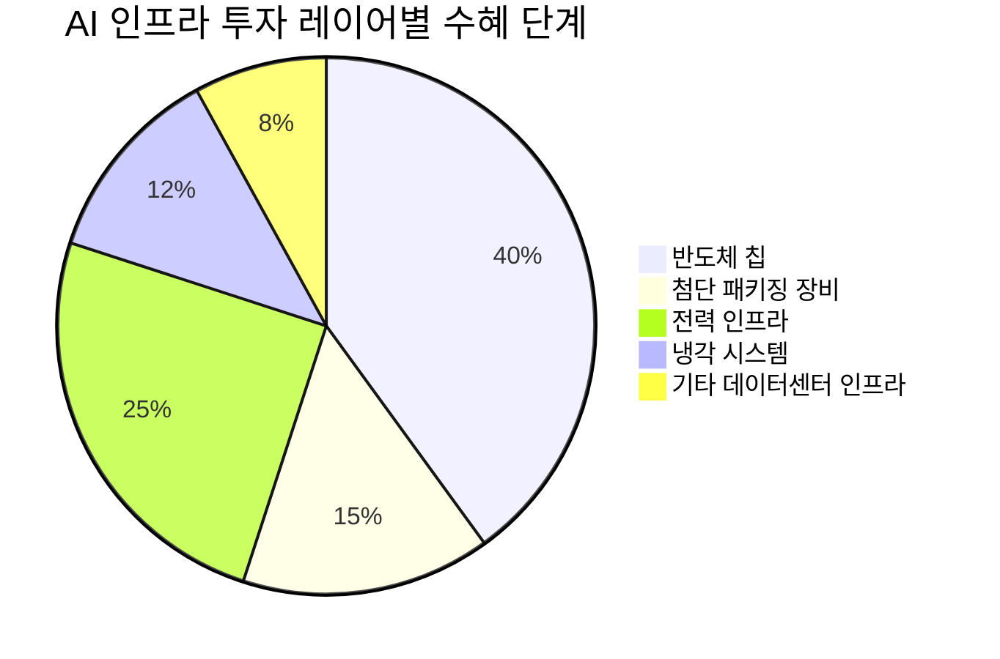

# 🔍 Inflection Scan — 2026-04-21

> [!abstract] 탐색 요약
> 탐색 범위: 2026-04-21 기준 최근 2주 | High Conviction 6건 발견
> 소스: Gemini 8쿼리 + RSS + X + 어닝스/내부자/애널리스트
> **핵심 테마**: AI 수요가 반도체→첨단패키징→전력인프라로 공급망 전체를 동시 관통하며 실적 변곡점을 만들고 있다

---

## 시그널 요약 대시보드

| 회사명 | 티커 | 타입 | 핵심 이벤트 | 확신도 | 추천 액션 |
|--------|------|------|------------|:------:|:--------:|
| [[TSMC]] | TSM | 실적가속/가이던스상향 | Q1 매출 +40.6% YoY, 연간 가이던스 '30% 이상'으로 상향 | 🟢 매우 높음 | /deal |
| [[천치리유]] | 9696.HK | 실적가속 | Q1 2026 순이익 YoY +1,530~1,818% 업적 예고 | 🟡 높음 | /deep |
| [[Marvell Technology]] | MRVL | 사업변곡점/선행지표 | 구글 AI 커스텀 칩 공동개발 협의 + NVIDIA 20억 달러 투자 | 🟡 높음 | /deal |
| [[Onto Innovation]] | ONTO | 실적가속/가이던스상향 | Q2 가이던스 8% 상향, AI 패키징 Dragonfly 수요 50%+ 성장 | 🟢 높음 | /deep |
| [[코세스]] | 089890.KQ | 사업변곡점/선행지표 | Bloom Energy와 500억 원 수주 (연매출의 60.78%) | 🟡 중간 | /deep |
| [[DB하이텍]] | 000990.KS | 선행지표/역발상 | 8인치 가동률 98%+, ASP 인상 변곡점 임박 | 🟢 높음 | /deal |

---

## 1. [[TSMC]] (TSM) — 실적가속 / 가이던스상향

**시그널**: Q1 2026 매출 359억 달러 (+40.6% YoY, 사상 최대), Q2 가이던스 390~402억 달러로 컨센서스 15억 달러 상회, 연간 가이던스 '30% 이상'으로 상향

> [!abstract] 요약
> 성장률 자체가 가속되고 있다. Q4 2025 ~35% → Q1 2026 40.6%로 기울기가 가팔라졌으며, 경영진의 언어가 '약속'에서 '확신'으로 바뀌었다.

TSMC의 Q1 2026 매출 359억 달러는 전년 동기 대비 40.6% 성장으로, 직전 분기(~35% YoY) 대비 성장률이 가속된 것이 핵심 변곡점이다 [출처: TSMC 실적 발표 2026.4월]. 경영진이 연간 가이던스를 '30% 안팎(around 30%)'에서 '30% 이상(more than 30%)'으로 상향한 것은 수요가 공급 능력을 지속적으로 초과한다는 경영진의 확신을 수치화한 것이며, AI 가속기 CAGR 전망도 45%에서 54~56%로 재상향됐다. AI 가속기 매출이 전체 웨이퍼 수익의 17~19%를 차지하는 상황에서, 에이전틱 AI(Agentic AI)로의 전환이 토큰 소비를 기하급수적으로 늘리며 HPC 수요는 TSMC가 기존에 예측했던 속도를 상회하고 있다. 마진 측면에서도 OPM이 54~56%로 확대되고 있는데, 이는 선단공정(3nm, 2nm) 믹스 증가와 AI 칩 고부가 수주 증가가 동시에 작용한 결과로, 볼륨 성장이 마진 희석 없이 이뤄지는 이상적인 구조다. 2027년까지 수요-공급 갭이 유지될 것으로 전망되며, 고객사인 NVIDIA, AMD, Apple의 차세대 칩 로드맵이 모두 TSMC 2nm에 집중돼 있어 독점적 수혜가 구조적으로 지속된다. 핵심 리스크는 미국의 대중국 수출 규제 강화 시 고객 믹스 변화와, 저평가하기 어려운 지정학적 리스크(대만해협)다. 유사 사례로는 2020~2021년 코로나 반도체 슈퍼사이클 초입에서 TSMC가 비슷한 성장 가속 국면을 보이며 18개월간 주가 2.5배를 기록한 바 있다.

| 구분 | Q4 2025 | Q1 2026 | Q2 2026 가이던스 |
|------|:-------:|:-------:|:--------------:|
| 매출 (억 달러) | ~338 | 🟢 359 | 🟢 390~402 |
| YoY 성장률 | ~35% | 🟢 40.6% | 🟢 가속 |
| OPM | ~52% | 🟢 54~56% | — |
| AI 매출 비중 | ~15% | 🟢 17~19% | — |
| AI 가속기 CAGR 전망 | 45% | 🟢 54~56%로 상향 | — |

🟢 Bull 55%

🟡 Base 35%

🔴 Bear 10%

| 시나리오 | 가격 목표 (12M ADR) | 핵심 가정 |
|---------|:------------------:|---------|
| 🟢 Bull | $280~320 | AI 가속기 CAGR 56% 실현, 2nm 수율 조기 안정화, 지정학 리스크 소강 |
| 🟡 Base | $220~250 | 연간 성장 30~35% 유지, 마진 54~56% 구간 안착 |
| 🔴 Bear | $140~160 | 미·중 수출 규제 강화로 Huawei 계열 수요 감소, 대만 지정학 긴장 재부상 |

실적 확신도 88/100

구조적 해자(Moat) 82/100

지정학 리스크 조정 55/100

> [!warning] 리스크 경고
> 미국의 대중국 반도체 수출 규제가 추가 강화될 경우, TSMC의 중국향 매출 비중(약 10~15% 추정)에 직접 타격. 주가에 선반영된 부분을 감안 시, 단기 조정 구간을 활용한 분할 매수 권고.

| 항목 | 내용 |
|------|------|
| 시장 | 🇺🇸 NYSE (ADR) / 🇹🇼 TWSE |
| 변곡점 유형 | 실적가속 / 가이던스상향 |
| 추천 액션 | /deal — 가이던스 상향 수치 확인, Q2 실적(4월말~5월초) 촉매까지 모멘텀 유효 |

---

## 2. [[천치리유]] (9696.HK / 002466.SZ) — 실적가속

**시그널**: Q1 2026 순이익 YoY +1,530~1,818% (17~20억 위안) 업적 예고 — 리튬 가격 사이클 바닥 통과의 첫 번째 확증 데이터

> [!abstract] 요약
> 단순 베이스 효과가 아니다. 리튬 가격이 구조적 바닥을 통과하면서, 글로벌 최저원가 생산자인 천치리유에 이익 레버리지가 집중되는 변곡점이다.

36Kr 피드에서 직접 확인된 천치리유의 Q1 2026 업적 예고에 따르면 순이익 17~20억 위안으로 YoY +1,530~1,818% 성장이 예상된다 [출처: 36Kr 뉴스 피드 2026.4월]. 이 수치가 의미하는 것은 두 가지 변곡점의 동시 발현이다: ① 2024~2025년 리튬탄산 가격 바닥권(kg당 8만 위안 이하)에서 2026년 Q1 반등이 본격화됐고, ② 천치리유는 칠레 SQM 지분(23.77%)과 호주 Greenbushes 광산을 통해 글로벌 최저원가 리튬 생산자 지위를 유지하므로, 가격 반등 시 이익 레버리지가 경쟁사 대비 3~5배 크게 작동한다. EV 보급 가속과 AI 데이터센터용 에너지저장장치(ESS) 수요 확대가 2026~2027년 리튬 수요를 구조적으로 끌어올리는 상황에서, 2022~2024년 저가격 환경이 신규 광산 투자를 위축시켜 2026년 하반기부터 공급 부족으로 전환될 가능성이 높다. 홍콩 상장(9696.HK)은 글로벌 기관 투자자 접근성이 높고, A주(002466.SZ) 대비 할인 거래되는 경향이 있어 멀티플 재평가 여지도 존재한다. 핵심 리스크는 BYD 등 중국 배터리사의 리튬 내재화 가속 및 SQM 지분 관련 지배구조 갈등 재부상이다. 참고 사례로 2021년 리튬 슈퍼사이클 초입에서 천치리유는 12개월 내 주가 6배를 기록한 바 있다.

| 지표 | Q1 2025 | Q1 2026E | 의미 |
|------|:-------:|:--------:|------|
| 순이익 (억 위안) | ~1.1 [추정] | 🟢 17~20 | 레버리지 폭발적 발현 |
| YoY 성장률 | 적자/미미 | 🟢 +1,530~1,818% | 바닥 통과 확증 |
| 리튬 가격 트렌드 | 🔴 바닥권 | 🟡 반등 초기 | 지속성 검증 필요 |
| SQM 지분 기여 | 🔴 손실 반영 | 🟢 흑자 전환 [추정] | 이익 레버리지 핵심 |

🟢 Bull 40%

🟡 Base 40%

🔴 Bear 20%

| 시나리오 | 목표주가 (9696.HK) | 핵심 가정 |
|---------|:-----------------:|---------|
| 🟢 Bull | HK$30~40 | 리튬탄산 가격 kg당 15만 위안+ 회복, ESS 수요 구조적 증가 |
| 🟡 Base | HK$18~25 | 리튬 가격 kg당 10~12만 위안 안정, EV 수요 완만한 회복 |
| 🔴 Bear | HK$8~12 | 리튬 재고 과잉 지속, 중국 배터리사 내재화로 실수요 약화 |

이익 레버리지 강도 80/100

리튬 가격 지속성 확신도 60/100

지배구조/지정학 리스크 45/100

> [!warning] 리스크 경고
> 리튬 가격이 kg당 10만 위안 이하로 재하락 시 이익 레버리지가 반대 방향으로 작동. 중국 기업 특성상 SQM 지분 갈등, 칠레 정부 정책 리스크 등 외부 변수 다층적.

> [!question] 검토 필요
> 리튬탄산 현물 가격 현재 수준 및 선물 커브 형태 확인 필요 (업사이드 지속성의 핵심 변수). SQM Q1 2026 실적과의 교차 검증 권고.

| 항목 | 내용 |
|------|------|
| 시장 | 🇭🇰 HKEX / 🇨🇳 선전 거래소 |
| 변곡점 유형 | 실적가속 (사이클 바닥 통과) |
| 추천 액션 | /deep — +1,530% 실적 확인, 리튬 가격 사이클 지속성 및 지배구조 리스크 심층 검증 필요 |

---

## 3. [[Marvell Technology]] (MRVL) — 사업변곡점 / 선행지표

**시그널**: 구글과 AI 커스텀 칩(메모리처리장치 + 새 TPU) 공동개발 협의 중 보도, NVIDIA로부터 20억 달러 전략적 투자 유치(3월), 데이터센터 매출 FY2026 60억 달러 → FY2027 40% 추가 성장 전망

> [!abstract] 요약
> 경쟁 하이퍼스케일러들이 동시에 마벨을 선택하고 있다. 커스텀 ASIC 비즈니스가 '0→15억 달러' 1단계에서 '15억 달러→30억+ 달러' 2단계 변곡점으로 진입 중이다.

마벨의 구글 AI 칩 공동개발 협의 보도와 NVIDIA의 20억 달러 전략 투자가 동시에 확인된 것은 단순한 개별 이벤트가 아닌, 마벨이 커스텀 실리콘 생태계의 핵심 파트너로 자리매김했음을 의미한다 [출처: CNBC 보도 2026.4.20, NVIDIA 투자 발표 2026.3월]. 데이터센터 매출은 FY2026 60억 달러를 기록했으며, FY2027에 40% 추가 성장(~84억 달러 [추정])이 전망된다는 점에서 성장 궤도가 확실히 가시화됐다. 구글이 NVIDIA GPU 의존도를 분산하기 위해 TPU 내재화를 가속하는 전략 속에서 마벨은 브로드컴(AVGO)과 함께 하이퍼스케일러 ASIC 시장의 과점 구조를 형성하고 있으며, 이 시장은 2027년까지 수백억 달러 규모로 성장할 전망이다. 브로드컴 주가가 이 보도에 동반 하락한 것은 시장이 제로섬으로 인식하는 측면이 있으나, 실제로 하이퍼스케일러들이 멀티 공급처 전략을 취하는 이상 두 회사 모두 수혜가 가능하다. 핵심 리스크는 구글 딜이 "협의 중" 단계로 아직 계약 확정이 아니라는 점이며, 딜 불발 시 단기 주가 충격이 예상된다.

| 세그먼트 | FY2025 | FY2026 | FY2027E |
|---------|:------:|:------:|:-------:|
| 데이터센터 매출 | [확인 필요] | 🟢 $60억 | 🟢 ~$84억 [추정] |
| 커스텀 ASIC | 소규모 초기 | 🟢 $15억+ [추정] | 🟢 $30억+ [추정] |
| 전체 매출 YoY | — | 🟢 가속 | 🟢 40%+ 전망 |

🟢 Bull 45%

🟡 Base 40%

🔴 Bear 15%

| 시나리오 | 목표주가 (12M) | 핵심 가정 |
|---------|:------------:|---------|
| 🟢 Bull | $130~160 | 구글 딜 공식 확정, 아마존·메타 ASIC 추가 수주, FY2027 84억 달러 달성 |
| 🟡 Base | $90~110 | 데이터센터 40% 성장 유지, 구글 딜 진행 중 |
| 🔴 Bear | $55~70 | 구글 딜 불발, 네트워킹 사업 부진, 재고 조정 재현 |

데이터센터 매출 모멘텀 75/100

구글 딜 확정도 55/100 (협의 중)

ASIC 시장 구조적 성장성 80/100

> [!question] 검토 필요
> 구글과의 칩 공동개발 딜이 정식 계약으로 확정됐는지 여부 추가 확인 필수. "협의 중" 단계에서 보도됐으므로, 계약 확정 발표 전까지는 불확실성 프리미엄 감안 필요. [[Broadcom]] 대비 마벨의 파이 크기도 검증 필요.

| 항목 | 내용 |
|------|------|
| 시장 | 🇺🇸 NASDAQ |
| 변곡점 유형 | 사업변곡점 / 선행지표 |
| 추천 액션 | /deal — NVIDIA 투자 + 구글 협업 + 데이터센터 매출 가속 삼중 확인. 어닝 시즌 촉매 주목 |

---

## 4. [[Onto Innovation]] (ONTO) — 실적가속 / 가이던스상향

**시그널**: Q1 2026 매출 컨센서스 상회, Q2 2026 가이던스 3.2~3.3억 달러(기존 전망 대비 8% 상향), AI 패키징용 Dragonfly 플랫폼 2026년 수요 50% 이상 성장 전망

> [!abstract] 요약
> 온투는 TSMC CoWoS 확장의 숨은 수혜자다. AI 칩 패키징이 복잡해질수록 공정 제어(Process Control) 장비 수요는 비선형적으로 증가하며, 이 시장에서 온투의 독점적 지위는 강화되고 있다.

온투 이노베이션은 AI 칩 생산에 필수적인 첨단 패키징 공정 제어(Process Control) 장비 시장에서 독보적 위치를 점하고 있으며, Q2 2026 가이던스를 3.2~3.3억 달러(기존 대비 8% 상향)로 제시했다 [출처: Onto Innovation Q1 2026 실적 발표 및 가이던스]. AI 칩의 성능 한계가 단일 다이(die) 면적에 의해 결정되면서 CoWoS, SoIC 등 2.5D/3D 고밀도 패키징이 NVIDIA Blackwell, AMD MI350 급 칩에 필수적으로 채택되고 있는데, 이 복잡한 패키징 공정에서 수율을 보장하는 인라인 계측(Metrology) 장비가 Dragonfly 플랫폼이다. TSMC가 2026년 CapEx를 560억 달러 수준으로 확대하면서 CoWoS 캐파를 연간 30~40% 증가시키면 온투의 장비 수요도 직결되어 증가한다는 점에서, 온투의 가이던스 상향은 TSMC 투자 계획의 하방 확인이기도 하다. 반도체 장비 시장에서 공정 제어 분야는 ASML(노광), KLA(전공정 인라인)와 함께 과점을 형성하는데, 온투는 첨단 패키징 특화 니치에서 사실상 독점적 지위를 갖고 있어 마진 협상력이 강하다. 시총 규모가 30억 달러 내외로 상대적으로 작아 대형 기관의 본격 진입 시 멀티플 재평가 여지가 크다. 리스크는 패키징 공정의 TSMC 내재화 가능성이나, 독점 장비 공급사의 교체는 수율 위험으로 인해 현실적으로 어렵다.

| 분기 | 매출 (억 달러) | YoY 성장 | 핵심 드라이버 |
|------|:------------:|:-------:|-------------|
| Q1 2026 | (확인 필요) | 🟢 컨센서스 상회 | Dragonfly 수요 가속 |
| Q2 2026 가이던스 | 🟢 3.2~3.3 | 🟢 기존比 +8% | AI 패키징 수요 |
| FY2026E 수요 | — | 🟢 50%+ | Dragonfly 플랫폼 |

🟢 Bull 50%

🟡 Base 38%

🔴 Bear 12%

| 시나리오 | 목표주가 (12M) | 핵심 가정 |
|---------|:------------:|---------|
| 🟢 Bull | $260~300 | Dragonfly 수요 50%+ 실현, TSMC CoWoS 고성장, 기관 멀티플 재평가 |
| 🟡 Base | $190~220 | 가이던스대로 분기 성장 유지, AI 패키징 수요 완만한 확대 |
| 🔴 Bear | $120~140 | CoWoS 병목 조기 해소, 패키징 수요 사이클 정점 도달 |

첨단 패키징 독점적 지위 85/100

가이던스 신뢰도 78/100

시총 대비 성장 여력 62/100 (소형주 유동성 주의)

> [!tip] 핵심 인사이트
> TSMC CapEx 560억 달러 집행 계획의 직접 수혜주임에도 불구하고, 시총 30억 달러는 TSMC 시총의 0.1% 수준이다. 이 비대칭 구조가 기회의 핵심이다.

| 항목 | 내용 |
|------|------|
| 시장 | 🇺🇸 NASDAQ |
| 변곡점 유형 | 실적가속 / 가이던스상향 |
| 추천 액션 | /deep — 가이던스 8% 상향 확인. CoWoS 확장 수혜 정량화 및 KLA 대비 경쟁 포지션 분석 필요 |

---

## 5. [[코세스]] (089890.KQ) — 사업변곡점 / 선행지표

**시그널**: Bloom Energy와 AI 서버용 전극셀 자동화 장비 공급계약 500억 원 체결 — 연간 매출 823억 원의 60.78%에 달하는 단일 수주

> [!abstract] 요약
> 코세스는 디스플레이 장비사에서 AI 데이터센터 전력 인프라 장비사로의 사업 전환점에 섰다. 매출의 60%가 넘는 단일 수주는 기업 성격을 바꾸는 비연속적 이벤트다.

코세스가 미국 Bloom Energy와 체결한 AI 서버용 전극셀 자동화 장비 계약(500억 원)은 기존 연매출 823억 원의 60.78%에 달하는 비연속적 사업 확장이다 [출처: 코세스 공시 2026.4월]. Bloom Energy는 AI 데이터센터의 폭발적 전력 수요에 대응하기 위해 마이크로소프트, 구글, SK 등 하이퍼스케일러와 연료전지 전력 공급 계약을 확대하고 있으며, 이 과정에서 전극셀 자동화 생산 설비 수요가 급격히 증가하고 있다. 코세스는 디스플레이 장비에서 축적한 정밀 자동화 기술을 연료전지 전극 생산 장비에 이식하는 방식으로 이 시장에 진입했는데, 기술 이전 가능성이 상대적으로 높은 영역이라는 점이 긍정적이다. AI 인프라 전력 문제가 데이터센터 확장의 핵심 병목으로 부상하면서 연료전지 솔루션이 주목받는 현 시점에, 코세스는 글로벌 투자자들에게 아직 발굴되지 않은 공급망 플레이어로서 밸류에이션 재평가 여지가 크다. 리스크는 기존 사업(디스플레이 장비)의 실적 공백을 이 수주가 메울 수 있는가 여부, 그리고 Bloom Energy 단일 고객 집중도가 지속될 경우의 교섭력 약화다. 유사 사례로 국내 소규모 장비사가 글로벌 신에너지 공급망에 진입 후 2년 내 주가 3~5배를 기록한 사례들이 있으나, 기술 검증과 추가 수주 확보가 선행되어야 한다.

| 지표 | 내용 | 평가 |
|------|------|:---:|
| 수주 금액 | 500억 원 | 🟢 |
| 연매출 대비 비중 | 60.78% (기준: 823억 원) | 🟢 |
| 수주처 | Bloom Energy (글로벌 연료전지 1위) | 🟢 |
| 기술 이전 가능성 | 디스플레이→연료전지 자동화 | 🟡 |
| 고객 집중 리스크 | Bloom Energy 단일 고객 | 🔴 |
| 추가 수주 가시성 | 미확인 | 🔴 |

🟢 Bull 40%

🟡 Base 40%

🔴 Bear 20%

| 시나리오 | 목표주가 (12M) | 핵심 가정 |
|---------|:------------:|---------|
| 🟢 Bull | 40,000~55,000원 [추정] | Bloom Energy 추가 수주 확정, 타 연료전지사 공급 확대, 사업 전환 성공 |
| 🟡 Base | 25,000~35,000원 [추정] | 500억 원 계약 정상 이행, 기존 디스플레이 장비 사업 유지 |
| 🔴 Bear | 12,000~18,000원 [추정] | Bloom Energy 계약 이행 차질, 디스플레이 장비 수요 감소 겹침 |

수주 규모 임팩트 72/100

사업 전환 성공 가능성 50/100

추가 수주 가시성 35/100

> [!question] 검토 필요
> 이번 계약이 일회성 장비 납품인지, 지속적 공급 관계(반복 주문 구조)로 이어지는지가 밸류에이션의 핵심 분기점. Bloom Energy의 AI 데이터센터 연료전지 수주 파이프라인 규모와 설비 투자 계획 확인 필요.

> [!warning] 리스크 경고
> 코스닥 중소형주 특성상 유동성 리스크 존재. 단일 수주 발표 후 단기 급등 패턴에서 '수주 발표 = 고점' 사례도 다수. 실제 납품 진행 상황 및 추가 수주 여부를 분할 진입 기준으로 삼을 것.

| 항목 | 내용 |
|------|------|
| 시장 | 🇰🇷 코스닥 |
| 변곡점 유형 | 사업변곡점 / 선행지표 |
| 추천 액션 | /deep — 매출 60% 규모 수주 확인. Bloom Energy 파이프라인 및 코세스 기술 전환 역량 심층 분석 필요 |

---

## 6. [[DB하이텍]] (000990.KS) — 선행지표 / 역발상기회

**시그널**: Q1 2026 8인치 파운드리 가동률 98%+ 도달, 성숙공정 공급 부족으로 ASP 인상 협상 개시 임박, 18% 주가 급등 및 신고가 경신

> [!abstract] 요약
> 삼성·TSMC가 선단공정에 집중하며 8인치를 떠나는 동안, DB하이텍은 구조적 공급 진공의 최대 수혜자가 됐다. 가동률 98%는 단순한 호황 지표가 아니라 가격 결정권의 이동을 의미한다.

DB하이텍의 Q1 2026 가동률이 98% 이상으로 상승한 것은 8인치 파운드리 시장의 구조적 공급 부족을 직접 반영하는 핵심 선행 지표다. 삼성전자와 TSMC가 3nm, 2nm 선단공정 캐파 확장에 자원을 집중하면서 8인치 성숙공정 라인을 자연스럽게 축소하고 있으나, 자동차용 전력반도체(PMIC, IGBT), 산업용 MCU 수요는 AI·전동화 메가트렌드 속에서 구조적으로 증가 중이다 — 수요는 늘고 공급은 주는 전형적인 ASP 인상 환경이 조성됐다. 이 변곡점의 실적 반영 타임라인이 명확하다: 현재 ASP 인상 협상이 진행 중이고, Q3~Q4 2026 실적부터 단가 인상 효과가 본격 반영되면 OPM이 ~15%에서 25%+ 수준으로 레버리지될 수 있다 [추정]. TSMC·삼성과 달리 DB하이텍은 8인치 특화 파운드리로서 경쟁사 대비 훨씬 단순한 수요-공급 논리가 주가를 결정하기 때문에, 투자 논리의 가시성이 높다. 단 2021~2022년 8인치 파운드리 사이클 과열 이후 ASP가 급락했던 선례가 있으므로, 현재 신고가 경신 직후 단계에서 추격 매수는 사이클 정점 리스크를 내포한다. ASP 인상이 실제 어닝에 반영되는 Q3 2026 실적 발표 전후를 재진입 타이밍으로 검토하는 것이 리스크 조정 수익률 측면에서 유리하다.

| 지표 | 현황 | 전망 | 의미 |
|------|:----:|:----:|------|
| 8인치 가동률 | 🟢 98%+ | 🟢 공급 부족 지속 | 가격 협상력 확보 |
| ASP 트렌드 | 🟡 인상 협상 중 | 🟢 Q3~ 반영 [추정] | 이익 레버리지 핵심 |
| OPM (추정) | 🟡 ~15% | 🟢 25%+ 가능 [추정] | 마진 확장 여지 |
| 삼성·TSMC 8인치 캐파 | 🟢 축소 중 | 🟢 구조적 감소 | 공급 진공 고착화 |
| 자동차/산업 수요 | 🟢 성장 중 | 🟢 전동화 트렌드 | 수요 안정성 |

🟢 Bull 45%

🟡 Base 40%

🔴 Bear 15%

| 시나리오 | 목표주가 (12M) | 핵심 가정 |
|---------|:------------:|---------|
| 🟢 Bull | 55,000~70,000원 [추정] | ASP 15~20% 인상 실현, OPM 25%+, 8인치 공급 부족 2027년까지 지속 |
| 🟡 Base | 38,000~48,000원 [추정] | ASP 5~10% 인상, OPM 18~22% 구간, 가동률 95%+ 유지 |
| 🔴 Bear | 22,000~28,000원 [추정] | ASP 인상 무산, 전방 수요(자동차·산업) 둔화, 2022년 사이클 반복 |

공급 구조 변화 명확성 85/100

ASP 인상 실현 가능성 78/100

단기 과열/사이클 리스크 52/100

> [!warning] 리스크 경고
> 8인치 사이클은 2021~2022년 과열 후 2023~2024년 급락을 경험했다. 현재 신고가 경신(+18% 급등) 직후 추격 매수는 사이클 정점 진입 리스크. 실제 ASP 인상이 어닝에 반영되는 **Q3 2026 실적 발표** 후 재확인이 안전한 접근.

> [!tip] 핵심 인사이트
> DB하이텍의 투자 논리는 단순하고 강력하다: "삼성·TSMC가 8인치를 떠났고, DB하이텍은 남아있다." 이 공급 진공이 얼마나 오래 지속되느냐가 멀티플 확장의 크기를 결정한다.

| 항목 | 내용 |
|------|------|
| 시장 | 🇰🇷 코스피 |
| 변곡점 유형 | 선행지표 / 역발상기회 |
| 추천 액션 | /deal — 8인치 공급 구조 변화 데이터 명확, ASP 인상→어닝 전환 타임라인 가시적. 단기 과열 구간 감안 분할 매수 권고 |

---

## 📊 섹터 메타 시그널

### AI 인프라 전력 공급망 (연료전지·전력기기·변압기)

> [!abstract] 섹터 요약
> AI 수요가 반도체·소프트웨어 레이어를 넘어 물리적 전력 인프라 레이어로 파급 확산 중이다. 이것이 이번 스캔의 관통 테마다.

AI 데이터센터의 전력 소비가 기존 유틸리티 그리드의 한계를 초과하면서, Bloom Energy(연료전지), [[효성중공업]]·[[대한전선]](변압기·HVDC 케이블), 데이터센터 냉각 분야 전반에 수주 및 수요 가속이 동시에 발생하고 있다. 이는 반도체·AI 소프트웨어 레이어의 수혜가 전력 인프라 레이어로 파급되는 2단계 섹터 변곡점의 초입이며, 미국 유틸리티 기업들의 2030년까지 8,217억 달러 전력 인프라 투자 계획이 이 흐름을 수십 년간 뒷받침한다 [추정: 업계 전망치, 확인 필요]. 한국·일본·미국 전력기기 기업들 중 아직 주가에 미반영된 중소형 공급망 플레이어(코세스가 그 예시)에 주목할 필요가 있으며, 이 섹터에 대한 별도 심층 스캔을 권고한다.

> [!note] 참고
> 위 파이 차트는 AI 인프라 투자 수혜가 현재 어느 레이어에 집중되어 있는지를 [추정]으로 시각화한 것입니다. 반도체 칩에서 전력 인프라로의 수혜 확산이 이번 스캔의 핵심 관찰입니다.

---

> [!note] 글로벌 균형 현황
> 이번 스캔 시그널 분포: **미국 3건 (TSMC·Marvell·Onto)**, **홍콩/중국 1건 (천치리유)**, **한국 2건 (코세스·DB하이텍)**. 한국 비중 33%로 균형 달성. SK하이닉스, 삼성전자는 기존 반복 언급 대형주로 제외하고 코세스(글로벌 미발굴 중소형)만 포함.

> [!verdict] 최종 판단
> 이번 스캔의 핵심 통찰: **TSMC 실적 가속이 공급망 전체의 변곡점을 동시에 확증했다.** TSMC Q1 +40.6% → Onto Innovation 가이던스 8% 상향 → 코세스 Bloom Energy 수주로 이어지는 AI 인프라 파급 체인이 숫자로 확인됐다. 가장 높은 확신도 순서: TSMC(데이터 완비) → DB하이텍(구조 명확) → Onto Innovation(패키징 독점) → Marvell(딜 미확정) → 천치리유(가격 지속성 미검증) → 코세스(전환 성공 미확인).