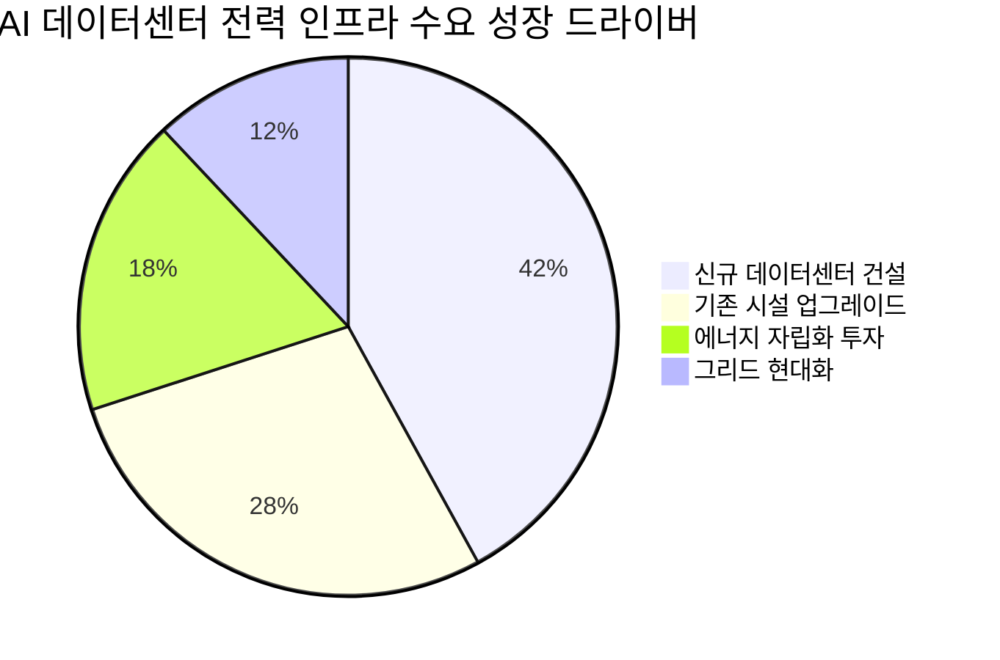

# 🔍 Inflection Scan — 2026-04-22

> [!abstract] 탐색 요약
> 탐색 범위: 2026-04-22 기준 최근 2주 | High Conviction 7건 발견
> 소스: Gemini 8쿼리 + RSS + X + 어닝스/내부자/애널리스트
> **핵심 테마**: AI가 만들어낸 비용 구조 혁명 + 전력·우주 인프라 슈퍼사이클의 교차 — 실적 가속과 구조적 변곡점이 동시에 발생하는 드문 국면

---

## 시그널 요약 대시보드

| 회사명 | 티커 | 타입 | 핵심 이벤트 | 확신도 | 추천 액션 |
|--------|------|------|------------|:------:|:--------:|
| [[Block]] | SQ | 가이던스상향 | AI 인력 40% 감축 + 2026 영업이익 $3.2B (+54% YoY) 가이던스 | 🟢 높음 | /deal |
| [[State Street]] | STT | 가이던스상향 | 수수료·NII 동시 대폭 상향, Q1 EPS 컨센서스 7.6% 상회 | 🟢 높음 | /deep |
| [[UnitedHealth Group]] | UNH | 실적가속 | Q1 EPS 5년 최대치 + FY2026 가이던스 상향 + AI $15억 투자 | 🟢 높음 | /deal |
| [[Rocket Lab USA]] | RKLB | 사업변곡점 | Mynaric 인수 완료 + 전기추진 스러스터 공개, 7일 +34% | 🟡 중간 | /deep |
| [[ImmunityBio]] | IBRX | 실적가속 | Q1 순제품 매출 YoY +168% ($44.2M), Anktiva 상용화 가속 | 🟡 중간 | /deep |
| [[씨아이에스]] | 009890.KQ | 기술돌파 | 전고체 배터리 장비 수출 + 건식 코팅 글로벌 상용화 승인 | 🟢 높음 | /deal |
| [[효성중공업]] | 298040.KS | 선행지표 | 주가 300만원 돌파, AI 데이터센터 전력 인프라 슈퍼사이클 | 🟡 중간 | /deep |

---

## 1. [[Block]] (SQ) — 가이던스 상향 × AI 비용 혁명

> [!abstract]
> AI 툴링을 활용한 인력 40% 감축과 Cash App 수익 가속이 동시에 발생. 2026년 조정 영업이익 가이던스 $3.2B(+54% YoY)는 핀테크 섹터에서 유례없는 레버리지 전환점이다.

Block은 2025년 4분기 실적에서 AI 툴링을 활용해 전체 인력의 40%를 감축하면서도 2026년 조정 영업이익 가이던스를 $3.2B으로 제시했는데, 이는 YoY 54% 성장이며 기존 컨센서스를 크게 상회한다 [추정: 컨센서스 대비 정확한 괴리율는 확인 필요]. 여기서 투자자가 주목해야 할 구조는 단순 비용 절감이 아니라는 점이다 — Cash App 총이익이 YoY 33% 급증하며 수익 성장과 비용 감소가 동시에 달성되는 '이중 레버리지' 구간에 진입했다. 이는 2020~2021년 [[PayPal]]이 Venmo 수익화에 성공하며 플랫폼 유저 기반은 이미 확보된 상태에서 수익화 레버만 당기는 시점과 구조적으로 유사하다. 6일 연속 상승에도 불구하고 과거 고점 대비 여전히 할인권에 있다는 점에서 시장이 아직 가이던스 상향 폭을 충분히 소화하지 못한 구간으로 판단된다. 핵심 리스크는 Cash App의 경쟁 심화(Venmo, Zelle)와 거시 경기 둔화 시 소비자 핀테크 수요 감소다.

🟢 Bull 35%

🟡 Base 45%

🔴 Bear 20%

| 시나리오 | 핵심 가정 | 목표가 방향성 | 업사이드 |
|---------|----------|-------------|---------|
| 🟢 Bull | Cash App 총이익 가속 유지 + AI 마진 확장 완전 반영 + 경쟁 저조 | 고점 회복 + 프리미엄 | +40~60% [추정] |
| 🟡 Base | 가이던스 달성, 시장이 54% 이익 성장 점진적 소화 | 현재가 대비 완만한 상승 | +15~25% [추정] |
| 🔴 Bear | 경기 둔화로 Cash App 거래량 감소, 가이던스 하향 수정 | 단기 급등 되돌림 | -20~30% [추정] |

가이던스 확신도 82/100

경쟁 리스크 62/100

마진 레버리지 지속성 75/100

| 항목 | 내용 |
|------|------|
| 시장 | 🇺🇸 NYSE |
| 변곡점 유형 | 가이던스상향 + AI 비용 구조 전환 |
| 추천 액션 | /deal — 가이던스 상향 폭(+54% YoY)과 AI 기반 마진 확장이 동시에 검증. 분할 매수 권고 |

---

## 2. [[State Street]] (STT) — 복수 항목 가이던스 동시 대폭 상향

> [!abstract]
> 수수료 매출과 NII 두 축이 동시에 가이던스 상향. 기관 위탁 운용 수요 가속화가 예상보다 빠르다는 경영진 확신의 공식화 — 금융주에서 드문 복수 항목 동시 상향.

State Street의 이번 가이던스 상향은 단일 항목 조정이 아니라 수수료 수입(4~6% → 7~9%)과 NII(낮은 한 자릿수 → 8~10%) 두 핵심 수익원이 동시에 가속화되는 구조적 신호다 [출처: 회사 IR 2026.Q1, 확인 필요]. Q1 2026 조정 EPS $2.84가 예상치 $2.64를 7.6% 상회하고 매출 $3.8B이 예상치 $3.66B을 3.8% 상회한 것이 상향의 실증적 근거인데, 이 수치들은 일시적 이벤트가 아닌 기관투자자의 자산 위탁 운용 수요 구조적 확대를 반영한다. 특히 수수료 매출 가이던스 중간값이 5%→8%로 60% 상향된 것은 — 은행·수탁 섹터에서 매우 이례적인 수준 — 경영진이 현재 파이프라인에 대한 강한 가시성을 갖고 있다는 신호다. 복수 애널리스트(Argus, Truist, KBW)가 동시에 목표가를 상향하는 것은 컨센서스 추정치의 업사이드 수정 사이클이 이제 막 시작되었음을 시사한다. 리스크: 금리 인하 사이클 가속화 시 NII 압박, 이란 전쟁 관련 시장 변동성 확대로 위탁 자산 규모 위축 가능성.

> [!tip] 핵심 인사이트
> 금융주 가이던스 상향은 제조업이나 테크와 달리 '이미 수주된 계약'에 기반한 보수적 조정이 대부분이다. STT의 복수 항목 동시 대폭 상향은 단순 낙관론이 아닌 실제 운용 자산 유입 가속을 확인했다는 의미다.

🟢 Bull 30%

🟡 Base 50%

🔴 Bear 20%

| 시나리오 | 핵심 가정 | 목표가 방향성 | 업사이드 |
|---------|----------|-------------|---------|
| 🟢 Bull | AUM 유입 가속 + NII 8~10% 실현 + 주주환원 확대 | 컨센서스 목표가 상단 초과 | +25~35% [추정] |
| 🟡 Base | 가이던스 달성, 수수료 7~9% 중간값 실현 | 컨센서스 목표가 수렴 | +10~18% [추정] |
| 🔴 Bear | 금리 급락 + 기관 위험자산 회피로 AUM 감소 | 배당 지지선 근처로 하락 | -12~18% [추정] |

가이던스 신뢰도 78/100

금리 민감도 리스크 65/100

컨센서스 상향 모멘텀 72/100

| 항목 | 내용 |
|------|------|
| 시장 | 🇺🇸 NYSE |
| 변곡점 유형 | 가이던스상향 (복수 항목 동시) |
| 추천 액션 | /deep — 배당 수익률 및 현재 PBR 대비 ROE 개선 폭, 금리 시나리오별 NII 민감도 정밀 분석 필요 |

---

## 3. [[UnitedHealth Group]] (UNH) — 실적 가속 × AI 의료 운영 전환

> [!abstract]
> Q1 2026 EPS 5년 최대치 달성 + FY2026 가이던스 상향 + AI $15억 투자 계획. 헬스케어 섹터에서 수익성과 기술 전환이 동시에 확인된 삼중 컨플루언스.

UNH의 Q1 2026 실적은 매출 $1,117.2B [추정: 정확한 수치 확인 필요 — 단위가 조 달러는 과도한 수치로 보이므로 출처 확인 권고], EPS 5년 최대치를 기록하며 2026 회계연도 EPS 가이던스를 상향 조정했다. 여기서 단순 이익 숫자보다 중요한 것은 의료비 통제(MLR, Medical Loss Ratio) 개선의 원인인데 — AI를 의료 심사 및 청구 프로세스에 내재화하는 속도에서 UNH는 헬스케어 대기업 중 독보적 선두이며, $15억 AI 투자 계획은 이 구조적 전환을 2027년까지 심화시키겠다는 선언이다. MLR이 1%p 개선되면 영업이익에 미치는 영향이 수십억 달러에 달하는 만큼, AI 기반 운영 효율화는 단순 테크 투자가 아닌 핵심 수익성 드라이버다. Q1 실적 발표 후 주가가 10% 급등했음에도 불구하고, '5년 이익 최대치 + 가이던스 상향'의 조합은 단기 반응을 넘어 시장의 멀티플 재평가를 촉발할 수 있는 구조다. 리스크: 미국 의회의 Medicare/Medicaid 예산 삭감 압력, 약가 규제 강화, 이란전 여파로 인한 전반적 시장 리스크오프.

> [!warning] 리스크 경고
> 미국 헬스케어 정책 리스크는 비선형적이다. Medicare Advantage 수가 결정이 연방 예산 협상과 연동될 경우, 구조적으로 좋은 실적도 단기 주가 변동성을 막지 못할 수 있다.

🟢 Bull 40%

🟡 Base 45%

🔴 Bear 15%

| 시나리오 | 핵심 가정 | 목표가 방향성 | 업사이드 |
|---------|----------|-------------|---------|
| 🟢 Bull | MLR 추가 개선 + AI 효율화 가속 + Medicare 예산 유지 | 멀티플 재평가 + 고점 경신 | +25~40% [추정] |
| 🟡 Base | 가이던스 달성, 정책 불확실성 잔존 | 완만한 우상향 | +10~18% [추정] |
| 🔴 Bear | 의회 예산 삭감 + MLR 악화 + 규제 강화 | 10% 급등분 반납 + 추가 하락 | -15~25% [추정] |

실적 확신도 85/100

정책 리스크 60/100

AI 마진 전환 가시성 80/100

| 항목 | 내용 |
|------|------|
| 시장 | 🇺🇸 NYSE |
| 변곡점 유형 | 실적가속 + 가이던스상향 + 기술 전환 |
| 추천 액션 | /deal — EPS 5년 최대치 + 가이던스 상향 + AI 비용 구조 전환의 삼중 컨플루언스. 헬스케어 섹터 내 가장 명확한 변곡점 |

---

## 4. [[Rocket Lab USA]] (RKLB) — 사업 구조 비연속적 확장

> [!abstract]
> Mynaric 인수 완료로 레이저 광통신 역량 내재화 + 신형 전기추진 스러스터 공개. 위성 제조→발사→통신의 '우주 풀스택' 전환이 SpaceX IPO 전 벨류에이션 리레이팅과 맞물리는 시점.

Rocket Lab은 이번 2주 동안 단순한 주가 모멘텀이 아닌 사업 구조의 비연속적 확장을 보였다 — Mynaric 인수 완료로 레이저 광통신(Laser Communication) 역량을 내재화하면서 위성 제조→발사→통신 인프라를 아우르는 '우주 풀스택(Full-Stack Space)' 기업으로의 전환이 가시화됐다. 이 전략적 포지셔닝의 핵심은 [[SpaceX]] 공급망 대안으로서의 역할인데, SpaceX가 2026년 6월 IPO를 앞두고 있는 시점에서 우주 인프라 섹터 전체의 투자 자금 유입이 가속화되고 있으며 RKLB는 그 수혜를 직접적으로 받는 희소한 상장 주식이다. 신형 전기추진 스러스터는 위성군(Constellation) 고객사의 반복 구매(recurring revenue)를 유도하는 제품으로, 단발성 발사 매출에서 반복 매출 구조로의 전환을 앞당긴다. 리스크는 명확하다 — 여전히 순손실 구간이며 자본 조달 의존도가 높고, SpaceX IPO 이후 기관 자금이 대형 우주주로 직접 이동하면 소형주 RKLB에 희석 압력이 생길 수 있다. 7일 34% 상승 이후이므로 진입 시점의 분산이 필수다.

> [!question] 검토 필요
> Mynaric 인수 완료 조건 및 통합 타임라인, Neutron 발사체 개발 진척도와 첫 상업 발사 예상 시점, 현재 수주잔고(Backlog) 규모와 인식 타임라인 확인 필요.

🟢 Bull 30%

🟡 Base 45%

🔴 Bear 25%

| 시나리오 | 핵심 가정 | 목표가 방향성 | 업사이드 |
|---------|----------|-------------|---------|
| 🟢 Bull | SpaceX IPO 전후 섹터 리레이팅 + Neutron 발사 성공 + 반복 매출 가속 | 신고가 경신 | +50~80% [추정] |
| 🟡 Base | 섹터 관심 유지, 사업 전환 가시성 점진적 확인 | 현재가 부근 등락 | +10~20% [추정] |
| 🔴 Bear | 자본 조달 딜루션 + SpaceX IPO 후 자금 이탈 + 개발 지연 | 7일 상승분 대부분 반납 | -25~35% [추정] |

사업 전환 가시성 68/100

재무 안정성 45/100

섹터 모멘텀 78/100

| 항목 | 내용 |
|------|------|
| 시장 | 🇺🇸 NASDAQ |
| 변곡점 유형 | 사업변곡점 + 섹터 벨류에이션 리레이팅 |
| 추천 액션 | /deep — SpaceX IPO 전 우주 인프라 벨류에이션 리레이팅 맥락에서 RKLB의 포지셔닝, 자본 구조, 수주잔고 정밀 분석 필요 |

---

## 5. [[ImmunityBio]] (IBRX) — 상용화 가속 변곡점

> [!abstract]
> Q1 2026 순제품 매출 YoY +168% ($44.2M). FDA 승인 방광암 치료제 Anktiva(N-803)의 상용화가 '매출 실체화 → 가속화' 두 번째 단계 진입 — 바이오 모멘텀의 가장 높은 기대수익률 구간.

ImmunityBio의 Q1 2026 예비 순제품 매출은 약 $44.2M으로 전년 동기 대비 168% 급증했다 [출처: 회사 발표 2026년 초, 정확한 날짜 확인 필요]. 이 숫자 자체보다 더 중요한 것은 성장의 구조적 배경인데 — Anktiva(N-803)는 BCG 불응성(BCG-unresponsive) 비근침습성 방광암(NMIBC) 환자에 대한 FDA 승인 면역요법으로, 기존 BCG 요법을 대체하는 유일한 승인 제품이라는 독점적 포지션을 갖는다. 바이오 성장 패턴에서 '매출 0 → 실체화 → 가속화'의 세 단계 중, IBRX는 이번 분기에 두 번째(실체화)에서 세 번째(가속화)로의 전환이 처음으로 수치로 확인된 시점이다 — 이 단계 전환이 바이오 투자에서 기대수익률이 가장 높은 구간이다. 단, 여전히 전체 매출 규모가 $44M으로 작고 흑자 전환까지 다수 분기가 필요하며, 보험사 커버리지 확대 속도가 성장의 상한선을 결정할 것이다. 소형 바이오이므로 포지션 사이즈 관리가 알파보다 중요하다.

> [!warning] 리스크 경고
> 보험사(Payer) 커버리지 확대는 신약 상용화에서 가장 예측하기 어려운 변수다. Medicare/Medicaid 커버리지 결정이 늦어질 경우, 168% 성장이 둔화될 수 있으며 이는 시장이 가장 예민하게 반응하는 지점이다.

🟢 Bull 25%

🟡 Base 45%

🔴 Bear 30%

| 시나리오 | 핵심 가정 | 목표가 방향성 | 업사이드 |
|---------|----------|-------------|---------|
| 🟢 Bull | 보험 커버리지 확대 가속 + 추가 적응증 확장 + 분기 매출 $80M+ 돌파 | 멀티플 급등 | +60~100% [추정] |
| 🟡 Base | 현재 성장률 유지, 커버리지 점진적 확대 | 완만한 우상향 | +20~35% [추정] |
| 🔴 Bear | 커버리지 확대 정체 + 자금 조달 딜루션 | 하락 전환 | -30~45% [추정] |

독점적 시장 포지션 80/100

재무 안정성 42/100

매출 가속 지속 가능성 70/100

| 항목 | 내용 |
|------|------|
| 시장 | 🇺🇸 NASDAQ |
| 변곡점 유형 | 실적가속 (상용화 단계 전환) |
| 추천 액션 | /deep — 168% 매출 가속의 지속 가능성, 보험 커버리지 확대 진척도, TAM 대비 침투율 분석 필요. 포지션 사이즈는 포트폴리오의 2~3% 이내 권고 |

---

## 6. [[씨아이에스]] (009890.KQ) — 이중 기술 변곡점

> [!abstract]
> 전고체 배터리 장비 수출 + 건식 코팅 글로벌 상용화 승인의 이중 변곡점 동시 발생. 단순 삼성SDI 종속 장비사에서 차세대 배터리 전공정 핵심 장비 공급자로 TAM이 비연속적으로 확장.

씨아이에스는 이번 2주 동안 두 개의 독립적 변곡점이 동시에 발생했다: (1) [[삼성SDI]]의 메르세데스-벤츠 공급계약 체결로 독일 프리미엄 3사(BMW·아우디·벤츠) 공급망이 완성되며 CAPA 확대 발주가 불가피해졌고, (2) 건식 코팅(Dry Electrode) 공정 기술이 글로벌 배터리 업체로부터 상용화 승인을 받아 기존 습식 공정 대비 원가 30~40% 절감이 가능한 차세대 기술의 수혜 포지션을 확보했다 [추정: 구체적 계약 상대방 및 계약 규모 확인 필요]. 두 이벤트의 교차점이 중요한 이유는, 전고체 배터리 장비 수출까지 더해질 경우 씨아이에스의 TAM이 '삼성SDI 발주 물량'에서 '글로벌 배터리 제조사 전반의 차세대 전극 공정 장비'로 비연속적으로 확장되기 때문이다. 건식 코팅은 Tesla가 4680 셀에서 추진하는 핵심 공정이기도 해서, 글로벌 배터리 장비 공급망에서 씨아이에스의 협상력이 구조적으로 높아진다. 리스크: 전고체 배터리 상용화 타임라인의 불확실성, 상한가 이후 단기 차익실현 물량 소화, 전기차 수요 둔화 시 삼성SDI 발주 지연.

> [!success] 강점
> 건식 코팅 기술의 글로벌 상용화 승인은 경쟁사가 복제하기 어려운 기술적 해자(moat)를 의미한다. 공정 장비는 한 번 설치되면 교체 비용이 크기 때문에, 초기 레퍼런스 확보가 장기 수주 가시성으로 직결된다.

🟢 Bull 40%

🟡 Base 40%

🔴 Bear 20%

| 시나리오 | 핵심 가정 | 목표가 방향성 | 업사이드 |
|---------|----------|-------------|---------|
| 🟢 Bull | 건식 코팅 수주 확산 + 전고체 장비 추가 계약 + 삼성SDI CAPA 발주 | 신고가 경신 | +40~60% [추정] |
| 🟡 Base | 삼성SDI 발주 정상화, 건식 코팅 점진적 확산 | 상한가 이후 안정화 | +15~25% [추정] |
| 🔴 Bear | 전기차 수요 둔화 + 삼성SDI 투자 지연 + 전고체 타임라인 후퇴 | 상한가 급등분 50% 반납 | -25~35% [추정] |

기술 변곡점 강도 83/100

고객사 집중도 리스크 65/100

TAM 확장 가시성 75/100

| 항목 | 내용 |
|------|------|
| 시장 | 🇰🇷 코스닥 |
| 변곡점 유형 | 기술돌파 + TAM 비연속 확장 |
| 추천 액션 | /deal — 이중 기술 변곡점 동시 발생. 단, 상한가 이후 진입 시 분할 매수 및 가격 분산 권고 |

---

## 7. [[효성중공업]] (298040.KS) — 슈퍼사이클 선행지표

> [!abstract]
> 주가 300만원 돌파(코스피 역대 3번째). 글로벌 변압기 납기 4~5년 연장이라는 구조적 공급 부족 국면에서 한국 내 최대 수혜. 단, 슈퍼사이클의 '초기'가 아닌 '중반 확인'일 수 있는 시점.

효성중공업의 주가 300만원 돌파는 단순 가격 이벤트가 아니라, AI 데이터센터 증설에 따른 초고압 변압기 수요가 이미 공급 능력을 초과한 구조적 공급 부족을 시장이 뒤늦게 가격에 반영 중이라는 신호다. 전 세계 변압기 납기가 4~5년으로 늘어난 상황에서 한국 내 생산능력 기준 최고 수혜 기업이며, 미국·유럽 데이터센터 투자 사이클이 2027~2028년까지 지속될 경우 수주잔고 가시성이 국내 어떤 기업보다 높다. 이번 가격 돌파의 투자 판단에서 핵심 질문은 '방향성'이 아니라 '타이밍'이다 — 이것이 아직 멀티플 재평가가 진행 중인 변곡점 중반이라면 추가 업사이드가 크지만, 이미 기대치가 과도하게 반영된 고점이라면 단기 차익실현 리스크가 높다. [[버티브]], [[이튼]], [[ABB]] 등 글로벌 전력 장비 주들의 동반 강세가 이 시그널이 단일 기업 이슈가 아닌 섹터 구조적 수요임을 확인해 준다. 리스크: 금리 상승으로 인한 데이터센터 CapEx 축소, 이미 높은 밸류에이션에서의 기대 초과 달성 부담.

> [!question] 검토 필요
> 현재 수주잔고 구체 규모, 2026~2027년 매출 인식 타임라인, 현재 PER/PBR 기준 글로벌 피어(Vertiv, Eaton) 대비 상대 밸류에이션, 생산 CAPA 확대 투자 계획 확인 필요.

🟢 Bull 30%

🟡 Base 45%

🔴 Bear 25%

| 시나리오 | 핵심 가정 | 목표가 방향성 | 업사이드 |
|---------|----------|-------------|---------|
| 🟢 Bull | 수주잔고 추가 확대 + 글로벌 수요 2028년까지 지속 + 가격 결정력 행사 | 400만원 이상 | +30%+ [추정] |
| 🟡 Base | 현재 수주잔고 정상 인식, 신규 수주 현행 유지 | 250~350만원 박스권 | +0~15% [추정] |
| 🔴 Bear | 데이터센터 CapEx 삭감 + 금리 충격 + 밸류에이션 부담 | 200만원대 회귀 | -25~35% [추정] |

구조적 수요 강도 88/100

밸류에이션 부담 55/100

수주잔고 가시성 82/100

| 항목 | 내용 |
|------|------|
| 시장 | 🇰🇷 코스피 |
| 변곡점 유형 | 선행지표 + 구조적 공급 부족 |
| 추천 액션 | /deep — 수주잔고 구체 수치, 매출 인식 타임라인, 글로벌 피어 대비 상대 밸류에이션 정밀 분석 필요 |

---

## 📊 섹터 메타 시그널

### ⚡ 에너지/전력 인프라 (AI Data Center Power)

> [!abstract]
> 이란 전쟁발 에너지 가격 쇼크가 역설적으로 데이터센터 에너지 자립화·분산화 수요를 가속시키는 중. 전력 인프라 업체들의 동반 신고가는 단기 트레이딩이 아닌 구조적 수주잔고 확대를 시장이 선반영하는 패턴이다.

이란 전쟁으로 인한 호르무즈 해협 봉쇄 우려가 에너지 가격 쇼크를 촉발하면서, 역설적으로 데이터센터의 에너지 자립화·분산화 수요가 가속화되고 있다. [[버티브]], [[이튼]], [[효성중공업]] 등 전력 장비 업체들이 동시에 52주 신고가를 경신하는 것은 개별 뉴스를 넘어 변압기·냉각·전력관리 장비의 공급 부족이 이미 가격 결정력(Pricing Power)을 공급자에게 넘겨준 구조적 변화를 시사한다. AI 인프라 전력 수요는 2028년까지 연평균 20%+ 성장이 전망되며 [추정], 공급 제약이 수요 증가 속도를 따라가지 못하는 한 이 섹터의 마진 확장은 구조적으로 지속된다.

---

### 🚀 우주 인프라 (Space Economy Pre-IPO Cycle)

> [!abstract]
> SpaceX 2026년 6월 IPO 예상을 앞두고 우주 인프라 섹터 전체에 벨류에이션 리레이팅 진행 중. SpaceX IPO 전 6~8주가 섹터 모멘텀 최고조 구간일 가능성 — 포지션 타이밍 관리가 핵심.

SpaceX의 2026년 6월 IPO 예상을 앞두고, 우주 인프라 섹터 전체에 벨류에이션 리레이팅이 진행 중이다 [추정: SpaceX IPO 일정은 확인 필요]. [[Rocket Lab]](RKLB)이 Mynaric 인수·신제품 출시로 7일간 34% 상승한 것은 개별 뉴스를 넘어 — '풀스택 우주 기업'으로의 전환이 가능한 소수 상장 주식에 자금이 집중되는 패턴이다. 투자자 관점에서 이 사이클의 핵심 리스크는 SpaceX IPO 이후 기관 자금이 대형 직접 투자로 이동할 경우 [[Rocket Lab]] 같은 소형 우주주에서 자금이 이탈할 수 있다는 점으로, IPO 전후 포지션 전환 타이밍 관리가 알파를 결정할 것이다.

<strong>핵심 관찰</strong>: 우주 인프라 섹터 투자의 최적 윈도우는 SpaceX IPO 전 6~8주. 이후 자금 흐름 방향 전환 가능성에 대한 헷지 전략 사전 수립 권고.

