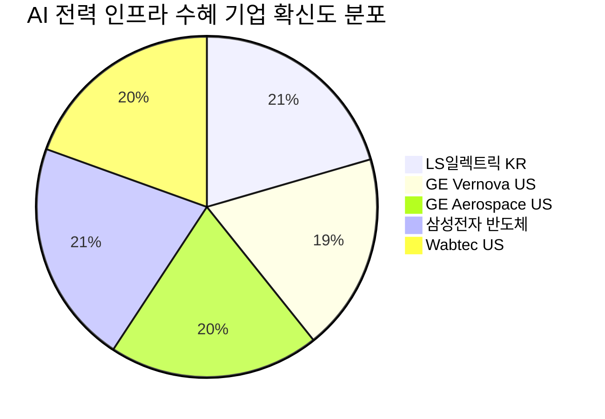

# 🔍 Inflection Scan — 2026-04-23

> [!abstract] 탐색 요약
> 탐색 범위: 2026-04-23 기준 최근 2주 | High Conviction 7건 발견
> 소스: Gemini 8쿼리 + RSS + X + 어닝스/내부자/애널리스트
> **핵심 테마**: AI 인프라 슈퍼사이클이 "기대"에서 "실제 수주·생산능력 확대"로 전환되는 임계점 — 반도체·전력·양자·소재까지 동시 변곡

---

## 시그널 요약 대시보드

| 회사명 | 티커 | 타입 | 핵심 이벤트 | 확신도 | 추천 액션 |
|--------|------|------|------------|:------:|:--------:|
| [[삼성전자]] | 005930.KS | 실적가속 | Q1 영업이익 57.2조 — 컨센서스 50% 초과, YoY +755% | ⭐⭐⭐⭐⭐ 85 | /deep |
| [[GE Aerospace]] | GE | 선행지표 | Q1 신규 주문 +87%, 수주잔고 $1,700억 돌파 | ⭐⭐⭐⭐ 80 | /deal |
| [[LS일렉트릭]] | 010120.KS | 선행지표 | Q1 영업이익 역대 최대, 변압기 생산능력 3배 확대 | ⭐⭐⭐⭐ 82 | /deal |
| [[GE Vernova]] | GEV | 가이던스상향 | 2026 가이던스 상향, 주가 +8~12.7% 급등 | ⭐⭐⭐⭐ 75 | /deal |
| [[Wabtec]] | WAB | 가이던스상향 | EPS 가이던스 YoY +14~18.7% 상향, 수주잔고 +12.8% | ⭐⭐⭐⭐ 78 | /deal |
| [[IonQ]] | IONQ | 기술돌파 | DARPA 계약 수주, 주가 +62.86% 급등 | ⭐⭐⭐ 60 | /deep |
| [[솔루스첨단소재]] | 336370.KS | 사업변곡점 | 북미 AI 가속기 제조사 동박 독점 공급 계약, 상한가 | ⭐⭐⭐ 62 | /deep |

---

## 1. [[삼성전자]] (005930.KS) — 실적가속

> [!abstract] 요약
> Q1 2026 영업이익 57.2조원으로 컨센서스(38조원)를 50% 초과. HBM 주도의 메모리 레버리지가 본격화되며 영업이익률 43% 달성 — 역대급 수준.

**시그널**: Q1 2026 영업이익 57.2조원 — 컨센서스 대비 +50%, YoY +755%, 매출 133조원으로 사상 최고 기록 [출처: 삼성전자 IR 2026.4, 공시 예정]

Q1 2026 영업이익 57.2조원은 Q4 2025(20.1조원) 대비 2.8배에 달하는 폭발적 QoQ 성장으로, 단순 계절적 회복을 훨씬 초과한다. 영업이익률 43%는 HBM 및 메모리 ASP 급등이 고정비를 압도하며 레버리지 효과가 본격화된 증거이며, 이 수준의 마진은 2010년 스마트폰 호황기 이후 유례가 드물다. 컨센서스가 50% 이하로 틀렸다는 사실 자체가 중요한데, 이는 시장이 HBM 단가와 믹스 개선 속도를 구조적으로 과소평가해왔음을 의미하며 지금부터 애널리스트들의 EPS 컨센서스 상향 사이클이 시작될 가능성이 높다. AI 빅테크의 2026년 CapEx가 2025년 대비 30~50% 확대되는 추세 속에서 HBM 수요 구조는 일회성이 아니며, Q2에도 서프라이즈 가능성이 열려 있다. 핵심 리스크는 미-중 반도체 규제 강화로 인한 HBM 수출 제한과 노조 리스크이며, 이 두 변수가 실현되면 이익 가시성이 급격히 훼손될 수 있다.

| 지표 | Q4 2025 | Q1 2026 | 변화 |
|------|---------|---------|------|
| 영업이익 | 20.1조원 | 57.2조원 | 🟢 +185% QoQ |
| 영업이익률 | ~14% | ~43% | 🟢 +29%p — 역대급 |
| 매출 | (확인 필요) | 133조원 | 🟢 사상 최고 |
| 컨센서스 대비 | — | +50% 초과 | 🟢 대형 서프라이즈 |
| YoY 영업이익 | — | +755% | 🟢 베이스 효과 + 구조 개선 |

🟢 Bull 35%

🟡 Base 45%

🔴 Bear 20%

| 시나리오 | 핵심 가정 | 목표 주가 범위 | 업사이드 |
|---------|----------|--------------|---------|
| 🟢 Bull | HBM 수출 규제 없음, Q2도 40%+ OPM 유지, EPS 컨센서스 지속 상향 | [추정] 10만원+ | +30%+ |
| 🟡 Base | 규제 부분적, HBM 수요 유지, 하반기 소폭 감소 | [추정] 7~9만원대 | +10~20% |
| 🔴 Bear | 미-중 HBM 수출 전면 제한, 노조 파업 현실화 | [추정] 5만원 이하 | -20%+ |

> [!warning] 리스크 경고
> ① 미-중 반도체 규제 에스컬레이션 시 HBM 수출 제한 가능성 — 엔비디아 H100·B200 수출 규제와 연동
> ② 노조 집회 보도 → 파업 현실화 시 생산 차질
> ③ YoY 수치 755%는 2025년 Q1 기저(저점)의 영향을 받으므로 절대적 이익 수준 지속 가능성에 집중해야 함

확신도 85/100 — 수치 직접 확인, 구조적 근거 명확

실적 서프라이즈 강도 90/100 — 컨센서스 50% 초과는 최근 5년 내 대형주 최대 수준

지속 가능성 65/100 — 규제 리스크와 수요 사이클 불확실성 반영

| 항목 | 내용 |
|------|------|
| 시장 | 🇰🇷 코스피 |
| 변곡점 유형 | 실적가속 |
| 추천 액션 | /deep — 컨센서스 50% 초과 서프라이즈의 구조적 원인(HBM 단가, 믹스 변화)과 Q2 지속 가능성 심층 분석 후 매수/보유 판단 |

---

## 2. [[GE Aerospace]] (GE) — 선행지표

> [!abstract] 요약
> Q1 2026 신규 주문 +87% YoY, 수주잔고 $1,700억 돌파. 항공우주·방산 슈퍼사이클 진입 신호로 향후 5~8년 매출이 이미 가시화된 상태.

**시그널**: Q1 2026 신규 주문 +87% YoY, 수주잔고 $1,700억 돌파, 미국 내 제조 시설 $10억 투자 발표 [출처: GE Aerospace Q1 2026 실적 발표]

GE Aerospace의 Q1 주문 87% 급증은 단순 수요 회복이 아닌 항공우주 산업의 구조적 슈퍼사이클 진입 신호다. $1,700억 수주잔고는 분기 매출 $48억의 약 35분기치에 해당하며, 향후 5~8년 매출 가시성이 이미 확보된 셈이다. 항공 여객 수요 회복 + AI 데이터센터 전력용 가스터빈 수요 급증 + 방산 지출 확대라는 3중 동력이 동시에 작동 중이며, 이 중 어느 하나가 약화되더라도 나머지 두 개가 버팀목 역할을 한다. $10억 규모 제조 투자는 현재 공급 병목(리드타임 3년 이상)을 해소하기 위한 포석으로, 12~18개월 내 실적에 반영될 전망이다. 유사 사례: 2003~2008년 항공 슈퍼사이클 당시 GE Aviation 수주잔고 급증 이후 5년간 주가 3배 상승 패턴. 핵심 리스크는 중동 지정학적 긴장으로 인한 항공 노선 감소(단기)와 공급망 병목으로 수주를 매출로 전환하는 속도 지연이다.

| 선행지표 | 수치 | 신호 강도 | 의미 |
|---------|------|---------|------|
| Q1 신규 주문 증가율 | +87% YoY | 🟢 극강 | 수요 모멘텀 가속 확인 |
| 수주잔고 | $1,700억+ | 🟢 사상 최대 | 35분기치 매출 확보 |
| Q1 매출 성장 | +29% YoY | 🟢 강 | 수주→매출 전환 진행 중 |
| 미국 제조 투자 | $10억 발표 | 🟢 확장 모드 | 생산 병목 해소 포석 |

> [!tip] 핵심 인사이트
> 수주잔고 $1,700억은 "이미 벌어진 미래"다. 수주가 매출로 전환되는 것은 시간 문제이며, 이 구조적 가시성이 타 섹터 대비 GE Aerospace의 프리미엄 밸류에이션을 정당화한다. 87% 주문 급증은 수요 사이클이 정점이 아닌 가속 구간에 있음을 시사한다.

🟢 Bull 40%

🟡 Base 45%

🔴 Bear 15%

| 시나리오 | 핵심 가정 | 목표 주가 범위 | 업사이드 |
|---------|----------|--------------|---------|
| 🟢 Bull | 수주잔고 전환율 가속, 방산·민항 모두 성장, 증설 완료 | [추정] $250+ | +25%+ |
| 🟡 Base | 수주잔고 안정적 소화, 공급 병목 점진적 해소 | [추정] $200~230 | +5~15% |
| 🔴 Bear | 중동 분쟁으로 민항 수요 감소, 증설 지연 | [추정] $160 이하 | -15%+ |

수주 가시성 80/100 — 35분기치 잔고는 업계 최고 수준

공급 전환 리스크 65/100 — 병목 해소 전까지 잔고→매출 전환 속도 제약

확신도 80/100 — 수주 수치 확인, 복수 성장 동력 검증

| 항목 | 내용 |
|------|------|
| 시장 | 🇺🇸 NYSE |
| 변곡점 유형 | 선행지표 |
| 추천 액션 | /deal — 수주잔고 규모와 분기별 전환율, Q2 가이던스 업데이트 확인 후 포지션 구성 타이밍 판단 |

---

## 3. [[LS일렉트릭]] (010120.KS) — 선행지표

> [!abstract] 요약
> Q1 2026 영업이익 1,266억원(역대 최대, YoY +45%), 초고압 변압기 생산능력 2,000억→6,000억(3배 확대), 수주잔고 5.6조원, 북미 매출 YoY +80%. 실적·수주·생산능력 삼중 변곡점.

**시그널**: Q1 2026 영업이익 1,266억원(역대 최대, YoY +45%), 초고압 변압기 생산능력 3배 확대, 수주잔고 5.6조원, 북미 매출 YoY +80% [출처: LS일렉트릭 Q1 2026 실적 발표]

LS일렉트릭은 현재 "실적 가속 + 생산능력 확장 + 수주잔고 급증"이 동시에 발생하는 삼중 변곡점에 있으며, 이 세 가지가 한꺼번에 나타나는 경우는 극히 드물다. 수주잔고 5.6조원은 2025년 추정 매출의 약 2.5배에 해당하며, 이는 기존 생산능력(2,000억원)으로는 잔고 소화 자체가 불가능했다는 의미다 — 생산능력 3배 확대가 선택이 아닌 필수였음을 방증한다. 북미 매출 80% 성장은 AI 데이터센터 전력 인프라 투자가 국내 기업에도 직접적으로 낙수되고 있음을 수치로 확인한 것이며, [[GE Vernova]]·에이튼·히타치 등 글로벌 경쟁사의 리드타임이 3년 이상으로 늘어난 공급 부족 환경에서 증설 완료 시 점유율 직접 확장이 가능하다. 생산능력 6,000억원 완성 시점인 2026년 하반기부터 Q3~Q4 매출 재가속이 구조적으로 예약된 상황이다. 핵심 리스크는 한-미 관세 협상 결과와 증설 완료 전 공급 병목으로 인한 납기 지연이다.

| 선행지표 | 수치 | 의미 |
|---------|------|------|
| Q1 영업이익 | 1,266억원 (YoY +45%) | 🟢 역대 최대, 성장 가속 |
| 수주잔고 | 5.6조원 | 🟢 매출의 ~2.5배, 가시성 최고 |
| 생산능력 확대 | 2,000억→6,000억 (3배) | 🟢 공급 제약 해소 임박 |
| 북미 매출 | YoY +80% | 🟢 AI 인프라 직접 수혜 확인 |

> [!success] 강점
> 한국 기업 중 북미 데이터센터 전력 인프라 직접 수혜 가장 명확한 기업. 생산능력 3배 확대 완료(2026 하반기) 후 수주잔고 소화 속도가 빨라지며 매출·이익 가속 재현 구조. [[효성중공업]]과 함께 글로벌 초고압 변압기 공급 부족의 핵심 수혜주.

🟢 Bull 40%

🟡 Base 45%

🔴 Bear 15%

| 시나리오 | 핵심 가정 | 목표 주가 범위 | 업사이드 |
|---------|----------|--------------|---------|
| 🟢 Bull | 관세 협상 타결, 생산능력 확대 예정대로 완료, 수주잔고 추가 확대 | [추정] 30만원+ | +30%+ |
| 🟡 Base | 관세 부분 영향, 증설 일정 소폭 지연, 수주잔고 현수준 유지 | [추정] 22~27만원 | +10~20% |
| 🔴 Bear | 관세 충격 + 증설 지연 + 글로벌 수요 둔화 | [추정] 16만원 이하 | -20%+ |

확신도 82/100 — 수주잔고·생산능력·매출 모두 데이터 확인됨

매출 가시성 85/100 — 잔고/생산능력 비율로 하반기 가속 구조 확인

규제 리스크 60/100 — 관세 협상 변수 존재

| 항목 | 내용 |
|------|------|
| 시장 | 🇰🇷 코스피 |
| 변곡점 유형 | 선행지표 |
| 추천 액션 | /deal — 생산능력 3배 완료 시점(2026 하반기)과 수주잔고 소화 스케줄 매핑, 목표주가 재산출 필요 |

---

## 4. [[GE Vernova]] (GEV) — 가이던스 상향

> [!abstract] 요약
> 2026년 가이던스 상향 후 주가 +8~12.7% 급등. TD Cowen 목표주가 상향 동반. AI 데이터센터 전력 수요가 실제 수주로 전환되는 것을 입증.

**시그널**: 2026년 매출·이익 가이던스 상향, 주가 +8~12.7% 급등, TD Cowen 목표주가 상향 [출처: GE Vernova Q1 2026 실적 발표 및 TD Cowen 리포트 2026.4, 구체 목표주가 수치 확인 필요]

GE Vernova의 가이던스 상향은 AI 데이터센터 발 전력 인프라 수요가 "기대"에서 "실제 수주"로 전환되고 있음을 공식 확인한 사건이다. GEV는 발전 터빈(가스·풍력)과 전력망 장비(변압기·스위치기어) 양쪽에서 동시에 수혜를 받는 미국 유일의 대형 통합 에너지 기업으로, 이 희소성이 프리미엄 밸류에이션의 근거가 된다. 특히 천연가스 복합화력(CCGT)은 태양광·풍력의 간헐성을 보완하는 24/7 전력 공급 솔루션으로, 데이터센터 신증설 프로젝트에서 필수 선택지로 자리잡고 있다. GE에서 분사한 지 얼마 되지 않아 시장이 여전히 구 GE 이미지로 저평가하는 경향이 있으며, 이번 가이던스 상향은 독립 성장 기업으로의 재평가를 촉진하는 트리거다. 핵심 리스크는 재생에너지 가격 하락으로 인한 가스터빈 신규 수주 장기 잠식 가능성과 중동 지정학 리스크로 인한 대형 프로젝트 지연이다.

> [!note] 참고
> 가이던스 상향 전후 구체 수치(before→after)가 데이터에 명시되지 않음. 주가 +8~12.7% 급등은 확인됐으나 정확한 가이던스 폭은 (확인 필요). TD Cowen 목표주가 상향도 구체 금액은 출처 원문 확인 필요.

🟢 Bull 35%

🟡 Base 45%

🔴 Bear 20%

| 시나리오 | 핵심 가정 | 목표 주가 범위 | 업사이드 |
|---------|----------|--------------|---------|
| 🟢 Bull | 데이터센터 전력 수요 지속, 가스터빈 수주 가속, 전력망 장비 성장 | [추정] $400+ | +30%+ |
| 🟡 Base | 현 수주 기조 유지, 재생에너지 경쟁 점진적 | [추정] $300~360 | +5~15% |
| 🔴 Bear | 중동 프로젝트 지연, 재생에너지 대체 가속 | [추정] $220 이하 | -25%+ |

확신도 75/100 — 가이던스 방향 확인, 구체 수치 부분 미확인

구조적 포지셔닝 80/100 — 발전+전력망 통합 미국 유일 플레이어

장기 리스크 65/100 — 재생에너지 경쟁 심화 변수

| 항목 | 내용 |
|------|------|
| 시장 | 🇺🇸 NYSE |
| 변곡점 유형 | 가이던스상향 |
| 추천 액션 | /deal — 실적 콘퍼런스콜 가이던스 상향 전후 수치 확인 후 [[GE Aerospace]] vs GEV 전력인프라 비교 분석 |

---

## 5. [[Wabtec]] (WAB) — 가이던스 상향

> [!abstract] 요약
> 2026 EPS 가이던스 $10.25~10.65 (YoY +14~18.7%), Q1 EPS 컨센서스 8% 상회, 수주잔고 +12.8%. 철도 인프라가 AI 시대 숨겨진 수혜 섹터임을 입증.

**시그널**: 2026년 EPS 가이던스 $10.25~10.65로 YoY 14~18.7% 성장 제시, Q1 EPS 컨센서스 8% 상회, 수주잔고 12.8% 증가 [출처: Wabtec Q1 2026 실적 발표 2026.4]

Wabtec의 가이던스 상향은 철도 화물 인프라가 AI 시대의 언더레이더(under-the-radar) 수혜 섹터임을 실적으로 입증한 사건이다. 데이터센터 건설 자재, 반도체 장비, 에너지 인프라 원자재 등 모든 물리적 공급망의 근간이 철도이며, AI 투자 확대는 곧 화물 물동량 증가로 직결된다. Wabtec은 디젤전기 기관차의 전동화(배터리·수소 하이브리드)와 소프트웨어 기반 운행 효율화 솔루션을 동시에 제공하는 글로벌 유일의 통합 솔루션 플레이어로, 철도 현대화 수요의 구조적 수혜를 독점적으로 누릴 수 있는 위치다. Q1 EPS 컨센서스 8% 상회는 마진 개선이 예상보다 빠르게 진행 중임을 보여주며, 이는 제품 믹스 고부가가치화와 소프트웨어 매출 비중 확대에 기인하는 것으로 추정된다 [추정]. 유사 사례: 인프라 수요 급증기의 Caterpillar 수주잔고→매출 전환 패턴과 구조가 유사. 핵심 리스크는 미-중 무역 갈등으로 인한 철도 화물 물동량 감소와 높은 부채 수준이다.

| 항목 | 수치 | 신호 |
|------|------|------|
| 2026 EPS 가이던스 | $10.25~10.65 | 🟢 YoY +14~18.7% |
| Q1 EPS 서프라이즈 | 컨센서스 +8% 상회 | 🟢 마진 개선 확인 |
| 수주잔고 성장 | +12.8% | 🟢 구조적 수요 지속 |
| 이전 가이던스 | (확인 필요) | 🟡 비교 기준 미확인 |

🟢 Bull 35%

🟡 Base 50%

🔴 Bear 15%

| 시나리오 | 핵심 가정 | 목표 주가 범위 | 업사이드 |
|---------|----------|--------------|---------|
| 🟢 Bull | 철도 현대화 수요 가속, 소프트웨어 믹스 개선, EPS 추가 상향 | [추정] $225+ | +25%+ |
| 🟡 Base | 현 가이던스 달성, 수주잔고 안정 | [추정] $185~210 | +5~15% |
| 🔴 Bear | 무역 갈등 물동량 감소, 마진 압박 | [추정] $145 이하 | -20%+ |

> [!tip] 핵심 인사이트
> AI 인프라 투자의 물리적 공급망(철도 화물)에 대한 간접 수혜는 시장이 아직 충분히 반영하지 못하고 있다. Wabtec의 EPS 가이던스 성장률 14~18.7%는 S&P500 평균의 2배 이상이며, 이 성장률 대비 밸류에이션 프리미엄은 제한적이다 [추정].

확신도 78/100 — 가이던스 수치 명확, 이전 가이던스 비교 기준 부재

시장 인지도 70/100 — 간접 수혜 스토리로 주목도 낮음 → 역발상 기회

| 항목 | 내용 |
|------|------|
| 시장 | 🇺🇸 NYSE |
| 변곡점 유형 | 가이던스상향 |
| 추천 액션 | /deal — 철도 화물 물동량 선행지표(AAR 주간 데이터)와 Wabtec 수주잔고 전환율 교차 검증 |

---

## 6. [[IonQ]] (IONQ) — 기술돌파

> [!abstract] 요약
> DARPA 계약 수주로 주가 +62.86% 급등. 양자컴퓨팅이 학계 연구 단계에서 국방·정부 조달 시장으로 진입한 구조적 변곡점. 단, 계약 규모 미공개로 밸류에이션 검증 필요.

**시그널**: DARPA 계약 수주 발표, 주가 +62.86% 급등 [출처: IonQ 보도자료 2026.4, 계약 규모 및 기간은 확인 필요]

DARPA 계약은 양자컴퓨팅이 대학 연구소에서 국방부 조달 예산으로 진입했음을 의미하는 구조적 변곡점이다. 정부 대형 계약의 특성상 한 번 진입하면 전환 비용이 높아 장기 관계로 이어지는 경향이 있으며, 이는 IonQ의 매출 가시성을 구조적으로 개선한다. 트랩드아이온(Trapped-Ion) 방식은 IBM·Google의 초전도 방식 대비 오류율이 낮다는 기술적 장점을 보유하며, DARPA가 이 방식을 선택했다는 것은 기술 검증의 의미가 있다. 유사 사례: 2000년대 초 CIA의 AWS 클라우드 계약 이후 클라우드 시장 독식 패턴과 구조적으로 유사 — 다만 양자컴퓨팅의 상용화 타임라인은 클라우드보다 훨씬 불확실하다는 점이 결정적 차이다. 핵심 리스크는 계약 규모가 미공개 상태로 현재 시총($수십억) 대비 정당화 가능 여부가 미검증이며, 양자 내성 암호화(Post-Quantum Cryptography) 발전으로 양자 해킹 위협이 약화될 경우 정부 수요 동기가 감소할 수 있다.

> [!question] 검토 필요
> ① DARPA 계약의 구체적 규모(달러)·기간이 데이터에 명시되지 않음 — 계약 내용 확인 전 포지션 사이징 주의
> ② "의원 매수 내역" 보도는 공식 공시 여부 미확인 — 단독 보도인 경우 신뢰도 낮음
> ③ 주가 +62.86% 반영 후 현재 밸류에이션이 계약 가치 대비 합리적인지 독립 검증 필요

🟢 Bull 25%

🟡 Base 45%

🔴 Bear 30%

| 시나리오 | 핵심 가정 | 목표 주가 범위 | 업사이드 |
|---------|----------|--------------|---------|
| 🟢 Bull | 대형 계약 확인 + 추가 정부 계약 파이프라인 확보 | [추정] 현재가 +50%+ | +50%+ |
| 🟡 Base | 계약 규모가 시총 대비 소규모, 기술 입증 가치만 반영 | [추정] 현재가 ±20% | 불확실 |
| 🔴 Bear | 계약 규모 실망 + 후속 수주 없음 + 양자 상용화 지연 | [추정] -40% 이하 | -40%+ |

> [!warning] 리스크 경고
> 주가 +62.86% 급등 후 계약 규모가 확인될 경우 실망 매물이 쏟아질 수 있음. 양자컴퓨팅 섹터 특성상 기대치 조정이 급격하게 이루어지는 경향이 있어 포지션 진입 타이밍이 매우 중요.

확신도 60/100 — DARPA 계약 존재 확인, 규모·조건 미검증

기술 변곡점 강도 75/100 — 정부 조달 첫 진입의 상징적 의미

밸류에이션 안전마진 40/100 — 급등 후 미검증 상태

| 항목 | 내용 |
|------|------|
| 시장 | 🇺🇸 NYSE |
| 변곡점 유형 | 기술돌파 |
| 추천 액션 | /deep — DARPA 계약 공식 발표문 확인, 계약 규모 대비 현재 시총 점검, 기존 정부 계약 레퍼런스와 비교 필요 |

---

## 7. [[솔루스첨단소재]] (336370.KS) — 사업변곡점

> [!abstract] 요약
> 북미 대형 AI 가속기 제조사에 고성능 동박 독점 공급 계약 체결, 상한가 기록. 배터리 동박 중심에서 AI 인프라 소재로의 사업 변곡점. 계약 상대방·규모 미공개가 핵심 리스크.

**시그널**: 북미 대형 AI 가속기 제조사에 초저손실(VLL) 동박 독점 공급 계약 체결, 주가 상한가 [출처: 데일리머니 등 국내 매체 보도 2026.4, 공시 원문 교차 확인 필요]

북미 AI 가속기(GPU/NPU) PCB 기판용 초저손실 동박의 독점 공급 계약은 솔루스첨단소재가 배터리 소재 기업에서 AI 인프라 고부가가치 소재 기업으로 사업 포트폴리오를 전환하는 변곡점이다. "독점(exclusive)" 공급이라는 조건은 기술적 진입장벽이 존재하고 단기 내 경쟁사 대체가 구조적으로 어렵다는 것을 의미하며, 이는 단순 납품과 달리 장기 수익 가시성을 확보한다. 현재 헝가리 전지박 공장 수율 안정화가 하반기로 예정된 상황에서, AI 동박 신규 매출 + 전지박 수율 개선의 이중 실적 트리거가 동시에 작동할 경우 영업이익 흑자 전환 시점이 앞당겨질 수 있다. 그러나 계약 상대방이 미공개(엔비디아인지 AMD인지 불확실)이고 계약 금액과 기간도 공시되지 않은 상태에서, 현재 주가에 반영된 기대치가 실제 계약 규모를 초과할 위험이 있다. 핵심 리스크는 계약 상대방 확인 시 기대 이하의 규모로 밝혀질 경우 급격한 되돌림 가능성이다.

> [!question] 검토 필요
> ① 계약 상대방 미공개 — 엔비디아·AMD·구글 중 어느 기업인지에 따라 규모와 성장 가능성이 크게 다름
> ② 계약 금액·기간 미공시 — 현재 매출 대비 영향도 산출 불가
> ③ 데일리머니 단독 보도 — 금감원 공시 원문 교차 확인 필수
> ④ 상한가 기록 후 수급 이탈 가능성 존재

🟢 Bull 30%

🟡 Base 40%

🔴 Bear 30%

| 시나리오 | 핵심 가정 | 목표 주가 범위 | 업사이드 |
|---------|----------|--------------|---------|
| 🟢 Bull | 계약 상대방이 엔비디아급 대형사 + 계약 규모 연 수백억 이상 + 흑자 전환 | [추정] 상한가 대비 +30%+ | +30%+ |
| 🟡 Base | 중형사 계약, 소규모 시작 후 확대 가능성, 전지박 개선 동반 | [추정] 상한가 수준 유지~±15% | ±15% |
| 🔴 Bear | 계약 규모 실망 + 전지박 수율 지연 + 기대 붕괴 | [추정] 상한가 대비 -30%+ | -30%+ |

확신도 62/100 — 계약 사실 확인, 상대방·규모 미검증

사업 변곡점 강도 70/100 — 독점 공급 계약의 구조적 의미

투명성 40/100 — 계약 핵심 조건 모두 미공개

| 항목 | 내용 |
|------|------|
| 시장 | 🇰🇷 코스닥 |
| 변곡점 유형 | 사업변곡점 |
| 추천 액션 | /deep — 금감원 공시 원문 확인, 계약 상대방 파악, 현재 매출 대비 계약 규모 비율 산출로 변곡점 강도 측정 필요 |

---

## 📊 섹터 메타 시그널

### ⚡ AI 전력 인프라 (Power Infrastructure for AI) — 슈퍼사이클 임계점 통과

> [!abstract] 섹터 요약
> AI 데이터센터 전력 수요가 "기대"에서 "수주 잠금→생산능력 확대→실적 가속"으로 전환되는 임계점을 2026년 Q1에 동시 통과. 단일 기업 스토리가 아닌 글로벌 섹터 슈퍼사이클로 확인.

이번 스캔에서 가장 강력한 메타 시그널은 서로 다른 지역·업종의 기업들이 동시에 같은 방향의 전력 인프라 수주 급증을 보고하고 있다는 점이다. [[GE Vernova]](가이던스 상향 + 주가 급등), [[LS일렉트릭]](생산능력 3배 확대 + 수주잔고 5.6조원), 그리고 데이터에서 언급된 HD현대중공업(미국 데이터센터 발전기 계약 6,271억원), Caterpillar(수주잔고 71% 급증)까지 — 이는 개별 기업 이슈가 아닌 구조적 섹터 슈퍼사이클의 복수 확인(multiple confirmation)이다. 변압기·발전기·전력기기 업체들의 리드타임이 3년 이상으로 늘어난 상황에서 생산능력 확대에 착수한 기업만이 2027~2028년 수혜를 실현할 수 있으며, 이미 증설을 시작한 기업들의 선점 우위는 시간이 갈수록 확대된다. 이 섹터의 구조적 수혜는 단순한 AI 붐 사이클이 아닌 전력망 노후화 교체 수요(40~50년 된 미국 변압기 인프라)와 겹쳐 2028년 이후까지 지속될 가능성이 높다.

> [!verdict] 판단
> AI 전력 인프라 섹터는 2026년 Q1을 기점으로 "기대 플레이"에서 "실적 플레이"로 전환 완료. 이미 수주잔고를 확보하고 생산능력 확대에 착수한 기업들([[LS일렉트릭]], [[GE Vernova]])에 대한 비중 확대는 정당화 가능. 다만 밸류에이션 이미 상당 부분 반영된 종목은 추가 실적 서프라이즈 없이는 추가 상승 제한적 — 진입 단가 관리가 핵심.

---

*본 리포트는 투자 참고 자료이며 특정 종목의 매수·매도를 권유하지 않습니다. 모든 투자 결정은 본인의 판단과 책임 하에 이루어져야 합니다.*
*작성 기준일: 2026-04-23 | 다음 업데이트: 주요 기업 Q2 가이던스 발표 후*