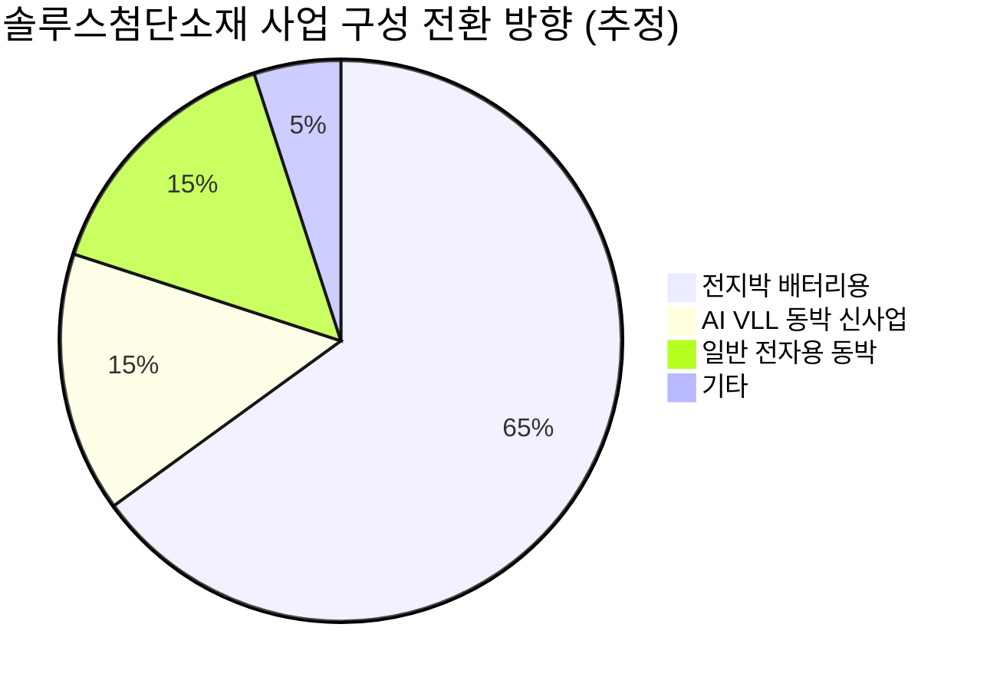

# 🔍 Inflection Scan — 2026-04-24

> [!abstract] 탐색 요약
> 탐색 범위: 2026-04-24 기준 최근 2주 | High Conviction 5건 발견
> 소스: Gemini 8쿼리 + RSS + X + 어닝스/내부자/애널리스트
> **핵심 테마**: AI 수요가 GPU에서 CPU·아날로그·ASIC·소재 전반으로 확산되는 **'2차 파급' 국면** 개시 확인

---

## 시그널 요약 대시보드

| 회사명 | 티커 | 타입 | 핵심 이벤트 | 확신도 | 추천 액션 |
|--------|------|------|------------|:------:|:--------:|
| [[인텔]] | INTC | 실적가속/가이던스상향 | Q1 서프라이즈 + 가이던스 대폭 상향, 주가 17~20% 급등 | 🟢 높음 | /deep |
| [[텍사스 인스트루먼트]] | TXN | 실적가속/가이던스상향 | Q1 EPS·매출 상회 + 2Q 가이던스 상향, 주가 19% 급등 | 🟢 높음 | /deal |
| [[어플라이드 디지털]] | APLD | 사업변곡점/선행지표 | 75억 달러·15년 하이퍼스케일러 장기 계약, 백로그 230억 달러 돌파 | 🟡 중간 | /deep |
| [[마벨 테크놀로지]] | MRVL | 사업변곡점/기술돌파 | 구글 TPU 연동 프로세서 + 차세대 TPU 공동 개발 논의, 주가 6% 급등 | 🟡 중간 | /deep |
| [[솔루스첨단소재]] | 336370.KS | 사업변곡점/선행지표 | 북미 AI 가속기 제조사향 VLL 동박 독점 공급 계약, 상한가 | 🟡 중간 | /deep |

---

## 1. [[인텔]] (INTC) — 실적가속 / 가이던스 상향

**시그널**: Q1 2026 어닝스 서프라이즈 + 2Q 가이던스 대폭 상향, AI 데이터센터 매출 급증 확인 → 주가 최대 20% 급등

> [!abstract] 핵심 요약
> "디스트레스드 컴퍼니"처럼 거래되던 인텔이 AI 데이터센터 수요 급증을 등에 업고 서버 CPU 공급자 우위 국면으로 전환했다. 2000년 8월 이후 최대 일간 상승폭은 단순 반등이 아닌 내러티브 교체의 신호다.

인텔은 2026년 1분기 EPS와 매출 모두 컨센서스를 상회하는 서프라이즈를 기록하고 2분기 가이던스를 시장 예상치를 크게 웃도는 수준으로 제시했다 [출처: CNBC/FT 보도, 2026.4월, 확인 필요]. **변곡점의 본질은 가격 결정력 회복**이다 — 서버 CPU 가격이 3월 이후 최대 20% 상승했고 하반기 추가 8~10% 인상까지 언급되는 공급자 우위 국면은, 1년 전 인텔의 포지션과는 질적으로 다르다. AI 추론 인프라는 GPU만으로 작동하지 않는다; 서버 1대당 다수의 CPU 소켓이 필요하며 클라우드 3사(AWS·Azure·GCP)의 CapEx 폭증이 이 수요의 하한선을 확인시켜준다. 업사이드의 핵심은 실적 개선보다 **멀티플 재평가**다 — 인텔이 "디스트레스드" 프레임에서 "AI 인프라 인에이블러" 프레임으로 전환되면 PER 재평가 여지가 크다[추정]. 반면 파운드리 사업의 구조적 경쟁력 회복은 여전히 불확실하며, AMD의 EPYC 서버 CPU 점유율 확대 및 ARM 기반 커스텀 칩(AWS Graviton 등)으로의 이탈은 중장기 리스크다. 유사 사례로는 2023년 AMD가 데이터센터 GPU 수요를 처음 실적으로 확인한 직후 12개월 내 주가 2배를 달성한 패턴이 참고된다.

🟢 Bull 35%

🟡 Base 45%

🔴 Bear 20%

| 시나리오 | 핵심 가정 | 가격 목표 | 업사이드 |
|---------|----------|----------|---------|
| 🟢 Bull | AI 서버 CPU 가격 인상 지속 + 파운드리 고객 추가 확보 + 멀티플 재평가 | (확인 필요) | +40~60%[추정] |
| 🟡 Base | 서프라이즈 모멘텀 유지, 파운드리는 현상 유지 | (확인 필요) | +15~25%[추정] |
| 🔴 Bear | AMD/ARM 점유율 가속 침식, 가이던스 일회성 판명 | (확인 필요) | -15~20%[추정] |

> [!tip] 핵심 인사이트
> 이번 서프라이즈의 가치는 단기 EPS 상향이 아니라 **"인텔이 AI 사이클에서 도태되지 않았다"는 내러티브 교체**에 있다. 멀티플 정상화만으로도 상당한 업사이드가 존재한다[추정].

> [!warning] 리스크 경고
> 파운드리 사업 적자 구조는 여전히 미해결이다. 서버 CPU 호황이 파운드리 손실을 상쇄하는 구조가 얼마나 지속 가능한지 분리 분석이 필요하다.

실적 서프라이즈 강도 78/100

구조적 경쟁력 지속성 55/100

멀티플 재평가 여지 62/100

| 항목 | 내용 |
|------|------|
| 시장 | 🇺🇸 NASDAQ |
| 변곡점 유형 | 실적가속 / 가이던스상향 |
| 추천 액션 | /deep — 서버 CPU vs. AI 가속기 매출 믹스, 파운드리 손익분기 타임라인 분석 필요 |

---

## 2. [[텍사스 인스트루먼트]] (TXN) — 실적가속 / 가이던스 상향

**시그널**: Q1 2026 EPS·매출 컨센서스 상회 + 2분기 가이던스 상향, 주가 19% 급등(2000년 이후 최대), TD Cowen 목표주가 $250→$300 상향

> [!abstract] 핵심 요약
> TXN의 서프라이즈는 아날로그 반도체 수요 사이클의 구조적 개시를 의미한다. AI 엣지·산업 자동화 수요가 재고 사이클과 맞물려 중첩 상승을 만들어내고 있다.

텍사스 인스트루먼트는 2026년 1분기 EPS와 매출 모두 예상치를 상회했으며, 2분기 가이던스를 시장 기대를 뛰어넘는 수준으로 제시했다 [출처: CNBC 보도, 2026.4월, 확인 필요]. TD Cowen은 즉각 목표주가를 $250→$300로 상향 조정했다 [출처: TD Cowen 리포트, 2026.4월, 확인 필요]. **왜 변곡점인가**: TXN은 산업용·자동차용 아날로그 반도체 시장에서 ~20% 점유율을 가진 압도적 1위로, 이 회사의 수주 회복은 AI 엣지 컴퓨팅과 산업 자동화 수요의 구조적 시작을 알리는 선행지표 역할을 한다. **아날로그 반도체의 특성상 한번 수요 가속이 시작되면 최소 2~4분기 이상 지속**된다 — 디지털 칩과 달리 설계 교체 사이클이 길고, 공장 자동화 프로젝트는 착수 후 중단이 드물기 때문이다. 마진 측면에서도 TXN은 자사 300mm 웨이퍼 공장을 보유해 수요 증가 시 한계 이익률이 빠르게 개선되는 구조다[추정]. 핵심 리스크는 전체 매출의 약 20%를 차지하는 중국 매출에 대한 관세·수출 규제 확대와, 신규 설비 증설에 따른 단기 감가상각 부담이다. 2016~2017년 TXN이 아날로그 공급 사이클을 처음 켰을 때 이후 3년간 주가가 약 3배 상승한 전례가 있다.

🟢 Bull 40%

🟡 Base 45%

🔴 Bear 15%

| 시나리오 | 핵심 가정 | 가격 목표 | 업사이드 |
|---------|----------|----------|---------|
| 🟢 Bull | 산업·자동차 수요 동시 회복 + 중국 리스크 완화 + 아날로그 가격 인상 | $320~340[추정] | +25~35%[추정] |
| 🟡 Base | TD Cowen 목표가 달성, 산업 수요 점진적 회복 | $300 [출처: TD Cowen 리포트, 2026.4월, 확인 필요] | +15~20%[추정] |
| 🔴 Bear | 중국 수출 규제 확대 + 자동차 수요 둔화 재현 | $220~230[추정] | -10~15%[추정] |

> [!success] 강점
> 자사 공장 보유로 수요 증가 시 **한계이익률 급속 개선** 구조. 아날로그 반도체 사이클 특성상 한번 켜진 수요는 최소 2~4분기 지속. 복수 애널리스트 목표주가 상향 추세.

> [!warning] 리스크 경고
> 중국 매출 ~20% 비중은 미·중 관세 협상 결과에 따라 가이던스 하향의 핵심 변수가 될 수 있다. 지정학 이벤트 발생 시 첫 번째 조정 트리거가 될 가능성 높음.

실적 모멘텀 강도 85/100

사이클 지속 가능성 80/100

지정학 리스크 노출도 60/100

| 항목 | 내용 |
|------|------|
| 시장 | 🇺🇸 NASDAQ |
| 변곡점 유형 | 실적가속 / 가이던스상향 |
| 추천 액션 | /deal — 실적 가속 + 목표주가 상향 복수 확인, 단기 진입 근거 충분. 중국 익스포저 비중 확인 후 포지션 사이징 조정 권고 |

---

## 3. [[어플라이드 디지털]] (APLD) — 사업변곡점 / 선행지표

**시그널**: 미국 투자등급 하이퍼스케일러와 75억 달러·15년 데이터센터 장기 임대 계약 체결, 총 누적 계약 백로그 230억 달러 돌파

> [!abstract] 핵심 요약
> 나노캡 AI 인프라 기업이 투자등급 하이퍼스케일러의 장기 계약을 확보했다는 사실은, 비즈니스 리스크 프로파일이 스타트업에서 인프라 유틸리티로 전환되는 임계점을 의미한다. 백로그 대비 시가총액 배수가 핵심 투자 논거다.

어플라이드 디지털은 최근 미국 투자등급 하이퍼스케일러(상대방 미공개)와 75억 달러·15년 규모의 데이터센터 임대 계약을 체결해 총 누적 계약 수익이 230억 달러를 돌파했다. 이 계약 단 하나만으로 연간 약 5억 달러의 고정 매출이 확보되며, 이는 현재 회사 매출 규모 대비 비약적 점프다. **변곡점의 핵심은 고객 신용등급의 도약**이다 — 스타트업 고객이 아닌 투자등급(Investment Grade) 하이퍼스케일러가 15년 장기 계약을 맺었다는 것은, 이 계약이 자금 조달의 담보로 활용 가능하다는 의미이기도 하다. 230억 달러 누적 백로그는 현재 시가총액 대비 수배에 달할 가능성이 높아[추정], 시장이 이 계약 가시성을 아직 충분히 가격에 반영하지 못했을 가능성이 있다. 핵심 리스크는 두 가지다: ① 대규모 데이터센터 건설에 필요한 CapEx를 조달하는 과정에서의 주식 희석 리스크, ② 건설·전력 인프라 확보 과정의 일정 지연. 계약 상대방이 미공개라는 점도 독립적 검증을 어렵게 한다.

> [!question] 검토 필요
> 계약 상대방(하이퍼스케일러)의 신원이 미공개 상태다. 투자등급 기업임을 확인할 수 있는 독립적 소스가 필요하며, 230억 달러 백로그 중 실제 수금 가능한 Take-or-Pay 조건 여부 확인이 선행되어야 한다.

🟢 Bull 25%

🟡 Base 45%

🔴 Bear 30%

| 시나리오 | 핵심 가정 | 목표 | 업사이드 |
|---------|----------|------|---------|
| 🟢 Bull | 계약 상대방 공개 + 추가 하이퍼스케일러 계약 + 자금 조달 희석 최소화 | 백로그 대비 멀티플 재평가 | +100%+[추정] |
| 🟡 Base | 현 계약 정상 이행, 추가 계약 1~2건 | 점진적 주가 상승 | +30~50%[추정] |
| 🔴 Bear | CapEx 조달 실패 or 대규모 유상증자 + 건설 지연 | 대형 희석 이벤트 | -30~50%[추정] |

> [!warning] 리스크 경고
> 나노캡 특성상 대규모 CapEx 조달 과정에서 주식 희석이 가장 현실적인 리스크다. 백로그 숫자의 크기에 현혹되기 전에 자금 조달 구조(부채/주식 비율)와 기존 주주 희석 이력을 반드시 확인해야 한다.

계약 가시성 70/100

재무 구조 안정성 40/100

백로그 검증 가능성 55/100

| 항목 | 내용 |
|------|------|
| 시장 | 🇺🇸 NASDAQ |
| 변곡점 유형 | 사업변곡점 / 선행지표 |
| 추천 액션 | /deep — 현재 시가총액 대비 백로그 배수, 자금 조달 구조(부채/주식), 건설 가동 일정 정밀 분석 선행 후 포지션 판단 |

---

## 4. [[마벨 테크놀로지]] (MRVL) — 사업변곡점 / 기술돌파

**시그널**: 구글과 TPU 연동 메모리 중심 프로세서 + 차세대 TPU 공동 개발 논의 보도, 주가 6% 급등

> [!abstract] 핵심 요약
> 브로드컴이 구글 TPU 1세대를 통해 ASIC 사업의 가능성을 검증했다면, 마벨은 그 다음 수혜자가 될 수 있다. 현재 "논의 단계" 반응이 보수적이라는 것은 계약 확정 시 추가 재평가 여지가 크다는 의미이기도 하다.

마벨 테크놀로지가 구글과 두 가지 AI 칩 공동 개발을 논의 중이라는 보도가 나왔다: ① 구글 TPU와 연동되는 메모리 중심 프로세서, ② AI 추론 최적화 차세대 TPU가 대상이다. 이 시그널이 강력한 이유는 마벨의 맞춤형 ASIC(Application-Specific Integrated Circuit) 사업이 이미 실질적 규모($0→약 $15억)로 성장했고, 경영진이 "2028 회계연도 최소 두 배" 성장을 공식 언급한 성장 궤도 위에서 구글이라는 메가 고객이 추가되는 구조이기 때문이다[추정]. **구조적 배경**: 엔비디아 GPU 의존도를 낮추려는 하이퍼스케일러들의 ASIC 다각화 전략은 이미 브로드컴의 TPU/Inferentia 성공으로 검증되었다; 마벨은 고속 광통신(PAM4/Coherent DSP) + 커스텀 컴퓨트 결합 역량에서 브로드컴과 차별화된 포지션을 구축 중이다. 현재 6% 상승은 "논의 단계"라는 불확실성을 반영한 보수적 반응으로, 계약 확정 공시 시 브로드컴 ASIC 계약 공시 이후의 주가 반응을 벤치마크로 참고할 수 있다[추정]. 핵심 리스크는 ① 논의가 계약으로 이어지지 않을 가능성, ② 구글이 내재화(in-house) 전략을 강화해 외부 파트너 의존도를 줄이는 경우, ③ 마벨의 ASIC 설계 인력·파운드리 수율 이슈다.

🟢 Bull 30%

🟡 Base 50%

🔴 Bear 20%

| 시나리오 | 핵심 가정 | 목표 | 업사이드 |
|---------|----------|------|---------|
| 🟢 Bull | 구글 ASIC 계약 확정 공시 + 추가 하이퍼스케일러 계약 + ASIC 매출 $30억+ 궤도 진입 | (확인 필요) | +40~60%[추정] |
| 🟡 Base | 논의 지속 + 기존 ASIC 파이프라인 2028년 목표 달성 | (확인 필요) | +15~25%[추정] |
| 🔴 Bear | 구글 협상 결렬 + 구글 내재화 가속 + 업황 둔화 | (확인 필요) | -20~25%[추정] |

> [!tip] 핵심 인사이트
> 마벨의 핵심 모니터링 지표는 **구글 파트너십의 계약 확정 여부**다. "논의→ MOU→계약" 단계에서 각각 주가 반응이 계단식으로 나타날 가능성이 높다. 브로드컴의 선례를 고려하면 계약 확정 시 마벨 ASIC 사업 전체의 밸류에이션 프레임이 바뀐다[추정].

> [!question] 검토 필요
> 마벨이 구글 TPU 아키텍처와 호환되는 메모리 중심 프로세서를 설계할 역량을 보유하고 있는지, 그리고 현재 TSMC 선단 공정 할당량(allocation)이 충분한지 확인이 필요하다.

ASIC 성장 가시성 65/100

구글 계약 확정 가능성 60/100

계약 확정 시 멀티플 재평가 여지 75/100

| 항목 | 내용 |
|------|------|
| 시장 | 🇺🇸 NASDAQ |
| 변곡점 유형 | 사업변곡점 / 기술돌파 |
| 추천 액션 | /deep — 마벨의 구글향 ASIC 설계 역량, ASIC 매출 파이프라인 규모, 파운드리 공정 할당 현황 심층 분석 필요 |

---

## 5. [[솔루스첨단소재]] (336370.KS) — 사업변곡점 / 선행지표

**시그널**: 북미 대형 AI 가속기 제조사에 GPU PCB용 초저손실(VLL, Very Low Loss) 동박 독점 공급 계약 체결, 상한가 기록

> [!abstract] 핵심 요약
> 배터리 동박 기업이 AI 데이터센터 PCB 소재 공급자로 전환되는 피벗의 첫 번째 확인 신호다. VLL 동박은 일반 동박 대비 10배 이상 가격을 받는 하이엔드 소재로, 흑자 전환의 경로가 구체화되고 있다.

솔루스첨단소재가 북미 대형 AI 가속기 제조사(상대방 미확인)에 GPU PCB용 초저손실(VLL, Very Low Loss) 동박을 독점 공급하는 계약을 체결했다고 보도됐다 [출처: 확인 필요]. **왜 이것이 구조적 변곡점인가**: AI 데이터센터의 고성능 서버 PCB는 수십 GHz 주파수 대역에서 신호 손실을 최소화해야 하므로, 일반 전자용 동박이 아닌 VLL 동박을 필요로 한다 — 이 제품군의 단가는 일반 동박의 10배 이상으로, 소량 공급으로도 매출·마진 기여도가 압도적이다. **피벗의 타이밍도 중요하다**: 헝가리 전지박 공장의 수율 안정화로 기존 배터리 사업의 적자 출혈이 줄어드는 시점에, AI 동박이라는 고마진 신사업이 더해지는 구조는 하반기 영업이익 흑자 전환 시나리오를 현실화시킨다[추정]. 상한가는 단순 투기 반응이 아니라 시장이 이를 진짜 사업 모델 전환 트리거로 인식했다는 신호다. 핵심 리스크는 ① 계약 규모·기간·물량의 비공개로 인한 검증 불가, ② AI 동박 시장에서 일본 후루카와(Furukawa Electric), 미쓰이(Mitsui Mining & Smelting) 등 선발 경쟁사 대비 기술 우위 지속 여부, ③ 배터리 사업 적자가 예상보다 길어질 경우 현금 소진 리스크다.

*(현재 매출 비중 추정치, IR 확인 필요)*

🟢 Bull 30%

🟡 Base 45%

🔴 Bear 25%

| 시나리오 | 핵심 가정 | 목표 | 업사이드 |
|---------|----------|------|---------|
| 🟢 Bull | AI VLL 동박 계약 추가 확보 + 고객사 공개 + 배터리 사업 손익분기 달성 | (확인 필요) | +50~80%[추정] |
| 🟡 Base | 현 계약 정상 이행 + 하반기 영업이익 흑자 전환 | (확인 필요) | +20~35%[추정] |
| 🔴 Bear | 계약 물량 소규모 판명 + 배터리 수율 문제 재발 + 경쟁사 가격 인하 | (확인 필요) | -25~35%[추정] |

> [!success] 강점
> VLL 동박은 기술 장벽이 높은 소재다. 일단 고객사 PCB 설계에 채택되면 변경 비용(switching cost)이 크기 때문에, 독점 공급 지위가 유지될 경우 장기 안정적 마진 확보가 가능하다[추정].

> [!warning] 리스크 경고
> 계약 상세 내용(규모, 기간, 물량 최소 보장 여부)이 공개되지 않았다. 상한가 이후 주가가 프리미엄을 유지하려면 IR을 통한 구체적 수치 확인이 선행되어야 한다.

사업 피벗 전략 명확성 78/100

계약 정보 투명성 45/100

흑자 전환 가시성 65/100

| 항목 | 내용 |
|------|------|
| 시장 | 🇰🇷 코스닥 |
| 변곡점 유형 | 사업변곡점 / 선행지표 |
| 추천 액션 | /deep — 계약 규모·공급 기간 IR 확인, AI VLL 동박 TAM(Total Addressable Market) 및 후루카와·미쓰이 대비 경쟁 우위 분석 필요 |

---

## 📊 섹터 메타 시그널

### 반도체·AI 인프라 (CPU / 아날로그 / ASIC)

> [!tip] 섹터 관통 인사이트
> **AI 수요의 '2차 파급'이 시작됐다.** 2024~2025년은 엔비디아·TSMC·브로드컴만의 잔치였다면, 2026년 2분기부터는 CPU(인텔)·아날로그(TXN)·ASIC(마벨)로 알파 기회가 이동하고 있다.

이번 실적 시즌에서 [[인텔]](INTC)과 [[텍사스 인스트루먼트]](TXN)가 동시에 대규모 어닝스 서프라이즈와 가이던스 상향을 기록한 것은, AI 수요가 GPU를 넘어 반도체 밸류체인 전반으로 확산되는 구조적 전환의 첫 번째 실적 확인 신호다. 여기에 [[마벨 테크놀로지]](MRVL)의 구글 ASIC 파트너십 논의까지 더하면, 2026년 2분기부터 반도체 밸류체인 전반의 컨센서스 상향 사이클이 본격화될 가능성이 높다[추정]. 시장이 여전히 엔비디아·TSMC·브로드컴을 AI의 전부로 인식하는 동안, **인텔·TXN·마벨이라는 '2부 리그'에서 컨센서스 상향 여지가 더 크게 남아있다** — 이미 프리미엄 밸류에이션을 받고 있는 1부 리그보다 알파(α) 창출 가능성이 높은 구간이다[추정].

| 종목 | AI 수혜 경로 | 현재 컨센서스 반영도 | 알파 여지 |
|------|------------|-------------------|---------|
| [[인텔]] (INTC) | 서버 CPU 가격 회복 + 공급자 우위 | 🟡 일부 반영 | 🟢 높음 |
| [[텍사스 인스트루먼트]] (TXN) | AI 엣지·산업 자동화 아날로그 수요 | 🟡 일부 반영 | 🟢 높음 |
| [[마벨 테크놀로지]] (MRVL) | 구글 ASIC 파트너십 확정 시 | 🔴 미반영 | 🟢 매우 높음 |
| [[솔루스첨단소재]] (336370.KS) | GPU PCB VLL 동박 독점 공급 | 🔴 초기 반영 | 🟡 중간 (검증 필요) |

---

> [!tip] 이번 주 핵심 인사이트
> **인텔과 TXN의 동시 서프라이즈는 단순 실적 이벤트가 아니다.** AI 수요가 GPU(엔비디아)에서 전통 반도체 전체로 확산되는 구조적 전환의 첫 번째 확인 신호다. 이 사이클에서 아직 컨센서스 상향이 덜 반영된 종목(MRVL, TXN 등)이 다음 타겟이다.

> [!warning] 공통 리스크 경고
> 미·이란 전쟁 긴장 재고조 및 호르무즈 해협 봉쇄 위험이 지속되고 있다. 에너지 가격 급등 → 인플레이션 → 금리 불확실성 경로로 기술주 밸류에이션 전반에 영향을 줄 수 있는 테일 리스크(tail risk)다. 모든 포지션에서 지정학 리스크 헤지를 고려할 것.

> [!note] 제외 이유 — AGPU / DGXX
> 엑스컴퓨트(AGPU)와 디지파워X(DGXX)는 계약 규모가 실제처럼 보이나, 두 종목 모두 나노캡·무이익 AI 임대 스타트업으로 사업 지속성 및 수금 가능성에 대한 독립적 검증이 불가하다. "2027년 EPS 238% 증가" 류의 수치는 미확인 애널리스트 추정이며, High Conviction 기준 미달로 이번 스캔에서 제외한다.