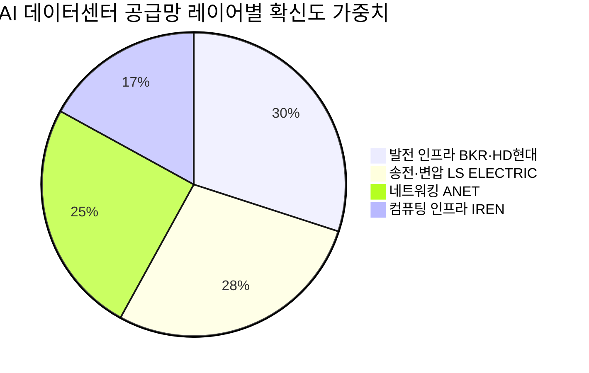

# 🔍 Inflection Scan — 2026-04-28

> [!abstract] 탐색 요약
> 탐색 범위: 2026-04-28 기준 최근 2주 | High Conviction 6건 (KR 2 / US 4)
> 소스: 1Q26 실적 IR + 셀사이드 리포트 + 애널리스트 업그레이드
> **핵심 테마**: AI 데이터센터 전력·네트워킹 인프라 수요가 '발주 → 수주잔고 → 매출가속'으로 전 단계 동시 가시화 — 단, 단일 매크로 가정 집중 리스크 주의

> [!warning] 포트폴리오 리스크 경고
> 6개 시그널 전부가 직간접적으로 **AI CapEx 지속** 가정에 의존. 이 단일 매크로 가정 실패 시(지정학 리스크, 빅테크 CapEx 사이클 전환, 금리 재상승) 포트폴리오 동시 타격 불가피. 시그널 개별 분석 전 Cross-correlation 인식 필수.

---

## 📊 시그널 요약 대시보드

| 회사명 | 티커 | 타입 | 핵심 이벤트 | 확신도 | 추천 액션 |
|--------|------|------|------------|:------:|:--------:|
| [[Arista Networks]] | ANET | 가이던스상향 | AI 네트워킹 매출 목표 $1.5B→$3.25B (+116%) 상향, Rosenblatt 매수 전환 | 🟡 P=0.50 | /deal |
| [[Baker Hughes]] | BKR | 선행지표 | IET RPO $33.1B 사상 최고, 3Q 연속 수주 $4B+, CEO 2028년 $40B 확신 | 🟢 P=0.55 | /deal |
| [[SanDisk]] | SNDK | 가이던스상향 | 3Q26 매출 $4.9B 가이던스, NAND ASP 회복 thesis — 수치 검증 필요 | 🔴 P=0.40 | /deep |
| [[LS ELECTRIC]] | 010120.KS | 실적가속 | 1Q26 영업이익 YoY +45%, 북미 매출 +80%, 수주잔고 5.6조 | 🟢 P=0.56 | /deep |
| [[IREN Ltd.]] | IREN | 사업변곡점 | 비트코인 마이닝→AI 클라우드 피벗, MS 딜 체결, Bernstein $3.7B 평가 | 🔴 P=0.35 | /deep |
| [[HD현대중공업]] | 329180.KS | 사업변곡점 | DC 발전설비 6,271억(역대 최대) + 쇄빙선 5,148억 + 미 해군 AI 함정 R&D | 🟡 P=0.48 | /deal |

🟢 High (P≥0.55) — 2건: BKR, LS ELECTRIC

🟡 Mid (0.45–0.54) — 2건: ANET, HD현대중공업

🔴 Low (<0.45) — 2건: SNDK, IREN (/deep 전 진입 비추천)

---

## 1. [[Arista Networks]] (ANET) — 가이던스 상향

> [!abstract]
> AI 네트워킹 매출 목표를 자체적으로 116% 상향. 그러나 컨센서스 매수 21건은 이미 강세 합의 — Variant Perception이 얼마나 남았는지가 핵심 질문.

**사실 → 추론 → 대안 → 채택:**
Arista는 2026년 AI 네트워킹 매출 목표를 $1.5B(2025)에서 $3.25B으로 자체 상향했으며 [출처: Arista Networks Investor Day, 2025], 이는 단순 낙관이 아닌 하이퍼스케일러 수주 파이프라인을 기반으로 한 수치로 해석된다 [Confidence: M | 근거: 1차IR]. 변곡점의 본질은 GPU-to-GPU 통신 인프라 표준이 InfiniBand에서 Ethernet으로 이동하는 구조적 전환이며, Meta와 Google이 이더넷 기반 클러스터를 실제 발주에 반영하기 시작했다는 점이 TAM 확장의 실질적 근거다. EOS 소프트웨어 스택의 구독형 반복 수익 전환은 하드웨어 사이클 변동성을 완충하는 추가 매력 요소다. 그러나 컨센서스 매수 21건 vs 시장수익률상회 6건이라는 분포는 강세 합의가 이미 형성된 상태임을 시사하며, 이는 Druckenmiller 원칙 상 differential view가 제한적임을 의미한다.

🟢 Bull 25%

🟡 Base 50%

🔴 Bear 25%

| 시나리오 | 핵심 가정 | 목표가 방향 | 기간 |
|----------|----------|------------|------|
| 🟢 Bull (25%) | 이더넷 표준화 가속 + Meta/MS 발주 유지 + Spectrum-X 위협 무력화 → $3.25B 가이던스 달성·초과 | 현재가 +40~60% [추정] | 18개월 |
| 🟡 Base (50%) | 이더넷-InfiniBand 공존, AI 스위칭 매출 $2.5B 도달, EOS 구독 확대 | 현재가 +15~25% [추정] | 18개월 |
| 🔴 Bear (25%) — Smart Short | Meta/MS 중 한 곳이 자체 ASIC 스위칭(MS Sirius 또는 Meta 자체 설계)으로 전환, NVIDIA Spectrum-X가 ANET의 이더넷 포지션을 NVIDIA 생태계 안으로 흡수 → AI 네트워킹 매출 $1.8B 미달 + PER 50배 압축 동반 | 현재가 -30~40% [추정] | 12개월 |

> [!warning] Steel-manned Short
> 가장 설득력 있는 Short thesis: ANET 매출의 ~40%가 Meta+MS에 집중된 구조에서, NVIDIA Spectrum-X가 이더넷 레이어를 NVIDIA 자체 생태계로 내재화하면 ANET의 독립적 스위칭 수요가 구조적으로 축소된다. 이 경우 PER 50배 이상이 유지될 근거가 사라진다.

Bull Case 강도 65/100 (밸류에이션·고객집중도 차감)

Variant Perception 잔존 강도 50/100 (컨센서스 합의로 차감)

구조적 테마 강도 75/100 (이더넷 표준화 진행 중)

> [!note] Cross-Asset Impact
> ANET 강세는 KR 이더넷 스위칭 부품 공급망(케이엠더블유, 오이솔루션 등)에 간접 수혜 가능. 반면 NVIDIA Spectrum-X 위협이 현실화 시 NVIDIA 주가에는 긍정(수직통합), ANET에는 부정.

*5년 후 이 시그널이 무효가 된다면: NVIDIA가 Spectrum-X로 AI 클러스터 이더넷 레이어를 수직통합하여 ANET의 독립 스위칭 포지션을 소멸시켰기 때문.*

| 항목 | 내용 |
|------|------|
| 시장 | 🇺🇸 NASDAQ |
| 변곡점 유형 | 가이던스상향 + 구조적 |
| 추천 액션 | /deal — 이더넷 vs InfiniBand 점유율 추이, Meta/MS 자체 스위칭 진척도, Spectrum-X 채택 현황 정량화 후 진입 |

---

## 2. [[Baker Hughes]] (BKR) — 선행지표 / 사업 재편

> [!abstract]
> IET(산업기술) 부문 수주잔고 $33.1B 사상 최고 — 컨센서스가 '석유서비스'로 분류해 유가 하락과 함께 평가절하하는 동안, IET는 유가 비상관 LNG·가스터빈·데이터센터 전력 사업으로 구조 전환 중. 이 밸류에이션 오인이 핵심 기회.

**사실 → 추론 → 대안 → 채택:**
Baker Hughes의 1Q26 매출은 $6.59B으로 시장 예상 $6.33B 대비 +4.1% 서프라이즈를 기록했으며, EPS $0.58은 컨센서스 대비 +17.5% 상회했다 [Confidence: H | 근거: 1차IR 실적 발표]. IET 수주잔고(RPO) $33.1B은 사상 최고치로, 3분기 연속 분기 수주액 $4B 이상을 기록하며 일회성이 아닌 구조적 수요 축적을 입증했다 [Confidence: H | 근거: 1차IR]. CEO의 "2028년 IET 수주 $40B 초과 점점 더 확신" 발언은 사실상 2028년 매출 가이던스 상향으로 해석 가능하다 [Confidence: M | 근거: 컨퍼런스콜 해석]. 핵심 Variant: IET 부문(LNG, 가스터빈, 데이터센터 냉각·전력)은 유가와의 상관관계가 낮음에도 컨센서스가 전통적 오일서비스 밸류에이션 프레임으로 BKR 전체를 평가하고 있다는 점이 디스카운트의 원천이자 기회다.

🟢 Bull 25%

🟡 Base 55%

🔴 Bear 20%

| 시나리오 | 핵심 가정 | 의미 | 기간 |
|----------|----------|------|------|
| 🟢 Bull (25%) | IET RPO→매출 전환 가속 + 유가 비상관 프리미엄 재평가 + $40B RPO 조기 달성 | IET 부문이 독립 평가받아 복합기업 디스카운트 해소 | 24개월 |
| 🟡 Base (55%) | IET $33.1B RPO가 18개월 내 순차 매출 인식, OFS 부문 유가 안정 | 매출 가시성 기반 안정적 우상향, 배당+자사주 병행 | 12~18개월 |
| 🔴 Bear (20%) — Smart Short | LNG 수출 permit 정책 역풍(미 행정부 변수) + 가스터빈 lead time 인플레이션으로 RPO→매출 전환 마진 압박 + GE Vernova의 가스터빈 점유율 공세로 신규 수주 경합 격화 → $40B 목표 지연·마진 스퀴즈 | RPO가 높아도 이익 창출력 의심 → 재평가 역전 | 12개월 |

> [!tip] 핵심 인사이트
> RPO $33.1B은 단순한 미래 매출이 아니라 **수익 가시성(visibility)**의 지표다. 현재 연간 IET 매출 대비 RPO 커버리지가 18개월 이상이라는 것은, 유가가 -30% 하락해도 IET 매출은 계약으로 보호된다는 의미다. 이것이 컨센서스 유가 민감도 분석에서 누락된 포인트.

| 지표 | 현황 | 의미 |
|------|------|------|
| IET RPO | $33.1B 🟢 사상 최고 | 향후 18개월+ 매출 Visibility 최강 |
| IET 분기 수주 연속성 | 3분기 연속 $4B+ 🟢 | 구조적 수요 확인 |
| 1Q26 매출 서프라이즈 | +4.1% vs 컨센서스 🟢 | RPO가 실적 전환 시작 |
| EPS 서프라이즈 | +17.5% 🟢 | 마진 개선 동반 |
| 유가 민감도 | IET 비중 확대로 🟡 완화 중 | OFS 리스크 희석 진행형 |

수주잔고 가시성 80/100 (RPO 사상 최고 + 3Q 연속)

Variant Perception 강도 72/100 (유가 비상관 오인 여전히 존재)

마진 전환 신뢰도 60/100 (GE Vernova 경쟁·lead time 변수)

> [!note] Cross-Asset Impact
> BKR IET 강세는 GE Vernova(GEV), Siemens Energy(SMNEY)와 가스터빈 시장 경합 구도. KR에서는 두산에너빌리티(034020.KS)의 가스터빈·LNG 사업과 간접 경쟁·비교 밸류에이션 참고 가능.

*5년 후 이 시그널이 무효가 된다면: LNG 수출 정책 역전과 재생에너지 가속으로 가스터빈 신규 수주가 구조적으로 감소하고, RPO가 취소·지연으로 공허해졌기 때문.*

| 항목 | 내용 |
|------|------|
| 시장 | 🇺🇸 NYSE |
| 변곡점 유형 | 선행지표 + 사업재편 |
| 추천 액션 | /deal — IET vs OFS 부문 마진 분리 분석, 유가 시나리오별 민감도, GE Vernova 대비 가스터빈 점유율 비교 |

---

## 3. [[SanDisk]] (SNDK) — 가이던스 상향 ⚠️ 수치 검증 필요

> [!abstract]
> NAND 가격 사이클 회복이라는 thesis는 유효하나, 보고된 OPM 71.5%·ASP +108% 수치는 산업 역사상 비현실적 수준. 원문 IR 확인 전 정량 기반 투자 판단 금지.

**사실 → 추론 → 대안 → 채택:**
SanDisk는 Western Digital 분리 후 첫 독립 실적 가이던스에서 3Q26 매출 $4.9B을 제시했다 [Confidence: M | 근거: 1차IR — 수치 정의 재확인 필요]. 그러나 보고된 OPM 71.5%는 NAND 산업 사이클 피크에서도 Samsung·Micron의 NAND 부문 OPM이 30~40% 수준임을 감안하면 구조적으로 비현실적이다 [Confidence: H | 근거: 산업 비교]. 이는 Gross Margin, Incremental Margin, 또는 특정 제품 라인의 마진과 혼동된 수치일 가능성이 높다 [추정]. ASP +108% 역시 단일 분기 변화로는 극단치다. NAND 사이클 회복 자체(스마트폰 AI 폰 전환 수요 + 삼성·Kioxia 감산)는 구조적으로 유효한 thesis이나, 이 thesis를 뒷받침하는 정량 수치의 신뢰도가 현재 매우 낮다. 독립 경영진의 재고 조정 규율 강화가 이전 사이클보다 가파른 반등을 만들 수 있다는 Variant는 흥미롭지만 검증이 선행되어야 한다.

> [!question] 수치 검증 필수
> **확인이 필요한 사항:**
> 1. OPM 71.5% — Gross Margin/Operating Margin/Incremental Margin 중 어느 정의인가?
> 2. ASP +108% — 전 분기 대비인가, YoY인가? GB당인가 웨이퍼당인가?
> 3. 출처: SanDisk 3Q26 Earnings Call 트랜스크립트 원문 직접 확인 필수

🟢 Bull 20%

🟡 Base 40%

🔴 Bear 40%

| 시나리오 | 핵심 가정 | 목표 방향 | 기간 |
|----------|----------|----------|------|
| 🟢 Bull (20%) | NAND ASP 실제 구조적 회복 + AI폰 수요 폭발 + 삼성 감산 지속 + 독립 경영 규율 입증 | 현재가 +80~120% [추정] | 12~18개월 |
| 🟡 Base (40%) | NAND 완만한 가격 회복, 매출 $4.9B 달성, OPM 정상화(20~30%대) | 현재가 +20~40% [추정] | 18개월 |
| 🔴 Bear (40%) — Smart Short | YMTC 공급 확대로 구조적 가격 압박 재개 + AI 메모리 수혜는 HBM(SK하이닉스·삼성) 집중, NAND 소외 + 분리 후 초기 가이던스 낙관 편향 + OPM 수치 실제 확인 시 실망 → 서프라이즈 역전 | 현재가 -25~40% [추정] | 12개월 |

> [!failure] Steel-manned Short
> NAND는 본질적으로 commodity — 차별화 없는 용량 경쟁. YMTC의 중국 정부 지원 하에 공급 확대는 구조적이며, AI 메모리 수요의 핵심은 HBM에 집중된다. 분리 상장 직후 가이던스는 통상 낙관 편향으로 제시되며, 수치 자체가 오류일 경우 첫 가이던스 실망이 주가 하방 압력으로 작용한다.

데이터 신뢰도 40/100 (수치 검증 전)

NAND 사이클 Thesis 강도 60/100 (구조적 유효)

진입 준비도 35/100 (/deep 전 진입 금지)

> [!note] Cross-Asset Impact
> NAND 가격 회복 시 SK하이닉스(000660.KS)·삼성전자(005930.KS) NAND 부문도 수혜. 단 KR의 AI 메모리 강점은 HBM이 중심이므로 SNDK보다 HBM 비중이 높은 SK하이닉스가 상대적 우위.

*5년 후 이 시그널이 무효가 된다면: YMTC와 중국 NAND 업체들이 글로벌 공급을 구조적으로 초과 공급하여 ASP 회복이 불가능한 commodity trap에 빠졌기 때문.*

| 항목 | 내용 |
|------|------|
| 시장 | 🇺🇸 NASDAQ |
| 변곡점 유형 | 가이던스상향 (수치 검증 필요) |
| 추천 액션 | /deep 필수 — IR 트랜스크립트 원문 OPM·ASP 정의 확인, NAND 현물가 추이, YMTC 캐파 증설 계획, 삼성·Kioxia 감산 지속 여부 |

---

## 4. [[LS ELECTRIC]] (010120.KS) — 실적가속

> [!abstract]
> 1Q26 영업이익 YoY +45%, 북미 매출 +80% — '국내 전력기기 기업'이 아닌 '글로벌 AI 인프라 전력 공급자'로 재분류될 변곡점. 수주잔고 5.6조 원이 매출 가시성을 1년 이상 확보.

**사실 → 추론 → 대안 → 채택:**
LS Electric은 1Q26에 매출 1조 3,766억 원(YoY +33%), 영업이익 1,266억 원(YoY +45%)을 기록했으며, 이 중 북미 매출이 YoY +80%, 초고압 변압기 매출이 +83% 증가했다 [Confidence: H | 근거: 1차IR 1Q26 실적 공시]. 수주잔고 5.6조 원은 연환산 매출 규모와 맞먹어 1년 이상의 매출 가시성을 제공한다 [Confidence: H | 근거: 1차IR]. 부산 2생산동 가동으로 초고압 변압기 캐파가 3배 확대되었는데, 이는 공급 병목 해소와 동시에 매출 상한이 상향조정되었음을 의미한다 [Confidence: M]. 핵심 Variant는 시장이 LS Electric을 여전히 국내 전력기기 기업으로 평가하면서 코리아 디스카운트를 적용하고 있으나, 북미 빅테크 직발주 구조(ASP 프리미엄 + 장기 계약 안정성)는 Eaton·Hitachi Energy 등 글로벌 동종 기업 수준의 밸류에이션 재평가 근거가 된다.

> [!success] 실적 구조 해석
> 매출 성장(+33%) < 영업이익 성장(+45%)은 **영업 레버리지(Operating Leverage)** 작동을 의미한다. 북미 빅테크향 초고압 변압기는 국내 유틸리티향 대비 ASP가 높고 마진이 우월 — 믹스 개선이 단순 외형 성장을 넘어 수익성 가속을 만들고 있다.

🟢 Bull 30%

🟡 Base 45%

🔴 Bear 25%

| 시나리오 | 핵심 가정 | 의미 | 기간 |
|----------|----------|------|------|
| 🟢 Bull (30%) | 북미 빅테크 수주 다변화(Meta·Google·Amazon 고루) + 캐파 3배 풀가동 + 글로벌 전력기기 밸류에이션 프리미엄 인정 | PER 재평가 + 이익 성장 복리 효과 | 24개월 |
| 🟡 Base (45%) | 수주잔고 5.6조 원 순차 매출 인식, 북미 매출 비중 지속 확대, OPM 9~10%대 유지 | 안정적 우상향, 배당 매력 병행 | 12~18개월 |
| 🔴 Bear (25%) — Smart Short | 미국 IRA·관세 정책 변화로 현지 생산 의무화(대규모 CapEx 부담) + GE Vernova·Hitachi Energy의 글로벌 점유율 ~70% 공세로 북미 수주 경합 격화 + 특정 하이퍼스케일러 집중 시 발주 지연 리스크 → 코리아 디스카운트 지속 | PER 프리미엄 미실현, 성장 둔화 | 12개월 |

| 지표 | 현황 | 의미 |
|------|------|------|
| 수주잔고 | 5.6조 🟢 | 연매출 1년+ Visibility |
| 북미 매출 | YoY +80% 🟢 | 빅테크 직발주 진입 신호 |
| 초고압 변압기 캐파 | 3배 확대 🟢 | 공급 병목 해소, 매출 상한 상향 |
| 영업 레버리지 | OPM YoY +45% vs 매출 +33% 🟢 | 믹스 개선 → 수익성 가속 |
| 글로벌 PER 비교 | Eaton PER 30+ vs LS Electric 🟡 | 재평가 여지 잔존 |

매출 가시성 82/100 (수주잔고·캐파 기반)

Variant Perception 강도 75/100 (글로벌 재평가 미반영)

경쟁 해자 강도 55/100 (글로벌 대기업 대비 niche 플레이어)

> [!note] Cross-Asset Impact
> LS Electric의 초고압 변압기 수주 급증은 미국 AI 데이터센터 전력 공급망 전체 수요를 확인해주는 선행지표. 동종 비교: 미국의 Eaton(ETN), 일본의 Hitachi Energy, 스위스 ABB가 동일 수혜권. KR에서는 효성중공업(298040.KS)과 직접 비교 밸류에이션 참고.

*5년 후 이 시그널이 무효가 된다면: 미국이 초고압 변압기 현지 생산 의무화를 강제하여 LS Electric이 대규모 해외 CapEx 투자를 강제받거나, 빅테크 전력 수요 자체가 예상보다 조기 둔화했기 때문.*

| 항목 | 내용 |
|------|------|
| 시장 | 🇰🇷 코스피 |
| 변곡점 유형 | 실적가속 + 구조적 |
| 추천 액션 | /deep — 북미 고객 분산도(특정 하이퍼스케일러 집중도), 초고압 변압기 납기 현황, GE Vernova·Eaton·Hitachi Energy 대비 밸류에이션 비교, IRA 관세 민감도 분석 |

---

## 5. [[IREN Ltd.]] (IREN) — 사업변곡점 ⚠️ Narrative Fallacy 주의

> [!abstract]
> 비트코인 마이닝 → AI 클라우드 피벗이라는 매력적 스토리. 그러나 MS 딜 세부 비공개·GPU 운영역량 검증 부재·CoreWeave 복제 가능성 미검증으로 Confidence L. /deep 검증 전 포지션 진입 비추천.

**사실 → 추론 → 대안 → 채택:**
IREN은 마이크로소프트와 딜을 체결하고 GPU 인프라를 확장하며 AI 클라우드 사업으로 피벗을 선언했다 [Confidence: L | 근거: 2차셀사이드 보도]. Bernstein은 AI 클라우드 사업 가치를 $3.7B으로 분석했다 [Confidence: L | 근거: 2차셀사이드 단일 출처]. 전력 인프라 자산을 마이닝에서 GPU 임대로 재목적화한다는 아이디어는 논리적이나, 실제 GPU 클라우드 운영 역량(소프트웨어 스택, 고객 SLA, NVIDIA 관계)은 검증되지 않았다. Applied Digital, Hut 8 등 유사 피벗 시도 기업들의 AI 매출 비중이 여전히 미미하다는 점은 이 thesis의 실행 리스크를 보여준다. MS 딜의 계약 규모, 최소 보장, 기간이 모두 미공개 상태에서 Bernstein $3.7B 평가는 현재 검증이 불가능하다.

> [!failure] Narrative Fallacy 경고 + Steel-manned Short
> **가장 위험한 패턴**: "마이닝→AI 피벗"은 2023~2024년에 반복 사용된 매력적 스토리다. CoreWeave의 성공은 NVIDIA의 직접 백킹과 H100 우선 할당이 핵심 — IREN이 동일한 NVIDIA 관계를 보유하는지 불명. MS 딜이 단순 LOI(의향서) 수준일 경우, H100→B200 전환 사이클에서 IREN 보유 GPU의 진부화 위험이 즉각 발생한다. Applied Digital, Hut 8 등의 선례는 피벗 선언과 실제 매출 전환 사이의 갭이 매우 크다는 것을 보여준다.

🟢 Bull 20%

🟡 Base 40%

🔴 Bear 40%

| 시나리오 | 핵심 가정 | 의미 | 기간 |
|----------|----------|------|------|
| 🟢 Bull (20%) | MS 딜 장기 계약(3년+) 확인 + NVIDIA GPU 우선 할당 확보 + AI 클라우드 매출이 마이닝을 초과 | 밸류에이션 프레임 교체 — 마이닝 주에서 AI 인프라 주로 재분류 | 18개월 |
| 🟡 Base (40%) | MS 딜 일부 구체화, GPU 클라우드 매출 점진적 증가, 마이닝과 공존 | 혼합 밸류에이션 — 부분적 재평가 | 18개월 |
| 🔴 Bear (40%) — Smart Short | MS 딜이 LOI 수준 확인 + GPU 운영역량 부재 + H100 진부화 + 비트코인 가격 하락으로 마이닝 사업 손실 → 이중 타격 | 스토리 붕괴 + 양쪽 사업 모두 압박 | 12개월 |

Fact Base 신뢰도 35/100 (MS 딜 세부 미공개)

Variant Perception 강도 60/100 (프레임 교체 가능성은 실재)

진입 준비도 40/100 (/deep 필수)

> [!note] Cross-Asset Impact
> IREN 피벗 성공 시 유사 마이닝→AI 전환 기업(Hut 8, Applied Digital, Core Scientific)의 밸류에이션도 동반 재평가 가능. 비트코인 가격과의 상관관계 탈피가 투자 thesis의 핵심인데, 실제 탈피 여부가 6개월 내 주가 패턴으로 검증 가능.

*5년 후 이 시그널이 무효가 된다면: GPU 클라우드 시장이 Microsoft Azure·AWS·Google Cloud의 자체 인프라와 CoreWeave·Lambda Labs 등 전문 플레이어로 양분되어, 마이닝 출신 후발주자의 진입 공간이 사라졌기 때문.*

| 항목 | 내용 |
|------|------|
| 시장 | 🇺🇸 NASDAQ |
| 변곡점 유형 | 사업변곡점 (검증 전 단계) |
| 추천 액션 | /deep 필수 — MS 계약 세부 조건(규모·최소 보장·기간), NVIDIA GPU 할당 수준, 실제 AI 클라우드 매출 비중, CoreWeave·Applied Digital 대비 GPU 가동률 비교 |

---

## 6. [[HD현대중공업]] (329180.KS) — 사업변곡점

> [!abstract]
> 단일 분기에 DC 발전설비 6,271억(역대 최대·미국 첫 진출) + 쇄빙선 5,148억(국내 최초 해외) + 미 해군 AI 함정 R&D(국내 최초) — 세 개 신규 TAM에 동시 First-mover 레퍼런스 확보. "첫 사례"의 반복 수주 전환이 thesis 유지의 핵심 조건.

**사실 → 추론 → 대안 → 채택:**
HD현대중공업은 미국 데이터센터향 발전설비 6,271억 원(역대 최대, 첫 미국 DC 시장 진입), 스웨덴 쇄빙선 5,148억 원(국내 조선소 최초 해외 쇄빙선), 미국 해군연구청(ONR) AI 함정 R&D(국내 최초)를 단일 분기에 확보했다 [Confidence: M | 근거: 1차IR 계약 공시]. 합산 ~1.1조 원은 연매출 대비 약 8.8%로 외형적 비중은 제한적이나, 각 계약이 "최초·최대"라는 레퍼런스를 확보했다는 점이 핵심이다. 힘센엔진의 선박엔진 기술이 육상 발전설비로 이전되는 기술적 연속성은 설명 가능하나, 육상 발전 전용 가스터빈에서 Caterpillar·GE·MTU 대비 경쟁력의 정확한 스펙은 검증이 필요하다 [Confidence: M]. 세 계약의 공통 주제는 "선박엔진 제조 기술의 AI 시대 인프라 확장"이며, 이것이 단발성으로 끝나느냐 반복 수주로 이어지느냐가 향후 12개월 thesis 유지의 분기점이다.

| 계약 | 규모 | 신규성 | TAM 열림 | 반복 가능성 |
|------|------|--------|---------|-----------|
| DC 발전설비 (미국) | 6,271억 🟢 | 역대 최대·첫 미국 DC 🟢 | 🟢 AI 전력 인프라 | 🟡 검증 중 |
| 쇄빙선 (스웨덴) | 5,148억 🟢 | 국내 최초 해외 쇄빙선 🟢 | 🟢 극지선박 장기 테마 | 🟡 검증 중 |
| ONR AI 함정 R&D | 소규모 🟡 | 국내 최초 미 해군 R&D 🟡 | 🟡 방산 포트폴리오 씨앗 | 🔴 R&D 단계 |

🟢 Bull 25%

🟡 Base 48%

🔴 Bear 27%

| 시나리오 | 핵심 가정 | 의미 | 기간 |
|----------|----------|------|------|
| 🟢 Bull (25%) | DC 발전설비 후속 수주 2~3건 + 쇄빙선 노르웨이·핀란드 추가 수주 + ONR R&D→실제 함정 계약 | 3개 신규 TAM 동시 확장, 밸류에이션 재평가 | 24개월 |
| 🟡 Base (48%) | DC 발전설비 1~2건 후속, 쇄빙선 레퍼런스 유지, 기존 LNG선 수주 모멘텀 병행 | 신규 TAM 점진적 성장, 기존 사업 안정 | 18개월 |
| 🔴 Bear (27%) — Smart Short | 3건 모두 단발성 — DC 발전설비는 Caterpillar·GE의 납기 경쟁에서 밀려 가격 경쟁에만 의존, 힘센엔진의 육상 발전 기술력이 기대 이하로 확인, 마진율 미공개가 저마진 계약이었음을 뒤늦게 시사 + LNG선 수주 사이클도 꺾임 | "역대 최대·최초" 이후 공백, 3개 신규 TAM 모두 미실현 | 12개월 |

> [!warning] Steel-manned Short
> 가장 설득력 있는 Short thesis: "역대 최대"·"국내 최초"가 동시 발표되는 것은 변곡점 신호이기도 하지만, 실적 피크 분기에 집중 홍보하는 패턴이기도 하다. DC 발전설비 마진율이 미공개 상태에서 6,271억의 이익 기여도는 불명이며, 육상 발전 경쟁(Caterpillar, MTU, Cummins)에서 힘센엔진이 기술·납기에서 열위라면 "첫 사례"가 마지막 사례가 될 수 있다.

First-mover 레퍼런스 가치 65/100 (반복 수주 확인 전)

Variant Perception 강도 70/100 (신규 TAM 미반영)

마진 투명성 45/100 (DC 계약 마진 미공개)

> [!note] Cross-Asset Impact
> HD현대중공업의 DC 발전설비 수주는 LS Electric의 초고압 변압기 수주와 함께 AI 데이터센터 전력 공급망 전반의 한국 기업 진출을 확인. 미국 시장에서 Caterpillar(CAT), Cummins(CMI)와 동일 고객을 놓고 경합 — 이들의 DC 발전설비 수주 동향이 HD현대중공업의 경쟁력을 역으로 검증하는 지표.

*5년 후 이 시그널이 무효가 된다면: 미국 DC 시장이 현지 생산 의무화(Buy America 조항 강화)를 요구하거나, 힘센엔진의 육상 발전 기술이 글로벌 표준 인증 취득에 실패해 반복 수주가 단절되었기 때문.*

| 항목 | 내용 |
|------|------|
| 시장 | 🇰🇷 코스피 |
| 변곡점 유형 | 사업변곡점 (다중 TAM 확장) |
| 추천 액션 | /deal — DC 발전설비 마진 구조 확인, 후속 수주 파이프라인(12개월 모니터링), 힘센엔진 가스터빈 경쟁력(인증·납기·가격) 분석 |

---

## 📊 섹터 메타 시그널

### AI 전력 인프라 — 공급망 전 레이어 동시 수혜 가시화

> [!abstract]
> 이번 스캔의 6개 시그널 중 5개(ANET, BKR, LS ELECTRIC, IREN, HD현대중공업)가 AI 데이터센터 전력·네트워킹 인프라 공급망의 서로 다른 레이어에 위치한다. 개별 종목 분석 이전에 이 공급망의 구조를 이해하는 것이 필수적이다.

AI 데이터센터 전력 공급망은 **발전(BKR 가스터빈, HD현대중공업 발전설비) → 송전/변압(LS ELECTRIC 초고압 변압기) → 네트워킹(ANET 이더넷 스위칭) → 컴퓨팅 인프라(IREN GPU 클라우드)** 의 레이어로 구성된다. 2024~2026년이 이 공급망의 동시 수주 사이클 진입 시점이라는 것이 이번 스캔의 핵심 관찰이다. 각 레이어 기업의 수주잔고가 동시에 사상 최고치를 경신하는 현상은, 빅테크 CapEx 계획이 실제 발주로 전환되는 속도가 예상보다 빠르다는 것을 시사한다. 단, 이 모든 thesis가 "AI CapEx 지속" 단일 매크로 가정에 의존한다는 점에서 포트폴리오 레벨의 Cross-correlation 리스크가 존재한다.

---

## 🔎 메타 검정 요약

> [!failure] 이번 스캔의 구조적 약점 3가지
> 1. **AI CapEx 단일 의존**: 6건 중 5건이 동일 매크로 가정. 빅테크 CapEx 사이클 전환 시 포트폴리오 동시 타격 — 섹터 내 분산이 아닌 테마 집중임을 인식
> 2. **컨센서스 강세 합의 = Alpha 제한**: ANET(매수 21건), BKR(다수 목표가 상향) — 이미 알려진 강세 시그널의 초과수익은 Timing과 Execution에서 나온다
> 3. **First-time Event Halo**: HD현대중공업 "역대 최대·국내 최초" 다발이 감정적 확신을 과대평가하게 만든다 — 반복 수주 12개월 데이터가 실제 thesis 검증 지점

> [!verdict] Conviction Tier별 행동 권고
> - 🟢 **High (P≥0.55): BKR, LS ELECTRIC** — /deal 진행. IET 부문 마진 분리(BKR), 북미 고객 집중도(LS ELECTRIC) 확인 후 포지션 구성
> - 🟡 **Mid (0.45–0.54): ANET, HD현대중공업** — /deal 진행, 단 포지션 사이즈 제한. Spectrum-X 위협(ANET)·DC 마진 공개(HD현대중공업) 확인을 트리거로 설정
> - 🔴 **Low (<0.45): SNDK, IREN** — /deep 완료 전 포지션 진입 비추천. 각각 IR 수치 검증(SNDK)·MS 딜 세부 확인(IREN)이 필수 선행 조건