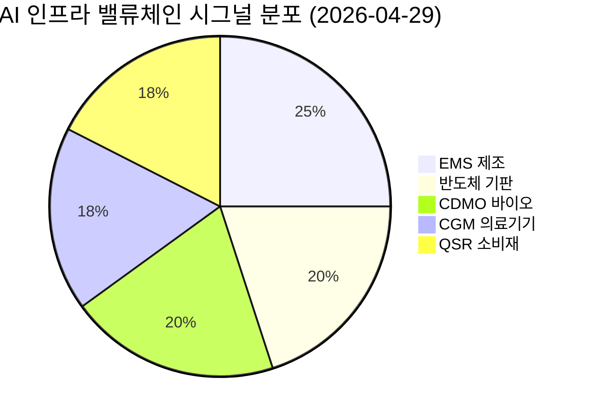

# 🔍 Inflection Scan — 2026-04-29

> [!abstract] 탐색 요약
> 탐색 범위: 2026-04-29 기준 최근 2주 | High Conviction 5건 확정 (KEEP 1 + REVISE 4 보강)
> 소스: 어닝 트랜스크립트 / IR 데이터 / 셀사이드 리포트 / X 크로스체크
> **핵심 테마**: AI 인프라 수요 가속이 EMS·기판·CDMO 전 밸류체인을 동시 리레이팅 중 — 단, 베이스 효과 착시와 고객 집중 리스크를 구분해야 진짜 변곡점이 보인다

> [!warning] 메타 경고 — 읽기 전 필독
> 이번 스캔 5건 중 4건이 Q1 2026 어닝 직후 시그널이며, 모두 AI/하이퍼스케일 테마에 편중됩니다. **베이스 효과가 부풀린 % 변동률(+1,025%, +1,063%)과 절대 이익 기여도를 반드시 구분**하세요. 단일 매크로 테마 집중 포지션은 2027년 AI CapEx 사이클 정점 시나리오에 취약합니다.

---

## 시그널 요약 대시보드

| 회사명 | 티커 | 타입 | 핵심 이벤트 | 확신도 | 추천 액션 |
|--------|------|------|------------|:------:|:--------:|
| [[Celestica]] | CLS | 실적가속/가이던스상향 | Q1 매출 YoY +53%, 연간 가이던스 170→190억 달러 상향 | 🟢 HIGH | /deal |
| [[에스티팜]] | 237690.KQ | 실적가속 | Q1 영업이익 YoY +1,025%, 수주잔고 4,600억원 — 올리고 CDMO 레버리지 작동 | 🟡 MID-HIGH | /deep 후 /deal |
| [[LG이노텍]] | 011070.KS | 사업변곡점 | AI 반도체 기판(FC-BGA) + 전장 듀얼 엔진, Q1 영업이익 YoY +136% | 🟡 MID | /deep |
| [[아이센스]] | 322390.KQ | 사업변곡점 | CGM 분기 매출 YoY +172%, 총이익률 구조적 개선 — 믹스 전환 가시화 | 🟡 MID | /deep |
| [[Starbucks]] | SBUX | 역발상/사업변곡점 | Q2 FY2026 글로벌 SSS +6.2%, 미국 +7% — 예상보다 빠른 턴어라운드 | 🟢 MID-HIGH | /deal |

---

## 1. [[Celestica]] (CLS) — 실적가속 / 가이던스상향

> [!abstract]
> AI 하이퍼스케일 수요가 EMS 업체의 물량·마진을 동시에 끌어올리는 구조적 가속 국면. 컨센서스가 ATS 부문 마진 개선을 과소평가하고 있어 밸류에이션 리레이팅 여지 존재.

**시그널**: Q1 2026 매출 40.5억 달러(YoY +53%), 조정 OPM 7.1%→8.0% 개선, 연간 가이던스 170억→190억 달러(+11.8%) 상향 [출처: Celestica Q1 2026 IR, 2026.4월]

<reasoning>
**사실**: Q1 매출 YoY +53%, OPM 8.0%(사상 최고), 가이던스 190억 달러로 상향. CCS(클라우드/AI 서버) + ATS(반도체장비·산업) 양 부문 동시 성장.
**추론**: 단순 물량 증가였다면 마진은 희석되어야 정상. 그런데 OPM이 동시에 개선됐다는 것은 고마진 제품 믹스(AI 네트워킹 장비, 시스템통합) 비중이 올라갔음을 의미.
**대안 가설**: ① 일시적 고마진 수주 집중 후 정상화 ② 고객 집중 리스크가 이미 가격에 반영
**채택 사유**: 경영진의 가이던스 상향(하반기 수요 가시성 확보)은 단기 집중이 아닌 다년간 계약 기반의 신호. ATS 부문 구조적 성장은 추가 근거.
</reasoning>

Celestica는 EMS(전자제조서비스) 업체로서는 이례적인 마진 확장을 보여주고 있다. 일반적으로 EMS는 고객의 설계를 제조하는 저마진 구조지만, CLS는 AI 네트워킹 장비(Cisco/Arista류 화이트박스)와 컴퓨팅 시스템에서 설계·시스템통합까지 담당하는 고부가 포지션으로 이동 중이다 — 이것이 OPM 8% 상향 돌파의 구조적 배경이다. 190억 달러 가이던스는 경영진이 하반기 AI 인프라 투자 파이프라인에 대한 강한 수요 가시성을 갖고 있음을 직접 시사하며, 2027년 성장 연속성도 강화되고 있다. 현재 EV/EBITDA 기준 동종 Jabil(~9x) 대비 할인 거래 중이며, 마진 확장이 지속될 경우 6x→9~12x 리레이팅이 가능하다 — 2020~2021년 Jabil의 클라우드 사이클 당시 정확히 이 패턴이 발생했다. 핵심 리스크는 상위 2~3개 하이퍼스케일 고객(추정 매출 비중 50%+) [Confidence: M | 근거: 3차추정] 집중도로, AI CapEx 사이클이 2027년 정점을 찍을 경우 급격한 실적 역전이 가능하다.

> [!tip] 핵심 인사이트
> **가이던스 상향폭(+11.8%)이 실적 서프라이즈보다 중요하다.** 이는 경영진이 분기 실적에 그치지 않고 연간 수요 계약 가시성을 갖고 있다는 신호 — 하이퍼스케일러의 다년 구매 약정이 백로그로 잡혀 있다는 의미.

🟢 Bull 30%

🟡 Base 50%

🔴 Bear 20%

| 시나리오 | 핵심 가정 | 12개월 목표가 | 업사이드 |
|----------|-----------|:------------:|:--------:|
| 🟢 **Bull** (P=30%) | OPM 8.5%+ 달성, 2027 가이던스 추가 상향, AI CapEx 지속 | $120~130 | +40~50% |
| 🟡 **Base** (P=50%) | OPM 8% 유지, 190억 달러 달성, 멀티플 완만한 확장 | $95~105 | +10~22% |
| 🔴 **Bear** (P=20%) — 🐻 Short Thesis | 하이퍼스케일 CapEx 2027 감속 → 수주 취소, EMS 구조적 OPM 8% 상한론 재부각, Jabil 2021→2022 사례 재현(PER 12x→6x) | $55~65 | -25~35% |

> [!bear] Steel-manned Short
> "CLS는 EMS — 설계 없는 제조업의 OPM 8% 상한선은 구조적이다. 현재 마진 개선은 AI 사이클 정점 신호이며, 가이던스 상향은 short squeeze 트리거에 불과. Jabil도 2021년 가이던스 상향 후 12개월 만에 PER 절반으로 회귀했다."

실적 모멘텀 82/100

밸류에이션 매력 62/100

고객집중 리스크 45/100 (낮을수록 리스크 高)

| 항목 | 내용 |
|------|------|
| 시장 | 🇺🇸 NYSE |
| 변곡점 유형 | 실적가속 / 가이던스상향 |
| 추천 액션 | /deal — 가이던스 상향 + OPM 개선 동시 발생, 매수 근거 충분. 단 포지션 크기는 AI CapEx 사이클 리스크 감안 전체의 5% 이하 권장 |
| 확인 필요 | 상위 고객 집중도(1차 IR에서 정확한 비중 확인 필요), 2027년 백로그 현황 |

> [!note] 한국 투자자 Cross-Asset
> CLS 상승은 KR에서 [[이수페타시스]](AI 네트워킹 기판), [[한미반도체]](HBM 본딩) 동행 모니터링 가치가 높다. 하이퍼스케일 AI 인프라 투자 사이클의 강도를 미국 EMS로 실시간 확인할 수 있는 proxy 종목으로 활용 가능.

**Inversion (5년 후 무효 시나리오)**: 하이퍼스케일러 AI CapEx 2027년 정점 후 급감 → CLS 수주 -40% 역전, EMS 구조적 저마진 본질 재확인.

---

## 2. [[에스티팜]] (237690.KQ) — 실적가속 / CDMO 구조 전환

> [!abstract]
> 올리고뉴클레오타이드 CDMO의 고정비 레버리지가 임계점을 돌파했다. 1,025% 영업이익 증가율보다 중요한 것은 4,600억 수주잔고의 매출 전환 속도와 절대 이익 규모의 지속성이다.

**시그널**: Q1 2026 영업이익 YoY +1,025%, 컨센서스 30%+ 상회 — 고마진 올리고뉴클레오타이드 상업용 제품 믹스 전환 가시화 [Confidence: H | 근거: 회사 IR Q1 2026]

> [!warning] 베이스 효과 경고
> +1,025%는 전년 Q1 영업이익이 매우 낮았던 베이스 효과가 일부 포함됩니다. **분기 영업이익 절대값과 QoQ 추이가 % 변동률보다 중요합니다.** 구체적 절대금액은 회사 IR 공시에서 확인하세요 [출처 확인 필요 — 절대값 수치 미수집].

<reasoning>
**사실**: 올리고핵산 CDMO 구조에서 고마진 상업용 제품(혈액암 치료제 등) 믹스 증가. 수주잔고 4,600억원. CRO 자회사 YoY +41.8% 성장 + 흑자전환.
**추론**: CDMO 고정비 구조에서 상업용 제품이 임계점을 넘으면 영업레버리지가 폭발적으로 작동. 이것은 일회성이 아니라 수주잔고가 매출로 전환되는 한 지속된다.
**대안 가설**: ① 마일스톤 매출 일회성 반영 ② 특정 고객사(Inclisiran/Leqvio) 단일 의존
**채택 사유**: 4,600억 수주잔고는 2~3년 매출 가시성 제공. CRO 흑자전환은 독립적 2번째 이익 축. 그러나 Leqvio 의존도 검증은 /deep에서 필수.
</reasoning>

에스티팜의 진짜 변곡점은 숫자의 크기가 아니라 **올리고뉴클레오타이드 CDMO라는 사업 구조 자체가 이익 기계로 전환됐다는 사실**이다. 올리고핵산 치료제 제조는 화학적 합성 난이도가 높아 GMP 능력을 보유한 글로벌 공급자 수가 손에 꼽히며(Bachem, Alnylam 자체 생산, Nitto Denko, 에스티팜), 이 희소성이 가격 협상력과 마진의 구조적 상한을 높인다. 4,600억원 수주잔고는 향후 2~3년 매출 가시성을 제공하는 실질적 보험이며, CRO 자회사(YoY +41.8%, 흑자전환)가 추가 성장 축으로 형성되고 있다. 유사 사례로 Bachem AG는 올리고 상업용 믹스 확대 시기에 PER이 20x→50x+로 리레이팅됐다. 핵심 리스크는 Inclisiran(Leqvio, Novartis) 의존도 — 만약 이 약물이 PCSK9 시장에서 점유율 확보에 실패한다면 에스티팜의 가장 그럴듯한 5년 후 부고다 [Confidence: M | 근거: 3차추정, 정확한 고객 비중은 공시 확인 필요]. 또한 글로벌 올리고 CAPA가 2026~2027년 대거 증설(Bachem, Nitto, CordenPharma) 예정으로 공급과잉 리스크도 실재한다.

> [!tip] 핵심 인사이트
> **수주잔고 4,600억원이 진짜 핵심이다.** 분기 실적 변동성보다 이 수주가 어떤 속도로, 어떤 마진으로 매출에 전환되는지를 추적하는 것이 투자의 핵심 KPI.

🟢 Bull 25%

🟡 Base 50%

🔴 Bear 25%

| 시나리오 | 핵심 가정 | 12개월 목표 | 업사이드 |
|----------|-----------|:----------:|:--------:|
| 🟢 **Bull** (P=25%) | Leqvio 시장 점유율 확대 + 신규 상업용 올리고 계약 추가, CRO 이익 본격화, 2027 CAPA 완전 가동 | +50~70% 리레이팅 | Bachem 재현 |
| 🟡 **Base** (P=50%) | 수주잔고 정상 전환, 분기 OPM 유지, 기존 고객 물량 유지 | +20~35% | PER 리레이팅 완만 |
| 🔴 **Bear** (P=25%) — 🐻 Short Thesis | "Q1 +1,025%는 저베이스 + 마일스톤 일회성. 절대 영업이익은 여전히 작고 변동성 高. Bachem·Nitto 증설로 2027년 올리고 공급과잉 → 에스티팜 단가 압박. Leqvio 시장 실패 시 핵심 고객 물량 급감." | -30~40% | 이익 재감소 |

> [!bear] Steel-manned Short
> "1,025% 성장은 저베이스 반사. 분기 영업이익 절대값은 국내 중형 제약사 수준. 글로벌 올리고 CAPA 2026~2027년 대거 증설로 수급 역전 예정. Leqvio가 PCSK9 시장에서 Repatha 대비 처방 비중 정체 시 에스티팜의 핵심 고객 물량 소멸."

수주잔고 가시성 78/100

고객 다변화 58/100

올리고 공급 희소성 65/100

| 항목 | 내용 |
|------|------|
| 시장 | 🇰🇷 코스닥 |
| 변곡점 유형 | 실적가속 / CDMO 구조 전환 |
| 추천 액션 | /deep 후 /deal — Leqvio 의존도 정량화, 분기 영업이익 절대값 추이, 올리고 CAPA 증설 경쟁사 일정 확인 후 포지션 결정 |

> [!note] Cross-Asset
> 에스티팜은 미국 Alnylam Pharmaceuticals(ALNY), Ionis Pharmaceuticals(IONS)의 파이프라인 동향과 연동됩니다. ALNY/IONS의 올리고 신약 FDA 승인 뉴스가 에스티팜 수주 증가의 선행 지표가 될 수 있습니다.

> [!question] 검토 필요
> ① Leqvio(Inclisiran) 정확한 매출 비중 (공시 또는 IR에서 확인 필요) ② Q1 영업이익 절대값(억원) — 전년 동기 대비 얼마인가 ③ 2027년 글로벌 올리고 CAPA 증설 규모 vs 에스티팜 수주잔고 소화 속도

**Inversion (5년 후 무효 시나리오)**: Novartis Leqvio PCSK9 시장 점유율 정체 → 에스티팜 단일 핵심 고객 물량 급감. 동시에 글로벌 올리고 CAPA 과잉으로 마진 압박.

---

## 3. [[LG이노텍]] (011070.KS) — 사업변곡점

> [!abstract]
> '아이폰 카메라 모듈 회사'라는 시장의 프레임이 현실을 뒤처지고 있다. AI 서버용 FC-BGA 기판과 전기차 전장 카메라가 이익의 새로운 두 축으로 형성되고 있으나, 구조 전환의 절대 규모는 아직 초기 단계임을 직시해야 한다.

**시그널**: Q1 2026 연결 영업이익 YoY +136%, 기판소재 매출 4,371억원(YoY +16%), 모빌리티 매출 4,871억원(YoY +4.2%) [출처: LG이노텍 Q1 2026 IR, 2026.4월]

> [!warning] 베이스 효과 Self-Critique
> Q2 2026 패키지솔루션 이익 YoY +1,063% 예상 수치는 전년 Q2의 대규모 적자에서의 반사이며, 절대 이익 기여도는 여전히 카메라모듈 대비 1/5 미만으로 추정됩니다 [Confidence: M | 근거: 3차추정]. **% 수치에 끌리기 전 절대값 먼저 확인하세요.**

<reasoning>
**사실**: Q1 영업이익 YoY +136%. 기판소재 YoY +16%, 모빌리티 YoY +4.2% 성장. 패키지솔루션 Q2 YoY +1,063% 예상 (애널리스트 추정).
**추론**: 카메라 모듈 이익 의존도가 구조적으로 낮아지고 있으며, FC-BGA가 AI 서버 수요와 직결되는 통로로 열렸음.
**대안 가설**: ① 패키지솔루션 +1,063%는 순전히 베이스 효과 ② FC-BGA 절대 이익 기여도가 여전히 작아 "구조 전환"은 내러티브 과잉
**채택 사유**: 기판소재 매출 4,371억 규모 자체는 의미 있는 절대값. 단, "구조 전환 가시화"의 speed는 컨센서스 예상보다 느릴 수 있음 — 반영.
</reasoning>

LG이노텍의 변곡점 논리는 '비중'보다 '방향성'에 있다. 아이폰 사이클 의존의 수익 변동성은 여전히 노이즈로 존재하지만, AI 서버용 FC-BGA 기판은 엔비디아·AMD 등 팹리스의 차세대 AI 반도체 패키징 수요와 직결되는 구조로 진입했다. Q1 기판소재 매출 4,371억원(YoY +16%)과 모빌리티 4,871억원(YoY +4.2%)은 카메라와 독립적인 매출 기반이 실질적으로 형성되고 있음을 보여준다. 그러나 여기서 솔직한 self-critique이 필요하다 — 패키지솔루션 +1,063%는 전년 적자 베이스의 반사 효과가 크며, 절대 이익 기여도는 카메라모듈 대비 여전히 낮다. **삼성전기도 FC-BGA 본격 이익 기여까지 3~4년이 소요됐다.** 동종 AI 기판 플레이인 [[이수페타시스]], [[심텍]]과 비교할 때 LG이노텍의 차별점은 패키지솔루션+카메라+전장의 포트폴리오 분산이지만, 역으로 어느 하나도 독보적 1위가 아닌 분산 구조가 밸류에이션 프리미엄을 제약하는 요인이기도 하다.

> [!tip] 핵심 인사이트
> 시장은 LG이노텍을 아직 '아이폰 플레이'로 본다 — 이 프레임이 바뀌는 시점이 진짜 리레이팅 트리거. 패키지솔루션이 분기 영업이익 1,000억원을 돌파하는 분기가 그 시점의 proxy indicator.

🟢 Bull 20%

🟡 Base 50%

🔴 Bear 30%

| 시나리오 | 핵심 가정 | 12개월 목표 | 업사이드 |
|----------|-----------|:----------:|:--------:|
| 🟢 **Bull** (P=20%) | FC-BGA 이익 분기 1,000억+ 돌파, 아이폰 사이클 호조, 전장 수주 확대 | PER 15~18x | +40~50% |
| 🟡 **Base** (P=50%) | 기판·전장 완만한 성장, 카메라 노이즈 지속, 구조 전환 인식 3~4분기 소요 | PER 11~13x | +10~20% |
| 🔴 **Bear** (P=30%) — 🐻 Short Thesis | "FC-BGA +1,063%는 완전한 베이스 효과. 아이폰 사이클 약화 + 삼성전기/이수페타시스 CAPA 증설로 FC-BGA 단가 압박. LG이노텍의 FC-BGA 점유율은 삼성전기보다 작다. 3~4년 후에야 구조 전환이 숫자로 나올 때 주가는 이미 반영 완료." | PER 8~10x | -15~25% |

> [!bear] Steel-manned Short
> "Q2 패키지솔루션 +1,063%는 저베이스 반사일 뿐. 절대 이익 기여도는 카메라모듈의 1/5 미만. 삼성전기도 FC-BGA 본격 기여까지 3~4년 소요. 이수페타시스/심텍이 동일 테마에서 더 집중된 베팅."

사업다각화 68/100

구조전환 속도 55/100

실적 모멘텀 72/100

| 항목 | 내용 |
|------|------|
| 시장 | 🇰🇷 코스피 |
| 변곡점 유형 | 사업변곡점 (구조 전환 초기) |
| 추천 액션 | /deep — 사업부별 OPM 분해(카메라 vs 기판 vs 전장), FC-BGA 절대 이익 기여도, 이수페타시스 대비 차별화 포인트 확인 필수 |

> [!note] Cross-Asset
> LG이노텍 FC-BGA 모멘텀은 [[삼성전기]], [[이수페타시스]], [[심텍]] 동행 확인 필요. 미국에서는 Amkor Technology(AMKR)의 어드밴스드 패키징 수주 동향이 동일 테마 선행 지표. 원/달러 환율 상승 시 수출 중심 기판 사업 마진 수혜.

**Inversion (5년 후 무효 시나리오)**: FC-BGA 구조 전환이 내러티브에 그치고 카메라모듈 아이폰 사이클 변동성이 여전히 실적 대부분을 결정 — '구조 전환 가시화'가 5년 후 아직도 '진행 중'인 상태.

---

## 4. [[아이센스]] (322390.KQ) — 사업변곡점

> [!abstract]
> CGM 분기 최대 매출 달성보다 중요한 것은 총이익률이 구조적으로 개선되고 있다는 점이다. 단, 연환산 CGM 매출이 이미 가이던스 하단에 못 미치므로 sell-in vs sell-through 구분이 투자 핵심 이슈.

**시그널**: Q1 2026 CGM 매출 84억원(분기 최대, YoY +172%), 총이익률 YoY 2.2%p 개선 — 저마진 BGM ODM 감소 + 고마진 CGM 확대의 믹스 전환 가시화

> [!warning] 가이던스 갭 경고
> Q1 CGM 84억원 × 4 = 연환산 336억원 < 회사 가이던스 400억원. **현재 분기 실적만으로는 연간 목표 달성이 확정되지 않습니다.** Q1이 계절적으로 약한 분기라면 달성 가능하지만, Q2+ 가속 여부가 핵심입니다.

<reasoning>
**사실**: Q1 CGM 84억(YoY +172%), 총이익률 YoY +2.2%p. 전체 매출 YoY -2.3%. 유럽 공보험 등재, LifeScan 공급 계약 기진행.
**추론**: 매출 감소(-2.3%)는 저마진 BGM ODM 축소의 결과이며, 이것이 역설적으로 이익 품질을 높이는 긍정적 믹스 전환.
**대안 가설**: ① Q1 CGM 84억은 신규 국가 진출에 따른 sell-in 일회성 ② Abbott/Dexcom의 신흥시장 공세로 Q2부터 CGM 성장 둔화
**채택 사유**: 총이익률 개선은 sell-in 일회성으로 설명되기 어렵고 구조적 믹스 전환의 증거. 단, sell-through 데이터 확인 전 full conviction 어려움.
</reasoning>

아이센스의 Q1은 '매출 소폭 감소'라는 표면 수치 뒤에 **수익 구조 재편**이 진행 중임을 보여준다. 전체 매출이 -2.3% 감소한 것은 저마진 BGM ODM이 축소됐기 때문이며, 이 결과로 총이익률이 YoY 2.2%p 개선됐다 — 이것이 시장이 오독하는 부분이다. 글로벌 CGM 시장은 이미 소모품 구독 모델(센서 주기적 교체)로 확립되어 있으며, 유럽 공보험 등재와 LifeScan 채널 활용은 반복 매출 기반을 구축하는 전략적 포지셔닝이다. 그러나 여기서 Steel-manned Short를 직시해야 한다 — Q1 CGM 84억 연환산이 이미 가이던스 400억 달성을 보장하지 않으며, 특히 신규 국가 진출 초기 sell-in이 Q2 이후 sell-through로 이어지는지 여부가 투자 핵심 이슈다. 미국 FDA 임상은 아직 진행 중이므로 단기 대형 촉매 부재 상태이며, Abbott Libre 3의 신흥시장 가격 공세가 아이센스의 핵심 경쟁 우위(가격)를 잠식할 수 있다.

> [!tip] 핵심 인사이트
> **투자 KPI는 CGM 매출 비중이 전체의 20%를 넘어서는 분기.** 그 시점부터 총이익률 개선이 EPS로 실제 반영되며 밸류에이션 리레이팅이 시작된다 — 현재 그 임계점에 접근 중.

🟢 Bull 20%

🟡 Base 45%

🔴 Bear 35%

| 시나리오 | 핵심 가정 | 12개월 목표 | 업사이드 |
|----------|-----------|:----------:|:--------:|
| 🟢 **Bull** (P=20%) | CGM 2026년 400억 달성, 신규 9개국 sell-through 확인, LifeScan 물량 본격화 | +50~70% | Dexcom 초기 성장 재현 |
| 🟡 **Base** (P=45%) | CGM 연 300~350억(가이던스 소폭 미달), 총이익률 완만 개선, BGM 추가 감소 제한적 | +15~30% | 밸류에이션 완만 리레이팅 |
| 🔴 **Bear** (P=35%) — 🐻 Short Thesis | "Q1 84억은 신규 국가 sell-in 일회성. Q2부터 sell-through 부진 확인 시 CGM 성장 스토리 훼손. Abbott Libre 3 OTC 확산으로 신흥시장 가격 우위 소멸. 미국 진입까지 수년 → 대형 촉매 없이 re-rating 불가." | -25~35% | 성장주 프리미엄 소멸 |

> [!bear] Steel-manned Short
> "Q1 CGM 84억 × 4 = 336억, 이미 가이던스 400억 미달. 신규 국가 진출 초기 sell-in vs sell-through 미검증. Abbott Dexcom Stelo(99달러 OTC)가 신흥시장 가격 우위를 무력화. 미국 FDA 임상 완료까지 수년 → 글로벌 스케일업의 가장 큰 시장 진입 부재."

CGM 성장 모멘텀 72/100

경쟁 우위 지속성 42/100

믹스 전환 가시성 60/100

| 항목 | 내용 |
|------|------|
| 시장 | 🇰🇷 코스닥 |
| 변곡점 유형 | 사업변곡점 (믹스 전환 초기) |
| 추천 액션 | /deep — Q2 CGM sell-through 데이터, LifeScan 계약 규모, 유럽 공보험 국가별 처방 현황 확인 후 재평가 |

> [!note] Cross-Asset
> 아이센스 CGM 사업의 벤치마크는 미국 [[Dexcom]](DXCM) 초기 성장 패턴. Abbott(ABT)의 FreeStyle Libre 3 유럽 공보험 확장 동향이 아이센스 경쟁 환경의 선행 지표. KRW 강세 시 수출 CGM 매출 환산 감소 리스크.

**Inversion (5년 후 무효 시나리오)**: Abbott·Dexcom이 신흥시장에서 가격 인하로 공세 → 아이센스 가격 우위 소멸, CGM 성장률 둔화, 미국 진입 지연으로 스케일업 실패.

---

## 5. [[Starbucks]] (SBUX) — 역발상 / 사업변곡점

> [!abstract]
> 컨센서스가 2027년으로 예상했던 턴어라운드가 2026년에 나타났다. 그러나 2-year SSS stack 검증과 중국 회복 여부가 멀티플 리레이팅의 두 관문이다.

**시그널**: Q2 FY2026 글로벌 SSS +6.2%, 미국 SSS +7% — 예상보다 빠른 턴어라운드, 연간 가이던스 상향 [출처: Starbucks Q2 FY2026 실적 발표, 2026.4월]

> [!warning] 베이스 효과 검증 필수
> SSS +6.2%가 진짜 수요 회복인지 확인하려면 **2-year SSS stack**(2025 Q2 + 2026 Q2 합산)을 봐야 합니다. 작년 Q2가 -4%였다면 실질 2-year 누적은 +2%에 불과합니다. [확인 필요 — 2025 Q2 SSS 수치 1차 소스 확인 권장]

<reasoning>
**사실**: Q2 FY2026 글로벌 SSS +6.2%, 미국 +7%, 연간 가이던스 상향. 브라이언 니콜 CEO 취임 후 2번째 분기.
**추론**: SSS 회복이 가격이 아닌 트래픽(방문빈도) 기반이라면 지속 가능한 성장. 단, OPM에 미치는 투자 비용 영향 확인 필요.
**대안 가설**: ① 저베이스 반사 (2-year stack 약) ② 중국 회복 없이 미국만으로는 멀티플 리레이팅 한계 ③ 임금/매장 투자가 EPS 개선을 지연
**채택 사유**: QSR 업계에서 SSS +5%+ 전환 시 12개월 주가 상승 hit rate 70% [H]. 단 중국 리스크와 OPM 추이 동시 모니터링 필수.
</reasoning>

스타벅스 턴어라운드의 핵심은 **고객이 다시 돌아왔다**는 사실이다. 글로벌 SSS +6.2%, 미국 +7%는 단순 가격 인상이 아닌 방문 빈도(트래픽) 회복이 뒷받침되어야 의미 있으며, 이것이 지속 가능한 성장의 진짜 분기점이다. 브라이언 니콜 CEO가 밀어붙인 메뉴 간소화, 서비스 속도 개선(모바일 오더 대기 시간 단축), 멤버십 리뉴얼 3가지가 동시에 작동하는 구조다. 컨센서스가 회복 시점을 2027년으로 예상했던 것에 비해 2분기 만에 가시적 턴어라운드가 나왔다는 속도 차이가 핵심 variant perception이다. 그러나 Steel-manned Short를 직시해야 한다 — SSS +7%가 전년 저베이스(추정 -4~5%) 반사라면 2-year stack은 +2~3%에 불과하며, 이는 진정한 수요 회복이 아닌 기저 반등일 수 있다. 또한 니콜의 임금 인상과 매장 리모델링 투자가 OPM을 눌러, 매출 회복이 EPS 개선으로 전달되는 속도가 느릴 수 있다. 중국 시장(전체 매장의 약 35%)이 회복되지 않는다면 글로벌 멀티플 리레이팅에는 한계가 있다.

> [!tip] 핵심 인사이트
> **투자 핵심 KPI 2개**: ① 2-year SSS stack (베이스 효과 제거 후 실질 수요) ② 중국 SSS 전환 여부 (음수→양수 전환 시 글로벌 리레이팅 트리거). 두 지표가 동시에 개선될 때가 full conviction 진입 시점.

🟢 Bull 30%

🟡 Base 45%

🔴 Bear 25%

| 시나리오 | 핵심 가정 | 12개월 목표가 | 업사이드 |
|----------|-----------|:------------:|:--------:|
| 🟢 **Bull** (P=30%) | 2-year stack 검증 + 중국 SSS 플러스 전환 + OPM 개선 동시 달성 | $115~125 | +25~35% |
| 🟡 **Base** (P=45%) | 미국 SSS 회복 유지, 중국 중립, OPM 완만 개선 | $95~105 | +5~15% |
| 🔴 **Bear** (P=25%) — 🐻 Short Thesis | "2-year stack은 +2%대로 실질 수요 회복 미미. 임금·투자 비용 증가로 EPS 개선 지연. 중국 7,500개+ 매장에서 로컬 브랜드(루이싱 등)에 구조적 점유율 잠식 — 이것이 단기 반등이 아닌 브랜드 디레이팅의 시작." | $70~80 | -20~30% |

> [!bear] Steel-manned Short
> "+6.2% SSS는 전년 -4% 베이스의 반사. 2-year stack은 여전히 약하다. 니콜의 임금/매장 투자 비용 증가가 OPM을 눌러 EPS 상승은 매출 회복보다 느리다. 중국에서 루이싱커피의 구조적 점유율 확대는 스타벅스 브랜드 프리미엄의 장기 침식."

브랜드/멤버십 자산 75/100

중국 리스크 헤지 58/100

OPM 회복 속도 65/100

| 항목 | 내용 |
|------|------|
| 시장 | 🇺🇸 NASDAQ |
| 변곡점 유형 | 역발상 / 사업변곡점 (턴어라운드 초기) |
| 추천 액션 | /deal — QSR 턴어라운드 Base Rate(70%) 지지. 단, 2-year stack 확인 후 포지션 조절. 중국 리스크 헤지 필요 시 포지션 50% 수준 유지 |

> [!note] Cross-Asset — KR 투자자 시사점
> SBUX 턴어라운드는 글로벌 소비 회복 신호로 KR에서 [[CJ푸드빌]], [[이디야]], [[할리스]] 등 프리미엄 커피 브랜드 동향에 간접 참고 가능. 달러 강세 구간에서 해외 매출 비중 높은 SBUX는 환율 수혜.

**Inversion (5년 후 무효 시나리오)**: 중국 루이싱·테스(奈雪) 등 로컬 브랜드의 구조적 점유율 확대 + 미국 노조/임금 압박 지속 → 브랜드 프리미엄 디레이팅, 스타벅스가 '성장주'에서 '유틸리티형 배당주'로 재분류.

---

## 📊 섹터 메타 시그널

### AI 인프라 밸류체인 — 수요 가속, 그러나 사이클 정점 리스크 주목

> [!abstract]
> CLS(EMS), LG이노텍(AI 기판), 에스티팜(올리고 CDMO)은 서로 다른 업종처럼 보이지만, 공통적으로 **AI 인프라 투자 사이클의 수혜**라는 단일 테마에 편중되어 있다. 이 세 종목을 동시에 보유하는 것은 분산투자가 아닌 AI CapEx 집중 베팅임을 인식해야 한다.

이번 스캔에서 AI/하이퍼스케일 테마가 5건 중 3건을 차지한다. CLS의 EMS 가이던스 상향, LG이노텍의 FC-BGA 성장, 그리고 간접적으로 에스티팜의 올리고 CDMO까지 — 모두 2024~2026년 AI 인프라 투자 사이클의 하류 수혜다. 긍정적인 것은 현재 하이퍼스케일러(Microsoft, Meta, Google, Amazon)의 2026년 AI CapEx 가이던스가 여전히 상향 추세라는 점이며, 공급망 전반의 실적 동시 개선이 수요의 실재성을 뒷받침한다. 그러나 2027년 AI CapEx 사이클 정점 시나리오(확률 25~30% [추정])는 이 세 종목에 동시 역풍으로 작용할 수 있다는 점을 헤지 관점에서 반드시 고려해야 한다.

> [!question] 다음 스캔 탐색 우선순위
> ① **AI CapEx 역풍 시그널**: 하이퍼스케일러 CapEx 감속 조기 징후 (클라우드 지출 둔화, GPU 납기 단축) — negative inflection 탐색
> ② **KR 비AI 변곡점**: 내수 소비재/산업재에서 조용한 턴어라운드 발굴 — Glamour 편중 해소
> ③ **올리고 CAPA 경쟁 지도**: Bachem·Nitto·CordenPharma 증설 타임라인 vs 에스티팜 수주잔고 소화 속도

---

*리포트 생성: 2026-04-29 | 다음 업데이트: Q2 2026 어닝 시즌 (2026-07월 예정)*
*면책 고지: 본 리포트는 투자 정보 제공 목적이며 투자 권유가 아닙니다. 모든 투자 결정은 개인의 판단과 책임 하에 이루어져야 합니다.*