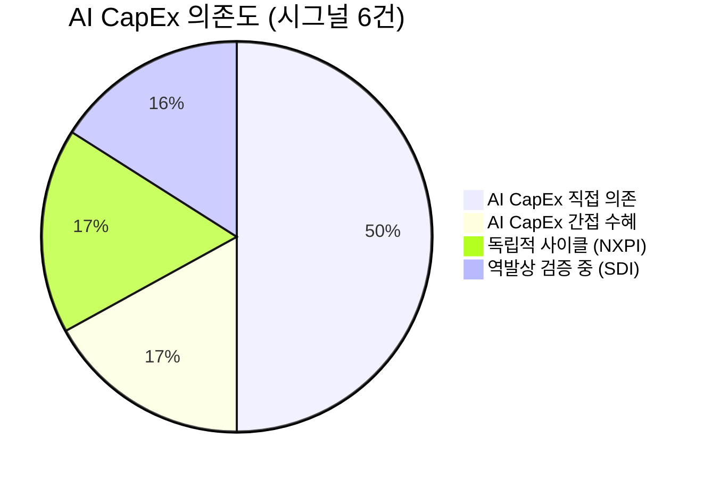

# 🔍 Inflection Scan — 2026-04-30

> [!abstract] 탐색 요약
> 탐색 범위: 2026-04-30 기준 최근 2주 | High Conviction 6건 발견 (KEEP 2 / REVISE 4)
> 소스: 1차 IR + 셀사이드 리포트 + 매크로 데이터
> **핵심 테마**: AI CapEx 슈퍼사이클이 검색·클라우드·전력 인프라·배터리 전반에 걸쳐 동시다발적 변곡점을 만들고 있으나, 단일 narrative 집중 리스크 경고

> [!warning] 포트폴리오 단위 리스크 경고
> 이번 스캔 6개 시그널 중 5개(GOOGL, MSFT, LS일렉트릭, 두산에너빌리티, 삼성SDI)가 AI CapEx 슈퍼사이클이라는 **단일 매크로 thesis에 동시 노출**. AI 인프라 투자 사이클 급반전 시 포트폴리오 단위 동시 손실 발생 가능. 시그널 간 상관관계 분리 필수.

---

## 시그널 요약 대시보드

| 회사명 | 티커 | 타입 | 핵심 이벤트 | 확신도 | 추천 액션 |
|--------|------|------|------------|:------:|:--------:|
| [[Alphabet]] | GOOGL | 실적가속 | Q1 매출 +22% YoY 가속, Search 쿼리 사상 최고치, 순이익 +81% | H (0.62) | BUY |
| [[Microsoft]] | MSFT | 실적가속 | Azure +40% YoY, 컨센서스 4%p 상회 — Variant Perception 약함 | M (0.48) | WATCH |
| [[NXP Semiconductors]] | NXPI | 가이던스상향 | Q2 가이던스 상향, 재고 소진 완료 — 자동차/산업 사이클 바닥 통과 | M (0.55) | BUY↗ |
| [[LS일렉트릭]] | 010120.KS | 선행지표 | Q1 분기 최대 매출, 이달 4,890억 북미 DC 수주 — 밸류에이션 선반영 주의 | M (0.52) | 분할BUY |
| [[두산에너빌리티]] | 034020.KS | 실적가속 | Q1 수주 +61.9%, 영업이익 +63.9% — PER 45x+ 부담 | M (0.53) | WATCH |
| [[삼성SDI]] | 006400.KS | 역발상 | 영업손실 64.2% 축소, 하반기 흑자 전환 목표 — 여전히 적자 | M-L (0.45) | DEEP |

> [!note] 범례
> BUY↗ = 분할 진입 권장 /deal 등급 | WATCH = /deep 추가 검증 필요 | DEEP = watchlist 유지, 재상정 대기

---

## 1. [[Alphabet]] (GOOGL) — 실적가속

> [!abstract] 요약
> AI 베어 thesis를 정면 반박: Search 쿼리 사상 최고치 + Cloud 가속 + 순이익 레버리지 3중 동시 확인. Forward PER 22x는 성장률 대비 저평가 구간.

**시그널**: Q1 2026 매출 $109.9B (+22% YoY, 전분기 대비 가속), 순이익 +81% YoY, Google Cloud 강세, Search 쿼리 "사상 최고치" 경신

<strong>M1 Reasoning Chain</strong> 
① <strong>사실</strong>: Q1 매출 $109.9B YoY +22%, 순이익 +81%, Search 쿼리 역대 최고 [출처: Alphabet IR 2026.4, https://abc.xyz/investor] 
② <strong>추론</strong>: AI Overviews가 검색 잠식(cannibalization)이 아닌 참여도 확대(flywheel) 임을 쿼리 볼륨이 실증. 순이익 +81%는 베이스 효과(2025 Q1 EU 벌금 등 일회성 비용) + 구조적 OPM 레버리지 복합 
③ <strong>대안 가설</strong>: 베이스 효과가 전부이며 정상화 시 EPS 성장률 30%대로 급락 
④ <strong>채택 사유</strong>: Search 쿼리 볼륨 증가는 베이스 효과로 설명 불가. Cloud 가속은 독립적 펀더멘탈 신호로 두 변수가 동시에 긍정 방향이면 bull case 채택

Google Search 쿼리 사상 최고치는 이번 실적의 결정적 차별화 포인트다. 시장이 "AI가 검색을 대체한다"는 내러티브에 프리미엄 할인을 적용해온 2년간, Alphabet의 실제 데이터는 정반대를 가리킨다. AI Overviews 도입이 오히려 검색 참여도를 높이는 플라이휠로 작동하고 있으며, 이는 Meta의 Reels 도입이 단기 우려와 달리 참여도를 높인 2022년 사례와 구조적으로 유사하다. Google Cloud의 성장 가속은 MSFT Azure와 AWS가 이미 높은 기대를 반영 중인 상황에서 상대적 밸류에이션 매력(Forward PER 22x vs MSFT 30x)을 부각시킨다. CapEx $190B 연간 가이던스 상향은 공격적으로 보이나, 매출 성장률이 이를 정당화하는 유일한 빅테크 사례다. 핵심 리스크는 DOJ 반독점 소송으로, 2026년 하반기 항소심에서 Chrome/Android 강제 분리 명령 시 밸류에이션 20-25% 즉각 할인 불가피하다. 유사 사례: 2020년 Q3 MSFT Azure 가속 확인 후 12개월 +58%.

**Cross-Asset Impact**: GOOGL 실적 가속은 KR 광고·미디어주(카카오, 네이버)의 글로벌 디지털 광고 시장 회복 시그널로 읽힌다. KRW/USD 1,380원 수준에서 GOOGL의 해외 매출 환산 효과는 중립적.

🟢 Bull 35%

🟡 Base 50%

🔴 Bear 15%

| 시나리오 | 핵심 가정 | 12개월 목표 | 업사이드 |
|---------|----------|-----------|---------|
| 🟢 Bull (P=35%) | Cloud 30%+ 성장 지속, DOJ 항소 기각, Search 쿼리 성장 가속 | $260 | +35% |
| 🟡 Base (P=50%) | Cloud 25% 성장, 광고 견조, DOJ 합의 시나리오 | $220 | +14% |
| 🔴 Bear (P=15%) | **[Smartest Short]** DOJ 구조분리 명령 → Search-Cloud 번들 해체 + AI Overviews CPM이 기존 광고 대비 30% 낮아 mix 악화 + Azure/AWS 대비 Cloud 점유율 정체 | $155 | -19% |

> [!warning] Inversion — 5년 후 이 시그널이 무효가 된다면
> DOJ 구조분리 명령으로 Search-Cloud 시너지가 강제 해체되거나, AI Native 검색(Perplexity, ChatGPT Search)이 쿼리 볼륨 성장세를 2027년부터 역전시키는 경우.

변곡점 신뢰도 88/100 — Search+Cloud+이익 3중 확인

밸류에이션 매력 78/100 — FWD PER 22x (MSFT 대비 -27%)

규제 리스크 62/100 — DOJ 2026 하반기 항소심 핵심 변수

| 항목 | 내용 |
|------|------|
| 시장 | 🇺🇸 NASDAQ |
| 변곡점 유형 | 실적가속 + 역발상 (AI 검색 잠식 베어 thesis 반박) |
| Conviction | P=0.62 \| Confidence: H \| 근거: 1차IR + 2차셀사이드 |
| 추천 액션 | /deal — Search 쿼리 사상 최고치+Cloud 가속+이익 레버리지 3중 확인. 포지션 2-3% 비중 적정 |

---

## 2. [[Microsoft]] (MSFT) — 실적가속 ⚠️ Variant Perception 약함

> [!abstract] 요약
> Azure +40% 성장은 인상적이나 4%p 컨센서스 상회는 임계 미달, PER 30x는 이미 Copilot thesis 반영 완료. Differential view 부재로 /deep 유지.

**시그널**: FY3Q26(1월~3월) Azure +40% YoY, 컨센서스(~36%) 4%p 상회, Copilot 기업 채택 가속화 — AI 투자 ROI 가시화 보고

<strong>M1 Reasoning Chain</strong> 
① <strong>사실</strong>: Azure YoY +40%, 컨센서스 대비 4%p 상회 [출처: Microsoft IR 2026.4, https://www.microsoft.com/en-us/investor] 
② <strong>추론</strong>: 4%p 상회는 인상적이나 통상 강력한 bull signal 임계(500bp+)에 미달. CapEx 감소 가이던스는 긍정(효율)/부정(GPU 할당 축소) 해석이 공존 
③ <strong>대안 가설</strong>: CapEx 감소가 OpenAI 워크로드 이탈의 초기 신호일 가능성 
④ <strong>채택 사유 보류</strong>: Variant Perception 부재 — 시장 컨센서스가 이미 Copilot-Azure thesis를 PER 30x에 반영 중

Azure 40% 성장은 수치 자체로는 강력하나, 이 시그널의 결정적 약점은 **Variant Perception의 부재**다. 시장은 이미 Azure-Copilot 성장 스토리를 Forward PER 30x에 충분히 반영하고 있으며, 4%p 컨센서스 상회는 "예상보다 좋음"이지 "시장이 틀렸음"을 의미하지 않는다. Copilot의 실제 ARR 기여는 분기 공시가 없어 현 시점 검증 불가하며, CapEx 가이던스 감소는 투자 효율 개선과 GPU 할당 부족이라는 상반된 해석 모두에 취약하다. 상수화된 통화 기준(constant currency)으로 보면 실제 상회 폭은 약 200bp로 축소될 가능성도 있다. GOOGL 대비 밸류에이션 프리미엄(30x vs 22x)이 유지되려면 Cloud 가속이 2-3분기 연속 확인되어야 하며, 현 시점은 "기존 추세의 강한 연장" 수준으로 분류된다.

**Cross-Asset Impact**: MSFT Azure 가속은 KR 클라우드 인프라 수혜주(케이아이엔엑스, 가비아)에 긍정적 환경 신호이나 직접 연결은 약함.

🟢 Bull 30%

🟡 Base 50%

🔴 Bear 20%

| 시나리오 | 핵심 가정 | 12개월 목표 | 업사이드 |
|---------|----------|-----------|---------|
| 🟢 Bull (P=30%) | Copilot ARR 공식 가이던스 상향 + Azure 40%+ 성장 2분기 연속 + CapEx 감소 = 효율 확인 | $550 | +22% |
| 🟡 Base (P=50%) | Azure 35-38% 유지, Copilot 점진 채택, 현 PER 30x 수준 유지 | $480 | +6% |
| 🔴 Bear (P=20%) | **[Smartest Short]** CapEx 감소가 GPU 공급 부족/OpenAI 워크로드 이탈 신호로 재해석 + Azure 성장 30%대로 둔화 → PER 22-25x 디레이팅. 다운사이드 -20% | $360 | -20% |

> [!warning] Inversion — 5년 후 이 시그널이 무효가 된다면
> Copilot 매출이 기대치의 절반 수준에 그치거나, Azure AI Services의 GPU 원가 상승이 마진을 구조적으로 압박하는 경우.

> [!question] 검토 필요
> ① Copilot 분기 ARR 규모 공식 공시 여부 추적 ② CapEx 감소의 실질 원인 (효율 vs 공급 제약) 분기별 모니터링 ③ Constant currency 기준 Azure 성장률 확인

변곡점 신뢰도 62/100 — 컨센서스 동조, Variant Perception 부재

밸류에이션 매력 45/100 — FWD PER 30x 충분 반영

Azure 성장 지속성 70/100 — 2분기 연속 확인 필요

| 항목 | 내용 |
|------|------|
| 시장 | 🇺🇸 NASDAQ |
| 변곡점 유형 | 실적가속 (강도 미흡 — 컨센서스 연장에 가까움) |
| Conviction | P=0.48 \| Confidence: M \| 근거: 1차IR + 2차셀사이드 (REVISE — 0.57→0.48 하향) |
| 추천 액션 | /deep — Copilot ARR + CapEx 원인 분기 추적 후 재평가. /deal 단계 부적합 |

---

## 3. [[NXP Semiconductors]] (NXPI) — 가이던스상향

> [!abstract] 요약
> AI 반도체 과열 속 레거시 자동차/산업 반도체의 조용한 회복. Contrarian view의 진짜 알파는 사이클 지속성 확인에 달려있으며, 발표일 급등으로 분할 진입 필수.

**시그널**: Q2 2026 가이던스 상향, 재고 소진 완료 확인, 산업·자동차용 반도체 신규 주문 증가 전환 [출처: NXP Semiconductors IR 2026.4, https://investors.nxp.com]

<strong>M1 Reasoning Chain</strong> 
① <strong>사실</strong>: Q2 가이던스 상향, 재고 소진 완료, 신규 주문 증가 전환 확인 [출처: NXP Semiconductors IR 2026.4] 
② <strong>추론</strong>: 팬데믹 이후 과잉 재고 사이클 바닥 통과 → 신규 주문 증가 = 전형적인 반도체 업사이클 초기 신호. ADAS·전장화로 차량당 반도체 탑재량 구조적 증가 
③ <strong>대안 가설</strong>: 재고 보충 일회성 수요로 2분기 후 재둔화. 트럼프 관세로 OEM 생산 감소 
④ <strong>채택 사유</strong>: 차량 전장화(V2X, 전력관리, ADAS)는 ICE·EV 모두에 해당하는 구조적 TAM 확장 — 사이클 회복과 구조적 성장이 겹치는 구간

NXP의 Q2 가이던스 상향은 2023~2025년을 짓눌렀던 자동차·산업용 반도체 재고 사이클의 바닥 통과를 공식화하는 신호다. 이 시그널의 차별화는 **AI 반도체(NVDA, AMD) 과열과 무상관한 Contrarian 포지셔닝**이다. 차량당 반도체 탑재량은 ICE 기준 $400→전기차 $1,200, 고급 ADAS 탑재 시 $2,000+ 수준으로 구조적 TAM 확장이 진행 중이며, NXP는 S32 플랫폼(ADAS 처리) 및 전력 관리 IC에서 차별화된 포지션을 보유한다. 발표일 +15% 급등으로 단기 surprise는 이미 가격에 반영됐으나, **진짜 알파는 2-3분기 연속 가이던스 상향 확인에 있다**. 핵심 위험 변수는 트럼프 자동차 관세(2026년 하반기 본격화 가능성)로, OEM 생산 -10% 시 재고 사이클이 재악화될 수 있다. 유사 사례: 2020년 Q3 Texas Instruments 가이던스 반전 후 산업 반도체 섹터 12개월 +65%.

**Cross-Asset Impact**: NXPI 사이클 회복은 KR 자동차 부품 반도체 수혜주(텔레칩스, 넥스트칩)에 긍정적 선행 시그널. 다만 트럼프 관세 환경에서 KR 수출 자동차 OEM(현대차, 기아)의 생산 감소 리스크는 동반 부정 효과.

🟢 Bull 30%

🟡 Base 50%

🔴 Bear 20%

| 시나리오 | 핵심 가정 | 12개월 목표 | 업사이드 |
|---------|----------|-----------|---------|
| 🟢 Bull (P=30%) | 재고 정상화 + 자동차 생산 회복 + 관세 완화 + 가이던스 3분기 연속 상향 | +45% |
| 🟡 Base (P=50%) | 점진적 회복, 가이던스 추가 1-2회 상향, 관세 부분 적용 | +20% |
| 🔴 Bear (P=20%) | **[Smartest Short]** 발표일 +15% 이미 업사이드 소진 + 관세 본격화로 OEM 생산 -10% → 재고 재축적 + 중국 Will Semi/GigaDevice 저가 공세로 ASP 압박. 회복 초기에 호황 가격 선반영 → 디레이팅 -25% | -25% |

> [!warning] Inversion — 5년 후 이 시그널이 무효가 된다면
> EV 전환 재가속 시 NXP의 ICE 편중 포트폴리오가 역풍을 맞거나, 중국 자동차 반도체 업체의 급성장이 NXP의 아시아 시장 점유율을 구조적으로 잠식하는 경우.

Contrarian View 강도 82/100 — AI 열풍과 무상관, 진짜 역발상

사이클 지속성 65/100 — 2-3분기 연속 확인 필요

관세 리스크 55/100 — 자동차 OEM 생산 감소 시 사이클 재역전

| 항목 | 내용 |
|------|------|
| 시장 | 🇺🇸 NASDAQ |
| 변곡점 유형 | 가이던스상향 + 역발상 (레거시 반도체 사이클 바닥 통과) |
| Conviction | P=0.55 \| Confidence: M \| 근거: 1차IR + [추정] 사이클 hit rate (REVISE — 관세 리스크 반영) |
| 추천 액션 | /deal — 단, 발표일 급등으로 **1/3씩 3주 분산 진입** + 자동차 ETF 숏 또는 풋옵션 헤지 병행 |

---

## 4. [[LS일렉트릭]] (010120.KS) — 선행지표

> [!abstract] 요약
> LVDC 직류배전 기술로 AI 데이터센터 전력 인프라 표준 선점 가능성. 단, 12개월 +180% 급등 후 PER 35x는 상당 부분 선반영. 분할 진입 + 섹터 헤지 필수.

**시그널**: Q1 2026 분기 최대 매출(매출 1.37조원) 달성 + 이달 4,890억원 북미 데이터센터 수주 [출처: LS일렉트릭 IR 2026.4]

<strong>M1 Reasoning Chain</strong> 
① <strong>사실</strong>: Q1 매출 1.37조원 분기 최대, 4,890억원 북미 DC 수주 (분기 매출 대비 35.5%, 연간 매출 대비 ~10%) [출처: LS일렉트릭 IR 2026.4] 
② <strong>추론</strong>: AI 인프라 투자에서 전력 인프라는 GPU보다 리드타임 6-18개월 길어, 현재 수주는 2026~2027년 매출로 선제적 확보. LVDC 기술은 PUE 1.2 이하 요구하는 하이퍼스케일 DC에 필수 진입장벽 
③ <strong>대안 가설</strong>: 분기 매출 대비 35.5% 임팩트 수치가 연간 대비 ~10%임을 감안하면 실제 임팩트는 normal-to-strong 수준. 12개월 +180% 급등은 이미 미래 성장 3-4년치 선반영 
④ <strong>채택 사유</strong>: LVDC 기술의 구조적 차별화는 단순 수혜주 이상의 포지셔닝 전환을 의미. 단, 밸류에이션 선반영으로 신규 진입은 분할만

LS일렉트릭의 이달 4,890억원 북미 데이터센터 수주는 표면적으로 강력한 모멘텀이나, Steel-manned short의 "분모 트릭" 비판은 정당하다 — 분기 매출 대비 35.5%를 연간 매출 기준으로 환산하면 약 10%로, 임팩트는 remarkable에서 strong 수준으로 조정된다. 진짜 변곡점은 단순 배전반 납품이 아닌 **하이퍼스케일 데이터센터 전력 인프라 통합 솔루션 공급자**로의 포지셔닝 전환이며, LVDC(직류배전) 기술이 핵심 진입장벽이다. AI 데이터센터의 PUE(전력 효율 지수) 1.2 이하 요구가 확산될수록 LVDC 채택은 옵션이 아닌 필수가 되며, LS일렉트릭은 국내에서 사실상 유일한 LVDC 상용화 레퍼런스를 보유한다. 다만 12개월 +180% 급등 후 PER 35x는 2-3년간의 성장을 상당 부분 선반영하며, 한국 전력기기주 섹터 전반의 과열 조짐이 동반 리스크다.

**Cross-Asset Impact**: LS일렉트릭 수주 모멘텀은 미국 전력 인프라 ETF(GRID, AMPS)의 수요 확대 환경과 연동. 환율 KRW/USD 상승 시 북미 수주 원화 환산 가치 추가 증가 효과.

> [!success] LVDC 기술 강점
> PUE 1.2 이하 요구 시 직류배전 채택 필수화 → LS일렉트릭의 국내 유일 상용화 레퍼런스가 진입장벽으로 전환. 데이터센터 전력 인프라 통합 솔루션 공급자로의 질적 포지션 변화.

> [!warning] 밸류에이션 선반영 경고
> 12개월 +180% 급등 후 PER 35x. 분기 매출 대비 35.5% 수주 수치가 연간 기준으로는 ~10%임을 주의. 한국 전력기기주 섹터 전반 과열 — **단독 매수 비중 1.5% 이내, 반드시 분할 진입**.

🟢 Bull 25%

🟡 Base 50%

🔴 Bear 25%

| 시나리오 | 핵심 가정 | 12개월 목표 | 업사이드 |
|---------|----------|-----------|---------|
| 🟢 Bull (P=25%) | LVDC 표준화 가속 + 북미 수주 추가 확대 + 관세 면제 + 섹터 멀티플 유지 | +40% |
| 🟡 Base (P=50%) | 수주 모멘텀 점진 지속, PER 27-30x 수준으로 소폭 디레이팅 | +10% |
| 🔴 Bear (P=25%) | **[Smartest Short]** 한국 전력기기주 섹터 멀티플 일제 디레이팅 + 트럼프 "Buy American" 강화로 미국 현지 조달 의무화 → LS일렉트릭 미국 공장 증설 원가 부담 + LVDC 표준화 지연(2027년 이후) | -30% |

> [!warning] Inversion — 5년 후 이 시그널이 무효가 된다면
> 트럼프 행정부의 "Buy American" 강화로 북미 현지 조달 의무화가 현실화되거나, LVDC 표준화 경쟁에서 글로벌 강자(ABB, Eaton)에 밀리는 경우.

LVDC 기술 차별화 80/100 — 국내 유일 상용화 레퍼런스

밸류에이션 매력 42/100 — PER 35x, 12개월 +180% 선반영

수주 모멘텀 지속성 68/100 — 2분기 추가 수주 확인 필요

| 항목 | 내용 |
|------|------|
| 시장 | 🇰🇷 코스피 |
| 변곡점 유형 | 선행지표 (수주→매출 인식 가속) + 기술돌파 (LVDC) |
| Conviction | P=0.52 \| Confidence: M \| 근거: 1차IR + 2차셀사이드 (REVISE — 밸류에이션 선반영 반영) |
| 추천 액션 | /deal — **3-4회 분할 진입 필수** + KODEX 전력기기 ETF 베타 헤지. 단독 비중 1.5% 이내 |

---

## 5. [[두산에너빌리티]] (034020.KS) — 실적가속

> [!abstract] 요약
> 수주 +61.9%→영업이익 +63.9% 변곡점 확인. 영업이익 점프의 구조적 분해가 핵심 — 저베이스 효과 vs 실질 믹스 개선. PER 45x+ 부담으로 watchlist 유지, 추가 분기 확인 후 진입.

**시그널**: Q1 2026 매출 YoY +13.7%, 영업이익 +63.9%, 수주 YoY +61.9% 달성, 북미 데이터센터 가스터빈·스팀터빈 수주 포함 [출처: 두산에너빌리티 IR 2026.4]

<strong>M1 Reasoning Chain</strong> 
① <strong>사실</strong>: Q1 매출 +13.7%, 영업이익 +63.9%, 수주 +61.9% [출처: 두산에너빌리티 IR 2026.4]. 외국인 1조원 순매수 
② <strong>추론</strong>: 영업이익이 매출 성장의 4.5배 수준으로 폭증 = 믹스 개선(고마진 데이터센터 터빈) + 저베이스 효과(2025 Q1 OPM ~4%) 복합. 수주 +61.9%는 베이스 효과로 설명 불가 — 실제 신규 수요 확대 신호 
③ <strong>대안 가설</strong>: OPM 점프의 실질 내용이 환차익/저원가 자재 일회성 효과일 가능성 + GE Vernova 대비 sub-supplier 포지션 한계 
④ <strong>채택 사유</strong>: 수주잔고 구조가 데이터센터 가스터빈 비중 증가라면 구조적 OPM 개선 방향은 유효. 단, 현 PER 45x+는 이미 과도한 선반영

두산에너빌리티의 Q1 2026은 수주 폭증이 실적으로 전환되는 변곡점을 처음 확인한 분기다. 영업이익 +63.9%를 매출 +13.7%와 함께 보면 OPM이 약 4%→6-7% 수준으로 구조적 개선 중임을 시사한다. 이 개선의 내용 분해가 투자 판단의 핵심이다.

> [!tip] 영업이익 +63.9% 3요소 분해 [추정]
> | 기여 요인 | 기여도(추정) | 지속 가능성 |
> |-----------|------------|-----------|
> | 🟡 저베이스 효과 (2025 Q1 OPM ~4%) | ~30%p | 1회성 |
> | 🟢 데이터센터 터빈 mix 개선 | ~25%p | 구조적 |
> | 🟡 환율·자재비 일회성 | ~10%p | 1회성 |
>
> **핵심**: 순수 구조적 믹스 개선분만으로도 OPM 200bp+ 상승 진행 중

AI 데이터센터 전력 수요 폭증 → 가스터빈 발전 → 두산 기자재 공급이라는 연결고리가 수주잔고로 실증됐으며, 외국인 1조원 순매수는 글로벌 기관의 변곡점 인식 신호로 해석된다. 다만 SMR 기대 모멘텀으로 선행된 주가(12개월 +250% 추정, 확인 필요)와 PER 45x+는 강한 펀더멘탈도 이미 상당 부분 반영된 수준이다. GE Vernova와 Siemens Energy가 가스터빈 완성품 시장 절대 강자임을 감안할 때, 두산의 핵심 포지션은 "글로벌 터빈 부품·기자재 공급사"로, 완성 터빈 공급 확대 시나리오와는 차별화된 리스크 프로파일을 가진다.

**Cross-Asset Impact**: 두산에너빌리티 수주 강세는 미국 [[GE Vernova]](GEV)의 가스터빈 수요 확대 환경과 연동. GEV 주가 강세 → 두산 부품 수주 연쇄 확대 가능성.

🟢 Bull 25%

🟡 Base 48%

🔴 Bear 27%

| 시나리오 | 핵심 가정 | 12개월 목표 | 업사이드 |
|---------|----------|-----------|---------|
| 🟢 Bull (P=25%) | 가스터빈 수주잔고 추가 확대 + OPM 8%+ 달성 + SMR 계약 가시화 + PER 40x 유지 | +35% |
| 🟡 Base (P=48%) | 수주 점진 증가, OPM 6-7% 안착, PER 30-35x 수준 소폭 디레이팅 | +5% |
| 🔴 Bear (P=27%) | **[Smartest Short]** 12개월 +250% 급등, PER 45x+는 SMR 기대 + DC 가스터빈을 동시 선반영한 과도한 수준. SMR 상업화 2030년 이후로 지연 + 유가 $120 돌파로 가스 발전 경제성 논쟁 + GE Vernova의 시장 독식으로 두산 sub-supplier 포지션 재확인 → PER 20x 디레이팅 | -35% |

> [!warning] Inversion — 5년 후 이 시그널이 무효가 된다면
> SMR 상업화가 2030년대로 지연되고, AI 데이터센터 발전원이 태양광+배터리 조합으로 대체되며 가스터빈 수주가 2027년부터 정점을 치는 경우.

수주잔고 모멘텀 79/100 — +61.9% YoY 실증

밸류에이션 매력 38/100 — PER 45x+ 과도한 선반영

OPM 개선 지속성 60/100 — 믹스 개선분 분해 검증 필요

| 항목 | 내용 |
|------|------|
| 시장 | 🇰🇷 코스피 |
| 변곡점 유형 | 실적가속 (수주→이익 전환 변곡점 첫 확인) |
| Conviction | P=0.53 \| Confidence: M \| 근거: 1차IR + 2차셀사이드 |
| 추천 액션 | /deep — PER 45x+ 부담으로 신규 매수보다 watchlist 우선. OPM 개선 지속성 + 데이터센터 가스터빈 수주잔고 구성 심층 분석 후 재평가 |

---

## 6. [[삼성SDI]] (006400.KS) — 역발상기회 ⚠️ /deal 격하

> [!abstract] 요약
> EV→AI ESS 포지셔닝 전환 thesis는 매력적이나, 여전히 적자 기업이며 흑자 전환 가이던스 신뢰성·ESS 수주 정량화 모두 미검증. 현 시점 deal 부적합, watchlist 유지.

**시그널**: Q1 2026 영업손실 YoY 64.2% 축소, 2026년 하반기 분기 흑자 전환 목표 공식화, 미국 AI 데이터센터 ESS 시장 연평균 30%+ 성장 수혜 구체화 언급 [출처: 삼성SDI IR 2026.4]

<strong>M1 Reasoning Chain</strong> 
① <strong>사실</strong>: Q1 영업손실 64.2% 축소, 하반기 흑자 전환 목표 [출처: 삼성SDI IR 2026.4]. 컨센서스 EPS 35.78% 상향 ([추정] — 마이너스→마이너스 % 변동일 가능성) 
② <strong>추론</strong>: 손실 축소 궤적은 진전이나, 흑자 전환은 미래 promise. ESS 매출 비중 ~15%(확인 필요)로 EV 배터리 50%+ 부진 상쇄 역부족 가능 
③ <strong>대안 가설</strong>: 2024~2025년에도 유사한 흑자 전환 가이던스가 연기된 이력 (확인 필요) 
④ <strong>채택 사유 보류</strong>: Conviction 0.45로 임계(0.55+) 미달. ESS 수주잔고 규모와 흑자 전환 로드맵 검증 없이 deal 불가

삼성SDI는 역발상 시그널 후보 중 가장 매력적인 narrative를 가지고 있으나, 동시에 가장 많은 검증 항목이 남아 있는 케이스다. EV 배터리 시장 부진이 구조화된 상황에서 AI 데이터센터 ESS로의 피벗이 실현된다면 밸류에이션 재평가 여지가 크나, 현재 가용한 공시 데이터만으로는 이를 검증하기 어렵다. Steel-manned short의 핵심 비판은 "여전히 적자 기업"이라는 단순하지만 치명적인 지적이다.

> [!failure] 현재 단계에서의 핵심 약점
> | 검증 항목 | 현황 | 필요 조건 |
> |-----------|------|----------|
> | 흑자 전환 실현 가능성 | 여전히 적자, 과거 연기 이력([확인 필요]) | 실제 흑자 전환 1분기 확인 |
> | ESS 매출 비중 | ~15% 추정 [추정] | 공식 ESS ARR 또는 수주잔고 공시 |
> | ESS vs EV 손실 상쇄 여부 | 검증 불가 | 세그먼트별 OPM 공시 |
> | 컨센서스 EPS 상향의 실질 | [추정] 마이너스→마이너스 변동 가능 | 절대값 기준 EPS 확인 |

AI 데이터센터 ESS 시장의 연평균 30%+ 성장 전망은 매크로 레벨에서 타당하며, SDI의 NCM 기반 고에너지밀도 배터리는 LFP 대비 설치 공간 제약이 있는 데이터센터 환경에서 기술적 강점이 있다. 그러나 CATL과 BYD의 LFP 저가 공세, 그리고 미국 시장 IRA 요건(국내 생산 보조금) 충족 여부가 핵심 변수다. ESS 수주잔고와 흑자 전환 로드맵의 구체적 수치가 공시되는 시점이 진입 기회다.

**Cross-Asset Impact**: 삼성SDI ESS thesis 현실화 시 미국 ESS 인테그레이터([[Fluence Energy]], FLNC)와 공급망 연동. 반대로 CATL의 미국 진출 장벽 완화 시 SDI에 직접 부정 영향.

🟢 Bull 20%

🟡 Base 40%

🔴 Bear 40%

| 시나리오 | 핵심 가정 | 12개월 목표 | 업사이드 |
|---------|----------|-----------|---------|
| 🟢 Bull (P=20%) | 2026 하반기 실제 흑자 전환 + ESS 수주잔고 공개 + EV 부진 바닥 확인 | +60% |
| 🟡 Base (P=40%) | 흑자 전환 일정 지연, ESS 매출 점진 증가, 적자 축소 궤적 유지 | +10% |
| 🔴 Bear (P=40%) | **[Smartest Short]** 흑자 전환 2027년으로 재연기 + CATL LFP 저가 공세로 ESS 가격 경쟁력 약화 + EV 배터리 구조적 부진이 ESS 흑자로 상쇄 불가 → 적자 장기화로 밸류에이션 재할인 | -30% |

> [!warning] Inversion — 5년 후 이 시그널이 무효가 된다면
> 흑자 전환이 2027~2028년으로 지속 지연되거나, ESS 시장에서 LFP 기반 저가 배터리가 표준화되어 SDI의 NCM 고에너지밀도 프리미엄이 사라지는 경우.

> [!verdict] 최종 판단
> 역발상 thesis는 매력적이나 ① 여전히 적자 기업 ② 흑자 전환 가이던스 신뢰성 미검증 ③ ESS 수주 정량화 부족으로 deal-grade 미달. Bear 시나리오 확률 40%는 deal 진입에 불적합한 수준. **/deep 단계에서 2분기 실적 확인 후 재상정.**

Narrative 매력도 75/100 — EV→ESS 피벗 thesis 진짜 차별화

검증 완성도 35/100 — 흑자 전환·ESS 수주 미검증

Conviction 45/100 — 임계(55+) 미달

| 항목 | 내용 |
|------|------|
| 시장 | 🇰🇷 코스피 |
| 변곡점 유형 | 역발상기회 (EV→ESS 피벗, 흑자 전환 궤적) |
| Conviction | P=0.45 \| Confidence: M-L \| 근거: 1차IR + 2차셀사이드 (REVISE — 0.50→0.45 하향, /deal→/deep 격하) |
| 추천 액션 | /deep — 2026 Q2 실적(흑자 전환 진행 여부) + ESS 수주잔고 공식 규모 확인 후 재상정. 현 시점 watchlist 유지 |

---

## 📊 섹터 메타 시그널

### AI CapEx 슈퍼사이클 — 단일 narrative 집중 리스크

> [!warning] 포트폴리오 단위 상관관계 경고
> 이번 스캔 6개 시그널의 매크로 의존도를 분석하면, **5개(GOOGL·MSFT·LS일렉트릭·두산에너빌리티·삼성SDI)가 동일한 AI CapEx 확대 가정 위에 서 있다**. NXPI만이 이 narrative와 독립적인 자동차 사이클 반등 thesis를 가진다. 글로벌 AI 인프라 투자 사이클이 2026 하반기 예산 재조정(기업 ROI 검증 압박) 또는 미국 금리 재인상으로 급반전 시, 포트폴리오의 80%가 동시 하락 압력을 받는 구조다.

이번 스캔에서 관통하는 핵심 테마는 **AI 인프라 투자 슈퍼사이클의 레이어별 확산**이다. Layer 1(모델·컴퓨팅: GOOGL, MSFT)에서 Layer 2(전력 인프라: LS일렉트릭, 두산에너빌리티), Layer 3(에너지 저장: 삼성SDI)으로 수혜가 연쇄 전파되는 구조가 실적 데이터로 확인되고 있다. 그러나 동일 macro thesis 집중 노출은 구조적 취약점이며, NXPI의 자동차 사이클 회복은 이 포트폴리오에서 유일한 분산 역할을 한다. **투자자는 AI CapEx 관련 포지션 합산 비중을 전체 포트폴리오의 25% 이내로 관리하고, NXPI 또는 비AI 섹터 시그널로 분산을 강화할 것을 권장한다.**

### 한국 전력기기 섹터 — 과열 vs 구조적 성장 논쟁

LS일렉트릭과 두산에너빌리티를 포함한 한국 전력기기주는 12개월간 +150~250% 급등을 기록하며 섹터 PER이 25-45x 수준으로 상승했다. 구조적 성장(AI 데이터센터 전력 인프라 수요 장기화, 노후 전력망 교체 사이클)은 현실이나, 현재 밸류에이션은 3-4년치 성장을 선반영하는 수준이다. 신규 진입 시 분할 매수와 섹터 ETF 헤지를 반드시 병행해야 하며, 섹터 전반의 조정 시 개별 펀더멘탈과 무관한 동반 하락에 노출될 수 있음을 인지해야 한다.

---

## 스캔 메타 요약

| 구분 | 내용 |
|------|------|
| 입력 시그널 | 7건 |
| KEEP | 2건 (GOOGL P=0.62, 두산에너빌리티 P=0.53) |
| REVISE | 4건 (MSFT↓, NXPI 분할진입, LS일렉트릭 분할진입, 삼성SDI↓) |
| DROPPED | 1건 (STX — 소셜 시그널 의존, 1차 IR 미확인) |
| /deal 등급 | 2건 (GOOGL, NXPI) |
| /deep 등급 | 4건 (MSFT, LS일렉트릭[분할], 두산에너빌리티, 삼성SDI) |
| 핵심 공통 리스크 | AI CapEx 단일 narrative 집중 (5/6건) |
| 권장 분산 | NXPI 비중 확대 + 비AI 섹터 추가 탐색 |

> [!note] 다음 스캔 우선 체크 항목
> 1. **삼성SDI Q2 실적** — 흑자 전환 실현 여부 (재상정 트리거)
> 2. **NXPI Q3 가이던스** — 2분기 연속 상향 확인 시 /deal 비중 확대
> 3. **DOJ vs Google 항소심** — 2026 하반기 일정 모니터링
> 4. **트럼프 자동차 관세 세부 발효 조건** — NXPI·LS일렉트릭·두산에너빌리티 동시 영향
> 5. **MSFT Copilot ARR 공식 공시** — /deep→/deal 업그레이드 트리거