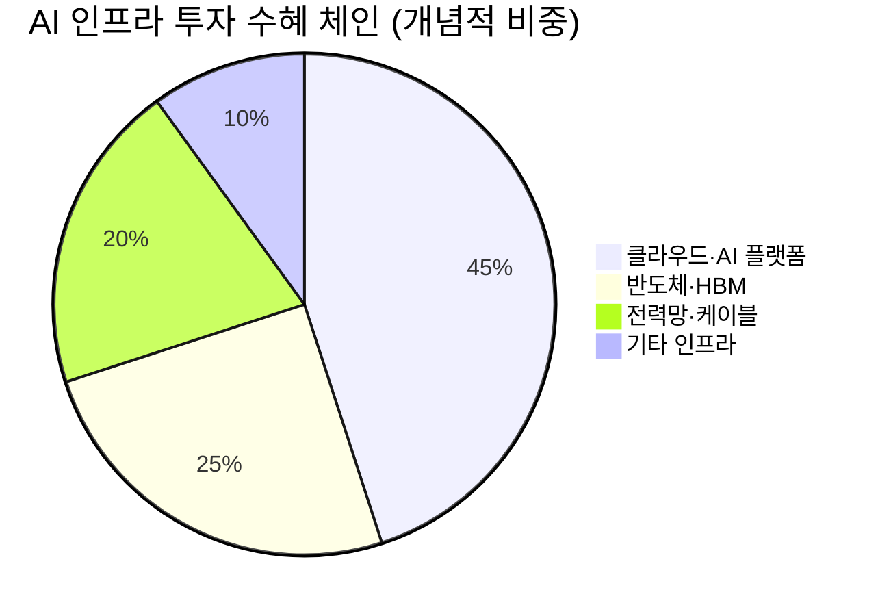

# 🔍 Inflection Scan — 2026-05-04

> [!abstract] 탐색 요약
> **탐색 범위**: 2026-05-04 기준 최근 2주 | High Conviction (검정 후) 5건
> **소스**: 1차 IR(기업 실적 발표) + 2차 셀사이드 + 3차 추정
> **핵심 테마**: 빅테크 AI 인프라 투자 가속 + 플랫폼 구조 변화 — 가이던스·수주잔고·규제 승인이 만드는 비대칭 변곡점
> ⚠️ **검정 메모**: 5건 전원 REVISE 처리. Sonnet 추출본 평균 Conviction P=0.53 → Opus 검정 후 P=0.47로 하향. Bull narrative 편향 주의.

---

## 시그널 요약 대시보드

| 회사명 | 티커 | 타입 | 핵심 이벤트 | 확신도 | 추천 액션 |
|--------|------|------|------------|:------:|:--------:|
| [[Apple]] | AAPL | 가이던스상향 | Q2 FY2026 매출 +17% YoY, Q3 가이던스 컨센 4~7%p 초과 + 총마진 49.3% 구조적 진입 | M / P=0.50 | /deep |
| [[Alphabet]] | GOOGL | 선행지표 | 클라우드 RPO 4,600억 달러 — 전분기 대비 약 2배 급증 | M / P=0.55 | /deep |
| [[Arvinas]] | ARVN | 기술돌파 | VEPPANU — 세계 최초 PROTAC FDA 승인 (ESR1+ 전이성 유방암) | M / P=0.42 | /deal (소형) |
| [[대한전선]] | 001440 | 선행지표 | 수주잔고 3.7조 원 돌파 — 2021년 대비 3배↑, 해저케이블 비중 확대 | M / P=0.45 | /deep |
| [[SoFi Technologies]] | SOFI | 역발상 | Q1 매출 +43% YoY·순이익 +134% YoY인데 가이던스 유지 → 주가 -14% 폭락 | M / P=0.42 | /deep 우선 |

---

## 1. [[Apple]] (AAPL) — 가이던스 상향 + 구조적 마진 변화

> [!abstract]
> Q2 FY2026 매출 +17% YoY, Q3 가이던스 14~17% (컨센서스 10% 대비 4~7%p 초과). **진짜 변곡점은 총마진 49.3% — 서비스 믹스 확대가 하드웨어 한계를 구조적으로 끌어올리는 임계점 진입 신호.**

**사실 → 추론 → 대안 → 채택**

*사실*: Apple Q2 FY2026에서 아이폰 판매 +21.7% YoY, 중화권 회복세 확인, 총마진 49.3% 기록, Q3 가이던스 14~17% 제시(컨센서스 10% 대비 상회). [출처: Apple Q2 FY2026 Earnings Call (확인 필요)]

*추론*: 총마진 49%대 진입은 서비스 부문(GPM 70%+)의 매출 비중이 임계점을 넘어 하드웨어 GPM(~36%)을 구조적으로 끌어올리기 시작했음을 시사한다. 이는 단순 분기 서프라이즈가 아니라 손익계산서 구조 자체의 변화다.

*대안 가설*: Q2 성장이 전년도 부진(low-base)에서 비롯된 compares 효과일 가능성. 중화권 회복이 일회성이고 미-중 무역 갈등 재점화 시 되돌림 가능.

*채택*: Variant Perception을 폴더블 아이폰 루머가 아닌 **총마진 49% 구조적 진입**에 집중. 폴더블은 Bull case에서만 언급.

서비스 부문은 고성장(GPM 70%+)이지만 EU 디지털시장법(DMA) 이 앱스토어 수수료 30%→15% 강제 인하를 현실화할 경우 서비스 OPM에 직접 타격을 준다. OpenAI/Anthropic이 디바이스 OS 레이어로 침투하며 Siri의 차별화를 잠식하는 시나리오는 현재 시장이 충분히 반영하지 않은 medium-term 리스크다. **Cross-Asset**: 아이폰 +21.7% 판매 확인 → [[삼성전자]] OLED 패널 공급 수혜 연결 가능(확인 필요). 유사 사례로 2020년 서비스 마진 가속 구간(총마진 38%→42%)에서 AAPL 주가는 2년간 +80% 기록.

> [!warning] 리스크 경고
> **EU DMA 앱스토어 수수료 강제 인하** 시 서비스 OPM -3~5%p 압박 가능. 중화권 매출 비중 ~17%를 감안하면 미-중 관세 재점화 시 하방 충격 즉각적.

🟢 Bull 25%

🟡 Base 50%

🔴 Bear 25%

| 시나리오 | 핵심 가정 (Steel-manned) | 목표주가 [추정] | 업사이드 |
|---------|------------------------|--------------|---------|
| 🟢 Bull | 서비스 GPM 50%+ 진입, 폴더블 2027 출시, 중화권 지속 회복 | $280 | +35% |
| 🟡 Base | Q3 가이던스 달성, 서비스 고성장 지속, 총마진 49~50% 유지 | $235 | +13% |
| 🔴 Bear | DMA 수수료 15% 강제 인하 + 중화권 재악화 + AI Siri 차별화 상실 → 서비스 multiple 붕괴 | $180 | -13% |

> [!bear] Bear Thesis (Steel-manned Short)
> "AAPL P/E 30배인데 실제 성장 드라이버는 compares 효과. AI Siri는 2년 이상 늦었고, OpenAI·Anthropic이 디바이스 OS 레이어로 침투 중. 서비스 마진 49%는 EU DMA 영구 압박 + 앱스토어 수수료 15% 강제 인하 리스크에 노출. 중화권 회복은 관세 협상 진전의 일시적 반사 효과일 가능성."

총마진 구조 변화 강도 72/100

Variant Perception 차별화도 55/100

규제·경쟁 리스크 조정 60/100

| 항목 | 내용 |
|------|------|
| 시장 | 🇺🇸 NASDAQ |
| 변곡점 유형 | 가이던스상향 + 구조적 마진 전환 |
| Conviction | P=0.50 \| Confidence: M \| 근거: 1차 IR (확인 필요) + 2차 셀사이드 |
| 추천 액션 | **/deep** — 총마진 구조 지속성 + DMA 수수료 시나리오 정량화 + AI Siri 차별화 지속성 분석 필요 |
| Inversion (5년 후 무효 시나리오) | AI 에이전트가 앱스토어를 우회하는 표준 인터페이스로 자리잡아 서비스 과금 모델 자체가 해체될 경우 |

---

## 2. [[Alphabet]] (GOOGL) — 선행지표 (클라우드 RPO 급등)

> [!abstract]
> 클라우드 RPO(잔여 의무 계약 Remaining Performance Obligation) 4,600억 달러 — 전분기 대비 약 2배 급증. 단기 매출 가속보다 **2027~2029년 클라우드 매출 가시성 확보**가 핵심 가치.

**사실 → 추론 → 대안 → 채택**

*사실*: Alphabet Q1 2026 실적에서 Google Cloud RPO가 약 4,600억 달러로 전분기 대비 약 2배 급증. 2026년 연간 CapEx 가이던스 1,750~1,850억 달러, 2027년에도 증가 시사. [출처: Alphabet Q1 2026 Earnings Call (확인 필요)]

*추론*: RPO 4,600억 달러는 기업 고객이 Google Cloud에 약정한 미인식 계약금액으로, 엔터프라이즈 AI 워크로드가 Google TPU/Gemini 에코시스템에 멀티년 단위로 lock-in되는 패턴이 가시화된 것이다.

*대안 가설*: RPO 인식 기간이 평균 5~7년이라면 단기 P&L 기여는 제한적. RPO가 단일 메가딜(예: 하이퍼스케일러 간 cross-supply 계약)에 집중되어 있다면 카운터파티 리스크 내재. CapEx 1,750~1,850억은 D&A 폭증으로 2026~2027 EPS를 압박하는 구조.

*채택*: REVISE — RPO 인식 기간 caveat 명시, Cross-Asset(HBM) 연결 강화.

> [!tip] 핵심 인사이트
> RPO 4,600억의 진짜 가치는 **"구글 클라우드가 최소 5~7년치 엔터프라이즈 AI 계약을 선점했다"는 시장 구조 선점 신호**다. AWS·Azure와의 3자 경쟁에서 Google Cloud가 TPU + Gemini 번들링으로 빠르게 따라잡고 있음을 정량적으로 입증하는 첫 데이터 포인트.

CapEx 1,750~1,850억 달러(2026년)는 수요 확인 없이 짓는 공급이 아니라 RPO라는 선약된 수요를 채우기 위한 집행이라는 점에서 질적으로 다르다. 그러나 검색 광고의 AI Overview 잠식(클릭률 감소로 인한 매출 ~2~3% headwind)은 Core 비즈니스의 장기 구조 리스크로 남아 있다. **Cross-Asset 연결**: Google TPU 증설 → DRAM 고대역폭 수요 → [[SK하이닉스]] HBM3E 공급 확대 수혜 시그널. 국내 AI 인프라 투자 테마와 직접 연결. **Cross-Asset 연결 (금리)**: CapEx 집약적 투자이므로 장기금리 상승(10년물 4.5%+ 고착) 시 할인율 부담 증가.

> [!bear] Bear Thesis (Steel-manned Short)
> "RPO 4,600억은 5~7년 분산 인식 — 단기 P&L 임팩트 미미. CapEx 폭증은 D&A 급증으로 OPM 압박 → 2026~2027 EPS 컨센서스 하향 가능성. 검색 광고는 AI Overview로 인해 클릭률이 구조적으로 하락하는 중 (매출 headwind ~2~3%). YouTube/Cloud 성장도 경쟁사 대비 late-mover 프리미엄이 희석 중."

🟢 Bull 35%

🟡 Base 45%

🔴 Bear 20%

| 시나리오 | 핵심 가정 | 목표주가 [추정] | 업사이드 |
|---------|---------|-------------|---------|
| 🟢 Bull | 클라우드 YoY 35%+ 성장 지속, RPO→매출 전환 가속, 광고 AI 시너지 실현 | $230 | +45% |
| 🟡 Base | 클라우드 28~32% 유지, 검색 광고 micro-headwind 흡수, OPM 26~28% | $185 | +17% |
| 🔴 Bear | 검색 AI 잠식 가속 + CapEx 오버슈팅 → D&A 급증으로 EPS miss + RPO 단일 메가딜 집중 → 카운터파티 리스크 표면화 | $130 | -18% |

RPO 선행지표 강도 82/100

단기 P&L 전환 가시성 58/100

검색 구조 리스크 방어력 42/100

| 항목 | 내용 |
|------|------|
| 시장 | 🇺🇸 NASDAQ |
| 변곡점 유형 | 선행지표 (RPO 급증 → 2027~2029 클라우드 매출 가시성) |
| Conviction | P=0.55 \| Confidence: M \| 근거: 1차 IR (확인 필요) + 2차 셀사이드 |
| 추천 액션 | **/deep** — RPO→매출 인식 속도(계약 구조별) + 검색 광고 AI 잠식 정량화 + TPU vs H100 가격·성능 경쟁력 분석 |
| Inversion (5년 후 무효 시나리오) | AI 에이전트가 검색 쿼리 자체를 대체해 광고 단가 구조가 붕괴되고, 클라우드 RPO 메가딜 카운터파티 재무 악화 시 |

---

## 3. [[Arvinas]] (ARVN) — 기술 돌파 (세계 최초 PROTAC FDA 승인)

> [!abstract]
> VEPPANU(vepdegestrant) — 세계 최초 PROTAC 기반 FDA 승인. **투자 thesis의 핵심은 단기 매출이 아니라 "플랫폼 검증 → 후속 파이프라인 옵셔낼리티 재평가."** 직접 귀속 매출은 제한적($300~500M peak). Bear 30% 유의.

**사실 → 추론 → 대안 → 채택**

*사실*: Arvinas-Pfizer 공동 개발 vepdegestrant(VEPPANU)가 ESR1 mutant ER+/HER2- 전이성 유방암 2차 치료(2L+)에 FDA 승인 획득. VERITAC-2 3상 결과에서 ESR1 mutant 서브그룹의 PFS 유의미 개선. 화이자와 미국 50:50 + 글로벌 royalty mid-teens 구조. [출처: FDA 승인 공식 발표 (확인 필요)]

*추론*: "세계 최초 PROTAC 승인"은 기술 플랫폼의 임상적 검증으로서 ARVN 외 C4 Therapeutics, Kymera 등 PROTAC 파이프라인 전체의 밸류에이션 리레이팅 트리거.

*대안 가설*: VERITAC-2 전체 모집단에서 통계적 유의성이 marginal이었고 ESR1 mutant 서브그룹(전체 유방암의 ~10%)으로 적응증 제한. 화이자 deal 구조상 ARVN 귀속 peak sales는 $300~500M 수준에 그칠 가능성. 2024년 12월 VERITAC-2 발표 후 주가 -50% 폭락 이력이 있어 시장이 이미 "limited efficacy" 를 가격에 반영했을 수 있음.

*채택*: REVISE — "플랫폼 검증의 정성적 가치 vs 단기 매출의 정량적 한계" 이분법 유지, Bear 30%로 상향.

> [!success] 강점 — 플랫폼 가치
> PROTAC은 기존 저해제(inhibitor)가 단백질을 "억제"하는 것과 달리 **타깃 단백질을 세포 내에서 "분해·제거"** 한다. 내성 발생 메커니즘이 근본적으로 다르므로 CDK4/6 inhibitor 내성 환자에서 효과를 보일 수 있다. 이 메커니즘적 우위가 후속 파이프라인의 핵심 상업 논리.

> [!warning] 리스크 경고
> **VEPPANU 적응증**: ESR1 mutant ER+/HER2- 2L+ — 전체 유방암 환자의 ~10% 수준의 좁은 시장. 화이자 미국 50:50 + 글로벌 royalty mid-teens 구조 → ARVN peak sales 귀속분 $300~500M [추정]. **2026년 하반기~2027년까지 후속 파이프라인 데이터 공백 구간 존재** — 카탈리스트 부재 시 주가 드리프트 위험.

🟢 Bull 30%

🟡 Base 40%

🔴 Bear 30%

| 시나리오 | 핵심 가정 | 목표주가 [추정] | 업사이드 |
|---------|---------|-------------|---------|
| 🟢 Bull | 후속 파이프라인(ARV-393 림프종, ARV-766 전립선암) 임상 성공 + 추가 BD 딜 → 플랫폼 premium 부여 | ~$70 | +75%+ |
| 🟡 Base | VEPPANU 정상 출시, 파이프라인 단계 진전, 플랫폼 premium 일부 인정 | ~$45 | +12% |
| 🔴 Bear | 후속 임상 실패 + 경쟁 PROTAC 진입 + VEPPANU 매출 가이던스 미달 → 플랫폼 thesis 붕괴 | ~$20 | -50% |

> [!bear] Bear Thesis (Steel-manned Short)
> "ARVN은 2024년 12월 VERITAC-2 발표 후 -50% 폭락한 종목 — 시장은 이미 'limited efficacy'를 알고 있다. ESR1 mutant 서브그룹으로 제한된 적응증 + 화이자 deal의 ARVN 귀속 매출 $300~500M 수준으로는 현재 시가총액을 정당화하기 어렵다. 후속 ARV-393/ARV-766은 Phase 1/2로 임상 실패 확률이 여전히 높고, 경쟁사(C4 Therapeutics, Kymera, Nurix)도 유사 메커니즘으로 추격 중."

플랫폼 기술 검증 강도 78/100

단기 매출 기여 가시성 38/100

파이프라인 카탈리스트 밀도 50/100

| 항목 | 내용 |
|------|------|
| 시장 | 🇺🇸 NASDAQ |
| 변곡점 유형 | 기술돌파 (세계 최초 PROTAC 플랫폼 FDA 승인) |
| Conviction | P=0.42 \| Confidence: M \| 근거: 1차 FDA 승인 발표 (확인 필요) + 2차 셀사이드 |
| 추천 액션 | **/deal (소형 옵셔낼리티, 포트폴리오 1~2%)** — 후속 파이프라인 데이터 일정(ARV-393/ARV-766 2026 H2~2027) 사전 확인 후 진입. 카탈리스트 공백 구간 포지션 크기 제한 필수 |
| Inversion (5년 후 무효 시나리오) | PROTAC 메커니즘의 내성 극복 가설이 임상에서 재현되지 않고, 경쟁 PROTAC이 더 넓은 적응증에서 먼저 승인받아 플랫폼 premium이 분산될 경우 |

---

## 4. [[대한전선]] (001440) — 선행지표 (수주잔고 구조 변화)

> [!abstract]
> 2026년 상반기 수주잔고 3.7조 원 돌파 (2021년 대비 약 3배). 핵심은 물량보다 **해저케이블 비중 확대 → 마진 믹스 개선 가능성**. 단, 해저케이블 시장에서 LS마린솔루션·Prysmian·Nexans 대비 후발주자 지위가 caveat.

**사실 → 추론 → 대안 → 채택**

*사실*: 대한전선 수주잔고 3.7조 원 돌파, 5년간 약 3배 증가. 초고압·해저케이블 1공장 준공, 2공장 착공. [출처: 조선일보·머니투데이 (확인 필요)] AI 데이터센터 전력 인프라 + 북미 송배전 교체 수요가 배경.

*추론*: 수주잔고 3.7조는 연간 매출의 약 1.2배 수준(확인 필요)으로 1~2년치 매출 가시성 확보. 해저케이블 capacity 확대는 매출보다 이익 성장이 빠른 레버리지 효과를 낼 수 있음. 구리 패스스루 계약 비중이 높다면 원가 리스크 일부 헤지 가능.

*대안 가설*: 해저케이블 시장은 국내 LS마린솔루션, 글로벌 Prysmian/Nexans가 장악 중 — 대한전선 시장점유율은 한 자릿수 중반에 그칠 가능성. EPC 계약 구조상 변압기(HD현대일렉트릭 모델) 대비 마진 변동성 큼. 마진 믹스 공개 수치 없음.

*채택*: REVISE — HD현대일렉트릭 직접 비교 삭제, LS 경쟁구도 명시.

> [!tip] 핵심 인사이트
> 수주잔고 3.7조의 진짜 변곡점은 **제품 믹스 변화**다. 범용 저압 케이블(OPM ~5~7%)에서 초고압·해저케이블(OPM ~15~20% 추정)로 믹스가 이동하면 매출 증가율보다 이익 증가율이 2~3배 빠른 레버리지 구간에 진입한다. 이를 확인할 핵심 지표는 **수주잔고 내 해저케이블 비중(%)**으로 아직 공식 공개 수치가 없다.

> [!question] 검토 필요
> 수주잔고 3.7조 중 해저케이블 비중이 얼마인지 미공개 상태. 이 수치가 30% 이상이어야 마진 레버리지 thesis가 성립. 또한 대한전선 해저케이블 2공장 가동 시점(2026 하반기 예상)과 북미 발주 일정의 실제 매칭 여부 확인 필요.

**Cross-Asset 연결**: GOOGL·MSFT·AWS 데이터센터 CapEx 증가 → 전력망 병목 → 초고압케이블 수요 체인. 글로벌 공급망에서 [[LS마린솔루션]], Prysmian, Nexans와의 수주 경쟁 현황도 병행 모니터링 필요.

> [!bear] Bear Thesis (Steel-manned Short)
> "수주잔고 3.7조는 매출의 1.2배로 인상적이지만 해저케이블 비중은 공식 공개 없음. LS마린솔루션이 국내 해저케이블 독점에 가까운 구조에서 대한전선은 진입자 프리미엄 없음. EPC 종속 케이블 계약은 발주처 일정 지연에 직접 노출 — 2023~2024년에도 북미 인허가 지연으로 케이블 프로젝트 다수 지연. 구리가격 급등 시 원가율 직격, 패스스루 조항 범위 한계."

🟢 Bull 30%

🟡 Base 45%

🔴 Bear 25%

| 시나리오 | 핵심 가정 | 업사이드 [추정] |
|---------|---------|---------|
| 🟢 Bull | 해저케이블 OPM 20%+ + 북미 추가 대형 수주 확인 + 2공장 조기 가동 | +90%+ |
| 🟡 Base | 수주잔고 순차 매출화, 해저케이블 비중 점진 확대, OPM 개선 확인 | +30~50% |
| 🔴 Bear | 구리가격 급등 + 북미 발주 지연 + LS전선·Prysmian 경쟁 심화 → 마진 믹스 개선 불발 | -25% |

수주잔고 가시성 76/100

마진 믹스 검증 가능성 38/100

경쟁구도 대응력 55/100

| 항목 | 내용 |
|------|------|
| 시장 | 🇰🇷 코스피 |
| 변곡점 유형 | 선행지표 (수주잔고 구조 변화 → 마진 믹스 이동 기대) |
| Conviction | P=0.45 \| Confidence: M \| 근거: 2차 셀사이드 (조선일보·머니투데이) + 3차 추정 |
| 추천 액션 | **/deep** — 해저케이블 수주잔고 비중 공개 여부 + 2공장 가동 일정 + LS마린솔루션 대비 수주 파이프라인 비교 분석 필수 |
| Inversion (5년 후 무효 시나리오) | 해저케이블 글로벌 공급 과잉(Prysmian·Nexans 신규 공장 동시 가동)으로 마진 프리미엄이 사라지고, 대한전선이 저마진 범용케이블 비중을 줄이지 못할 경우 |

---

## 5. [[SoFi Technologies]] (SOFI) — 역발상 기회

> [!abstract]
> Q1 2026 매출 +43% YoY, 순이익 +134% YoY — 그럼에도 가이던스 유지로 주가 -14% 폭락. **역발상 thesis의 핵심 약점은 "가이던스 유지 = 경영진 보수성"이 검증 불가 추정이라는 점. 신용 사이클 악화 가능성(P=30%)을 먼저 정량화해야 진입 논거 성립.**

**사실 → 추론 → 대안 → 채택**

*사실*: SoFi Q1 2026 매출 11억 달러(+43% YoY), 순이익 1.67억 달러(+134% YoY), B2B 기술 플랫폼(Galileo+Technisys) 고성장, Net Revenue Retention Rate 115%. 가이던스 유지 → 주가 당일 -14%. [출처: SoFi Q1 2026 Earnings (확인 필요)]

*추론*: 가이던스 유지에 대한 -14% 반응은 시장이 "가이던스 상향"을 기대했음을 시사. 성장 가속의 질적 측면(B2B 플랫폼 고마진 비중 확대)은 시장이 단기 반응에서 과소평가했을 가능성 있음.

*대안 가설*: 경영진이 미국 가계 신용 사이클 악화(카드 연체율 상승, 학자금 대출 재개 부담)를 선반영해서 의도적으로 가이던스를 보수적으로 lock한 것일 수 있음. 이 경우 "역발상"이 아니라 "경고 신호" 오독이 될 수 있다.

*채택*: REVISE — 신용 사이클 리스크를 Bear thesis 핵심으로 승격, /deal → /deep 다운그레이드.

> [!question] 검토 필요 — 진입 전 필수 확인
> 1. Q1 2026 대손충당금/총대출 비율이 전분기 대비 증가했는가?
> 2. 미국 슈퍼프라임 이하 고객 신용카드·자동차 연체율 추세(2025 Q3~2026 Q1)
> 3. 학자금 대출 재개 이후 SOFI 학자금 대출 포트폴리오 NPL 추이
> 4. Galileo + Technisys B2B 플랫폼의 매출 및 마진 기여도 별도 공시 여부

> [!bear] Bear Thesis (Steel-manned Short)
> "SOFI는 디지털 은행이지만 자산 품질이 대형 상업은행 대비 검증 미흡. 순이익 +134%는 NII(순이자수익) leverage 효과가 핵심인데, 연준 금리 인하 사이클 진입 시 NIM 압박으로 즉각 역레버리지 발생. P/E 30배는 hypergrowth 가정 — 성장률이 20%대로 둔화하는 순간 multiple -40% compression 가능. 가이던스 유지가 보수성이 아니라 경영진의 신용 사이클 우려 선반영일 확률 ~30%."

🟢 Bull 25%

🟡 Base 45%

🔴 Bear 30%

| 시나리오 | 핵심 가정 | 업사이드 [추정] |
|---------|---------|---------|
| 🟢 Bull | Q2 가이던스 상향 + B2B 플랫폼 마진 가속 + 신용 건전성 유지 확인 | +70% |
| 🟡 Base | 성장 지속, 시장이 단기 과잉 반응을 서서히 되돌림 | +25~40% |
| 🔴 Bear | 대손충당금 급증(신용 사이클 악화 가시화) + 금리 장기화 → NIM 압박 + P/E multiple compression | -40% |

실적 성장 모멘텀 강도 80/100

신용 사이클 방어력 45/100

역발상 thesis 확신도 62/100

| 항목 | 내용 |
|------|------|
| 시장 | 🇺🇸 NASDAQ |
| 변곡점 유형 | 역발상 (실적 서프라이즈 + 가이던스 유지 → 과잉 매도) |
| Conviction | P=0.42 \| Confidence: M \| 근거: 1차 IR (확인 필요) + 2차 셀사이드 |
| 추천 액션 | **/deep 우선** — 신용 사이클 지표(대손충당금 추세, 연체율) 정량 확인 후 /deal 여부 결정. 진입 전 Q1 IR 데이터 직접 검토 필수 |
| Inversion (5년 후 무효 시나리오) | 미국 소비자 신용 사이클이 2026~2027년에 본격 악화되어 SOFI 대출 포트폴리오 NPL이 급증하고, 동시에 대형 은행들이 디지털 서비스 강화로 SOFI의 차별화 포인트를 잠식할 경우 |

---

## 📊 섹터 메타 시그널

### AI 인프라 투자 가속 사이클 — 하이퍼스케일러 → 전력망 수혜 체인

> [!note] 참고 — 이번 스캔의 관통 맥락
> AAPL, GOOGL, 대한전선 3건의 시그널이 공통적으로 **AI 인프라 투자 가속**이라는 하나의 매크로 체인에 연결된다. GOOGL CapEx 1,750~1,850억 달러 → TPU 증설 → HBM 수요 → [[SK하이닉스]] / [[삼성전자]] 수혜. 동시에 데이터센터 전력 수요 폭증 → 송배전 케이블·변압기 → 대한전선 / [[LS마린솔루션]] / [[HD현대일렉트릭]] 수혜. 빅테크 실적발표 시즌의 CapEx 숫자가 한국 인프라·소재 공급망의 선행지표로 기능하는 구조.

### 미국 핀테크 vs 신용 사이클 — SOFI의 딜레마

미국 핀테크 섹터는 2024~2026년 고금리 환경에서 예상 외 강한 NIM을 유지해왔으나, 가계 신용카드 연체율이 2025년부터 상승 추세에 진입하면서 **성장 모멘텀 vs 자산 품질 훼손** 의 교차점에 서 있다. SOFI 가이던스 유지(-14% 반응)는 이 딜레마가 시장에서 어떻게 인식되는지를 보여준다. [[Lending Club]], [[Upstart]] 등 유사 핀테크 대출 업체의 대손충당금 추세를 병행 모니터링하면 섹터 전반의 신용 사이클 위치를 확인하는 데 유효하다.

---

> [!verdict] 종합 판단
> **이번 스캔의 최우선 시그널은 GOOGL (P=0.55) — RPO 급증의 선행지표 강도와 Cross-Asset 연결(HBM 체인)이 가장 명확.** AAPL은 총마진 구조 변화라는 진짜 변곡점을 확인했으나 Variant Perception이 셀사이드 컨센과 중복. ARVN은 역사적 기술 승인이지만 포트폴리오 크기를 1~2%로 제한하고 카탈리스트 일정을 선확인. 대한전선과 SOFI는 /deep 선행 없이 진입 금지 — 각각 마진 믹스 공개 수치와 신용 사이클 지표를 먼저 확인해야 thesis가 성립한다.
>
> **⚠️ 메타 경고**: 이번 스캔 5건 전원이 5월 초 실적발표 시즌 직후 데이터에 집중되어 있다. 시장이 이미 반응한 정보 중 **진짜 미반영 정보(RPO 인식 속도, 마진 믹스 비중, 대손충당금 추세)** 를 추가 /deep 으로 발굴하는 것이 다음 액션의 핵심이다.