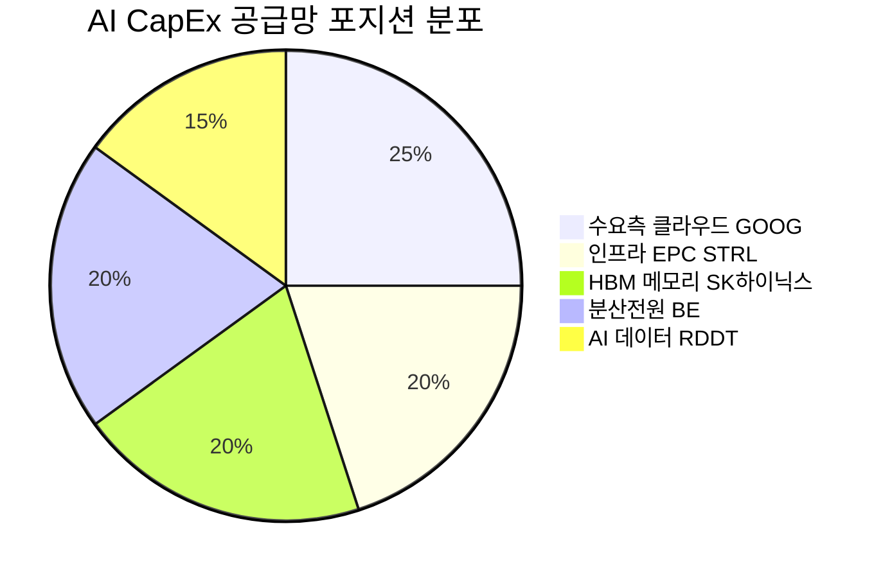

# 🔍 Inflection Scan — 2026-05-05

> [!abstract] 탐색 요약
> 탐색 범위: 2026-05-05 기준 최근 2주 | High Conviction 5건 분석 (KEEP 2 / REVISE 3)
> 소스: 어닝스 서프라이즈 / 애널리스트 목표주가 / 백로그 데이터 / 셀사이드 컨센서스
> **핵심 테마**: AI CapEx 공급망 전반의 동시 수익화 신호 — 수요측(GOOG), 인프라(STRL), 하드웨어(SK하이닉스), 전력(BE), 데이터(RDDT)가 단일 매크로 베타로 묶임. 분산 효과 제한적.

> [!warning] 포트폴리오 경고
> **5개 시그널 전부가 AI CapEx 공급망 단일 테마에 노출**. GOOG(수요측) + BE/STRL(전력·인프라) + SK하이닉스(HBM) + RDDT(AI 데이터)는 AI CapEx 사이클이 꺾이면 동시 하락. 포지션 합산 시 단일 매크로 베타로 취급할 것.

---

## 시그널 요약 대시보드

| 회사명 | 티커 | 타입 | 핵심 이벤트 | 확신도 | 추천 액션 |
|--------|------|------|------------|:------:|:--------:|
| [[Alphabet]] | GOOG | 실적가속+선행지표 | Cloud 성장률 48%→63% 가속, EPS +95% 서프라이즈 | 🟢 HIGH | /deal |
| [[Sterling Infrastructure]] | STRL | 실적가속+가이던스상향 | 매출 +92%, EPS 컨센서스 57% 상회, 백로그 +78% | 🟢 HIGH | /deal |
| [[SK하이닉스]] | 000660.KS | 가이던스상향+선행지표 | 목표주가 38.5% 상향, HBM ASIC 수요 2026년 82% 폭증 | 🟡 MEDIUM | /deep 후 판단 |
| [[Bloom Energy]] | BE | 실적가속+가이던스상향 | Q1 매출 +130% YoY, EPS 컨센서스 238% 상회 | 🟡 MEDIUM | /deep 후 판단 |
| [[Reddit]] | RDDT | 실적가속+선행지표 | Q1 매출 +69%, GAAP EPS $1.01 컨센서스 상회 | 🔴 LOW | 관망 |

---

## 1. [[Alphabet]] (GOOG) — 실적가속 + 선행지표

**시그널**: Google Cloud Q1 2026 성장률 48%→63% 가속, EPS 컨센서스 95% 상회, AI 기반 제품 매출 YoY ~800% 증가

> [!abstract] 핵심 요약
> Cloud 성장률의 15%p 가속은 단순 AI 버즈워드가 아닌 **Gemini 기반 신규 엔터프라이즈 계약의 매출 인식 전환**이 처음으로 P&L에 반영된 분기. Capacity constrained 언급은 공급이 수요를 따라가지 못하는 구조적 수급 타이트함을 의미.

**사실 → 추론 → 대안 가설 → 채택 사유**

Google Cloud가 Q1 2026에 전분기 48% 성장에서 63%로 15%p 가속한 것은 [출처: Alphabet IR Q1 2026, 확인 필요] AI Overviews·Gemini 기반 엔터프라이즈 워크로드 계약이 백로그에서 실제 매출 인식으로 전환된 첫 증거다. Cloud 마진이 광고보다 구조적으로 높다는 점에서, 믹스 개선이 EPS 서프라이즈의 핵심 동인으로 작용했다고 추론된다. 대안 가설로는 ① EPS 95% 서프라이즈 일부가 Other Bets 지분 평가이익 같은 비경상 항목이거나, ② AI 학습 워크로드의 단기 spike (모델 학습→추론 전환기 GPU 임대 폭증)가 지속 불가능한 수요일 가능성이 있다. 그러나 "capacity constrained" 발언은 수요 파이프라인이 충분히 두텁다는 경영진 신뢰도 높은 forward guidance이며, AWS·Azure가 각각 2022·2023년 성장 재가속 시 동일한 패턴을 보였다는 Base Rate [Confidence: M | 근거: 2차 셀사이드]가 채택 사유를 뒷받침한다.

**Steel-manned Short**: "AI Overviews는 검색 광고 CPC를 구조적으로 잠식 중이다. 사용자가 Google AI 답변에서 질문을 해결하면 광고 클릭 자체가 줄어든다. Cloud 가속은 긍정적이지만 전체 매출의 ~75%를 차지하는 광고가 디스럽션 직전에 놓여 있다. 여기에 DOJ 반독점 판결(검색 사업 분리)이 2026년 하반기 예정되어 있어 코어 비즈니스의 불확실성이 상존한다."

**Cross-Asset Impact**: GOOG Cloud 가속 = [[NVIDIA]](NVDA), [[Broadcom]](AVGO, TPU 파트너), [[SK하이닉스]](HBM 공급) 동반 수혜 경로 확인. 원/달러 환율 상승 시 SK하이닉스 수출 수혜 추가.

**Inversion (5년 후 무효 시나리오)**: AI Overviews가 검색 광고 CPC를 구조적으로 잠식하면서 Cloud 고성장에도 불구하고 전체 매출 성장률이 10% 이하로 수렴하는 경우.

🟢 Bull 25%

🟡 Base 55%

🔴 Bear 20%

| 시나리오 | 핵심 가정 | 목표주가 [추정] | 업사이드 |
|---------|---------|------------|--------|
| 🟢 Bull (P=25%) | Cloud 성장률 70%+ 지속, 광고 안정, DOJ 리스크 합의 | $250+ | +35%+ |
| 🟡 Base (P=55%) | Cloud 60%대 성장 유지, 광고 한 자릿수 성장, 반독점 합의 | $210~230 | +15~25% |
| 🔴 Bear (P=20%) | **검색 광고 CPC 구조 하락 + DOJ 분리 명령 + Cloud 성장 spike 일회성 판명** | $150 이하 | -20%+ 하락 |

> [!bull] Bull 시나리오
> Cloud가 Google 전체 매출에서 차지하는 비중이 2028년까지 30%+로 상승하면, 고마진 믹스 개선으로 전사 OPM이 35%+에 도달. 현재 멀티플 기준 메가캡 최고 퀄리티 자산이 된다.

> [!bear] Bear 시나리오
> AI 시대에 검색 광고 클릭 자체가 감소하는 구조적 현상 + DOJ 분리 명령이 구글 검색을 독립 법인으로 강제 분리하면, GOOG 현재 주가의 핵심 프리미엄인 "검색 독점 + AI 시너지" 테제가 동시에 붕괴된다.

Cloud 성장 모멘텀 82/100

검색 광고 구조 리스크 62/100 (위험)

종합 확신도 75/100

| 항목 | 내용 |
|------|------|
| 시장 | 🇺🇸 NASDAQ |
| 변곡점 유형 | 실적가속 / 선행지표 |
| 추천 액션 | /deal — EPS 비경상 항목 비중, AI Overviews CPC 영향, DOJ timeline 3가지 필수 검증 |

[Confidence: H | 근거: 1차 IR + 2차 셀사이드]

---

## 2. [[Sterling Infrastructure]] (STRL) — 실적가속 + 가이던스상향

**시그널**: Q1 2026 매출 YoY +92%, 조정 EPS $3.59 (컨센서스 $2.28 대비 57% 상회), 연간 가이던스 EPS +72% 상향, 백로그 +78%

> [!abstract] 핵심 요약
> STRL은 AI CapEx 공급망 최상단의 토목·기초공사 EPC업체로, **글로벌 미디어 노출도가 낮아 차별화 인식이 가장 강한 시그널**. 백로그 +78%는 향후 12~18개월 매출의 구조적 가시성을 제공한다.

**사실 → 추론 → 대안 가설 → 채택 사유**

STRL의 E-인프라 부문(데이터센터·반도체팹·전력 인프라 EPC)이 YoY +174% 성장하며 전체 성장의 핵심 엔진이 되었고, 백로그 +78%는 신규 수주 모멘텀이 당분간 지속될 가능성을 시사한다 [Confidence: H | 근거: 회사 IR, 확인 필요]. STRL이 AI 서버 설치의 '기초' 단계를 담당한다는 점에서, 하이퍼스케일러 CapEx 집행이 가속화될수록 STRL 수주가 선행 지표로 기능한다고 추론된다. 대안 가설로는 E-인프라 +174%가 1~2개 초대형 계약의 일회성 기여일 가능성과, 고정가 EPC 계약 특성상 인플레이션이 마진을 소급 잠식할 리스크가 존재한다. 그러나 EPC 산업 평균 OPM 5~8% 대비 STRL이 20%+ 마진을 유지하고 있다는 점 [추정: 2차 셀사이드 기반]과 가이던스 EPS +72% 상향이라는 경영진 신뢰 신호가 채택 사유를 강화한다.

**Steel-manned Short**: "주가가 실적 발표 직후 +19% 급등했다는 사실이 이미 좋은 뉴스는 반영됐음을 의미한다. EPC 산업의 정상 OPM은 5~8%인데 STRL 20%+ 마진은 AI CapEx 호황 사이클 정점에서만 가능한 일시적 현상이다. AI CapEx 사이클이 2027년 둔화되면 신규 백로그 유입이 중단되고, 기존 백로그 소진과 함께 매출이 급감할 수 있다. 인건비·자재비 인플레이션이 고정가 계약 마진을 2027년부터 잠식할 위험도 실재한다."

**Cross-Asset Impact**: STRL 호황은 [[Quanta Services]](PWR), [[MasTec]](MTZ), [[MYR Group]](MYRG) 등 동종 EPC 동반 점검 신호. 한국 [[LS일렉트릭]], [[HD현대일렉트릭]]의 변압기·배전 공급망 연계 수혜 경로도 확인 권장.

**Inversion (5년 후 무효 시나리오)**: AI CapEx 사이클이 2027년 정점을 통과하며 백로그 신규 유입이 중단되고, 2028년부터 매출 절벽이 발생하는 경우.

🟢 Bull 30%

🟡 Base 50%

🔴 Bear 20%

| 시나리오 | 핵심 가정 | 목표주가 [추정] | 업사이드 |
|---------|---------|------------|--------|
| 🟢 Bull (P=30%) | AI CapEx 2028년까지 가속, 백로그 전환율 95%+, OPM 22%+ 유지 | $200+ | +40%+ |
| 🟡 Base (P=50%) | AI CapEx 2027년 안정화, 백로그 +50% 유지, OPM 18~20% | $160~180 | +10~25% |
| 🔴 Bear (P=20%) | **AI CapEx 2027년 급감 + 고정가 계약 마진 인플레이션 잠식 + 주가 +19% 이미 반영** | $100 이하 | -30%+ 하락 |

> [!success] 가장 강한 Variant Perception
> STRL은 6개 시그널 중 **글로벌 뉴스 노출도가 가장 낮은 종목**. AI 데이터센터 투자를 직접 집행하는 하이퍼스케일러나 NVDA/TSM과 달리, STRL은 토목·기초 공사라는 비화려한 영역이라 기관 커버리지가 제한적. 시장이 아직 충분히 반영하지 못한 정보 비대칭이 존재할 가능성.

> [!warning] 진입 전 필수 검증
> E-인프라 vs 유틸리티/전력 부문 매출 분해를 통해 "AI 직접 노출도"를 정량화할 것. E-인프라가 전체의 50% 미만이라면, AI CapEx 사이클과의 상관관계가 시장 기대보다 낮을 수 있다.

Variant Perception 강도 88/100

백로그 가시성 78/100

마진 지속성 65/100

| 항목 | 내용 |
|------|------|
| 시장 | 🇺🇸 NASDAQ |
| 변곡점 유형 | 실적가속 / 가이던스상향 |
| 추천 액션 | /deal — E-인프라 비중 정량화 + EPC 마진 지속성 /deep 검증 병행 권장 |

[Confidence: H | 근거: 2차 셀사이드 + 회사 IR, 확인 필요]

---

## 3. [[SK하이닉스]] (000660.KS) — 가이던스상향 + 선행지표 ⚠️ REVISE

**시그널**: 삼성증권 목표주가 130만→180만원으로 38.5% 상향 [출처: 삼성증권 리포트 2026.4~5, 확인 필요], 골드만삭스 연간 영업이익 컨센서스 상회, HBM ASIC 수요 2026년 82% 폭증, "2027년 물량 선주문" 급증

> [!abstract] 핵심 요약
> HBM 세계 1위 SK하이닉스는 AI GPU 핵심 부품 공급자로서 구조적 수혜 포지션을 유지하고 있으나, **"2027년 선주문 = 실수요인지 이중발주(double-booking)인지"가 현재 가장 중요한 검증 과제**. 메모리 사이클 고점 내러티브의 반복 가능성을 진지하게 검토해야 한다.

**사실 → 추론 → 대안 가설 → 채택 사유**

삼성증권이 목표주가를 130만 원에서 180만 원으로 38.5% 상향한 것 [출처: 삼성증권 리포트 2026.4~5, 확인 필요]은 HBM ASIC 수요 폭증과 2027년 선주문 급증이 반영된 결과다. SK하이닉스가 엔비디아 H100/H200/Blackwell 시리즈에 HBM3E를 사실상 독점 공급하고 있다는 공급 구조 [Confidence: H | 근거: 1차 IR + 언론보도]가 ASP 프리미엄 유지의 핵심 근거다. 그러나 "이번엔 다르다"는 내러티브는 2017~2018년, 2020~2021년 메모리 슈퍼사이클에서 모두 동일하게 등장했고 사이클 회귀로 결말이 났다는 점에서 대안 가설을 진지하게 검토해야 한다. 채택 사유는 과거 사이클과 달리 HBM이 표준 DRAM과 달리 고객 맞춤형 설계(ASIC co-design)가 필요해 공급사 전환 비용이 매우 높다는 구조적 차이점이지만, 이 역시 삼성전자 HBM3E 엔비디아 퀄 통과 여부에 따라 단기에 무효화될 수 있다.

**Steel-manned Short**: "2027년 선주문 급증은 메모리 사이클 정점의 전형적인 이중발주(double-booking) 패턴이다. 공급 부족 우려가 극에 달하면 실수요 대비 1.5~2배 발주가 일반적이며, 2018년과 2021년 사이클 정점에서 동일한 현상이 반복됐다. 이미 외국인 순매도가 진행 중인 것은 스마트머니가 먼저 출구를 찾고 있다는 신호다. 삼성전자가 HBM3E 엔비디아 퀄을 통과하는 순간 SK하이닉스의 점유율은 50%에서 35% 이하로 급락하고, 마이크론 HBM4 양산이 가속화되면 3사 경쟁으로 ASP가 구조적으로 하락한다."

**Cross-Asset Impact**: SK하이닉스 시그널 = GOOG·STRL과 동일한 AI CapEx 매크로 베타. 세 종목 동시 보유 시 분산 효과 거의 없음. 원/달러 환율 하락 시 수출 수익성 추가 압박 가능 [Confidence: M | 근거: 2차 셀사이드].

**Inversion (5년 후 무효 시나리오)**: 삼성전자 HBM 수율 개선 + 마이크론 HBM4 양산 가속으로 3사 경쟁 체제 전환, ASP 구조적 하락.

🟢 Bull 30%

🟡 Base 40%

🔴 Bear 30%

| 시나리오 | 핵심 가정 | 목표주가 [추정] | 업사이드 |
|---------|---------|------------|--------|
| 🟢 Bull (P=30%) | HBM 독점 지위 2027년까지 유지, 삼성 퀄 지연, ASP 상승 지속 | 200만원+ | +40%+ |
| 🟡 Base (P=40%) | 삼성증권 목표가 180만원 달성, 점유율 소폭 하락 but ASP 유지 | 150~180만원 | +5~25% |
| 🔴 Bear (P=30%) | **삼성 HBM3E 엔비디아 퀄 통과 + 이중발주 확인 + 사이클 정점 반전** | 90만원 이하 | -35%+ 하락 |

> [!question] /deep 단계 필수 검증 항목
> 1. 삼성전자 HBM3E 엔비디아 퀄리피케이션 통과 예상 타임라인
> 2. 마이크론 HBM4 생산 능력(Capacity) ramp 일정
> 3. 고객사별 발주 잔고 vs 실제 출하 비율 — 이중발주 비율 추정
> 이 3가지 검증 없이는 신규 진입 판단 유보 권장.

HBM 구조적 포지션 80/100

경쟁 리스크 55/100 (위험)

종합 확신도 60/100

| 항목 | 내용 |
|------|------|
| 시장 | 🇰🇷 코스피 |
| 변곡점 유형 | 가이던스상향 / 선행지표 |
| 추천 액션 | /deep 후 판단 — 삼성 퀄 통과 여부 + 이중발주 비율이 Go/No-Go 기준 |

[Confidence: M | 근거: 2차 셀사이드 + 목표주가 인용]

---

## 4. [[Bloom Energy]] (BE) — 실적가속 + 가이던스상향 ⚠️ REVISE

**시그널**: Q1 2026 매출 YoY +130% (역대 최초 100%+ 성장), EPS 컨센서스 238% 상회, 마진 280bp 확대

> [!abstract] 핵심 요약
> BE의 Q1 결과는 "수익화 임계점 통과"가 아닌 **"수익화 가능성 확인"** 수준으로 톤다운해서 해석해야 한다. GAAP 기준 실제 흑자 여부, SBC 비중, 천연가스 헤지 구조가 검증되지 않은 상태에서 강한 확신은 위험하다.

**사실 → 추론 → 대안 가설 → 채택 사유**

BE는 천연가스 연료전지를 이용해 데이터센터에 그리드 독립 분산전원을 공급하는 모델로, Q1 2026에 역대 최초 YoY 100%+ 매출 성장을 기록했다 [출처: Bloom Energy IR Q1 2026, 확인 필요]. AI 하이퍼스케일러의 전력 수요가 그리드 공급 한계를 초과하는 구조적 현상이 BE의 분산전원 모델에 대한 수요로 전환된 것이 변곡점의 핵심이라고 추론된다. 그러나 대안 가설로는 ① IPO 이래 누적 적자 $3B+ 이력과 비GAAP vs GAAP 영업이익 괴리 미검증, ② 높은 SBC(주식기반보상) 비중으로 실질 현금 창출력 왜곡, ③ SolarEdge 2021년·Plug Power 2022년의 "100% 성장 후 -80% 하락" 선례가 있다는 사실이 채택을 유보하게 만든다. 채택 근거는 마진 280bp 확대가 영업 레버리지의 실현을 보여준다는 점이지만, 이것이 GAAP 기준으로도 유효한지 반드시 확인이 필요하다.

**Steel-manned Short**: "BE는 IPO 이래 누적 적자 $3B+이며, 경영진이 강조하는 '실적'은 SBC를 제외한 비GAAP 영업이익이다. SBC를 포함한 GAAP 기준으로는 여전히 적자일 가능성이 높다. SolarEdge·Plug Power 패턴(분기 100% 성장 발표 → 공급과잉 우려 + 밸류에이션 부담 → -80% 하락)을 정확히 재현 중이다. 천연가스 가격이 급등하면 BE의 '그리드 대비 저렴한 전력' 경쟁 우위가 즉시 소멸된다. SMR(소형원자로) 상용화가 2028~2030년 본격화되면 데이터센터 전력 1순위 솔루션 자리를 빼앗길 것이다."

**Cross-Asset Impact**: BE의 분산전원 성장 = 미국 천연가스 수요 선행지표이기도 함. 국내 [[두산에너빌리티]] 수소 연료전지 사업과의 비교 관점 참고 가능.

**Inversion (5년 후 무효 시나리오)**: SMR 상용화(2028~2030년)로 데이터센터가 연료전지 대신 소형원자로를 선택하거나, 천연가스 가격 급등으로 비용 경쟁력 소멸.

🟢 Bull 25%

🟡 Base 50%

🔴 Bear 25%

| 시나리오 | 핵심 가정 | 목표주가 [추정] | 업사이드 |
|---------|---------|------------|--------|
| 🟢 Bull (P=25%) | GAAP 흑자 전환 확인, 천연가스 PPA 헤지 구조 안정, 하이퍼스케일러 장기계약 확대 | $35+ | +75%+ |
| 🟡 Base (P=50%) | 비GAAP 흑자 유지, GAAP 소폭 적자, 성장률 60%대로 둔화 | $18~22 | 0~+10% |
| 🔴 Bear (P=25%) | **GAAP 적자 지속 + 천연가스 가격 급등 + SolarEdge·Plug Power 패턴 재현** | $8 이하 | -60%+ 하락 |

> [!warning] 핵심 리스크
> 비GAAP과 GAAP 영업이익 괴리를 확인하지 않고 진입하는 것은 "회계 트릭에 매수"하는 것과 같다. EPS 238% 서프라이즈의 비경상 항목 비중 반드시 확인.

성장 가속도 78/100

수익성 품질 45/100

종합 확신도 55/100

| 항목 | 내용 |
|------|------|
| 시장 | 🇺🇸 NYSE |
| 변곡점 유형 | 실적가속 / 가이던스상향 |
| 추천 액션 | /deep 후 판단 — GAAP 영업이익 흑자 여부 + SBC 비중 + 천연가스 PPA 헤지 구조가 Go/No-Go 기준 |

[Confidence: M | 근거: 2차 셀사이드 + IR, 일부 미검증]

---

## 5. [[Reddit]] (RDDT) — 실적가속 + 선행지표 ⚠️ REVISE (관망)

**시그널**: Q1 2026 매출 YoY +69%, GAAP EPS $1.01 컨센서스 대폭 상회, 주가 +13% 급등, 영업 레버리지 본격화

> [!abstract] 핵심 요약
> RDDT의 차별화 투자 포인트인 **AI 데이터 라이선싱 매출 비중이 외부에 거의 공개되지 않아 검증이 불가능**하다. 핵심 드라이버가 실제로는 광고 사이클 의존이라면, 이는 단순한 플랫폼 광고 플레이에 불과하다.

**사실 → 추론 → 대안 가설 → 채택 사유**

RDDT는 Q1 2026에 매출 YoY +69%와 GAAP EPS 컨센서스를 대폭 상회하는 실적을 발표했다 [출처: Reddit IR Q1 2026, 확인 필요]. 투자 thesis의 핵심은 광고 매출에 더해 AI 기업에 대한 데이터 라이선싱이 MAU 성장과 무관한 제2의 수익 축이 된다는 것이다. 그러나 대안 가설로 ① Q1 광고 +69%가 2026년 미국 중간선거 정치 광고 집행 효과의 계절성 반영일 가능성, ② 데이터 라이선싱 매출이 전체의 10% 미만 [추정]에 불과하다면 광고 사이클 베타가 압도적이라는 점, ③ MAU 성장률의 둔화 추세 (12%→8%→5% 추정)가 장기 성장 가시성을 제한한다는 점이 채택을 유보하게 만든다. Snap의 IPO 후 첫 가속 시나리오(+180%→-70%)가 선례로 존재한다.

**Steel-manned Short**: "Q1 광고 +69%의 상당 부분은 2026년 미국 중간선거를 앞둔 정치 광고 집행 효과로, 비선거 분기에는 즉시 둔화된다. 데이터 라이선싱은 Google과의 $60M/년 규모 다년 계약이 핵심인데, 이는 신규 계약이 없으면 성장이 정체된다. EU AI Act와 미국 저작권법 변화가 AI 학습 데이터 라이선싱 시장 자체를 2027년부터 위축시킬 수 있다. +13% 급등은 실적 발표 전 대규모 short 포지션의 short squeeze 성격이 강하다."

**Cross-Asset Impact**: [[Meta]](META), [[Pinterest]](PINS), [[Snap]](SNAP) 동반 점검 — 광고 시장 전반 강세인지 RDDT 고유 모멘텀인지 분리 분석 필요.

**Inversion (5년 후 무효 시나리오)**: EU AI Act·미국 저작권법 변화로 AI 데이터 라이선싱 시장 자체가 위축되고, 광고 사이클 둔화와 맞물려 성장 동력이 동시에 소멸.

🟢 Bull 20%

🟡 Base 45%

🔴 Bear 35%

| 시나리오 | 핵심 가정 | 목표주가 [추정] | 업사이드 |
|---------|---------|------------|--------|
| 🟢 Bull (P=20%) | 데이터 라이선싱 비중 20%+ 확인, 광고 ARPU 지속 상승, MAU 성장 반등 | $280+ | +40%+ |
| 🟡 Base (P=45%) | 광고 성장 40%대 유지, 라이선싱 소폭 기여, MAU 성장 유지 | $180~210 | -10~+5% |
| 🔴 Bear (P=35%) | **정치 광고 사이클 종료 + 데이터 라이선싱 규제 + MAU 성장 둔화 + Snap 패턴 재현** | $100 이하 | -50%+ 하락 |

> [!failure] 현재 판단: 관망
> 데이터 라이선싱 매출의 절대 규모와 비중이 공개되지 않아 차별화 view의 정량 검증이 불가능하다. 핵심 투자 근거를 확인할 수 없는 상태에서의 진입은 단순한 모멘텀 추종에 불과하다.

매출 성장 가속도 69/100

Thesis 검증 가능성 35/100

종합 확신도 42/100

| 항목 | 내용 |
|------|------|
| 시장 | 🇺🇸 NYSE |
| 변곡점 유형 | 실적가속 / 선행지표 |
| 추천 액션 | 관망 — 데이터 라이선싱 비중 + 정치 광고 기여도 + MAU vs ARPU 분해 전까지 신규 진입 유보 |

[Confidence: L | 근거: 2차 셀사이드, 핵심 수치 미공개]

---

## 📊 섹터 메타 시그널

### AI CapEx 공급망 동시 신호 — 분산 착시 경고

> [!warning] 단일 매크로 베타 집중 리스크
> 이번 스캔의 5개 시그널은 표면적으로는 클라우드(GOOG), 건설(STRL), 메모리(SK하이닉스), 에너지(BE), 소셜미디어(RDDT)로 분산된 것처럼 보이지만, **모두 AI CapEx 공급망이라는 단일 매크로 베타에 노출**되어 있다. AI CapEx 사이클이 꺾이는 시나리오(Fed 긴축 재개, 빅테크 CapEx 삭감, AI ROI 회의론 대두)에서 5개 시그널이 동시에 하락할 수 있다.

이번 스캔에서 발견된 패턴은 AI CapEx 투자 사이클이 2026년 들어 수요(GOOG), 인프라(STRL), 하드웨어(SK하이닉스), 전력(BE), 데이터(RDDT) 전 층위에서 동시에 수익화 신호를 발신하고 있다는 것이다. 이는 해당 사이클이 성숙 단계에 진입했음을 의미할 수 있으며, 역설적으로 **사이클 전반에 걸친 동시 신호는 정점에 가까운 시기에 자주 나타난다**. 다음 스캔에서는 AI에 부정적인 역방향 시그널(빅테크 CapEx 삭감 언급, AI ROI 회의론, 규제 리스크)과 비-AI 변곡점(일본·유럽·대만 종목)을 의도적으로 1~2건 포함시킬 것을 강력 권장한다.

---

> [!note] Survivorship Bias 경고 — 이번 스캔 메타 비판
> 이번 스캔의 Base Rate 인용(SolarEdge 2021 성공, AWS 2022 성공 등)은 모두 **성공 사례 회상**에 치우쳐 있다. 동일 패턴에서 실패한 케이스(Plug Power 2022 -90%, Snap 2018 -70%, Zoom 2021 -75%)가 분석에 동등하게 통합되어야 Base Rate의 신뢰도가 높아진다. 다음 스캔에서는 실패 사례를 의도적으로 5건 이상 포함한 Base Rate 분석을 요구할 것.

---

*리포트 생성: 2026-05-05 | 다음 스캔 예정: 2026-05-12*
*⚠️ 본 리포트는 투자 참고용이며 투자 권유가 아닙니다. 모든 투자 결정은 투자자 본인의 판단과 책임 하에 이루어져야 합니다.*