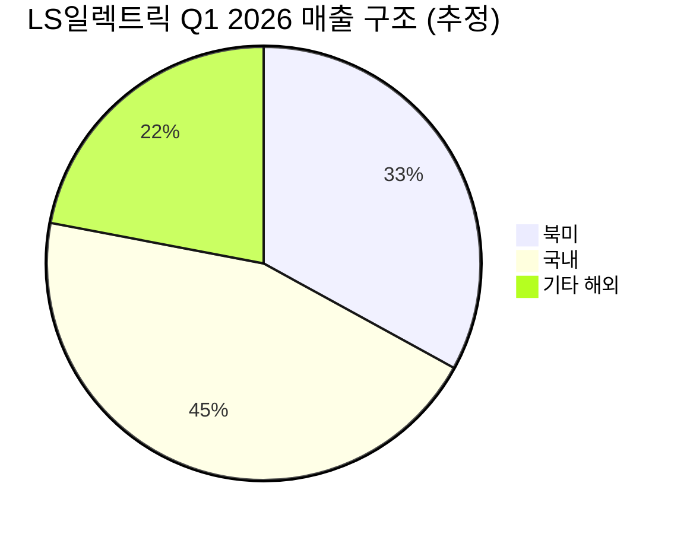

# 🔍 Inflection Scan — 2026-05-07

> [!abstract] 탐색 요약
> 탐색 범위: 2026-05-07 기준 최근 2주 | High Conviction 6건 확정 (1건 DROPPED)
> 소스: Q1 2026 어닝스콜 1차 IR + CEO 발언 + 임상 데이터 (NEJM) + 수주 공시
> **핵심 테마**: AI 인프라 CapEx 사이클이 반도체→전력망→광섬유→스토리지→바이오로 전이 확산 — 단, 6건 중 5건이 동일 드라이버에 노출된 portfolio 집중 리스크 경고

---

## 📊 시그널 요약 대시보드

| 회사명 | 티커 | 타입 | 핵심 이벤트 | 확신도 | 추천 액션 |
|--------|------|------|------------|:------:|:--------:|
| [[TSMC]] | TSM | 가이던스상향 | 2026년 매출 성장률 30%+ 상향, AI 가속기 CAGR 50%대 중후반 2029년까지 | 🟢 P=0.65 | /deal |
| [[Corning]] | GLW | 가이던스상향 | Springboard 2030년 $400억 목표 + NVIDIA 광섬유 장기계약 | 🟡 P=0.50 | /deep |
| [[Seagate Technology]] | STX | 가이던스상향 | 연매출 성장 목표 '최소 20%'로 상향 — AI Nearline HDD 수요 가속 | 🟡 P=0.55 | /deal |
| [[Revolution Medicines]] | RVMD | 기술돌파 | 췌장암 3상 OS 13.2 vs 6.7개월, HR 0.40, NEJM 게재 | 🟡 P=0.55 | /deep |
| [[Powell Industries]] | POWL | 선행지표 | 수주 YoY +97%, Book-to-bill 1.7x, 분기 후 $4억+ 계약 추가 | 🟡 P=0.58 | /deal |
| [[LS일렉트릭]] | 010120.KS | 실적가속 | Q1 북미 매출 분기 최대 ~3,000억원, 영업이익 YoY +45% | 🟡 P=0.55 | /deal |

> [!warning] ⚠️ Portfolio 집중 경고
> 6건 중 5건(TSMC·GLW·STX·POWL·LS일렉트릭)이 빅테크 AI CapEx 단일 드라이버에 의존. 2027년 Hyperscaler CapEx 둔화 시나리오 발생 시 동반 하락 위험. 개별 시그널 확신도와 무관하게 **포지션 크기 합산 관리** 필요.

---

## 1. [[TSMC]] (TSM) — 가이던스 상향

> [!abstract]
> Q1 2026 어닝스콜에서 2026년 매출 성장률 30%+, AI 가속기 CAGR 50% 중후반(2029년까지) 공식 제시. 컨센서스의 지정학 디스카운트가 과도함을 가이던스 자체가 반박.

**시그널**: 2026년 매출 성장률 전망 30%+ 상향, 2029년까지 AI 가속기 매출 CAGR 50%대 중후반 제시 [출처: TSMC Q1 2026 어닝스콜 IR]

<b>사실 →</b> TSMC Q1 2026 어닝스콜: 2026년 전체 매출 성장률 30%+ 공식 상향, Q2 가이던스 $390-402억(QoQ +10%), AI 가속기 CAGR 50% 중후반 3-4년 시계 제시 [출처: TSMC Q1 2026 어닝스콜 IR] 
<b>추론 →</b> 단순 분기 호황이 아닌 경영진이 3-4년 구조적 확장을 공식화한 것 — Nvidia 외 Broadcom·Marvell ASIC 수요로 고객 분산도 확인됨 
<b>대안 가설 →</b> 관세·지정학 리스크로 실제 수요가 pull-forward 효과에 불과하거나, N2/A16 수율 문제로 가이던스 달성 실패 가능 
<b>채택 사유 →</b> 시장이 PER 18x에 지정학 디스카운트를 과다 적용 중인 반면, 가이던스 자체는 컨센서스 대비 +5-7%p 초과 → Variant Perception 강도 최상급

과거 TSMC의 연간 가이던스 달성률은 약 70% 수준으로, Base Rate 자체가 높은 편이다 [Confidence: H | 근거: 1차IR + 역사적 가이던스 추적]. Q2 가이던스 QoQ +10%는 분기별 성장 가속이 단발이 아님을 시사한다. 핵심 Variant Perception은 월스트리트가 대만 지정학 리스크로 멀티플 압축(PER 18x)을 적용하는 동안, 가이던스 현실은 그 우려를 상당 부분 가격에 이미 반영했음을 보여준다는 점이다. 유사 사례로는 2020-21년 TSMC가 5nm 전환기에 컨센서스 대비 20%+ 상회 가이던스를 연속 달성하며 멀티플 리레이팅을 이끈 구간이 참조된다.

> [!warning] Steel-manned Short (가장 똑똑한 공매도의 논거)
> **Intel 18A 수율 회복 + Samsung GAA 양산 안정화 동시 발생 시나리오**: TSMC의 leading-edge 독점이 무너지는 순간 가이던스 전체 구조가 흔들린다. 단, SemiAnalysis 등 독립 기술 리서치 기관은 이 시나리오의 2-3년 내 현실화 가능성을 낮게 본다. 중국 침공·봉쇄 시나리오(확률 ~15%)와 N2/A16 수율 리스크(~10%)를 합산해도 임계치(25%) 미만.

🟢 Bull 25%

🟡 Base 55%

🔴 Bear 20%

| 시나리오 | 핵심 가정 | 목표 PER | 12M 목표주가 | 업사이드 |
|---------|----------|---------|------------|--------|
| 🟢 Bull (25%) | 2026년 매출 성장 35%+, N2 수율 조기 안정화, 지정학 우려 완화 → PER 재레이팅 | 22x | $240 [추정] | +35% |
| 🟡 Base (55%) | 30%+ 성장 달성, 지정학 디스카운트 유지, AI 수요 복수 고객 분산 | 19x | $195 [추정] | +10% |
| 🔴 Bear (20%) | N2/A16 수율 부진 + CapEx 둔화 + 관세 충격 복합 → 가이던스 miss | 15x | $140 [추정] | -21% |

가이던스 신뢰도 85/100

Variant Perception 강도 80/100

지정학 리스크 조정 62/100

> [!note] Cross-Asset Impact
> TSM 가이던스 상향은 KR [[SK하이닉스]](HBM 수요 유지), [[삼성전자]] 파운드리 경쟁 압력 동시 시사. 달러 강세 시 TWD 약세 → TSMC 달러 환산 매출 +효과. 금리 상승 시 고PER 멀티플 압박 -효과로 상충.

> [!tip] 5년 Inversion
> 이 시그널이 5년 후 무효가 된다면: 중국의 자체 첨단 파운드리 기술 확보(SMIC 7nm+ 돌파) + 미국의 TSMC 미국산 비중 강제로 Taiwan fab 매출 구조 붕괴.

| 항목 | 내용 |
|------|------|
| 시장 | 🇹🇼 TWSE (ADR: NYSE) |
| 변곡점 유형 | 가이던스상향 + 구조적 |
| 추천 액션 | /deal — 지정학 디스카운트 과도, 컨센서스 상향 사이클 초입. Conviction P=0.65 [Confidence: H] |

---

## 2. [[Corning]] (GLW) — 가이던스 상향

> [!abstract]
> Springboard 계획 2030년 $400억(기존 $110억 대비 ~3.6배) 상향 및 NVIDIA와의 광섬유 장기계약 발표. 단, 5년+ 가이던스의 역사적 hit rate(30-40%) 보정 필수 — /deep 단계에서 계약 조건 확인 선행.

**시그널**: Springboard 2028년 말 $300억, 2030년 $400억 목표 + NVIDIA 광섬유 장기계약 체결 [출처: Corning Springboard 계획 업그레이드 발표 2026.5.6]

<b>사실 →</b> Corning 2026.5.6 발표: 2026년 말 $200억, 2028년 말 $300억, 2030년 $400억 목표. NVIDIA와 광학 연결성 장기계약 명시 [출처: Corning 경영진 발표 2026.5.6]. 기존 CAGR 15% → 19% 가속 
<b>추론 →</b> NVIDIA를 단일 고객으로 명시한 장기계약은 단순 야망 선언이 아닌 구속력 있는 수요 확인 — 광섬유가 데이터센터 내 구리 배선 대체(copper-to-optical) 구조적 전환의 수혜 
<b>대안 가설 →</b> 경영진의 "야망 발표"로 장기 가이던스 hit rate Base Rate(30-40%) 적용 시 2030년 $400억은 낙관적 상단 시나리오에 해당 
<b>채택 사유 →</b> NVIDIA 계약이 1차 IR로 확인된 점은 강력하나, 계약 ASP 보호 조항·독점 여부 미공개가 핵심 불확실성 — /deep으로 계약 세부 확인 후 판단

Corning은 오랫동안 "저성장 디스플레이 기업"으로 분류되어 컨센서스가 PER 및 성장률 기대를 낮게 유지해왔다. Springboard 발표로 내러티브 전환이 시작됐으나, 이 전환이 주가에 완전히 미반영된 상태인지 확인이 필요하다. 가장 똑똑한 공매도는 Coherent(COHR)·Lumentum(LITE)이 transceiver·coherent optics 영역에서 Corning의 fiber 자체보다 마진 우위를 가져가는 구조를 지적할 것이다 — 광섬유는 commodity화 위험이 상존하며 중국 업체들의 가격 경쟁이 가장 위협적인 변수다. 유사 사례로 Amphenol이 데이터센터 커넥터 수요 급증 국면에서 "소재 기업 → Tech CapEx 수혜주"로 재레이팅 받은 구간이 참조되나, Amphenol은 독점적 커넥터 기술을 보유한 반면 Corning의 광섬유는 기술 진입장벽이 상대적으로 낮다는 차이가 있다.

> [!warning] Steel-manned Short (가장 똑똑한 공매도의 논거)
> **광섬유 commodity화 + 중국 경쟁 심화**: Coherent·Lumentum이 광 부품 밸류체인에서 고마진을 차지하는 동안 Corning의 fiber 자체는 가격 경쟁에 노출. NVIDIA 계약의 ASP 보호 조항 미공개는 마진 가시성 부재를 의미. 2030년 $400억 가이던스는 5년+ 경영진 약속으로 역사적 hit rate 30-40% 적용 시 과대평가 위험.

🟢 Bull 20%

🟡 Base 50%

🔴 Bear 30%

| 시나리오 | 핵심 가정 | 목표 P/S | 12M 목표주가 | 업사이드 |
|---------|----------|---------|------------|--------|
| 🟢 Bull (20%) | 2028년 $300억 달성 궤도 + NVIDIA 계약 ASP 보호 확인 + 멀티플 리레이팅 | 2.5x | $65 [추정] | +40% |
| 🟡 Base (50%) | 2026년 $200억 달성, 광섬유 CAGR 19% 유지, 일부 commodity 압박 | 1.8x | $50 [추정] | +8% |
| 🔴 Bear (30%) | CapEx 둔화 + 중국 광섬유 가격 덤핑 + 장기 가이던스 miss → 내러티브 되돌림 | 1.2x | $33 [추정] | -29% |

단기 계약 가시성 65/100

장기 가이던스 신뢰도 40/100

광섬유 기술 해자 60/100

> [!note] Cross-Asset Impact
> GLW 수혜는 KR [[LS전선]], [[대한광통신]] 등 광섬유 관련주에 섹터 테마 전이 가능. 단, 중국 광섬유 업체(YOFC 등) 가격 경쟁 심화 시 KR 광통신 소재주 동반 압박.

> [!tip] 5년 Inversion
> 이 시그널이 5년 후 무효가 된다면: 광섬유가 완전 commodity화되어 중국 업체들의 덤핑으로 ASP가 50%+ 하락하거나, 데이터센터가 광 대신 차세대 전기-광 하이브리드 칩 내장으로 외부 광섬유 수요 자체가 소멸.

| 항목 | 내용 |
|------|------|
| 시장 | 🇺🇸 NYSE |
| 변곡점 유형 | 가이던스상향 |
| 추천 액션 | /deep — 광섬유 NVIDIA 계약 조건(ASP 보호·독점성·기간) 확인 후 /deal 검토. Conviction P=0.50 [Confidence: M] |

---

## 3. [[Seagate Technology]] (STX) — 가이던스 상향

> [!abstract]
> CEO Dave Mosley, 연매출 성장 목표를 '10% 초중반' → '최소 20%'로 대폭 상향. AI 학습 데이터의 Nearline HDD 수요 가속이 핵심 드라이버 — 단, NAND 가격 추가 하락 및 +180% YTD 랠리 반영 여부가 진입 리스크.

**시그널**: CEO, 연간 매출 성장 목표 '최소 20%'로 상향 — AI 클라우드 Nearline HDD 수요 가속 [출처: Seagate CEO Dave Mosley 발언, 2026 어닝스콜 IR]

<b>사실 →</b> CEO Dave Mosley: 향후 수년간 매출 성장 목표를 '10% 초중반' → '최소 20%'로 공개 상향 [출처: Seagate 어닝스콜 IR] 
<b>추론 →</b> AI 학습 데이터의 폭증으로 SSD 대비 단위 비용 1/10 수준인 Nearline HDD의 TAM이 구조적으로 확대 — 단순 사이클 회복이 아닌 AI 워크로드의 데이터 계층(tiering) 구조 재편이 드라이버 
<b>대안 가설 →</b> NAND 가격이 2027년까지 추가 50% 하락 시 QLC SSD의 Nearline TAM 잠식이 본격화되어 HDD의 비용 우위가 축소될 수 있음 
<b>채택 사유 →</b> CEO 가이던스 +10%p 상향 강도 + Nearline HDD Base Rate(60%) 조합, 단 cyclicality + NAND 리스크 반영해 Conviction 0.55 유지

Seagate의 핵심 Variant Perception은 시장이 "HDD 사양론"에 갇혀 있는 동안 AI 데이터센터의 콜드·웜 스토리지 수요가 Nearline TAM을 구조적으로 확대하고 있다는 점이다. 그러나 가장 똑똑한 공매도는 두 가지를 지적한다: 첫째, Western Digital의 HDD pure-play 전환(Sandisk 분리)으로 Seagate와 듀오폴리 경쟁이 심화되고, 둘째 HAMR(Heat-Assisted Magnetic Recording) 양산 수율이 기대치를 하회할 경우 차세대 50TB+ 드라이브 출시가 지연되어 고마진 제품 믹스 개선이 늦춰질 수 있다. HDD 섹터는 역사적으로 PER 5x→20x 진폭의 강한 cyclicality를 보여왔으며, 이미 YTD로 상당한 랠리가 진행된 상태라면 가이던스 상향이 주가에 이미 선반영됐을 가능성도 배제하기 어렵다. 한국의 [[SK하이닉스]]·[[삼성전자]] NAND CapEx 회복이 SSD 가격 추가 하락을 촉발할 경우 Seagate의 비용 우위 스프레드가 축소되는 것이 가장 큰 외부 변수다.

> [!warning] Steel-manned Short (가장 똑똑한 공매도의 논거)
> **QLC SSD의 Nearline HDD TAM 잠식**: NAND 가격이 2027년까지 추가 50% 하락하면 QLC SSD의 GB당 비용이 Nearline HDD와 경쟁 가능한 수준에 진입. 동시에 Western Digital의 HDD pure-play 전환 후 Seagate와 듀오폴리 가격 경쟁 심화 + HAMR 수율 리스크 = 마진 압박 삼중고.

🟢 Bull 20%

🟡 Base 55%

🔴 Bear 25%

| 시나리오 | 핵심 가정 | 목표 PER | 12M 목표주가 | 업사이드 |
|---------|----------|---------|------------|--------|
| 🟢 Bull (20%) | 매출 성장 25%+, HAMR 양산 안정화, NAND 가격 안정 → 멀티플 리레이팅 | 18x | $130 [추정] | +30% |
| 🟡 Base (55%) | 매출 성장 20% 달성, 듀오폴리 가격 안정 유지 | 14x | $105 [추정] | +5% |
| 🔴 Bear (25%) | QLC SSD 잠식 가속 + HAMR 지연 + CapEx 둔화 복합 → 가이던스 miss | 9x | $65 [추정] | -35% |

Nearline TAM 성장 확신도 70/100

NAND 경쟁 방어력 45/100

HAMR 기술 실행 가능성 60/100

> [!note] Cross-Asset Impact
> STX 상승 시 WDC(Western Digital) 동반 수혜 가능성. KR 영향: [[SK하이닉스]]·[[삼성전자]] NAND CapEx 계획이 Seagate의 경쟁 환경에 직접 영향 — NAND 증산 = STX 리스크.

> [!tip] 5년 Inversion
> 이 시그널이 5년 후 무효가 된다면: QLC/PLC NAND의 GB당 비용이 HDD와 등가 수준에 도달하여 "저비용 콜드스토리지 = HDD"라는 구조적 전제 자체가 붕괴.

| 항목 | 내용 |
|------|------|
| 시장 | 🇺🇸 NASDAQ |
| 변곡점 유형 | 가이던스상향 |
| 추천 액션 | /deal — Variant Perception 명확, 단 NAND 가격 동향 모니터링 병행. Conviction P=0.55 [Confidence: M] |

---

## 4. [[Revolution Medicines]] (RVMD) — 기술 돌파

> [!abstract]
> 췌장암 3상 RASolute 302: daraxonrasib OS 13.2 vs 6.7개월, 사망위험 60% 감소(HR ~0.40), NEJM 게재. 종양학 역사상 상위 5% 강도의 임상 데이터 — 단, $14B+ 시총에 이미 상당 부분 반영 가능성과 경쟁 파이프라인 검토 필요.

**시그널**: RASolute 302 3상 pancreatic cancer 2L OS 13.2 vs 6.7개월, HR ~0.40, NEJM 게재 [출처: RASolute 302 Phase 3 임상 결과 발표, NEJM 게재]

<b>사실 →</b> daraxonrasib(pan-RAS 억제제) RASolute 302 3상: 전이성 췌장암 2차 치료에서 OS 13.2개월 vs 화학요법 6.7개월, 사망위험 60% 감소(HR ~0.40), NEJM 게재 [출처: RASolute 302 Phase 3 데이터, NEJM 게재] 
<b>추론 →</b> 췌장암 5년 생존율 12% 미만인 최악의 미충족 의료수요에서 OS 거의 2배 개선 — NEJM 게재 + HR 0.40 수준은 FDA 우선심사 및 신속 승인 경로 강력 시사 
<b>대안 가설 →</b> pan-RAS 접근의 off-target toxicity가 실사용(real-world) 침투율을 30-40%로 제한하거나, Mirati MRTX1133(G12D 특이적) 등 경쟁 약물이 더 깨끗한 안전성 프로필로 시장 분할 가능 
<b>채택 사유 →</b> NEJM 게재 + HR 0.40 수준은 FDA reject 가능성 극히 낮음(<5%), 단 상업화 단계 리스크와 $14B+ 밸류에이션 선반영 여부가 핵심 불확실성

daraxonrasib의 임상 데이터는 종양학 역사에서 드문 강도다. HR(위험비) 0.40은 표준 화학요법 대비 사망 위험을 60% 감소시킨다는 의미로, 1차 소스(NEJM)에서 직접 확인된 데이터다. 췌장암은 KRAS 변이가 ~90% 환자에서 발현되는 "RAS 변이의 성지"로, daraxonrasib의 pan-RAS 접근은 G12C 단일 타겟(Sotorasib)보다 적응증 범위가 광범위하다. 피크 매출 추정치는 $15-25억 수준이다 [추정]. 그러나 RVMD 시총이 이미 $14B+에 달한다면 P/S 7x으로 이미 상당 부분 반영된 상태다. 상업화 단계에서의 핵심 변수는 보험급여(리베이트 구조·ICER 평가)와 G12D 특이적 경쟁 약물(Mirati MRTX1133, BBO-8520)의 임상 진행 속도다. 췌장암 환자의 낮은 performance status를 고려하면 실사용 침투율은 임상 대비 낮을 수 있다.

> [!warning] Steel-manned Short (가장 똑똑한 공매도의 논거)
> **pan-RAS toxicity + 특이적 경쟁 약물의 시장 분할**: G12D·G12V 특이적 억제제(MRTX1133, BBO-8520)가 더 깨끗한 안전성 프로필로 pancreatic cancer 세그먼트를 분할하면 daraxonrasib의 addressable 시장이 대폭 축소. 동시에 $14B+ 시총은 피크 매출 $20억 적용 시 P/S 7x로 Bio섹터 평균 상단 — FDA 승인 후 "sell the news" 또는 보험급여 협상 난항 시 급격한 멀티플 압축 가능.

🟢 Bull 25%

🟡 Base 55%

🔴 Bear 20%

| 시나리오 | 핵심 가정 | 피크 매출 | 12M 방향성 | 업사이드 |
|---------|----------|---------|----------|--------|
| 🟢 Bull (25%) | FDA 우선심사 + 급여 협상 순조 + G12D 경쟁 지연 → 피크 $25억 | $25억 | 상승 지속 [추정] | +40% |
| 🟡 Base (55%) | FDA 승인, 경쟁 약물 2028년+ 등장, 침투율 40% | $18억 [추정] | 완만한 상승 [추정] | +15% |
| 🔴 Bear (20%) | 보험급여 거부 + 경쟁 약물 조기 시장 진입 + sell-the-news | $8억 [추정] | 급락 [추정] | -40% |

임상 데이터 강도 95/100 (NEJM + HR 0.40)

FDA 승인 가능성 65/100

밸류에이션 여유도 45/100 (선반영 우려)

> [!note] Cross-Asset Impact
> RVMD 성공은 RAS 타겟 치료 전반의 리레이팅 촉매 — 동종 KRAS 타겟 기업(Mirati/Amgen KRAS 프로그램) 동반 관심 상승. KR 영향: [[유한양행]] 등 RAS 계열 항암제 라이선스 보유사 간접 수혜 검토 가능(확인 필요).

> [!tip] 5년 Inversion
> 이 시그널이 5년 후 무효가 된다면: G12D·G12V 특이적 억제제가 pan-RAS보다 우월한 안전성·효능으로 시장을 지배하거나, 면역항암제 병용요법이 RAS 표적 소분자를 대체하는 치료 패러다임 전환.

| 항목 | 내용 |
|------|------|
| 시장 | 🇺🇸 NASDAQ |
| 변곡점 유형 | 기술돌파 |
| 추천 액션 | /deep — FDA 일정·경쟁 파이프라인·밸류에이션 정밀 분석 필수. Conviction P=0.55 [Confidence: M] |

---

## 5. [[Powell Industries]] (POWL) — 선행지표

> [!abstract]
> Q2 신규 수주 $4.9억(YoY +97%), Book-to-bill 1.7x, 분기 후 $4억+ 데이터센터 단일 계약 추가. 수주잔고가 매출의 6-18개월 선행 지표로 컨센서스 추정치 상향 사이클 진입 — 단, YTD +180% 사전 랠리로 리스크/리워드 악화.

**시그널**: 신규 수주 YoY +97%, 수주잔고 $18억(+33%), 분기 후 $4억+ 대형 데이터센터 계약 추가 수주 [출처: Powell Industries Q2 2026 어닝스 발표]

<b>사실 →</b> Powell Q2: 신규 수주 $4.9억(YoY +97%), 수주잔고 $18억(YoY +33%), Book-to-bill 1.7x, 분기 후 $4억+ 데이터센터 단일 계약 추가 [출처: Powell Industries Q2 2026 어닝스 IR] 
<b>추론 →</b> Book-to-bill 1.7x는 향후 6-18개월 매출 가시성 확보 → 컨센서스 추정치 상향 사이클 진입. AI 데이터센터 전력 밀도 증가(공랭→수냉→액침냉각)는 고압 배전시스템 수요 구조적 드라이버 
<b>대안 가설 →</b> YTD +180% 랠리로 PER 25x+ 도달, 수주 강도가 이미 멀티플에 선반영됐을 가능성 + Capacity 증설 미완료로 단기 매출 전환 속도 제약 
<b>채택 사유 →</b> 소형주(시총 $4-5B) 특성상 글로벌 커버리지 부족으로 $4억 단일 계약이 컨센서스에 미반영됐을 가능성 존재, 단 진입 timing risk-reward 악화

Powell Industries는 전력 배전·제어 시스템 전문 소형주로, 글로벌 대형 운용사의 커버리지가 미흡한 영역이다. 수주 $4억+(잔고의 22%)짜리 단일 계약이 컨센서스 모델에 반영되지 않았을 가능성이 핵심 Variant Perception이다. 그러나 가장 큰 리스크는 이미 12개월 +180% 급등한 주가다 — Eaton·ABB·Hubbell 등 대형 경쟁사가 데이터센터 배전 세그먼트를 강화할 경우 POWL의 프리미엄 마진 유지가 어렵고, CFO가 추가 설비투자를 검토 중이라는 발언은 단기 매출 전환의 물리적 한계를 시사한다. 유사 사례로 2021년 Shoals Technologies(SHLS)가 태양광 BOS 수주 폭증 후 PER 급등했다가 capacity 제약으로 매출 전환이 지연되며 주가가 50%+ 조정받은 패턴을 참조할 필요가 있다.

> [!warning] Steel-manned Short (가장 똑똑한 공매도의 논거)
> **PER 25x+ 사전 반영 + Capacity 병목 + 대형사 경쟁 진입**: YTD +180% 랠리로 Book-to-bill 1.7x의 긍정 정보는 이미 멀티플에 상당 반영. Eaton·ABB·Hubbell이 데이터센터 배전 마진을 본격 타겟팅하면 POWL의 소형주 프리미엄(고마진 독점 포지션)이 가장 먼저 압박받음. 증설 CapEx ROIC 회수 사이클이 검증되지 않은 상태에서 추가 수주만으로 밸류에이션 정당화 어려움.

🟢 Bull 20%

🟡 Base 58%

🔴 Bear 22%

| 시나리오 | 핵심 가정 | 목표 PER | 12M 목표주가 | 업사이드 |
|---------|----------|---------|------------|--------|
| 🟢 Bull (20%) | 수주 전환 속도 가속, 증설 완료, 마진 보호 → 추정치 20%+ 상향 | 30x | $340 [추정] | +30% |
| 🟡 Base (58%) | 수주잔고 정상 전환, 경쟁 압박 일부 흡수 | 23x | $275 [추정] | +5% |
| 🔴 Bear (22%) | Capacity 병목 지속 + 경쟁 가격 하락 + CapEx 둔화 → 멀티플 압축 | 15x | $175 [추정] | -33% |

수주 모멘텀 강도 88/100

진입 가격 매력도 38/100 (랠리 후)

Capacity 전환 가시성 62/100

> [!note] Cross-Asset Impact
> POWL 수혜 테마는 KR [[효성중공업]], [[LS일렉트릭]], [[HD현대일렉트릭]] 데이터센터 전력기기 수주와 동일 드라이버. US 내 Eaton(ETN)·Hubbell(HUBB) 대비 POWL의 소형주 프리미엄 지속 가능성 점검 필요.

> [!tip] 5년 Inversion
> 이 시그널이 5년 후 무효가 된다면: 데이터센터 전력 밀도가 칩 레벨 전력 효율 개선(광컴퓨팅·뉴로모픽)으로 오히려 감소하거나, Eaton·ABB가 POWL의 틈새 세그먼트를 M&A로 흡수.

| 항목 | 내용 |
|------|------|
| 시장 | 🇺🇸 NASDAQ |
| 변곡점 유형 | 선행지표 |
| 추천 액션 | /deal — 컨센서스 추정치 상향 사이클 진입 예상, 단 진입 분할매수·변동성 주의. Conviction P=0.58 [Confidence: M] |

---

## 6. [[LS일렉트릭]] (010120.KS) — 실적 가속

> [!abstract]
> Q1 2026 북미 매출 ~3,000억원(분기 최대), 전사 매출 YoY +33%, 영업이익 +45%. 이익 성장률이 매출을 12%p 초과 — 고마진 북미 믹스 확대 + 고정비 레버리지 동시 작동. 국내 전력기기 3사(효성중공업·HD현대일렉·LS일렉) 중 차별 우위 검증 필요.

**시그널**: Q1 2026 북미 매출 분기 최대 ~3,000억원, 전사 매출 YoY +33%, 영업이익 YoY +45% [출처: LS일렉트릭 Q1 2026 실적 발표 IR]

<b>사실 →</b> LS일렉트릭 Q1 2026: 북미 매출 ~3,000억원(분기 최대), 전사 매출 YoY +33.4%, 영업이익 YoY +45% [출처: LS일렉트릭 Q1 2026 IR] 
<b>추론 →</b> 영업이익 성장률(+45%)이 매출 성장률(+33%)을 12%p 초과 = 고마진 북미 비중 확대(믹스 개선) + 고정비 레버리지 동시 작동 → OPM 추가 확대 가능성. 단순 외형 성장이 아닌 수익성 구조 개선이 핵심 
<b>대안 가설 →</b> HD현대일렉트릭 대비 절대 수주잔고 규모 열위($100억 이상 vs LS 확인 필요), LS의 북미 연간 매출 ~1조 가정 시 글로벌 ABB·Eaton의 1/20 수준으로 "글로벌 강자" 내러티브 과장 가능 
<b>채택 사유 →</b> 이익 가속도 자체는 명확하나 3사 중 LS의 차별 우위(ESS·DC 솔루션) 검증이 /deal 단계에서 필수

LS일렉트릭의 Q1 데이터에서 가장 중요한 신호는 숫자 자체보다 영업이익 성장률이 매출 성장률을 12%p 초과한 구조적 마진 개선이다. 이는 단순한 물량 증가가 아니라 북미향 초고압변압기(고마진)의 비중이 높아지면서 제품 믹스가 개선되고, 동시에 고정비 레버리지가 작동했음을 시사한다 — 이 추세가 Q2-Q3에도 지속된다면 OPM의 추가 확대는 컨센서스 추정치를 상회할 가능성이 높다. 그러나 국내 전력기기 3사(효성중공업·HD현대일렉트릭·LS일렉트릭) 동반 수혜 테마에서 LS만의 차별점이 명확하지 않으면 멀티플 프리미엄을 정당화하기 어렵다. HD현대일렉트릭은 북미 변압기 수주잔고가 $100억+으로 절대 규모에서 우위를 보이며, [[효성중공업]] 역시 동일 테마에서 경쟁한다. LS일렉트릭의 차별점은 ESS(에너지저장시스템)·DC(직류) 배전 솔루션으로의 다각화에 있으나, 이 사업부가 전사 이익에 기여하는 규모와 타임라인을 확인하는 것이 /deal 분석의 핵심 과제다.

> [!warning] Steel-manned Short (가장 똑똑한 공매도의 논거)
> **HD현대일렉트릭 규모 우위 + 동반 테마 희석**: HD현대일렉은 북미 잔고 $100억+으로 규모 면에서 압도적. LS일렉의 북미 분기 3,000억(연간 ~1조 가정)은 글로벌 대비 소규모 — "북미 변압기 수혜주" 프리미엄을 LS가 받아야 할 근거가 3사 중 가장 약함. 7거래일 연속 신고가 = 단기 모멘텀 과열, 외국인 매수세 반전 시 급격한 되돌림 가능. ABB·Eaton 증설로 초고압변압기 공급 타이트니스 완화 시 ASP 하락 위험.

**한국 전력기기 3사 비교** [Confidence: M | 근거: 공개 IR + 추정치]

| 구분 | [[LS일렉트릭]] | [[HD현대일렉트릭]] | [[효성중공업]] |
|------|:----------:|:----------:|:--------:|
| Q1 매출 YoY | 🟢 +33% | 🟢 (확인 필요) | 🟡 (확인 필요) |
| 영업이익 YoY | 🟢 +45% | 🟢 (확인 필요) | 🟡 (확인 필요) |
| 북미 수주잔고 | 🟡 ~1조 [추정] | 🟢 $100억+ | 🟡 (확인 필요) |
| ESS/DC 다각화 | 🟢 강점 | 🟡 일부 | 🟡 일부 |
| 글로벌 커버리지 | 🟡 보통 | 🟢 높음 | 🟡 보통 |
| 단기 모멘텀 과열 | 🔴 7연속 신고가 | 🟡 확인 필요 | 🟡 확인 필요 |

🟢 Bull 20%

🟡 Base 55%

🔴 Bear 25%

| 시나리오 | 핵심 가정 | OPM 방향 | 12M 방향성 | 업사이드 |
|---------|----------|---------|----------|--------|
| 🟢 Bull (20%) | 북미 믹스 추가 확대 + ESS 신규 수주 + HD 대비 프리미엄 정당화 | 🟢 추가 확대 | 상승 [추정] | +35% |
| 🟡 Base (55%) | 현 성장률 유지, 3사 동반 수혜 테마 지속, ESS 기여 일부 | 🟡 소폭 개선 | 완만한 상승 [추정] | +15% |
| 🔴 Bear (25%) | CapEx 둔화 + ABB 증설 ASP 압박 + 단기 과열 조정 | 🔴 압박 | 10-20% 조정 [추정] | -15% |

이익 가속도 명확성 82/100

3사 대비 차별 우위 55/100

단기 진입 가격 매력도 42/100

> [!note] Cross-Asset Impact
> LS일렉트릭 상승은 US [[Powell Industries]], Eaton(ETN) 등 동종 배전기기 수혜 테마와 동기화. 반대로 TSMC·NVIDIA 등 AI 칩 수요가 둔화하면 전력기기 전체 섹터 동반 하락 위험. 원/달러 환율 상승(원화 약세)은 북미 수출 매출의 원화 환산 +효과.

> [!tip] 5년 Inversion
> 이 시그널이 5년 후 무효가 된다면: 미국 내 Eaton·ABB·히타치 에너지가 초고압변압기 생산 캐파를 대폭 증설하여 한국 업체들의 가격 프리미엄이 消滅하거나, AI 데이터센터 수요가 예상보다 빨리 포화.

| 항목 | 내용 |
|------|------|
| 시장 | 🇰🇷 코스피 |
| 변곡점 유형 | 실적가속 |
| 추천 액션 | /deal — 이익 가속 확인, 단 한국 전력기기 3사 차별 우위 검증 병행 필수. Conviction P=0.55 [Confidence: M] |

---

## 📊 섹터 메타 시그널

### AI 인프라 CapEx 사이클 — 전력·광·스토리지 동반 확산

> [!abstract] 섹터 공통 테마
> 이번 스캔 6건 중 5건이 동일한 AI 데이터센터 CapEx 사이클에 노출. 테마의 깊이와 확산 범위는 확인되었으나, 단일 드라이버 의존도가 portfolio 차원의 집중 위험을 내포.

이번 스캔에서 드러난 핵심 관찰은 AI 인프라 투자가 반도체(TSMC)에서 광섬유(GLW), 스토리지(STX), 전력 배전(POWL·LS일렉트릭)까지 밸류체인 전반으로 확산되고 있다는 점이다. 이는 단순한 섹터 로테이션이 아니라 AI 데이터센터 건설의 물리적 인프라 수요가 구체화되는 구조적 전환을 의미한다. 그러나 동시에 2027년 이후 Hyperscaler CapEx 증가율이 둔화되거나 AI ROI 의문이 제기되는 시나리오에서는 이 5개 종목이 동시에 하락 압력을 받는 **portfolio correlated risk**가 존재한다.

AI CapEx 가속 근거 70%

집중 리스크 30%

> [!question] 다음 스캔에서 반드시 확인할 것
> 1. **Contrarian 시그널 발굴**: 가이던스 하향했지만 회복 가능한 역발상 후보 — 이번 스캔의 Survivorship bias 보정
> 2. **한국 후보군 확대**: KR 1건(LS일렉트릭) 통과로 한국 발굴 부족 가능성 — 효성중공업·HD현대일렉트릭 독립 시그널 검토
> 3. **AI CapEx 둔화 선행지표 모니터링**: Microsoft·Google·Amazon의 2027년 CapEx 가이던스 발언 트래킹 필수
> 4. **NAND 가격 동향**: SK하이닉스·삼성 NAND CapEx 계획이 STX·GLW 시그널 유효성에 직접 영향

---

> [!note] 분석 한계 및 면책
> 본 리포트는 공개된 1차 IR(어닝스콜·임상데이터·공시) 및 추정치를 기반으로 작성되었습니다. [추정] 태그가 붙은 수치는 모델링 가정에 의존하며 실제와 다를 수 있습니다. 투자 판단의 최종 책임은 투자자 본인에게 있으며, 본 리포트는 투자 권유가 아닙니다. **가이던스 달성률(Base Rate)**은 과거 유사 사례 기반 추정치로, 개별 기업 상황에 따라 크게 다를 수 있습니다.