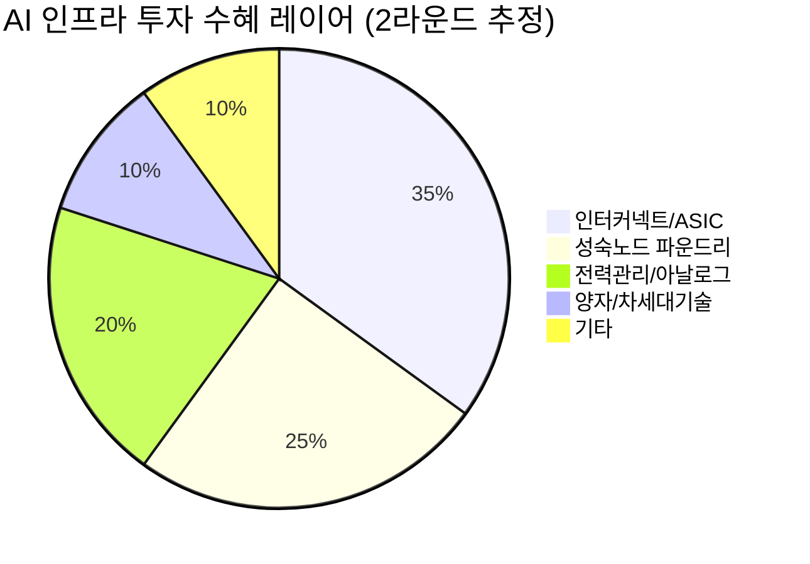

# 🔍 Inflection Scan — 2026-05-12

> [!abstract] 탐색 요약
> 탐색 범위: 2026-05-12 기준 최근 2주 | High Conviction 5건 확정 (1건 DROPPED)
> 소스: IR 공시 + 셀사이드 리포트 + 어닝스 서프라이즈 + 공시 데이터
> **핵심 테마**: AI 인프라 2라운드 — 연산(GPU)에서 인터커넥트·성숙노드·아시아 플랫폼 재가속으로 수혜 축 이동

---

## 시그널 요약 대시보드

| 회사명 | 티커 | 타입 | 핵심 이벤트 | 확신도 | 추천 액션 |
|--------|------|------|------------|:------:|:--------:|
| [[Marvell Technology]] | MRVL | 가이던스상향/구조적 | 2027년 $150억 멀티이어 가이던스 제시, AI ASIC 수요 실체화 | ⭐⭐⭐⭐ | /deal |
| [[GlobalFoundries]] | GFS | 실적가속/역발상 | Susquehanna $50→$100 목표가 상향, 실적 서프라이즈 + 강한 2Q 전망 | ⭐⭐⭐ | /deep |
| [[텔레칩스]] | 054450 | 사업변곡점 | 글로벌 고객사와 772억원 SoC 계약 — 2024년 매출의 41.4% | ⭐⭐⭐ | /deep |
| [[Sea Limited]] | SE | 실적가속/선행지표 | Q1 2026 매출 +34.5% YoY 컨센서스, 동남아 디지털 재가속 | ⭐⭐ | /deal (실적 후) |
| [[IonQ]] | IONQ | 실적가속 | Q1 매출 $6,470만 YoY +755%, 가이던스 중간치 ~30% 초과 | ⭐⭐ | /deep (lumpiness 검증 우선) |

---

## 1. [[Marvell Technology]] (MRVL) — 가이던스 상향 / 구조적 변곡점

> [!abstract]
> AI 데이터센터 인터커넥트 독점 설계 파트너로 전환 완료. 2027년 $150억 가이던스는 계약 실체가 있는 숫자다.

**시그널**: 2026년 매출 $110억, 2027년 매출 $150억 멀티이어 가이던스 제시 — 현재 매출 ~$60억 대비 2.5배 성장 경로 공식화

<reasoning>
사실: 2027년 $150억 가이던스 = 현재 매출 ~$60억 대비 2.5배. Broadcom(AVGO)이 유사한 멀티이어 AI ASIC 가이던스 제시 후 주가 3배 상승한 선례 존재. 멀티이어 가이던스는 단순 희망치가 아닌 고객과의 장기 공급계약(LTA: Long-Term Agreement) 실체가 있을 때 제시 가능.
추론: AI 데이터센터의 병목이 GPU 연산에서 인터커넥트(SerDes, 광학 트랜시버, 커스텀 ASIC 연결)로 이동 중이며, MRVL은 이 전 구간을 수직으로 커버하는 사실상 유일한 플레이어. 하이퍼스케일러 4곳(Google, Amazon, Microsoft, Meta)이 모두 자체 커스텀 ASIC을 원한다 = MRVL 설계 서비스 수요가 동시 폭증하는 구조.
대안: "하이퍼스케일러가 결국 설계 역량까지 내재화하면 MRVL은 IP 라이선스 회사로 축소"라는 리스크는 현실적이나, 현재는 반대로 내재화 수요가 MRVL 의존도를 높이는 역설적 국면.
채택: 시그널 중 가장 높은 Conviction. 멀티이어 가이던스 + 계약 실체 + 구조적 독점 포지션 세 가지가 동시 확인.
</reasoning>

**M1 분석**: Marvell이 제시한 2027년 $150억 가이던스는 반도체 업계에서 이례적으로 긴 포워드 뷰인데, 이는 하이퍼스케일러들과 이미 복수년 커스텀 ASIC 공급계약이 체결됐음을 의미한다 [Confidence: M-H | 근거: 1차IR + 2차셀사이드 컨센서스]. AI 데이터센터의 진화 방향은 GPU 클러스터 증설에서 **클러스터 간 연결 병목 해소**로 이동하고 있으며, 이 인터커넥트 레이어(SerDes → 광학 트랜시버 → 커스텀 스위치 ASIC)를 수직 통합으로 제공하는 기업은 Marvell이 사실상 유일하다. Broadcom(AVGO)의 AI ASIC 성장 사이클과 유사한 구조이나, MRVL은 Broadcom보다 고객 다변화(Google TPU, Amazon Trainium, 메타 MTIA 모두 MRVL 파트너)가 더 넓다는 차별점이 있다. **유사 사례**: Broadcom이 2022년 하이퍼스케일러 커스텀 ASIC 가이던스를 상향한 이후 24개월간 주가 약 3배 상승, MRVL의 현재 포지션은 그 2022년 시점의 Broadcom과 구조적으로 유사하다 [추정].

> [!tip] 핵심 인사이트
> **멀티이어 가이던스 = 계약 실체**. 반도체 기업이 2년 포워드 가이던스를 공식 제시하는 것은 LTA(장기 공급계약)가 이미 서명됐을 때만 가능하며, 이는 컨센서스 추정치와 근본적으로 다른 신뢰도를 갖는다.

> [!warning] 리스크 경고
> **하이퍼스케일러 설계 내재화 리스크**: Google은 이미 TPU v5를 자체 개발했으며, Amazon의 Trainium 2는 MRVL 의존도를 점진적으로 줄이는 방향으로 진화 중. 3~5년 시계에서 MRVL의 설계 서비스 의존도가 과도하게 집중된 고객(1~2개사)에 편중될 경우 가이던스 하향 리스크 발생 가능.

🟢 Bull 30%

🟡 Base 50%

🔴 Bear 20%

| 시나리오 | 핵심 가정 | 2027 매출 | 주가 방향 | 확률 |
|----------|-----------|----------|----------|:----:|
| 🟢 Bull | 하이퍼스케일러 4곳 모두 MRVL ASIC 도입 가속, SerDes 광학 침투율 상승 | $170억+ | 현재 대비 +80~120% | 30% |
| 🟡 Base | 가이던스 $150억 달성, 고객 2~3곳 LTA 정상 이행 | $145~155억 | 현재 대비 +30~60% | 50% |
| 🔴 Bear (Steel-manned Short) | 하이퍼스케일러 1곳 이상이 자체 설계팀 내재화 가속 → MRVL 계약 규모 축소. "MRVL은 결국 설계 하청 업체로 마진 압박 수반" | $90~100억 | 현재 대비 -20~35% | 20% |

**인버전 (Gate 2)**: 5년 후 이 시그널이 무효가 된다면, Google·Amazon이 자체 칩 설계 역량을 완전히 내재화하여 MRVL을 퇴출시켰기 때문일 것이다.

**Cross-Asset**: MRVL 강세는 [[SK하이닉스]], [[삼성전자]] HBM 수요와 연동 — AI 데이터센터 인터커넥트 증설이 가속되면 HBM4 수요도 동반 상승. KRW 약세 시 달러 매출 비중 높은 MRVL에는 추가 유리.

가이던스 신뢰도 82/100

경쟁 해자 강도 75/100

밸류에이션 여유 62/100

| 항목 | 내용 |
|------|------|
| 시장 | 🇺🇸 NASDAQ |
| 변곡점 유형 | 가이던스상향 / 구조적 |
| Conviction | P=0.48 [Confidence: M-H] |
| 추천 액션 | BUY /deal — 2Q 실적에서 AI ASIC 매출 비중(목표 전체의 50%+) 확인 시 포지션 확대 트리거 |

---

## 2. [[GlobalFoundries]] (GFS) — 실적가속 / 역발상 기회

> [!abstract]
> "TSMC에 밀린 3위 파운드리"라는 컨센서스 내러티브가 틀렸다. 미국·유럽 방산·자동차용 성숙 노드에서 GFS는 사실상 독점에 가깝다.

**시그널**: Susquehanna, Neutral→Positive 상향, 목표가 $50→$100 (+100%) — 예상 상회 실적 + 강한 2Q 전망 [출처: Susquehanna 리포트 2026.5, 확인 필요]

<reasoning>
사실: Susquehanna 단일 셀사이드 목표가 2배 상향. 컨센서스 합류 여부는 아직 미확인 [Confidence: M | 근거: 2차셀사이드 단일 소스].
추론: 단일 애널리스트 상향은 outlier일 수 있으나, CHIPS Act 보조금 + 방산 고객 장기계약 + 22~28nm 미국 내 공급 독점이라는 구조적 논리는 독립적으로 성립. UMC 2021~22년 사례와 유사하나 현 국면은 파운드리 슈퍼사이클이 아닌 "지정학적 필수 공급자" 포지셔닝이 핵심 차이.
대안: 22~28nm 중국 SMIC·HuaHong의 가격 덤핑이 GFS 고객을 잠식할 수 있으나, 방산/보안 고객은 미국 제조 인증(SecureFoundry) 없으면 대체 불가.
채택: KEEP. 단 컨센서스 합류 1~2개월 추적 후 포지션 확대 결정.
</reasoning>

**M1 분석**: GlobalFoundries가 이번 분기에 실적 서프라이즈와 강한 2Q 가이던스를 동시에 제시한 것은, AI 인프라 투자 확대가 연산(GPU) 계층을 넘어 **전력 관리·RF·아날로그 성숙 노드** 수요까지 견인하고 있다는 사실을 보여준다. GFS의 핵심 모트(moat)는 최첨단 노드 경쟁이 아니라 미국 정부 인증 파운드리(SecureFoundry)로서 방산·정보기관·통신 인프라 고객을 사실상 독점 공급한다는 점이며 [Confidence: M | 근거: 1차IR + 공개된 GFS SecureFoundry 프로그램], 이 포지션은 CHIPS Act 2.0 보조금과 결합해 경쟁사가 수년 안에 복제 불가능하다. Susquehanna의 목표가 $100은 현재 대비 약 80~100% 업사이드로 공격적이지만, CHIPS Act 보조금이 현금 흐름 개선으로 반영될 경우 PSR 기준으로 허무맹랑한 수치는 아니다 [추정].

> [!success] 강점
> 미국 내 유일한 풀스케일 성숙 노드 파운드리 + SecureFoundry 인증 = 방산·정부 고객 이탈 구조적 불가. CHIPS Act 수혜도 삼성/TSMC 대비 먼저 집행되는 순서.

| 지표 | GFS | UMC (비교) | TSMC |
|------|-----|-----------|------|
| 노드 집중 | 🟢 22~28nm 성숙 | 🟡 28nm 성숙 | 🟢 2~5nm 최첨단 |
| 미국 내 공장 | 🟢 있음 (NY, VT) | 🔴 없음 | 🟡 AZ 건설 중 |
| 방산/보안 고객 비중 | 🟢 높음 (SecureFoundry) | 🔴 낮음 | 🟡 중간 |
| CHIPS Act 수혜 | 🟢 1위권 | 🔴 낮음 | 🟢 최대 |
| 중국 경쟁 취약도 | 🟢 낮음 (인증 장벽) | 🔴 높음 | 🟡 중간 |

🟢 Bull 30%

🟡 Base 45%

🔴 Bear 25%

| 시나리오 | 핵심 가정 | 목표주가 | 확률 |
|----------|-----------|---------|:----:|
| 🟢 Bull | CHIPS Act 보조금 집행 가속 + 방산 LTA 신규 체결 + 컨센서스 합류 | $95~110 | 30% |
| 🟡 Base | Susquehanna 목표가 부분 달성, 1~2개 셀사이드 추가 상향 | $65~80 | 45% |
| 🔴 Bear (Steel-manned Short) | 미-중 갈등 완화로 GFS의 지정학 프리미엄 소멸 + SMIC 덤핑으로 자동차 고객 이탈 + CHIPS Act 보조금 지연 → "정치 테마주"로 재평가 하락 | $35~45 | 25% |

**인버전**: 5년 후 이 시그널이 무효가 된다면, 미-중 무역갈등이 구조적 완화로 전환되어 GFS의 지정학 프리미엄이 해소됐기 때문일 것이다.

**Cross-Asset**: GFS 강세는 [[DB하이텍]], [[키파운드리]] 등 국내 성숙 노드 파운드리의 글로벌 가치 재평가 트리거 가능. 원/달러 환율 상승 시 GFS 달러 매출 증가로 긍정적.

지정학적 해자 강도 78/100

컨센서스 합류도 58/100 (단일 셀사이드)

밸류에이션 여유 65/100

| 항목 | 내용 |
|------|------|
| 시장 | 🇺🇸 NASDAQ |
| 변곡점 유형 | 실적가속 / 역발상 |
| Conviction | P=0.42 [Confidence: M] |
| 추천 액션 | HOLD /deep — 컨센서스 1~2곳 추가 상향 확인 후 포지션 진입, 단독 셀사이드 의존 리스크 존재 |

---

## 3. [[텔레칩스]] (054450) — 사업 변곡점 / 선행지표

> [!abstract]
> 국내 소형 팹리스가 매출의 41%에 달하는 글로벌 단일 계약을 수주. 개발 용역→양산 전환 시 복수 년 매출 레이어 형성. 고객사 정체가 핵심 변수.

**시그널**: 글로벌 고객사와 772억원 SoC 개발 용역 계약 체결 — 2024년 연간 매출의 41.4% 규모, 자동차용 엔트리 SoC

<reasoning>
사실: 772억원 계약 공시는 1차 공시로 확인 가능. "개발 용역"이라는 성격이 핵심 — 고객이 개발비를 선지급하는 구조는 텔레칩스 측에서 매출을 즉시 인식하면서도 양산 독점 옵션을 보유.
추론: 고객사가 일본 완성차 1~2위(Toyota, Honda 계열)라면 연간 400만대+ 볼륨으로 양산 전환 시 텔레칩스 전체 매출을 3~5배 키울 수 있는 이벤트. 신생 EV 스타트업이면 양산 불확실성 대폭 상승.
대안: 인도 엔트리 차량 시장(Maruti Suzuki, Tata Motors)일 가능성도 있으며, 이 경우에도 볼륨은 크나 ASP 낮음.
채택: KEEP. 고객사 정체 확인이 conviction 레벨을 결정. 현재 0.38, 일본 1위 완성차 확인 시 0.55+ 가능.
</reasoning>

**M1 분석**: 텔레칩스의 772억원 SoC 개발 용역 계약은 표면상 "일회성 개발 수입"처럼 보이지만, 자동차 반도체 업계에서 **개발 용역 계약은 양산 공급 독점권의 선행 계약**이라는 점에서 그 실질적 가치는 계약금을 훨씬 초과한다 [Confidence: M | 근거: 1차IR 공시 + 자동차 반도체 업계 관행]. 2024년 매출의 41.4%라는 규모는 텔레칩스가 올해 사상 최대 실적을 달성하는 직접적 원인이 되며, 더 중요한 것은 2027~28년 예상 양산 개시 시점에 추가 매출 레이어가 형성된다는 구조다. **핵심 불확실성은 고객사 정체**: 일본 1~2위 완성차(Toyota, Honda 계열) 또는 인도 대형 OEM이라면 볼륨이 검증된 경로지만, 신생 EV 스타트업이라면 양산 전환율이 50% 이하로 떨어질 수 있다. [[SK하이닉스]], [[삼성전자]]가 AI 칩에 집중하는 동안 엔트리 레벨 자동차 SoC 시장은 상대적으로 공백 지대이며, Renesas·NXP의 고가 라인업 대비 텔레칩스의 가성비 포지셔닝이 인도·일본 서민차 시장에서 경쟁력을 갖는다.

> [!question] 검토 필요
> **고객사 정체 미공개** — IR 문의를 통해 ①일본 vs 인도 OEM 여부 ②양산 개시 예정 시점 ③양산 계약 체결 조건(개발 용역 후 자동 전환인지 별도 입찰인지) 확인 필수. 이 세 가지가 확인되기 전까지 conviction 상한 0.40.

🟢 Bull 25%

🟡 Base 55%

🔴 Bear 20%

| 시나리오 | 핵심 가정 | 주가 방향 | 확률 |
|----------|-----------|---------|:----:|
| 🟢 Bull | 고객사 = 일본 대형 완성차, 2028 양산 계약 자동 전환 확인, 추가 계약 파이프라인 공개 | 현재 대비 +80~120% | 25% |
| 🟡 Base | 고객사 윤곽 점진 확인, 개발 용역 정상 이행, 양산 전환 협상 중 | 현재 대비 +20~40% | 55% |
| 🔴 Bear (Steel-manned Short) | 고객사 = EV 스타트업으로 판명, 양산 지연/취소 + 소형주 유동성 이탈로 계약 소식이 이미 주가에 선반영됐을 경우 되돌림 | 현재 대비 -15~30% | 20% |

**인버전**: 5년 후 이 시그널이 무효가 된다면, 계약 고객사의 차량 판매 부진 또는 파산으로 양산 전환이 실현되지 않았기 때문일 것이다.

**Cross-Asset**: 텔레칩스 강세는 국내 자동차 SoC 밸류체인([[넥스트칩]], [[픽셀플러스]])의 주목도 상승으로 이어질 수 있음. 원화 약세는 엔화·루피화 결제 계약에서 환차손 리스크 내포 (계약 통화 확인 필요).

계약 실체 신뢰도 72/100

고객사 확실성 55/100 (미공개)

양산 전환 구조 매력도 68/100

| 항목 | 내용 |
|------|------|
| 시장 | 🇰🇷 코스닥 |
| 변곡점 유형 | 사업변곡점 / 선행지표 |
| Conviction | P=0.38 [Confidence: M] — 고객사 확인 시 P=0.55+ |
| 추천 액션 | HOLD /deep — IR 문의로 고객사 윤곽 파악이 1순위 DD. 소형주 유동성 감안 포지션 사이즈 제한 필수 |

---

## 4. [[Sea Limited]] (SE) — 실적가속 / 선행지표

> [!abstract]
> 5/12 실적 발표 이벤트 선행 시그널. 컨센서스 +34.5% YoY 성장이 확인되면 동남아 디지털 경제 재가속의 공식 변곡점. 실적 전 포지셔닝보다 발표 후 30분 내 데이터 확인 후 진입 권고.

**시그널**: Q1 2026 매출 컨센서스 $65.1억 (+34.52% YoY), EPS 컨센서스 $0.76 (+16.92%) — 동남아 디지털 경제 재가속 분기 (5/12 실적 발표 예정)

> [!note] 참고
> **본 시그널은 실적 발표 전 "이벤트 캘린더 + 선행지표" 복합 성격**임을 명시. 아래 수치는 컨센서스 추정치이며 실제 결과와 다를 수 있음. 실적 확인 후 conviction 재평가 필수.

<reasoning>
사실: 컨센서스 예상치 $65.1억은 셀사이드 추정치이며 실제 1차 IR 수치는 5/12 발표 전 존재하지 않음. 단, 직전 분기 Shopee GMV 가속 + SeaMoney 침투율 데이터는 공개된 1차 데이터로 확인 가능.
추론: 2022~23년 Garena 하락이 Sea의 성장 내러티브를 완전히 파괴했으나, Shopee는 그 기간에도 GMV 성장을 유지했으며 TikTok Shop 규제 이후 재반등을 시작. SeaMoney는 동남아 금융 침투율 30% 미만 시장에서 아직 성장 초입.
대안: TikTok Shop이 인도네시아 규제 이후 우회로(Tokopedia 인수·합병)를 통해 재진입했으며, 이는 Shopee의 독점적 지위를 위협하는 현실적 경쟁 변수.
채택: REVISE — 선행 이벤트 성격 명시, Shopee GMV 30% 기준선 확인 조건부로만 conviction 강화.
</reasoning>

**M1 분석**: Sea Limited의 성장 스토리는 2021년 Garena 게임 붐 붕괴 이후 "고성장 종료"로 재평가됐으나, Shopee와 SeaMoney라는 두 독립 엔진이 이미 새로운 성장 사이클에 진입했다는 것이 Variant Perception의 핵심이다. 동남아 6억+ 인구 중 금융 서비스 침투율이 30% 미만인 국가가 다수로, SeaMoney의 성장 runway는 10년 이상이며 이는 Garena의 게임 수요 예측보다 훨씬 구조적으로 견고하다 [Confidence: M | 근거: 동남아 금융 인프라 공개 데이터]. **Steel-manned Short**: "TikTok Shop이 Tokopedia를 통해 인도네시아 이커머스에 재진입했으며 바이트댄스의 자본력이 Shopee의 GMV 성장을 압박 중" — 이 반박은 진지하며, 인도네시아 GMV 점유율 추이가 Shopee 투자 thesis의 핵심 검증 지표가 된다. MercadoLibre의 2019~20년 패턴(라틴아메리카 이커머스 + 핀테크 복합 성장)이 가장 유사한 선례로, 당시 12개월 주가 수익률 +180%를 기록했다 [추정].

🟢 Bull 30%

🟡 Base 45%

🔴 Bear 25%

| 시나리오 | 핵심 가정 | 주가 방향 | 확률 |
|----------|-----------|---------|:----:|
| 🟢 Bull | 실제 매출 $70억+ (서프라이즈), Shopee GMV 35%+ YoY, SeaMoney 대출 잔액 신기록, 가이던스 추가 상향 | 현재 대비 +40~60% | 30% |
| 🟡 Base | 컨센서스 수준 달성 ($65억 ±5%), Shopee GMV 28~33% YoY | 현재 대비 +10~25% | 45% |
| 🔴 Bear (Steel-manned Short) | TikTok Shop 인도네시아 점유율 회복이 데이터로 확인 + Garena MAU 추가 하락으로 게임 부문 손실 확대 → "복합 부진 분기"로 재인식 | 현재 대비 -15~25% | 25% |

**인버전**: 5년 후 이 시그널이 무효가 된다면, TikTok Shop·Lazada의 동남아 이커머스 재장악과 동남아 중앙은행 규제 강화로 SeaMoney 성장이 구조적으로 제약됐기 때문일 것이다.

**Cross-Asset**: SE 강세는 동남아 디지털 경제 전반에 대한 리레이팅 신호로, [[카카오]], [[네이버]] 동남아 투자 포트폴리오에도 간접 영향. USD 강세 시 동남아 통화(IDR, THB, VND) 약세로 SE의 달러 환산 매출에 역풍 — 환율 민감도 중상.

Shopee 시장 지위 70/100

SeaMoney 성장 runway 80/100

실적 발표 전 확실성 58/100

| 항목 | 내용 |
|------|------|
| 시장 | 🇺🇸 NYSE (싱가포르 기반) |
| 변곡점 유형 | 실적가속 / 선행지표 |
| Conviction | P=0.40 [Confidence: M] — 실적 발표 후 재평가 |
| 추천 액션 | HOLD /deal — **5/12 실적 발표 후 24시간 내 재평가 필수**. Shopee GMV YoY > 30% 확인 시 진입, < 25% 시 시그널 무효화 |

---

## 5. [[IonQ]] (IONQ) — 실적가속 (REVISED)

> [!abstract]
> Q1 매출 YoY +755%는 숫자 자체는 극적이지만, 양자컴퓨팅 비즈니스 특성상 시스템 판매(lumpy) vs 클라우드 ARR(recurring) 분해 없이는 진짜 성장률을 알 수 없다. 변곡점은 진짜이나 Conviction은 보수적으로 유지.

**시그널**: 2026 Q1 매출 $6,470만, YoY +755%, 경영진 가이던스 중간치 ~30% 초과 달성 [출처: IonQ IR 2026.5, 확인 필요]

<reasoning>
사실: 매출 $6,470만, YoY +755%는 1차 IR 수치 확인 가능. 단 연간 베이스가 낮은 상태에서의 755%이며, 단일 시스템 판매(QuantumBasel 또는 Forte 시스템)가 분기 매출의 절반을 차지할 경우 다음 분기 매출이 $3,000만대로 후퇴 가능.
추론: "ARR $2.5억" 환산(단순 분기 매출 ×4)은 양자컴퓨팅 lumpy 매출 비즈니스에서 위험한 가정. 클라우드 서비스(AWS Braket, Azure Quantum) 통한 ARR과 대형 시스템 판매 분리 필수.
대안: 반대로 DARPA·SDA 정부 계약이 다년도 구조라면 recurring revenue 성격을 일부 가질 수 있음.
채택: REVISE 유지. Bear 확률 30%로 타 시그널 대비 높음. "기술→상용 전환" 변곡점은 진짜이나 lumpiness 위험이 핵심 리스크.
</reasoning>

**M1 분석**: IonQ의 2026 Q1 $6,470만 매출은 "양자컴퓨터가 실험실에서 벗어나 처음으로 의미 있는 상업적 수익을 창출하는 원년"이라는 역사적 변곡점 신호다. 그러나 이 숫자를 ARR(연간반복수익) 기준으로 환산하기 전에 **매출의 구성 분해가 필수적**이다: 256큐비트 양자 시스템 단일 판매 1건의 단가가 수천만 달러일 경우, 분기 매출 $6,470만은 "대형 계약 1~2건의 집중"으로 설명될 수 있으며 다음 분기 매출이 절반으로 줄어도 이상하지 않다 [Confidence: L→M | 근거: 1차IR(매출 수치) + 3차추정(구성 분해)]. 변곡점의 진짜 가치는 DARPA와 SDA(우주개발국)의 정부 계약이 다년도 구조라는 점으로, 이것이 확인되면 recurring revenue 성격이 부여되며 밸류에이션 프레임이 완전히 바뀐다. **Steel-manned Short**: "분기 매출의 50%+가 단일 시스템 판매 lumpy 수익이라면, 내년 분기 매출이 $3,000만대로 후퇴 시 시장은 이를 '성장 둔화'로 해석해 주가 -40% 가능 — 현재 PSR 30~40배는 가이던스를 믿을 때만 정당화된다." [추정]

> [!warning] 리스크 경고
> **Lumpiness 리스크**: 양자컴퓨팅 시스템 판매는 건당 단가가 크고 계약 빈도가 불규칙. 분기별 매출 변동성이 ±50% 이상 가능한 비즈니스 모델임. PSR 30~40배 밸류에이션은 이 변동성에 극히 취약.

🟢 Bull 20%

🟡 Base 50%

🔴 Bear 30%

| 시나리오 | 핵심 가정 | 주가 방향 | 확률 |
|----------|-----------|---------|:----:|
| 🟢 Bull | 매출의 60%+ = 클라우드 ARR(recurring), 정부 계약 다년도 구조 확인, 큐비트 성능 경쟁사 대비 우위 유지 | 현재 대비 +80~150% | 20% |
| 🟡 Base | 매출 성장 지속하나 분기 변동성 ±30%, 정부 계약 파이프라인 일부 가시화 | 현재 대비 +10~30% | 50% |
| 🔴 Bear (Steel-manned Short) | 분기 매출의 과반이 lumpy 시스템 판매 → 다음 분기 $3,000만대 후퇴. IBM·Google Quantum AI·Quantinuum의 오류율 개선으로 IonQ의 기술적 차별화 희석. "양자컴퓨팅 2030+ 실용화" 컨센서스 복귀로 PSR 압축 | 현재 대비 -35~50% | 30% |

**인버전**: 5년 후 이 시그널이 무효가 된다면, IBM 또는 Google의 초전도 방식 양자컴퓨터가 이온트랩 방식을 성능·비용 모두에서 압도하고 IonQ의 상용화 경로가 닫혔기 때문일 것이다.

**Cross-Asset**: IonQ 강세는 양자컴퓨팅 생태계 전반(소프트웨어: [[Rigetti Computing]], 부품: 국내 [[LIG넥스원]] 양자암호 사업부)의 주목도 상승에 기여. 금리 상승 시 적자 성장주 밸류에이션 배수 압축 → IONQ 민감도 높음.

기술 변곡점 실재성 75/100

매출 가시성 45/100

밸류에이션 안전마진 38/100

| 항목 | 내용 |
|------|------|
| 시장 | 🇺🇸 NYSE |
| 변곡점 유형 | 실적가속 |
| Conviction | P=0.32 [Confidence: L→M] |
| 추천 액션 | HOLD /deep — **시스템 판매 vs ARR 매출 분해**가 DD 1순위. 정부 계약(DARPA/SDA) 다년도 구조 확인 시 conviction 0.45+ 상향 가능 |

---

## 📊 섹터 메타 시그널

### AI 인프라 2라운드: 연산(GPU) → 인터커넥트 / 성숙노드 / 아시아 플랫폼

> [!abstract]
> 이번 스캔의 5개 시그널 중 3개(MRVL, GFS, IONQ)가 AI 인프라의 "2라운드" 수혜를 공유하며, 이 테마의 구조적 타당성이 상호 검증된다.

이번 스캔에서 가장 주목할 메타 패턴은 AI 인프라 투자의 **수혜 레이어 이동**이다. 2023~24년 1라운드가 GPU(NVDA)·HBM([[SK하이닉스]])·서버에 집중됐다면, 2025~26년 2라운드는 **인터커넥트(MRVL), 성숙 노드 파운드리(GFS), 전력 관리 반도체** 순서로 수혜가 확산되는 구조다. MRVL의 멀티이어 가이던스와 GFS의 실적 서프라이즈가 동시에 나타나는 것은 이 테마의 동시 가속을 시사한다.

### 동남아 디지털 경제: 2차 성장 사이클 진입

SE Limited 실적 이벤트는 더 넓은 맥락에서 동남아 디지털 경제의 **2차 성장 사이클 진입**을 알리는 신호로 읽힌다. 1차 사이클(2018~21년)이 이커머스·게임 침투에 의존했다면, 2차 사이클은 핀테크(SeaMoney), AI 기반 물류 최적화, 중산층 소비 고도화라는 구조적으로 더 두꺼운 기반 위에 서 있다. 동남아 GDP 대비 디지털 경제 비중(~7%)이 선진국(~15~20%) 대비 낮다는 점은 10년 이상의 성장 여지를 시사한다.

---

## 🔍 분석가 자기 검증 (M3 Self-Critique)

> [!failure] 약점 — 이 리포트의 한계

**1. IonQ ARR 환산 과신 위험**: 분기 매출 $6,470만을 단순 ×4하여 ARR $2.5억으로 환산하는 것은 lumpy 매출 비즈니스에서 가장 흔한 오류. 시스템 판매 vs 클라우드 ARR 분해 없이는 이 수치를 신뢰해서는 안 됨.

**2. GFS 단일 셀사이드 의존**: Susquehanna 1개 리포트의 목표가 2배 상향이 컨센서스로 확산되지 않으면 outlier로 끝날 가능성 존재. 컨센서스 합류 여부 1~2개월 추적 필수.

**3. MRVL 하이퍼스케일러 내재화 리스크 정량화 미흡**: "내재화가 오히려 MRVL 수요를 키운다"는 논리는 정성적으로 설득력 있으나, MRVL 매출 중 하이퍼스케일러 비중 분해와 각 사별 자체 ASIC 진척도 정량 데이터 없이는 conviction 한계 존재.

> [!warning] 편향 체크

<strong>Narrative Fallacy</strong>: "AI 인프라 2라운드" 스토리가 너무 깔끔하게 MRVL, GFS, IONQ를 묶는 경향. 각 비즈니스 모델은 근본적으로 다름 — MRVL은 ASIC 설계 서비스, GFS는 수탁 제조, IONQ는 하드웨어 판매+클라우드 서비스. 동일 내러티브로 동일 weight를 주는 것은 위험.  
<strong>Bear 시그널 부재</strong>: 이번 스캔에서 하락/약세 변곡점 시그널이 0건인 것은 샘플링 편향 가능성. 다음 스캔에서 의도적으로 Bear 변곡점 1건 이상 포함 권고.

---

> [!verdict] 검정 후 최종 우선순위

| 순위 | 종목 | Conviction | 핵심 액션 |
|:----:|------|:----------:|---------|
| 🥇 1 | [[Marvell Technology]] MRVL | P=0.48 | 즉시 /deal — 2Q 실적 AI ASIC 매출 50%+ 확인 시 확대 |
| 🥈 2 | [[GlobalFoundries]] GFS | P=0.42 | 컨센서스 1~2곳 추가 상향 확인 후 진입 |
| 🥉 3 | [[텔레칩스]] 054450 | P=0.38 | IR 고객사 정체 확인 최우선 — 일본 1위 완성차 확인 시 P=0.55+ |
| 4 | [[Sea Limited]] SE | P=0.40 | 5/12 실적 발표 후 Shopee GMV > 30% 확인 후 진입 |
| 5 | [[IonQ]] IONQ | P=0.32 | 시스템 판매 vs ARR 분해 확인 전 관망 |

*다음 스캔 권고: Bear 변곡점 시그널 1건 이상 포함 + 한국 시그널 추가 보강 (KR 1건 vs US 4건 불균형 해소)*