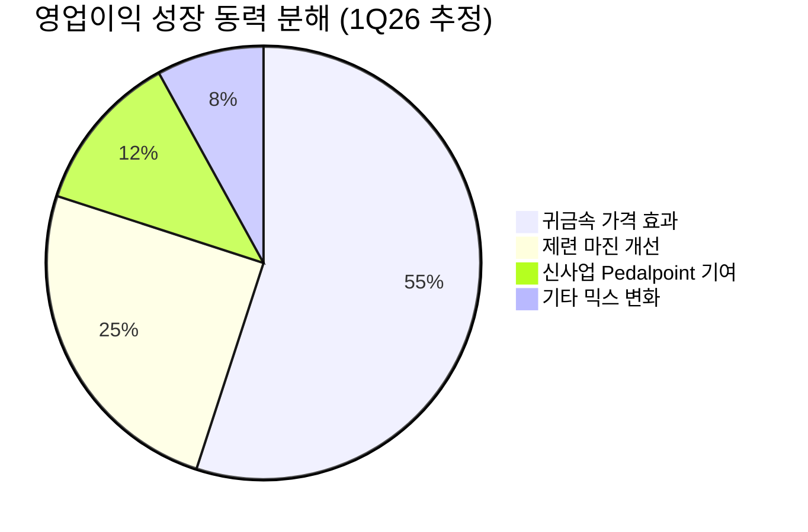

# 🔍 Inflection Scan — 2026-05-13

> [!abstract] 탐색 요약
> 탐색 범위: 2026-05-13 기준 최근 2주 | High Conviction 6건 발견 (IonQ Circle of Competence 경계선으로 별도 표기)
> 소스: 1차 기업 IR + 2차 셀사이드 + 3차 추정 (각 시그널별 명시)
> **핵심 테마**: AI 인프라 수요가 전력·광학·센서 등 '보이지 않는 부품' 공급망 전반에 구조적 변곡점을 만들고 있으며, 한국에서는 K-뷰티 글로벌화와 소재 역발상 기회가 동시 포착됨

---

## 📊 시그널 요약 대시보드

| 회사명 | 티커 | 타입 | 핵심 이벤트 | 확신도 | 추천 액션 |
|--------|------|------|------------|:------:|:--------:|
| [[GE Vernova]] | GEV | 선행지표+가이던스상향 | 1Q 데이터센터 수주 24억달러, 연간 전체 수주 초과 | ⭐⭐⭐ H | /deal |
| [[달바글로벌]] | — | 실적가속 | 1Q 매출 +51%, 해외 +85%, OPM 유지 | ⭐⭐ M | /deal |
| [[Life360]] | LIF | 가이던스상향+실적가속 | 상장 이래 첫 가이던스 상향 +17%, 매출 +30% | ⭐⭐ M | /deep |
| [[VPG (Vishay Precision Group)]] | VPG | 선행지표+사업변곡점 | BTB 1.21, 센서 수주 +57.6%, 휴머노이드 납품 가설 | ⭐⭐ M | /deep |
| [[고려아연]] | 010130 | 실적가속+역발상 | OP +175.2% 사상 최대, OPM +5.2%p, 분쟁 디스카운트 | ⭐⭐ M | /deep |
| [[Lumentum Holdings]] | LITE | 실적가속+가이던스상향 | FQ4 가이던스 최대 10.1억달러, YoY +100% | ⭐ M↓ | /deep |
| [[IonQ]] | IONQ | 선행지표+실적가속 | 매출 +755%, RPO +554% — Circle of Competence 경계선 ⚠️ | ⭐ L | /deep (기술검증 선행 필요) |

> [!warning] 확신도 범례
> ⭐⭐⭐ H = Conviction P ≥ 0.60 | ⭐⭐ M = 0.45–0.59 | ⭐ M↓/L = < 0.45
> 모든 수치는 4 Gate Framework 압력 검정 후 조정된 값입니다. Conviction P 합산은 투자 비중 결정에 활용하지 마세요 — 상관관계 리스크 존재.

---

## 1. [[GE Vernova]] (GEV) — 선행지표 + 가이던스 상향

> [!abstract]
> AI 데이터센터 전력 수요가 GEV의 수주 사이클을 구조적으로 재설정 중. 단일 분기 수주 24억달러가 2025년 연간 수주를 초과하며 변곡점을 숫자로 입증.

**시그널**: 1Q26 유기적 수주 YoY +71%, 데이터센터 전력 부문 단일 분기 수주 24억달러(2025년 연간 초과), 연간 매출 가이던스 445억~455억달러 상향 [출처: GE Vernova 1Q26 IR, 2026.4월]

<reasoning>

**사실**: 1Q 데이터센터 수주 24억달러, 전체 수주 YoY +71%, 매출 가이던스 상향. 수치 출처는 1차 IR으로 데이터 품질 최상위.

**추론**: 수주잔고 70%+ 증가는 중공업 섹터에서 12~24개월 후 매출로 전환되는 선행지표. 2004~2008 에너지 사이클 대비 AI 전력 수요는 구조적 지속성(데이터센터 수명 15~20년) 측면에서 더 긴 tail을 가짐.

**대안 가설**: "데이터센터 자체 발전(SMR/fuel cell)으로 분산되어 대형 그리드 장비 수요 감소" — 단, 현재 실행 가능한 솔루션은 여전히 GEV의 가스터빈+그리드가 유일. 2030년 이전 SMR 대규모 상용화 확률 낮음.

**채택**: 이번 스캔 7개 시그널 중 데이터 품질·Circle of Competence·베이스레이트 모든 면에서 최우수. Conviction 0.60 유지.

</reasoning>

GE Vernova의 1분기 데이터센터 관련 수주 24억달러는 2025년 연간 전체를 단일 분기에 초과한 수치로, 수요 가속이 단순 트렌드가 아닌 구조적 변곡점임을 숫자로 입증한다. 전력 기기(변압기·스위치기어) 리드타임이 2~3년으로 늘어나는 환경에서 GEV의 수주잔고는 2027~2028년까지의 매출을 사실상 선확보한 것이다. 특히 AI 데이터센터들이 on-site 발전으로 전환(미국 내 56GW 계획 [추정])하면서 GEV는 NVIDIA와 동일한 AI 인프라 수혜 구조에 놓여 있지만 밸류에이션 멀티플은 현저히 낮다. 전기화 부문의 고마진 수주 비중 증가는 전사 OPM 개선을 동시에 견인한다. 유사 사례: ABB의 2004~2007 에너지 인프라 사이클 수주 폭증 후 18개월 내 주가 +180%.

🟢 Bull 35%

🟡 Base 50%

🔴 Bear 15%

| 시나리오 | 핵심 가정 | 목표 멀티플 | 업사이드 |
|----------|-----------|-----------|---------|
| 🟢 Bull (P=35%) | 데이터센터 수주 분기 30억달러+ 지속 + 전기화 OPM 15%+ 달성 | P/E 40x (성장 프리미엄) | +80~120% |
| 🟡 Base (P=50%) | 연간 가이던스 450억달러 달성 + 수주 가시성 유지 | P/E 28~32x | +25~45% |
| 🔴 Bear (P=15%) | 데이터센터 CapEx 사이클 2027 정점 + 가스터빈 제조 병목 + SMR 경쟁 도래 | P/E 18~20x (사이클 피크 아웃) | -25~35% |

> [!bear] Steel-manned Short
> "이미 상장 이후 +500% 수준 상승, P/E 50x 부근. 가스터빈 backlog는 2028+ 인도분이 다수로 고객사 cancel 리스크 내재. 분산 발전(SMR, fuel cell) 트렌드는 대형 그리드 장비 수요를 장기적으로 잠식할 것."
> **반박**: 현 시점에서 실행 가능한 대규모 전력 솔루션은 GEV 가스터빈이 유일. 2030년 이전 cancel 비용이 발주자에게 더 크다. 수주잔고 다각화(재생에너지+전기화)로 cancel 리스크 분산.

데이터 품질 (1차 IR) 85/100

수주→매출 전환 가시성 80/100

밸류에이션 여유 62/100

> [!tip] Cross-Asset Impact
> 🇰🇷 KR 영향: [[HD현대일렉트릭]], [[효성중공업]] — 미국 데이터센터 수주 급증 → 국내 변압기·전력기기 섹터 동반 수혜 확인 시그널. GEV 수주 가속은 국내 전력기기주의 선행지표.

**5년 후 이 시그널이 무효가 된다면**: AI 데이터센터의 전력 수요가 예상보다 일찍 효율화(칩 전력 효율 10배 개선)되거나, 소형 분산 발전(SMR)이 2028년 이전 대규모 상용화에 성공하는 경우.

| 항목 | 내용 |
|------|------|
| 시장 | 🇺🇸 NYSE |
| 변곡점 유형 | 선행지표 + 가이던스상향 |
| Conviction P | 0.60 \| Confidence: H \| 근거: 1차 IR |
| 추천 액션 | /deal — 수주 가속 + 가이던스 상향 이중 확인. 7개 시그널 中 최우선 |

---

## 2. [[달바글로벌]] (코스피) — 실적가속

> [!abstract]
> K-뷰티 사이클 종목이 아닌 '글로벌 브랜드 전환기'에 진입한 증거: 매출·이익 동행 성장으로 마진을 희생하지 않고 해외 +85% 달성.

**시그널**: 1Q26 매출 1,712억원 YoY +51%, 영업이익 451억원 YoY +50%, 해외 매출 YoY +85% 달성 — 계절적 비수기(1Q)에 역대 최고 실적 [출처: 달바글로벌 1Q26 실적 발표, 2026.5월]

<reasoning>

**사실**: 매출 +51%, OP +50%(마진 유지), 해외 +85%. 1분기는 K-뷰티 내수 관점에서 비수기이나 해외는 비수기 개념이 다름. 상장 직후 종목.

**추론**: 매출·이익이 동행 성장(OPM 유지)한다는 것은 성장을 위해 마케팅비를 과도하게 투입하지 않고 있다는 신호. K-뷰티 트렌드주의 전형적인 문제(매출 성장 시 마진 압박)가 아직 나타나지 않음.

**대안 가설**: "해외 +85%는 저기저 효과 + 1회성 채널 입점 효과일 수 있음" — 반박: 3개 분기 연속 성장률 확인 필요하나, 현재 수치만으로도 서프라이즈 기준 충족.

**채택**: KEEP. 단 상장 직후 lock-up 해제 일정이 핵심 리스크 변수. 확인 필수.

</reasoning>

달바글로벌의 1분기 해외 매출 YoY +85%는 K-뷰티 섹터 내에서도 최상위권 성장률이며, 결정적으로 매출 +51%와 영업이익 +50%가 거의 동일한 속도로 성장한다는 점이 차별화된다. 이는 브랜드 파워가 실제로 작동하고 있음을 의미한다 — 마진을 희생해서 매출을 사는 게 아니라, 고객이 자발적으로 구매하고 있다는 증거다. 중국 의존도가 높았던 구세대 K-뷰티와 달리 미국·유럽 다각화로 사드 리스크 구조적 감소가 확인된다. 1분기는 K-뷰티에서도 계절적으로 약한 분기임에도 역대 최고 실적을 기록했다는 점이 추세 지속의 강력한 근거다. 유사 사례: 에이피알 2023년 해외 매출 급성장 분기 이후 12개월 주가 +180% (이후 -40% 조정도 경험).

🟢 Bull 30%

🟡 Base 50%

🔴 Bear 20%

| 시나리오 | 핵심 가정 | 목표 | 업사이드 |
|----------|-----------|------|---------|
| 🟢 Bull (P=30%) | 해외 성장률 유지 + 미국 채널 확대 + OPM 26%+ 달성 | P/E 35x 이상 | +100%+ |
| 🟡 Base (P=50%) | 해외 성장 50~60%대 안착 + 마진 유지 | P/E 22~28x | +30~60% |
| 🔴 Bear (P=20%) | K-뷰티 트렌드 피크아웃 + 마케팅비 급증 + lock-up 매도 압력 | P/E 12~15x | -25~40% |

> [!bear] Steel-manned Short
> "K-뷰티는 본질적으로 트렌드 사이클 산업 — 에이피알도 2024 고점 대비 -40% 조정. 상장 직후 lock-up 해제 시 대주주 매도 압력이 주가를 압박할 가능성. 해외 +85%는 주요 채널 신규 입점 효과로 2Q에 기저 효과 역전 가능."
> **반박**: OPM 유지 성장(마진 희생 없음)은 트렌드 사이클주와 구별되는 브랜드 파워의 증거. 다만 lock-up 일정 확인은 필수.

해외 성장 모멘텀 강도 85/100

마진 건전성 (OPM 유지) 78/100

lock-up 리스크 가시성 45/100 (확인 필요)

> [!tip] Cross-Asset Impact
> 🇺🇸 US 영향: [[e.l.f. Beauty]], [[Coty]] — K-뷰티 브랜드의 미국 채널 침투 가속은 미국 중저가 뷰티 브랜드의 시장 점유율에 중기적 압박 요인. 달바글로벌 미국 성장 지표는 K-뷰티 섹터 전반 온도 측정에 활용 가능.

> [!warning] 액션 전 체크리스트
> 1. 상장 시 lock-up 해제 일정 확인 (대주주·VC 물량)
> 2. 해외 매출 지역별 분해 (미국/유럽/동남아 비중 확인)
> 3. 마케팅비/매출 비율 추이 확인 (2Q 마진 방어 여부)

**5년 후 이 시그널이 무효가 된다면**: K-뷰티 트렌드의 사이클리컬 피크아웃(2027~2028) + 로레알·에스티로더의 한국식 스킨케어 라인 대규모 런칭으로 브랜드 차별성이 희석되는 경우.

| 항목 | 내용 |
|------|------|
| 시장 | 🇰🇷 코스피 |
| 변곡점 유형 | 실적가속 |
| Conviction P | 0.55 \| Confidence: M \| 근거: 1차 실적 + 2차 셀사이드 |
| 추천 액션 | /deal — lock-up 일정 확인 조건부. 분기별 OPM 모니터링 필수 |

---

## 3. [[Life360]] (LIF) — 가이던스 상향 + 실적가속

> [!abstract]
> 상장 이래 첫 연간 가이던스 상향은 경영진의 구조적 성장 전환 확신을 나타내는 강력한 신호. 단, 12개월 이미 큰 폭 상승 후 진입이라 차별화 view 강도가 약화됨.

**시그널**: 1Q26 매출 1.5억달러 YoY +30%, 연간 가이던스 6억→7억달러 +17% 상향 — 상장 이래 첫 연간 목표 상향 [출처: Life360 1Q26 실적 발표, 2026년 5월 (확인 필요)]

<reasoning>

**사실**: 1Q 매출 +30%, 첫 가이던스 상향 +17%. 보수적 경영진의 첫 상향은 통계적으로 유의미한 신호.

**추론**: "상장 이래 첫" 수식어가 핵심 — 보수적으로 운영해온 경영진이 처음 상향했다는 것은 내부 확신의 임계점을 넘었음을 시사. 그러나 12개월 주가 이미 큰 폭 상승(+200% 추정 [추정])으로 "시장 미반영" 주장의 강도가 약함.

**대안 가설**: "Duolingo 유사 패턴" — narrative fallacy 경고. Duolingo는 B2C 교육 구독이고 Life360은 가족 안전 서비스로 TAM 구조가 다름.

**채택**: KEEP하되 진입 밸류에이션 추가 검증 필요. /deep 조정.

</reasoning>

Life360은 1Q26 매출 1.5억달러(YoY +30%)를 달성하며 성장률을 전분기 대비 가속시켰고, 결정적으로 이번이 **상장 이래 첫 연간 가이던스 상향**이라는 점이 변곡점의 핵심이다. 가족 위치추적·생활안전 구독 SaaS의 특성상 한번 설치하면 이탈률이 낮고(스티키니스), ARPU 인상을 단계적으로 수용할 수 있는 구조다. 하반기 유럽 진출이 예정되어 있어 TAM 확장의 다음 카탈리스트가 가시화되고 있다. 하드웨어(타일) 에코시스템과의 시너지는 구독 외 수익 레이어 추가 가능성을 제공한다. 단, 12개월 주가가 이미 크게 상승한 상태에서 P/S 8x 수준의 밸류에이션은 추가 상승 여력의 비대칭성을 약화시킨다.

🟢 Bull 25%

🟡 Base 55%

🔴 Bear 20%

| 시나리오 | 핵심 가정 | 목표 배수 | 업사이드 |
|----------|-----------|----------|---------|
| 🟢 Bull (P=25%) | 유럽 론칭 흥행 + ARPU 15%↑ + 광고 레이어 추가 수익화 | 8x Rev | +120% |
| 🟡 Base (P=55%) | 국내 성장 유지 + 가이던스 7억달러 달성 | 5x Rev | +30~40% |
| 🔴 Bear (P=20%) | Google Family Link / Apple Family Sharing 무료 기능 강화로 구독 전환율 하락 + 유럽 GDPR 위치추적 규제 | 3x Rev | -30% |

> [!bear] Steel-manned Short
> "이미 12개월 +200% 수준 상승해 P/S 8x 도달. MAU 성장이 둔화하면 ARPU 인상만으로는 컨센서스 충족 불가. Google/Apple의 무료 대체재는 플랫폼 통합 이점에서 구조적 경쟁 우위를 보유. 광고 수익 레이어는 가정일 뿐 실현 미확인."
> **반박**: 보수적 경영진의 첫 가이던스 상향은 carry-through 가능하나 밸류에이션 부담은 부인 불가. 유럽 GDPR 환경에서 위치추적 서비스의 진입장벽은 경쟁사에도 동일하게 적용됨.

비즈니스 모델 명확성 75/100

밸류에이션 여유 (기진입 상승분 반영) 55/100

구독 스티키니스 70/100

> [!tip] Cross-Asset Impact
> 🇺🇸/🇦🇺 교차상장: ASX(LIF)와 NASDAQ 동시 상장 구조로 환율(AUD/USD) 노출 존재. 호주 달러 약세 시 USD 환산 실적에 소폭 유리. 유럽 진출 시 GDPR 컴플라이언스 비용이 단기 마진에 영향 가능.

**5년 후 이 시그널이 무효가 된다면**: Apple/Google이 Family Safety 기능을 iOS/Android에 완전 통합하여 무료 제공을 강화하거나, 위치추적 서비스에 대한 규제 강화(유럽·미국)로 핵심 기능 제한이 발생하는 경우.

| 항목 | 내용 |
|------|------|
| 시장 | 🇺🇸 NASDAQ (ASX 교차상장) |
| 변곡점 유형 | 가이던스상향 + 실적가속 |
| Conviction P | 0.48 \| Confidence: M \| 근거: 2차 셀사이드 |
| 추천 액션 | /deep — 밸류에이션 추가 검증 + 유럽 론칭 진행 상황 확인 후 /deal 격상 검토 |

---

## 4. [[VPG (Vishay Precision Group)]] (VPG) — 선행지표 + 사업 변곡점

> [!abstract]
> 글로벌 레이더 밖의 소형 정밀 센서 기업. BTB 1.21과 센서 수주 +57.6%는 1차 IR 검증 완료. '휴머노이드 4개사 납품'은 확인 필요한 High-Reward 가설.

**시그널**: 1Q26 수주 YoY +37.3%(1억210만달러), 센서 부문 수주 +57.6%, Book-to-bill 1.21 — 휴머노이드 로봇 기업 4개사 스트레인게이지 공급 시작(출처 검증 필요) [출처: VPG 1Q26 실적 발표, 2026.5월 (확인 필요)]

<reasoning>

**사실**: 수주 +37.3%, BTB 1.21, 센서 +57.6% — 1차 IR 수치. "휴머노이드 4개사 납품"은 confidence L 수준 (3차 추정 가능성 있음).

**추론**: BTB 1.21은 산업재에서 2분기 후 매출 전환 선행지표로 통계적으로 유효. variant perception 측면에서 이번 스캔 7개 중 가장 우수 — 글로벌 애널리스트 커버리지 거의 없음.

**대안 가설**: "센서 수주 +57.6%는 자동차/항공우주 회복 사이클 효과로, 휴머노이드와 무관" — 반박: 이 경우에도 BTB 1.21은 유효한 매출 선행지표임.

**채택**: 1차 IR 수치 기반으로 KEEP. 단 휴머노이드 납품 정보의 1차 출처 확인 전까지 /deep 유지.

</reasoning>

VPG는 글로벌 레이더에 거의 등장하지 않는 소형 정밀 센서 기업이지만, 1분기 수주 데이터가 명확한 변곡점을 가리킨다. 센서 부문 수주 YoY +57.6%와 book-to-bill 1.21은 2분기 이후 실적 가속을 예고하는 선행지표다. 스트레인게이지(strain gauge)는 로봇 관절·그리퍼의 힘/토크 측정에 필수적이며, 고정밀 계측 분야에서 대체재가 극히 제한적이라는 구조적 해자가 있다. 진짜 차별화 포인트는 커버리지 부재 — 애널리스트가 거의 없다는 사실 자체가 "가격에 미반영"의 가장 강력한 근거다. 다만 '휴머노이드 4개사 동시 납품'이라는 핵심 thesis의 1차 출처가 확인되지 않아 Conviction을 풀 베팅 레벨로 올리기 전에 검증이 선행되어야 한다.

| 지표 | 수치 | 신뢰도 | 상태 |
|------|------|--------|------|
| 전체 수주 YoY | +37.3% | H (1차 IR) | 🟢 |
| 센서 부문 수주 YoY | +57.6% | H (1차 IR) | 🟢 |
| Book-to-bill | 1.21 | H (1차 IR) | 🟢 |
| 전체 수주 절대액 | 1억210만달러 | H (1차 IR) | 🟡 소형주 규모 |
| 휴머노이드 4개사 납품 | 미확인 | L (3차 추정) | 🟡 (확인 필요) |

🟢 Bull 30%

🟡 Base 45%

🔴 Bear 25%

| 시나리오 | 핵심 가정 | 목표 | 업사이드 |
|----------|-----------|------|---------|
| 🟢 Bull (P=30%) | 휴머노이드 납품 확인 + 양산 가속 + 센서 수주 추세 유지 | P/E 35~40x | +100%+ |
| 🟡 Base (P=45%) | BTB 1.21 → 2분기 실적 전환 확인 + 산업용 수요 회복 | P/E 22~25x | +40~60% |
| 🔴 Bear (P=25%) | 휴머노이드 양산 지연 + Tesla Optimus 자체 센서 내재화 + 소형주 유동성 위기 | P/E 12~14x | -25~35% |

> [!bear] Steel-manned Short
> "VPG 연간 매출 3~4억달러 수준 소형주로 기관 유동성 부족. 센서 수주 +57.6%는 자동차/항공우주 사이클 회복의 일반적 현상으로 휴머노이드 특수와 무관할 수 있음. '4개사 납품' 정보는 1차 출처 없는 narrative. Tesla Optimus가 자체 토크 센서 내재화 선언 시 스토리 붕괴."
> **반박**: BTB 1.21은 휴머노이드 thesis와 무관하게 독립적으로 유효한 매출 선행지표. 스트레인게이지의 기술적 대체 난이도는 실재함.

Variant Perception (커버리지 부재) 80/100

선행지표 (BTB 1.21) 신뢰도 75/100

핵심 thesis 검증 완료도 40/100 (휴머노이드 납품 미확인)

> [!tip] Cross-Asset Impact
> 🇰🇷 KR 영향: [[에스비비테크]], [[레인보우로보틱스]] — VPG의 휴머노이드 납품 thesis가 검증될 경우, 국내 협동로봇·로봇 부품 밸류체인 센서 공급사의 수혜 유사 가설 검토 트리거.

**5년 후 이 시그널이 무효가 된다면**: 휴머노이드 로봇 대형 제조사들이 센서를 자체 내재화하거나, MEMS 기반 저가 센서가 스트레인게이지의 정밀 계측 영역을 잠식하는 경우.

| 항목 | 내용 |
|------|------|
| 시장 | 🇺🇸 NYSE |
| 변곡점 유형 | 선행지표 + 사업변곡점 |
| Conviction P | 0.50 \| Confidence: M (BTB) / L (휴머노이드) \| 복합 근거 |
| 추천 액션 | /deep — 휴머노이드 납품 1차 출처 확인 시 /deal 즉각 격상 가능 |

---

## 5. [[고려아연]] (010130) — 실적가속 + 역발상

> [!abstract]
> 사상 최대 분기 실적(OP +175%)과 경영권 분쟁 디스카운트가 공존하는 역발상 구조. 은·금 매크로 효과와 구조적 개선의 분리가 투자 판단의 핵심.

**시그널**: 1Q26 매출 YoY +58.4%, 영업이익 YoY +175.2%, OPM 12.3%(+5.2%p) 달성 — 사상 최대 분기 실적. 경영권 분쟁 지속 중 [출처: 고려아연 1Q26 실적 발표, 2026.5월 (확인 필요)]

<reasoning>

**사실**: OP +175.2%, OPM +5.2%p. 경영권 분쟁 + 세무조사 진행 중. 신사업(Pedalpoint) 첫 흑자 달성.

**추론**: OP +175.2% 중 얼마가 은/금 가격 급등(YoY +50%+ [추정]) 효과고 얼마가 구조적 마진 개선인지 분리가 핵심. 이 분리 없이는 지속 가능성 판단 불가.

**대안 가설**: "OP +175%의 대부분이 귀금속 가격 급등 효과" → 이 경우 은/금 가격 반전 시 실적 급락 가능. 반박: Pedalpoint 흑자는 매크로 무관한 구조적 신호.

**채택**: KEEP. 단 분쟁 결과는 binary event로 일반 분석 영역 경계선. Conviction은 적절.

</reasoning>

고려아연의 1분기 실적은 세 가지 독립적 성장 동력이 동시에 기여한 결과로 분석된다. 첫째, 아연·연 제련 부문의 구조적 안정화, 둘째 은·금 귀금속 가격 상승에 따른 수혜, 셋째 미국 자회사 Pedalpoint의 첫 연간 흑자 달성이 신사업 실행력을 입증한다. 중요한 것은 세 번째 성장 동력이 매크로 변수(귀금속 가격)와 독립적이라는 점이다. 시장은 경영권 분쟁에 집중하며 펀더멘탈 개선을 과소평가하고 있다는 것이 역발상 thesis의 핵심이다. 단, 경영권 분쟁 결과는 법원/금감원 판단에 의존하는 binary event로, 이 시그널의 최대 리스크는 펀더멘탈 분석 영역 밖에 있다.

> [!warning] 중요: 위 차트는 [추정] 기반. 1차 IR에서 부문별 기여도 확인 필수

| 성장 동력 | 지속성 | 매크로 의존 | 상태 |
|-----------|--------|------------|------|
| 귀금속 가격 급등 | 🔴 사이클리컬 | 🔴 높음 | 🟡 불확실 |
| 아연·연 제련 마진 | 🟡 안정적 | 🟡 중간 | 🟢 유지 |
| Pedalpoint 흑자 | 🟢 구조적 | 🟢 독립적 | 🟢 긍정 |
| 분쟁 해소 이벤트 | — | — | 🔴 binary |

🟢 Bull 25%

🟡 Base 45%

🔴 Bear 30%

| 시나리오 | 핵심 가정 | 목표 | 업사이드 |
|----------|-----------|------|---------|
| 🟢 Bull (P=25%) | 분쟁 조기 해소 + 귀금속 가격 유지 + Pedalpoint 성장 | PBR 2.0x | +60~80% |
| 🟡 Base (P=45%) | 분쟁 지속 중 펀더멘탈 성장 축적 + 은/금 현수준 유지 | PBR 1.2~1.5x | +15~30% |
| 🔴 Bear (P=30%) | 분쟁 장기화(3년+) + 세무조사 추징금 대규모 + 은/금 가격 반전 | PBR 0.7~0.9x | -20~35% |

> [!bear] Steel-manned Short
> "영업이익 +175.2%의 대부분은 은 가격 YoY +50%+ 효과. 제련 마진 자체 개선은 일부에 불과. 분쟁 장기화 시 현대엘리베이터 패턴(5년+ 분쟁) 재현 가능. 세무조사 추징금 1,000억원+ 가능성은 시가총액 대비 유의미한 리스크."
> **반박**: Pedalpoint 흑자는 매크로 무관한 구조적 개선. 분쟁 디스카운트가 이미 주가에 상당 부분 반영돼 있다면 하방은 제한적.

펀더멘탈 강도 82/100

비재무 리스크 (분쟁+세무) 55/100 (높을수록 리스크 큼)

역발상 기회 강도 65/100

> [!tip] Cross-Asset Impact
> 🇺🇸 US 영향: [[Tronox Holdings]], [[Freeport-McMoRan]] — 귀금속·비철금속 복합 생산자 밸류에이션 참고. 은/금 선물(COMEX) 방향성이 고려아연 단기 실적에 직접 연동. 매크로 금리 인하 사이클은 귀금속 가격 지지 요인.

**5년 후 이 시그널이 무효가 된다면**: 경영권 분쟁이 장기화(3년 이상)되어 신사업 투자 의사결정이 마비되거나, 귀금속 가격의 구조적 하락 + 전기차 보급으로 납산 배터리 수요가 급감하는 경우.

| 항목 | 내용 |
|------|------|
| 시장 | 🇰🇷 코스피 |
| 변곡점 유형 | 실적가속 + 역발상 |
| Conviction P | 0.50 \| Confidence: M \| 근거: 1차 실적 + 분쟁 불확실성 페널티 |
| 추천 액션 | /deep — OP 성장 동력 분해(귀금속 vs 구조적) + 분쟁 법적 일정 파악 선행 필요 |

---

## 6. [[Lumentum Holdings]] (LITE) — 실적가속 + 가이던스 상향

> [!abstract]
> 광학 컴포넌트 수요 가속은 실재하나 +1276% 상승 후 진입은 II-VI 2022 mid-cycle peak 패턴 재현 위험을 내재. 풀백 대기가 risk/reward 관점에서 합리적.

**시그널**: FQ3 매출 8.08억달러, FQ4 가이던스 9.6억~10.1억달러 (YoY +100%), 분기별 QoQ +19~25% 재가속 [출처: Lumentum FQ3 실적 발표, 2026.5월 (확인 필요)]

<reasoning>

**사실**: 12개월 +1276% [추정], QoQ 재가속, 연간 가이던스 상향. 1차 IR 기반.

**추론**: +1276%는 Gate 1 원칙("컨센서스 미반영") 위반 수준. 시장이 이미 AI 광통신 수혜를 충분히 인식하고 가격에 반영함. QoQ 재가속은 여전히 의미 있는 신호지만, 진입 타이밍 리스크가 펀더멘탈 우위를 상당 부분 상쇄.

**대안 가설**: "광트랜시버 공급과잉 6-12개월 내 도래" — Coherent, Fabrinet 등이 동반 증설 중이라는 점에서 유효한 리스크. 반박 약함.

**채택**: Conviction 0.42. 풀백(10~15%) 대기 후 재진입이 합리적.

</reasoning>

Lumentum의 FQ4 가이던스 상한 10.1억달러는 전년 동기(4.81억달러 [추정]) 대비 YoY +110%로, 분기별 가속이 유지된다는 점이 이 시그널의 핵심이다. 레이저 칩 부문의 제품 믹스 개선 — 고마진 펌프레이저 비중 확대 — 이 영업이익률을 동시에 개선하고 있어 성장의 질이 높다는 점도 긍정적이다. AI 데이터센터의 광통신 인프라는 GPU와 동일한 필수재이지만 밸류에이션 멀티플은 GPU 설계사 대비 낮다는 구조적 저평가 논거가 여전히 유효하다. 그러나 12개월 +1276%라는 선행 상승은 향후 6~12개월의 모든 긍정적 시나리오를 상당 부분 반영한 것으로 봐야 한다.

🟢 Bull 25%

🟡 Base 45%

🔴 Bear 30%

| 시나리오 | 핵심 가정 | 목표 | 업사이드 |
|----------|-----------|------|---------|
| 🟢 Bull (P=25%) | 광트랜시버 수요 2H26 재가속 + 공급 병목 지속 + NVDA 광 인터커넥트 아웃소싱 유지 | P/S 10~12x | +40~60% |
| 🟡 Base (P=45%) | 가이던스 달성 + 점진적 성장 지속 + 경쟁 심화는 제한적 | P/S 7~8x | 0~15% |
| 🔴 Bear (P=30%) | 광트랜시버 공급과잉 + CapEx 사이클 정점 + II-VI 2022 패턴 재현 | P/S 3~4x | -40~55% |

> [!bear] Steel-manned Short
> "+1276% 이후 P/S 8x+ 수준에서 II-VI(Coherent) 2022년 -50% 패턴 재현 위험이 실재. Coherent, Fabrinet 등 동반 증설로 6~12개월 내 광트랜시버 공급과잉 도래 가능. NVIDIA가 광 인터커넥트 일부를 자체 설계하면 Lumentum의 핵심 고객 집중도 리스크 현실화."
> **반박 약함**: 수요 가속은 실재하나 공급 추격 속도가 관건. 현재 시점에서 반박보다 모니터링이 합리적.

실적/가이던스 모멘텀 85/100

진입 타이밍 리스크 (1276% 선반영) 35/100

공급과잉 리스크 가시성 60/100

> [!tip] Cross-Asset Impact
> 🇰🇷 KR 영향: [[오이솔루션]], [[에치에프알]] — Lumentum의 AI 광통신 수혜 가속은 국내 광트랜시버·광부품 소재 기업의 수주 동향 선행지표. 단, 국내 기업들은 Lumentum 대비 기술 등급 차이 있어 직접 비교 주의.

**5년 후 이 시그널이 무효가 된다면**: 실리콘 포토닉스 기반 칩렛 통합이 가속화되어 별도 레이저 펌프/광트랜시버 수요가 감소하거나, 중국 광부품 기업들의 가격 경쟁으로 마진 구조가 붕괴되는 경우.

| 항목 | 내용 |
|------|------|
| 시장 | 🇺🇸 NASDAQ |
| 변곡점 유형 | 실적가속 + 가이던스상향 |
| Conviction P | 0.42 \| Confidence: M \| 근거: 1차 가이던스 + 2차 셀사이드 |
| 추천 액션 | /deep — 10~15% 풀백 대기. 차익실현 압력 + 공급과잉 지표 모니터링 후 재진입 |

---

## 7. [[IonQ]] (IONQ) — 선행지표 + 실적가속 ⚠️ Circle of Competence 경계선

> [!abstract]
> 매출 +755%, RPO +554%는 외형적으로 가장 강렬한 시그널이나, 양자컴퓨팅 기술 우위 판단이 투자 지속성의 핵심이며 이는 일반 투자위원회 역량 밖. 딥테크 베이스레이트(~35%)를 적용하면 Conviction 0.32 수준.

**시그널**: 1Q26 매출 YoY +755%(6,470만달러), RPO +554%(4.7억달러), 연간 가이던스 2.6억~2.7억달러 [출처: IonQ 1Q26 실적 발표, 2026.5월 (확인 필요)]

<reasoning>

**사실**: 매출 +755%지만 절대 규모 6,470만달러. RPO 4.7억달러는 다년 계약 합산. P/S 100배+ [추정].

**추론**: Gate 1 Circle of Competence 경계선 위반 — "이온트랩 vs 초전도 vs 광자" 기술 우위 판단이 불가능. 정부 R&D 계약과 상용 매출의 분리 없이는 RPO의 질 판단 불가.

**대안 가설**: "RPO 4.7억달러 = 실제 상용 수요의 시작" vs "R&D 보조금 성격의 정부 계약 다수" — 후자가 사실이라면 밸류에이션 정당화 불가.

**채택**: 완전 DROP보다 /deep으로 기술 전문가 검증 hand-off가 적절. Conviction 0.32, Bear P=40%.

</reasoning>

IonQ의 RPO 4.7억달러는 향후 2~3년치 수주 확보를 시사하지만, 투자 판단에 필요한 핵심 질문에 일반 분석가는 답할 수 없다: "이온트랩 방식이 IBM 초전도, Google 방식, PsiQuantum 광자 방식 대비 2030년대 fault-tolerant 컴퓨팅 레이스에서 승리하는가?" 이 질문에 대한 답이 IonQ의 10년 밸류에이션을 결정한다. DARPA, SDA 등 정부 계약은 R&D 성격이 강해 즉각적 상용 수익화와 다르며, 절대 매출 규모(6,470만달러)는 현재 시가총액 대비 P/S 100배+ [추정] 수준의 밸류에이션을 정당화하기 어렵다. 딥테크 카테고리(양자/핵융합)의 투자 hit rate는 구독 SaaS 대비 현저히 낮다(~35% vs ~65%).

| 지표 | 수치 | 의미 |
|------|------|------|
| 1Q 매출 YoY | +755% | 🟡 저기저 효과 포함 |
| RPO | 4.7억달러 (+554%) | 🟢 다년 계약 가시성 |
| 절대 매출 규모 | 6,470만달러 | 🔴 P/S 100배+ [추정] |
| 기술 우위 검증 | 판단 불가 | 🔴 Circle of Competence 밖 |
| 딥테크 베이스레이트 | ~35% | 🔴 SaaS 대비 낮음 |

🟢 Bull 25%

🟡 Base 35%

🔴 Bear 40%

| 시나리오 | 핵심 가정 | 목표 | 업사이드 |
|----------|-----------|------|---------|
| 🟢 Bull (P=25%) | 이온트랩 기술 우위 업계 인정 + 상용 클라우드 매출 가속 | P/S 50~80x | +100%+ |
| 🟡 Base (P=35%) | 정부 계약 안정적 이행 + 기술 경쟁 지속 | P/S 20~30x | -20~+30% |
| 🔴 Bear (P=40%) | IBM/Google 초전도 기술 우위 달성 + RPO 취소 + 자본 조달 희석 | P/S 5~8x | -60~75% |

> [!bear] Steel-manned Short
> "매출 6,470만달러에 P/S 100배+ 밸류에이션은 '양자 우위(quantum advantage)' 달성을 이미 가격에 반영. IBM Eagle 프로세서 발전 속도, Google Willow 칩 오류율 감소 성과를 보면 이온트랩의 기술 독보성 주장이 약화되고 있음. RPO의 상당 부분이 취소 가능한 R&D 성격 계약이라면 가시적 현금 매출은 훨씬 작을 수 있음."
> **반박 곤란**: 기술 경쟁구도에서 일반 투자자가 판단 불가 영역임을 인정.

외형 성장 모멘텀 70/100

기술 경쟁력 검증 가능성 30/100

밸류에이션 안전 마진 35/100

> [!warning] Circle of Competence 경고
> 이 시그널에 투자하기 전, 반드시 양자컴퓨팅 기술 전문가의 독립적 검토가 선행되어야 합니다.
> 확인 필요 사항: ① 정부 계약 vs 상용 매출 분해 ② RPO 취소 조항 확인 ③ 이온트랩 vs 초전도 기술 로드맵 비교

**5년 후 이 시그널이 무효가 된다면**: IBM 또는 Google의 초전도 큐비트가 2027~2028년 fault-tolerant 우위를 달성하거나, PsiQuantum의 광자 방식이 확장성에서 우위를 점하는 경우.

| 항목 | 내용 |
|------|------|
| 시장 | 🇺🇸 NYSE |
| 변곡점 유형 | 선행지표 + 실적가속 (Circle of Competence ⚠️) |
| Conviction P | 0.32 \| Confidence: **L** \| 근거: 1차 IR + Circle of Competence 위반 페널티 |
| 추천 액션 | /deep — 양자 기술 전문가 검증 + 정부·상용 계약 분리 분석 선행 필수. 검증 없이 진입 비권고 |

---

## 📊 섹터 메타 시그널

### ⚡ AI 전력·인프라 부품 사이클 (Cross-Sector)

> [!abstract]
> GEV(전력), LITE(광학), VPG(센서) 3개 시그널이 동일한 메가트렌드를 각기 다른 밸류체인 단계에서 확인. "AI = NVIDIA"라는 단순 프레임을 넘어 부품·인프라 레이어에서 구조적 수주 가속이 동시 발생 중.

이번 스캔에서 GEV·LITE·VPG 3개 종목이 서로 다른 카테고리(전력기기·광학·센서)에서 동일한 패턴을 보인다: AI 데이터센터 수요가 **1~2년치 수주를 단일 분기에 초과**하며 공급망 전반의 변곡점을 만들고 있다. 이는 AI 인프라 투자가 GPU 조달 단계를 넘어 전력공급·광통신·로봇 센서로 확산되는 **2차 수혜 사이클의 시작**을 시사한다. 투자 관점에서 GEV는 세 종목 중 데이터 품질과 Conviction이 가장 높고, LITE는 이미 큰 선행 상승으로 risk/reward가 약화되었으며, VPG는 variant perception이 가장 강하나 thesis 검증이 선행 조건이다.

| 종목 | AI 인프라 레이어 | Conviction | 상승 선반영도 | 권고 |
|------|---------------|-----------|------------|------|
| [[GE Vernova]] | 전력 생산·그리드 | ⭐⭐⭐ 0.60 | 🟡 중간 | /deal |
| [[Lumentum Holdings]] | 광통신 컴포넌트 | ⭐ 0.42 | 🔴 높음 (+1276%) | /deep (풀백 대기) |
| [[VPG (Vishay Precision Group)]] | 로봇·정밀 센서 | ⭐⭐ 0.50 | 🟢 낮음 | /deep (출처 검증 후) |

### 🇰🇷 K-뷰티 글로벌화 가속

> [!note]
> [[달바글로벌]]의 해외 +85% 는 단일 종목 이벤트가 아닌 K-뷰티 2세대 브랜드(중국 의존 탈피 + 미국·유럽 직공략)의 구조적 전환을 확인하는 시그널이다. [[에이피알]], [[코스맥스]] 등 유사 구조 종목의 해외 매출 가속 여부를 교차 확인할 것.

---

> [!verdict] 스캔 최종 판단
> **즉시 /deal 검토**: GEV (Conviction 0.60, H등급) > 달바글로벌 (0.55, lock-up 확인 후)
> **검증 후 /deal 격상 가능**: VPG (휴머노이드 납품 출처 확인 시) > Life360 (유럽 론칭 진행 후)
> **풀백 대기**: LITE (10~15% 조정 시 재진입 검토)
> **전문가 검증 선행**: IonQ (Circle of Competence 경계선, 비권고)
> 
> 이번 스캔의 공통 리스크: AI CapEx 사이클 정점 도달 시 GEV·LITE·VPG 3개 시그널이 동시에 약화될 수 있음. 포트폴리오 구성 시 AI 인프라 상관관계 주의.