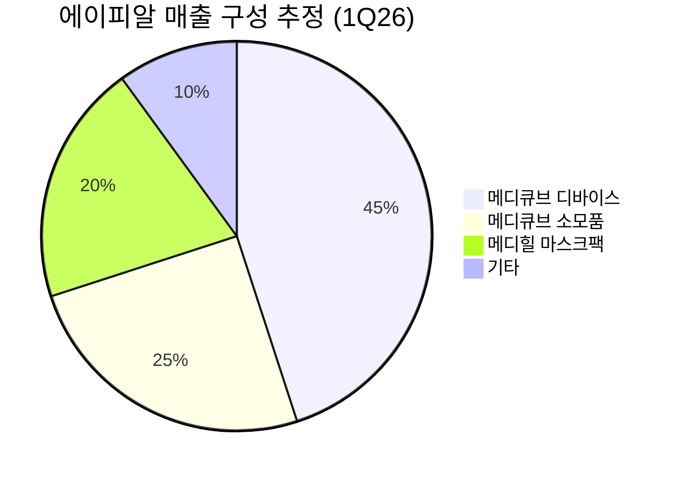
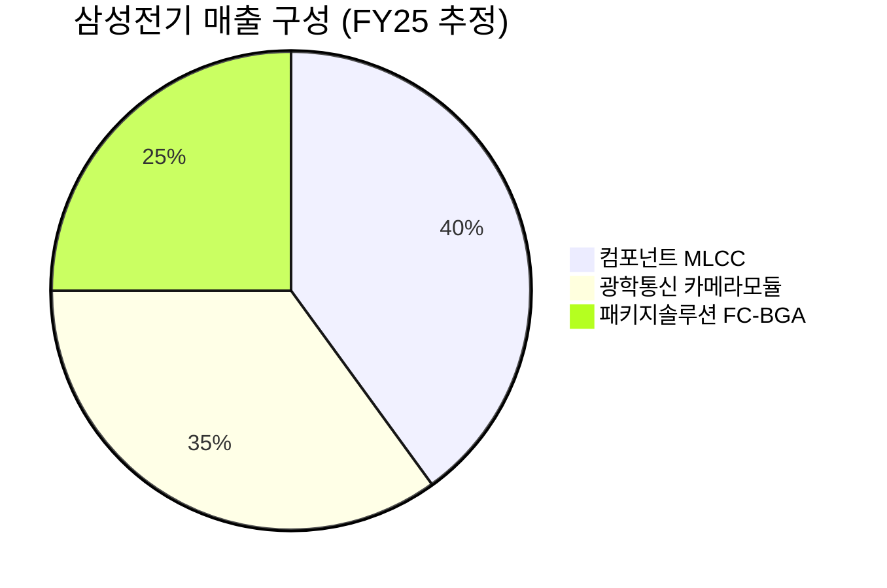

# 🔍 Inflection Scan — 2026-05-18

> [!abstract] 탐색 요약
> 탐색 범위: 2026-05-18 기준 최근 2주 | High Conviction 5건 발견
> 소스: 기업 IR 발표 + 셀사이드 리포트 + 시장 데이터
> **핵심 테마**: AI 인프라 수혜 재편 — 네트워크·부품·발사체 전반의 구조적 변곡점 탐색, 단 "AI"로 재포장된 레거시 narrative 식별이 이번 스캔의 핵심 과제

---

## 시그널 요약 대시보드

| 회사명 | 티커 | 타입 | 핵심 이벤트 | 확신도 | 추천 액션 |
|--------|------|------|------------|:------:|:--------:|
| [[Cisco Systems]] | CSCO | 가이던스상향 | AI 인프라 주문 $50B→$90B 상향, 4Q 가이던스 컨센서스 7~8% 초과 | M | /deep |
| [[Sea Limited]] | SE | 실적가속 | 1Q26 매출 +47% YoY, 주가 +13% 급등, EPS 미달 | M-L | /deep |
| [[에이피알]] | 278470.KS | 실적가속/역발상 | 1Q26 매출 +123% YoY, OP +174% YoY, 분기 최대 실적에도 주가 급락 | M-H | /deal |
| [[삼성전기]] | 009150.KS | 실적가속/구조적 | 5월 주가 +24%, NH 목표가 100만→150만원 상향, AI MLCC+FC-BGA 듀얼 변곡점 | M | /deep |
| [[Rocket Lab USA]] | RKLB | 선행지표/실적가속 | 1Q26 매출 +63% YoY, 수주잔고 $2.2B 최고치, Reddit/FinTwit 동시 관심 급증 | L-M | /deep |

---

## 1. [[Cisco Systems]] (CSCO) — 가이던스상향 / 구조적변곡점

> [!abstract] 요약
> AI 인프라 주문 전망을 $50B→$90B(+80%)로 대폭 상향하며 "AI 네트워킹 플레이어"로의 재평가 시도. 단, $90B는 단년 매출이 아닌 누적 주문(orders) 수치이며 Splunk 백로그 기여분이 혼재 — AI 순수 분해 전까지 thesis 검증 불가.

**사실 →** Cisco는 FQ3(2026) 실적에서 분기 매출 YoY +12% (사상 최고치)를 기록하고, AI 인프라 연간 주문 전망을 $50B에서 $90B로 상향했다 (출처: Cisco IR 2026.5). 4Q 가이던스 $16.7~$16.9B는 컨센서스($15.6B 수준) 대비 7~8% 상회.

**추론 →** 이 $90B 수치의 해석이 thesis의 핵심이다. Cisco의 현행 연매출이 $62~63B 수준임을 감안하면 $90B는 **다년도 누적 백로그(multi-year backlog) 개념**이며, $28B에 인수한 Splunk(연매출 ~$4B)의 보안/관측 소프트웨어 계약과 캠퍼스 네트워킹 갱신 사이클이 상당 부분 포함되었을 가능성이 높다 [Confidence: M | 2차 셀사이드 + 3차 추정]. AI-only fabric 매출이 실제로 분리 공개되지 않는 한, 이 수치를 "AI 인프라 모멘텀"으로 단언하는 것은 시기상조다.

**대안 가설 →** ① AI fabric에서 실질적 share gain (Hyperscaler win 명시 필요) ② Splunk+캠퍼스 갱신의 AI rebrand narrative ③ 두 가지의 혼합으로 실제 AI 비중은 30~40% 수준 [추정].

**채택 사유 →** 4Q 가이던스의 컨센서스 초과는 단기 모멘텀 측면에서 실질적 trigger이나, Arista(PER 40x+)가 AI 네트워킹 1위 선호주로 자리잡은 상황에서 Cisco(PER ~20x)의 디스카운트 해소는 AI share 입증이 선행되어야 한다. Evercore/HSBC가 상향을 지지한 것은 유효 참고 데이터 [출처: 셀사이드 리포트 2026.5].

**유사 사례 →** IBM의 2023~24년 "AI 기업" 전환 시도 — 주가는 6개월 모멘텀 후 AI 매출 실체 의문으로 재평가. Cisco가 같은 함정을 피하려면 hyperscaler-by-hyperscaler 수주 공개가 필요하다.

**Cross-Asset Impact:** KR 영향 — Cisco AI 네트워킹 수주 확대 시 [[한화시스템]], [[쏠리드]] 등 국내 광트랜시버/이더넷 부품 공급망 간접 수혜 가능. 단, 국내 공급망 연결 고리는 3차 추정 수준 [Confidence: L].

🟢 Bull 25%

🟡 Base 50%

🔴 Bear 25%

| 시나리오 | 핵심 조건 | 목표가 [추정] | 업사이드 |
|---|---|---|---|
| 🟢 Bull (25%) | AI fabric share 명시 (hyperscaler win 공개) + PER 28x 재평가 | ~$85 | +40% |
| 🟡 Base (50%) | AI 모멘텀 서사 유지, 순수 AI 분해 미공개, PER 24x | ~$73 | +20% |
| 🔴 Bear (25%) | $90B = Splunk+레거시 rebrand 판명, AI share Arista에 잠식, PER 18x | ~$50 | -18% |

> [!bear] Bear Thesis (Steel-manned Short)
> "Cisco는 NVIDIA Spectrum-X(GPU 묶음 이더넷 판매)와 Arista 7800R3/Etherlink에 AI fabric 시장 주도권을 내주고 있다. $90B는 보안+Splunk+레거시 갱신을 AI로 rebrand한 회계 narrative에 가깝다. Splunk 인수 $28B의 ROI는 아직 미입증이며, 4,000명 구조조정은 성장 회사의 행동이 아니다 — mature 시장의 수익성 방어 시그널."

확신도 45/100

가이던스 신뢰도 62/100

AI 분해 투명성 30/100

> [!warning] 5년 후 이 시그널이 무효가 된다면
> $90B 주문이 실제로는 Splunk+캠퍼스 갱신+다년 백로그 회계 변경의 합산이었고, AI 순수 share는 Arista/NVIDIA Spectrum-X에 구조적으로 잠식 — PER 22x → 18x 디레이팅.

| 항목 | 내용 |
|------|------|
| 시장 | 🇺🇸 NASDAQ |
| 변곡점 유형 | 가이던스상향 / 구조적변곡점 |
| 추천 액션 | **/deep** — $90B 백로그의 AI vs Splunk vs 레거시 분해, Arista 대비 share trajectory 검증이 /deal 전환의 선행 조건 |

---

## 2. [[Sea Limited]] (SE) — 실적가속

> [!abstract] 요약
> 1Q26 매출 +47% YoY의 강력한 가속이나 EPS 미달이 동반 — 매출의 질(driver)이 불명확한 상태에서 TikTok Shop 경쟁, SeaMoney 신용 사이클 리스크가 thesis의 핵심 변수. 세그먼트 분해 없이 신호 강도 평가 불가.

**사실 →** Sea Limited는 1Q26 매출 기준 YoY +47% 성장을 기록했으며, 주가는 발표 후 +13% 급등했다 [출처: Sea Limited IR 2026.5]. 다만 EPS는 컨센서스를 미달했다.

**추론 →** +47% 성장의 driver를 세 세그먼트로 분해해야 thesis의 질을 평가할 수 있다. ① **Shopee(e커머스, 매출 비중 ~55% 추정)** — TikTok Shop이 2024년 인도네시아·베트남 GMV +85% YoY(Shopee +20% 대비) 속도로 추격 중. Shopee 광고 수익화율 상승이 진짜 driver인지, 거래액 단순 가속인지 구분 필수. ② **SeaMoney(핀테크, ~15% 추정)** — 대출 포트폴리오 급팽창이 driver라면 NPL(부실채권) 리스크 누적. 동남아 consumer credit은 2024~25년 호황 후 사이클 후반. ③ **Garena(게임, ~15% 추정)** — Free Fire 신작/인도 재진입 효과라면 다음 분기 mean reversion 가능 [Confidence: M-L | 3차 추정 — 회사 공개 분해 없음].

**대안 가설 →** ① SeaMoney 수익화 가속이 진짜 변곡점 (GARP 구간 진입) ② TikTok Shop에 GMV share를 내주는 가운데 광고 단가만 상승하는 일시적 효과 ③ Garena 신작 + Shopee 복합 — 지속성 낮음.

**채택 사유 →** EPS 미달은 가볍게 넘길 수 없다. 매출 +47% 가속에도 EPS가 컨센서스를 하회했다는 것은 (a) SeaMoney 충당금 선반영, (b) Shopee 물류/광고 투자 가속, (c) Garena 수익성 하락 중 적어도 하나가 작동 중임을 의미하며, 세 가지 모두 thesis 품질에 의문을 제기한다.

**유사 사례 →** MercadoLibre 2022~23년 패턴 비유가 자주 등장하나, MELI는 라틴아메리카 단일 권역 dominant(Mercado Pago + 이커머스 압도) 구조였던 반면, Sea는 TikTok Shop과의 active 경쟁 + Garena 구조적 하락을 동시 부담. 벤치마크로서 유효성 낮음.

**Cross-Asset Impact:** KR 영향 — Sea 성장 가속 시 동남아 디지털 광고/물류 인프라 공급망 수혜 가능성 있으나 직접 연결 고리 불명확. 동남아 소비재 ETF(예: ASEAN 관련 상품) 간접 참고.

🟢 Bull 25%

🟡 Base 45%

🔴 Bear 30%

| 시나리오 | 핵심 조건 | 업사이드 [추정] |
|---|---|---|
| 🟢 Bull (25%) | SeaMoney 수익화 가속 + Shopee 광고 단가 상승 + TikTok Shop 방어 성공 | +50~70% |
| 🟡 Base (45%) | 매출 성장 35~40% 유지, EPS 흑자 회복, Shopee/SeaMoney 혼재 | +15~30% |
| 🔴 Bear (30%) | SeaMoney NPL 급증 + TikTok Shop GMV share 잠식 + Garena mean reversion | -30~40% |

> [!bear] Bear Thesis (Steel-manned Short)
> "TikTok Shop이 동남아 GMV share를 분기마다 잠식 중(2024 +85% YoY vs Shopee +20%). Garena는 Free Fire 의존도 70%+로 구조적 사양 사업. SeaMoney의 +50%+ 대출 성장은 신용 평가 기준 완화 신호 — 2026 하반기 충당금 급증 시 매출 +47% 가속의 '품질'이 시장에서 재평가되면서 주가는 2021~22년 false breakout 패턴 재현."

확신도 40/100

세그먼트 분해 가시성 35/100

매출 성장 모멘텀 55/100

> [!question] 검토 필요
> TikTok Shop vs Shopee GMV share 데이터, SeaMoney NPL 추이, Garena 신작 vs 구작 매출 분해 — 이 세 가지가 확인되기 전까지 thesis 등급 상향 불가.

> [!warning] 5년 후 이 시그널이 무효가 된다면
> SeaMoney가 동남아 micro-lending 거품의 후반부에 올라탔고, TikTok Shop이 Shopee GMV를 구조적으로 잠식 — 두 주요 세그먼트가 동시 역풍을 맞는 시나리오.

| 항목 | 내용 |
|------|------|
| 시장 | 🇺🇸 NYSE |
| 변곡점 유형 | 실적가속 |
| 추천 액션 | **/deep** — 세그먼트별 매출/마진 분해 + SeaMoney NPL 추이 + Shopee vs TikTok Shop GMV share 데이터 확보 후 deal 진입 여부 재판단 |

---

## 3. [[에이피알]] (278470.KS) — 실적가속 / 역발상기회

> [!abstract] 요약
> 분기 역대 최대 실적(매출 +123%, OP +174%)에도 주가 급락 — 화장품 섹터 약세와의 디커플링이 역발상 매수 기회를 시사. 메디큐브 디바이스+소모품 구독 모델의 고마진 구조가 핵심 thesis. 단, 2Q26 성장률 lap 효과 감속 가능성이 포지션 규모의 결정 변수.

**사실 →** 에이피알의 1Q26 매출은 5,934억원(YoY +123%), 영업이익 1,523억원(YoY +173.7%), OPM ~25.7%로 분기 역대 최대치를 기록했다 (출처: 에이피알 IR 2026.5). 실적 발표 후 주가는 화장품 섹터 약세와 동반 급락.

**추론 →** +123% YoY의 driver는 **메디큐브 뷰티 디바이스(고마진) + 전용 소모품(패드/세럼)의 반복 매출 구조**가 핵심이다. 미국 시장 진입 첫 full year 효과가 base effect의 일부를 구성하고 있어, 2Q26부터 자연 감속(+50~60% 수준으로 normalize)이 예상된다. 이는 여전히 탁월한 성장률이나, "두 배 성장" narrative가 깨질 경우 multiple 압축이 발생할 수 있다. OPM 25.7%는 한국 화장품 기업 기준 최상위권으로, 광고비 deleveraging 효과인지 구조적 margin expansion인지 구분이 필요하다 [Confidence: M | 1차 IR + 2차 셀사이드].

**대안 가설 →** ① 미국 침투 후 유럽 추가 확장 = 멀티년 성장 runway 확보 ② 미국 base effect가 해소되며 2Q26~3Q26 감속 + 유럽 진출 비용으로 double pressure ③ Amazon 채널에서 중국 OEM 카피 제품 가격 경쟁 본격화.

**채택 사유 →** 셀사이드 목표주가 50~54만원 vs 현재 ~40만원대 = 약 25% 정량 gap이 명확하며, "역대 최대 실적 + 주가 하락" 패턴은 한국 화장품 섹터에서 회복 확률이 역사적으로 높다 [출처: NH투자증권/키움증권 리포트 2026.5, 확인 필요]. 뷰티 테크 플랫폼(디바이스 + 소모품 구독)이라는 프레이밍은 셀사이드가 아직 충분히 반영하지 못한 밸류에이션 re-rate 근거.

**유사 사례 →** 아이오페/닥터자르트의 미국 채널 성공 후 유럽 확장은 진입 비용이 먼저 반영된 뒤 가속 구간이 왔다. 메디큐브는 디바이스 카테고리여서 브랜드 방어력이 더 높으나 규제(CE 인증, 의료기기 심사) 변수가 추가.

**Cross-Asset Impact:** US 영향 — K-Beauty/뷰티 테크 트렌드는 미국 상장 ELF Beauty([[ELF]]), [[Coty]] 등의 경쟁 심화 narrative로 연결. 직접 재무 영향은 제한적이나 섹터 sentiment 공유.

> [!success] 강점
> ① OPM 25.7% — 한국 화장품 기업 최상위권, 디바이스+소모품 믹스가 구조적 지지 ② 셀사이드 목표가 50~54만원 vs 현재 ~40만원대 = 명확한 정량 업사이드 ③ 실적과 주가의 디커플링 = 섹터 약세 편승 진입 타이밍

> [!warning] 리스크 경고
> ① **2Q26 성장률 감속** — 미국 base effect lap 으로 +50~60% normalize 시 "두 배 성장" narrative 붕괴 ② 유럽 진출 초기 마케팅비 + CE/의료기기 규제 비용으로 OPM 25% → 18~20% 일시 압축 가능 ③ Amazon에서 중국 OEM 카피 디바이스 등장 시 가격 경쟁

🟢 Bull 30%

🟡 Base 45%

🔴 Bear 25%

| 시나리오 | 핵심 조건 | 목표가 [추정] | 업사이드 |
|---|---|---|---|
| 🟢 Bull (30%) | 유럽 진출 성공 + 미국 성장 +60%+ 유지 + OPM 23%+ 방어 | 60~65만원 | +50~60% |
| 🟡 Base (45%) | 성장률 +50~60% normalize, OPM 20~23%, 셀사이드 목표가 수렴 | 50~54만원 | +25% |
| 🔴 Bear (25%) | 미국 base effect 감속 + 유럽 비용 증가 + OPM 18% 압축 | 30~35만원 | -15~25% |

> [!bear] Bear Thesis (Steel-manned Short)
> "한국 DTC 화장품/디바이스의 미국 성공 후 유럽 진출 hit rate는 낮다(클리오, 닥터자르트 초기 사례). 메디큐브 디바이스는 가전 카테고리 — Amazon에서 중국 OEM 카피 출현 시 가격 경쟁 불가피. OPM 25%는 마케팅비 일시 deleveraging일 수 있어 광고비 정상화 + 유럽 진출 비용 시 18~20%로 급속 회귀. 주가 급락은 '매수 기회'가 아닌 '성장 지속성 의심'의 선행 신호."

확신도 55/100

실적 데이터 신뢰도 72/100

유럽 확장 성공 가시성 60/100

> [!warning] 5년 후 이 시그널이 무효가 된다면
> 미국 base effect 감속이 "구조적 변곡점"이 아닌 "일회성 침투 효과"로 판명되고, 유럽 진출 비용 부담이 수년간 OPM을 잠식 — 뷰티 테크 플랫폼 re-rate 실패.

| 항목 | 내용 |
|------|------|
| 시장 | 🇰🇷 코스피 |
| 변곡점 유형 | 실적가속 / 역발상기회 |
| 추천 액션 | **/deal** — 분할 진입 권장. 2Q26 실적에서 성장률 lap 효과 확인 + 유럽 초기 마케팅비 가이던스가 포지션 확대/축소 trigger |

---

## 4. [[삼성전기]] (009150.KS) — 실적가속 / 구조적변곡점

> [!abstract] 요약
> 5월 주가 +24% 급등 후 황제주 진입. 단순 "AI MLCC 수혜"가 아닌 **MLCC + FC-BGA 듀얼 변곡점**이 진짜 thesis. 이미 급등으로 thesis 일부 가격 반영 — 진입 타이밍이 수익률의 핵심 변수.

**사실 →** 삼성전기 주가는 5월 들어 +24% 급등하며 황제주(100만원+) 구간에 진입했다. NH투자증권은 목표주가를 100만원에서 150만원으로 상향했다 [출처: NH투자증권 리포트 2026.5, 확인 필요]. AI 서버 1대당 MLCC ~3,000개 소요(일반 서버 10배)는 업계 통용 ballpark 수치 [Confidence: H | 업계 spec].

**추론 →** Thesis를 MLCC 단독으로 프레이밍하면 약점이 노출된다 — 무라타제작소가 글로벌 MLCC share 60%+를 유지 중이고, 삼성전기의 AI MLCC 매출 비중은 회사가 명시적으로 공개하지 않는다 [Confidence: L | 3차 추정]. 진짜 차별화는 **두 번째 축인 FC-BGA(FC-볼그리드어레이 기판)**에 있다 — NVIDIA/AMD GPU 패키지용 대면적 FC-BGA에서 삼성전기 부산 신공장 양산이 2025~26년 본격화되면서 이비덴·신코덴키와의 share 경쟁에 진입. NH 목표가 150만원의 +50% 상향은 MLCC+FC-BGA 합산 effect를 반영한 것으로 해석된다.

**대안 가설 →** ① MLCC+FC-BGA 듀얼 변곡점 = 구조적 re-rate 근거 ② 무라타 capa 증설로 AI MLCC ASP 인상 폭 둔화 + 스마트폰 부문 구조적 약세로 상쇄 ③ 황제주 진입 후 차익실현 매물로 단기 -15~20% 조정.

**채택 사유 →** 변곡점 자체는 유효하나 **이미 +24% 급등은 thesis의 40~50%를 가격에 반영**한 상태다. 후행 추격 진입의 기대 수익률은 크게 낮아진다. 2Q26 실적에서 FC-BGA 매출 기여 가시화 + AI MLCC ASP 추이가 확인되어야 추가 re-rate이 가능하다.

**유사 사례 →** 무라타제작소는 2021년 5G MLCC 수혜 narrative로 황제주 진입 후 6개월 내 -25% 조정 경험. 삼성전기는 2016~17년 MLCC 수퍼사이클 당시 6개월 +80% 상승 후 -40% 하락 전례.

**Cross-Asset Impact:** US 영향 — AI 서버 MLCC/FC-BGA 수요 확대는 [[Murata Manufacturing]](6981.T), [[TDK]](6762.T), [[TTM Technologies]] 등의 동종 섹터에 positive signal. MLCC 공급 과잉 시 반대로 전체 섹터 de-rating.

> [!tip] 핵심 인사이트
> Thesis 재프레이밍 필수: **"AI MLCC 단독 수혜"가 아닌 "MLCC + FC-BGA 듀얼 변곡점"**. FC-BGA 부산 신공장 양산 기여 가시화가 next catalyst이며, 이것이 셀사이드 목표가 150만원의 실질 근거.

> [!warning] 리스크 경고
> ① +24% 급등으로 thesis 부분 가격 반영 — 현 시점 추격 매수는 기대 수익률 대비 리스크 불리 ② 무라타 AI MLCC capa 증설로 ASP 인상 폭 둔화 가능성 ③ 스마트폰 카메라모듈 부문(매출 35%) 구조적 약세 지속이 전체 실적 희석

🟢 Bull 25%

🟡 Base 50%

🔴 Bear 25%

| 시나리오 | 핵심 조건 | 목표가 [추정] | 업사이드 |
|---|---|---|---|
| 🟢 Bull (25%) | FC-BGA 수율 개선 + AI MLCC ASP +10%+ 유지 + PER 28x | 160~170만원 | +55~65% |
| 🟡 Base (50%) | AI MLCC 성장 + FC-BGA 양산 본격화 + NH 목표가 수렴 | 130~150만원 | +25~45% |
| 🔴 Bear (25%) | 무라타 capa 증설로 ASP 둔화 + 스마트폰 부문 약세 + 차익실현 | 85~90만원 | -15~20% |

> [!bear] Bear Thesis (Steel-manned Short)
> "황제주 진입은 종종 차익실현 압력의 trigger다. 무라타가 AI MLCC share 60%+를 유지 중이며 삼성전기의 share gain은 아직 데이터로 미입증. FC-BGA는 이비덴·AT&S와의 경쟁에서 초기 수율 이슈가 반복되는 카테고리. 스마트폰 카메라모듈(매출 35%)의 구조적 약세는 즉각적 실적 희석 요인이며, '황제주'라는 심리적 가격대에서의 포지션 진입은 기대 수익률이 가장 낮은 시점."

확신도 45/100

MLCC+FC-BGA 듀얼 thesis 강도 60/100

현 시점 진입 타이밍 35/100

> [!warning] 5년 후 이 시그널이 무효가 된다면
> 무라타가 AI MLCC 고용량 카테고리 압도적 share를 유지하고, FC-BGA에서 이비덴이 기술 격차를 벌리며 삼성전기는 "AI 부품 수혜"가 아닌 "스마트폰 부품 mature 기업"으로 재평가 — PER 디레이팅.

| 항목 | 내용 |
|------|------|
| 시장 | 🇰🇷 코스피 |
| 변곡점 유형 | 실적가속 / 구조적변곡점 |
| 추천 액션 | **/deep** — FC-BGA 매출 분해 + 무라타 capa 증설 ASP 영향 + 단기 조정(-10~15%) 대기 or 2Q26 실적 확인 후 분할 진입 시점 분석 |

---

## 5. [[Rocket Lab USA]] (RKLB) — 선행지표 / 실적가속

> [!abstract] 요약
> 매출 +63% YoY, 수주잔고 $2.2B로 표면적 강세이나 — EPS 5년 연속 적자, Neutron 개발 지연 반복, Reddit/FinTwit 동시 관심 급증은 구조적 변곡점보다 **retail-driven 모멘텀 트레이드** 신호에 가깝다. 5개 시그널 중 확신도 최저.

**사실 →** Rocket Lab 1Q26 매출은 $200M(YoY +63%)로 컨센서스를 상회했으며, 수주잔고는 $2.2B으로 사상 최고치를 기록했다 [출처: Rocket Lab IR 2026.5]. EPS는 적자 지속.

**추론 →** 매출 +63% 중 **Space Systems(위성 부품/플랫폼) 부문이 ~70% 기여**로 추정되며, 이는 반복 계약 구조로 마진 안정성이 Electron 발사 서비스(lumpy)보다 우수하다 [Confidence: M | 2차 셀사이드]. 그러나 세 가지 hard challenge가 thesis 격상을 막는다: ① EPS 5년 연속 적자 + 주식 발행을 통한 자본 희석 연 8%+ ② Neutron 중형 발사체 첫 발사가 매년 1년씩 슬립 중 (현재 목표 2026 하반기, 실현 가능성 낮음 [추정]) ③ SpaceX Falcon 9 rideshare($1M/payload) 대비 Electron($7~8M/발사)의 비용 열위.

**대안 가설 →** ① Space Systems의 구조적 성장이 실질 변곡점 — 우주 인프라 SaaS 유사 모델로 전환 ② Neutron 계약 선행 수주가 $2.2B 백로그에 포함 — 장기 성장 trigger ③ Reddit/FinTwit 관심 = 단기 retail 유입 후 mean reversion.

**채택 사유 →** Reddit/FinTwit 동시 관심 급증을 "변곡점 신호"로 격상한 것이 이 시그널의 가장 큰 약점이다. 우주 섹터는 retail 주도 변동성이 -50~+100% 빈번하며, 이 패턴은 구조적 thesis가 아닌 모멘텀 트레이드의 특성이다. 수주잔고 $2.2B의 매출 인식까지 평균 2~3년이 소요된다는 점도 현재 주가 프리미엄의 근거로 약하다 [Confidence: M | 1차 IR 추정].

**유사 사례 →** Virgin Galactic(SPCE) 2021년 retail 관심 급증 후 -95% 하락. AST SpaceMobile(ASTS) 2024년 retail 급등 후 -60% 조정. 우주 섹터 retail 모멘텀의 역사적 mean reversion 확률 높음. 단, Rocket Lab은 SPCE/ASTS와 달리 실제 매출(+63%)이 존재한다는 점에서 차별화.

**Cross-Asset Impact:** KR 영향 — 국내 우주 발사체 관련주([[한화에어로스페이스]], [[LIG넥스원]])는 독립적 국내 정책(누리호 후속) 주도로 RKLB와 직접 연동 낮음. 글로벌 소형 위성 발사 경쟁 심화 narrative는 간접 참고.

🟢 Bull 20%

🟡 Base 45%

🔴 Bear 35%

| 시나리오 | 핵심 조건 | 업사이드 [추정] |
|---|---|---|
| 🟢 Bull (20%) | Neutron 첫 발사 성공(2026 하반기) + 정부 대형 계약 수주 + EPS 흑자 전환 가시화 | +80~100% |
| 🟡 Base (45%) | Space Systems 지속 성장 + Electron 안정화 + Neutron 2027 슬립 | +10~20% |
| 🔴 Bear (35%) | Neutron 2027+ 추가 슬립 + SpaceX rideshare 가격 인하 + retail 차익실현 | -40~50% |

> [!bear] Bear Thesis (Steel-manned Short)
> "Rocket Lab은 항상 'next year의 회사'다 — Neutron, EPS 흑자 전환, 대형 정부 계약이 항상 12~18개월 후로 이동한다. 수주잔고 $2.2B는 매출 인식까지 2~3년이 걸리는 장기 백로그이며, 연 8%+ 주식 희석률이 장기 주주가치를 잠식. SpaceX Falcon 9 rideshare의 $1M/payload 가격은 Electron의 경제성을 구조적으로 압박하고, Reddit/FinTwit 동시 관심 급증은 역사적으로 우주 섹터 단기 고점의 선행 지표였다."

확신도 35/100

매출 성장 지속성 63/100

EPS 흑자 전환 가시성 25/100

> [!question] 검토 필요
> Neutron 개발 현황 최신 업데이트(발사 예정일, FAA 허가 진행도), Space Systems 부문의 반복 계약 vs 일회성 계약 비율, 연간 주식 희석률 정확한 수치 — 이 세 가지가 thesis 등급 결정의 핵심.

> [!warning] 5년 후 이 시그널이 무효가 된다면
> Neutron이 2028+로 추가 슬립하고 SpaceX rideshare 가격 인하가 Electron 시장을 구조적으로 잠식 — "소형 발사체 전문 기업"의 TAM이 예상보다 빠르게 축소.

| 항목 | 내용 |
|------|------|
| 시장 | 🇺🇸 NASDAQ |
| 변곡점 유형 | 선행지표 / 실적가속 |
| 추천 액션 | **/deep** — Space Systems 부문 반복 계약 구조 분석 + Neutron 개발 타임라인 검증 + retail 모멘텀 vs 구조적 변곡점 구분이 선행. 현 시점 포지션 진입 권장하지 않음 |

---

## 📊 섹터 메타 시그널

### AI 인프라 밸류체인 — 수혜 재편 중

> [!note] 참고
> 이번 스캔의 5개 시그널 중 4개(CSCO, 삼성전기, RKLB, Sea 간접)가 AI 인프라 수혜 thesis와 연결된다. 그러나 **"AI 수혜"로 포장된 시그널과 실질적 AI 매출이 발생하는 시그널을 구분하는 것이 2026년 상반기 분석의 핵심 과제**로 부상하고 있다.

AI 인프라 투자 사이클에서 수혜 위계를 정리하면: **1차 수혜(직접 매출 확인)** — NVIDIA GPU, TSMC, Arista(AI 네트워킹), HBM 3종(SK하이닉스 등) / **2차 수혜(진입 중)** — Cisco(AI 네트워킹 재편 시도), 삼성전기(AI MLCC+FC-BGA) / **3차 수혜(narrative 주도)** — Rocket Lab(우주 AI 인프라 간접), Sea(동남아 AI 디지털 전환 간접). 이번 스캔에서 확인된 것은, 2차 수혜 플레이어들이 AI 진입을 시도하고 있으나 **share gain의 실증 데이터 없이 narrative만 선행**하는 리스크가 공통적으로 존재한다는 점이다. Cisco의 $90B 백로그 분해, 삼성전기의 FC-BGA 양산 기여 공개가 각각 thesis 검증의 분수령이 될 것이다.

⚠️ <strong>공통 리스크</strong>: 5개 시그널 모두 "AI 인프라 → 매출/이익 가속"의 논리가 작동하나, 에이피알을 제외한 4개는 AI 매출 분해 데이터가 불충분. 2Q26 실적 시즌(2026년 7~8월)이 thesis 검증의 일제 시험대가 된다.

| 수혜 위계 | 종목 | 데이터 가시성 | 현재 판단 |
|---|---|---|---|
| 1차 직접 수혜 | NVIDIA, Arista, SK하이닉스 | 🟢 높음 | 이미 가격 반영 |
| 2차 진입 중 | CSCO, 삼성전기 | 🟡 부분 | 분해 데이터 확인 필요 |
| 3차 narrative | RKLB, SE | 🔴 낮음 | 구조적 변곡점 미확인 |
| 역발상 실적 | 에이피알 | 🟢 높음 | 실적 명확, 진입 타이밍 유효 |