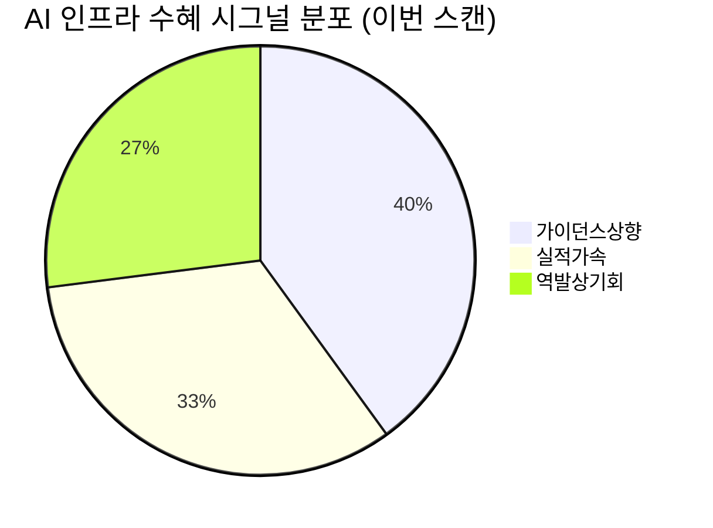

# 🔍 Inflection Scan — 2026-05-19

> [!abstract] 탐색 요약
> 탐색 범위: 2026-05-19 기준 최근 2주 | High Conviction 6건 발견
> 소스: 1차 IR 실적발표 + 셀사이드 리포트 + 시장 뉴스플로우
> **핵심 테마**: AI 인프라 수요 가시화 → 네트워킹·클라우드·반도체 장비 가이던스 급상향; 레거시 공급 공백 역발상 수혜 구조화

---

## 시그널 요약 대시보드

| 회사명 | 티커 | 타입 | 핵심 이벤트 | 확신도 | 추천 액션 |
|--------|------|------|------------|:------:|:--------:|
| [[Cisco Systems]] | CSCO | 가이던스상향 | AI 주문 $50B→$90B(+80%), 하이퍼스케일러 AI 매출 $30B→$40B | 🟡 P=0.52 | /deal |
| [[Applied Materials]] | AMAT | 가이던스상향 | 산업 성장률 전망 20%+→30%+(+50%), 사상 최고 분기 실적 | 🟡 P=0.50 | /deal (헤지 병행) |
| [[Intuitive Machines]] | LUNR | 실적가속 | Q1 2026 매출 YoY +199%, 수주잔고 $1.1B 돌파 | 🔴 P=0.35 | /deep |
| [[Alphabet Inc.]] | GOOGL | 실적가속 | Q1 2026 Cloud +63%(재가속), 전체 매출 +22%(4년 최고), EPS +82% | 🟢 P=0.58 | /deal |
| [[난야테크놀로지]] | 2408.TW | 역발상 | 3월 매출 YoY +560%, 레거시 DRAM 공급 병목 수혜 | 🔴 P=0.40 | /deep |
| [[대주전자재료]] | 078600.KQ | 역발상 | Q1 2026 매출 컨센서스 +26% 서프라이즈, 도전재료 YoY +156% | 🟡 P=0.48 | /deal (소형) |

---

## 1. [[Cisco Systems]] (CSCO) — 가이던스상향

**시그널**: AI 네트워크 주문 $50B→$90B(+80%) 상향, 하이퍼스케일러 AI 매출 FY2026 $30B→$40B, FY2027 $60B 로드맵 제시

> [!abstract] 핵심 요약
> AI 클러스터의 InfiniBand→이더넷 전환이 가시화되며 시스코 AI 수주 파이프라인이 폭발적으로 증가. 단 $90B은 누적 주문(orders) 기준이며 실제 매출 인식은 12~24개월 분산. FY26 EPS 임팩트는 제한적이나 FY27~28 성장 경로가 처음으로 명확해진 전환점.

**사실 → 추론 → 대안 가설 → 채택 사유**

*사실*: 시스코는 Q3 FY2026 실적발표에서 AI 네트워크 주문 누적 가이던스를 $50B에서 $90B으로 80% 상향했다 (출처: Cisco Q3 FY2026 실적발표). 총 제품 주문 YoY +35%, 클라우드+서비스 주문 YoY +105%를 기록했으며, 로젠블랫·BofA·HSBC 등 다수 기관이 목표가를 $150 수준으로 상향했다 [출처: 2차 셀사이드, Confidence: M].

*추론*: 하이퍼스케일러의 AI 클러스터가 InfiniBand 의존도를 줄이고 800G 이더넷으로 전환하는 구조적 흐름의 직접 수혜다. 클라우드 주문 YoY +105%는 단순 경기 사이클이 아닌 구조적 물량 확대를 시사하며, 이것이 6~12개월 후 매출로 전환될 백로그의 폭발적 누적을 의미한다.

*대안 가설*: $90B 주문은 마케팅 헤드라인일 뿐이며 매출 인식 분산(12~24개월)으로 FY26 실제 AI 매출은 $5~8B(전체 매출의 10% 미만)에 불과 — 실제 EPS 임팩트는 FY27 이후.

*채택 사유*: 대안 가설이 부분적으로 유효하나, FY2026 $40B·FY2027 $60B 로드맵은 경영진이 수주 파이프라인을 직접 확인한 상태에서 제시한 수치다. 레거시 매출 비중 70%+로 인한 희석 효과는 존재하나, AI 매출 가속이 레거시 감소분을 상쇄하기 시작한 첫 분기라는 점이 변곡점.

유사 사례: Arista Networks가 2023년 AI 하이퍼스케일러 수주 가시화 후 12개월 주가 +75% (단 Arista는 순수 AI 이더넷 플레이어로 시작 PER이 달랐음). 시스코는 레거시 비중으로 희석되므로 조정 기대 수익률은 Arista 대비 30~40% 낮게 잡는 것이 합리적.

🟢 Bull 30%

🟡 Base 45%

🔴 Bear 25%

| 시나리오 | 핵심 가정 | 12M 목표가 | 업사이드 |
|---|---|---|---|
| 🟢 Bull (30%) | AI 이더넷 전환 가속, FY27 $60B 로드맵 달성, Arista 대비 share 유지 | $155~170 | +35~+48% |
| 🟡 Base (45%) | AI 주문 $90B 달성, 매출 인식 점진적 전환, 엔터프라이즈 보합 | $130~140 | +13~+22% |
| 🔴 Bear (25%) | **Steel-manned short**: UEC 표준화로 화이트박스 ODM(Celestica, Wiwynn)·Arista가 하이퍼스케일러 물량 70%+ 점유, 매출 인식 추가 지연, PER 18배 하향 | $90~105 | -12~-22% |

Conviction 52/100

AI 주문 파이프라인 가시성 65/100

레거시 희석·매출인식 리스크 40/100 (낮을수록 위험)

> [!warning] 5년 후 이 시그널이 무효가 된다면
> UEC(Ultra Ethernet Consortium) 표준화로 화이트박스 ODM이 하이퍼스케일러 AI 물량의 70%+를 점유하고, 시스코는 엔터프라이즈 잔여 물량에 머무는 시나리오.

> [!note] Cross-Asset 영향
> CSCO 가이던스상향 → [[Arista Networks]](ANET) 이더넷 스위치 경쟁 격화 주목. KR: [[삼성전자]]·[[SK하이닉스]] HBM 공급망과 교차점 없으나, 하이퍼스케일러 CapEx 확대 확인 → [[한미반도체]]·[[HPSP]] 낙수 효과 간접 긍정.

| 항목 | 내용 |
|------|------|
| 시장 | 🇺🇸 NASDAQ |
| 변곡점 유형 | 가이던스상향 |
| 추천 액션 | /deal — 단 13% 단기 급등 후 진입 시 FY2027 EPS 가시성 확인 필수. AGS 백로그 전환율과 Arista 분기 점유율 동시 모니터링. |

---

## 2. [[Applied Materials]] (AMAT) — 가이던스상향

**시그널**: 반도체 장비 산업 성장률 전망 20%+→30%+(+50% 상향), AGS 서비스 성장 목표 '두 자릿수 초반'→'10% 중반'으로 상향, 사상 최고 분기 실적 달성

> [!abstract] 핵심 요약
> HBM 생산 CapEx(삼성·하이닉스), TSMC N2 첨단 로직 CapEx, AI 가동률 상승이 3중 견인. AGS 리커링 수익 가속이 진짜 밸류에이션 재평가 트리거. 단 중국 매출 ~35% 비중이 최대 리스크 변수.

**사실 → 추론 → 대안 가설 → 채택 사유**

*사실*: AMAT는 Q2 FY2026 실적발표에서 반도체 장비 산업 성장률 전망을 20%+에서 30%+로 상향했다 (출처: AMAT Q2 FY2026 실적발표). DB증권 $550, Cantor $575, UBS $515로 목표가를 상향했으며 [출처: 2차 셀사이드, Confidence: M], Morgan Stanley는 주가 선반영을 이유로 하향했다.

*추론*: 산업 성장률 30%+ 제시는 경영진이 TSMC N2, SK하이닉스 HBM4, 삼성 게이트올어라운드(GAA) 등 주요 고객의 2026년 전체 수주 파이프라인을 확인한 상태에서 나온 수치다. 특히 AGS(장비 서비스) 성장 목표 상향은 설치 베이스(installed base) 기반 리커링 수익이 구조적으로 가속되고 있음을 의미하며, OPM 확장을 동반한다는 점에서 단순 사이클형 가이던스 상향보다 밸류에이션 프리미엄이 정당화된다.

*대안 가설*: 30%+ 성장률 가이던스는 HBM CapEx 정점(2026 하반기 SK하이닉스 발주 둔화 가능성)과 맞물려 2026 하반기에 하향될 수 있다. 현 PER ~25배는 2021 업사이클 시작 시점(PER 15~18배) 대비 멀티플 확장 여지가 제한적.

*채택 사유*: AGS 리커링 가속은 사이클 정점 이후에도 수익 방어력을 제공하는 구조적 차별화다. 단 중국 매출 ~35% 비중이라는 정량적 리스크는 thesis의 가장 큰 취약점으로 헤지 없이 풀사이즈 포지션은 부적절.

**핵심 리스크 정량화:**

| 리스크 요인 | 규모 | 시나리오 |
|---|---|---|
| 중국 BIS 추가 제재 | 매출 $5~7B(전체 18~22%) 즉시 위협 | 확률 25~30% |
| HBM CapEx 정점 | 2026 하반기 발주 둔화 가능성 | 확률 20~25% |
| 주가 선반영 (MS 하향) | 멀티플 확장 제한 | PER 25→20배 시 -20% |

🟢 Bull 25%

🟡 Base 45%

🔴 Bear 30%

| 시나리오 | 핵심 가정 | 12M 목표가 | 업사이드 |
|---|---|---|---|
| 🟢 Bull (25%) | 산업 30%+ 달성, 중국 제재 유예, AGS mid-teens 유지, OPM 확장 | $560~600 | +20~+28% |
| 🟡 Base (45%) | 산업 25~30% 달성, 중국 현상 유지, AGS 리커링 가속 | $480~520 | +3~+11% |
| 🔴 Bear (30%) | **Steel-manned short**: BIS 추가 제재 발동으로 중국 매출 $5~7B 소멸. HBM CapEx 정점 후 발주 둔화. AGS 성장만으로는 방어 불가. PER 20배 하향 | $350~380 | -25~-33% |

Conviction 50/100

AGS 리커링 구조 강도 72/100

중국 리스크 헤지 충분성 35/100 (낮을수록 위험)

> [!warning] 5년 후 이 시그널이 무효가 된다면
> CXMT 등 중국 내 장비 내재화 가속 + BIS 추가 제재로 중국 매출 $5~7B 소멸, 동시에 TSMC 이후 공정 미세화 속도 둔화로 장비당 capital intensity 감소.

> [!note] Cross-Asset 영향
> AMAT 가이던스상향 → [[ASML]]·[[Lam Research]]·[[KLA Corporation]] 동반 수혜 확인 필요. KR: [[삼성전자]] 반도체 CapEx 확대 시 [[원익IPS]]·[[피에스케이홀딩스]] 간접 수혜. 원/달러 환율 상승(원화 약세) 시 수출 비중 높은 KR 장비사 환차익 추가.

| 항목 | 내용 |
|------|------|
| 시장 | 🇺🇸 NASDAQ |
| 변곡점 유형 | 가이던스상향 |
| 추천 액션 | /deal — Morgan Stanley 하향으로 단기 약세 시 진입 기회. **포지션 크기는 중국 리스크 헤지(SOX 인버스 또는 KLAC pair)와 함께** 검토. AGS 리커링 가속이 핵심 thesis. |

---

## 3. [[Intuitive Machines]] (LUNR) — 실적가속

**시그널**: Q1 2026 매출 $186.7M으로 YoY +199%, 수주잔고 $1.105B 돌파, 연간 가이던스 상향

> [!abstract] 핵심 요약
> 달 착륙 일회성 이벤트에서 NASA NSN 궤도 데이터 릴레이 리커링 서비스로 비즈니스 모델 전환 가능성이 핵심. 단 NSN은 IDIQ 구조로 명목 수주잔고와 실제 매출 인식 사이 갭이 크며, 흑자 전환 전 추가 자본 조달 리스크 높음. 6개 시그널 중 **리스크/리워드 비율이 가장 불리**.

**사실 → 추론 → 대안 가설 → 채택 사유**

*사실*: LUNR은 Q1 2026 실적에서 매출 $186.7M(YoY +199%)을 기록했으며 수주잔고는 $1.105B으로 증가했다 (출처: LUNR Q1 2026 실적발표). Canaccord가 목표가를 $24→$41로 71% 상향했다 [출처: Canaccord 리포트, 단일 소스, Confidence: L-M].

*추론*: Q1 매출의 상당 부분은 IM-2 미션 마일스톤 완료에 따른 인식이 포함된 일회성 요소다. 그러나 NSN(Near Space Network) 계약이 본격 task order 발주로 전환되기 시작하면, 비즈니스 모델이 달 착륙 프로젝트 기반에서 궤도 통신 인프라 리커링 서비스로 진화할 수 있다.

*대안 가설*: NSN 최대 $4.8B 계약은 **IDIQ(Indefinite Delivery/Indefinite Quantity)** 구조로 실제 task order 발주 없이는 매출이 발생하지 않는다. 수주잔고 $1.105B 중 대부분은 multi-year 분산 인식 예정이며, 흑자 전환까지 1~2회 추가 자본 조달(주식 희석 15~25%) 가능성이 높다.

*채택 사유*: 대안 가설이 현 시점에서 더 유효하다. Conviction P=0.35로 하향. 단 리커링 모델 전환 가설이 사실화될 경우 업사이드가 극단적으로 크다는 점에서 극소형 satellite 포지션으로만 탐색 가치 있음.

유사 사례: 2021~2022년 Virgin Galactic, Astra 등 우주 스타트업은 가이던스 상향 후 평균 12개월 -50~-70%. 흑자 미달성 + 정부 계약 의존 + 기술 불확실성의 조합은 주가 변동성을 극단화한다.

🟢 Bull 20%

🟡 Base 45%

🔴 Bear 35%

| 시나리오 | 핵심 가정 | 12M 목표가 | 업사이드 |
|---|---|---|---|
| 🟢 Bull (20%) | IM-3/IM-4 미션 성공, NSN task order 가속, 리커링 모델 전환 확인, 흑자 전환 경로 가시화 | $45~55 | +80~+120% |
| 🟡 Base (45%) | NSN task order 점진적 발주, IM-3 성공, 희석 1회 발생, 매출 런레이트 $600~700M | $22~28 | -12~+12% |
| 🔴 Bear (35%) | **Steel-manned short**: IM-3 또는 IM-4 미션 실패(역사적 달 착륙 hit rate ~50%), DOGE의 NASA Artemis 예산 30%+ 삭감, NSN IDIQ task order 지연, 추가 희석 2회 이상. 흑자 전환 불가 + 재무 불안정 | $6~10 | -60~-76% |

Conviction 35/100

달 미션 기술 신뢰도 30/100

리커링 모델 전환 가능성 55/100 [추정]

> [!warning] 핵심 리스크 (4중 위협)
> ① NASA 예산 DOGE 영향권 — Artemis 프로그램 삭감 가능성
> ② 달 착륙 기술적 hit rate 역사적 ~50% — 미션 실패 시 주가 -40%~-60%
> ③ NSN IDIQ 구조 — 명목 $4.8B ≠ 실제 매출 (task order 미발주 시 수익 없음)
> ④ 흑자 전환 전 추가 자본 조달 가능성 60%+, 주식 희석 15~25% 예상

> [!warning] 5년 후 이 시그널이 무효가 된다면
> Firefly·Astrobotic 등 경쟁사 진입으로 CLPS 계약 share 희석, DOGE의 NASA 예산 삭감이 NSN task order 동결로 직결.

> [!note] Cross-Asset 영향
> LUNR 가이던스상향 → [[Rocket Lab]](RKLB) 등 민간 우주 섹터 sentiment 연동. KR: 직접 영향 없음. 단 NASA 예산 삭감 리스크는 US 국방/우주 예산 전반의 선행 신호로 [[한화에어로스페이스]] 모니터링 참고 가능.

| 항목 | 내용 |
|------|------|
| 시장 | 🇺🇸 NASDAQ |
| 변곡점 유형 | 실적가속 |
| 추천 액션 | /deep — IDIQ 구조 검증, IM-3/IM-4 미션 일정·기술 리스크, NASA 예산 시나리오, 12개월 dilution 분석 선행 필수. **포지션은 핵심 포트의 1~2% 이하 satellite로만.** |

---

## 4. [[Alphabet Inc.]] (GOOGL) — 실적가속

**시그널**: Q1 2026 Cloud +63% YoY(전분기 +48%에서 재가속), 전체 매출 +22%(4년 最高), EPS $5.11(YoY +82%), Cloud 백로그 $460B+ [출처: Alphabet Q1 2026 실적발표]

> [!abstract] 핵심 요약
> 6개 시그널 중 **펀더멘탈 견고성 최고**. "AI가 구글 검색을 죽인다"는 내러티브가 데이터로 반박되고 있으며, Cloud 성장 재가속과 백로그 폭증은 향후 4~6분기 매출 가시성을 극적으로 높인다. 단 DOJ 반독점 remedy phase(2026~2027 결정 예정)가 binary risk로 작동.

**사실 → 추론 → 대안 가설 → 채택 사유**

*사실*: Alphabet은 Q1 2026 실적에서 총 매출 YoY +22%(4년 최고 성장률), Google Cloud YoY +63%(전분기 +48% 대비 재가속), EPS $5.11(YoY +82%), Cloud 백로그 $460B+(직전 분기 ~$240B 대비 약 2배)를 기록했다 (출처: Alphabet Q1 2026 실적발표). Stifel, Mizuho, JPMorgan, Citizens JMP 등 다수 기관이 목표가를 상향했다 [출처: 2차 셀사이드, Confidence: M].

*추론*: Cloud 성장률이 스케일업 국면에서 역방향 가속(48%→63%)한 것은 AI 인프라 수요가 구조적 폭발 단계임을 시사한다. 백로그 $460B+는 단일 분기 기준 약 2배 증가로, 이것이 현실화된다면 향후 4~6분기 Cloud 매출은 이미 상당 부분 가시화됐다는 의미다. 검색 광고 +19%는 AI Overviews가 광고 노출을 훼손하지 않으면서 사용자 만족도를 높이고 있음을 실증적으로 증명한다.

*대안 가설*: Cloud +63% 가속은 Anthropic 등 대형 단일 파트너 계약의 일회성 효과일 수 있으며 organic 지속 성장률과 분리 분석이 필요하다. CapEx $180~190B 상향은 5~7년 감가상각 부담으로 장기 EPS 희석 요인.

*채택 사유*: 백로그 ~2배 급증과 Cloud 재가속의 조합은 단일 계약 효과로 설명하기 어려운 규모다. 단 organic vs 파트너 계약 비중은 추가 확인 필요 [Confidence: M]. DOJ 리스크를 hedged position으로 관리하면서 기본 thesis 유지.

| 지표 | Q4 2025 | Q1 2026 | 방향 | 코멘트 |
|---|---|---|---|---|
| 총 매출 YoY | ~19% | 22% | 🟢 가속 | 4년 최고 |
| Google Cloud YoY | 48% | 63% | 🟢 재가속 | organic vs 파트너 계약 분리 필요 |
| Cloud 백로그 | ~$240B | $460B+ | 🟢 급증 | 단분기 ~2배 — 검증 가치 높음 |
| 영업이익률(OPM) | ~34% | 36.1% | 🟢 확장 | CapEx 증가에도 마진 방어 |
| EPS YoY | ~41% | +82% | 🟢 폭발적 | 기저효과 일부 포함 가능 |
| 검색 광고 YoY | ~14% | +19% | 🟢 가속 | AI 검색 공존 thesis 확인 |

🟢 Bull 35%

🟡 Base 45%

🔴 Bear 20%

| 시나리오 | 핵심 가정 | 12M 목표가 | 업사이드 |
|---|---|---|---|
| 🟢 Bull (35%) | Cloud 60%+ 성장 지속, 백로그 전환 가속, DOJ 구조적 명령 없음, 검색 점유율 방어 | $230~260 | +25~+40% |
| 🟡 Base (45%) | Cloud 50~55% 유지, 백로그 점진 전환, CapEx 부담 일부 반영, DOJ 벌금형 수준 | $190~215 | +3~+16% |
| 🔴 Bear (20%) | **Steel-manned short**: DOJ remedy로 Chrome 매각 또는 검색 디폴트 분리 강제, CapEx $190B으로 FCF 마진 32%→22% 압축, OpenAI/Perplexity 검색 쿼리 15%+ 잠식 — 복합적 multiple de-rating | $130~150 | -20~-30% |

Conviction 58/100

Cloud 성장 가시성 82/100

DOJ 리스크 헤지 충분성 38/100 (낮을수록 위험)

> [!tip] 핵심 인사이트
> Cloud 백로그 $460B+가 실제라면, 향후 4~6분기 Cloud 매출은 현재 가이던스보다 구조적으로 높을 가능성이 크다. 이것이 현재 컨센서스와의 가장 큰 gap.

> [!warning] DOJ Binary Risk
> 2026~2027년 remedy phase 결정이 가장 큰 불확실성. Chrome 매각 또는 검색 디폴트 계약 강제 시 수익 모델의 구조적 변화 — **long-dated put 헤지 검토 권고**.

> [!warning] 5년 후 이 시그널이 무효가 된다면
> DOJ 반독점 remedy가 검색 광고 사업 구조 자체를 해체하거나, CapEx 증가로 FCF 마진이 35%→25%로 압축되어 밸류에이션 프리미엄이 소멸.

> [!note] Cross-Asset 영향
> GOOGL Cloud 재가속 → [[Microsoft]](MSFT) Azure 성장 확인 기대 상승, [[Amazon]](AMZN) AWS와의 경쟁 강도 모니터링. KR: [[카카오]]·[[네이버]] AI 검색 전략 재점검 트리거. 원/달러 환율: GOOGL은 해외 매출 비중 ~55%, 달러 강세 시 환산 매출 희석 주의.

| 항목 | 내용 |
|------|------|
| 시장 | 🇺🇸 NASDAQ |
| 변곡점 유형 | 실적가속 |
| 추천 액션 | /deal — Cloud 재가속+백로그 폭증의 조합은 향후 4분기 매출 가시성이 높음. 현 PER 수준에서 리스크/리워드 유리. **DOJ remedy 결정 전후 변동성 대비 long-dated put 헤지 검토.** |

---

## 5. [[난야테크놀로지]] (2408.TW) — 역발상기회

**시그널**: 2026년 3월 매출 YoY +560%, HBM 전환에 의한 레거시 DRAM 공급 구조적 감소 수혜 — 컨센서스 미반영

> [!abstract] 핵심 요약
> AI 전환이 클수록 삼성·하이닉스가 레거시 캐파를 HBM으로 전환 → 레거시 DRAM 공급 감소 → 난야 수혜라는 **역설적 AI 수혜 구조**. 단 +560%는 극저 기저($30M → ~$150M 수준) 효과 포함. CXMT 중국 진입이 thesis kill switch.

**사실 → 추론 → 대안 가설 → 채택 사유**

*사실*: 난야테크놀로지는 2026년 3월 매출 YoY +560%를 기록했다 [Confidence: M — 1차 IR 직접 확인 필요]. 절대 매출 규모는 약 $150M 수준으로 추정 [추정], 2025년 3월 기저 매출은 약 $30M 수준으로 추정 [추정].

*추론*: 삼성전자·SK하이닉스가 HBM4 및 DDR5 생산에 웨이퍼 캐파를 집중하면서 레거시 DDR4·LPDDR4 공급이 구조적으로 감소했다. 이 공백을 대만 독립 DRAM 제조사인 난야가 흡수하고 있으며, 산업용·차량용 애플리케이션의 안정적 레거시 수요와 맞물린다. HBM 투자가 지속되는 한 이 공급 공백은 2~3년 구조적으로 지속 가능하다.

*대안 가설*: +560%는 2025년 3월 극저 기저($30M 수준) 대비 수치로, 절대 매출 규모는 여전히 대형 DRAM사 대비 미미하다. CXMT(중국 메모리)의 1z/1y nm 진입 시 레거시 DRAM ASP 30~40% 하락 가능하며, 이것이 OPM을 4분기 내 적자 전환시킬 수 있다. 엔비디아 차세대 플랫폼 LPDDR 공급망 진입 가능성은 현 시점 미확인 루머 [Confidence: L].

*채택 사유*: 구조적 공급 공백 thesis는 타당하나 CXMT 리스크가 thesis를 단기에 무력화할 수 있는 수준이다. Conviction P=0.40, 소형 탐색 포지션(1% 이하)으로만 접근.

> [!tip] 핵심 인사이트
> AI 투자가 클수록 난야 수혜가 커지는 역설적 구조 — **HBM 캐파 전환의 구조적 부산물**이 레거시 DRAM 공급 병목을 만들고, 이것이 2~3년간 지속되는 한 난야의 턴어라운드는 사이클이 아닌 구조적.

🟢 Bull 20%

🟡 Base 45%

🔴 Bear 35%

| 시나리오 | 핵심 가정 | 12M 목표가 | 업사이드 |
|---|---|---|---|
| 🟢 Bull (20%) | CXMT 진입 지연(2027+), 레거시 DRAM ASP 유지, 루빈 LPDDR 공급망 진입 확인 [추정] | (확인 필요) | +80~+120% [추정] |
| 🟡 Base (45%) | 레거시 공급 병목 2년 지속, CXMT 점진적 진입, 소형 흑자 전환 | (확인 필요) | +20~+50% [추정] |
| 🔴 Bear (35%) | **Steel-manned short**: CXMT 1z nm 양산 발표로 레거시 DRAM ASP 30~40% 하락. 삼성 레거시 캐파 복귀 결정 겹치며 공급 과잉 재현. PB 1.0배 이하로 하락, 추가 적자 전환. | (확인 필요) | -40~-55% [추정] |

Conviction 40/100

레거시 DRAM 공급 병목 구조 강도 70/100

CXMT 방어력 25/100

> [!warning] Kill Criteria 명문화
> ① **CXMT 1z nm 양산 발표** → 즉시 전량 매도
> ② **삼성 레거시 DRAM 캐파 증설 발표** → 즉시 매도
> ③ **DRAM 현물가 3개월 연속 하락** → 50% 포지션 축소
> ④ **대만 해협 지정학적 긴장 고조** → 75% 포지션 축소

> [!warning] 5년 후 이 시그널이 무효가 된다면
> CXMT가 1y nm 이하 진입에 성공하며 레거시 DRAM 단가를 구조적으로 붕괴시키고, 삼성·하이닉스가 HBM 사이클 정점 후 레거시 캐파로 복귀.

> [!note] Cross-Asset 영향
> 난야 수혜 → KR [[SK하이닉스]]·[[삼성전자]] HBM 전환 깊이 확인 지표. 레거시 DRAM ASP 상승은 [[마이크론]](MU)에도 간접 긍정. 원/달러 환율: TWD 강세 시 원화 기준 환산 수익 추가. 대만 지정학 리스크 상승 시 KR DRAM 기업에 반사 수혜 가능.

| 항목 | 내용 |
|------|------|
| 시장 | 🇹🇼 TWSE |
| 변곡점 유형 | 역발상기회 |
| 추천 액션 | /deep — 레거시 DRAM 가격 사이클 지속 기간, CXMT 진입 타이밍, 난야 캐파/원가 구조, ROE 가시성 심층 분석 선행 필수. **소형 포지션(1% 이하)으로만 탐색.** Kill criteria 엄격 적용. |

---

## 6. [[대주전자재료]] (078600.KQ) — 역발상기회

**시그널**: Q1 2026 매출 컨센서스 +26% 서프라이즈, 도전재료(MLCC 전도성 페이스트) 매출 YoY +156% — 회계 잡음(주가 관련 평가손실 244억)으로 순이익이 왜곡돼 시장이 '어닝 미스'로 오독

> [!abstract] 핵심 요약
> 영업이익은 컨센서스를 +21% 상회했음에도 불구하고, 주가 관련 평가손실 244억(일회성)이 순이익을 왜곡하여 시장이 실적을 오독 중. 도전재료 +156%는 삼성전기 MLCC 증설 사이클의 직접 수혜. 실리콘 음극재 상업화는 중장기 재평가 트리거.

**사실 → 추론 → 대안 가설 → 채택 사유**

*사실*: 대주전자재료는 Q1 2026에 매출 컨센서스 +26% 서프라이즈, 영업이익 컨센서스 +21% 상회, 도전재료 매출 YoY +156%를 기록했다 (출처: 대주전자재료 Q1 2026 실적 공시 — 1차 확인 필요). 주가 관련 평가손실 244억이 순이익 수치에 반영돼 있다 [추정 — 공시 직접 확인 필요].

*추론*: 도전재료 매출 +156%는 삼성전기의 MLCC 증설 사이클이 수주로 직결된 결과다. 평가손실은 보유 주식의 시가평가 변동으로 발생한 일회성 비현금 항목이며 영업 실질과 무관하다. 시장이 이 회계 잡음을 '실적 악화'로 읽고 있다면 — 이것이 역발상 진입 기회의 핵심.

*대안 가설*: 삼성전기 단일 고객 의존도 70%+는 삼성전기의 MLCC 투자 사이클 둔화 시 즉각적인 매출 하락으로 이어진다. 실리콘 음극재 상업화는 여전히 시험 단계이며 본격 매출 기여까지 2~3년 소요 가능. 코스닥 소재주 특성상 기관 매수 이탈 시 유동성 리스크.

*채택 사유*: 영업이익 컨센서스 상회 + 도전재료 급성장의 조합이 회계 잡음에 가려진 것이 확실하다면 — 시장이 이를 인식하는 시점이 주가 재평가 트리거. 단 삼성전기 고객 집중도와 실리콘 음극재 상업화 타임라인 검증이 선행 필요.

유사 사례: 2021년 [[에코프로비엠]] 배터리 소재 어닝 서프라이즈 이후 12개월 +320%(단 당시 밸류에이션 기준이 달랐음 — 직접 비교 주의). 코스닥 소재주의 실적 모멘텀 프리미엄은 실질적으로 존재하나 진입 타이밍이 매우 중요.

🟢 Bull 25%

🟡 Base 50%

🔴 Bear 25%

| 시나리오 | 핵심 가정 | 12M 목표가 | 업사이드 |
|---|---|---|---|
| 🟢 Bull (25%) | 삼성전기 MLCC 증설 사이클 지속, 실리콘 음극재 파일럿 계약 1건 이상, 시장의 회계 오독 해소 | (확인 필요) | +60~+90% [추정] |
| 🟡 Base (50%) | 도전재료 성장 유지(+100%~+150%), 회계 오독 점진적 해소, 실리콘 음극재 시험 단계 | (확인 필요) | +25~+45% [추정] |
| 🔴 Bear (25%) | **Steel-manned short**: 삼성전기 MLCC 사이클 조기 둔화 + 고객 집중도 70%+ 직격. 실리콘 음극재 상업화 지연으로 성장 스토리 소멸. 코스닥 소재주 유동성 리스크 발현. PER 수렴 과정에서 -30~-40%. | (확인 필요) | -30~-40% [추정] |

Conviction 48/100

도전재료 성장 모멘텀 75/100

고객 집중도 리스크 35/100 (낮을수록 위험)

> [!tip] 핵심 인사이트
> 투자 thesis의 핵심은 "회계 잡음이 걷힌 후 영업이익 서프라이즈가 재인식되는 시점"이다. 평가손실 244억이 일회성임이 컨센서스에서 확인되면 주가 반응이 나올 수 있다.

> [!question] 검토 필요
> ① 삼성전기 MLCC 2026년 증설 계획 규모 및 타임라인 공식 확인
> ② 실리콘 음극재 고객사 파일럿 현황 (현대차/LG에너지솔루션 연결 여부)
> ③ 주가 관련 평가손실 244억의 원천 자산 확인 (보유 주식 종목 및 향후 변동 가능성)
> ④ 전체 매출 중 도전재료 vs 실리콘 음극재 vs 기타 비중

> [!warning] 5년 후 이 시그널이 무효가 된다면
> MLCC 사이클 종료 후 삼성전기가 도전재료 내재화 또는 중국산 저가 대체재로 전환, 실리콘 음극재 상업화 실패로 성장 스토리가 동시에 소멸.

> [!note] Cross-Asset 영향
> 대주전자재료 도전재료 급성장 → [[삼성전기]] MLCC 증설 사이클 강도 확인 지표 (선행 신호 역할). US: [[Murata Manufacturing]] 등 글로벌 MLCC 업체와 수요 사이클 연동. 실리콘 음극재 상업화 시 [[에코프로비엠]]·[[포스코퓨처엠]] 배터리 소재 경쟁 구도 주목.

| 항목 | 내용 |
|------|------|
| 시장 | 🇰🇷 코스닥 |
| 변곡점 유형 | 역발상기회 |
| 추천 액션 | /deal (소형) — 회계 오독 해소 타이밍이 핵심. 평가손실 일회성 확인 + Q2 도전재료 성장 지속 확인 후 추가 증액. 삼성전기 MLCC 사이클 모니터링 필수. |

---

## 📊 섹터 메타 시그널

### AI 인프라 수요 가시화 — 네트워킹·클라우드·장비 동시 가이던스 상향

> [!abstract] 메타 시그널 요약
> 이번 스캔의 관통 테마: AI 인프라 투자가 "기대"에서 "실제 수주·백로그·매출"으로 전환되는 구체화 단계 진입. CSCO·AMAT·GOOGL이 동시에 가이던스를 상향한 것은 단일 기업 이벤트가 아닌 섹터 전반의 수요 구조화 시그널.

이번 스캔에서 [[Cisco Systems]], [[Applied Materials]], [[Alphabet Inc.]] 세 기업이 동시에 AI 관련 가이던스를 대폭 상향했다는 사실은 단순한 우연이 아니다. 하이퍼스케일러(Meta, Microsoft, Google, Amazon)가 2026년 CapEx를 역사적 최고 수준으로 끌어올리고 있으며, 이 자금이 네트워킹 장비(CSCO), 반도체 장비(AMAT), 클라우드 인프라(GOOGL)로 동시에 흘러들고 있다. 특히 주목할 점은 **공급망 전반(인프라→장비→소재)**으로 신호가 전파되고 있다는 것 — [[대주전자재료]]의 도전재료 +156%는 이 거대한 CapEx 사이클이 한국 코스닥 소재주까지 낙수 효과를 만들고 있음을 시사한다. 다만 이 사이클이 2026 하반기 이후에도 지속될지는 하이퍼스케일러 CapEx 가이던스의 유지 여부에 달려 있으며, **Meta·Microsoft의 차기 실적 발표가 이 thesis의 핵심 확인 지점**이 된다.

> [!note] 역발상 레거시 수혜 메타 시그널
> AI 전환이 깊어질수록 레거시 공급 공백이 확대된다는 역설적 구조가 구체화되고 있다. [[난야테크놀로지]](레거시 DRAM), [[대주전자재료]](MLCC 도전재료)는 AI 투자가 클수록 수혜가 커지는 **AI 역방향 수혜 플레이** — 단 각각 CXMT 진입 리스크와 삼성전기 고객 집중도 리스크를 Kill criteria로 엄격히 관리해야 한다.

---

*본 리포트는 투자 참고 목적이며 투자 권유가 아닙니다. 모든 투자 결정은 개인의 책임 하에 이루어져야 합니다. 언급된 수치 중 [추정] 태그가 붙은 항목은 공식 확인이 필요합니다.*