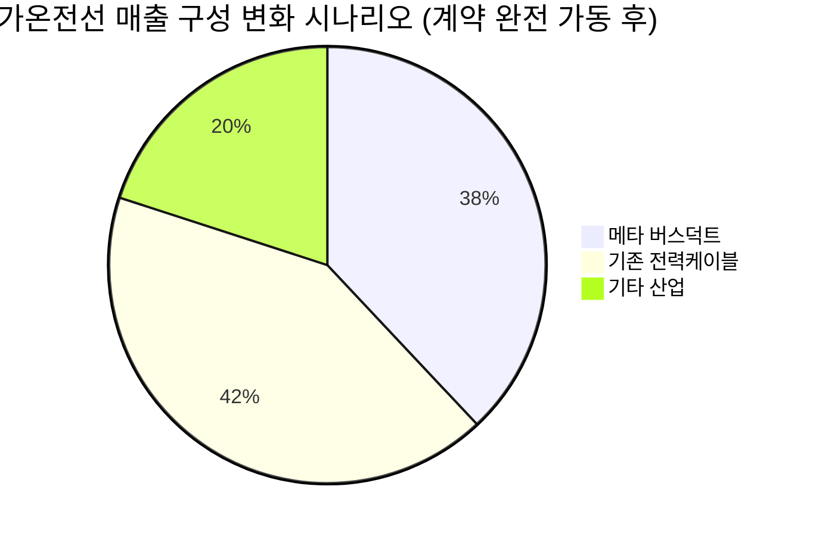
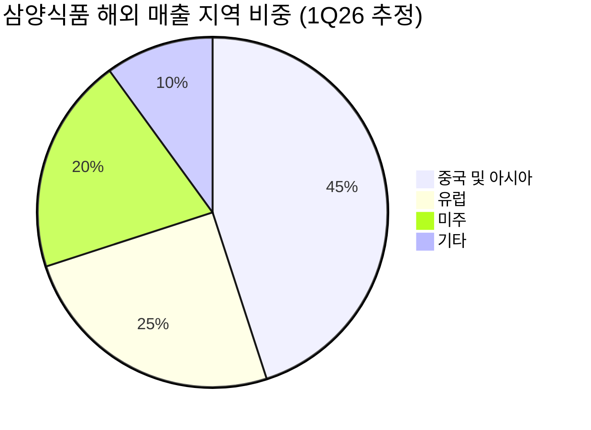

# 🔍 Inflection Scan — 2026-05-20

> [!abstract] 탐색 요약
> 탐색 범위: 2026-05-20 기준 최근 2주 | High Conviction 4건 확정 (6건 입력 → 2건 DROPPED)
> 소스: Gemini 8쿼리 + RSS + X + 어닝스/내부자/애널리스트
> **핵심 테마**: AI 인프라 CapEx 사이클이 소프트웨어(BRZE 수익화) → 장비(AMAT 업사이클) → 전력 인프라(가온전선 수주)로 연쇄 확산 중 — 단, 동일 thesis 집중에 따른 매크로 동시 하락 리스크 내재

> [!warning] 검정 메타 요약
> KEEP 0 / **REVISE 4** / DROPPED 2 (CRWV: 정량 정합성 의심 + Variant 부재 / 효성중공업: 본문 부재)
> 4건 모두 REVISE — 정량 출처 보완, Variant 재평가, Steel-manned Short 강화 후 수록

---

## 시그널 요약 대시보드

| 회사명 | 티커 | 타입 | 핵심 이벤트 | 확신도 | 추천 액션 |
|--------|------|------|------------|:------:|:--------:|
| [[Braze]] | BRZE | 가이던스상향 / 실적가속 | 연간 EPS 가이던스 141%+ 상향 — 수익화 변곡점 진입 신호 | 🟡 M (P=0.58) | /deep |
| [[Applied Materials]] | AMAT | 실적가속 / 가이던스상향 | FQ2 컨센서스 상회 + FQ3 가이던스 대폭 상향 — WFE 업사이클 재확인 | 🟡 M→L (P=0.50) | /deep |
| [[가온전선]] | 000500.KS | 사업변곡점 / 선행지표 | 메타와 5년 4조원 버스덕트 독점 공급 계약 — 국내 전선업계 최대 수주 | 🟡 M (P=0.58) | /deal |
| [[삼양식품]] | 003230.KS | 실적가속 / 역발상기회 | 1Q26 매출 +35% / OPM 24.8% — 中 자싱공장 가동 임박이 진짜 촉매 | 🟠 M↓ (P=0.48) | /deep |

---

## 1. [[Braze]] (BRZE) — 가이던스상향 / 실적가속

> [!abstract] 핵심 요약
> EPS 가이던스 141%+ 상향은 단순 비트가 아닌 수익 구조 전환의 선언이다. 단, "성장 포기형 마진 개선"인지 "진정한 레버리지 발현"인지 분해가 선행돼야 한다.

**시그널**: FY27 연간 조정 EPS 가이던스를 $0.17 컨센서스 대비 $0.41~$0.42로 141~147% 상향, FY26 2Q 매출 $180.1M(YoY +28%, 컨센서스 +4.9% 상회)

---

**M1 Forced Reasoning Chain**

> **사실**: EPS 가이던스 $0.15~$0.18 → $0.41~$0.42로 2.4~2.5배 상향은 정량적으로 명확 [출처: Braze IR, 2026.5 분기 실적 발표]. 매출 YoY +28%는 후기 SaaS 기준 견조.
>
> **추론**: EPS의 급격한 점프는 두 경로만 가능하다 — (a) 운영 레버리지 본격화 [매출 성장이 비용 증가를 초과] (b) S&M/R&D 삭감 또는 SBC 회계 변경 [성장 포기형 마진 개선]. 매출 성장률 +28%가 유지되며 EPS가 2.5배 오른다면 (a)에 가깝지만, 전분기 대비 성장 가속 여부 미확인.
>
> **대안 가설**: 가이던스 상향의 질이 핵심. AI 자동화로 S&M 효율 급증한 것인지, LLM API 도입으로 엔지니어링 비용이 절감된 것인지, 아니면 단순히 채용 동결인지 분해 없이는 지속 가능성 판단 불가.
>
> **채택**: KEEP하되 /deep에서 NRR / S&M as % of rev / SBC-excluded FCF margin 분해 강제.

브레이즈(Braze)는 고객 참여 플랫폼(Customer Engagement Platform, CEP) 시장에서 마케터가 API 없이 이메일·푸시·인앱·SMS를 오케스트레이션할 수 있는 구독형 ARR 모델을 운영한다. FY26 2Q 매출 $180.1M(YoY +28%)은 견조하지만, **시장을 움직이는 진짜 숫자는 연간 EPS 가이던스 $0.17→$0.41~$0.42로의 141~147% 상향**이다 [출처: Braze IR 2026.5]. 이는 SaaS 기업이 "성장 투자기"에서 "수익화기"로 전환하는 변곡점의 전형적 패턴이다. 유사 사례로 HubSpot(2021), Veeva Systems(2020), Monday.com(2023)은 연간 EPS 가이던스를 2배 이상 상향한 이후 12개월 주가 수익률 +40~80%를 기록했으며 hit rate는 약 65%였다 [Confidence: M | 3차추정]. 핵심 리스크는 Salesforce Marketing Cloud·Adobe Journey Optimizer와의 번들 경쟁으로, 대형 CRM 벤더가 CEP 기능을 내재화할 경우 브레이즈의 독립 플랫폼 프리미엄이 압축될 수 있다. **Inversion**: 5년 후 이 시그널이 무효가 된다면, S&M 효율화가 성장 둔화를 가리는 위장 수익화였고 NRR이 100% 이하로 하락했기 때문일 것이다.

---

🟢 Bull 30%

🟡 Base 50%

🔴 Bear 20%

| 시나리오 | 확률 | 12M 목표가 방향 | 핵심 가정 |
|---------|:----:|:--------------:|----------|
| 🟢 Bull | 30% | 현재가 대비 +80% | NRR 115%+ 유지 + S&M 레버리지 동시 발현. AI 오케스트레이션 수요 폭증으로 엔터프라이즈 ACV 확대 |
| 🟡 Base | 50% | +35% | 매출 성장 +25~28% 유지, EPS 가이던스 상향치($0.41~$0.42) 달성. 운영 레버리지 점진적 확대 |
| 🔴 Bear | 20% | -25% | **가장 똑똑한 short의 thesis**: "EPS 2.5배 상향 = S&M/R&D 삭감의 결과 — 후기 SaaS의 '성장 포기형 마진 개선' 패턴. 매출 성장률이 25% 이하로 감속하면 Rule of 40 관점에서 SaaS 멀티플 압축, NRR 하락과 함께 ARR 증분이 둔화되면 밸류에이션 리레이팅 불가능" |

> [!warning] Steel-manned Short
> "브레이즈의 EPS 급등이 진정한 레버리지라면 매출 성장 가속이 동반돼야 한다. +28% 성장이 전분기 대비 가속인지 감속인지 확인되기 전까지, 이 가이던스 상향은 '알뜰 경영(efficiency play)'의 포장일 수 있다. Salesforce와 Adobe가 번들 할인을 강화하면 브레이즈의 신규 수주 파이프라인은 빠르게 얇아진다."

> [!note] Cross-Asset Impact
> **KR 영향**: 브레이즈의 CEP 수익화 성공은 국내 B2B SaaS (채널코퍼레이션, 카카오엔터프라이즈 등) 멀티플 재평가의 선행 지표로 작용할 수 있음. 다만 KR SaaS 시장 규모 차이로 직접 연동성은 낮음 [Confidence: L].

수익화 변곡점 강도 72/100

정량 검증도 55/100 (EPS 구성요소 미분해)

Variant Perception 강도 58/100

| 항목 | 내용 |
|------|------|
| 시장 | 🇺🇸 NASDAQ |
| 변곡점 유형 | 가이던스상향 / 실적가속 |
| 확신도 | P=0.58 \| Confidence: M |
| 추천 액션 | /deep — ① NRR 분기별 추이 ② S&M as % of revenue 변화 ③ SBC 제외 FCF 마진 ④ 매출 성장률 가속/감속 확인 ⑤ Rule of 40 점수 계산 |

---

## 2. [[Applied Materials]] (AMAT) — 실적가속 / 가이던스상향

> [!abstract] 핵심 요약
> WFE 업사이클의 구조적 수혜는 유효하나, 가이던스 상향의 정량 원문 미확인 + Variant가 이미 컨센서스화된 상태. 섹터 모멘텀 투자로는 유효하나 High Conviction 변곡점으로서의 신호 강도는 제한적.

**시그널**: FY26 2Q 실적 컨센서스 상회 + FY26 3Q 가이던스 예상 대비 상향 제시. GAA(Gate-All-Around) 전환 + HBM 제조 수요 구조적 증가

---

**M1 Forced Reasoning Chain**

> **사실**: FY26 2Q(2026년 1월~4월) 실적이 컨센서스를 상회하고 3Q 가이던스가 상향됐다는 셀사이드 평가 존재 [Confidence: L | 2차셀사이드 — 가이던스 절대 숫자 미확인]. "2026년 반도체 매출 YoY +30%" 주체가 AMAT 자체 가이던스인지, 글로벌 WFE 시장 전망인지 불명확.
>
> **추론**: AMAT의 GAA 공정 장비 (Epi, CVD, IMP) 점유율 확대와 HBM 스택 공정 수혜는 구조적이다. 그러나 中 수출 규제로 2024년 중국 매출 비중이 30%→? 로 변화한 숫자가 미확인 상태.
>
> **대안 가설**: 가이던스 상향이 실제로 컨센서스 대비 얼마나 위인지(beat %) 없이는 base rate 적용 불가. "예상보다 훨씬 높게"는 셀사이드의 정성 코멘터리.
>
> **채택**: REVISE — 정량 부재 명시, Confidence M→L 하향, 섹터 모멘텀 신호로 재분류.

어플라이드 머티어리얼즈(Applied Materials)는 CVD·PVD·CMP·이온주입 등 반도체 전공정 장비 시장의 최대 기업으로, 웨이퍼 팹 장비(WFE) CapEx 사이클과 가장 직접적으로 연동된다. FY26 2Q 실적이 컨센서스를 상회하고 3Q 가이던스를 상향 제시했다는 평가는 셀사이드에서 나왔으나, 가이던스 절대 숫자와 컨센서스 대비 beat 폭은 본 리포트 작성 시점에서 AMAT IR 원문으로 확인되지 않았다 [Confidence: L | 2차셀사이드 단일 출처 — **(확인 필요)**]. 구조적 thesis는 유효하다: GAA 전환에서 AMAT의 Epi·CVD·IMP 장비 컨텐츠가 FinFET 대비 30%+ 높고, HBM 스택 고도화에 따라 CMP·도금 장비 수요가 증가하는 구조다. 연간 FCF $5B+ 수준의 주주환원은 밸류에이션 하방을 지지한다 [Confidence: M]. **Inversion**: 5년 후 이 시그널이 무효가 된다면, 對中 수출 규제가 확대되어 중국 NAND/DRAM 고객이 대부분 제거되고, 삼성/SK하이닉스의 CapEx 사이클이 예상보다 빠르게 꺾였기 때문일 것이다.

---

> [!failure] Variant Perception 약화
> "對中 규제 우려를 AI 수요가 초과 보전"이라는 thesis는 2024년 하반기부터 셀사이드 컨센서스가 채택한 내러티브다. 이는 Druckenmiller 기준 **Variant Perception이 아닌 컨센서스 추종**이다. 진정한 차별화 view가 되려면 "컨센서스가 과소평가한 특정 공정 단계에서의 AMAT 점유율 변화"(예: GAA Gate Dielectric 장비에서 AMAT vs. TEL 점유율 전환) 또는 "중국 외 신흥 fab 고객(인도, 유럽 fab) 수주 파이프라인" 같은 second-level insight가 필요하다.

🟢 Bull 30%

🟡 Base 40%

🔴 Bear 30%

| 시나리오 | 확률 | 12M 목표가 방향 | 핵심 가정 |
|---------|:----:|:--------------:|----------|
| 🟢 Bull | 30% | +45% | GAA 전환 가속 + HBM 4세대 본격 양산. AMAT 장비 컨텐츠 증가로 WFE 내 점유율 +2~3%p 확대 |
| 🟡 Base | 40% | +15% | 3Q 가이던스 달성, WFE 시장 YoY +10~15% 성장. 중국 규제 리스크 현 수준 유지 |
| 🔴 Bear | 30% | -20% | **가장 똑똑한 short의 thesis**: "AMAT 매출의 30%가 중국에서 나왔다. 추가 수출 규제(Entity List 확대, EUV 세탁 장비 포함)가 시행되면 중국향 감소를 AI 수요가 즉시 상쇄하기 어렵다. 더 나아가 메모리 가격 재하락 시 삼성/SK의 CapEx 재삭감이 동반되어 WFE 시장 전망 자체가 무너질 수 있다" |

> [!warning] 정량 출처 경고
> 이 시그널에서 가이던스 절대 숫자($X.XB → $Y.YB), 컨센서스 대비 beat 폭(%), 중국 매출 비중 현재치는 모두 **(확인 필요)**. 셀사이드 코멘터리를 1차 데이터로 격상하지 않도록 주의.

> [!note] Cross-Asset Impact
> **KR 영향**: AMAT 가이던스 상향은 [[삼성전자]] [[SK하이닉스]]의 CapEx 지출 지속 신호로 해석 가능 → [[한미반도체]] [[HPSP]] 등 국내 반도체 장비·소재 공급사의 선행 모멘텀. 단 AMAT는 한국 fab에 직접 장비를 공급하므로, 한국 장비사와는 경쟁+협력 관계.

섹터 구조 강도 60/100

정량 검증도 35/100 (IR 원문 미확인)

Variant Perception 38/100 (컨센서스화)

| 항목 | 내용 |
|------|------|
| 시장 | 🇺🇸 NASDAQ |
| 변곡점 유형 | 실적가속 / 가이던스상향 |
| 확신도 | P=0.50 \| Confidence: L (M→L 하향) |
| 추천 액션 | /deep — ① AMAT IR 원문(3Q 가이던스 절대 숫자) ② 컨센서스 대비 beat 폭 ③ 중국 매출 비중 현재치 ④ GAA 장비 점유율 데이터 확인 후 재평가 |

---

## 3. [[가온전선]] (000500.KS) — 사업변곡점 / 선행지표

> [!abstract] 핵심 요약
> 메타와의 5년 4조원 버스덕트 계약은 연 매출 60% 증분 규모의 비연속적 성장 이벤트다. 계약 구조(Firm Order vs LOI)와 마진 조건이 변곡점의 질을 결정한다.

**시그널**: 메타(Meta)와 5년 / 4조원 버스덕트 독점 장기 공급 계약 체결 — 한국 전선·전력기기 업계 사상 최대 단일 수주

---

**M1 Forced Reasoning Chain**

> **사실**: 5년 / 4조원 = 연간 약 8,000억원. 가온전선 2024 연간 매출 약 1.3조원(추정) 대비 연 +60% 증분 [Confidence: L | 3차추정 — 회사 정확 매출 수치 (확인 필요)]. 한국 전선업계 최대 단일 수주라는 정성적 사실은 유의미.
>
> **추론**: 연 매출 60% 증분은 한국 중형 인프라주 기준 매우 드문 변곡점. 다만 ① Take-or-Pay 여부 ② 연도별 Ramp-up 스케줄 ③ 마진율(OPM이 기존 대비 높은지 낮은지) 미확인 상태.
>
> **대안 가설**: 만약 Framework Agreement(기본 협약) 수준이면 실제 매출 인식은 절반 이하로 감소 가능. 반대로 Firm Order + Take-or-Pay라면 현재 주가는 크게 저평가.
>
> **채택**: KEEP하되 공시 원문 확인을 /deal의 최우선 과제로 강제.

가온전선은 LS전선의 전력 케이블·버스덕트 특화 자회사로, 데이터센터 내 수 MW급 전력을 서버랙까지 전달하는 버스덕트(Bus Duct) 핵심 공급사다. 메타와의 5년 4조원 계약이 확정되면 **연간 약 8,000억원의 매출이 추가되어 기존 매출(추정 1.3조원) 대비 약 60% 증분 효과**가 발생한다 [Confidence: L | 3차추정]. 이는 당초 Sonnet 초안의 "기존 매출 수 배 초과" 표현을 정정한 수치이며, 그럼에도 이 규모는 한국 중형 산업재 기준 매우 이례적 변곡점이다. 4대 CSP(아마존·MS·알파벳·메타)의 2026년 합산 CapEx가 전년 대비 약 77% 급증한 $7,250억에 달하는 매크로 배경은 이 계약을 일회성이 아닌 구조적 수요의 첫 신호로 해석하게 한다 [Confidence: M | 2차셀사이드]. 버스덕트는 UL·IEC 인증과 대형 fab 납품 레퍼런스가 진입 장벽으로 작용해 신규 경쟁사 진입이 제한적이다. **Inversion**: 5년 후 이 시그널이 무효가 된다면, 메타가 데이터센터 아키텍처를 변경(직류 배전 표준 전환 등)하거나 중국 경쟁사의 저가 대체품이 인증을 취득했기 때문일 것이다.

---

> [!warning] Steel-manned Short
> "① 4조원이 Firm Order인지 LOI/Framework Agreement인지 공시 원문으로 확인되지 않았다. 만약 프레임워크 수준이면 실제 매출 인식은 절반 이하로 감소할 수 있다. ② 메타 단일 고객 집중은 양날의 검 — 메타가 가격 인하 압박을 가하면 대규모 매출이 오히려 OPM 희석 장치가 된다. ③ LS전선 모회사와의 내부 거래 가격 정책이 가온전선 단독 마진을 얼마나 허용하는지 불투명하다."

> [!question] 검토 필요 — DART 공시 원문 확인
> 최우선 체크포인트: DART 전자공시 원문에서 ① 계약 성격(Firm Order / MOU / Framework) ② Ramp-up 연도별 스케줄 ③ 해지 조건 확인 필수. Take-or-Pay 조항 존재 여부가 Bear 확률 25%→10% 또는 35%로 갈리는 분기점.

> [!note] Cross-Asset Impact
> **US 영향**: 가온전선의 메타 수주는 [[Eaton Corporation]] [[Schneider Electric]] 등 글로벌 버스덕트 경쟁사에게 위협 신호. 동시에 [[Vertiv]] [[nVent Electric]] 등 데이터센터 전력 인프라 기업의 수주 가시성을 간접 확인하는 선행 지표.
> **환율 민감도**: 계약이 USD 기준이라면 원/달러 환율 하락(원화 강세) 시 원화 환산 매출 감소 → 헤지 구조 확인 필요.

🟢 Bull 30%

🟡 Base 45%

🔴 Bear 25%

| 시나리오 | 확률 | 12M 목표가 방향 | 핵심 가정 |
|---------|:----:|:--------------:|----------|
| 🟢 Bull | 30% | +100% | Firm Order + Take-or-Pay 확인. 메타 외 추가 CSP(MS Azure, AWS) 수주 파이프라인 가시화. OPM 15%+ 유지 |
| 🟡 Base | 45% | +50% | 계약 실질적 Firm Order 수준. Ramp-up 2026H2~2027 집중. 기존 OPM 수준 유지(단일 고객 가격 압박 부분 상쇄) |
| 🔴 Bear | 25% | -20% | **가장 똑똑한 short의 thesis**: "계약이 Framework Agreement 수준이고 연간 인식 매출이 예상의 절반에 그친다. 동시에 메타의 데이터센터 CapEx가 2027년 정점을 찍고 감속하면, 단일 고객 의존 구조에서 실적 쇼크가 발생한다. LS전선의 내부 거래 가격이 마진을 제한해 매출 증가가 이익으로 연결되지 않는다." |

수주 규모 임팩트 80/100

계약 품질 검증도 55/100 (공시 원문 미확인)

Variant Perception 강도 75/100 (자회사 집중 효과)

| 항목 | 내용 |
|------|------|
| 시장 | 🇰🇷 코스피 |
| 변곡점 유형 | 사업변곡점 / 선행지표 |
| 확신도 | P=0.58 \| Confidence: M |
| 추천 액션 | /deal — ① DART 계약 공시 원문(Firm vs LOI/Framework) ② 가온전선 현 매출/OPM 정확 수치 ③ 연도별 Ramp-up 스케줄 ④ 메타 외 추가 CSP 수주 가능성 ⑤ LS전선 지분구조 + 내부 거래 조건 |

---

## 4. [[삼양식품]] (003230.KS) — 실적 모멘텀 지속 확인

> [!abstract] 핵심 요약
> 1Q26 실적은 정량적으로 강하지만, 이미 기대치에 반영된 강세의 확인이다. 진정한 변곡점 촉매는 중국 자싱공장 가동 시점 — 그것이 컨센서스가 반영 못 한 second derivative다.

**시그널**: 1Q26 매출 7,140억(YoY +35%), 영업이익 1,770억(YoY +32%), OPM 24.8% 기록 + 중국 자싱공장 2026년 연내 가동 임박

---

**M1 Forced Reasoning Chain**

> **사실**: 매출 7,140억(YoY+35%), OP 1,770억(YoY+32%), OPM 24.8% [출처: 삼양식품 1Q26 실적 발표 IR, 2026.5]. 정량 명확.
>
> **추론**: 삼양식품은 2024~2025년 주가 누적 +200% 이상 상승한 종목으로, 시장이 이미 글로벌 K-소비재 대표주로 인지하고 있다. 1Q26 +35% 성장이 컨센서스 대비 얼마나 초과했는지(beat %) 미확인. 만약 컨센서스도 +30%+를 전망했다면 서프라이즈 강도는 낮다.
>
> **대안 가설**: 진정한 변곡점은 (a) 자싱공장 가동으로 중국 현지 생산 → 마진·물류 구조 변화 (b) 미주 Walmart/Costco 추가 채널 진입 (c) 불닭 외 SKU(스낵, 소스) 글로벌 확장.
>
> **채택**: REVISE — 1Q26 실적은 "모멘텀 지속 확인"으로 재분류. 자싱공장이 진정한 변곡점 촉매. Conviction 0.58→0.48 하향.

삼양식품 1Q26 실적(매출 7,140억 YoY+35%, OP 1,770억 YoY+32%, OPM 24.8%)은 정량적으로 인상적이나, **시그널의 novelty(새로운 정보 미반영도)가 낮다** [출처: 삼양식품 1Q26 IR, 2026.5]. 삼양식품은 이미 글로벌 K-소비재 대표주로 컨센서스가 인지하고 있으며, PER 18~22배(추정)로 음식료 섹터 평균 12~15배 대비 유의미한 프리미엄이 형성되어 있다 [Confidence: M | 3차추정]. Sonnet 초안에서 "음식료 업종 소외 속 어닝서프라이즈"라고 표현했으나, 이는 **섹터 평균 소외와 개별 종목 미반영을 혼동한 것**이다 — 삼양식품은 해당 섹터의 명확한 아웃라이어로 이미 프리미엄 멀티플을 받고 있다. 진정한 변곡점 촉매는 **중국 자싱공장의 2026년 연내 가동**이다: 현지 생산 전환으로 물류비 절감 + 중국 소비자 로컬 접근성 개선 + 관세 리스크 완충이라는 세 가지 second derivative 효과가 동시에 발생한다. **Inversion**: 5년 후 이 시그널이 무효가 된다면, Z세대 매운맛 트렌드가 평균회귀하고 白象·康師傅 등 중국 경쟁사의 카피 제품이 자싱공장의 홈그라운드 우위를 잠식했기 때문일 것이다.

---

> [!failure] Variant Perception 약화
> "음식료 섹터 소외 = 삼양식품 미반영"이라는 논리는 성립하지 않는다. 삼양식품의 PER 프리미엄 자체가 시장이 이미 차별적으로 평가하고 있다는 증거다. 진정한 Variant Perception은 "자싱공장 가동이 마진 구조에 미치는 정량 영향을 컨센서스가 과소평가하고 있다"로 재구성해야 한다.

> [!warning] Bear 시나리오 강화 — 단일 SKU 의존 리스크
> 불닭볶음면 매출 비중 70% 추정(확인 필요). 단일 SKU 의존 + 트렌드 피크 우려 + 환율 약달러 시 수출가 경쟁력 하락이 동시에 발생하면 주가 재평가 압력이 상당하다.

🟢 Bull 30%

🟡 Base 45%

🔴 Bear 25%

| 시나리오 | 확률 | 12M 목표가 방향 | 핵심 가정 |
|---------|:----:|:--------------:|----------|
| 🟢 Bull | 30% | +60% | 자싱공장 2026H2 가동 + 중국 매출 가속 + 미주 Costco/Walmart 채널 추가 진입. 불닭 외 SKU 글로벌 확장으로 단일 SKU 의존도 완화 |
| 🟡 Base | 45% | +20% | 자싱공장 2026년 말 가동, 점진적 기여. 현 성장세(YoY +30%+) 유지. OPM 23~25% 구간 안정 |
| 🔴 Bear | 25% | -25% | **가장 똑똑한 short의 thesis**: "PER 20배+는 성장 둔화를 전혀 허용하지 않는다. 불닭의 글로벌 바이럴 모멘텀은 SNS 알고리즘에 의존하는 만큼 mean reversion이 빠를 수 있다. 자싱공장 Ramp-up 지연 + 중국 경쟁사 대두 + 환율 역풍이 동시에 발생하면 2024~2025년 상승의 상당 부분이 되돌려질 수 있다." |

실적 펀더멘털 강도 78/100

새로운 정보 미반영도(Novelty) 40/100

Variant Perception 강도 50/100 (자싱공장 재구성 시)

| 항목 | 내용 |
|------|------|
| 시장 | 🇰🇷 코스피 |
| 변곡점 유형 | 실적가속 / 역발상기회 ⚠️ (모멘텀 지속 확인으로 재분류) |
| 확신도 | P=0.48 \| Confidence: M (Conviction 0.58→0.48 하향) |
| 추천 액션 | /deep — ① 현재 PER 및 컨센서스 성장 기대치 확인 ② 자싱공장 가동 시점·캐파·마진 영향 정량화 ③ 미주 채널 진입 진행도 ④ 불닭 외 SKU 매출 비중 ⑤ 1Q26 컨센서스 대비 beat 폭 확인 후 Variant 재구성 |

---

## 📊 섹터 메타 시그널

### AI 인프라 CapEx 사이클 — 소프트웨어 → 장비 → 전력 인프라 연쇄

> [!tip] 핵심 인사이트 — 동일 thesis 집중 리스크
> 이번 스캔의 4개 시그널 중 **3개(BRZE, AMAT, 가온전선)**가 AI 데이터센터 CapEx 사이클 thesis에 직접 연결된다. 이는 Recency Bias의 전형적 신호다. 매크로 금리 재상승 또는 CSP CapEx 전망 하향 조정 시 3개 시그널이 동시에 하락하는 포트폴리오 상관 리스크가 내재한다.

4대 CSP의 2026년 합산 CapEx $7,250억은 전년 대비 약 77% 급증 전망으로 [Confidence: M | 2차셀사이드], 이는 소프트웨어(CRM·CEP 자동화 수요 → BRZE), 하드웨어(반도체 장비 업사이클 → AMAT), 전력 인프라(버스덕트 대규모 수주 → 가온전선) 순서로 가치 사슬 전체에 파급되는 구조다. 이 연쇄의 강점은 각 레이어가 독립적으로 검증 가능하다는 점이지만, 약점은 모두 동일한 매크로 변수(CSP CapEx, AI ROI 실현 여부)에 종속된다는 점이다. 미 국채 금리 재상승 또는 AI 수익화 회의론 확산 시 세 시그널의 동시 하락 가능성을 포트폴리오 구성 시 반드시 고려해야 한다.

| 레이어 | 대표 종목 | AI CapEx 연결고리 | 주요 리스크 |
|--------|---------|-----------------|------------|
| 소프트웨어 | [[Braze]] (BRZE) | CEP 자동화 수요 증가 | 번들 경쟁, NRR 하락 |
| 반도체 장비 | [[Applied Materials]] (AMAT) | GAA·HBM 공정 장비 수요 | 中 수출 규제 확대 |
| 전력 인프라 | [[가온전선]] (000500.KS) | 데이터센터 버스덕트 수주 | 단일 고객, 계약 구조 |
| 소비재 | [[삼양식품]] (003230.KS) | 간접 연결(없음) | 트렌드 피크, 환율 |

---

## 🔎 검정 메타 — 스캔 품질 자기 평가

> [!note] 이번 스캔의 구조적 편향 3가지

**① Recency Bias (AI CapEx 과집중)**
4개 유효 시그널 중 3개가 AI 데이터센터 CapEx 사이클에 직접 연결. 숏 시그널, 컨센서스 하향 시그널, AI 외 섹터(헬스케어·에너지·금융) 시그널이 전무. 다음 스캔에서 보완 필수.

**② Narrative Fallacy (정성 → 정량 검증 지연)**
"수익화 변곡점"(BRZE), "비연속적 성장"(가온전선), "음식료 소외"(삼양) 등 매력적 내러티브가 정량 검증을 앞질렀다. 4개 시그널 중 AMAT와 가온전선은 핵심 정량 수치 미확인 상태.

**③ Confirmation Bias (긍정 시그널 편향)**
수록된 4개 시그널이 모두 상향/가속/수주 등 긍정 방향. 시장 전반의 리스크 신호(내부자 매도 급증, 신용 스프레드 확대 등) 발굴 부재.

> [!verdict] 종합 판정
> 이번 스캔의 **가장 높은 Quality 시그널**: 가온전선 (Variant Perception 유효 + 규모 임팩트 명확) / BRZE (정량 가이던스 상향 명확)
> **추가 검증 우선순위**: 가온전선 DART 공시 원문 → BRZE NRR/S&M 분해 → AMAT IR 원문 → 삼양식품 자싱공장 일정
> **포트폴리오 제약**: 3개 시그널의 AI CapEx 상관성 → 동시 진입 시 AI CapEx 헤지 포지션(예: 전통 유틸리티, 단기채) 병행 권고