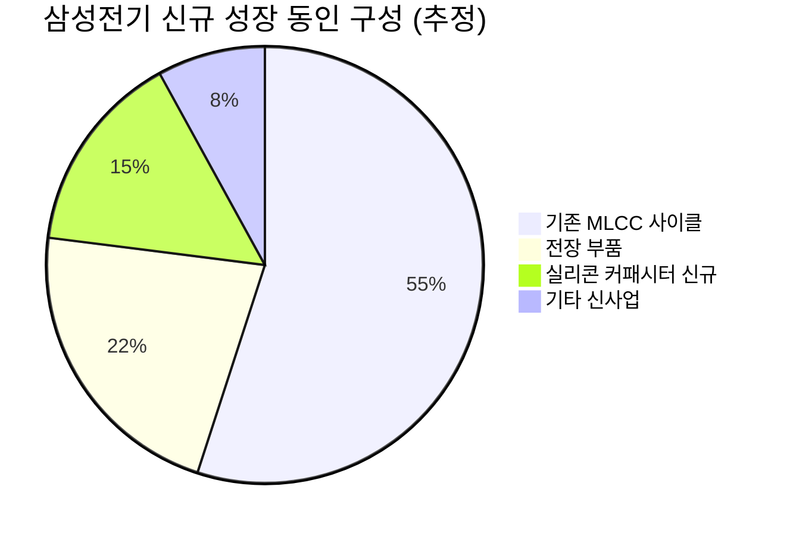

# 🔍 Inflection Scan — 2026-05-22

> [!abstract] 탐색 요약
> 탐색 범위: 2026-05-22 기준 최근 2주 | High Conviction 5건 통과 (7건 입력 → 2건 탈락)
> 소스: 실적 발표 / 1차 IR 공시 / 셀사이드 리포트 / RSS
> **핵심 테마**: AI 인프라 수요가 소프트웨어(마진 레버리지)·하드웨어(전력·반도체 부품) 공급망 전반에 걸쳐 동시 변곡점을 만들고 있으나, 진입 타이밍과 밸류에이션 검증 없이는 "슈퍼사이클 내러티브 cluster bias"에 빠질 위험 존재

> [!warning] 탈락 시그널
> **QBTS** (Gate 1 자체 실패 — 비즈니스 모델 수익화 경로 불명확) / **파두** (1차 데이터 부재 + 후행지표 의존) 탈락. 양자컴퓨팅 DROP은 의도적 trade-off — 정부 지원이 진짜 변곡점이면 mega-bagger 놓칠 가능성 수용.

---

## 시그널 요약 대시보드

| 회사명 | 티커 | 타입 | 핵심 이벤트 | 확신도 | 추천 액션 |
|--------|------|------|------------|:------:|:--------:|
| [[Workday]] | WDAY | 실적가속 | FY2027 Q1 매출 +13.5%, AI 생산성→마진 확대 증명, 주가 +14% | P=0.42 🟡 | /deep |
| [[NIO Inc.]] | NIO | 역발상 | Q1 매출 +123%, 차량마진 18.8%, BofA 비GAAP 순이익 전망 593% 상향 | P=0.38 🟡 | /deal (소형) |
| [[Semtech]] | SMTC | 가이던스상향 | Stifel 목표가 $96→$157 (+64%), 10명 애널리스트 동시 추정치 상향 | P=0.48 🟡 | /deep |
| [[삼성전기]] | 009150.KS | 사업변곡점 | AI 서버 실리콘 커패시터 1조5,570억원 공급 계약(2027-28) | P=0.55 🟢 | /deep |
| [[효성중공업]] | 298040.KS | 선행지표 | Q1 수주잔고 20.2조 돌파(+32% QoQ) — AI 데이터센터 전력기기 수요 | P=0.58 🟢 | /deal |

> [!tip] 핵심 인사이트
> 이번 스캔의 최고 확신도 시그널은 **효성중공업(P=0.58)**과 **삼성전기(P=0.55)** — 두 종목 모두 1차 IR 공시 기반, AI 인프라 물리 레이어(전력·부품)의 구조적 변곡점. 소프트웨어(WDAY)와 중국 EV(NIO)는 "공포 해소" 또는 "base 효과 착시" 성격이 강해 추가 검증 선행 권고.

---

## 1. [[Workday]] (WDAY) — 실적가속 / AI Disruption 공포 해소

**시그널**: FY2027 Q1 총매출 $25.4억(YoY +13.5%), AI 생산성 개선→마진 가이던스 상향, 주가 +14%

> [!abstract] 요약
> 시장이 "AI가 HR 소프트웨어를 대체한다"는 공포에 할인했던 멀티플이 실제 실적으로 반증. 단, 이는 변곡점이라기보다 **공포 해소 + 모멘텀** 성격에 가까움 — 진짜 변곡점은 AI 제품 ARR이 수치로 분해 공개되는 시점.

**사실 → 추론 → 대안 → 채택**:
Workday FY2027 Q1(2026년 5월 발표)에서 총매출 $25.4억(YoY +13.5%)을 기록하고 마진 가이던스를 상향하며 주가 +14%가 발생했다. 컨센서스의 핵심 할인 요인은 "AI 에이전트가 seat-based HR/재무 워크플로우를 대체한다"는 구조적 공포였는데, 실제 결과는 AI 기능(Illuminate 등)이 기존 고객의 확장 지출과 내부 운영 효율을 동시에 강화하는 방향으로 작동했음을 보여준다. 그러나 13.5% 성장은 SaaS 대형주 평균(~15%)과 유사한 수준이며, +14% 주가 반응의 상당 부분은 발표일 당일에 이미 반영됐을 가능성이 높다. **진짜 변곡점 트리거는 cRPO 성장률 가속 또는 AI ARR 기여도의 수치 분해 공개 시점이다** — 이 두 데이터가 확인되기 전까지는 "공포 해소 + 기술적 반등"으로 해석이 더 적절하다. 유사 사례: Salesforce 2023년 Data Cloud 성장 수치 공개 후 멀티플 재평가 → 12개월 +45% (다만 WDAY의 성장률은 CRM 당시 대비 낮음).

🟢 Bull 25%

🟡 Base 50%

🔴 Bear 25%

| 시나리오 | 핵심 가정 | 12개월 목표가 | 현재가 대비 |
|---------|---------|------------|-----------|
| 🟢 Bull (25%) | cRPO 가속 + AI Illuminate ARR 공개로 멀티플 재평가. NTM FCF yield 기준 재산정 | $310 | +30% [추정] |
| 🟡 Base (50%) | 13-15% 성장 유지, 마진 개선 지속. 멀티플 현 수준 유지 | $260 | +9% [추정] |
| 🔴 Bear (25%) | **Steel-manned Short**: 13.5% 성장은 SaaS 대형주 하위권. NTM P/FCF 25-27x는 성장률 대비 정당화 어려움. Rippling/Deel 등 AI-native가 mid-market 잠식. ServiceNow(25%+ 성장) 대비 성장 프리미엄 소실. | $180 | -24% [추정] |

확신도 P=0.42 / 100

AI Disruption 공포 해소 강도 65/100

cRPO/NRR 데이터 확보 수준 42/100 (확인 필요)

> [!warning] Inversion — 5년 후 이 시그널이 무효가 된다면
> Agentic AI가 HR/ERP 워크플로우 자체를 대체하면서 seat-based 라이선스 모델이 붕괴 — 2026년의 마진 가이던스 상향은 구조적 변곡점이 아닌 일시적 기술적 반등이었던 것으로 판명. (P~35% > 30% 임계, conviction 하향 사유)

> [!question] 확인 필요
> cRPO(Current Remaining Performance Obligations) 성장률, AI 제품(Illuminate) ARR 기여도 수치, Net Revenue Retention 추이 — 이 세 항목 없이는 "변곡점"이 아닌 "모멘텀"으로만 분류.

**Cross-Asset Impact** [Confidence: M | 근거: 3차 추정]: WDAY 강세는 [[ServiceNow]](NOW), [[Salesforce]](CRM) 등 Enterprise SaaS 전반의 AI disruption 할인 해소에 선행 신호. KR 영향: 직접적 연관 제한적이나 AI SW 인프라 투자 확대 관련 클라우드 수혜주([[NAVER]], [[카카오엔터프라이즈]]) 간접 긍정.

| 항목 | 내용 |
|------|------|
| 시장 | 🇺🇸 NASDAQ |
| 변곡점 유형 | 실적가속 / AI Disruption 공포 해소 |
| 추천 액션 | /deep — cRPO 성장률·AI ARR 기여도·NRR 확인 후 포지션 판단 |

---

## 2. [[NIO Inc.]] (NIO) — 역발상 기회 / 적자→흑자 궤도 진입 시도

**시그널**: Q1 2026 매출 YoY +123%, 인도량 +98%, 차량마진 18.8% — BofA 2026 비GAAP 순이익 전망 593% 상향 [출처: BofA 리포트, investing.com 보도 2026.5]

> [!abstract] 요약
> 외형 성장의 급가속은 실제이나, "BofA 593% 상향"은 적자 base의 통계적 착시. GAAP 흑자전환은 별개 문제이며, 18.8% 차량마진은 경쟁사 대비 여전히 열위. **소형 포지션 + 현금소진율 검증 병행이 전제조건.**

**사실 → 추론 → 대안 → 채택**:
NIO Q1 2026에서 인도량 YoY +98%, 매출 +123%로 Onvo 브랜드 출시 효과가 수치로 확인됐으며, 차량마진 18.8%는 BEV 메이커로서 의미있는 개선이다. 그러나 BofA의 "593% 상향"은 기존 비GAAP 순이익 추정이 0에 가까운 소폭 적자였기 때문에 발생하는 통계적 base 효과이며, GAAP 기준 흑자전환은 여전히 별개의 이정표다 — 이 구분이 투자 판단에서 가장 중요하다. 차량마진 18.8%는 [[Li Auto]] 22%+, [[BYD]] 20%+ 대비 여전히 열위이며, Xiaomi SU7이 NIO 핵심 프리미엄 세그먼트를 직접 공략 중이다. 반면 Onvo의 20-25만 위안 대중 세그먼트 침투가 성공하면 볼륨 10배 확장 시나리오가 열리고, 기존 배터리 스왑 인프라는 신규 진입자 대비 실질적 진입장벽이다. 유사 사례: Li Auto 2022-2023 신모델 출시 후 12개월 주가 +150% — 단, 당시 Li Auto는 이미 GAAP 흑자 기업이었다는 점에서 비교에 한계 존재.

🟢 Bull 20%

🟡 Base 42%

🔴 Bear 38%

| 시나리오 | 핵심 가정 | 12개월 목표가 | 현재가 대비 |
|---------|---------|------------|-----------|
| 🟢 Bull (20%) | Onvo 분기 인도량 10만대+ 달성, 차량마진 20% 돌파, 비GAAP 흑자 가시화 | $8-10 | +100%+ [추정] |
| 🟡 Base (42%) | 인도량 성장 지속, 마진 18-19% 유지, 현금소진 지속이나 속도 감소 | $5-6 | +25-50% [추정] |
| 🔴 Bear (38%) | **Steel-manned Short**: BofA 593%는 회계적 착시. 누적 적자 ~$10B, 매 분기 현금소진 지속. Xiaomi SU7이 NIO 프리미엄 세그먼트 직격. 중국 EV 가격전쟁 심화로 18.8% 마진이 15% 이하 후퇴. ADR 상폐 리스크. 배터리 스왑은 자본집약적 흑자 장애물. | $2 이하 | -50%+ [추정] |

확신도 P=0.38 / 100

외형 성장 가속도 72/100

수익성 구조 신뢰도 30/100

> [!warning] Inversion — 5년 후 이 시그널이 무효가 된다면
> 2027년 중국 EV 가격전쟁 심화로 차량마진이 15% 이하로 후퇴하고, Onvo 자기잠식(ASP 하락) + Xiaomi 점유율 탈취로 외형 성장이 꺾이면 2026년 Q1 급성장은 단순 신모델 출시 효과에 불과했던 것으로 판명. (P~35% > 30% 임계)

> [!note] Base 효과 경고 — 593% 상향의 실체
> BofA의 비GAAP 순이익 전망 593% 상향은 기존 추정치가 소폭 적자였기 때문에 발생하는 수치. 예: -$100M → -$6M도 "적자 폭 94% 축소"로 표현 가능. **GAAP 흑자전환 시점과 OCF 플러스 전환이 진짜 변곡점** — 현재 미확인 상태.

**Cross-Asset Impact** [Confidence: M | 근거: 2차 셀사이드]: NIO 강세는 [[Li Auto]](LI), [[XPeng]](XPEV) 등 중국 EV ADR 전반의 밸류에이션 재점검 트리거. KR 영향: [[LG에너지솔루션]], [[삼성SDI]] — NIO 배터리 스왑 생태계 확장은 CATL 의존도 높아 KR 배터리 직접 수혜 제한적.

| 항목 | 내용 |
|------|------|
| 시장 | 🇺🇸 NYSE (중국 HK 병행 상장) |
| 변곡점 유형 | 역발상 / 실적가속 |
| 추천 액션 | /deal — 단, 소형 포지션 한정. 현금소진율·OCF·GAAP 흑전 시점 확인 선행 필수 |

---

## 3. [[Semtech]] (SMTC) — 가이던스 상향 / AI 인프라 인터커넥트 믹스쉬프트

**시그널**: Stifel 목표가 $96→$157 상향(+64%), 10명 애널리스트 동시 추정치 상향 — 하이퍼스케일러 AI CapEx 수혜 명시 [출처: Stifel 리포트, investing.com 2026.5]

> [!abstract] 요약
> "IoT/LoRa 성숙 기업" 인식에서 "AI 데이터센터 인터커넥트 플레이어"로의 비즈니스 모델 재분류가 핵심. 10명 동시 추정치 상향은 consensus shift 신호이나, 부채 부담과 대형 경쟁사(Marvell/Broadcom) 위협이 진입 전 검증 필수 항목.

**사실 → 추론 → 대안 → 채택**:
Stifel의 $96→$157 목표가 상향(+64%)과 10명 애널리스트 동시 추정치 상향은 단순 price target revision이 아닌 SMTC의 비즈니스 모델 분류(IoT → 데이터센터 인프라) 재설정을 의미한다. CopperEdge 제품은 AI 데이터센터의 400G/800G 고속 인터커넥트 수요를 타겟하며, 기존 저마진 LoRa IoT에서 고마진 인프라 칩으로의 매출 믹스쉬프트가 실현되면 멀티플 재평가 여지가 크다. 그러나 consensus shift가 발생한 시점에 진입하면 상당 부분이 이미 주가에 반영된 경우가 많고, SMTC는 부채 ~$1.4B [추정] 의 이자 부담으로 EPS 변동성이 극심하다는 구조적 취약점이 있다. AI 인터커넥트의 진정한 승자는 [[Marvell]](MRVL), [[Broadcom]](AVGO), [[Astera Labs]](ALAB)일 가능성을 배제할 수 없으며, SMTC는 그 생태계의 niche 플레이어로 단기 수혜 후 점유율 잠식에 취약하다. 유사 사례: Inphi(2020년 AI 인터커넥트 선점 → 2021년 Marvell에 $10B 인수) — SMTC도 M&A 타겟 가능성 존재.

🟢 Bull 30%

🟡 Base 48%

🔴 Bear 22%

| 시나리오 | 핵심 가정 | 12개월 목표가 | 현재가 대비 |
|---------|---------|------------|-----------|
| 🟢 Bull (30%) | CopperEdge 매출 비중 30%+ 돌파 공시, 하이퍼스케일러 장기계약 체결 또는 M&A 프리미엄 | $157-180 | +40-60% [추정] |
| 🟡 Base (48%) | CopperEdge 점진적 성장, 믹스쉬프트 가시화, 부채 상환 유지 | $120-140 | +7-25% [추정] |
| 🔴 Bear (22%) | **Steel-manned Short**: Stifel은 셀사이드 중 가장 bullish 한 명. 9명 추격 상향은 독립적 분석이 아닌 price target 따라가기일 수 있음. CopperEdge 매출 공시 불명확으로 bull case 검증 불가. 부채 이자 부담이 FCF를 잠식. Marvell이 동급 제품으로 가격 압박. | $75-85 | -25-35% [추정] |

확신도 P=0.48 / 100

애널리스트 consensus shift 강도 78/100

부채 구조 안전성 35/100 (확인 필요)

> [!warning] Inversion — 5년 후 이 시그널이 무효가 된다면
> AI 인프라 CapEx 정점 통과 후 Marvell/Broadcom의 가격 압박이 CopperEdge 시장을 잠식하고, 부채 부담으로 R&D 투자 부족 → SMTC는 niche 플레이어에서 퇴출되는 구조로 귀결. (P~25%, 30% 임계 미만 — conviction 유지 사유)

> [!question] 확인 필요
> CopperEdge 분기별 매출 비중, 총부채 규모와 만기 구조, FCF 생성 능력, Marvell/Astera Labs 대비 기술 차별화 포인트 — 이 항목들이 /deep 단계의 핵심 과제.

**Cross-Asset Impact** [Confidence: M | 근거: 3차 추정]: SMTC 강세는 AI 인터커넥트 칩 섹터([[Marvell]], [[Astera Labs]], [[Coherent]])의 밸류에이션 상단을 넓히는 신호. KR 영향: [[삼성전자]] DS부문, [[SK하이닉스]] 패키지 기술과 간접 연관 — AI 데이터센터 인터커넥트 투자 확대는 HBM 수요 가속화로 연결.

| 항목 | 내용 |
|------|------|
| 시장 | 🇺🇸 NASDAQ |
| 변곡점 유형 | 가이던스 상향 / 비즈니스 모델 재분류 |
| 추천 액션 | /deep — CopperEdge 매출 비중·부채 구조·경쟁 포지션 분석 선행 필수 |

---

## 4. [[삼성전기]] (009150.KS) — 사업 변곡점 / AI 서버 신카테고리 선점

**시그널**: 글로벌 대형 고객사와 실리콘 커패시터 1조5,570억원 규모 공급 계약(2027-28) 체결 — AI 서버 핵심 부품 최초 대규모 공급 (출처: 삼성전기 공시, 2026.5)

> [!abstract] 요약
> 단순 수주가 아닌 **기존 MLCC로 물리적 대체 불가한 신카테고리(실리콘 커패시터)의 대형 고객사 최초 양산 채택** — AI 칩 패키지 내부 부품의 구조적 선점. 1차 IR 공시 기반, 이번 스캔 최고 신뢰도 시그널 중 하나.

**사실 → 추론 → 대안 → 채택**:
계약 금액 1조5,570억원은 2025년 예상 매출의 약 13.8% 규모이나, 2027-28년 2년 분산 공급이므로 연간 매출 기여는 약 7,800억원(매출의 ~7%)으로 추산된다 [추정]. 더 중요한 것은 **"최초 대규모 채택"이라는 레퍼런스 효과** — 한 번 AI 칩 패키지 내부 부품으로 검증 완료되면 2-3세대 교체가 구조적으로 어려운 sticky 매출이 된다. 실리콘 커패시터는 기존 MLCC 대비 저항 100배 낮아 고성능 AI 칩(GPU/HBM 패키지) 전력 안정화에 필수적이며, 이는 기존 MLCC와 완전히 다른 기술 카테고리로 [[무라타]], [[TDK]]가 동일 시장 진입 시 18-24개월의 supplier 인증 사이클이 진입장벽으로 작동한다. 컨센서스가 삼성전기를 "MLCC 사이클 플레이"로만 볼 때, 실리콘 커패시터 AI 서버 채택은 **멀티플 재산정 사유가 되는 비즈니스 모델 확장**이다. 유사 사례: TSMC의 첨단 패키징(CoWoS) 독점 — 인증 사이클 이후 교체 비용이 너무 높아 장기 독점 구조 형성.

🟢 Bull 35%

🟡 Base 45%

🔴 Bear 20%

| 시나리오 | 핵심 가정 | 12개월 목표가 | 현재가 대비 |
|---------|---------|------------|-----------|
| 🟢 Bull (35%) | 고객사 NVIDIA 확인 + 차세대 GPU(Rubin/Vera) 선탑재 확정, 2차 계약 수주, 실리콘 커패시터 멀티플 재평가 | 185,000-200,000원 | +40-50% [추정] |
| 🟡 Base (45%) | 기존 계약 정상 이행, MLCC 사이클 회복 동반, 실리콘 커패시터 연간 ~7% 매출 기여 | 155,000-170,000원 | +15-25% [추정] |
| 🔴 Bear (20%) | **Steel-manned Short**: 고객사 비공개 → 실제 NVIDIA가 아닌 2nd tier일 수 있음. 2027-28 양산 수율 문제 발생 가능. 초기 양산 단가가 낮아 계약 규모 대비 마진 미흡. 무라타가 동일 기술로 다음 세대 역전. MLCC 사이클 하강과 동시 발생 시 주가 halo 효과 소멸. | 115,000-120,000원 | -10-15% [추정] |

확신도 P=0.55 / 100

신카테고리 선점 구조적 우위 80/100

고객사·마진 투명도 60/100 (고객사 미공개)

> [!warning] Inversion — 5년 후 이 시그널이 무효가 된다면
> NVIDIA Rubin/Vera 세대에서 실리콘 커패시터가 아닌 대체 솔루션(임베디드 deep trench capacitor 등)으로 전환되거나 무라타가 다음 세대 점유율 역전 — 삼성전기의 선점 레퍼런스가 일회성에 그침. (P~25%, 30% 임계 미만)

> [!tip] 핵심 인사이트
> 삼성전기의 실리콘 커패시터 계약이 가진 진짜 가치는 **연간 ~7% 매출 기여 숫자가 아닌, AI 패키지 부품 공급사로서의 최초 인증 레퍼런스**. TSMC CoWoS의 패키징 독점과 유사한 구조적 진입장벽 형성 가능성.

**Cross-Asset Impact** [Confidence: M-H | 근거: 1차 IR 공시]: KR → US: [[NVIDIA]] 차세대 AI 칩 패키지 전력 솔루션 공급망 확인 시 NVDA 공급망 신뢰도 제고. 삼성전기 수혜 확인은 [[무라타]](일본 TSE), [[TDK]](일본 TSE) 동종 경쟁사의 AI 서버 침투 전략 검토 트리거.

| 항목 | 내용 |
|------|------|
| 시장 | 🇰🇷 코스피 |
| 변곡점 유형 | 사업 변곡점 / 신카테고리 선점 |
| 추천 액션 | /deep — 고객사 식별(NVIDIA 가능성 검증), 양산 수율 리스크, 차세대 GPU 채용 여부, 무라타 대비 경쟁력 분석 |

---

## 5. [[효성중공업]] (298040.KS) — 선행지표 / 전력기기 슈퍼사이클 수주 폭발

**시그널**: Q1 2026 수주잔고 사상 최초 20조1,964억원 돌파(전년말 15.3조→20.2조, +32% QoQ) — AI 데이터센터 전력 수요 + 미국 전력망 교체 사이클 동시 작동 (출처: 효성중공업 Q1 2026 IR, 2026.5)

> [!abstract] 요약
> 수주잔고 +32% QoQ는 단순 계절 패턴이 아닌 글로벌 전력기기 슈퍼사이클의 1차 증거. 수주잔고 20조는 연매출의 ~4배로 2027-28년까지 매출 가시성을 확보하는 선행지표. 이번 스캔 최고 확신도(P=0.58).

**사실 → 추론 → 대안 → 채택**:
효성중공업 Q1 2026 수주잔고 20조1,964억원은 전년말 15.3조 대비 한 분기 만에 32% 급증으로, 연환산 매출이 ~5조원 수준이라면 수주잔고 커버리지가 약 4년치에 해당한다 [추정] — 이는 매출 가시성 측면에서 거의 모든 제조업 대비 최상위 수준이다. AI 데이터센터의 전력 수요 급증(US AI 허브 기준 단일 데이터센터 500MW-1GW급)과 미국 노후 전력망 교체 사이클이 동시 발생하면서 초고압 변압기 글로벌 공급 부족이 2027-28년까지 지속될 전망이다. [[GE Vernova]], [[ABB]], [[지멘스 에너지]] 등 글로벌 대형사도 동일 사이클을 수혜받고 있어, 이 트렌드의 구조적 성격을 cross-validate한다. 단, 수주는 2-3년 분산 인식되므로 단기 EPS 임팩트는 제한적이며, 전기강판 등 원자재 가격 급등 시 수주잔고 매출 전환 시 마진 압박이 발생할 수 있다 — 마진 추이 모니터링이 핵심 리스크 변수다. 유사 사례: 한국 조선 3사 2021-2022년 수주잔고 폭증 → 2023-2025년 매출/이익 구현 패턴과 유사한 시차 구조.

🟢 Bull 35%

🟡 Base 45%

🔴 Bear 20%

| 시나리오 | 핵심 가정 | 12개월 목표가 | 현재가 대비 |
|---------|---------|------------|-----------|
| 🟢 Bull (35%) | 수주잔고 25조 돌파, 마진 개선 동반, 건설 부문 손실 축소, 전력기기 P/E 리레이팅 | 230,000-260,000원 | +40-55% [추정] |
| 🟡 Base (45%) | 수주잔고 유지/완만 증가, 매출 전환 가속, 마진 현 수준 유지 | 190,000-210,000원 | +15-25% [추정] |
| 🔴 Bear (20%) | **Steel-manned Short**: 수주잔고는 2-3년 분산 인식 → 단기 EPS 임팩트 제한. 건설 부문 손실 지속으로 전력기기 이익 잠식. 전기강판 가격 급등 시 수주 고정 단가로 마진 하락. AI CapEx 사이클 조기 정점 통과. P/E가 이미 사이클 정점 수준 반영 가능성. | 130,000-145,000원 | -15-20% [추정] |

확신도 P=0.58 / 100

수주잔고 기반 매출 가시성 88/100

마진 안정성 62/100 (원자재·건설 부문 리스크)

> [!warning] Inversion — 5년 후 이 시그널이 무효가 된다면
> AI 데이터센터 CapEx 사이클이 2027-28년 정점 통과 후 급격히 감소하고, 원자재 가격 급등으로 수주잔고 매출 전환 시 마진 압박 → 수주잔고 증가가 이익 증가로 이어지지 않는 구조로 귀결. (P~20%, 30% 임계 미만 — conviction 상향 유지 사유)

> [!success] 강점 — Base Rate 최고
> 전력기기 수주잔고 30%+ 급증 후 2-4분기 내 매출 급증 패턴의 hit rate ~70%는 이번 스캔 5개 시그널 중 가장 높은 base rate. 1차 IR 공시 기반 데이터 신뢰도 최고 수준.

**Cross-Asset Impact** [Confidence: M-H | 근거: 1차 IR 공시 + 글로벌 동종사 cross-validate]: KR → US: [[GE Vernova]](GEV), [[Eaton]](ETN) 등 미국 전력기기 대형주의 동일 사이클 수혜 확인 → 섹터 전체 슈퍼사이클 논거 강화. [[HD현대일렉트릭]], [[LS ELECTRIC]] 한국 전력기기 3사 동반 모니터링 권고. 매크로 민감도: 미국 금리 인하 시 유틸리티 투자 확대 → 추가 수혜 가능.

| 항목 | 내용 |
|------|------|
| 시장 | 🇰🇷 코스피 |
| 변곡점 유형 | 선행지표 / 사업 변곡점 |
| 추천 액션 | /deal — 펀더멘탈 가시성 최고. 단, 마진 추이(전기강판 원가·건설 부문 손실) 분기 모니터링 병행 |

---

## 📊 섹터 메타 시그널

### AI 인프라 물리 레이어 — 전력·부품 슈퍼사이클

> [!note] 섹터 공통 분석
> 이번 스캔의 5개 시그널 중 **효성중공업, 삼성전기, Semtech** 3개가 "AI 데이터센터의 물리 인프라(전력·부품·인터커넥트)" 슈퍼사이클을 공유한다. 이는 분산 효과가 제한적임을 의미한다 — **3개 동시 포지션은 AI CapEx 사이클 단일 팩터 집중 리스크**. GE Vernova, ABB, Eaton 등 글로벌 전력기기 대형사가 동일 수혜를 받는 중으로 이 사이클의 구조적 성격은 cross-validate되나, 정점 통과 시점이 오면 3개 동시 하락 가능성 경계 필요.

AI 인프라 슈퍼사이클 지속 근거 72%

CapEx 사이클 리스크 28%

| 섹터 레이어 | 대표 종목 | 변곡점 상태 | cluster bias 리스크 |
|------------|---------|------------|-------------------|
| 전력 인프라 | [[효성중공업]], GEV, ETN | 🟢 수주잔고 구체적 확인 | 🟡 동시 정점 위험 |
| 신소재 부품 | [[삼성전기]], 무라타 | 🟢 계약 공시 확인 | 🟡 고객사 집중 리스크 |
| 인터커넥트 칩 | [[Semtech]], MRVL, ALAB | 🟡 목표가 상향 단계 | 🔴 대형사 점유율 위협 |
| 엔터프라이즈 SW | [[Workday]] | 🟡 공포 해소 단계 | 🟢 AI 인프라와 비상관 |
| 중국 EV | [[NIO Inc.]] | 🔴 적자 base 효과 | 🟢 AI 사이클과 독립 |

### 포트폴리오 구성 시사점

> [!tip] 분산 구조 권고
> AI 인프라(효성중공업 + 삼성전기 + Semtech)에 집중하면 cluster bias. **비상관 자산인 WDAY(엔터프라이즈 SW)와 조합 시 AI CapEx 단일 팩터 리스크를 분산** 가능. NIO는 중국 EV 독립 팩터이나 ADR 리스크와 GAAP 흑전 미확인으로 소형 실험적 포지션으로만 접근.

---

## 🔍 스캔 메타 분석

### 탈락 시그널 기록

| 탈락 종목 | 탈락 사유 | 재검토 트리거 |
|---------|---------|------------|
| QBTS (양자컴퓨팅) | Gate 1 실패 — 수익화 경로 불명확, 비즈니스 모델 1차 원리 설명 불가 | 정부 계약 수주 + 매출 가시화 시 재진입 |
| 파두 | 1차 데이터 부재 + 후행지표 의존 — 선행 증거 없음 | 공식 IR 실적 + 고객사 공개 시 재검토 |

### 잔존 편향 경고

> [!warning] Bias 경고 — 반드시 읽으세요
> 1. **Cluster Bias**: 효성중공업·삼성전기·Semtech 3개가 "AI 인프라" 동일 팩터. 동시 포지션 구성 시 AI CapEx 단일 팩터 집중 리스크 명시적으로 인식할 것.
> 2. **Recency Bias**: NIO Q1 2026 한 분기 실적만으로 궤도 전환 판단. 중국 EV 분기 변동성 극심 — 최소 2분기 연속 확인 원칙 적용 권고.
> 3. **Valuation 미검증**: 삼성전기·효성중공업 펀더멘탈은 강력하나, 현재 주가가 이미 슈퍼사이클을 반영하고 있는지 entry valuation 분석 /deep 단계에서 필수.
> 4. **Survivorship Bias 수용**: QBTS 탈락은 mega-bagger 가능성을 의도적으로 포기하는 trade-off. 양자컴퓨팅이 5년 내 상용화 도달 시 이 스캔의 가장 큰 miss가 됨 — 이 리스크를 알면서 rule-based로 탈락시킴.

---
*리포트 생성: 2026-05-22 | 다음 업데이트 트리거: 효성중공업 Q2 수주잔고 / 삼성전기 고객사 공개 / WDAY cRPO 발표 / NIO Q2 실적*