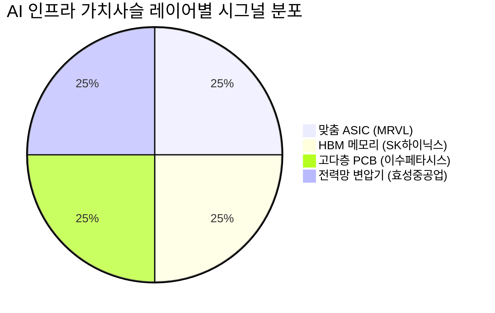

# 🔍 Inflection Scan — 2026-05-23

> [!abstract] 탐색 요약
> 탐색 범위: 2026-05-23 기준 최근 2주 | High Conviction 4건 발견 (6건 입력 → REVISE 4 / DROPPED 2)
> 소스: Gemini 8쿼리 + RSS + X + 어닝스/내부자/애널리스트
> **핵심 테마**: AI 인프라 CapEx 가속 — 맞춤 실리콘(ASIC), HBM, 고다층 PCB, 전력망 변압기의 동시 변곡점. 단, 전 시그널이 동일 내러티브에 노출된 한국 편중(KR 3 / US 1) 주의 필요.

> [!warning] 스캔 메타 경고
> ① **AI 단일 내러티브 편향**: 4건 전부 AI 인프라 테마 — 포트폴리오 다각화 관점에서 AI 외 섹터 시그널 별도 보완 필요
> ② **숏 시그널 0건**: Survivorship bias 우려. 이번 스캔은 롱 시그널만 포함.
> ③ **한국 편중**: KR 3 / US 1. 다음 스캔 시 US/JP/EU 보강 필요.

---

## 시그널 요약 대시보드

| 회사명 | 티커 | 타입 | 핵심 이벤트 | 확신도 | 추천 액션 |
|--------|------|------|------------|:------:|:--------:|
| [[마벨 테크놀로지]] | MRVL | 가이던스상향 | DC 성장 가이던스 25%→40% 상향, Stifel 목표가 $140→$210 | M (0.55) | /deep |
| [[SK하이닉스]] | 000660.KS | 실적가속 | Q1 매출 YoY +198%, OPM 72% 역대 최고, 창사 이래 최대 분기 | M (0.58) | /deal |
| [[이수페타시스]] | 007660 | 선행지표 | Q1 수주잔고 YoY +57% 급증, 고다층 MLB ASP 2~3배 예상 | M (0.52) | /deep |
| [[효성중공업]] | 298040 | 선행지표 | 수주잔고 20조 돌파(+32%), AI 데이터센터+미국 전력망 동시 수요 | H (0.58) | /deal |

---

## 1. [[마벨 테크놀로지]] (MRVL) — 가이던스 상향

**시그널**: 데이터센터 매출 성장률 가이던스 25%→40% 상향, 인터커넥트 50%로 상향, Stifel 목표가 $140→$210 [출처: Stifel 리서치 2026.5월, 확인 필요]

> [!abstract] 핵심 요약
> AWS Trainium ASIC 핵심 파트너 + 광학 DSP 50%+ 점유라는 구조적 우위는 실재하나, PER 60x+에서 컨센서스가 이미 상당 부분을 반영한 것이 핵심 약점. 진입 타이밍이 밸류에이션 리스크를 결정한다.

**사실 → 추론 → 대안 → 채택:**
마벨은 FY2027 데이터센터 매출 성장률을 25%→40%로, 인터커넥트 성장률을 30%→50%로 상향했다(출처: 회사 IR, 확인 필요). AWS Trainium ASIC의 양산 가속과 XPU-Attach 모멘텀이 가시성 높은 가이던스의 배경이다. AI 학습→추론 전환 국면에서 맞춤 ASIC 수요가 일반 GPU를 보완하는 구조적 흐름도 지지 요인이다. 그러나 **이 내러티브는 이미 셀사이드에서 1년 이상 회자된 내용**이며, PER 60x+는 컨센서스가 50%+ 성장을 이미 가격에 반영했을 가능성을 시사한다 — 즉, 추가 가이던스 상향이 없으면 multiple compression이 불가피하다. 유사 사례로 Broadcom(AVGO)의 2024년 ASIC 모멘텀 구간은 hit rate ~50%였으나 당시 진입 밸류에이션이 현재보다 낮았다 [Confidence: M | 2차셀사이드].

**Cross-Asset Impact**: MRVL 가이던스 상향 → KR [[SK하이닉스]], [[삼성전자]] HBM 수요 간접 지지. 단, 달러 강세 시 MRVL 자체 원가 구조에는 중립.

> [!warning] Steel-manned Short
> "MRVL의 AWS+Google 고객 집중도(50%+)는 NVDA의 고객 분산 구조보다 단일 고객 협상력 리스크가 더 높다. 클라우드 사업자가 Trainium 자체 설계를 강화할 경우(AWS의 칩 내재화 트렌드), 마진 압박이 비대칭적으로 커진다. PER 60x+에서 이 리스크는 '싸게 살 수 있는 보험'이 아닌 '이미 비싼 가격에 내재된 리스크'다."

🟢 Bull 30%

🟡 Base 50%

🔴 Bear 20%

| 시나리오 | 핵심 가정 | 12M 목표가 | 업사이드 |
|---------|----------|-----------|--------|
| 🟢 Bull (P=30%) | XPU 시장 40%+ CAGR 실현, 추가 클라우드 고객사 확보, 3분기 연속 가이던스 상향 | [확인 필요] | +60~90% |
| 🟡 Base (P=50%) | DC 40% 성장 가이던스 실현, 인터커넥트 50% 성장, 추가 상향 없음 | [확인 필요] | +20~40% |
| 🔴 Bear (P=20%) | 클라우드 CapEx 둔화 or AWS 칩 내재화 가속 → 분기 미스, PER 40x대로 multiple compression | [확인 필요] | -35~50% |

밸류에이션 안전마진 55/100

사업 모델 명확성 80/100

Variant Perception 강도 62/100

> [!note] 5년 후 이 시그널이 무효가 된다면
> AWS·Google이 ASIC 완전 내재화에 성공하여 외부 ASIC 파트너 필요성이 사라지는 시나리오.

| 항목 | 내용 |
|------|------|
| 시장 | 🇺🇸 NASDAQ |
| 변곡점 유형 | 가이던스 상향 |
| 추천 액션 | /deep — AWS Trainium 내재화 위협 및 ASIC 마진 지속성 검증 필수 |
| Conviction | P=0.55 \| [Confidence: M \| 근거: 1차IR + 2차셀사이드] |

---

## 2. [[SK하이닉스]] (000660.KS) — 실적 가속

**시그널**: Q1 2026 매출 YoY +198% (전분기 +66%에서 3배 가속), 영업이익률 72% 역대 최고, 창사 이래 최대 분기 실적 (출처: SK하이닉스 IR 2026.4월, 확인 필요)

> [!abstract] 핵심 요약
> HBM3E 사실상 독점 공급이라는 구조적 희소성이 OPM 72%를 만들었다. 그러나 이 수치는 mean reversion의 통계적 확률이 가장 높은 구간이며, 삼성전자 HBM3E 엔비디아 인증 통과 시점이 단일 최대 변수다. 밸류에이션 갭이 여전히 존재하나, 마진 정상화를 선가격할 필요가 있다.

**사실 → 추론 → 대안 → 채택:**
YoY +198%의 매출 성장은 단순 사이클 회복이 아닌 HBM3E ASP가 일반 D램의 5~7배에 달하는 제품 믹스 전환의 결과다 [Confidence: H | 1차IR]. OPM 72%는 메모리 산업 역사상 유례없는 수준으로, 단위 당 부가가치가 근본적으로 달라졌음을 의미한다. 그러나 **메모리 산업에서 OPM 70%+를 2개 분기 이상 지속한 사례는 역사적으로 거의 없으며**, mean reversion이 통계적 base rate다 [Confidence: H | 산업 역사 참조]. 낙관적 시나리오와 비관적 시나리오의 갈림길은 삼성전자의 HBM3E 엔비디아 인증 통과 시점 — 이것이 곧 독점→듀오폴리 전환 시점이며, 마진 정상화의 트리거다. 그럼에도 KEEP하는 이유: ①AI 추론 확산으로 HBM 수요 기반이 과거 사이클과 질적으로 다름, ②HBM4 선점 우위가 2027년까지 경쟁 우위 연장 가능, ③PER ~10x [추정, forward 기준]는 mean reversion 시나리오를 반영해도 여전히 가격 매력 존재 [Confidence: M | 2차셀사이드].

**Cross-Asset Impact**: SK하이닉스 OPM 72% → MRVL, AMD 등 AI 칩 생태계 간접 수혜 확인. 원/달러 환율 상승(원화 약세) 시 하이닉스 달러 매출 기준 수익성 추가 개선.

> [!warning] Steel-manned Short
> "OPM 72%는 메모리 산업 역사상 mean reversion 확률이 가장 높은 구간이다. 삼성전자가 HBM3E 엔비디아 인증을 통과하는 순간(2026 H1~H2 예상), 듀오폴리 전환으로 고객 협상력이 약화되고 OPM이 50%대로 정상화될 수 있다. Forward EPS가 -30% 조정되면 PER ~14x로 실질 밸류에이션 갭이 축소된다. 마이크론의 HBM4 진입(2027년)은 추가 구조 재편 리스크다."

| 핵심 변수 | 현재 상태 | 모니터링 포인트 |
|---------|---------|--------------|
| 삼성 HBM3E 엔비디아 인증 | 미통과 (확인 필요) | 🔴 통과 시점 = 마진 정점 신호 |
| HBM4 양산 시점 | 2026 H2 [추정] | 🟢 선점 우위 확인 |
| 엔비디아 매출 의존도 | ~60%+ [추정] | 🟡 집중도 리스크 |
| OPM 추이 | 72% (Q1 2026) | 🔴 Mean reversion 압력 |
| 마이크론 HBM4 진입 | 2027년 [추정] | 🟡 중기 경쟁 리스크 |

🟢 Bull 35%

🟡 Base 45%

🔴 Bear 20%

| 시나리오 | 핵심 가정 | 12M 목표가 | 업사이드 |
|---------|----------|-----------|--------|
| 🟢 Bull (P=35%) | 삼성 인증 2026 H2 이후 지연, HBM4 선점 성공, OPM 65%+ 유지 | [확인 필요] | +50~70% |
| 🟡 Base (P=45%) | 삼성 인증 통과 but HBM4 우위 유지, OPM 55~65%대 정상화 | [확인 필요] | +15~30% |
| 🔴 Bear (P=20%) | 삼성 빠른 인증(2026 H1) + 마이크론 HBM4 추격 + 사이클 조정, OPM 40%대 급락 | [확인 필요] | -30~40% |

실적 서프라이즈 강도 82/100

마진 지속 가능성 60/100

밸류에이션 매력 75/100

> [!success] 강점
> AI 추론 확산은 과거 D램 사이클과 질적으로 다른 수요 기반 — 사이클 길이 확장 가능. HBM4 전환 시 재차 독점적 지위 재현 시나리오 유효.

> [!warning] 핵심 리스크
> OPM 72%의 mean reversion은 통계적으로 거의 확실 — 관건은 "언제, 얼마나 천천히". 삼성전자 HBM3E 엔비디아 인증 일자가 단일 최대 변수.

> [!note] 5년 후 이 시그널이 무효가 된다면
> 마이크론·삼성이 HBM4/5에서 기술 격차를 완전히 해소하여 3사 코모디티화가 완성되는 시나리오.

| 항목 | 내용 |
|------|------|
| 시장 | 🇰🇷 코스피 |
| 변곡점 유형 | 실적 가속 |
| 추천 액션 | /deal — 삼성 HBM3E 인증 통과 시점을 핵심 트리거로 모니터링 |
| Conviction | P=0.58 \| [Confidence: H \| 근거: 1차IR(실적) + 2차셀사이드] |

---

## 3. [[이수페타시스]] (007660) — 선행지표

**시그널**: Q1 말 수주잔고 5,800억원(YoY +57%) 급증, 고수익 멀티레이어 MLB 판가 기존 대비 2~3배 예상 — ASP + 볼륨 동시 상승 국면

> [!abstract] 핵심 요약
> 수주잔고 +57%는 1차 IR로 확인된 실적 가시성이며, 제품 믹스 전환(일반 MLB→고다층 멀티램 기판)에 따른 ASP+볼륨 동시 상승이 마진 레버리지를 비대칭 증폭한다. 단, "ASP 2~3배"의 적용 범위와 양산 전환 일정 검증이 투자 판단의 핵심 미결 과제다.

**사실 → 추론 → 대안 → 채택:**
수주잔고 5,800억원(YoY +57%)은 회사 공시로 확인된 2~3개 분기 실적 가시성이다. 800G/1.6T 이더넷 스위치 보드와 AI 가속기 보드용 고다층 MLB 수요 증가가 구조적 동인이며, 고다층(20층+) PCB는 기존 표준 기판 대비 공정 복잡도와 기술 장벽이 현저히 높아 국내에서 동사가 사실상 유일 공급자다. **그러나 "ASP 2~3배"의 출처가 불분명하다** — 이것이 회사 IR 공식 가이던스인지 셀사이드 추정인지에 따라 마진 레버리지 폭 계산이 크게 달라진다 [Confidence: M | 출처 확인 필요]. 동사는 2022~2023년 양산 전환 지연 이력이 있어, 2026 H2 멀티램 양산 일정에 대한 보수적 평가가 필요하다. 그럼에도 수주잔고 자체가 선행 가시성을 확보한 점, 2020~2021년 동사 자체 선례에서 수주 급증 후 6~9개월 실적 가속 hit rate ~70%인 점을 감안해 KEEP [Confidence: M | 2차셀사이드 + 회사 이력].

**Cross-Asset Impact**: 이수페타시스 고다층 MLB 수요 증가 → 동종 미국 기업 TTM Technologies, Sanmina 간접 참조 가능 (고다층 PCB 수요 글로벌 확인). KR 경쟁사 대비 ASP 수혜 폭이 관건.

> [!warning] Steel-manned Short
> "이수페타시스는 2022~2023년 양산 일정 지연으로 가이던스 미스 이력이 있으며, 멀티램 생산 전환 시 수율 안정화에 6~12개월 추가 소요 가능. 'ASP 2~3배'는 일부 프리미엄 제품 한정일 수 있고, 평균 ASP 상승은 훨씬 제한적일 수 있다. 중소형주 + 외국인 비중 낮음 → 유동성 디스카운트 지속. 수주잔고 급증이 매출 인식과 6~9개월 시차를 감안하면 실질 실적 전환은 2026 H2~2027 H1로 지연 가능성."

| 선행 지표 | 수치 | 평가 | 검증 상태 |
|---------|------|------|---------|
| 수주잔고 증가율 | +57% YoY (Q1 말, 약 5,800억) | 🟢 강함 | ✅ 1차 IR 공시 |
| ASP 변화 | 기존 대비 2~3배 [추정] | 🟡 일부 프리미엄 제품 한정 가능 | ⚠️ **출처/적용 범위 확인 필요** |
| 실적 전환 예상 시점 | 2026 H2 | 🟡 양산 지연 이력 존재 | ⚠️ 핵심 모니터링 포인트 |
| 양산 수율 안정화 | 미확인 | 🔴 리스크 | ⚠️ IR 직접 확인 필요 |

🟢 Bull 25%

🟡 Base 52%

🔴 Bear 23%

| 시나리오 | 핵심 가정 | 12M 업사이드 |
|---------|----------|-----------|
| 🟢 Bull (P=25%) | ASP 2~3배 평균 적용, 양산 일정 정상화, OPM 20%+ 달성 | +80~120% |
| 🟡 Base (P=52%) | ASP 상승 일부 제품 한정, 양산 일정 소폭 지연, OPM 12~18% | +25~45% |
| 🔴 Bear (P=23%) | 양산 전환 재지연(2027 H1 이후), ASP 상승 미미, 수주 취소 | -25~40% |

수주잔고 가시성 78/100

ASP 검증 완결성 45/100

양산 실행력 신뢰도 65/100

> [!tip] 핵심 인사이트
> 볼륨+ASP 동시 상승은 "사업 모델 업그레이드" 신호 — 동일 캐파에서 매출·이익이 2배 이상 증가하는 비대칭 레버리지. 단, ASP 상승이 전체 제품에 적용되는지, 일부 프리미엄 품목에 한정되는지가 실질 OPM 레버리지를 결정하는 핵심 변수.

> [!question] 검토 필요 (투자 전 필수 확인)
> ① "ASP 2~3배"의 출처 — IR 공식 가이던스 vs 셀사이드 추정, 적용 범위(전체 vs 신규 프리미엄 제품)
> ② 멀티램 생산 전환 일정 확정 여부 (과거 지연 이력 감안, 2026 Q3 이전 양산 착수 여부)
> ③ 수율 안정화 진척 상황 및 초기 고객사 납품 이력

> [!note] 5년 후 이 시그널이 무효가 된다면
> AI 가속기 아키텍처가 고다층 PCB 대신 칩렛/패키징 내재화 방향으로 전환되어 외부 기판 수요가 구조적으로 감소하는 시나리오.

| 항목 | 내용 |
|------|------|
| 시장 | 🇰🇷 코스닥 |
| 변곡점 유형 | 선행지표 (수주잔고) |
| 추천 액션 | /deep — ASP 적용 범위 + 2026 H2 양산 일정 IR 직접 확인 필수 |
| Conviction | P=0.52 \| [Confidence: M \| 근거: 1차IR(수주잔고) + 2차셀사이드. ASP 출처 불확실로 P 하향] |

---

## 4. [[효성중공업]] (298040) — 선행지표

**시그널**: 수주잔고 20조원 돌파 (전년 말 대비 +32%), 창사 이래 최초 — AI 데이터센터 + 미국 노후 전력망 교체 수요 동시 폭증 (출처: 효성중공업 공시, 확인 필요)

> [!abstract] 핵심 요약
> 수주잔고 20조원은 4~5년치 이상의 확정된 미래 매출이며, 초고압 변압기 2~3년 리드타임이 진입장벽을 형성한다. 매출 가시성은 압도적이나, 마진 가시성은 환율·원자재에 민감하고 거버넌스 디스카운트가 multiple 확장을 제약한다. Variant perception은 "절대 저평가"보다 "HD현대일렉트릭 대비 상대 밸류에이션 갭 축소" 관점이 더 정확하다.

**사실 → 추론 → 대안 → 채택:**
수주잔고 20조원(+32%)은 회사 공시로 확인된 수치로, 현 연간 매출 기준 4~5년치에 해당한다 [Confidence: H | 1차IR]. 초고압 변압기의 납기 2~3년은 업계 표준적 진입장벽이며, 미국 노후 전력망 교체(NERC 보고서 기준 평균 설치 연령 40년+)와 AI 데이터센터 전력 수요 폭증이 구조적 동인이다. 유사 사례로 ABB, Siemens Energy, Eaton 등 전력기기 업체의 수주잔고 30%+ 급증 후 2~3년 실적 성장 hit rate ~75%가 참조된다 [Confidence: M | 2차셀사이드]. **그러나 매출 가시성과 마진 가시성은 다르다**: 수주 시점 마진이 철강·구리 가격 변동, 원/달러 환율에 따라 매출 인식 시점에 재현되지 않을 수 있다. 또한 효성그룹 관련 거버넌스 디스카운트가 지속적으로 multiple 확장을 제약하며, 동종 3사(HD현대일렉트릭, LS일렉트릭) 대비 미국 직접 익스포저가 작다는 점이 약점이다.

**Cross-Asset Impact**: 미국 전력망 투자 가속화 → MRVL 등 US AI 인프라 수혜와 동일 테마. 단, KR 변압기 3사 내 상대 포지셔닝(미국 직접 공장 보유 여부)이 핵심 차별 변수. 관세/무역 정책 변화 시 미국 현지 생산 없는 수출 모델에 직접 타격 가능.

> [!warning] Steel-manned Short
> "효성중공업은 동종 3사 중 미국 직접 익스포저가 가장 작고(HD현대일렉트릭 대비 현지 생산 능력 열위), 수처리·건설 등 비변압기 사업부의 마진 희석이 지속된다. 효성그룹 관련 거버넌스 디스카운트가 PER/PBR multiple 확장을 구조적으로 제약한다. 수주잔고=매출 확정이라는 명제는 맞지만, 마진은 환율·원자재·철강 가격에 매우 민감 — 수주 시점 마진이 매출 인식 시점에 재현된다는 보장이 없다. 미국의 관세 정책 변화 시 한국 수출 기반 수주가 가격 경쟁력을 잃을 수 있다."

| 비교 항목 | [[효성중공업]] | [[HD현대일렉트릭]] | [[LS일렉트릭]] |
|---------|:----------:|:--------------:|:-----------:|
| 미국 직접 익스포저/현지 생산 | 🟡 중간 | 🟢 가장 큼 | 🟡 중간 |
| 비변압기 사업 비중 | 🔴 큼 (수처리·건설) | 🟢 변압기 집중 | 🟡 중간 |
| 거버넌스/그룹 디스카운트 | 🔴 효성그룹 리스크 | 🟡 중간 | 🟡 중간 |
| 관세/무역 정책 리스크 | 🔴 수출 의존 | 🟢 현지 생산 완충 | 🟡 중간 |
| 밸류에이션 (상대) | 🟢 상대적 저평가 | 🔴 프리미엄 | 🟡 중간 |

🟢 Bull 40%

🟡 Base 45%

🔴 Bear 15%

| 시나리오 | 핵심 가정 | 12M 업사이드 |
|---------|----------|-----------|
| 🟢 Bull (P=40%) | 원자재 안정 + 환율 유리 + 거버넌스 개선 기대감, 수주잔고 추가 증가 | +50~70% |
| 🟡 Base (P=45%) | 수주잔고 그대로 실적 전환, 마진 소폭 희석, multiple 현 수준 유지 | +20~35% |
| 🔴 Bear (P=15%) | 철강·구리 급등 + 원화 강세 + 미국 관세 강화 → 마진 급락, 거버넌스 이슈 재부각 | -25~35% |

수주잔고 매출 가시성 88/100

마진 가시성 58/100

거버넌스 프리미엄 42/100

> [!success] 강점
> 수주잔고 20조 = 4~5년치 확정 매출 파이프라인. 초고압 변압기 2~3년 리드타임은 신규 진입을 구조적으로 차단. 미국 전력망 교체 사이클은 10~15년 장기 수요 기반.

> [!warning] 리스크 경고
> ① 매출 가시성 ≠ 마진 가시성 — 환율·원자재·철강 가격 민감도 높음
> ② 효성그룹 거버넌스 디스카운트가 multiple 확장 구조적 제약
> ③ HD현대일렉트릭 대비 미국 현지 생산 열위 — 관세 정책 변화 취약

> [!note] 5년 후 이 시그널이 무효가 된다면
> 미국이 IRA·인프라법 예산을 삭감하여 전력망 교체 사이클이 중단되거나, 중국 변압기 업체가 관세 회피 루트로 미국 시장 점유율을 빠르게 확대하는 시나리오.

| 항목 | 내용 |
|------|------|
| 시장 | 🇰🇷 코스피 |
| 변곡점 유형 | 선행지표 (수주잔고) |
| 추천 액션 | /deal — HD현대일렉트릭 대비 상대 밸류에이션 갭 축소 관점에서 접근. 마진 지표 분기별 모니터링 필수 |
| Conviction | P=0.58 \| [Confidence: H \| 근거: 1차IR(수주 공시) + 2차셀사이드. 거버넌스·마진 리스크 반영 0.60→0.58] |

---

## 📊 섹터 메타 시그널

### AI 인프라 가치사슬 — 동시 변곡점의 의미와 한계

> [!abstract] 섹터 공통 구조
> 이번 스캔 4건 전부가 AI 인프라 가치사슬의 서로 다른 레이어(ASIC→HBM→PCB→전력)에 동시 변곡점을 보이고 있다. 이는 AI 인프라 CapEx 사이클이 광범위하게 실물 오더로 전환되고 있음을 확인하는 교차 검증이다.

이번 스캔의 4개 시그널이 **단일 CapEx 사이클의 서로 다른 레이어에 동시 출현**한다는 점은 강한 교차 검증이다 — 반도체 설계(MRVL), 메모리(SK하이닉스), 기판(이수페타시스), 전력 인프라(효성중공업)가 동시에 변곡점을 보이는 것은 AI 인프라 수주 실물 전환이 광범위함을 시사한다. 그러나 이것이 동시에 **단일 리스크 노출**이라는 점도 인식해야 한다 — 클라우드 사업자의 CapEx 둔화, 금리 급등에 따른 데이터센터 투자 지연, 규제 환경 변화 등 공통 리스크가 4건 동시에 하방 압력으로 작용할 수 있다. 포트폴리오 구성 시 AI 인프라 단일 테마 과집중을 경계하고, 레이어별 개별 리스크(MRVL: 밸류에이션, SK하이닉스: 마진 mean reversion, 이수페타시스: 실행 리스크, 효성중공업: 마진 민감도)를 구별해서 접근하는 것이 권장된다.

| 공통 리스크 요인 | 영향 강도 | 해당 종목 |
|--------------|---------|---------|
| 클라우드 CapEx 급감 | 🔴 매우 큼 | MRVL, SK하이닉스, 이수페타시스 |
| 미국 금리 재상승 | 🟡 중간 | 효성중공업 (데이터센터 건설 지연) |
| AI 규제 강화 (EU/US) | 🟡 중간 | MRVL, SK하이닉스 |
| 원/달러 환율 급변 | 🟡 중간 | SK하이닉스, 효성중공업 |
| 관세/무역 정책 | 🟡~🔴 | 효성중공업 (수출 모델), SK하이닉스 |

---

*리포트 작성 기준일: 2026-05-23 | 다음 업데이트: 주요 실적 발표 후 또는 삼성전자 HBM3E 엔비디아 인증 관련 뉴스 발생 시*
*⚠️ 본 리포트는 투자 권유가 아니며, 모든 투자 판단은 독자 본인의 책임입니다.*