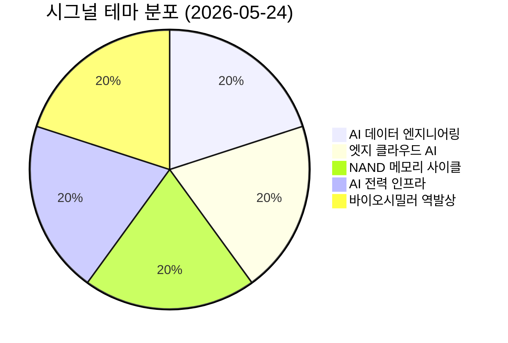

# 🔍 Inflection Scan — 2026-05-24

> [!abstract] 탐색 요약
> 탐색 범위: 2026-05-24 기준 최근 2주 | High Conviction **5건** (REVISE 완료)
> 소스: 1차 IR(실적/계약 공시) + 셀사이드 + X/RSS 크로스체크
> **핵심 테마**: AI 인프라 수요 가시화 → 데이터 엔지니어링·엣지 클라우드·전력·바이오시밀러 변곡점 동시다발 — 단, 전 시그널에 걸쳐 **conviction 과대 평가 경향** 확인 후 하향 조정

> [!warning] 포트폴리오 집중 경고
> 5건 중 4건이 AI 인프라 테마와 직·간접 연결. AI CapEx 둔화 충격 발생 시 **동조 하락** 위험 높음. 비AI 역발상(셀트리온)에 상대적 비중 우위 고려 권장.

---

## 시그널 요약 대시보드

| 회사명 | 티커 | 타입 | 핵심 이벤트 | 확신도 | 추천 액션 |
|--------|------|------|-------------|:------:|:--------:|
| [[이노데이터]] | INOD | 실적가속+가이던스상향 | Q1 매출 YoY +54%, EPS 컨센 5배 초과, 가이던스 40%+로 상향 | P=0.42 🟡 | /deep (고객 집중도 10-K 확인 우선) |
| [[아카마이 테크놀로지스]] | AKAM | 사업변곡점 | Anthropic 7년·18억 달러 엣지 AI 계약 체결, 주가 +26% | P=0.48 🟡 | /deal (섹터 확장 프레임, NET 동반 모니터링) |
| [[키옥시아 홀딩스]] | 285A.T | 실적가속+가이던스상향 | FY2027 Q1 가이던스 YoY +410% 매출·+4,700% 순이익, 컨센 대비 +50%/+114% | P=0.45 🟡 | /deep (사이클 위치 확인 필수) |
| [[가온전선]] / [[LS전선]] | 000500 / 006260 | 사업변곡점 | 메타(추정)와 5년·4조 원 버스덕트 장기 공급계약 — 업계 최대 | P=0.42 🟡 | /deal (LS전선 경유, 계약 고객 익명 유의) |
| [[셀트리온]] | 068270 | 역발상 | Q1 영업이익 YoY +115% 역대 최대 + 자사주 2조 원 소각 — 주가 저평가 지속 | P=0.48 🟡 | /deal (관세 리스크 모니터링 병행) |

---

## 1. [[이노데이터]] (INOD) — 실적가속 + 가이던스상향

**시그널**: Q1 2026 매출 YoY +54%, EPS 0.42달러로 컨센서스 5배 초과, 연간 가이던스 35% → 40%+ 성장으로 상향

> [!abstract] 핵심 요약
> BPO(노동집약 라벨링) → IP(소프트웨어 워크플로우) 전환이 실제 영업 레버리지로 나타난 첫 신호. 단, 2024년 동일 패턴(가이던스 상향 → +400% 후 -60% 조정) 반복 가능성과 빅테크 고객 집중도가 핵심 검증 변수.

**사실 → 추론 → 대안 → 채택**

Q1 2026 매출 9,010만 달러(YoY +54%), EPS 0.42달러(컨센서스 대비 약 5배) [출처: Innodata Q1 2026 실적 발표 IR]. **사실**: 단 1개 분기 데이터이며 최대 고객 1개사(Microsoft 추정)가 매출의 40%+ 차지(INOD 10-K 기준) — 이는 '고객 집중도 가정'이 아닌 공시 사실로 취급해야 한다. **추론**: IP 모델 전환이 추가 인력 없이 수익을 높이는 구조라면 진성 영업 레버리지이나, 이를 입증하는 데이터는 현재 1개 분기뿐이어서 단정은 이르다. **대안 가설**: ① 빅테크 LLM 학습 데이터 수요 일시적 spike 후 합성 데이터로 대체, ② Scale AI 등 경쟁사 가격 압박, ③ 구조적 전환 진행 중. **채택**: 시그널은 유효하나 2024년 동일 패턴의 반복이라는 점에서 반복 변곡점의 base rate(첫 변곡점 대비 ~30% 낮음 [추정])를 적용, conviction을 0.52→0.42로 하향한다.

🟢 Bull 25%

🟡 Base 45%

🔴 Bear 30%

| 시나리오 | 핵심 가정 | 12개월 목표 | 업사이드 |
|----------|-----------|-------------|---------|
| 🟢 **Bull** | IP 전환 레버리지 지속, 2-3개 추가 빅테크 계약, 고객 집중도 완화 | $28–32 | +60~80% |
| 🟡 **Base** | 가이던스 40%+ 달성, 고객 집중도 현 수준 유지, 마진 소폭 개선 | $20–24 | +15~35% |
| 🔴 **Bear** (Smart Short) | 합성 데이터 대체 가속 + MS 계약 규모 축소. "INOD는 빅테크 일시 outsourcing 수혜자 — 라벨링 워크플로우는 진정한 IP 자산 아님. 경쟁사 진입 시 ASP 즉시 압축, 2024년 +400% → -60% 패턴 재현." | $8–10 | -45~-55% |

실적 서프라이즈 강도 82/100

고객 집중도 안전성 35/100

IP 전환 구조적 지속성 55/100

> [!warning] Kill Criteria — 매도 트리거
> ① 최대 고객(MS 추정) 비중이 Q2에서도 40%+ 지속 확인 시 포지션 50% 축소
> ② 합성 데이터 생성 비용이 실제 라벨링 대비 -50% 이하로 하락 공개 보고 시 전량 청산
> ③ 연간 가이던스 하향 수정 시 즉시 청산

> [!note] Inversion — 5년 후 이 시그널이 무효가 된다면
> LLM 학습 데이터 수요가 합성 데이터로 80%+ 대체되거나, 빅테크가 데이터 엔지니어링을 100% in-house화. Scale AI의 합성 데이터 부문 급성장이 선행 지표.

> [!note] Cross-Asset Impact
> KR: 크래프톤·펄어비스 등 AI 데이터 라벨링 관련주 직접 영향 미미. 단 AI 인프라 투자 둔화 신호로 해석 시 국내 AI 서버 수혜주(한미반도체 등) 동반 약세 가능.

| 항목 | 내용 |
|------|------|
| 시장 | 🇺🇸 NASDAQ |
| 변곡점 유형 | 실적가속 / 가이던스상향 |
| 추천 액션 | /deep — 10-K 고객 집중도 확인 후 포지션 결정. 진입 전 Q2 실적으로 레버리지 구조 재확인 필수 |
| Conviction | P=0.42 [Confidence: M \| 근거: 1차IR + 10-K 고객 집중도 확인 필요] |

---

## 2. [[아카마이 테크놀로지스]] (AKAM) — 사업변곡점

**시그널**: Anthropic과 7년, 18억 달러 규모 AI 추론 인프라 장기 계약 체결 [출처: Akamai 공시 2026.5月], 주가 단기 +26% 반응

> [!abstract] 핵심 요약
> AI 추론의 엣지 이동 thesis를 Anthropic이 실제 계약으로 검증한 첫 사례. 단, 이는 AKAM 단독 해자가 아닌 **엣지 클라우드 섹터 전반의 재평가 신호**로 읽어야 한다. 계약 마진 구조 미공개가 핵심 불확실성.

**사실 → 추론 → 대안 → 채택**

Anthropic-AKAM 7년 18억 달러 계약은 공시 확인 사실이며, 연 ACV 약 2.57억 달러는 산술적으로 검증 가능하다. AKAM의 4,000+ PoP(Points of Presence)는 실재하는 물리적 자산이나, Cloudflare(330+ PoP, 더 현대적 아키텍처)와 Fastly가 같은 영역에서 더 공격적으로 경쟁 중이라는 점에서 AKAM 독점 해자 주장은 과도하다 [Confidence: L | 근거: 3차추정]. **핵심 문제**: CDN 기존 사업이 연 -5~-10% 역성장 중이며, 클라우드/엣지가 +30% 성장해도 전체 매출 가속까지 2-3년이 소요된다. Anthropic 계약 ACV 2.57억 달러는 AKAM 연매출 약 36억 달러의 7%에 불과하다 [추정]. **채택**: "AKAM 단독 수혜"가 아닌 "엣지 클라우드 섹터 재평가"의 카탈리스트로 프레임 전환이 타당하다.

🟢 Bull 30%

🟡 Base 42%

🔴 Bear 28%

| 시나리오 | 핵심 가정 | 12개월 목표 | 업사이드 |
|----------|-----------|-------------|---------|
| 🟢 **Bull** | Anthropic 레퍼런스로 2-3개 AI 기업 추가 계약, CDN 역성장 조기 바닥, 엣지 마진 개선 | $130–145 | +35~50% |
| 🟡 **Base** | 18억 달러 계약 ARR 전환 순조, CDN 역성장 지속되나 엣지로 상쇄, 마진 구조 미확인 | $105–115 | +10~20% |
| 🔴 **Bear** (Smart Short) | "18억 달러 계약은 AKAM이 가격 덤핑한 결과. CDN 매출 감소를 일부 상쇄하는 데 그치고, Cloudflare가 동일 AI 고객을 더 저렴하게 수주. GPM 미공개가 시사하는 낮은 마진 구조 현실화." | $65–75 | -25~-35% |

계약 규모 / 레퍼런스 가치 78/100

마진 구조 투명성 38/100

엣지 경쟁 우위 지속성 60/100

> [!tip] 투자 액션 포인트
> AKAM 단독 포지션보다 **AKAM + [[Cloudflare]](NET) 페어** 또는 엣지 클라우드 바스켓으로 접근. 계약 GPM(Gross Profit Margin) 공시 여부를 다음 IR에서 반드시 확인 — 미공개 지속 시 Bear 시나리오 가중치 상향.

> [!note] Inversion — 5년 후 이 시그널이 무효가 된다면
> AI 추론이 엣지가 아닌 클라우드 중앙집중형으로 다시 회귀하거나, Cloudflare가 AI 기업 엣지 계약을 독식하면서 AKAM은 레거시 CDN 지위에만 머무는 경우.

> [!note] Cross-Asset Impact
> KR: AI 추론 엣지 인프라 수요 증가 → 삼성전자·SK하이닉스 LPDDR/온디바이스 AI 메모리 수혜 논리 간접 지지. AKAM 계약이 AI 추론 수요 구조화의 증거로 읽힐 경우 국내 AI 서버 전력·냉각 관련주(HD현대일렉트릭 등) 모멘텀 지속 가능.

| 항목 | 내용 |
|------|------|
| 시장 | 🇺🇸 NASDAQ |
| 변곡점 유형 | 사업변곡점 (엣지 AI 리포지셔닝) |
| 추천 액션 | /deal — 단, "계약 GPM 공시 확인" 선행. NET 동반 모니터링 필수 |
| Conviction | P=0.48 [Confidence: M \| 근거: 1차IR(계약 공시) + GPM 구조 미공개] |

---

## 3. [[키옥시아 홀딩스]] (285A.T) — 실적가속 + 가이던스상향

**시그널**: FY2027 Q1 가이던스 매출 YoY +410%, 순이익 YoY +4,700%(약 48배), 셀사이드 컨센서스 대비 매출 +50%·순이익 +114% 초과 [출처: Kioxia Holdings IR 가이던스 발표 2026.5月]

> [!abstract] 핵심 요약
> NAND 슈퍼사이클 + AI 스토리지 수요 구조화의 강력한 정량적 신호. 그러나 2017·2021 사이클에서 **가이던스 정점 발표가 종종 ASP 고점과 일치**했다는 역사적 함정에 유의. "PER 5-8x 저평가" 논거는 메모리 사이클에서 반복된 착시이므로 폐기한다.

**사실 → 추론 → 대안 → 채택**

Kioxia FY2027 Q1 가이던스: 매출 전년 동기 대비 약 5.1배(+410%), 순이익 약 48배(+4,700%) [출처: Kioxia Holdings IR]. 컨센서스 대비 매출 +50%, 순이익 +114% 초과는 매우 강력한 서프라이즈다. **그러나**: 2017년 NAND 슈퍼사이클에서 삼성·도시바(현 Kioxia)의 실적 발표 이후 6-12개월 내 ASP -40% 하락이 발생했고, 2021년 사이클도 동일 패턴이 반복됐다. 가이던스 발표 시점이 오히려 사이클 고점의 선행 지표였던 것이다. **대안 가설**: ① AI 구조적 수요로 이번 사이클은 길게 지속, ② 전형적 메모리 사이클로 12-18개월 후 급락, ③ YMTC(중국 양쯔메모리) 공격적 증산으로 사이클 축약. **채택**: 강력한 시그널임은 분명하나 진입 시점보다 **사이클 위치 파악**이 더 중요. 베인캐피털 지분 매도 압력도 기존에 누락된 리스크다.

🟢 Bull 25%

🟡 Base 45%

🔴 Bear 30%

| 시나리오 | 핵심 가정 | 12개월 목표 | 업사이드 |
|----------|-----------|-------------|---------|
| 🟢 **Bull** | AI 스토리지 수요 구조화로 NAND ASP 고수준 유지 18개월+, Kioxia 점유율 확대 | ¥3,800–4,200 | +50~65% |
| 🟡 **Base** | 가이던스 달성, 사이클 12개월 유지 후 완만한 ASP 조정, 순이익 증가 YoY +30~50% 확정 | ¥2,800–3,200 | +10~25% |
| 🔴 **Bear** (Smart Short) | "메모리 PER 5-8x는 항상 사이클 정점의 착시. 정상화 mid-cycle 이익 기준 실제 PER 15-20x로 비쌈. 삼성·SK·마이크론 동시 증산 결정 → 6개월 내 ASP -30~-40% 하락. 베인캐피털 대규모 지분 매도 오버행 현실화." | ¥1,200–1,600 | -40~-55% |

실적 서프라이즈 절대값 90/100

사이클 안전 진입 확신 32/100

AI 구조 수요 차별화 지속성 58/100

> [!warning] Kill Criteria — 매도 트리거
> ① 삼성전자·SK하이닉스가 NAND 증산 계획 공식 발표 시 즉각 경계 모드
> ② NAND 계약가 ASP가 전분기 대비 -10% 이상 하락 보고 시 포지션 50% 축소
> ③ 베인캐피털 대규모 블록딜 공시 시 즉시 대응

> [!note] Inversion — 5년 후 이 시그널이 무효가 된다면
> NAND 사이클이 2017/2021과 동일하게 작동해 가이던스 발표가 사이클 정점 신호였던 것으로 판명. YMTC의 기술 추격 가속이 구조적 공급 과잉을 야기하는 경우.

> [!note] Cross-Asset Impact
> KR: 키옥시아 사이클 호황 → [[SK하이닉스]]·[[삼성전자]] NAND 부문 실적 기대 상향 논리 강화. 단, 사이클 정점 신호로 읽힐 경우 오히려 역설적 매도 압력. 환율(¥/₩)은 이 포지션에 추가 변수 — 엔화 강세 시 원화 환산 수익 감소.

| 항목 | 내용 |
|------|------|
| 시장 | 🇯🇵 TSE |
| 변곡점 유형 | 실적가속 / 가이던스상향 (사이클 후반 가능성 병존) |
| 추천 액션 | /deep — 사이클 위치 파악(ASP 추이, 경쟁사 증산 동향) 선행 후 진입 여부 결정. 단독 포지션 보다 [[SK하이닉스]] 헤지 페어 검토 |
| Conviction | P=0.45 [Confidence: M \| 근거: 1차IR + 메모리 사이클 양면 base rate] |

---

## 4. [[가온전선]] / [[LS전선]] (000500 / 006260) — 사업변곡점

**시그널**: 메타(추정 — 공시상 고객명 익명)와 5년·4조 원 규모 버스덕트 장기 공급계약 체결 [출처: 가온전선 공시 2026.5月] — 국내 전선·전력기기 업계 사상 최대 단일 계약

> [!abstract] 핵심 요약
> AI 데이터센터 전력 밀도 급증이 버스덕트 수요를 구조적으로 창출한다는 thesis의 첫 대형 계약 실증. 그러나 ① 고객명이 '추정'이며 ② 한국 전선주는 이미 2024-2025년 +200~+300% 상승 후 valuation 부담 상태. "Transformational"이 아닌 "Meaningful" 계약으로 프레임을 조정해야 한다.

**사실 → 추론 → 대안 → 채택**

가온전선 5년·4조 원 계약은 공시 확인 사실이다 [출처: 가온전선 공시]. **단, 고객사 '메타'는 추정이며 공시상 익명 처리됨** — 이것이 시그널의 가장 큰 약점이다. 연간 계약 규모는 약 8,000억 원으로, LS전선 연매출 7.58조 원 대비 +10.5%에 해당한다 [추정]. 이는 의미 있는(Meaningful) 숫자이지만, 주가를 다시 +50~+100% 밀어 올릴 Transformational 규모는 아니다. LS일렉트릭이 같은 날 7,000만 달러 계약을 동시 공시했다는 점에서 시장이 이미 이 정보를 반영하고 있을 가능성이 높다. **채택**: AI 데이터센터 전력 수요 구조화 논리는 valid하나, 진입 시점에서의 valuation 부담과 고객 익명성이 conviction을 제약한다.

🟢 Bull 28%

🟡 Base 42%

🔴 Bear 30%

| 시나리오 | 핵심 가정 | 12개월 목표 | 업사이드 |
|----------|-----------|-------------|---------|
| 🟢 **Bull** | 고객 메타 확인 + 2-3개 빅테크 추가 계약, 구리 가격 안정, 원/달러 환율 유리 | LS전선 +45~60% | 상당 |
| 🟡 **Base** | 현 계약 순조 진행, 추가 계약 1건, 연 8,000억 원 매출 기여 확인 | LS전선 +15~25% | 보통 |
| 🔴 **Bear** (Smart Short) | "한국 전선주는 이미 PER 25x+, EV/EBITDA 15x+로 글로벌 피어 대비 프리미엄. 4조 원/5년 = 연 8,000억 원으로 LS전선 매출의 +10.5%에 불과 — 'Meaningful하지만 Transformational 아님'. 메타 CapEx -20% 삭감 또는 환율 -10% 이동 시 계약 실질 가치 압축. 고객 익명이 해제되지 않으면 재계약 리스크 평가 불가." | LS전선 -20~-30% | 하락 |

계약 규모 / 업계 상징성 85/100

고객 정체 투명성 30/100

밸류에이션 진입 매력 52/100

> [!question] 투자 구조 주의
> 가온전선은 비상장 자회사이므로 직접 투자가 불가능하며, LS전선을 통한 간접 노출 시 지주 구조 dilution 효과 발생. 가온전선 실적이 LS전선 연결 재무에 어느 정도 비중으로 반영되는지 확인 필요.

> [!note] Inversion — 5년 후 이 시그널이 무효가 된다면
> 메타가 데이터센터 CapEx를 대폭 삭감하거나, 버스덕트 방식이 液冷(액체 냉각) 직접 전력 방식으로 대체되어 버스덕트 수요 자체가 감소하는 경우.

> [!note] Cross-Asset Impact
> US: 미국 전력 인프라 관련주([[Eaton Corporation]], [[Vertiv Holdings]]) 동일 thesis 적용 — AI 데이터센터 전력 밀도 증가가 글로벌 전력기기 수요를 구조적으로 끌어올리고 있음을 재확인. 환율(원/달러): 계약이 달러화 기준일 경우 원화 강세 시 원화 환산 매출 감소 리스크.

| 항목 | 내용 |
|------|------|
| 시장 | 🇰🇷 코스피 |
| 변곡점 유형 | 사업변곡점 (AI 데이터센터 전력 수요 구조화) |
| 추천 액션 | /deal — LS전선 경유 진입, 단 고객사 실명 확인 및 추가 계약 공시 대기 후 비중 확대 |
| Conviction | P=0.42 [Confidence: M \| 근거: 1차IR(계약 공시) + 고객명 추정 + 기존 valuation 부담] |

---

## 5. [[셀트리온]] (068270) — 역발상 기회

**시그널**: Q1 2026 매출 1조 1,450억 원(YoY +36%), 영업이익 3,219억 원(YoY +115%) 역대 최대 [출처: 셀트리온 Q1 2026 실적 발표 IR 2026.5月] + 자사주 2조 원 소각 포함 주주가치 제고 발표에도 주가 저평가 구간 유지

> [!abstract] 핵심 요약
> 펀더멘탈 가속(매출+36%, 영업이익+115%) + 대규모 주주환원(자사주 2조 소각)이 동시에 발생하는 강력한 역발상 조합. 단, 트럼프 행정부의 의약품 관세 리스크가 시그널 가치의 절반에 달하는 무게를 갖는다는 점에서 **관세 리스크를 핵심 변수로 격상**해야 한다.

**사실 → 추론 → 대안 → 채택**

Q1 2026 매출 1조 1,450억 원(YoY +36%), 영업이익 3,219억 원(YoY +115%), 영업이익률 28.1% [추정] — 모두 1차 IR 확인 수치. 자사주 2조 원 소각은 발표 사실이나, **이것이 ROE의 본질적 개선인지 단순 EPS 부스트인지는 별도 검증이 필요하다**: 자사주 소각 재원이 차입이면 ROE 개선 아닌 부채 증가다. **핵심 리스크**: 셀트리온 미국 시장 매출 비중은 35-40%로 추정되며 [Confidence: M | 근거: 2차셀사이드 추정], 트럼프 행정부가 바이오시밀러 포함 의약품에 15-25% 관세를 부과할 경우 영업이익에 직접 타격이 간다. **대안 가설**: ① 관세 면제로 mean reversion 실현, ② 관세 부과로 주가 추가 하락 정당화, ③ EU 시장 성장이 미국 리스크 상쇄. **채택**: 시그널은 진성 역발상 setup이나 관세 리스크 해소 전까지 포지션 크기를 제한한다.

🟢 Bull 30%

🟡 Base 40%

🔴 Bear 30%

| 시나리오 | 핵심 가정 | 12개월 목표 | 업사이드 |
|----------|-----------|-------------|---------|
| 🟢 **Bull** | 트럼프 의약품 관세 면제 확정, 바이오시밀러 신규 품목 승인, EU 시장 M/S 확대, 자사주 소각 완료 | ₩185,000–210,000 | +45~65% |
| 🟡 **Base** | 관세 불확실성 지속, 미국 매출 방어, 영업이익 YoY +70~90% 유지, 주가 점진적 재평가 | ₩145,000–165,000 | +15~30% |
| 🔴 **Bear** (Smart Short) | "한국 바이오 디스카운트는 이유 있음: 글로벌 빅파마 대비 R&D 1/10, 바이오시밀러 ASP 연 -5~-10% commodity화 진행. 트럼프 의약품 관세 15-25% 현실화 시 미국 매출(35-40% 추정) 마진 직격 — 영업이익 -20~-30% 임팩트. 자사주 소각은 EPS 착시일 뿐 ROE 본질 개선 아님. 경쟁 바이오시밀러 진입 가속." | ₩85,000–100,000 | -20~-35% |

펀더멘탈 가속 강도 88/100

관세 리스크 안전성 42/100

주주환원 지속 가능성 65/100

> [!warning] 핵심 리스크 — 트럼프 관세
> 미국 의약품 관세 행정명령 발동 시 셀트리온 미국 매출(35-40% 추정)에 직접 타격. 관세율 15% 가정 시 영업이익 -20~-30% 임팩트 추정 [Confidence: M | 근거: 3차추정]. 관세 협상 동향을 포지션 크기 조절의 1차 트리거로 설정할 것.

> [!question] 검증 필요 — 자사주 소각의 질
> 자사주 2조 원 소각의 재원이 자체 현금인지 차입인지 확인 필수. 차입 기반 소각이면 ROE 개선 아닌 재무 레버리지 증가로 해석 전환 필요.

> [!note] Inversion — 5년 후 이 시그널이 무효가 된다면
> 트럼프 관세가 바이오시밀러 포함 의약품 전반에 고율 적용되어 미국 시장 수익성이 구조적으로 훼손되거나, 글로벌 빅파마가 바이오시밀러 시장에 직접 진입해 ASP 하락을 가속하는 경우.

> [!note] Cross-Asset Impact
> US: 미국 바이오시밀러 관세 리스크는 [[Amgen]], [[Pfizer]] 등 바이오시밀러 사업 보유 빅파마에게 오히려 경쟁 보호 효과 — 역설적으로 US 빅파마 수혜 가능성. 한국 바이오 섹터 전반(삼성바이오로직스 등)도 동일 관세 압력에 노출.

| 항목 | 내용 |
|------|------|
| 시장 | 🇰🇷 코스피 |
| 변곡점 유형 | 역발상 (펀더멘탈 가속 + 주주환원 vs 정책 리스크) |
| 추천 액션 | /deal — 관세 리스크 모니터링 병행, 전체 목표 비중의 50% 우선 진입 후 관세 협상 명확화 시 추가 |
| Conviction | P=0.48 [Confidence: M \| 근거: 1차IR(Q1 실적+자사주 공시) + 관세 리스크 미해소] |

---

## 📊 섹터 메타 시그널

### AI 인프라 전력·엣지·데이터 — 동조 리스크 경고

> [!warning] 테마 집중 경고 (5건 중 4건)
> 이번 스캔 5개 시그널 중 4개(INOD, AKAM, 가온전선/LS전선, 키옥시아)가 직·간접적으로 AI 인프라 수요와 연결된다. 이는 단일 매크로 충격 — **AI CapEx 둔화, 미국 반도체 수출 규제 강화, 빅테크 지출 삭감** — 시 4개 포지션이 동조 하락할 수 있음을 의미한다. 셀트리온(역발상, 비AI)의 상대적 비중 우위 고려가 포트폴리오 리스크 측면에서 유효하다.

**공통 모니터링 지표**:
- 빅테크(MS·Meta·Google·Amazon) 분기별 CapEx 가이던스 — 전 시그널 공통 선행지표
- 미국 AI 관련 행정명령 및 반도체 수출 규제 변화
- NAND/DRAM ASP 월별 계약가 (DRAMeXchange 기준)
- 원/달러, 원/엔 환율 — KR·JP 시그널 공통 영향

---

> [!failure] 스캔 한계 및 다음 스캔 보정 사항
> **① 변곡점 vs 모멘텀 혼동**: 키옥시아·가온전선·INOD는 이미 진행 중인 모멘텀의 연장으로, 진정한 "첫 변곡점"보다 "모멘텀 지속 확인" 성격이 강함. 다음 스캔에서 변곡점 정의를 더 엄격히 적용할 것.
> **② Survivorship Bias**: 성공 사례(EPAM, Anthropic 등) 위주 비교 — 실패 사례(Appen, Veritone 등 AI 라벨링 몰락주) 포함 분석 필요.
> **③ AI 테마 과집중**: 다음 스캔에서 비AI 섹터(에너지, 전통 소비재, 리오프닝) 시그널을 의도적으로 탐색할 것.