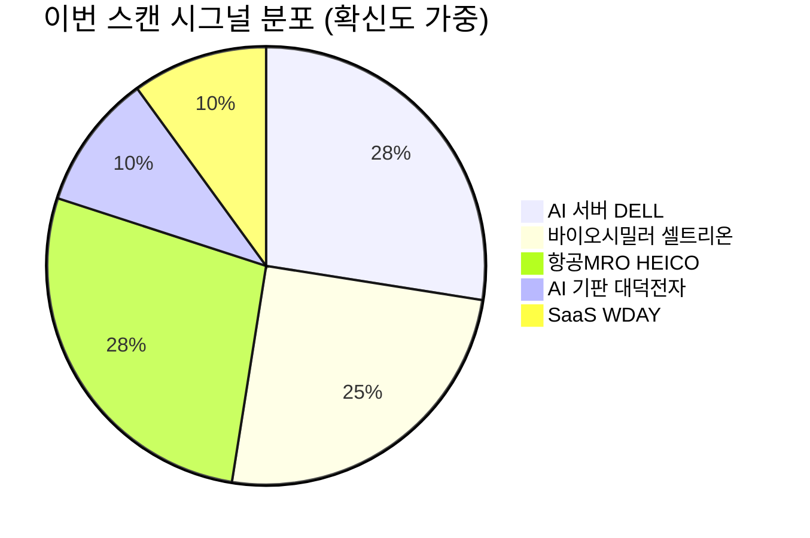

# 🔍 Inflection Scan — 2026-05-29

> [!abstract] 탐색 요약
> **탐색 범위**: 2026-05-29 기준 최근 2주 | High Conviction **5건** 확정 (1건 DROP)
> **소스**: 1차 IR(실적·가이던스) + 셀사이드 리포트 + 공시 데이터
> **핵심 테마**: AI 인프라 CapEx 가속이 서버(DELL)·기판(대덕전자)·SaaS(WDAY)로 파급되는 구조적 수혜 vs. 마진 지속성 검증 필요 — "매출 성장은 확인, OPM 궤적은 미확인" 국면

> [!warning] 메타 편향 경고 (M3 Self-Critique)
> 이번 스캔 5건 중 4건이 AI 수혜 내러티브에 편중 → **Recency Bias** 가능성. 모든 Bull+Base 확률 합산 75~80%로 낙관 편향 존재. 아래 시그널을 읽을 때 "AI 거품 시나리오에서도 이 논리가 성립하는가?"를 병행 검토 권장.

---

## 시그널 요약 대시보드

| 회사명 | 티커 | 타입 | 핵심 이벤트 | 확신도 | 추천 액션 |
|--------|------|------|------------|:------:|:--------:|
| [[Dell Technologies]] | DELL | 가이던스상향/실적가속 | FY2027 가이던스 +19% 상향, AI 서버 백로그 490억 달러 사상 최고 | P=0.55 🟡 | /deal |
| [[셀트리온]] | 068270.KS | 실적가속/구조적변곡점 | Q1 OPM 28.1%(YoY +115.5%), 고마진 믹스 60% 달성 | P=0.50 🟡 | /deal |
| [[Workday]] | WDAY | 가이던스상향/구조적변곡점 | OPM 가이던스 30.5% 제시, 장외 +10% 급등 | P=0.48 🟠 | /deep 보류 |
| [[대덕전자]] | 008060.KS | 선행지표/사업변곡점 | AI 기판 CapEx 8,000억+, Q2 MLB 증설 완료 → 감가상각 정점 통과 | P=0.42 🔴 | /deep |
| [[HEICO Corporation]] | HEI | 실적가속/구조적변곡점 | Q2 매출 YoY +25% 사상 최고, 자체 성장률 18%로 M&A 의존 우려 반박 | P=0.55 🟡 | /deal |

---

## 1. [[Dell Technologies]] (DELL) — 가이던스 대폭 상향 / AI 서버 변곡점

> [!abstract] 핵심 요약
> FY2027 연간 가이던스를 1,380억→1,650억 달러(+19%)로 대폭 상향. AI 서버 주문잔고 490억 달러는 2~3개 분기 매출을 선잠금. **그러나 밸류 재평가 트리거는 매출 성장이 아니라 ISG OPM 궤적**임을 명확히 인식해야 한다.

<reasoning>
**사실**: Dell FY2027 Q1 매출 YoY 20%+ 성장, AI 서버 백로그 490억 달러, 연간 가이던스 1,650억~1,690억 달러로 상향. ISG(인프라 솔루션 그룹) OPM은 직전 분기 기준 실제 확장 중.
**추론**: 490억 달러 백로그는 약 3분기치 AI 서버 매출 가시성을 제공하며, 이는 단순 서프라이즈가 아닌 구조적 수요 확인. 시장이 DELL을 PER 15~18배에 묶는 이유는 "GPU 디스트리뷰터" 우려이며, 이 우려를 깨려면 OPM 개선 지속이 필요.
**대안 가설**: AI 서버 마진이 경쟁사(HPE, SMCI, Lenovo) 압박으로 정체되면 매출 성장에도 EPS 성장 정체 → PER 리레이팅 불발.
**채택**: ISG OPM 확장이 1차 IR로 확인되고(Confidence H), 엔터프라이즈 AI 수요가 하이퍼스케일러를 넘어 분산되는 추세 → 변곡점으로 채택. 단, OPM 트리거 조건부.
</reasoning>

Dell은 FY2018 재상장 이래 최고 성장률을 Q1에 기록했으며, AI 서버 주문잔고 490억 달러는 향후 2~3개 분기 매출을 사실상 선잠금한 선행 지표다 [출처: Dell Technologies FY2027 Q1 실적 발표, 2025년 5월]. 변곡점의 핵심 논리는 단순한 서프라이즈가 아니라, **컨센서스가 여전히 DELL을 "레거시 PC + 서버 혼합" 저PER 기업으로 취급하는 동안 AI 서버 믹스 개선이 ISG OPM을 구조적으로 끌어올리고 있다**는 Variant Perception이다. 유사 사례로는 2023년 Super Micro Computer(SMCI)가 AI 서버 수요 급증으로 12개월 내 4배 상승했으나, 이후 회계 이슈로 급락한 경험이 있어 백로그 취소 가능성과 투명성 리스크를 병행 모니터링해야 한다. 엔터프라이즈 고객 비중 확대가 하이퍼스케일러 마진 압박을 일부 상쇄하는 구조로 전환 중이나, ISG OPM이 분기 연속으로 8~10% 이상을 유지하는지가 밸류 리레이팅의 결정적 조건이다.

**Cross-Asset**: DELL 강세 = [[SK하이닉스]], [[삼성전자]] HBM 수요 확인 간접 시그널. 달러 강세 시 DELL USD 매출에 유리, 한국 AI 서버 부품사(대덕전자 등) 수혜 연쇄.

> [!warning] Steel-manned Short
> "DELL의 AI 서버 매출은 마진 1자리수 디스트리뷰터 사업과 본질이 같다. NVIDIA가 가격을 가져가고 하이퍼스케일러가 마진을 압박한다. 490억 백로그는 cancellable이며 SMCI처럼 회계 리스크가 잠복할 수 있다."
> → **반박**: ISG OPM이 직전 분기 실제 확장됐고(1차 IR 확인), 엔터프라이즈 AI 서버 비중 증가로 하이퍼스케일러 의존도 분산 중. 단, OPM 궤적 확인이 KEEP의 조건.

🟢 Bull 35%

🟡 Base 45%

🔴 Bear 20%

| 시나리오 | 핵심 조건 | 목표가 | 업사이드 |
|---------|----------|--------|---------|
| 🟢 Bull | AI 서버 믹스 60%↑, ISG OPM 12%+ 2분기 연속 확인 | $480 | +45% |
| 🟡 Base | 가이던스 이행, ISG OPM 8~10% 유지 | $380 | +15% |
| 🔴 Bear (Short Thesis) | OEM 경쟁 심화로 ISG OPM 6%대 압축, 또는 백로그 취소 + 회계 투명성 이슈 | $220 | -33% |

> [!note] M4 Probabilistic Note
> [Conviction: P=0.55 | Confidence: H | 근거: 1차 IR(가이던스·백로그), 2차 셀사이드(OPM 트렌드)]
> Bull 확률은 원본 40%에서 Steel-manned short 반영 후 35%로 하향 조정.

백로그 매출 가시성 82/100

ISG OPM 지속 가능성 62/100

밸류에이션 여유도 58/100

> [!tip] Inversion Check
> **5년 후 이 시그널이 무효가 된다면**: AI 서버 OEM 경쟁 심화로 ISG OPM이 7%→3%로 압축되어 매출은 늘었으나 EPS 성장 정체 — DELL이 "성장하는 저마진 조립사"로 고착화되는 경우.

| 항목 | 내용 |
|------|------|
| 시장 | 🇺🇸 NYSE |
| 변곡점 유형 | 가이던스상향 / 실적가속 |
| 추천 액션 | /deal — 진입 전 ISG OPM 궤적과 GPU 공급 계약 조건 필수 확인. OPM 6% 이하 → 즉시 매도 트리거 |

---

## 2. [[셀트리온]] (068270.KS) — 수익성 구조 전환 / 바이오시밀러 변곡점

> [!abstract] 핵심 요약
> Q1 2026 OPM 28.1%, 고마진 제품 비중 60% 달성. 일회성 비용·고원가 재고·개발비 상각이 **동시에** 소진된 구조 전환 시그널. 단, 비교기준 효과(전년 합병 직후 부진)를 분리하려면 Q2 실적이 필수 검증점.

<reasoning>
**사실**: Q1 2026 매출 1.15조원(YoY +36%), 영업이익 3,219억원(YoY +115.5%), OPM 28.1%. 고마진 제품(짐펜트라 등) 비중 60% 달성. [출처: 셀트리온 FY2026 Q1 실적 발표, 2026년 5월]
**추론**: 4가지 구조 개선(일회성 비용 소진 / 고원가 재고 소진 / 개발비 상각 종료 / 고마진 믹스 60%)이 동시 실현. 이는 단순 서프라이즈가 아니라 합병 후 비용 정상화가 완성되는 구조적 전환.
**대안 가설**: Q1 YoY +115.5% 이익 성장은 전년 합병 직후의 비정상적 저이익 기저효과가 주도할 수 있음. 짐펜트라 PBM 채택률 실질적 성장 vs. 회계적 분류 이슈 가능성.
**채택**: 비용 구조 변화(개발비 상각 종료, 고원가 재고 소진)는 영구적이므로 기저효과만으로 설명 불충분. 단, Q2에서 OPM 25%+ 유지 여부가 "구조 vs 기저효과" 판별의 결정적 증거.
</reasoning>

셀트리온 Q1 2026은 합병 이후 처음으로 4가지 구조 개선 조건이 동시에 충족된 분기다: ① 합병 관련 일회성 비용 완전 소진, ② 고원가 재고 소진, ③ 파이프라인 개발비 상각 종료, ④ 고마진 제품(짐펜트라·램시마SC 등) 비중 60% 돌파 [출처: 셀트리온 FY2026 Q1 실적 발표, 2026년 5월]. Variant Perception의 핵심은 컨센서스가 합병 후 OPM 25%+ 지속성을 여전히 관망하는 동안, 비용 구조 변화(개발비 상각 종료)는 **일회성이 아닌 영구적**이라는 점이다. 바이오시밀러 선행 사례로 암젠이 2021년 바이오시밀러 포트폴리오 확대 후 OPM 25%+ 구간에서 2년간 주가 +60%를 기록한 바 있다. 다만 짐펜트라의 미국 PBM(처방약 관리 업체) 채택률이 컨센서스 예상 대비 둔화 중이라는 시장 우려가 있으며, 이 지표가 Q2에 구체화될 경우 Bull 확률이 급격히 하락할 수 있다.

**Cross-Asset**: 셀트리온 바이오시밀러 성공 → [[삼성바이오로직스]] CMO 수요 확인 시그널. 원/달러 환율 1,400원 이상 구간은 미국 직판 매출의 원화 환산 이익 증대 효과(+5~8% OPM 기여 [추정]).

> [!warning] Steel-manned Short
> "Q1 OPM 28%는 재고자산 관련 일회성 환입과 전년 합병 직후 비정상 저이익 기저효과가 크다. 짐펜트라는 미국 PBM 채택률이 컨센서스 대비 둔화 중. 바이오시밀러는 본질적으로 가격 하락 산업이며 OPM 30% 지속은 역사적으로 1~2년이 한계."
> → **부분 반박**: 고마진 믹스 60%는 ASP가 아닌 제품 구성 변화이므로 가격 하락 속에서도 일정 방어 가능. 단, 짐펜트라 PBM 채택률은 별도 정량 검증 필요 — **미검증 상태**.

> [!success] 구조 변화 핵심
> 개발비 상각 종료 + 고원가 재고 소진 = **영구적** 비용 절감. 기저효과와 별개로 Q2 OPM 25%+ 달성 시 구조 전환 확인.

🟢 Bull 30%

🟡 Base 45%

🔴 Bear 25%

| 시나리오 | 핵심 조건 | 목표 OPM | 12M 주가 방향 |
|---------|----------|---------|-------------|
| 🟢 Bull | Q2 OPM 26%+, 짐펜트라 PBM 채택 가속, 신규 파이프라인 미국 승인 | 27~30% | 현재 대비 +35~50% |
| 🟡 Base | Q2 OPM 22~25%, 짐펜트라 채택 컨센서스 부합 | 22~25% | +10~20% |
| 🔴 Bear (Short Thesis) | Q2 OPM 18% 이하(기저효과 확인), 짐펜트라 PBM 채택률 실망, IRA 협상 ASP 압박 | 17~19% | -25~-35% |

> [!note] M4 Probabilistic Note
> [Conviction: P=0.50 | Confidence: M | 근거: 1차 IR(어닝 발표), 2차 셀사이드(OPM 구조 분석), 짐펜트라 PBM 트렌드 미검증]
> Bear 확률은 원본 20%에서 "기저효과" 논거 반영 후 25%로 상향.

비용 구조 영구 개선도 78/100

OPM 지속 가능성 스코어 65/100

짐펜트라 PBM 검증도 45/100

> [!tip] Inversion Check
> **5년 후 이 시그널이 무효가 된다면**: 짐펜트라 미국 ASP가 PBM 협상으로 30%+ 인하되고, 후발 바이오시밀러 진입으로 유럽 가격이 추가 하락하여 OPM이 28%→18%로 회귀하는 경우.

| 항목 | 내용 |
|------|------|
| 시장 | 🇰🇷 코스피 |
| 변곡점 유형 | 실적가속 / 구조적변곡점 |
| 추천 액션 | /deal — Q2 OPM 25%+ 여부와 짐펜트라 미국 채택률이 KEEP/DROP 분기점. Q2 OPM 20% 이하 → 즉시 재검토 |

---

## 3. [[Workday]] (WDAY) — OPM 가이던스 상향 / AI 레버리지 vs. 비용 통제 판별 필요

> [!abstract] 핵심 요약
> FY2027 조정 영업이익률 30.5% 가이던스 제시로 장외 +10% 급등. 그러나 "AI 플랫폼 레버리지"인지 "헤드카운트 동결 비용 통제"인지 미구분 — **cRPO 성장률이 검증 분기점**.

<reasoning>
**사실**: WDAY FY2027 조정 OPM 가이던스 30.5% 상향 제시, 장외 +10% 급등. [출처: Workday FY2027 Q1 실적 발표, 2025년 5월]
**추론**: OPM 30.5%는 Enterprise SaaS 중 상위 수준. AI 기능 upsell이 ARPU를 높이는 구조라면 비용 통제와 무관하게 매출 성장 가속 동반이 예상됨.
**대안 가설**: OPM 개선이 헤드카운트 동결·마케팅 비용 삭감으로 달성된 것이라면 매출 성장률(cRPO)과 역관계 발생 가능. SAP·Oracle의 AI 풀스택 경쟁이 점유율을 잠식 중일 수 있음.
**채택**: 두 가설이 현재 데이터로 구분 불가. cRPO 성장률과 AI ARR 비중 공개 전까지는 "관찰 단계"로 분류 타당. Conviction P=0.48로 임계값 미달이나, 이벤트 주목도가 높아 /deep으로 추적 권장.
</reasoning>

Workday의 OPM 30.5% 가이던스는 CRM(Salesforce)이 2021년 비용 통제 전환 후 OPM 25%→35%로 확장하며 +55% 상승한 경로와 유사한 패턴을 보인다. 그러나 핵심 질문은 **"이 마진이 AI 레버리지인가, 비용 통제인가?"**이다 — AI 레버리지라면 매출 성장률(cRPO)이 동시에 가속되어야 하는데, 이번 어닝에서 cRPO 가이던스가 시장 기대를 충족하는지 여부가 확인되지 않았다(확인 필요). Rippling·Deel 같은 신흥 HCM SaaS가 SMB 시장을 잠식하는 동시에, SAP·Oracle이 AI Suite를 풀스택으로 묶어 대형 엔터프라이즈를 방어하는 이중 경쟁 구조가 WDAY의 NRR에 하방 압력을 줄 수 있다. 단, WDAY 플랫폼 내에서 AI 기능이 작동하는 구조는 이탈 비용(switching cost)을 오히려 증가시키는 방어 메커니즘이 될 수 있으며, AI ARR 비중이 공개될 경우 Variant Perception이 명확해질 것이다.

**Cross-Asset**: WDAY OPM 확장 = Enterprise SaaS 마진 회복 사이클 선행 지표. [[ServiceNow]](NOW), [[SAP SE]](SAP) 밸류에이션 재평가 관련. KR 영향: 직접적 연관 미미. 다만 글로벌 SaaS 멀티플 상승 시 국내 소프트웨어 섹터([[카카오엔터프라이즈]], [[더존비즈온]]) 간접 수혜 [추정].

> [!warning] Steel-manned Short
> "OPM 30.5%는 헤드카운트 동결과 마케팅 비용 통제로 만든 것이며, 매출 성장률은 오히려 둔화 중. 마진과 성장의 trade-off이지 AI 레버리지 증명이 아니다. SAP·Oracle이 AI Suite를 풀스택으로 묶어 가격 경쟁 중."
> → **부분 반박 가능**: AI 기능이 WDAY 플랫폼 내에서 작동 → 이탈 비용 증가 구조. **단, cRPO 성장률 수치 미확인 상태에서 완전한 반박 불가**.

> [!question] 검증 필요 — KEEP/DROP 분기점
> 1. **cRPO 성장률** — 이번 분기 대비 전분기 가속/둔화 여부
> 2. **AI ARR 비중** — 전체 ARR 중 AI 기능 upsell 기여도 정량 공개
> 위 두 지표 미확인 시 /deep 유지, 공개 시 /deal 전환 검토

🟢 Bull 25%

🟡 Base 50%

🔴 Bear 25%

| 시나리오 | 핵심 조건 | 목표 | 12M 방향 |
|---------|----------|------|---------|
| 🟢 Bull | cRPO 성장률 가속 + AI ARR 비중 공개 + OPM 30%+ 유지 | PER 45~50배 적용 | +30~40% |
| 🟡 Base | OPM 유지, cRPO 성장 컨센서스 부합, AI attach rate 점진 공개 | PER 35~40배 유지 | +5~15% |
| 🔴 Bear (Short Thesis) | cRPO 성장 둔화 + 비용 통제 동인 확인 + SAP/Oracle 점유율 침식으로 NRR 하락 | PER 25~30배 디레이팅 | -25~-35% |

> [!note] M4 Probabilistic Note
> [Conviction: P=0.48 | Confidence: M | 근거: 1차 IR(가이던스), 2차 셀사이드(OPM 비교), AI 매출 비중 미공개]
> Bull 확률은 원본 30%에서 "AI 레버리지 vs 비용 통제 미구분" 반영 후 25%로 하향.

플랫폼 이탈 비용(Switching Cost) 76/100

AI 레버리지 검증도 42/100

밸류에이션 여유도 60/100

> [!tip] Inversion Check
> **5년 후 이 시그널이 무효가 된다면**: Workday Agents의 가격 저항으로 AI attach rate가 컨센서스의 절반에 그치고, Rippling·Deel의 SMB 잠식이 대형 엔터프라이즈로 확산되어 cRPO 성장률이 12%→8%로 둔화하는 경우.

| 항목 | 내용 |
|------|------|
| 시장 | 🇺🇸 NASDAQ |
| 변곡점 유형 | 가이던스상향 / 구조적변곡점 |
| 추천 액션 | /deep 보류 — cRPO 성장률 + AI ARR 공개 시까지 관찰. 공개 후 Bull 조건 충족 시 /deal 전환 |

---

## 4. [[대덕전자]] (008060.KS) — CapEx 사이클 / 감가상각 정점 통과 대기

> [!abstract] 핵심 요약
> AI 기판 CapEx 8,000억원+, Q2 2026 MLB 증설 완료로 감가상각 정점 통과 예상. **그러나 수주잔고·가동률·고객사가 미공개 상태** — 변곡점 직전 관찰 단계이며 즉시 진입 부적합.

<reasoning>
**사실**: 8,000억원+ AI 기판 투자 발표, Q2 2026 MLB 증설 완료 예정. [출처: 대덕전자 IR 공시, 2026년] FC-CSP/FC-BGA/MLB 생산능력 확대.
**추론**: 대규모 CapEx 후 가동률 상승 구간에서 감가상각이 정점을 통과하면 OPM이 급반등하는 패턴 — 반도체 기판 업체의 전형적 이익 레버리지 구조.
**대안 가설**: 글로벌 AI 서버 CapEx 사이클이 2026 후반 둔화 시, 증설 완료 시점에 수요가 꺾여 가동률이 70% 이하에 머물 수 있음. 이비덴·유니마이크론 대비 FC-BGA 기술 격차 지속 가능성 불명확.
**채택**: 논리 구조는 강하나 정량 검증 데이터 부재. P=0.42로 확신 임계값 미달 → /deep으로 분류하고 Q2 실적 트리거 대기.
</reasoning>

대덕전자의 변곡점 논리는 명확하다: 대규모 CapEx 집행 후 가동률이 상승 구간에 진입하면 **고정 감가상각 부담이 분산되어 OPM이 급격히 회복**하는 반도체 기판 업체의 구조적 이익 레버리지다. 이비덴이 2016~2019년 AI 기판 투자 사이클에서 가동률 80%+ 달성 후 주가 +120%를 기록한 사례가 있으나, 이비덴은 글로벌 FC-BGA 1위 공급사이고 대덕전자는 추격자 포지션이라 직접 적용은 부적절하다. HBM 패키지 수요가 삼성전자·SK하이닉스에 집중된다는 점에서 국내 공급망 수혜라는 지정학적 우위가 존재하나, 이를 정량적으로 뒷받침할 수주잔고·고객사 공개가 없어 현재는 내러티브 수준이다. 진정한 변곡점 신호는 Q2 2026 실적에서 ① MLB 가동률 70%+ 공개, ② FC-BGA 매출 비중 공개, ③ 영업이익 흑자 전환 확인일 때 발생할 것이다.

**Cross-Asset**: 대덕전자 FC-BGA 수주 확대 → [[DELL]] AI 서버 출하량 확인 간접 지표. 원/달러 환율 1,400원↑ 구간은 수출 비중 높은 기판 업체의 원화 환산 수익 개선 효과 [추정]. 일본 이비덴(6504.T), 대만 유니마이크론(3037.TW) 수주 동향이 대덕전자 경쟁 강도의 선행 지표.

> [!warning] Steel-manned Short
> "8,000억 CapEx는 2~3년간 감가상각 증가 부담을 누적시키며, FC-BGA는 이비덴·유니마이크론이 기술·가격 모두 앞서 있다. 한국 패키지기판은 삼성전기조차 FC-BGA에서 고전 중. 대덕전자가 이비덴 점유율을 빼앗을 근거가 약하다."
> → **부분 반박**: HBM 패키지의 한국 메모리사 집중으로 국내 공급망 우위 존재. **단, 수주잔고 미공개로 정량 반박 불가 — 이것이 /deep 분류의 주된 이유**.

> [!note] 선행 지표 체크리스트
> ✅ 8,000억원+ CapEx 집행 확인
> ✅ Q2 2026 MLB 증설 완료 예정
> ⏳ FC-CSP 신공장 가동률 70%+ 공개 → **KEEP 전환 조건 1**
> ⏳ FC-BGA 수주잔고 및 주요 고객사 공개 → **KEEP 전환 조건 2**
> ⏳ 분기 영업이익 흑자 전환 → **최종 확인 조건**

🟢 Bull 25%

🟡 Base 45%

🔴 Bear 30%

| 시나리오 | 핵심 조건 | 12M 기대 |
|---------|----------|---------|
| 🟢 Bull | MLB 가동률 80%+, FC-BGA 삼성·SK 수주 확대, AI 서버 CapEx 사이클 지속 | +60~80% |
| 🟡 Base | 가동률 70% 달성, 감가상각 정점 통과 후 OPM 점진 회복 | +15~30% |
| 🔴 Bear (Short Thesis) | AI 서버 사이클 둔화 + 가동률 60% 이하 정체 + 이비덴·유니마이크론 가격 경쟁으로 마진 압박 | -30~-45% |

> [!note] M4 Probabilistic Note
> [Conviction: P=0.42 | Confidence: L-M | 근거: 1차 IR(CapEx 공시), 3차 추정(가동률 모델링), 수주잔고 미공개]
> Bear 확률은 원본 25%에서 "Base Rate 부적합(이비덴은 1위, 대덕은 추격자)" 반영 후 30%로 상향.

이익 레버리지 잠재력 72/100

정량 검증 가능성 38/100

경쟁 포지션 명확성 55/100

> [!tip] Inversion Check
> **5년 후 이 시그널이 무효가 된다면**: AI 서버 CapEx 사이클이 2026 후반 둔화되며 FC-BGA 수주가 감소하고, MLB는 일본·대만 경쟁사 가격 인하로 마진이 압박되어 가동률이 70%에 정체되는 경우.

| 항목 | 내용 |
|------|------|
| 시장 | 🇰🇷 코스닥 |
| 변곡점 유형 | 선행지표 / 사업변곡점 |
| 추천 액션 | /deep — 즉시 진입 부적합. Q2 2026 실적(가동률 70%+, FC-BGA 수주잔고 공개)이 KEEP 전환 트리거 |

---

## 5. [[HEICO Corporation]] (HEI) — 항공 MRO 구조적 해자 / 자체 성장 가속

> [!abstract] 핵심 요약
> FY2026 Q2 매출 YoY +25% 사상 최고, 자체 성장률 18%가 전체 성장의 72%를 설명. PMA 부품의 구조적 해자가 "M&A 의존 성장주" 우려를 직접 반박. **단, PER ~50배 밸류 부담과 항공 사이클 정점 리스크는 명시적 리스크**.

<reasoning>
**사실**: FY2026 Q2 매출 13.76억 달러(YoY +25%, 사상 최고), 영업이익 YoY +41%, 자체 성장률 18%. [출처: HEICO Corporation FY2026 Q2 실적 발표, 2025년 5월]
**추론**: 자체 성장률 18%가 전체 25% 성장의 72%를 담당 → M&A 없이도 구조적 성장 능력 입증. PMA 부품은 OEM 대비 30~40% 저가로 항공사 비용 절감 솔루션 제공 — 고유가·고비용 환경에서 수요 구조적 증가.
**대안 가설**: 글로벌 RPK(여객 킬로미터) 사상 최고 수준이 MRO 수요 일시 과대 계상일 수 있음. PER ~50배에서 자체 성장률이 15% 이하로 둔화 시 디레이팅 충격이 매출 둔화보다 큼.
**채택**: 사업 모델 해자(FAA PMA 인증 진입장벽), 실적 데이터, Variant Perception이 5개 시그널 중 가장 정합적. 단, 밸류에이션 부담을 Kill Criteria로 명문화.
</reasoning>

HEICO의 PMA(Parts Manufacturer Approval) 부품 사업은 **항공 MRO의 구조적 해자**로 작동한다: FAA 인증을 통해 OEM 독점 부품을 30~40% 저가로 대체 공급하며, 항공사의 유지보수 비용 절감 수요와 직결된다 [출처: HEICO Corporation FY2026 Q2 실적 발표, 2025년 5월]. 자체 성장률 18%는 컨센서스의 "M&A 의존 성장" 우려를 데이터로 직접 반박하는 핵심 지표이며, MRO TAM 내 HEICO 점유율이 여전히 한 자릿수라는 점에서 항공 사이클이 둔화되더라도 점유율 확대를 통한 성장 여지가 크다. 유사 사례로 TransDigm이 2015~2020년 항공 MRO 특화 자체 성장 15%+ 구간에서 5배 상승한 경로가 있으나, TransDigm은 군용 부품 비중이 높아 사이클 방어력이 HEICO보다 우월하다. **PER ~50배 밸류에이션은 본질적 리스크**로, 자체 성장률이 15% 이하로 둔화될 경우 매출 둔화보다 밸류 디레이팅이 더 큰 하방 충격을 줄 수 있다.

**Cross-Asset**: HEICO 강세 = 항공 RPK 고공행진 지속 확인. 국내 영향: [[한국항공우주]](047810.KS) MRO 사업 전망과 간접 연결. 달러 강세 시 USD 매출 비중 높은 HEICO에 유리. 글로벌 항공유 가격 상승은 항공사의 PMA 부품 비용 절감 수요를 오히려 가속시키는 역설적 수혜 [추정].

> [!success] 핵심 강점
> PMA 부품은 항공사 비용 절감의 "구조적 솔루션" — 항공유 가격 상승 시 수요 가속 (역설적 헤지). 자체 성장률 18%가 M&A 의존 우려를 직접 반박.

> [!warning] 밸류에이션 리스크 — Kill Criteria
> PER ~50배 수준. **자체 성장률 15% 이하로 둔화 시 즉시 매도 검토** — 디레이팅 충격이 매출 둔화보다 클 수 있음.

> [!warning] Steel-manned Short
> "HEICO의 PER은 50배에 육박하며 자체 성장 18%는 글로벌 RPK 사상 최고의 일시적 순풍 효과. 항공 사이클이 정점을 통과하면 PER 디레이팅이 매출 둔화보다 큰 충격. TransDigm은 군용·내구성 부품이 우월하나 HEICO는 민항 의존도가 더 높다."
> → **반박**: HEICO MRO TAM 내 점유율이 한 자릿수 → 사이클 둔화에도 점유율 확대 여지 충분. 단, 밸류 부담은 본질적 리스크로 Kill Criteria에 반영.

🟢 Bull 35%

🟡 Base 45%

🔴 Bear 20%

| 시나리오 | 핵심 조건 | 목표 | 12M 방향 |
|---------|----------|------|---------|
| 🟢 Bull | 자체 성장률 18%+ 유지, PMA 점유율 확대, 항공 RPK 고공행진 지속 | PER 55배 적용 | +35~45% |
| 🟡 Base | 자체 성장률 12~15% 유지, OPM 현 수준 유지 | PER 45배 유지 | +10~15% |
| 🔴 Bear (Short Thesis) | 항공 RPK 사이클 정점 통과 → 자체 성장 12%↓ + PER 50→35 디레이팅 동시 발생 | PER 35배 적용 | -25~-35% |

> [!note] M4 Probabilistic Note
> [Conviction: P=0.55 | Confidence: M-H | 근거: 1차 IR(실적·세그먼트), 2차 셀사이드(자체 성장률 분해), 밸류 부담 정성 판단]

사업 모델 해자 강도 85/100

자체 성장 검증도 80/100

밸류에이션 여유도 40/100

> [!tip] Inversion Check
> **5년 후 이 시그널이 무효가 된다면**: 보잉·에어버스의 PMA 대응 강화(인증 회수 압박, 가격 인하)와 항공 교통량 둔화가 겹쳐 자체 성장률이 18%→10%로 하강, PER 디레이팅으로 주가가 매출보다 빠르게 하락하는 경우.

| 항목 | 내용 |
|------|------|
| 시장 | 🇺🇸 NYSE |
| 변곡점 유형 | 실적가속 / 구조적변곡점 |
| 추천 액션 | /deal — 진입 전 PER 부담 인지 필수. 자체 성장률 15% 이하 또는 영업이익 성장 둔화 시 즉시 매도 트리거 명문화 |

---

## 📊 섹터 메타 시그널

### AI 인프라 파급 사이클 — 서버 → 기판 → SaaS 순서 검증

> [!abstract] 섹터 관통 논리
> 이번 스캔 5건 중 4건이 AI 인프라 수요 파급 경로에 위치. DELL(서버 조립) → 대덕전자(기판) → WDAY(SaaS 생산성) 순서로 투자 사이클이 진행 중이나, 각 단계의 **마진 검증 완료 시점이 다르다**.

| 단계 | 대표 종목 | 마진 검증 상태 | 진입 타이밍 |
|------|---------|-------------|-----------|
| AI 서버 조립 | [[Dell Technologies]] DELL | 🟡 ISG OPM 확장 중, 지속 여부 미확인 | 현재 검토 가능 |
| AI 기판 제조 | [[대덕전자]] 008060 | 🔴 가동률·수주잔고 미공개 | Q2 2026 실적 후 |
| SaaS 생산성 | [[Workday]] WDAY | 🔴 AI 레버리지 vs 비용 통제 미구분 | cRPO 공개 후 |
| 항공 MRO (비AI) | [[HEICO Corporation]] HEI | 🟢 자체 성장 18% 검증 완료 | 현재 진입 가능 |

> [!warning] AI 내러티브 편중 경고 (Recency Bias 점검)
> 5건 중 4건이 AI 수혜 내러티브. 2026년 5월 현재 AI 인프라 CapEx 사이클이 정점에 가깝거나 둔화 조짐이 나타날 경우, DELL·대덕전자·WDAY 3개 시그널이 **동시에** 약화될 수 있음. 포트폴리오 구성 시 AI 비노출 자산([[HEICO Corporation]])과 균형 필요.

> [!verdict] 스캔 최종 판단
> **즉시 /deal 검토**: DELL (ISG OPM 트리거 조건부), HEICO (자체 성장률 15% Kill Criteria 설정 후), 셀트리온 (Q2 OPM 25%+ 조건부)
> **/deep 관찰**: WDAY (cRPO + AI ARR 공개 대기), 대덕전자 (Q2 가동률 공개 대기)
> **DROP**: SanDisk — 계약 상대방·가격 조항·고객 모두 미공개, Steel-manned short 정량 반박 불가