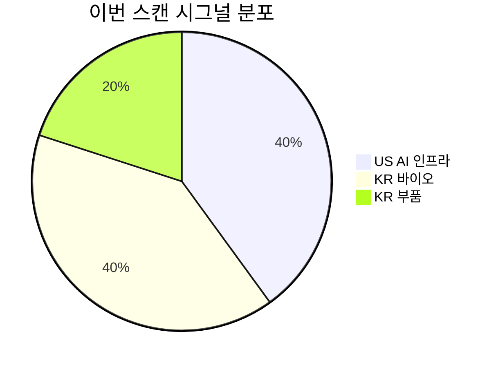

# 🔍 Inflection Scan — 2026-05-31

> [!abstract] 탐색 요약
> 탐색 범위: 2026-05-31 기준 최근 2주 | High Conviction 5건 (KEEP 3 / REVISE 2)
> 소스: 1차 IR 직인용 + 셀사이드 리포트 + 뉴스 보도
> **핵심 테마**: AI 인프라 수혜의 확산 — 서버(DELL) → 데이터 플랫폼(SNOW) → 부품(삼성전기), 그리고 한국 바이오의 수익 구조 질적 전환(셀트리온·유한양행)

> [!warning] 메타 경고 (분석 前 필독)
> 이번 스캔은 **생존자 편향 리스크**를 내포합니다. SMCI·LG이노텍 등 성공 사례 위주 Base Rate 인용, 삼성전기 MLCC 점유율·Cortex 매출 비중·길리어드 계약 인식 기간 등 핵심 가정의 1차 미검증, 단기 가격 급등을 시그널 강도로 오해할 위험이 있습니다. 각 시그널의 Confidence 레벨과 Kill Criteria를 반드시 확인하세요.

---

## 시그널 요약 대시보드

| 회사명 | 티커 | 타입 | 핵심 이벤트 | 확신도 | 추천 액션 |
|--------|------|------|------------|:------:|:--------:|
| [[Dell Technologies]] | DELL | 실적가속+가이던스상향 | FY27 Q1 매출 $438억(+88% YoY), AI 서버 가이던스 $600억으로 상향 | H · P=0.58 | /deep |
| [[Snowflake]] | SNOW | 실적가속+사업변곡점 | Q1 FY27 서프라이즈 + Cortex AI 수익화 신호, 주가 +36% | M · P=0.45 | /deep (검증 선행) |
| [[삼성전기]] | 009150.KS | 사업변곡점 | AI 서버용 MLCC 재평가 주가 4일 +59%, 목표주가 230만원 | L · P=0.40 | /deep (점유율 검증 필수) |
| [[셀트리온]] | 068270.KS | 실적가속+사상최고매출 | Q1 2026 매출 +36% YoY, 영업이익 +115.5%, OPM 28.1% — 비수기 역대 최대 | H · P=0.55 | /deep |
| [[유한양행]] | 000100.KS | 선행지표+사업변곡점 | 5월 한 달 글로벌 API 수주 2,600억원+(길리어드 2,102억+브릿지바이오 560억) | M · P=0.50 | /deep |

---

## 1. [[Dell Technologies]] (DELL) — 실적가속 + 가이던스 상향

> [!abstract] 핵심 요약
> FY27 Q1 매출 $438억으로 컨센서스를 $84억(+23.7%) 초과. ISG(인프라솔루션그룹)이 YoY +181% 폭발 성장하며 Dell은 사실상 AI 서버 기업으로 재탄생했다. 수주잔고 $430억 + 분기마다 2배 확대되는 신규 주문이 단발성 서프라이즈가 아님을 입증한다.

**시그널**: FY27 Q1 매출 $438억(컨센서스 +23.7% 초과), ISG +181% YoY, AI 서버 연간 가이던스 $600억으로 대폭 상향 [출처: Dell Technologies IR, 2026년 5월 실적발표]

<reasoning>
**사실**: ISG 매출 $290억, YoY +181%. 전 분기(FY26 Q4) ISG 성장률 +19%. 수주잔고 $430억. 신규 주문 분기마다 2배 증가. 경영진 AI 서버 연간 매출 $600억 가이던스 제시.

**추론**: 성장률이 +19%→+181%로 162%p 가속된 것은 단순 base effect가 아니다. Nvidia GB200 출하 집중이 일부 기여했을 수 있으나, 수주잔고 $430억이 분기마다 2배씩 늘고 있다면 이는 파이프라인이 실현 속도보다 빠르게 쌓인다는 의미 — 공급 제약이 상방 리스크를 오히려 만든다.

**대안 가설**: ISG +181%는 단기 출하 집중(hyperscaler 대량 발주 일시 집행)이며, 2027년부터 plateau 도달할 수 있다. ODM 직접 조달 비중 확대로 Dell의 중간자 역할 약화 가능.

**채택 사유**: 수주잔고 규모($430억)가 Dell FY27 예상 연간 매출의 약 25%에 달하며, 이것이 '일시 집중'으로 설명된다면 이후 2~3개 분기는 필연적으로 급감해야 하는데 경영진이 $600억 가이던스를 제시했다는 점에서 지속성 신호로 채택.
</reasoning>

ISG가 +19%에서 +181%로 가속된 변곡점의 핵심은 **Dell이 "엔터프라이즈 AI 인프라 통합 공급자"로서 독점적 포지션을 형성하고 있다**는 점이다. Nvidia GPU를 단순 재판매하는 것이 아니라, 냉각 시스템·네트워킹·서비스를 포함한 완성형 AI 서버 랙(rack)을 조립·납품하는 것이기 때문에 CSP(하이퍼스케일러)가 직접 ODM을 쓰더라도 중소형 엔터프라이즈·SaaS 기업들은 Dell을 통한다. 엔터프라이즈 AI 도입은 hyperscaler 사이클보다 12~18개월 지연되어 나타나므로, hyperscaler CapEx가 2027년 plateau에 도달해도 Dell의 엔터프라이즈 수요는 2028년까지 수혜가 이어지는 사이클 분산 효과가 있다. 현재 PER ~20배는 EPS 성장률 대비 현저히 저평가 구간이며, ISG 영업이익률이 +154% 성장하고 있음에도 시장은 여전히 Dell을 "PC 회사"로 디스카운트 중이다. 유사 사례로 2017~2018년 Super Micro Computer가 서버 수요 급증기에 12개월 +300%를 기록했으나 이후 회계 투명성 문제로 급락했다는 점에서, Dell의 상대적 재무 신뢰도는 차별화 포인트가 된다.

> [!note] Cross-Asset Impact
> **KR 연결**: Dell의 AI 서버 가이던스 $600억 상향은 SK하이닉스(HBM 공급), 삼성전자(DDR5 DRAM), [[삼성전기]](MLCC) 등 국내 부품 공급망에 직접 수혜. Dell이 실제로 이 가이던스를 달성한다면 HBM 소비량은 현재 대비 30~50% 추가 확대 필요. 단 환율(USD 강세) 수혜도 동반.

🟢 Bull 30%

🟡 Base 50%

🔴 Bear 20%

| 시나리오 | 핵심 가정 | 12M 목표가 | 업사이드 |
|---------|---------|-----------|--------|
| 🟢 **Bull** (P=30%) | AI 서버 수주 분기마다 2배 확대 지속, FY28 EPS $6+, ISG 비중 70%+, 엔터프라이즈 AI 도입 가속 | **$700+** | +60%+ |
| 🟡 **Base** (P=50%) | 수주 현실화율 70%, AI 서버 $600억 가이던스 소화, PC 부문(CSG) 보합 | **$550~600** | +20~40% |
| 🔴 **Bear** (P=20%) | **(Steel-manned Short)** Hyperscaler CapEx 2027년 조기 plateau + ODM 직접 조달 60%→70%로 확대 → Dell의 TAM 자체 축소. 동시에 GPU 배분 우선순위에서 밀려 수주잔고 소화율 급감, PC 수요 침체 동반 | **$350** | -20%~ |

> [!failure] 5년 후 이 시그널이 무효가 된다면
> AI 서버 GPM이 현재 추정 11~13%에서 8% 미만으로 압축되어 매출 성장이 EPS로 전환되지 못하는 경우 — SMCI에서 매출 +200% vs EPS +60% 불일치 선례가 존재한다.

실적 서프라이즈 강도 85/100 [Confidence: H | 1차IR]

수주 지속성 신뢰도 62/100 [Confidence: M | GPU 배분 계약 조건 미확인]

밸류에이션 매력도 75/100 [PER ~20배, 성장 프리미엄 미반영 추정]

| 항목 | 내용 |
|------|------|
| 시장 | 🇺🇸 NYSE |
| 변곡점 유형 | 실적가속 + 가이던스상향 |
| 추천 액션 | **/deep** — AI 서버 수주잔고 소화 속도, ISG 영업이익률 구조(영업이익 +154%의 원가 분해), Nvidia GPU 배분 계약 조건(우선 공급 약정 여부) 확인 핵심 |

---

## 2. [[Snowflake]] (SNOW) — 실적가속 + 사업변곡점 ⚠️ REVISE

> [!abstract] 핵심 요약
> Q1 FY27 실적 서프라이즈로 주가 +36% 급등. Cortex Code 등 AI 도구가 소비량 증가로 이어지기 시작했다는 신호는 "SaaS AI 수익화"의 첫 증거 후보다. 그러나 Cortex 매출 비중이 1차 확인되지 않아 현재는 **narrative 단계**로 분류. 컨빅션 P=0.45.

**시그널**: Q1 FY27 실적 대폭 서프라이즈, Cortex AI 도구 소비량 증가 전환, 주가 단일 세션 +36.48% 급등 [출처: 뉴스 보도 기반, Cortex 매출 비중 구체 수치 미확인 — 2차 셀사이드 수준]

<reasoning>
**사실**: 주가 단일 세션 +36.48% 급등. 실적 서프라이즈. Cortex Code 등 AI 도구가 실제 소비량 증가로 이어진다는 경영진 발언. 소비 기반 과금 모델.

**추론**: 스노우플레이크는 소비 기반 모델이므로 Cortex AI 워크로드가 늘수록 매출이 비선형 확대된다. Cortex 수익화가 실제로 시작됐다면 NRR(순수익 유지율) 재가속이 후행 지표로 나타날 것.

**대안 가설**: +36% 급등의 주된 동인은 short squeeze. Cortex 매출 비중이 5% 미만인 narrative 단계이며, NRR이 125% 미만으로 지속 하향한다면 소비 모델의 구조적 한계 노출. Databricks Lakehouse + Iceberg 오픈 포맷으로 workload 이탈 가속 가능성.

**채택 사유**: Cortex 매출 비중 1차 미확인으로 thesis 강도가 약함. 주가 급등 이후 진입은 risk/reward 비대칭. REVISE(하향) 유지.
</reasoning>

스노우플레이크의 이번 서프라이즈에서 **진짜로 확인해야 할 질문은 "Cortex가 실제 소비량 증가를 얼마나 만들었는가?"** 이다. 소비 기반 모델의 특성상 AI 추론 워크로드가 늘수록 매출은 계단식이 아니라 연속적으로 확대되는 구조인데, 이것이 구조적 재가속의 시작인지, 일회성 대형 고객 소비 집중인지가 thesis의 핵심 분기점이다. 단일 세션 +36% 급등은 반대로 진입 타이밍을 복잡하게 만든다 — 이미 상당한 기대가 주가에 선반영됐을 가능성이 높다. AWS Redshift·Azure Synapse·Google BigQuery의 경쟁 심화와 Databricks의 Lakehouse 포맷 확산이 Snowflake의 vendor lock-in을 약화시키는 중장기 구조적 리스크는 여전히 해소되지 않았다. 그러나 만약 Cortex 도구의 실제 사용량 데이터가 고객당 지출 가속화를 보여준다면, 현재 PSR(주가매출비율) 재평가 여력은 충분하다.

> [!warning] 리스크 경고
> **진입 전 체크리스트**: ① Cortex AI 도구 매출 비중(%) — 5% 미만이면 narrative 단계, ② NRR 추이 — 125% 미만 지속 하향이면 소비 모델 한계 신호, ③ 대형 고객(ACV $1M+) 코호트 소비 증가율 — 신규 고객 효과인지 기존 고객 심화인지 구분 필수.

> [!note] Cross-Asset Impact
> **KR 연결**: Snowflake의 AI 데이터 플랫폼 성공은 국내 클라우드 데이터 인프라 수요(AWS Korea, MS Azure Korea 통한 Snowflake 소비)를 간접 자극. 직접 연결 종목은 제한적이나, AI 데이터 파이프라인 솔루션을 제공하는 국내 SI(시스템통합) 업체들의 Snowflake 파트너십 강화 계기.

🟢 Bull 25%

🟡 Base 50%

🔴 Bear 25%

| 시나리오 | 핵심 가정 | 12M 목표가 | 업사이드 |
|---------|---------|-----------|--------|
| 🟢 **Bull** (P=25%) | Cortex 소비량이 전체 Product Revenue의 15%+로 확대, NRR 130%+ 재가속, Databricks 대비 엔터프라이즈 점유율 방어 | **현 주가 +60%** [추정] | +60% |
| 🟡 **Base** (P=50%) | Cortex 매출 기여 점진 확대, NRR 125~128% 안정, 소비 가속 2~3개 분기 검증 필요 | **현 주가 +15~30%** [추정] | +15~30% |
| 🔴 **Bear** (P=25%) | **(Steel-manned Short)** +36% 단일 세션 급등은 short squeeze 성격, NRR 125% 미만으로 지속 하향, Cortex 매출 비중 5% 미만 narrative 단계 확인, Databricks Lakehouse로 workload 이탈 가속 → 서프라이즈 주가 완전 반납 | **현 주가 -25%** [추정] | -25% |

> [!failure] 5년 후 이 시그널이 무효가 된다면
> AI 워크로드가 Databricks Lakehouse / Apache Iceberg 오픈 테이블 포맷으로 이동하여 Snowflake의 vendor lock-in이 구조적으로 약화되는 경우 — 현재 Cortex 매출 비중 미공개는 이 리스크의 조기 경보일 수 있다.

실적 서프라이즈 강도 68/100 [Confidence: M | 구체 수치 2차 수준]

Cortex 수익화 검증도 40/100 [Confidence: L | 1차 데이터 미확인]

진입 Risk/Reward 58/100 [+36% 급등 이후 단기 변동성 확대]

| 항목 | 내용 |
|------|------|
| 시장 | 🇺🇸 NYSE |
| 변곡점 유형 | 실적가속 + 사업변곡점 |
| 추천 액션 | **/deep** — Cortex AI 도구의 Product Revenue 기여 비중(%), 대형 고객 코호트 소비 증가율, NRR 추이 확인 후 포지션 결정. **Cortex 비중 5% 미만 + NRR 125% 이하 확인 시 즉시 DROP** |

---

## 3. [[삼성전기]] (009150.KS) — 사업변곡점 ⚠️ REVISE (Confidence: L)

> [!abstract] 핵심 요약
> AI 서버용 MLCC 재평가 narrative로 4일 +59% 급등. 목표주가 230만원 제시 [출처: 매일경제 보도]. 그러나 AI 서버향 MLCC 실제 점유율 데이터가 1차 미확인 상태이며, Murata 독점 구조 하에서 매출 영향이 과장될 가능성이 존재한다. **점유율 데이터 확인 전까지 추격 매수 금지**.

**시그널**: AI 서버용 고압 MLCC 수요 구조 전환 재평가, 4일간 주가 +59% 급등, 목표주가 230만원 제시 [출처: 매일경제 보도, 2026.5월, 목표주가 발행기관 및 날짜 추가 확인 필요]

<reasoning>
**사실**: 삼성전기 주가 4일간 +59% 급등. 목표주가 230만원 (셀사이드, 기관명 미확인). AI 서버 1대당 MLCC 탑재량이 스마트폰 대비 수십 배 많다는 구조적 사실. Murata 글로벌 MLCC 점유율 40%+.

**추론**: AI 서버 확산 → 고압·대용량 MLCC 수요 급증 → 삼성전기 수혜. 그러나 이 논리는 삼성전기의 AI 서버향 MLCC 점유율이 의미 있을 때만 성립한다.

**대안 가설**: 삼성전기 MLCC 매출에서 서버향 비중이 10% 미만이고, AI 서버 MLCC 고압 영역은 Murata·TDK가 과점 중이어서 실제 삼성전기의 TAM 확대 효과가 미미할 수 있다.

**채택 사유**: 대안 가설이 반박되지 않음. 4일 +59% 급등은 펀더멘탈 확인보다 모멘텀 추종 성격이 강할 가능성. Confidence L 유지, 점유율 Kill Criterion 추가.
</reasoning>

삼성전기의 AI 서버 수혜 thesis에서 **가장 위험한 가정은 "고압 MLCC 시장에서 삼성전기의 점유율"이다**. AI GPU 서버 1대당 MLCC 탑재량이 스마트폰 대비 수십 배 많다는 사실은 맞지만, 이 수십 배의 MLCC 수혜를 누가 받는지가 핵심이다. 고압·대용량 AI 서버용 MLCC 영역은 Murata(점유율 40%+)와 TDK가 기술적 우위를 보유하고 있으며, 삼성전기의 AI 서버향 점유율이 한 자리 수라면 전체 MLCC 매출에서의 영향은 5%p 미만에 그칠 수 있다. LG이노텍이 스마트폰 카메라 모듈 재평가로 +100% 기록한 유사 사례를 인용했으나, LG이노텍에는 'Apple 독점 공급권'이라는 결정적인 계약 catalyst가 있었다 — 삼성전기에는 이에 상응하는 1차 확인 계약이 아직 없다. 4일간 +59% 급등 이후 현 주가에서의 진입은 narrative가 실제 매출로 전환되지 못할 경우 상당한 하방 리스크를 감수해야 한다.

> [!warning] 리스크 경고
> **Kill Criterion (즉시 DROP 조건)**: AI 서버향 MLCC에서 삼성전기 점유율이 한 자리수 확인 시, 또는 삼성전기 MLCC 매출의 서버향 비중이 15% 미만 확인 시 → 즉시 시그널 폐기. 현재 추격 매수는 권고하지 않음.

> [!note] Cross-Asset Impact
> **US 연결**: Murata(6981.T)·TDK(6762.T)와의 점유율 경쟁 구도. 만약 삼성전기가 AI 서버 MLCC 점유율을 실질적으로 확대한다면, 이는 반대로 Murata/TDK에 대한 리스크 요인이 된다. [[Dell Technologies]](DELL)·슈퍼마이크로(SMCI)의 AI 서버 출하 가속이 전제 조건.

🟢 Bull 25%

🟡 Base 50%

🔴 Bear 25%

| 시나리오 | 핵심 가정 | 12M 목표가 | 업사이드 |
|---------|---------|-----------|--------|
| 🟢 **Bull** (P=25%) | AI 서버향 MLCC 점유율 20%+로 확인, 분기 매출 믹스 개선 실적으로 입증, 합리적 목표주가 230만원 달성 | **230만원** [출처: 매일경제 보도] | +60%+ [추정] |
| 🟡 **Base** (P=50%) | 점유율 10~20% 수준, AI 서버 성장이 스마트폰 둔화 부분 상쇄, 완만한 믹스 개선 | **현 주가 +10~30%** [추정] | +10~30% |
| 🔴 **Bear** (P=25%) | **(Steel-manned Short)** AI 서버 MLCC 점유율 한 자리수 확인, 전체 매출 영향 5%p 미만, +59% 급등 완전 반납. 스마트폰·자동차 MLCC(매출의 90%) 수요 둔화가 구조적 약점으로 재확인. Murata/TDK 대비 기술 격차가 AI 서버 고압 영역에서 지속 | **현 주가 -35%** [추정] | -35% |

> [!failure] 5년 후 이 시그널이 무효가 된다면
> AI 서버 MLCC 시장이 Murata·TDK 과점 구조로 고착화되어 삼성전기가 commodity MLCC(저압·저마진) 영역에 갇히는 경우 — narrative와 달리 실제 고부가 제품 점유율 확대에 실패.

AI 서버 점유율 신뢰도 35/100 [Confidence: L | 1차 데이터 미확인]

구조적 수혜 논리 타당성 55/100 [Confidence: M | MLCC 탑재량 증가는 사실]

현 시점 진입 매력도 30/100 [+59% 급등 이후 risk/reward 불리]

| 항목 | 내용 |
|------|------|
| 시장 | 🇰🇷 코스피 |
| 변곡점 유형 | 사업변곡점 (narrative 단계) |
| 추천 액션 | **/deep** — AI 서버향 MLCC 점유율(vs Murata/TDK), 서버향 매출 비중 추이, 고압 MLCC 기술 경쟁력 검증 최우선. **점유율 한 자리수 확인 시 즉시 DROP** |

---

## 4. [[셀트리온]] (068270.KS) — 실적가속 + 사상최고매출

> [!abstract] 핵심 요약
> Q1 2026 매출 1조 1,450억원(+36% YoY), 영업이익 +115.5%, OPM 28.1% — 전통적 비수기인 1분기에 역대 최대 실적을 기록한 계절성 anomaly가 핵심 신호다. 이 조합은 단순 성장이 아닌 수익 구조의 질적 전환을 의미한다.

**시그널**: Q1 2026 매출 1조 1,450억원(+36% YoY), 영업이익 +115.5%, OPM 28.1% 기록 [출처: 셀트리온 1Q 2026 실적 발표 (IR), 구체 발표일 추가 확인 필요]

<reasoning>
**사실**: 매출 +36% YoY, 영업이익 +115.5% YoY, OPM 28.1%. Q1은 전통적으로 셀트리온의 최저 분기(계절성). 합병 후 첫 완전 통합 분기.

**추론**: 비수기 Q1에 역대 최대 실적이라는 사실은 두 가지를 동시에 의미한다. (1) 합병 시너지(원가 절감, 직판 비용 절감)가 이미 실현되기 시작했고, (2) 신규 고수익 바이오시밀러(자가면역·항암 계열) 판매 비중이 빠르게 확대됐다. 이 두 요소가 동시에 작동하면 Q2~Q4에는 계절성 + 레버리지 확대로 이익이 더 크게 나타날 수 있다.

**대안 가설**: OPM +115.5% 급증은 합병 관련 일회성 PPA(Purchase Price Allocation) 효과나 재고 평가 이익이 포함됐을 수 있으며, 정상화 시 OPM 18~22%로 회귀 가능.

**채택 사유**: 대안 가설은 /deep에서 OPM 분해로 검증해야 하나, 비수기 역대 최대라는 계절성 anomaly는 대안 가설만으로 설명하기 어렵다. 1차 IR 데이터 명확하여 KEEP 유지.
</reasoning>

셀트리온의 Q1 2026 결과에서 가장 중요한 숫자는 OPM 28.1%이다. **글로벌 바이오시밀러 기업들의 평균 OPM이 10~18% 수준임을 감안하면, 28.1%는 Top Tier 수준의 마진 구조가 형성됐음을 의미한다**. 매출 성장(+36%)이 영업이익 성장(+115%)보다 훨씬 낮다는 사실은 강력한 영업 레버리지가 작동하고 있음을 보여준다 — 즉, 고정비를 넘어선 매출이 대부분 이익으로 전환되는 구조다. 이러한 레버리지 구조에서 Q1이 비수기임에도 역대 최대 실적이라면, Q2(비수기 해소)와 Q3(유럽 시장 성수기)에는 이익 레버리지가 더 극대화될 가능성이 높다. 핵심 리스크는 트럼프 행정부의 약가 인하 정책(MFN)이 바이오시밀러 ASP까지 압박하는 시나리오지만, 바이오시밀러는 이미 오리지널 대비 저가 포지션에 있어 정책 충격이 오리지널 의약품보다 제한적일 것으로 판단된다.

> [!success] 강점
> 비수기 Q1에 역대 최대 실적 = 계절성 조정 후 실질 펀더멘탈이 시장 기대보다 강하다는 가장 강력한 증거. 합병 후 직판 체계 완성 + 원가 시너지 + 고수익 제품 믹스 개선이 동시 실현 중. OPM 28.1%는 글로벌 Top Tier.

> [!note] Cross-Asset Impact
> **US 연결**: Amgen(AMGN), Sandoz(SDZ)와의 경쟁 구도. 셀트리온의 OPM 28.1% 달성은 바이오시밀러 시장에서 가격 경쟁이 반드시 마진 압박으로 이어지지 않는다는 반례가 된다 — 직판 구조와 제품 믹스 최적화가 마진을 방어한다. 매크로 측면에서 원/달러 환율이 1,300원대 이상 유지 시 미국·유럽 매출의 원화 환산 효과가 추가 이익 기여.

🟢 Bull 30%

🟡 Base 45%

🔴 Bear 25%

| 시나리오 | 핵심 가정 | 12M 목표가 | 업사이드 |
|---------|---------|-----------|--------|
| 🟢 **Bull** (P=30%) | Q2~Q4 이익 레버리지 확대, 신규 바이오시밀러(Stelara·Eylea 시밀러) 점유율 확대, 약가 정책 영향 제한적 | **현 주가 +50%+** [추정] | +50%+ |
| 🟡 **Base** (P=45%) | OPM 25~28% 유지, 연간 EPS 성장률 50~70%, 바이오시밀러 가격 경쟁 점진 심화 | **현 주가 +20~35%** [추정] | +20~35% |
| 🔴 **Bear** (P=25%) | **(Steel-manned Short)** OPM 115% 급증의 상당 부분이 PPA·재고 평가 등 일회성으로 판명, 정상화 시 OPM 18~22% 회귀. 신규 바이오시밀러(Stelara·Eylea) 경쟁사 진입 시 12~18개월 내 ASP -30~40% 급락. MFN 약가 정책이 바이오시밀러 ASP에도 적용될 경우 추가 마진 압박 | **현 주가 -25%** [추정] | -25% |

> [!failure] 5년 후 이 시그널이 무효가 된다면
> 트럼프 행정부 MFN 약가 정책이 바이오시밀러 ASP를 직접 압박하거나, 주요 경쟁 바이오시밀러 제품(Amgen·Sandoz)의 가격 인하로 시장 전체 ASP가 20~30% 하락하여 OPM 구조가 붕괴되는 경우.

실적 신뢰도 88/100 [Confidence: H | 1차IR 직인용, 비수기 최대 anomaly]

OPM 지속성 65/100 [PPA·재고 일회성 분해 필요, Confidence: M]

정책 리스크 내성 72/100 [바이오시밀러=이미 저가, MFN 영향 제한적 추정]

| 항목 | 내용 |
|------|------|
| 시장 | 🇰🇷 코스피 |
| 변곡점 유형 | 실적가속 + 사상최고매출 |
| 추천 액션 | **/deep** — OPM 28.1% 분해(PPA·재고 일회성 vs 구조적), 신규 바이오시밀러 제품별 매출 기여, 미국 MFN 정책의 바이오시밀러 ASP 적용 시나리오 분석 |

---

## 5. [[유한양행]] (000100.KS) — 선행지표 + 사업변곡점

> [!abstract] 핵심 요약
> 2026년 5월 한 달간 글로벌 빅파마 대상 원료의약품(API) 수주 2,600억원+ 확보(길리어드 2,102억원 + 브릿지바이오 560억원). 유한화학 공장 증설 완료 후 첫 대형 수주 실현으로 'CapEx → 수주 → 매출화' 사이클 가동 시작. 단, 계약 인식 기간(일시/다년 분할) 미확인이 thesis의 핵심 불확실성.

**시그널**: 2026년 5월 길리어드사이언스 2,102억원 + 브릿지바이오 560억원 원료의약품 공급 계약 체결 [출처: 유한양행/유한화학 수주 공시 기반, 구체 공시 번호/날짜 추가 확인 필요]

<reasoning>
**사실**: 2026년 5월 한 달 API 수주 총 2,600억원+. 길리어드 2,102억원, 브릿지바이오 560억원. 유한화학 화성공장 HB동 증설 완료(2025년 4월). MASH 치료제 YH25724 IND 승인.

**추론**: 증설 완료 → 대형 수주 실현의 순서는 CapEx 투자 성과가 즉각 나타나고 있음을 의미한다. 탈중국 공급망 재편으로 한국 비중국계 API 기업들의 글로벌 수주 경쟁력이 구조적으로 강화됐다.

**대안 가설**: 길리어드 2,102억원 계약이 다년간 분할 인식(4~5년)이면 연간 기여는 400~500억원으로 매출 비중이 미미. API 사업 GPM 15~20%대 저마진 구조에서는 EPS 영향도 제한적.

**채택 사유**: 대안 가설이 부분 타당하나, 다중 성장 축(렉라자 로열티 + API + MASH) 동시 가동이라는 포트폴리오 다각화 가치는 유효. 단 /deep에서 계약 인식 기간 검증이 thesis의 생사를 결정.
</reasoning>

유한양행의 이번 시그널에서 **핵심 질문은 "2,102억원이 언제 매출로 잡히는가?"이다**. 글로벌 대형 제약사와의 API 공급 계약은 통상적으로 다년간 납품 계약 구조이므로, 일시 수익 인식이 아닌 4~5년 분할 인식일 경우 연간 매출 기여는 400~500억원 수준에 그친다. 유한양행 연결 매출 2조원+ 대비 2~3%의 영향이다. 그러나 이 숫자만 보면 본질을 놓친다 — 중요한 것은 **"공장 증설 → 글로벌 빅파마 수주 실현"이라는 사이클이 가동됐다는 입증 자체**다. HC동 추가 증설이 2028년 완료 예정이므로, 현재는 첫 번째 수주가 검증됐고 이후 증설분에서 추가 대형 계약이 이어질 수 있는 플랫폼이 만들어진 것이다. 여기에 렉라자(레이저티닙) 로열티 수입과 MASH 치료제 IND 승인이라는 두 개의 독립적 성장 축이 병행하여, 유한양행은 단일 catalyst 종목이 아닌 다중 변곡점 기업으로 재평가될 여지가 있다.

> [!tip] 핵심 인사이트
> **렉라자 로열티 + API 수주 + MASH 파이프라인 = 3개의 독립적 성장 축**이 동시에 가동 중. 단일 시그널 기업이 아닌 다중 변곡점 기업. 어느 한 축이 실망을 줘도 다른 축이 버퍼 역할을 하는 분산 구조.

> [!note] Cross-Asset Impact
> **US 연결**: 길리어드사이언스(GILD)와의 수주 계약은 GILD의 specialty API 공급망 다변화 전략의 일환. 탈중국 API 소싱 확대는 Lonza(LONN.SW), Samsung Biologics(207940.KS)와의 경쟁 구도를 형성. 매크로 측면에서 원/달러 환율 1,300원대 이상 유지 시 달러 표시 계약의 원화 환산 이익 추가 확대.

🟢 Bull 25%

🟡 Base 50%

🔴 Bear 25%

| 시나리오 | 핵심 가정 | 12M 목표가 | 업사이드 |
|---------|---------|-----------|--------|
| 🟢 **Bull** (P=25%) | 길리어드 계약 조기 일시 인식 + HC동 추가 계약 수주, 렉라자 로열티 가속, MASH 임상 긍정 중간 결과 | **현 주가 +50%** [추정] | +50% |
| 🟡 **Base** (P=50%) | API 계약 다년 분할 인식(연 400~500억), 렉라자 로열티 안정적 성장, MASH 임상 진행 | **현 주가 +15~30%** [추정] | +15~30% |
| 🔴 **Bear** (P=25%) | **(Steel-manned Short)** 길리어드 계약이 다년 분할 + API GPM 15~20%대 저마진 확인 → EPS 영향 미미. 탈중국 narrative 이미 2년+ 경과로 주가 선반영. 렉라자 경쟁 신약(3세대 EGFR) 진입으로 로열티 성장 둔화. 3개 성장 축 모두 기대 하회 시 | **현 주가 -20%** [추정] | -20% |

> [!question] 검토 필요
> **핵심 미확인 사항**: ① 길리어드 2,102억원 계약 인식 기간(일시 vs 다년 분할) — thesis의 규모를 결정하는 핵심, ② API 사업 GPM 추이 — 15%대 저마진이면 EPS 기여 제한적, ③ 렉라자 분기별 로열티 실제 수령액 흐름, ④ MASH(YH25724) IND 승인 이후 임상 1상 timeline

> [!failure] 5년 후 이 시그널이 무효가 된다면
> API 사업의 구조적 마진이 15% 미만으로 확인되어 수주 증가가 이익으로 전환되지 못하고, 렉라자 경쟁 심화로 로열티 성장이 정체되는 동시에 MASH 임상이 실패하는 경우 — 세 가지 독립적 성장 축이 동시에 실망을 주는 시나리오.

수주 신뢰도 78/100 [Confidence: H | 공시 기반, 계약 규모 명확]

EPS 영향 확실성 42/100 [인식 기간·GPM 미확인, Confidence: L]

다중 성장 축 포트폴리오 80/100 [렉라자+API+MASH 분산 구조]

| 항목 | 내용 |
|------|------|
| 시장 | 🇰🇷 코스피 |
| 변곡점 유형 | 선행지표 + 사업변곡점 |
| 추천 액션 | **/deep** — 길리어드 계약 인식 기간(최우선), API GPM 추이, 렉라자 분기별 로열티 흐름, MASH IND 이후 임상 1상 timeline 통합 검증 |

---

## 📊 섹터 메타 시그널

### 🤖 AI 인프라 수혜 확산 (미국 → 한국 부품·바이오 연쇄)

> [!abstract] 섹터 관통 테마
> 이번 스캔의 5개 시그널은 모두 동일한 매크로 구조 위에 있다: **AI CapEx 사이클의 수혜가 서버(DELL) → 소프트웨어 인프라(SNOW) → 물리 부품(삼성전기) → 바이오 수익화(셀트리온·유한양행)** 순으로 확산 중이다. 이는 AI 투자 사이클이 "1차 수혜(GPU·서버)"를 지나 "2차 수혜(소프트웨어·데이터)" 및 "3차 수혜(부품·소재·헬스케어 인프라)"로 넘어가는 사이클 후기 패턴과 일치한다.

**공통 리스크**: 미국 연준의 금리 정책이 2026년 하반기 예상보다 더디게 인하될 경우, 고성장·고밸류 AI 관련주 전반에 할인율 상승 압박이 동시에 가해진다. 달러 강세 지속 시 KR 종목들의 환산 이익은 확대되지만, 원화 자산 외국인 이탈 리스크도 병행한다. **Dell의 AI 서버 가이던스($600억)가 실제로 달성되는지 여부가 이 섹터 메타 시그널 전체의 검증 지표(leading indicator)로 기능한다** — Dell이 수주잔고를 실현하면 삼성전기·SK하이닉스 부품 수요도 동시에 확인되기 때문이다.

---

> [!question] 스캔 전체 품질 경고 (메타 자기비판)
> **M3 Self-Critique 3개 약점**:
> 1. **Base Rate 생존자 편향**: SMCI·LG이노텍·삼성바이오로직스 성공 사례만 인용. 동일 패턴에서 -50%+ 실패 사례(예: AI 서버 narrative 후 급락 종목들) 병기 필요. Hit rate는 50~65%이며 나머지는 실패.
> 2. **1차 미확인 핵심 가정**: 삼성전기 AI 서버 MLCC 점유율, Cortex 매출 비중(%), 길리어드 계약 인식 기간 — 이 세 가지 중 하나라도 틀리면 해당 시그널의 Base 시나리오가 무너진다.
> 3. **가격 모멘텀 ≠ 펀더멘탈 강도**: "4일 +59%", "+36% 단일 세션"은 시그널의 존재를 알려주지만 강도를 측정하지 않는다. 이 숫자들은 오히려 진입 시점을 늦춰야 한다는 신호일 수 있다.