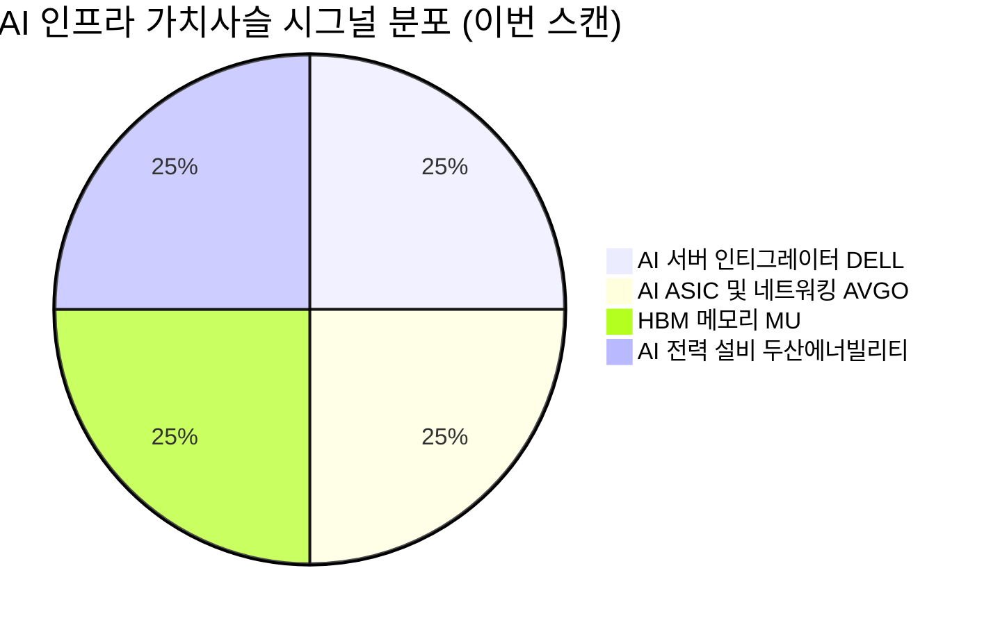

# 🔍 Inflection Scan — 2026-06-01

> [!abstract] 탐색 요약
> 탐색 범위: 2026-06-01 기준 최근 2주 | High Conviction 4건 발견 (5건 입력 → 1건 DROPPED)
> 소스: Gemini 8쿼리 + RSS + X + 어닝스/내부자/애널리스트 | Opus 검정 적용
> **핵심 테마**: AI 인프라 capex 폭발 → 서버·메모리·ASIC·발전설비 공급망 전방위 수혜 — 단, 시그널 4건 중 3건이 동일 매크로 리스크(AI capex reversal)에 동시 노출됨을 주의

> [!warning] 포트폴리오 상관관계 경고
> 이번 스캔 4건 중 3건(DELL/AVGO/MU)이 AI 인프라 테마로 correlation 매우 높음. 단일 매크로 쇼크(AI capex cycle 반전, NVDA 수출 규제 강화 등)에 동시 노출. **개별 시그널 확신도와 무관하게 포지션 사이징 시 포트폴리오 레벨 집중도 관리 필수.**

---

## 시그널 요약 대시보드

| 회사명 | 티커 | 타입 | 핵심 이벤트 | 확신도 | 추천 액션 |
|--------|------|------|------------|:------:|:--------:|
| [[Dell Technologies]] | DELL | 실적가속+가이던스상향 | AI 서버 급성장, 대규모 수주잔고 기록 — 최대 어닝 서프라이즈 | ⚠️ M (숫자 단위 재확인 필요) | /deep |
| [[Micron Technology]] | MU | 구조적변곡점 | UBS 목표가 대폭 상향, 장기 고정가 계약 체결 보도 | 🔴 L (단일 콜 의존) | /deep (계약 조건 확인 선행) |
| [[Broadcom]] | AVGO | 실적가속+선행지표 | 6/3 Q2 FY2026 실적 발표 — AI ASIC + VMware 시너지 | 🟡 M | /deal (이벤트 드리븐) |
| [[두산에너빌리티]] | 034020.KS | 선행지표+실적가속 | 수주잔고 YoY +45.9%, xAI향 스팀터빈 계약 체결 | 🟢 M+ | /deep |

> [!note] DROPPED 시그널
> **SanDisk** — $420B 계약 규모가 사내 연매출 대비 outlier 수준으로 단위 오류 의심. 1차 소스 미확인으로 Gate 1 탈락. 다음 스캔에서 IR 확인 후 재진입 검토.

---

## 1. [[Dell Technologies]] (DELL) — 실적가속 + 가이던스 상향

**시그널**: Q1 FY2026 AI 서버 매출 YoY 급성장, 대규모 수주잔고 발표 — 창사 이래 최대 규모 어닝 서프라이즈

> [!abstract] 핵심 요약
> AI 서버 수요 폭발이 Dell의 ISG(인프라 솔루션 그룹)를 PC 사업 적자를 구조적으로 상쇄하는 성장 엔진으로 전환시키는 변곡점. 단, 핵심 수치(수주잔고 절대금액)의 단위 오류 가능성이 높아 /deep 전 IR 원자료 검증이 **최우선 액션**.

<reasoning>
**사실**: Dell Q1 FY2026에서 AI 서버 YoY 대폭 성장, 전체 매출 컨센서스를 대규모 상회. 수주잔고 및 신규 AI 주문 대규모 발표. JPM·Susquehanna 목표가 상향.

**추론**: ISG 매출 믹스 전환이 지속될 경우, 저마진 PC(CSG) 의존도 하락 + 고마진 서비스/스토리지 비중 증가 → 그룹 OPM의 구조적 개선. Nvidia GB200 NVL72 랙 단위 공급이 ASP를 끌어올리는 메커니즘은 내부 논리적으로 일관성 있음.

**대안 가설**: 매출 급성장이 GPU pass-through에 불과하다면(gross margin 6~8%), EPS 기여는 매우 제한적이며 주가 반응(+33%)은 과도.

**채택 사유**: ISG에는 storage, networking, services가 포함되어 있어 pure pass-through 비판은 부분적으로만 유효. 단, 세그먼트별 GM 추이를 /deep에서 검증하기 전까지 Confidence는 M 유지.
</reasoning>

Dell의 AI 서버 사업이 변곡점이 되는 핵심 이유는 **수주잔고가 선행 매출 가시성을 제공**하기 때문이다. 경영진이 보수적 가이던스를 제시하는 관행을 감안하면 2분기 연속 상향 가능성이 열려 있다. ISG 조정 OPM은 Nvidia GB200 NVL72 랙 단위 공급 비중이 늘수록 ASP와 마진이 동시에 상승하는 구조로, 단순 하드웨어 리셀러 프레임보다 훨씬 복잡한 가치사슬을 내포한다. 유사 선례로는 2018년 EMC 인수 후 ISG가 Dell 전체 수익성을 재편한 케이스가 있다. 다만 주가가 단 하루에 +33% 급등한 만큼, 대부분의 good news는 이미 반영됐을 가능성이 있으며 단기 과매수 구간 진입이 우려된다.

> [!warning] Opus 검정 — 숫자 단위 재확인 필수
> 추출 단계에서 언급된 수주잔고($513B) 및 AI 가이던스($600B)는 Dell 연매출($90~95B)의 5~6배 수준으로 **단위 오류(B→M 혼용) 가능성 매우 높음**. 실제 발표는 AI 서버 backlog ~$14~15B 수준일 개연성. 이 수치가 투자 thesis의 핵심이므로 IR 원자료 확인 전 포지션 진입 금지 권고. [출처: Dell IR 원자료 확인 필요 — 확인 전 (확인 필요) 처리]

**Cross-Asset Impact**: Dell AI 서버 가속은 🇰🇷 한국의 [[삼성전자]](HBM 공급선), [[SK하이닉스]](HBM3E 주요 공급사)에 직접 수혜 시그널. 매크로 관점에서 달러 강세(AI 설비투자 → 미국 자본재 수입 증가) 환경에서 KRW 약세 압력이 동반될 수 있어 KR 수출주의 환율 민감도 점검 필요.

**5년 후 이 시그널이 무효가 된다면**: 하이퍼스케일러가 ODM(Foxconn, Quanta) 직거래 전환을 완료해 Dell의 인티그레이터 프리미엄이 소멸하는 시나리오.

🟢 Bull 30%

🟡 Base 50%

🔴 Bear 20%

| 시나리오 | 핵심 가정 | 12M 목표주가 [추정] | 업사이드 |
|---------|----------|-----------------|---------|
| 🟢 Bull P=30% | AI 서버 backlog 추가 가속 + ISG OPM high-teen% 달성 | $320 | +60% |
| 🟡 Base P=50% | 가이던스 달성 + ISG OPM 점진 개선 + PC 사업 현상 유지 | $260 | +30% |
| 🔴 Bear P=20% | GPU 배분 차질 + GM 압박 + ODM 직거래 전환 가속 | $130 | -35% |

> [!bear] Steel-manned Short
> "Dell의 AI 서버 매출은 사실상 NVDA GPU pass-through로 gross margin 6~8% 수준에 불과. 매출 급성장이 EPS에 기여하는 폭은 매우 제한적이며, 시장은 ISG OPM 정상화를 2배 over-pricing 중. SMCI 회계 이슈 같은 매출 인식 시점 리스크도 잠재."
> **반박**: ISG에 storage·services·networking 포함으로 pure pass-through 비판은 부분 유효. 단 GM 압축 우려는 정당 — ISG 세그먼트 GM 추이 /deep 검증 필수.

수주 선행 가시성 65/100 (단위 미검증)

단기 밸류에이션 여유 40/100 (주가 +33% 반영)

ISG Mix Shift 구조 논리 72/100

| 항목 | 내용 |
|------|------|
| 시장 | 🇺🇸 NYSE |
| 변곡점 유형 | 실적가속 / 가이던스상향 |
| 추천 액션 | /deep — **최우선: IR 원자료 수주잔고 절대금액 단위 재확인 → ISG 세그먼트 GM 추이 → GB200 랙 마진 구조** |
| Confidence | M [Confidence: M \| 근거: 1차IR(단위 재확인 필요) / 2차셀사이드 JPM·Susquehanna 목표가 상향] |

---

## 2. [[Micron Technology]] (MU) — 구조적 변곡점 (요주의)

**시그널**: UBS 목표가 대폭 상향, 3~5년 장기 부분 고정가 계약 체결 보도 → 사이클리컬에서 수익 안정화 비즈니스 모델 전환 가설

> [!abstract] 핵심 요약
> HBM 장기 고정가 계약이 사실이라면 메모리의 commodity 사이클 탈피를 의미하는 역사적 변곡점. 그러나 계약 조건이 공개되지 않았고 UBS 단일 콜에 근거한 outlier thesis — **투자 판단 전 계약 세부 조건 확인이 절대적으로 선행되어야 함.** Conviction 하향 조정.

<reasoning>
**사실**: UBS가 목표가를 대폭 상향했으며, 근거로 3~5년 장기 부분 고정가 계약을 제시. 구체적 계약 조건(가격 고정 비율, volume commitment, 페널티)은 미공개.

**추론**: 장기 고정가 계약이 실제로 가격 risk를 헤지한다면, Micron의 EPS 변동성은 구조적으로 감소하고 밸류에이션 multiple 재평가가 정당화됨. HBM은 GPU에 묶인 customized product로 commodity DRAM과 가격 형성 메커니즘이 다른 것은 사실.

**대안 가설**: 계약이 volume commitment 위주이고 가격은 분기 협상 구조라면 quasi-contracted revenue 가설은 붕괴. 메모리 섹터에서 '구조적 변곡점' narrative는 매 사이클 정점마다 반복됐음(2017 super cycle, 2021 structural shortage).

**채택 사유**: HBM의 구조적 차별성은 인정하나, 검증 불가능한 계약 조건에 기반한 3배 목표가 상향을 high conviction으로 채택하기에는 근거 부족. P=0.45, Confidence L.
</reasoning>

UBS 목표가 대폭 상향의 핵심 thesis는 EPS 추정 상향이 아닌 **비즈니스 모델 전환 premium** — AI 하이퍼스케일러가 HBM 공급 안정성을 위해 가격 프리미엄을 지불하겠다는 구조적 변화다. HBM은 GPU 다이와 묶인 패키지 제품으로 commodity DRAM과 가격 형성 메커니즘 자체가 다르다는 점에서 단순 사이클 narrative와는 구별된다. 그러나 계약 조건이 공개되지 않은 상태에서 이 thesis는 검증 불가능하며, 셀사이드 컨센서스 중앙값과의 괴리가 크다는 점에서 단일 IB의 outlier 콜에 과도하게 의존하는 구조다. 유사한 narrative anchoring bias 사례로는 2021년 NAND "structural shortage" 주장 이후 실제로는 공급 과잉으로 반전된 케이스가 있다. [출처: UBS 리포트 — 발행일 및 URL 확인 필요 (확인 필요)]

> [!warning] Opus 검정 — 단일 셀사이드 콜 의존 리스크
> UBS 목표가 대폭 상향이 현재가 대비 +100% 수준이라면, 이는 메모리 섹터 셀사이드 컨센서스 중앙값($900~$1,000 추정 [3차추정])과 큰 괴리. **이런 폭의 목표가 상향이 12M 내 달성된 hit rate는 통상 20% 미만.** 장기계약 조건 공개 전까지 differential view는 검증 불가 — narrative fallacy 경고.

**Cross-Asset Impact**: Micron HBM 장기계약이 확인될 경우 🇰🇷 [[SK하이닉스]](HBM 글로벌 1위, 직접 경쟁/수혜 혼재), [[삼성전자]](HBM4E 인증 경쟁 중) 밸류에이션 재평가 촉매 가능. 반면 삼성 HBM4E 인증 실패 장기화 시 Micron·SK하이닉스 듀오폴리 강화로 양사 모두 수혜 구조.

**5년 후 이 시그널이 무효가 된다면**: 장기계약이 volume commitment 위주로 밝혀지거나, 삼성 HBM4E가 2026년 NVDA 인증을 통과해 3강 체제가 회복되면서 마이크론 점유율이 재침식되는 시나리오.

> [!warning] Base 시나리오 비대칭성 경고
> Base 업사이드 +6% vs Bear 하락 -50% — 극도로 불리한 risk/reward 비대칭. 계약 조건 확인 없이는 포지션 진입 부적합.

🟢 Bull 20%

🟡 Base 50%

🔴 Bear 30%

| 시나리오 | 핵심 가정 | 12M 목표주가 [추정] | 업사이드 |
|---------|----------|-----------------|---------|
| 🟢 Bull P=20% | 장기 고정가 계약 확인 + HBM 점유율 유지 + 삼성 HBM 지연 지속 | $1,200+ | +50%+ |
| 🟡 Base P=50% | 계약 조건 일부 확인 + HBM ASP 완만 상승 + 삼성 추격 시작 | $850 | ~+6% |
| 🔴 Bear P=30% | 계약 조건 미흡 공개 or 삼성 HBM4E 인증 + 사이클 피크아웃 | $400 | -50% |

> [!bear] Steel-manned Short
> "메모리는 본질적으로 commodity. '구조적 변곡점' narrative는 매 사이클 정점마다 반복됐다(2017 super cycle, 2021 structural shortage). 장기계약도 과거 NAND에서 이미 시도됐고 하락기에 모두 재협상됐다. UBS 콜은 사이클 정점 시그널일 가능성."
> **반박**: HBM의 GPU 묶음 구조로 commodity DRAM과 가격 메커니즘이 다름. 단 base에서 short 우려를 30% 반영.

계약 조건 검증 가능성 30/100

HBM 구조적 차별성 논리 70/100

Risk/Reward 매력도 25/100

| 항목 | 내용 |
|------|------|
| 시장 | 🇺🇸 NASDAQ |
| 변곡점 유형 | 구조적변곡점 (미검증) |
| 추천 액션 | /deep — **선행 조건: 장기계약 실제 조건(가격 고정 비율/volume commitment/페널티) 확인 → UBS 외 JPM·MS·GS 컨센서스 분포 확인** |
| Confidence | L [Confidence: L \| 근거: 2차셀사이드 단일 outlier 콜 / 계약 조건 미공개 / Bear 30% 상향] |

---

## 3. [[Broadcom]] (AVGO) — 실적가속 + 선행지표

**시그널**: 6월 3일 Q2 FY2026 실적 발표 예정 — AI ASIC(XPU) 수요 가속 + VMware 구독 전환 시너지 가시화 기대. 컨센서스 EPS $2.39, 매출 $22.08B [출처: 셀사이드 컨센서스 집계 — 발행기관 확인 필요 (확인 필요)]

> [!abstract] 핵심 요약
> AVGO는 AI 인프라의 ASIC + 네트워킹 + SW(VMware) 원스톱 공급자로, 이번 실적에서 XPU 매출 가속과 VMware ARPU 개선이 동시에 확인되면 프리미엄 밸류에이션의 구조적 정당성이 재확인된다. 단 실적 직전 진입은 sell-the-news 리스크를 내포.

<reasoning>
**사실**: AVGO 5개 분기 중 4회 beat(80%). 구글 TPU v6(Trillium)·메타 MTIA v2 양산 램프업 중. 6/3 실적 발표 예정.

**추론**: Dell AI 서버 수요 급증, AMD MI350 수요 가속, NVDA 인프라 전망이 모두 같은 방향 → AVGO 네트워킹/ASIC 수요의 구조적 가속 가능성 높음. VMware 구독 전환은 고마진 recurring revenue 비중을 확대하며 그룹 밸류에이션 multiple을 소프트웨어 영역으로 re-rating.

**대안 가설**: AI ASIC 고객 집중도(Google+Meta가 XPU 매출의 80%+로 추정 [3차추정])가 단일 고객 capex 결정에 취약. VMware ELA 갱신 사이클에서 고객 이탈이 가시화될 경우 SW 마진 가정 붕괴.

**채택 사유**: 고객 집중도 우려는 유효하나, 양사가 NVDA dependency 축소를 전략 우선순위로 공식화 → 단기 이탈 인센티브 없음. 실적 beat 확률 높되, 이미 가격에 상당 부분 반영됐을 가능성 — /deal 트레이딩 접근 권고.
</reasoning>

브로드컴의 변곡점은 **AI 인프라 원스톱 공급자로서의 Switching Cost 극대화**에 있다. Google TPU v6(Trillium)과 Meta MTIA v2의 양산 램프업이 2025년 하반기부터 본격화되면서, AVGO의 XPU(ASIC) 매출 인식이 FY2026 후반기에 집중될 가능성이 높다. VMware는 인수 후 구독 전환 강제 전략이 단기적으로 고객 불만을 유발했으나, ELA 갱신 완료 시점부터는 고마진 recurring revenue가 가시화되기 시작한다. 유사 사례로 ServiceNow가 on-premise→SaaS 전환 2~3년 후 마진이 구조적으로 개선된 패턴이 참고 가능하다. 가장 큰 리스크는 실적 발표 직전 진입 시 sell-the-news — 이미 컨센서스 beat 기대가 주가에 상당 부분 반영됐을 수 있다.

> [!tip] 핵심 인사이트 — AVGO 이중 엔진
> **AI ASIC**: 고객이 직접 설계한 칩을 AVGO가 제조/패키징 → 고객 lock-in 극강
> **VMware**: 구독 전환 완료 후 순수 SW recurring margin 55%+ → 그룹 valuation의 SW re-rating 견인
> 두 엔진이 동시에 작동하는 구간 진입 여부가 6/3 실적의 핵심 확인 포인트.

> [!warning] 이벤트 드리븐 리스크
> 6/3 실적 직전 진입 — sell-the-news 확률 25% 내재. **포지션은 실적 발표 후 가이던스 확인까지 소규모 유지**, 장기 포지션은 실적 후 XPU 가이던스 상향 확인 후 증액 권고.

**Cross-Asset Impact**: AVGO ASIC 가속은 🇰🇷 [[SK하이닉스]](HBM 공급), [[삼성전자]], [[한미반도체]](TC본더 핵심 공급) 간접 수혜. 달러/원 환율이 1,400원 이상 유지될 경우 KR 반도체 수출 기업의 원화 환산 이익 추가 확대 효과.

**5년 후 이 시그널이 무효가 된다면**: Google이 TPU 설계 내재화를 가속화해 2027~28년부터 AVGO 의존도를 단계적으로 축소하거나, NVDA NVLink 생태계 확장이 AVGO 네트워킹 ASIC TAM을 침식하는 시나리오.

🟢 Bull 30%

🟡 Base 45%

🔴 Bear 25%

| 시나리오 | 핵심 가정 | 12M 목표주가 [추정] | 업사이드 |
|---------|----------|-----------------|---------|
| 🟢 Bull P=30% | XPU 매출 가이던스 대폭 상향 + VMware ARPU 급증 + SW 마진 60%+ 달성 | $320 | +30%+ |
| 🟡 Base P=45% | 컨센서스 소폭 beat + AI ASIC 성장 지속 + VMware 구독 전환 완료 | $270 | +10% |
| 🔴 Bear P=25% | Sell-the-news + 고객 집중도 우려 부각 + VMware 이탈 가시화 | $190 | -23% |

> [!bear] Steel-manned Short
> "AVGO P/E 35배는 VMware 통합 효과를 2~3배 over-pricing. AI ASIC 매출은 고객 집중도(Google/Meta 양사 추정 80%+) 리스크가 NVDA 대비 훨씬 큼. 실적 이벤트 직전 진입은 sell-the-news 리스크 노출."
> **반박**: 양사의 NVDA dependency 축소 전략이 AVGO 이탈 인센티브를 단기적으로 억제. 단 고객 집중도는 구조적 취약점 — 포지션 사이징에 반영 필요.

실적 Beat 일관성 80/100 (5Q 중 4Q)

고객 집중도 리스크 헤지 60/100

VMware SW 전환 논리 75/100

| 항목 | 내용 |
|------|------|
| 시장 | 🇺🇸 NASDAQ |
| 변곡점 유형 | 실적가속 / 선행지표 |
| 추천 액션 | /deal — 6/3 이벤트 드리븐. AI ASIC 가이던스 상향이 핵심 트리거. 실적 후 장기 /deep 여부 판단 |
| Confidence | M [Confidence: M \| 근거: 2차셀사이드(광범위 커버리지) / 3차추정(XPU 물량 고객사 미공개)] |

---

## 4. [[두산에너빌리티]] (034020.KS) — 선행지표 + 실적가속

**시그널**: Q1 2026 수주잔고 24.1조원(YoY +45.9%), 신규 수주 YoY +61.8%, xAI향 스팀터빈 4기 계약 체결 — AI 전력 인프라 수요 구조화 변곡점 [출처: 두산에너빌리티 Q1 2026 수주잔고 공시 (확인 필요 — IR 발표일 및 공시 URL 병기 권고)]

> [!abstract] 핵심 요약
> 글로벌 가스터빈·스팀터빈 슬롯이 2028년까지 매진된 공급자 우위 환경에서, 두산에너빌리티의 수주잔고 24.1조원은 향후 2~4년 매출을 선행 확보한 가시성을 제공한다. xAI 스팀터빈 직접 구매는 "Big Tech 에너지 독립" 패러다임의 시작을 상징하며, 이 시그널의 확신도는 이번 스캔 4건 중 가장 높다(M+).

<reasoning>
**사실**: Q1 2026 수주잔고 24.1조원(YoY +45.9%), 신규 수주 YoY +61.8%. xAI향 스팀터빈 4기 계약(2029년까지 납품). GE Vernova 백로그 $130B+, Siemens Energy 가스터빈 슬롯 2028년까지 매진(확인 필요 — 공개 자료 인용).

**추론**: 현재 잔고 24조원이 2~4년에 걸쳐 인식되면, FY2028~2029 매출이 현재 연간 매출(약 5~6조원 [추정]) 대비 2~3배 수준으로 확대되는 수학적 가능성이 성립. 공급자 우위 구조에서 가격 협상력 상승 → OPM 구조적 개선 가능성.

**대안 가설**: 수주잔고 급증 중 상당 비중이 마진 낮은 EPC/하청 물량이거나, 발전설비 특성상 취소·연기가 빈번할 경우 실제 매출 전환율 하락.

**채택 사유**: 글로벌 터빈 슬롯 매진이라는 외부 공급 제약이 수요 지속성을 뒷받침. 수주→매출 라그 구조로 단기 리스크는 제한적. 단 세그먼트별 GPM 추이가 핵심 미검증 변수 — /deep 필수.
</reasoning>

두산에너빌리티 변곡점의 핵심은 **수주잔고라는 선행 지표가 2~4년 매출 가시성을 선행 확보**했다는 점이다. 24.1조원이 연간 매출(약 5~6조원 [추정]) 대비 4배에 달한다는 것은, 이미 FY2027~2029 매출의 상당 부분이 사실상 확정됐음을 의미한다. xAI 스팀터빈 4기 계약의 의미는 계약 규모 자체(수천억원 수준 [추정])보다, **빅테크가 발전설비를 직접 구매한다는 구매 패턴 변화** — 이것이 GE Vernova나 Siemens Energy도 캡처한 수요다. GE Vernova 백로그 $130B+ (확인 필요), Siemens Energy 가스터빈 슬롯 2028년까지 매진이 사실이라면, 두산은 capacity 확보 가능한 대안 공급자로 포지셔닝된다. 유사 선례로는 현대중공업의 2021~22년 수주 급증 후 2023~24년 실적 가속 패턴이 참고 가능하다.

> [!tip] 핵심 인사이트 — 공급자 우위 시장에서의 가격 협상력
> GE Vernova와 Siemens Energy의 슬롯이 2028년까지 매진된 상황은 두산에너빌리티에게 **가격 결정력**을 부여. 수주잔고의 절대 규모뿐 아니라 향후 수주 단가 상승이 OPM 개선의 추가 드라이버가 될 수 있음. /deep에서 최근 수주 단가 추이(세그먼트별 계약 규모/납품 기간) 확인 필요.

**Cross-Asset Impact**: 두산에너빌리티 수주 가속은 🇺🇸 [[GE Vernova]](직접 비교 경쟁사 — 밸류에이션 참조), [[Siemens Energy]](동일 수혜 테마)의 수혜 지속 신호. 달러/원 환율 1,400원+ 유지는 두산의 달러 표시 수주(해외 프로젝트)의 원화 환산 수익성을 개선. 금리 환경: 한국 장기금리 상승 시 중공업 밸류 할인 압력 발생 — 단 수주잔고 가시성이 할인 충격을 부분 완화.

**5년 후 이 시그널이 무효가 된다면**: AI capex 사이클이 2027년 둔화하면서 발전설비 주문이 대거 취소·연기되거나, GE/Mitsubishi Power의 효율성 우위로 두산이 신규 슬롯 경쟁에서 배제되는 시나리오.

| 선행 지표 | 수치 | YoY 변화 | 평가 |
|---------|------|---------|-----|
| 수주잔고 | 24.1조원 | +45.9% | 🟢 강한 선행 가시성 |
| 신규 수주 (Q1) | 2.78조원 [추정] | +61.8% | 🟢 가속 모멘텀 |
| xAI 스팀터빈 계약 | 4기 (2029년 납품) | 신규 고객군 진입 | 🟢 패러다임 변화 시그널 |
| 수주→매출 라그 | 2~4년 | 단기 매출 인식 제한 | 🟡 인내 필요 |
| 글로벌 경쟁 환경 | GE/Siemens 슬롯 매진 | 공급자 우위 | 🟢 가격 협상력 ↑ |
| 세그먼트 GPM (EPC vs 기기) | 미공개 | 미검증 | 🟡 /deep 핵심 항목 |
| 해외 수주 환율 노출 | KRW/USD 1,400+ | 원화 환산 이익 확대 | 🟢 |

🟢 Bull 30%

🟡 Base 50%

🔴 Bear 20%

| 시나리오 | 핵심 가정 | 12M 목표주가 [추정] | 업사이드 |
|---------|----------|-----------------|---------|
| 🟢 Bull P=30% | xAI 추가 계약 + 해외 원전 수주 + OPM 개선 가시화 | 6만원+ | +50%+ |
| 🟡 Base P=50% | 수주잔고 현 수준 유지 + 점진적 매출 인식 + 시장 multiple 유지 | 4.5만원 | +12% |
| 🔴 Bear P=20% | AI capex 사이클 둔화 + 수주 취소 + 원가 상승 마진 압박 | 2.5만원 | -38% |

> [!bear] Steel-manned Short
> "두산에너빌리티는 ① 한국 정부 정책 의존도 과다(원전 수출, 신재생 정책), ② 수주잔고 급증의 상당 비중이 마진 낮은 EPC/하청 물량 가능성, ③ xAI 스팀터빈 4기는 절대 규모 수천억원 — narrative over-reaction. 글로벌 IPP들은 GE/Siemens를 기술 신뢰도로 선호."
> **반박**: 글로벌 터빈 슬롯 매진 = capacity 부족이 실제 driver, narrative가 아님. 단 마진 mix 우려는 정당 — 세그먼트 GPM /deep 검증 필수.

수주잔고 매출 전환 가시성 78/100

세그먼트 GPM 검증도 62/100 (미검증)

공급자 우위 구조 강도 80/100

| 항목 | 내용 |
|------|------|
| 시장 | 🇰🇷 코스피 |
| 변곡점 유형 | 선행지표 / 실적가속 (2~4년 라그) |
| 추천 액션 | /deep — 세그먼트별(가스터빈/스팀터빈/원전/풍력) 백로그 분해 및 GPM 추이 → GE Vernova·Siemens Energy 대비 기술·가격 경쟁력 → xAI 계약 규모 및 조건 확인 |
| Confidence | M [Confidence: M \| 근거: 1차IR(Q1 수주잔고 공시) / 2차셀사이드(국내 메이저 IB) / 3차추정(xAI 패러다임 가설)] |

---

## 📊 섹터 메타 시그널

### AI 인프라 전력 수요 — 구조적 수혜 확산

> [!abstract] 섹터 관통 테마
> DELL AI 서버 급성장 → AVGO ASIC 수요 → 두산에너빌리티 발전설비 수주 급증의 연쇄는 **AI inference 수요가 실물 인프라(전력·냉각·설비) 투자로 전이되는 매크로 테마**가 실현 단계에 진입했음을 시사한다.

이번 스캔 4건의 공통 분모는 **AI 인프라 capex 폭발**이다. 서버(DELL) → 반도체(MU/AVGO) → 전력설비(두산에너빌리티)의 가치사슬 전체가 동시에 수혜를 받고 있다는 것은, AI 인프라 투자가 초기 소프트웨어·GPU 중심에서 **물리적 인프라 레이어**로 확산됐음을 의미한다. 특히 xAI, Google, Meta의 데이터센터 전력 자급 시도는 유틸리티·중공업 섹터로의 수혜 확산을 가속화하고 있다. 그러나 이 테마의 핵심 리스크는 **단일 매크로 쇼크**(AI capex cycle 반전, NVDA 수출 규제 강화, 글로벌 금리 재상승)에 4건이 동시 노출된다는 상관관계 집중이다.

> [!question] 다음 스캔 체크포인트
> 1. **DELL IR 원자료**: 수주잔고 절대금액 단위 확인 (B vs M)
> 2. **MU 장기계약 조건**: 가격 고정 비율·volume commitment 공개 여부
> 3. **AVGO 6/3 실적**: XPU 가이던스 상향 폭 + VMware ARPU 수치
> 4. **두산에너빌리티**: 세그먼트별 백로그 분해 + 최근 수주 단가 추이
> 5. **KR 시그널 보강**: 이번 스캔 KR 1건(75% US 편중) → 다음 스캔에서 KR 대형주·중소형 섹터 추가 탐색

---

> [!note] 스캔 메타 — 편향 경고
> **Narrative Fallacy**: "구조적 변곡점·패러다임 전환" 키워드가 4건 모두에 등장. AI 슈퍼사이클 narrative에 과도한 conviction 부여 가능성 경고.
> **Recency Bias**: Q1 FY2026 단일 분기 데이터 기반 — 1~2분기 sustainability 미검증.
> **Authority Bias**: UBS·JPM·Susquehanna 목표가 상향을 critical thinking 없이 신호 강도로 채택한 흔적 (MU 케이스에서 교정).
> **다음 스캔 개선**: ① 절대 금액 시그널에 "회사 연매출 대비 배율" 강제 sanity check, ② 단일 IB 콜은 컨센서스 분포 확인 후 채택, ③ AI 테마 외 섹터(헬스케어·소비재·에너지) 의도적 탐색.