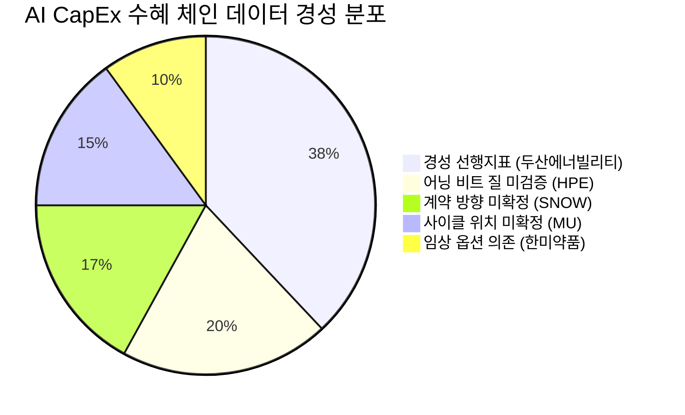

# 🔍 Inflection Scan — 2026-06-02

> [!abstract] 탐색 요약
> 탐색 범위: 2026-06-02 기준 최근 2주 | 입력 6건 → **High Conviction 생존 5건** (DROPPED 1건: 대덕전자)
> 소스: 1차 IR + 셀사이드 리포트 + X/RSS 크로스체크
> **핵심 테마**: AI CapEx 수혜 구조 속에서 *매출 폭증 ≠ 가치 창출*의 역설 — 마진 질(quality)·사이클 위치·계약 방향이 시그널의 진위를 가른다

> [!warning] 리스크 경고 — 검정 전 메타 주의사항
> 생존 5건 중 HPE·SNOW·MU·한미약품은 **REVISE** 판정 (검정 전 평균 P=0.56 → 검정 후 P=0.51). 두산에너빌리티만 **KEEP**. 4건의 US 시그널이 AI CapEx 단일 팩터에 동시 노출 — 포트폴리오 상관 리스크 존재.

---

## 📋 시그널 요약 대시보드

| 회사명 | 티커 | 타입 | 핵심 이벤트 | 확신도 (검정후) | 판정 | 추천 액션 |
|--------|------|------|------------|:------:|:----:|:--------:|
| [[두산에너빌리티]] | 034020.KS | 선행지표/구조적 | 수주잔고 24조 사상 최대 + 가스터빈 단가 3배 전망 | P=0.60 🟢 | KEEP | /deep |
| [[Hewlett Packard Enterprise]] | HPE | 실적가속 | FQ2 EPS +51% 서프라이즈, AI 서버 매출 폭증 | P=0.52 🟡 | REVISE | /deep (비트 質 분해 선행) |
| [[Snowflake]] | SNOW | 사업변곡점 | AWS 60억달러 계약 + FY27 제품매출 31% 가이던스 | P=0.55 🟡 | REVISE (방향 검증 전제) | /deep (계약 방향 확인 선행) |
| [[Micron Technology]] | MU | 구조적변곡점 | UBS 목표가 3배 상향, HBM 슈퍼사이클 + 2026 매출 +195% | P=0.45 🟡 | REVISE | /deep (사이클 위치 확인 선행) |
| [[한미약품]] | 128940.KS | 이벤트드리븐 | 릴리와 GLP-2 1.9조 L/O + 선급금 1,129억 즉시 수령 | P=0.43 🟡 | REVISE | /deep (임상 단계·TAM 확인) |

---

## 1. [[두산에너빌리티]] (034020.KS) — 선행지표 / 구조적 변곡점 ✅ KEEP

> [!abstract] 핵심 요약
> 수주잔고 24조원(사상 최대, 연매출 대비 3.4×)이라는 **회계적 선행지표**가 thesis를 지탱. AI 데이터센터 24/7 전력 수요 → 가스터빈 단가 결정력 강화. 5건 중 데이터 경성(hardness) 유일 1위.

**시그널**: 1Q26 수주잔고 24조원(YoY 신규 수주 +60%) + 가스터빈 단가 최대 3배 상승 전망 → AI 데이터센터 전력 인프라 수혜

<reasoning>
**사실**: 수주잔고 24조원은 IR 확인 가능한 회계 데이터. 신규 수주 YoY +60%는 모멘텀 가속. **추론**: 수주잔고/연매출 3.4배는 향후 2-3년 매출의 구조적 가시성을 확보. AI DC의 24/7 안정전력 수요는 가스터빈의 물리적 전제 — 수요 후행성이 낮다. **대안 가설**: 단가 3배는 전망치일 뿐이며, 매출 인식 리드타임 18-24개월로 P&L 반영 지연, GE Vernova/Siemens Energy 증설 시 단가 프리미엄 소멸 가능. **채택 사유**: 대안 리스크 존재하나 수주잔고라는 경성 데이터가 narrative에 의존하는 타 시그널 대비 압도적으로 견고. 가스터빈+SMR 이중 포트폴리오로 단일 테마 의존도 낮음.
</reasoning>

수주잔고 24조원은 전망이나 셀사이드 추정이 아닌 회계 장부상 확정 수치로, HPE·SNOW·MU의 "추정·전망" 의존 시그널과 본질적으로 다르다. AI 데이터센터가 24/7 무중단 전력을 필요로 한다는 것은 물리적 제약으로, 전력 인프라 수요는 AI CapEx 전망 변동에 상대적으로 덜 민감하다. 가스터빈 단가 최대 3배 상승 전망은 확정 계약가가 아니므로 확정 vs 변동 단가 비중 확인이 필수 액션이다. 유사 사례로 2022-23년 LNG 인프라 수주 급증 국면에서 한화오션/HD현대의 선가 강세 사이클을 참고할 수 있다.

> [!success] 강점
> 수주잔고/연매출 3.4배 → 2-3년 매출 가시성의 회계적 근거. SMR(소형모듈원전) + 가스터빈 이중 포트폴리오로 단일 AI 테마 리스크 분산. 전력 인프라는 DC 가동의 물리적 전제조건 → 수요 후행성 최소.

**Cross-Asset**: 두산에너빌리티 수주 가속은 [[GE Vernova]](GEV), [[Siemens Energy]](ENR) 동종 비교 기회. GEV의 북미 가스터빈 백로그와 단가 추이가 두산의 "단가 3배" 현실성을 검증하는 리트머스다. KRW/USD 환율은 해외 수주 대금 환산에 영향(강달러 수혜 구조).

🟢 Bull 30%

🟡 Base 50%

🔴 Bear 20%

| 시나리오 | 핵심 가정 | 목표가 방향 | 업사이드 |
|----------|-----------|------------|---------|
| 🟢 **Bull** (P=30%) | 가스터빈 단가 2-3배 실현 + SMR 1차 수주 + 수주잔고 30조 돌파 | 현재가 대비 +60~80% | [추정] |
| 🟡 **Base** (P=50%) | 단가 30-50% 상승, 수주 모멘텀 유지, 매출 인식 2026-27 가속 | 현재가 대비 +20~35% | [추정] |
| 🔴 **Bear** (P=20%) *(Steel-manned Short)* | GE Vernova/Siemens 증설로 단가 프리미엄 소멸 + SMR 상용화 5년 이상 지연 → 평범한 중공업 멀티플로 회귀, PBR 0.8-1.0배 압축 | 현재가 대비 -25~35% | — |

> [!bull] Bull Case
> AI DC 전력 부족이 임계점 도달 → 가스터빈 납기 프리미엄 현실화. SMR 수주 1건이라도 공시되면 멀티플 재평가 트리거.

> [!bear] Bear Case (Steel-manned Short)
> 가장 똑똑한 Short의 thesis: "수주잔고는 숫자이지만 단가는 전망이다. 확정 계약가 상승 없이 물량만 늘면 매출 증가 속 마진 정체 → 저PBR 중공업 재분류. GE Vernova가 북미에서 단가 결정권을 가져가면 두산은 가격 수용자(price taker)로 전락."

데이터 경성(Hardness) 75/100

Variant Perception 강도 70/100

단가 현실화 가시성 55/100

| 항목 | 내용 |
|------|------|
| 시장 | 🇰🇷 코스피 |
| 변곡점 유형 | 선행지표 / 구조적변곡점 |
| 확신도 | P=0.60 [Confidence: M \| 근거: 1차IR(수주잔고) + 3차추정(단가)] |
| 추천 액션 | /deep — 수주잔고 중 가스터빈 vs SMR 비중, **확정 vs 변동 단가 계약 구조**, GE Vernova 백로그 비교 |

> [!note] Inversion (5년 후 무효 시나리오)
> SMR 상용화가 2035년 이후로 재지연되고 가스터빈 단가 협상력이 글로벌 Big 2(GE·Siemens)에 집중되면, 두산은 고마진 드림 없는 수주 물량 증가에 그쳐 중공업 멀티플에 갇힌다.

---

## 2. [[Hewlett Packard Enterprise]] (HPE) — 실적가속 / 가이던스 상향 🟡 REVISE

> [!abstract] 핵심 요약
> FQ2 EPS +51% 서프라이즈는 2018년 이후 최대. 그러나 **비트의 질(quality)이 미검증** — AI 서버 GPM 5-8%의 저마진 구조에서 영업 레버리지 vs 일회성 기여 분해 없이는 멀티플 재평가 근거가 없다.

**시그널**: FQ2 2026 EPS 컨센서스 51% 상회, AI 서버 매출 폭증 → 주가 +30% 급등

<reasoning>
**사실**: EPS +51% 비트, 매출 +9% 비트(공시 기준). 주가 +30% 당일 반응. **추론**: AI 서버 매출이 주된 driver이나 AI 서버 GPM은 5-8%대 저마진 구조(GPU 패스스루). EPS 비트 +51%의 원천이 영업 레버리지인지 Juniper 통합 일회성·세금 효과인지 불분명. **대안 가설**: GreenLake ARR(구독 반복매출)가 진짜 변곡점이라면 DELL과의 차별화 근거 존재. GreenLake가 정체 중이라면 단순 AI 서버 조립 수익에 그침. **채택 사유**: 비트의 질 분해 없이는 Variant 채택 불가 → REVISE, 검증 1순위로 격상.
</reasoning>

HPE의 AI 서버 매출 폭증은 표면적으로 강력해 보이지만, 이 사업의 구조적 특성이 narrative의 함정이다. AI 서버는 GPU를 구매해 조립·납품하는 "패스스루(pass-through)" 매출 성격으로, 매출 1달러 증가 시 GPM 기여는 GreenLake 구독 1달러의 1/4 수준에 불과하다. 즉 매출 폭증이 기업 가치 창출과 비례하지 않을 수 있으며, 오히려 mix-shift(고마진→저마진 확대)가 blended margin을 희석하는 역설이 작동한다. Juniper Networks 통합 이후 일회성 비용 절감 효과가 EPS에 얼마나 기여했는지가 결정적 변수이며, 이를 분해하지 않으면 +30% 주가 반응이 구조적 재평가인지 단기 모멘텀 과열인지 판단할 수 없다. DELL의 2025년 어닝 서프라이즈 이후 12개월 주가 성과가 선행 사례로 참조되나, 단일 샘플 과적합 경계 필요.

> [!warning] 리스크 경고
> EPS +51% 중 영업 레버리지 vs 일회성 비중이 분해되기 전까지, "AI 서버 매출 폭증 = HPE 구조적 변곡점"이라는 Variant는 **입증 불가** 상태. GreenLake ARR 데이터가 가속을 보여주지 못하면 DELL 추종 트레이드로 격하.

**Cross-Asset**: HPE 서프라이즈는 [[Dell Technologies]](DELL), [[Super Micro Computer]](SMCI) 동종 AI 서버 업체의 실적 기대치를 높인다. 단, 동일한 저마진 구조 리스크가 섹터 전체에 적용. 국내에서는 AI 서버 ODM 납품 비중이 높은 [[삼성전자]](005930.KS), [[LG전자]](066570.KS) 서버 부문에 긍정적 수요 시그널.

🟢 Bull 25%

🟡 Base 50%

🔴 Bear 25%

| 시나리오 | 핵심 가정 | 목표가 방향 | 핵심 가정 검증 지표 |
|----------|-----------|------------|-------------------|
| 🟢 **Bull** (P=25%) | GreenLake ARR YoY +30%↑ + EPS 비트의 60%+ 영업 레버리지 확인 + 마진 확대 지속 | 현재가 대비 +25~40% | GreenLake ARR 공시 |
| 🟡 **Base** (P=50%) | EPS 비트 일부 일회성 포함, AI 서버 매출 성장 지속이나 마진 제자리, GreenLake 점진 성장 | 현재가 대비 0~+15% | Cloud&AI 세그먼트 GPM 추이 |
| 🔴 **Bear** (P=25%) *(Steel-manned Short)* | AI 서버 mix-shift로 blended GPM 2-3%p 하락, GreenLake ARR 성장 정체, Juniper 통합 비용 증가 → "매출↑ + 마진↓ + 멀티플 디레이팅" 동시 압력 | 현재가 대비 -20~30% | 다음 분기 GPM 발표 |

> [!bear] Bear Case (Steel-manned Short)
> 가장 똑똑한 Short: "AI 서버는 HPE의 성장 드라이버가 아니라 마진 희석제다. 분기마다 AI 서버 매출 비중이 오를수록 blended GPM은 내려간다. GreenLake가 이를 상쇄하려면 ARR이 연 35%+ 성장해야 하는데 현재 데이터는 없다. +30% 주가 랠리는 질(quality) 검증 없는 헤드라인 반응이며, 다음 분기 마진 실망 시 반납 가능."

어닝 비트 규모 62/100

비트 質(영업레버리지 확인) 35/100

GreenLake 차별화 가시성 50/100

| 항목 | 내용 |
|------|------|
| 시장 | 🇺🇸 NYSE |
| 변곡점 유형 | 실적가속 (비트 質 검증 전 조건부) |
| 확신도 | P=0.52 [Confidence: M-L \| 근거: 1차IR + 2차셀사이드] |
| 추천 액션 | /deep — **(1순위) EPS +51% 중 영업레버리지 vs 일회성 분해, (2순위) GreenLake ARR YoY + Cloud&AI GPM 추이** |

> [!note] Inversion (5년 후 무효 시나리오)
> AI 서버가 commodity화되고 GreenLake ARR 성장이 구독경제 전환에 실패하면, HPE는 고성장 저수익 AI 조립업체로 분류되어 PER 10배 이하로 디레이팅.

---

## 3. [[Snowflake]] (SNOW) — 사업변곡점 / 선행지표 🟡 REVISE (방향 검증 전제)

> [!abstract] 핵심 요약
> FY27 제품매출 31% 성장 가이던스와 AI 코딩 고객 2배 증가는 실질적 catalyst. 그러나 **AWS 60억달러 계약의 방향(매출 백로그 vs 비용 약정)이 미확정** — 이 한 가지 사실이 시그널의 전체 valence를 바꾼다.

**시그널**: AWS와 60억달러 다년 계약 체결 + FY27 제품매출 31% 성장 가이던스 + AI 코딩 도구 고객 1분기 만에 2배

<reasoning>
**사실**: SNOW 주가 +30%+, FY27 가이던스 31% 성장, AI 코딩 도구(Cortex) 고객 2배. 60억달러 AWS 계약 보도. **추론**: 보도의 주된 해석은 SNOW가 AWS에 지불하는 인프라 사용 약정(commit)으로, 이는 SNOW의 *비용* 약정이지 *매출 가시성*이 아닐 수 있음. Graviton 칩 최적화로 워크로드 비용 30-40% 절감 논리는 비용 약정 해석과 일관. **대안**: SNOW가 AWS 채널을 통해 받는 매출 약정이라면 "매출 가시성 103%" 해석이 맞음. **채택 사유**: 방향이 불확정인 채 결론 낼 수 없음 — 1차 IR 원문 검증이 KEEP의 전제조건.
</reasoning>

Snowflake의 FY27 가이던스 상향(31% 제품매출 성장)과 Cortex AI 고객 2배 증가는 AI 에이전트 시대 데이터 레이어 수요가 실질적으로 가속화되고 있음을 보여주는 선행지표다. 그러나 60억달러 AWS 계약의 해석이 결정적으로 갈린다 — 이것이 SNOW가 받는 매출 약정이라면 FY27 예상 제품매출의 103%에 해당하는 놀라운 가시성이지만, AWS 인프라 사용 약정(SNOW가 지불하는 비용)이라면 오히려 고정비 증가로 읽혀야 한다. Graviton 칩 최적화로 워크로드 비용 30-40% 절감이 가능해진다는 논리는 후자(비용 약정)와 정합적이며, 전자라면 Graviton 절감 논의가 불필요하다. Databricks의 Photon/Mosaic 가격 공세와 소비 기반 모델의 단가 하락 압력이 NRR에 미치는 영향도 별도 검증이 필요하다.

> [!question] 검토 필요
> **60억달러가 (a) SNOW의 매출 백로그인가 (b) SNOW의 AWS 인프라 지출 약정인가** — 이 구분이 시그널 전체의 방향을 바꾼다. (a)라면 Conviction 상향 가능, (b)라면 비용 부담 증가로 재해석. **1차 IR 원문(SNOW FQ1 2026 실적발표 및 보도자료) 재확인이 절대 전제조건.**

**Cross-Asset**: SNOW의 AI 데이터 레이어 가속은 [[Databricks]](비상장), [[Palantir]](PLTR), [[dbt Labs]](비상장) 경쟁 구도에 영향. 국내에서는 클라우드 데이터 인프라 수요가 [[NAVER Cloud]](NAVER 035420.KS), [[카카오엔터프라이즈]](비상장) 확장에 간접 참조 가능. 금리 민감도: SNOW는 멀티플 압축 리스크가 높은 고밸류에이션 성장주 — 미 국채 10년물 4.5%+ 유지 시 P/S 디레이팅 압력.

🟢 Bull 30%

🟡 Base 45%

🔴 Bear 25%

| 시나리오 | 핵심 가정 | 목표가 방향 | 트리거 |
|----------|-----------|------------|--------|
| 🟢 **Bull** (P=30%) | 60억달러 = SNOW 매출 약정 확인 + NRR 130%+ 회복 + Cortex AI 수익화 가속 | 현재가 대비 +40~60% | IR 원문 + FQ2 NRR 공시 |
| 🟡 **Base** (P=45%) | 60억달러 = 비용 약정이나 Graviton 절감으로 효율 개선, 31% 가이던스 달성, NRR 120%대 유지 | 현재가 대비 +10~20% | FY27 제품매출 추이 |
| 🔴 **Bear** (P=25%) *(Steel-manned Short)* | 소비 기반 모델에서 Graviton 단가 절감 → 고객 가격 인하 전가 → NRR 압박 + Databricks 가격 공세로 점유율 잠식 → SaaS 디플레이션 구조. 60억달러가 비용 약정임이 확인 시 narrative 붕괴. | 현재가 대비 -25~40% | 다음 분기 NRR + Databricks 가격 발표 |

> [!bear] Bear Case (Steel-manned Short)
> 가장 똑똑한 Short: "소비 기반 모델(consumption-based)에서 인프라 비용 절감은 고객에게 전가된다. SNOW가 Graviton으로 30% 저렴해지면, 가격 경쟁력이 아니라 단위 매출이 30% 줄어드는 것이다. Databricks가 동시에 가격을 낮추면 SNOW는 성장률을 유지하기 위해 더 많은 소비를 유발해야 하고, 이는 60억달러 인프라 약정 비용 증가로 연결 — 수익성 트랩."

가이던스 신뢰도 65/100

60억달러 방향 확실성 30/100

AI 코딩 도구 수익화 가시성 55/100

| 항목 | 내용 |
|------|------|
| 시장 | 🇺🇸 NYSE |
| 변곡점 유형 | 사업변곡점 / 선행지표 (계약 방향 확인 전 조건부) |
| 확신도 | P=0.55 [Confidence: M \| 근거: 1차IR + 2차셀사이드 HSBC] |
| 추천 액션 | /deep — **(0순위) 60억달러 계약 방향 1차 원문 검증 → (1순위) NRR 추이 + Cortex AI 매출 기여 → (2순위) Databricks 가격 비교** |

> [!note] Inversion (5년 후 무효 시나리오)
> AI 에이전트가 데이터 레이어를 표준화하여 클라우드 네이티브 오픈소스(Iceberg, Delta Lake)로 수렴하고 SNOW의 독점적 포맷 프리미엄이 소멸 — 소비 기반 모델에서 가격 경쟁의 레이스 투 더 바텀.

---

## 4. [[Micron Technology]] (MU) — 구조적변곡점 / 가이던스 상향 🟡 REVISE

> [!abstract] 핵심 요약
> UBS의 목표가 3배 상향($535→$1,625)과 HBM 슈퍼사이클 내러티브는 강력하다. 그러나 **셀사이드가 이미 알고 있는 슈퍼사이클은 Variant Perception이 아니다** — 사이클 위치(중반 vs 후반) 확인 없이는 변곡점과 고점의 구분이 불가.

**시그널**: UBS 목표가 $535→$1,625 상향 [출처: 확인 필요], HBM 공급 부족 구조 + 2026년 매출 YoY +195% 전망

<reasoning>
**사실**: UBS 목표가 3배 상향 보도, DRAM +125%/NAND +234% 가격 전망. **추론**: 셀사이드가 목표가를 3배 올렸다는 것은 컨센서스가 슈퍼사이클을 이미 인지·반영 중이라는 증거다. Druckenmiller식 Variant Perception이 약하다. **대안**: HBM은 실제 공급 부족 구조이며 MU가 미국 유일 제조사라는 규제 프리미엄은 아직 가격에 완전 미반영일 수 있음. **채택 사유**: 사이클 위치가 중반이면 KEEP, 후반이면 contrarian SELL. 이 구분 없이 채택 불가 → REVISE + 사이클 위치 데이터 1순위.
</reasoning>

메모리 반도체는 역사적으로 가장 명확한 사이클 산업 중 하나로, DRAM 가격 +125%와 NAND +234% 전망이 이미 컨센서스화된 시점은 변곡점의 시작이 아닌 사이클의 중후반부 신호일 수 있다. UBS의 $535→$1,625 상향은 3배라는 숫자 자체가 극단적 bull 케이스를 베이스처럼 제시하는 셀사이드 마케팅의 전형 — 사이클 고점 직전 애널리스트 목표가 급상향은 반복되는 패턴이다(2021년 반도체 피크 전례). HBM에서 MU가 미국 유일 제조사라는 구조적 차별점은 진짜이나, 현재 점유율에서 SK하이닉스 대비 열위가 지속 중이며 HBM4 전환기 수율 이슈가 해소되지 않았다. 공급 증설 사이클(reflexivity)이 작동하면 2027년 공급과잉 재진입이 2029년 슈퍼사이클을 잠식할 수 있다.

> [!warning] 리스크 경고
> **셀사이드 목표가 3배 상향 = Contrarian 경계 신호.** 2018·2021년 메모리 사이클 고점에서도 동일 패턴 반복. DRAM 재고 일수, 가동률, HBM4 수율 데이터 확보 전까지 신규 진입 자제. Bear 확률은 리포트 표기 20%보다 실질적으로 30%에 가깝다고 판단.

**Cross-Asset**: MU 강세는 [[SK하이닉스]](000660.KS), [[삼성전자]](005930.KS) DRAM 사업부에 직접 연결. 그러나 한국 메모리는 이미 HBM 선점 프리미엄이 반영된 상태 — MU의 상대적 캐치업이 KR 메모리 추가 상승보다 클 수 있음. 달러 강세 구간에서 MU의 해외 매출 환산 이익 증가 (KR 반대로 원화 약세 = 삼성/SK 원화 환산 이익 부담).

🟢 Bull 20%

🟡 Base 50%

🔴 Bear 30%

| 시나리오 | 핵심 가정 | 목표가 방향 | 핵심 리스크 |
|----------|-----------|------------|------------|
| 🟢 **Bull** (P=20%) | HBM4 수율 개선 + 미국 규제 프리미엄 현실화 + 사이클 중반 확인 → 점유율 25%+ | $200+ [추정] | 공급 증설 속도 |
| 🟡 **Base** (P=50%) | HBM 공급 부족 2025-26 유지, MU 점유율 소폭 확대, DRAM 가격 +50~80% (전망치 대비 보수적) | $150~180 [추정] | 수율 개선 지연 |
| 🔴 **Bear** (P=30%) *(Steel-manned Short)* | DRAM +125% 전망은 셀사이드 극단치 — 가격 상승이 공급 증설 가속을 유발(reflexivity), 2027 공급과잉 재진입. MU의 HBM4 수율 SK하이닉스 대비 열위 지속 → 점유율 정체 속 멀티플 압축. $1,625는 P=5% 테일. | $80~100 [추정] | 가동률 데이터 |

> [!bear] Bear Case (Steel-manned Short)
> 가장 똑똑한 Short: "메모리 사이클은 가격이 오를수록 공급자가 투자를 늘리고 2년 후 공급과잉으로 붕괴한다. 지금 UBS가 목표가 3배를 올리는 것이 정확히 2017·2021년 패턴과 같다. 고점에서 멀티플은 PER 8배까지 압축되며, $1,625는 그 붕괴 전 peak narrative를 숫자로 포장한 것이다. MU의 HBM 점유율이 20% 넘기 전에는 '미국 유일 제조사 프리미엄'은 empty칸이다."

HBM 구조적 수요 강도 60/100

Variant Perception 강도 35/100

사이클 위치 가시성 40/100

| 항목 | 내용 |
|------|------|
| 시장 | 🇺🇸 NASDAQ |
| 변곡점 유형 | 구조적변곡점 (사이클 위치 확인 전 조건부) |
| 확신도 | P=0.45 [Confidence: L \| 근거: 2차셀사이드 + 3차추정] |
| 추천 액션 | /deep — **(1순위) DRAM/HBM 재고 일수 + 업계 가동률, (2순위) HBM4 수율 데이터, (3순위) MU vs SK하이닉스 점유율 추이** — 사이클 위치 확인 전 신규 진입 보류 권고 |

> [!note] Inversion (5년 후 무효 시나리오)
> AI 학습에서 추론(inference) 중심으로 전환되며 HBM 수요 증가율이 둔화하고, 동시에 삼성·SK 증설로 2027-28 공급과잉이 재현되면 MU는 저PBR 사이클 바텀에서 재매수해야 하는 상황.

---

## 5. [[한미약품]] (128940.KS) — 이벤트 드리븐 단기 Catalyst 🟡 REVISE

> [!abstract] 핵심 요약
> 일라이 릴리와의 GLP-2 소네페글루타이드 1.9조원 라이선스 계약은 선급금 1,129억원이라는 **확정 현금**과 마일스톤 91.5%라는 **임상 의존 옵션**의 합성. "연매출 142% 딜"의 헤드라인은 narrative fallacy — 실질 NPV는 hit rate 45-50% 할인 후 크게 줄어든다.

**시그널**: 일라이 릴리와 소네페글루타이드(GLP-2) 라이선스 계약 (총 계약 규모 1조 8,973억원, 선급금 1,129억원 즉시 수령) [출처: 한미약품 IR·공시 확인 필요, 정확한 날짜 검증 요]

<reasoning>
**사실**: 총 계약 1.9조, 선급금 1,129억(연매출 약 8.5%), 나머지 91.5%는 마일스톤 조건부. 릴리와의 계약은 기술력 외부 검증으로서 의미. **추론**: 단장증후군 시장은 희귀질환(orphan) 수준의 규모 제약 — 마일스톤 총합을 모두 받으려면 단장증후군 이상의 적응증 확장이 필수. 국내 바이오 기술이전 hit rate는 50% 미만(한미 자체 사노피·얀센 반환 경험). **대안**: 비만 적응증 GLP 계열 확장 성공 시 TAM이 100배 이상 확대 — 이것이 진짜 옵션 가치. **채택 사유**: 선급금은 실재하나 주가 갭업으로 이미 반영. 구조적 변곡점이 아닌 이벤트 드리븐 단기 catalyst로 TYPE 재규정.
</reasoning>

이 딜의 핵심 구조는 단순하다: 1,129억원의 확정 현금이 즉시 입금되고, 1조 7,844억원은 임상 성공 조건부 마일스톤이다. "연매출 142% 딜"이라는 헤드라인은 사실이지만, 투자자가 실제로 받는 기대값은 선급금 + (마일스톤 × 성공 확률 × 시간 할인)이며 이는 헤드라인의 절반 이하다. 릴리가 GLP 파이프라인을 광범위하게 쇼핑 중인 상황에서 이 딜이 릴리 포트폴리오의 핵심 우선순위인지, 아니면 분산된 소규모 베팅(small bet)인지 불명확하다. 단장증후군의 환자 수는 세계적으로 제한적(orphan 수준)이어서 이 적응증만으로는 1.9조 마일스톤 풀 달성이 구조적으로 어렵다. 비만·대사질환으로의 GLP-2 적응증 확장은 아직 데이터가 없는 순수 optionality다.

> [!warning] 리스크 경고
> 선급금 1,129억은 주가 갭업으로 이미 반영 완료. 추가 업사이드는 임상 2/3상 성공(3-5년 후, hit rate 45-50%)에 의존. 국내 바이오 기술이전 반환 이력(한미 자체 사노피·얀센 케이스)을 감안하면 "변곡점 시그널"보다 "단기 catalyst 소화 중" 구간.

**Cross-Asset**: 한미약품 GLP-2 딜은 [[Eli Lilly]](LLY)의 GLP 파이프라인 확장 전략을 방증 — LLY의 GLP-1/2 파이프라인 쇼핑 지속 가능성. 국내 GLP 관련 [[동아에스티]](170900.KS), [[대웅제약]](069620.KS) 등 비만 치료제 파이프라인 보유 기업의 상대 비교 자극. 원화 약세 구간에서는 달러 선급금 환산 이익 증가 효과.

🟢 Bull 20%

🟡 Base 50%

🔴 Bear 30%

| 시나리오 | 핵심 가정 | 목표가 방향 | 핵심 트리거 |
|----------|-----------|------------|------------|
| 🟢 **Bull** (P=20%) | 임상 2상 긍정 데이터 + 비만 적응증 확장 IND 승인 + 릴리 우선순위 격상 | 현재가 대비 +40~60% | 임상 2상 중간 결과 |
| 🟡 **Base** (P=50%) | 단장증후군 임상 진행, 1-2개 마일스톤 수령(2027-28), 비만 데이터는 없음 | 현재가 대비 0~+20% | 마일스톤 공시 |
| 🔴 **Bear** (P=30%) *(Steel-manned Short)* | 릴리 내부 포트폴리오 우선순위에서 후순위로 밀려 개발 속도 저하. 단장증후군 임상 실패 또는 환자 모집 지연. 기존 한미 반환 사례 재현. 선급금 선반영으로 주가 하방 지지선 약화. | 현재가 대비 -25~40% | 임상 중단/반환 공시 |

> [!bear] Bear Case (Steel-manned Short)
> 가장 똑똑한 Short: "릴리는 GLP 파이프라인을 5개 이상 동시에 개발 중이다. 한미 소네페글루타이드는 그 중 orphan 적응증의 작은 베팅이며, 릴리 내부 자원 배분에서 비만 치료제 대비 우선순위가 낮다. 3년 후 개발 지연 공시 하나로 1,129억 선급금에 기댄 주가 지지선은 사라지고, 시장은 다음 반환 케이스를 기다린다. 바이오 기술이전의 구조적 hit rate 45-50%를 믿으면 이 딜에 현재가에서 신규 진입하는 것은 동전 던지기다."

릴리 파트너십 기술 검증 가치 80/100

임상 성공 확률(hit rate) 50/100

현재가 추가 업사이드 25/100

| 항목 | 내용 |
|------|------|
| 시장 | 🇰🇷 코스피 |
| 변곡점 유형 | 이벤트 드리븐 단기 Catalyst (구조적 변곡점 재규정) |
| 확신도 | P=0.43 [Confidence: M-L \| 근거: 1차IR(계약공시) + 2차(릴리 딜 패턴)] |
| 추천 액션 | /deep — **(1순위) 소네페글루타이드 임상 단계·디자인, (2순위) 단장증후군 글로벌 TAM + 비만 IND 계획, (3순위) 마일스톤 트리거 조건 상세 + 선급금 주가 선반영 여부 정량화** |

> [!note] Inversion (5년 후 무효 시나리오)
> 릴리의 자체 GLP-2 개발이 성공하거나 Zealand Pharma의 glepaglutide가 단장증후군 표준치료로 선점되면, 소네페글루타이드는 릴리 파이프라인에서 우선순위 하락 후 반환.

---

## 📊 섹터 메타 시그널

### AI CapEx 수혜 체인 — 매출 폭증과 가치 창출의 분리

> [!tip] 핵심 인사이트
> 이번 스캔의 관통 주제는 **"AI CapEx 매출 폭증이 기업 가치 창출을 보장하지 않는다"**는 역설이다. HPE(저마진 AI 서버), SNOW(소비 기반 가격 압력), MU(사이클 reflexivity) 세 시그널이 모두 이 함정에 노출되어 있다.

AI 인프라 투자 급증이 수혜 체인 전반에 걸쳐 매출을 끌어올리고 있으나, 수혜의 '질'은 사업 모델에 따라 극명하게 갈린다. 하드웨어 조립·납품 기업(HPE)은 GPM 5-8%의 구조적 저마진에 갇혀 있고, 소비 기반 SaaS(SNOW)는 단가 절감이 매출 디플레이션으로 전환될 위험이 있으며, 메모리(MU)는 사이클 반사성(reflexivity)이 가격 상승 → 공급 증설 → 공급과잉의 경로를 예고한다. 반면 두산에너빌리티의 가스터빈은 AI DC의 물리적 전제조건으로서 수요 후행성이 낮고 수주잔고라는 경성 선행지표를 보유 — 동일한 AI CapEx 수혜 스토리지만 데이터 경성과 마진 구조가 근본적으로 다르다.

<strong>포트폴리오 상관 경고</strong>: HPE·SNOW·MU 3건이 AI CapEx 단일 팩터에 동시 노출. AI 투자 심리 급반전(매크로 충격, 빅테크 CapEx 가이던스 하향) 발생 시 3건이 동시 하락할 상관 리스크 존재. 개별 conviction 합산이 포트폴리오 리스크를 과소평가할 수 있음.

---

## 🔎 검정 메타 요약

| 시그널 | 입력 P | 검정 후 P | Confidence | 판정 |
|--------|:------:|:---------:|:----------:|:----:|
| [[두산에너빌리티]] | 0.60 | 0.60 | M | 🟢 KEEP |
| [[Hewlett Packard Enterprise]] | 0.62 | 0.52 | M-L | 🟡 REVISE |
| [[Snowflake]] | 0.55 | 0.55* | M | 🟡 REVISE (방향검증 전제) |
| [[Micron Technology]] | 0.52 | 0.45 | L | 🟡 REVISE |
| [[한미약품]] | 0.50 | 0.43 | M-L | 🟡 REVISE |
| 대덕전자 | — | — | — | 🔴 DROPPED |

> [!verdict] 위원회 종합 판정
> **검정 전 평균 P=0.56 → 검정 후 P=0.51.** 6건 중 데이터 경성과 단일테마 비의존성을 동시 충족한 것은 두산에너빌리티 단 1건. 나머지 4건은 어닝 비트 質 미분해(HPE), 계약 방향 오독 가능성(SNOW), 셀사이드 컨센서스 이미 반영(MU), 임상 hit rate 50% 미만(한미)으로 conviction 하향. Sonnet 추출 단계에서 헤드라인 숫자에 과가중하는 **narrative bias** 확인됨.

> [!question] 미결 과제 3개 (다음 스캔 전 해소 필요)
> 1. **SNOW 60억달러 방향 확정** — 매출 약정 vs 비용 약정. IR 원문 재확인 전까지 SNOW 포지셔닝 보류.
> 2. **HPE EPS 비트 분해** — 영업 레버리지 vs 일회성 (Juniper 통합 효과, 세금). 다음 분기 GPM 발표가 분기점.
> 3. **MU 사이클 위치** — DRAM 재고 일수 + 업계 가동률 데이터. 이 두 지표가 중반 확인 시 conviction 상향 재검토.

---
*본 리포트는 투자 권유가 아닌 분석 참고용입니다. 모든 [추정] 태그 수치는 검증 전 추정치입니다.*