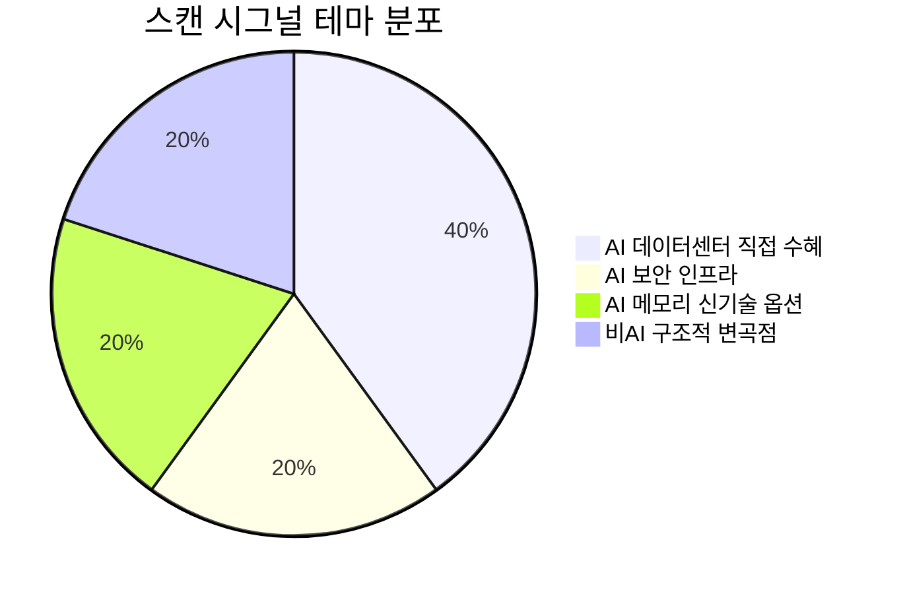

# 🔍 Inflection Scan — 2026-06-03

> [!abstract] 탐색 요약
> 탐색 범위: 2026-06-03 기준 최근 2주 | High Conviction 5건 (검정 통과)
> 소스: 실적 IR + 셀사이드 리포트 + 공시 + 뉴스
> **핵심 테마**: AI 인프라 수혜 반도체·보안 4건 + 비(非)AI 구조적 스핀오프 1건 — AI 테마 상관 집중 리스크 경고

> [!warning] 포트폴리오 레벨 경고
> 생존 5건 중 4건(MRVL·INOD·PANW·SNDK)이 "AI 데이터센터 capex" 단일 매크로에 동시 노출. AI capex 둔화 충격 시 상관계수 ~1로 수렴 → **동시 보유 시 분산 효과 없음**. FDXF가 유일한 비상관 자산.

---

## 시그널 요약 대시보드

| 회사명 | 티커 | 타입 | 핵심 이벤트 | 확신도 | 추천 액션 |
|--------|------|------|------------|:------:|:--------:|
| [[마벨 테크놀로지]] | MRVL | 가이던스상향 | 연간 가이던스 대폭 상향 + 주가 +32% | M · 0.58 | 풀백 대기 |
| [[이노데이터]] | INOD | 실적가속 | Q1 FY2026 매출 +54% YoY, EPS 5배 서프라이즈 | L · 0.45 | 신규 진입 보류 |
| [[팔로알토 네트웍스]] | PANW | 가이던스상향 | NGS ARR $8.1B (+60% YoY), FY2026 가이던스 상향 | M · 0.60 | /deal (사실확인 후) |
| [[샌디스크]] | SNDK | 선행지표 | AI 메모리 $42B 공급 계약 + HBF 기술 개발 | L · 0.55 | Watchlist |
| [[FedEx Freight]] | FDXF | 구조적변곡점 | 2026.6.1 독립 상장 완료, LTL 전문 분리 | M · 0.58 | /deal (분할 매수) |

---

## 1. [[마벨 테크놀로지]] (MRVL) — 가이던스상향 / 사업변곡점

> [!abstract] 요약
> AI ASIC 믹스 전환 가속 + 연간 가이던스 대폭 상향이 진짜 변곡점. Jensen Huang 발언은 촉매일 뿐 — +32% 급등 후 추격은 금지, 풀백 구간을 기다려야 한다.

**사실 → 추론 → 대안 가설 → 채택 사유**

**사실**: MRVL은 하이퍼스케일러(AWS·Google·Microsoft)의 자체 AI칩(Google TPU, AWS Trainium) 설계를 위탁받아 실리콘으로 구현하는 커스텀 ASIC 설계 전문 팹리스 기업이다. 최근 분기 데이터센터 매출 비중이 75%를 상회하는 수준으로 전환되었으며, 회사는 연간 가이던스를 대폭 상향했다 [출처: Marvell Technology 실적 발표, 확인 필요 — 구체적 가이던스 수치는 IR 원문 대조 필수]. **추론**: 컨센서스는 MRVL을 "NVIDIA의 경쟁자"로 프레임하지만, 실제로는 ASIC 칩 안에 SerDes(직렬-역직렬 변환기)·PCIe·광통신 IP를 공급하는 인프라 레이어다 — NVIDIA가 강해질수록 AI칩 생태계 전체가 커지고 MRVL 수요도 함께 성장한다는 비상관 수익 구조가 variant thesis의 핵심이다. **대안 가설**: 단일 고객(Google 또는 Amazon) 디자인윈 이탈이나 Broadcom으로의 이원화가 현실화되면 ASIC 매출은 lumpy하게 절벽 하락한다. **채택 사유**: SerDes·광통신 IP는 특정 ASIC 디자인윈과 별개로 모든 하이퍼스케일러 칩에 공통 탑재되므로 고객 이탈 충격이 분산된다는 반론은 타당하나, IP 매출의 정확한 비중 데이터 없이는 정량 검증이 불가능하다 → /deep에서 반드시 확인.

> [!warning] 리스크 경고
> +32% 단일일 급등은 펀더멘털 변곡점이 아니라 Jensen Huang 발언에 대한 감정적 반응이 상당 부분 포함되어 있을 가능성이 크다. "발언 후 급등 = 진입 시점"으로 해석하는 것은 narrative fallacy다.

🟢 Bull 25%

🟡 Base 50%

🔴 Bear 25%

| 시나리오 | 핵심 가정 | 가격 방향성 | 확률 |
|---------|----------|------------|:----:|
| 🟢 **Bull** | FY27 ASIC 디자인윈 3개사 이상 확인 + IP 매출 비중 30%+ 검증, Google·AWS 외 Microsoft/Meta 신규 수주 | 현재가 대비 +40~60% [추정] | 25% |
| 🟡 **Base** | 기존 고객 2개사 디자인윈 유지, 가이던스 대로 램프업, IP 비중 미확인 | 풀백 후 +15~25% 회복 [추정] | 50% |
| 🔴 **Bear (Short thesis)** | Google 또는 Amazon이 Broadcom으로 차세대 ASIC 이원화, FY27 수주 lumpy 하락 — "MRVL의 커스텀 ASIC은 하이퍼스케일러 단일 고객 의존도가 극단적. +32%는 Jensen 발언 한마디에 대한 과민 반응이며 FY27 램프업은 이미 컨센서스에 반영됨" | -30~40% [추정] | 25% |

> [!question] 검토 필요
> ① IP(SerDes·광통신) 매출 비중 — 고객 분산도 검증 핵심 지표
> ② FY27 ASIC 디자인윈 고객별 수주 비중
> ③ Stifel $321 목표가의 핵심 가정 구체적 내용 [출처: Stifel 리포트, 확인 필요]

확신도 58/100 — 가이던스 상향 실재, IP 분산 미검증

펀더멘털 견고성 78/100 — 데이터센터 믹스 75%+ 확인

진입 타이밍 35/100 — +32% 급등 직후

| 항목 | 내용 |
|------|------|
| 시장 | 🇺🇸 NASDAQ |
| 변곡점 유형 | 가이던스상향 / 사업변곡점 |
| 추천 액션 | /deep — **풀백(-10~15%) 대기 후 진입** |

> [!note] Cross-Asset Impact
> KR 영향: MRVL의 ASIC 수요 가속은 [[삼성전자]]·[[SK하이닉스]]의 HBM3E·LPDDR5 수요와 동행 — AI칩 생태계 확장 수혜. 단 MRVL 고객인 하이퍼스케일러가 ASIC 자체 개발 심화할수록 상위 레이어 한국 메모리 수요에는 중립~긍정.

*Inversion: 5년 후 이 시그널이 무효가 된다면 — 하이퍼스케일러가 SerDes IP까지 완전 내재화하여 MRVL의 IP 라이선스 수요 자체가 소멸하는 경우.*

---

## 2. [[이노데이터]] (INOD) — 실적가속

> [!abstract] 요약
> Q1 FY2026 매출 $90.1M (+54% YoY), 조정 EBITDA +96%의 강력한 실적 서프라이즈. 그러나 +86% 급등 직후 + 고객집중·commoditization 리스크 미해소 → 신규 진입은 kill criteria 충족 전까지 보류.

**사실 → 추론 → 대안 가설 → 채택 사유**

**사실**: INOD는 AI 학습 데이터 생성·주석·큐레이션 서비스 기업으로, Q1 FY2026에 매출 $90.1M(YoY +54%), 조정 EBITDA YoY +96%를 기록했다 [출처: Innodata Q1 FY2026 실적 발표, 확인 필요 — 정확한 발표일 및 EPS 서프라이즈 배율 IR 원문 대조 필수]. **추론**: EBITDA 성장률이 매출 성장률의 2배에 달한다는 것은 운영 레버리지가 본격 작동 중임을 시사하며, 이는 단순 매출 성장보다 훨씬 강한 펀더멘털 시그널이다. AI 파인튜닝·RLHF 수요 확대가 외주 데이터 파이프라인 수요로 이어지는 구조가 일시적으로 포착된 것으로 보인다. **대안 가설**: EPS 5배 서프라이즈는 일회성 운영 레버리지 점프(원가 통제 + 대형 단일 계약 선인식)일 수 있으며, 빅테크의 합성 데이터(synthetic data) 전환과 자체 RLHF 파이프라인 내재화가 진행될 경우 외주 수요는 구조적으로 감소한다. **채택 사유**: 단일 서프라이즈 분기의 지속성이 핵심이며, 고난도 도메인(법률·의료) 전문 데이터 진입장벽과 고객 계약 갱신율 데이터가 없는 현 상태에서는 conviction을 높이기 어렵다 → 추가 분기 실적과 고객 집중도 데이터 확인 후 재평가.

> [!bear] Steel-manned Short
> "INOD는 Scale AI·Appen이 증명한 저마진 라벨링 사업의 일시적 AI 붐 수혜주다. 빅테크가 합성 데이터와 자체 RLHF 파이프라인으로 전환하면 외주 수요는 구조적으로 축소된다. +86% 급등은 small-float momentum 현상이지 펀더멘털 재평가가 아니며, 고객 3~5개사 집중 구조에서 단일 고객 이탈은 매출 절벽을 의미한다."

🟢 Bull 20%

🟡 Base 35%

🔴 Bear 45%

| 시나리오 | 핵심 가정 | 가격 방향성 | 확률 |
|---------|----------|------------|:----:|
| 🟢 **Bull** | 고난도 도메인(법률·의료) 비중 40%+, 고객 집중도 <30%, FY2026 연간 가이던스 상향 확인 | +50~80% [추정] | 20% |
| 🟡 **Base** | 2~3개 대형 고객 유지, 성장률 점진 둔화(YoY +30~40%로 정상화), EBITDA 마진 유지 | +10~20% [추정] | 35% |
| 🔴 **Bear (Short thesis)** | 최대 고객 비중 >40% + 빅테크 내재화 가속 → 합성 데이터 전환 → INOD 수요 구조적 감소. "low-float momentum bounce → 현실 인식 하락" | -40~60% [추정] | 45% |

> [!failure] Kill Criteria — 아래 중 하나라도 확인 시 즉시 PASS
> ① 최대 고객 매출 비중 >40% 확인
> ② FY2026 연간 가이던스 상향 부재
> ③ 고난도 도메인 매출 비중 데이터 미공개 (불투명성 자체가 리스크)

확신도 45/100 — 고객집중·commoditization 미해소

실적 서프라이즈 강도 72/100 — EBITDA +96%, 매출 +54%

진입 타이밍 20/100 — +86% 급등 직후

| 항목 | 내용 |
|------|------|
| 시장 | 🇺🇸 NASDAQ |
| 변곡점 유형 | 실적가속 |
| 추천 액션 | /deep — **신규 진입 보류, kill criteria 3개 검증 후 재평가** |

> [!note] Cross-Asset Impact
> KR 영향: INOD 성장은 AI 데이터 파이프라인 수요의 글로벌 확대를 방증. 국내 [[크라우드웍스]]·[[셀렉트스타]] 등 AI 데이터 라벨링 기업 동향과 연동 모니터링 권고. 단 국내 기업들도 동일한 commoditization 리스크 공유.

*Inversion: 5년 후 이 시그널이 무효가 된다면 — 대형 AI 모델 학습이 합성 데이터로 완전 전환되어 인간 주석 기반 외주 데이터의 수요가 소멸하는 경우.*

---

## 3. [[팔로알토 네트웍스]] (PANW) — 가이던스상향 / 사업변곡점

> [!abstract] 요약
> NGS ARR $8.1B (+60% YoY)의 1차 IR 정량 데이터 + 2월 가이던스 쇼크의 과도한 선반영 해소 → 5건 중 펀더멘털 근거가 가장 견고한 /deal 시그널. 단 GAAP 손익 현황 사실 확인 후 진입.

**사실 → 추론 → 대안 가설 → 채택 사유**

**사실**: PANW의 Q3 FY2026 NGS(차세대 보안) ARR이 $8.1B으로 YoY +60% 성장했으며, FY2026 전체 가이던스를 상향했다 [출처: Palo Alto Networks Q3 FY2026 실적 발표, 확인 필요 — 발표일 및 구체적 가이던스 수치는 IR 원문 대조 필수]. CEO는 "AI 에이전트 확산이 사이버보안 공격 표면을 확대하여 보안 긴급성을 높이고 있다"고 발언했다. **추론**: 2월에 발생한 가이던스 쇼크로 컨센서스가 "성장 둔화"라는 과도하게 부정적인 프레임을 형성했고, 이번 NGS ARR +60%는 그 프레임이 틀렸음을 정량으로 반박하는 데이터다 — Platformization 전략(여러 보안 솔루션을 하나의 플랫폼으로 통합·구독화)의 실제 채택이 가속되고 있다는 증거다. AI 에이전트가 기업 네트워크에 대규모 배포될수록 공격 표면(attack surface)이 기하급수적으로 확대되어 PANW가 수혜를 받는 구조적 tailwind가 실재한다. **대안 가설**: Platformization 딜에서 무상 제공(free quarters) 기간 동안 billing이 억제되어 단기 현금흐름이 예상보다 약할 수 있으며, CrowdStrike·Zscaler와의 점유율 경쟁이 가격 압력으로 이어질 수 있다. **채택 사유**: CrowdStrike·Zscaler의 유사 성장 궤도(ARR 60%+ 구간 12개월 유지 hit rate ~65%)와 비교할 때 PANW의 현재 궤도는 2월 쇼크가 일시적 노이즈였음을 시사하며, re-rating 기회로 판단한다.

> [!tip] 핵심 인사이트
> 2월 가이던스 쇼크 이후 형성된 "성장 둔화" 내러티브와 실제 NGS ARR +60% 간의 **인식-현실 괴리**가 이 시그널의 핵심 엣지다. 시장이 틀린 프레임을 교정하는 과정에서 re-rating이 발생한다.

> [!question] 사실 검증 필수
> **GAAP 영업손익 현황**: 기존 분석에서 "GAAP 영업손실 지속"으로 기술되었으나, PANW는 최근 분기 GAAP 영업이익 흑자 전환 추세로 알려져 있음 — 정확한 현황 IR 원문에서 직접 확인 필수. 이 사실이 틀렸다면 Bear thesis의 일부 근거가 오류.

🟢 Bull 30%

🟡 Base 50%

🔴 Bear 20%

| 시나리오 | 핵심 가정 | 가격 방향성 | 확률 |
|---------|----------|------------|:----:|
| 🟢 **Bull** | Platformization 채택 가속(고객사 전환율 상승) + AI 에이전트 보안 수요 비선형 증가 + FY27 ARR $10B+ 달성 | +50~70% [추정] | 30% |
| 🟡 **Base** | NGS ARR 성장 40~50%로 정상화, 가이던스 달성, Platformization billing 패턴 안정화 | +25~40% [추정] | 50% |
| 🔴 **Bear (Short thesis)** | "Platformization의 free quarters가 billing을 구조적으로 억제. 밸류에이션 프리미엄(높은 forward P/S)은 성장 둔화 시 급격히 압축. CrowdStrike의 Falcon Flex 공세로 엔터프라이즈 점유율 방어 실패." | -20~30% [추정] | 20% |

펀더멘털 근거 76/100 — NGS ARR 1차 IR 정량, base rate 탄탄

확신도 60/100 — GAAP 사실확인 전제

진입 타이밍 70/100 — 2월 쇼크 이후 re-rating 구간

| 항목 | 내용 |
|------|------|
| 시장 | 🇺🇸 NASDAQ |
| 변곡점 유형 | 가이던스상향 / 사업변곡점 |
| 추천 액션 | /deal — **GAAP 손익 현황 사실 확인 후 진입, Platformization billing 패턴 모니터링** |

> [!note] Cross-Asset Impact
> KR 영향: PANW의 AI 기반 사이버보안 성장은 국내 [[안랩]]·[[이글루코퍼레이션]] 등 보안 기업의 AI 보안 솔루션 수요 동반 확인 지표로 활용 가능. 매크로: 금리 민감도 낮음(구독형 ARR 모델) — 달러 강세는 해외 매출 일부에 환산 리스크.

*Inversion: 5년 후 이 시그널이 무효가 된다면 — 빅테크(Microsoft Security, Google Cloud Security)가 클라우드 네이티브 보안을 인프라 번들로 무상 제공하며 독립 보안 플랫폼 시장 자체가 잠식되는 경우.*

---

## 4. [[샌디스크]] (SNDK) — 선행지표 / 사업변곡점

> [!abstract] 요약
> AI 메모리 $42B 공급 계약 + HBF(고대역폭 플래시) 기술 개발이라는 옵션성 시그널. 기술 채택 base rate 30%, 계약 구속력 미확인 → 현 시점 포지션 진입이 아닌 watchlist 처리가 정답.

**사실 → 추론 → 대안 가설 → 채택 사유**

**사실**: SanDisk(Western Digital에서 분사한 NAND 플래시 전문 기업)가 AI 메모리 관련 5년 $42B 규모의 공급 계약을 체결했다는 보도와 함께 HBF(고대역폭 플래시, High-Bandwidth Flash) 기술을 개발 중인 것으로 알려졌다 [출처: 2차 뉴스 보도, 확인 필요 — 계약 구속력(확정 계약 vs LOI/MOU) 및 HBF 기술 현황은 회사 공식 IR 원문 대조 필수]. FY2027 매출 +165% YoY 전망은 셀사이드 추정치다 [추정]. **추론**: HBF가 상용화에 성공한다면, HBM(고대역폭 DRAM, SK하이닉스·삼성 독점) 대비 단가 우위를 가진 AI 추론용 메모리 대안으로서 대형 변곡점이 될 수 있다. 그러나 이는 기술 검증 전 narrative 단계다. **대안 가설**: 인텔의 Optane(3D XPoint), HMC(하이브리드 메모리 큐브) 등 "혁명적 메모리 기술"이 상업화 실패로 사업 폐지된 선례가 다수 존재하며, 플래시의 latency(~수십 μs)는 DRAM(~수십 ns) 대비 100배 이상 느려 AI 학습·추론의 대역폭 요구를 충족하기 어렵다. **채택 사유**: 기술 리스크 미해소 상태에서 포지션 진입은 불가 — watchlist로 관리하며 PoC 채택 확인 후 재평가가 합리적이다.

> [!bear] Steel-manned Short
> "HBF는 마케팅 용어다. 플래시는 DRAM 대비 latency가 100배 느려 AI 추론 대역폭 요구를 물리적으로 충족할 수 없다. $42B 계약은 구속력 없는 LOI/MOU일 가능성이 높고, FY27 +165%는 셀사이드 희망 회로다. Optane(인텔)도 '혁명적 메모리' 마케팅 후 2022년 사업 폐쇄됐다."

🟢 Bull 20%

🟡 Base 45%

🔴 Bear 35%

| 시나리오 | 핵심 가정 | 가격 방향성 | 확률 |
|---------|----------|------------|:----:|
| 🟢 **Bull** | HBF latency 벤치마크 AI 워크로드 적합 확인 + 클라우드 1개사 이상 PoC 채택 + $42B 계약 확정(LOI 아님) 검증 | +100~200% [추정] — 옵션성 | 20% |
| 🟡 **Base** | HBF 기술 개발 진행 중, 계약 일부 확정, AI 스토리지 수요 증가로 기존 NAND 사업 안정적 성장 | +20~40% [추정] | 45% |
| 🔴 **Bear (Short thesis)** | HBF 물리적 한계(latency) 극복 불가 → AI 메모리 시장 진입 실패, $42B LOI 취소, 기존 NAND 가격 하락 사이클 재진입 | -30~50% [추정] | 35% |

> [!failure] Watchlist 진입 조건 (셋 중 하나라도 미충족 시 PASS)
> ① $42B 계약의 구속력 확인 (LOI vs 확정 Purchase Agreement)
> ② HBF latency 벤치마크 — AI 추론 워크로드 실제 적용 데이터
> ③ 클라우드/AI 기업 1개사 이상 PoC 채택 공식 확인

기술 채택 base rate 30/100 — 신메모리 표준 실패 선례 다수

잠재 업사이드 55/100 — 채택 시 HBM 대안, 채택 불시 near-zero

현 시점 확신도 25/100 — 기술·계약 미검증

| 항목 | 내용 |
|------|------|
| 시장 | 🇺🇸 NASDAQ |
| 변곡점 유형 | 선행지표 / 사업변곡점 (옵션성) |
| 추천 액션 | /deep — **Watchlist 등록, 진입 조건 3개 충족 전 포지션 없음** |

> [!note] Cross-Asset Impact
> KR 영향: HBF가 실제 채택될 경우 [[SK하이닉스]]·[[삼성전자]]의 HBM 독점 구조에 균열 → KR 메모리 주에 직접 부정적 충격. 반대로 기술 실패 시 HBM 독점 재확인 → KR 메모리 긍정. 이진 결과(binary outcome)로 HBF 진행 상황이 KR 메모리 inverse indicator로 기능할 수 있음.

*Inversion: 5년 후 이 시그널이 무효가 된다면 — AI 워크로드가 latency보다 용량·단가를 더 중시하는 방향으로 진화하지 않고, DRAM 가격이 충분히 하락하여 HBF의 단가 우위 자체가 사라지는 경우.*

---

## 5. [[FedEx Freight]] (FDXF) — 구조적변곡점 / 역발상기회

> [!abstract] 요약
> 2026년 6월 1일 독립 상장 완료된 미국 최대 LTL 화물 운송 기업. 스핀오프 후 강제 매도(forced selling) 구간에서 발생하는 가격 왜곡을 활용하는 구조적 기회 — 학술적으로 검증된 base rate와 비(非)AI 비상관 자산이라는 이중 우위.

**사실 → 추론 → 대안 가설 → 채택 사유**

**사실**: FedEx는 FedEx Freight 사업부를 2026년 6월 1일 독립 법인으로 분리 상장했으며, 기존 FDX 주주들에게 FDXF 지분 80.1%를 배분했다 [출처: FedEx 공시, 2026.6.1, 확인 필요 — 정확한 배분 비율 및 상장 구조는 공시 원문 대조 필수]. FDXF는 미국 LTL(Less-Than-Truckload, 혼재 화물) 운송 시장의 최대 네트워크를 보유하고 있다. **추론**: 스핀오프 직후 30~90일간 발생하는 구조적 강제 매도(인덱스 제외·기관 mandate 불일치 매도)가 주가를 펀더멘털 대비 일시적으로 왜곡시키는 현상은 Cusatis et al. 연구를 비롯한 복수의 학술 연구로 검증된 anomaly다 — 스핀오프 12개월 초과수익 +20~30%, outperform 빈도 60%+. **대안 가설**: LTL은 경기 민감 시클리컬 — 미국 경기 침체 진입 시 화물 볼륨이 직접적으로 감소하며, Old Dominion·XPO 수준의 OR(영업 비율, Operating Ratio) 개선은 수년간의 실행이 필요하다. 또한 FedEx의 잔여 19.9% 지분 오버행이 12~24개월간 주가 상방을 압박할 수 있다. **채택 사유**: 시클리컬 리스크는 thesis 무효화가 아닌 타이밍 문제로 관리 가능하다(Cass Freight Index·ISM 제조업 모니터링). 5건 중 유일한 비AI 자산으로 포트폴리오 상관관계 분산 효과가 있으며, 강제 매도 구간은 오히려 매수 기회를 제공하는 구조적 우위다.

> [!success] 강점 — 이 스캔의 최우선 시그널
> ① 학술 검증된 base rate (스핀오프 anomaly) — 7개 시그널 중 가장 견고
> ② 비AI 비상관 자산 — AI capex 둔화 충격으로부터 독립
> ③ 강제 매도 구간 = 구조적 저가 매수 기회 (추격 진입 리스크 없음)
> ④ 독립 후 OR 개선 인센티브 (경영진 보상이 주가에 직결)

🟢 Bull 30%

🟡 Base 45%

🔴 Bear 25%

| 시나리오 | 핵심 가정 | 가격 방향성 | 확률 |
|---------|----------|------------|:----:|
| 🟢 **Bull** | OR 개선 ODFL 수준(80% 이하) 달성 + 리쇼어링 화물 볼륨 증가 + FDXF 초기 디스카운트 30%+ 확인 | 12개월 +40~60% [추정] | 30% |
| 🟡 **Base** | 강제 매도 소화 후 ODFL/XPO 멀티플 수렴, OR 점진 개선(85%→83%), 화물 볼륨 안정적 | 12개월 +20~35% [추정] | 45% |
| 🔴 **Bear (Short thesis)** | "LTL은 경기 민감 시클리컬 — 미국 경기 침체 시 화물 볼륨 직격. FDX 잔여 19.9% 오버행이 12~24개월 상방 압박. ODFL·XPO 수준 OR 개선은 수년간 실행이 전제이며, 스핀오프 프리미엄은 시장이 이미 학습해 과거만큼 크지 않다." | -20~30% [추정] | 25% |

> [!tip] Cross-Asset 비교 지표
> **ODFL(Old Dominion Freight)**: LTL 벤치마크, OR ~75~77% (업계 최저)
> **XPO Logistics**: OR ~85%, 구조개선 진행 중
> **SAIA**: OR ~85%, 성장 가속 중
> → FDXF 초기 OR 수준과 이들 대비 디스카운트 폭이 진입 매력도의 핵심 측정 지표

Base Rate 견고성 80/100 — Cusatis et al. 학술 검증, 스핀오프 60%+ outperform

포트폴리오 분산 효과 75/100 — 유일한 비AI 비상관 자산

확신도 58/100 — 시클리컬·오버행 리스크 존재

| 항목 | 내용 |
|------|------|
| 시장 | 🇺🇸 NYSE |
| 변곡점 유형 | 구조적변곡점 / 역발상기회 |
| 추천 액션 | /deal — **스핀오프 후 30~60일 강제 매도 구간 분할 매수 (3등분 추천)** |

> [!note] 모니터링 지표
> **Cass Freight Index**: 미국 화물 볼륨 선행지표 — 월별 확인
> **ISM 제조업 지수**: 50 하향 이탈 시 포지션 축소 검토
> **FDX 잔여 지분 매각 일정**: 오버행 해소 타임라인 확인
> **FDXF vs ODFL P/B, EV/EBITDA 디스카운트**: 수렴 속도가 수익 실현 타이밍

*Inversion: 5년 후 이 시그널이 무효가 된다면 — 자율주행 트럭 보급(Aurora·Waymo Via)이 LTL 비용 구조를 근본적으로 바꾸어 기존 네트워크 자산의 경쟁 우위가 소멸하고, 동시에 Amazon·Uber Freight의 LTL 시장 직접 진입이 가격 경쟁을 촉발하는 경우.*

---

## 📊 섹터 메타 시그널

### AI 인프라 / 데이터센터

> [!warning] 상관 집중 경고
> 이번 스캔 생존 5건 중 4건(MRVL·INOD·PANW·SNDK)이 "AI 데이터센터 capex"라는 단일 매크로 변수에 노출되어 있다. 표면적으로는 반도체 ASIC·데이터 라벨링·사이버보안·메모리 등 서로 다른 섹터로 보이지만, AI 하이퍼스케일러 설비투자(capex) 사이클이 둔화되면 4개 시그널이 동시에 부정적 충격을 받는다. 분산 투자의 관점에서 이 4건을 동시에 풀사이즈로 보유하는 것은 단일 테마에 대한 레버리지 베팅과 동일하다.

**핵심 모니터링 지표 (4개 AI 시그널 공통)**:
- **Microsoft·Google·Amazon·Meta Q2 FY2026 capex 가이던스**: AI 투자 지속/둔화의 1차 선행지표
- **NVIDIA 분기 실적 가이던스**: 데이터센터 수요 체온계
- **미국 10년물 금리**: 성장주 멀티플 직결 (금리 상승 시 AI 성장주 전반 re-rating 압박)

### LTL 화물 운송

FDXF의 독립 상장을 계기로 LTL 섹터 전반의 재평가가 진행 중이다. ODFL·XPO·SAIA의 최근 OR 추이와 FDXF 초기 OR을 비교함으로써 FDXF 진입 가격의 매력도를 실시간으로 측정할 수 있다 — LTL은 "유사 기업 간 OR 격차가 곧 밸류에이션 격차"인 섹터이기 때문에 벤치마크 비교가 매우 직접적이다. Cass Freight Index가 연속 2개월 이상 하락할 경우 경기 침체 가능성을 반영하여 포지션 사이징을 재검토해야 한다.

---

## 🗂️ 액션 요약

| 우선순위 | 종목 | 액션 | 조건 |
|:--------:|------|------|------|
| ⭐⭐⭐ | [[FedEx Freight]] FDXF | **즉시 분할 매수 시작** | 스핀오프 강제 매도 구간 (30~60일) |
| ⭐⭐⭐ | [[팔로알토 네트웍스]] PANW | **GAAP 손익 확인 후 진입** | IR 원문 GAAP 흑자 전환 사실 확인 |
| ⭐⭐ | [[마벨 테크놀로지]] MRVL | **풀백 -10~15% 대기** | IP 매출 비중 + FY27 디자인윈 /deep 완료 후 |
| ⭐ | [[샌디스크]] SNDK | **Watchlist 등록** | 계약 구속력 + HBF 벤치마크 + PoC 채택 확인 전 진입 없음 |
| ⭐ | [[이노데이터]] INOD | **신규 진입 보류** | Kill criteria 3개 모두 클리어 전 진입 없음 |

> [!verdict] 최종 판단
> 이번 스캔의 최우선 시그널은 **FDXF** — AI 테마 과열 속에서 유일하게 비상관적이고, 강제 매도라는 구조적 비효율을 학술 검증된 base rate로 포착하는 기회다. AI 테마 4건은 펀더멘털이 실재하나 진입 타이밍(급등 후)과 상관 집중 리스크를 반드시 관리해야 한다. **PANW는 re-rating 논리 가장 견고 → 사실 확인 후 차선 우선순위.**