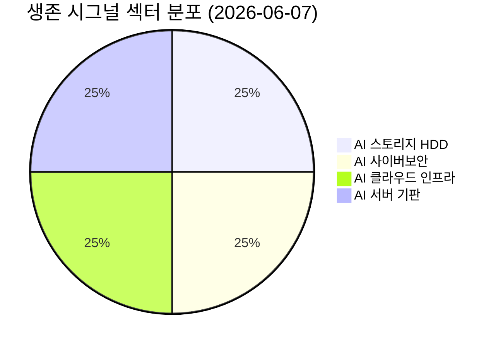

# 🔍 Inflection Scan — 2026-06-07

> [!abstract] 탐색 요약
> 탐색 범위: 2026-06-07 기준 최근 2주 | High Conviction **4건** 생존 (6건 입력 → 2건 DROPPED)
> 소스: 분기 실적 발표(1차 IR) + 셀사이드 리포트 + 공급망 분석
> **핵심 테마**: AI 인프라 CapEx 사이클이 실적 가속으로 전환되는 변곡점 — 보안·클라우드·스토리지·기판 전 레이어에서 동시 확인, 단 **단일 AI 테마 과집중 리스크** 주의

> [!warning] 포트폴리오 경고
> 생존 4건 **전원 AI 인프라 테마** (보안/클라우드/스토리지/기판). AI CapEx 사이클 둔화 시 4건 동시 하락하는 **상관 리스크** 실재. 비-AI 분산 시그널 보완을 권고.

---

## 시그널 요약 대시보드

| 회사명 | 티커 | 타입 | 핵심 이벤트 | 확신도 | 추천 액션 |
|--------|------|------|------------|:------:|:--------:|
| [[Western Digital]] | WDC | 가이던스상향/선행지표 | FQ4 가이던스 상향 + Nearline HDD 2026 완판, 2027-28 계약 연장 확보 | 🟢 P=0.60 | /deal |
| [[Palo Alto Networks]] | PANW | 가이던스상향/실적가속 | FY2026 매출 가이던스 +24% 상향 + NGF 예약 YoY +40% (10년 최고) | 🟡 P=0.58 | /deal |
| [[Oracle]] | ORCL | 선행지표/가이던스상향 | FY2027 CapEx $800~1,000억 예고 + FY27 매출 +32% 전망 — 6/10 실적 카탈리스트 | 🟡 P=0.52 | /deal |
| [[이수페타시스]] | 007660.KS | 선행지표/실적가속 | AI 서버(Dell 포함) 고다층 MLB 직접 공급 — Dell +19% AI 서버 가이던스 연동 | 🟡 P=0.50 | /deep |

---

## 1. [[Western Digital]] (WDC) — 사이클주→구조적 성장주 변곡점

> [!abstract] 핵심 요약
> FQ4 가이던스 상향 + Nearline HDD 2026년 완판, 2027-2028 계약 확보. Flash(SanDisk) 분사 완료로 NAND 노이즈 제거 — 순수 HDD 플레이로 thesis 가장 명료.

**사실 → 추론 → 대안 → 채택:**

**사실**: WDC는 FQ4 가이던스를 상향했으며 Nearline HDD는 2026년 완판, 계약이 2027-2028년까지 연장됐다 (출처: WDC 분기 실적 발표). 2025년 2월 Flash(SanDisk) 사업 분사를 완료해 현재 순수 HDD 기업으로 전환됐다. **추론**: Nearline HDD는 AI 학습 데이터 저장의 비용 효율적 대안으로 — GB당 원가가 NAND의 약 1/5 수준 [추정] — AI 데이터센터 구축이 가속될수록 WDC의 용량 수요는 구조적으로 증가한다. HDD 시장은 WDC·Seagate·Toshiba 3사 과점 구조로 가격 규율이 우수하고 대규모 추가 CapEx 없이 수익성을 유지할 수 있다. **대안**: "HDD는 사양 산업, 2028년 계약은 ASP 고점 lock-in일 뿐 물량 성장이 아니다"는 반박이 존재한다. **채택**: SSD가 HDD GB당 원가 패리티에 도달하는 시점은 업계 컨센서스 기준 2030년 이후로 추정되며 [추정], 2028년 계약은 사이클 리스크를 실질적으로 완화한다. Flash 분사로 NAND 가격 변동이라는 노이즈가 제거되어 오히려 thesis가 강화됐다. 유사 사례: Seagate는 2020-2021 Nearline 수요 급증 국면에서 12개월 +90%를 기록했다.

🟢 Bull 35%

🟡 Base 45%

🔴 Bear 20%

| 시나리오 | 핵심 가정 | 12M 목표가 | 업사이드 |
|---------|----------|-----------|---------|
| 🟢 Bull | Nearline 백로그 유지 + HDD ASP 지속 상승 + 과점 가격 규율 | $130+ | +50%+ |
| 🟡 Base | AI HDD 구조적 성장, 2027-28 계약 정상 이행 | $100 | +16% |
| 🔴 Bear (Steel-manned Short) | AI CapEx 둔화 + QLC SSD의 HDD 잠식 예상보다 가속 + 소수 하이퍼스케일 고객 이탈 | $60 | -28% |

> [!success] 이번 스캔 최고 확신 시그널
> 유일하게 **1차 IR 검증 백로그(2028 계약)** + 과점 시장 가격 규율 + Flash 분사로 NAND 노이즈 제거가 동시 충족. Variant Perception(사이클주 → 구조적 성장주 재평가)이 가장 명확.

> [!note] Cross-Asset Impact
> WDC 강세는 한국 [[Seagate]] 경쟁 구도보다 **[[삼성전자]] NAND 사업부와 대조적 포지션** — HDD가 AI 저장 우위를 유지하는 동안 NAND 가격 회복 지연 가능성. 매크로 금리 민감도: CapEx-light 과점 사업 특성상 상대적으로 금리 영향 낮음.

펀더멘털 견고성 82/100

Variant Perception 명료도 78/100

비대칭 업사이드 62/100

| 항목 | 내용 |
|------|------|
| 시장 | 🇺🇸 NASDAQ |
| 변곡점 유형 | 가이던스상향 / 선행지표 (구조적 전환) |
| Conviction | [Confidence: H \| 근거: 1차 IR(가이던스+백로그) + 2차 셀사이드(목표가 상향 복수)] P=0.60 |
| 추천 액션 | /deal — 1차 IR 검증 완료. 진입 시 Nearline ASP 유지 여부 분기마다 확인 |
| Inversion (5년 후 무효 이유) | SSD 원가 하락이 예상보다 3~5년 앞당겨져 2028 계약 갱신 시 물량 급감 |

---

## 2. [[Palo Alto Networks]] (PANW) — 플랫폼화 전략 가속 확인

> [!abstract] 핵심 요약
> FY2026 매출 가이던스 +24% 상향, 차세대 방화벽(NGF) 예약 YoY +40%로 10년 만에 최고 성장률. "플랫폼화 = 단기 실적 희생" 컨센서스 내러티브가 깨지는 변곡점.

**사실 → 추론 → 대안 → 채택:**

**사실**: PANW는 FY2026 매출 가이던스를 약 $114억 수준(YoY +24%)으로 상향했으며, NGF 예약이 YoY 약 40% 증가해 10년 만의 최고 성장률을 기록했다고 발표했다 (출처: PANW 분기 실적 발표). **추론**: 예약(bookings) 가속은 통상 2~3분기 후 billings 가속으로 전환되는 선행지표로 기능한다. AI 데이터센터 확산은 공격 표면(attack surface)을 기하급수적으로 늘리고 있으며, PANW의 Cortex AI Security 플랫폼은 네트워크·엔드포인트·클라우드·SOC를 아우르는 통합 스택을 제공한다 — 단, [[Microsoft]] Defender와 [[CrowdStrike]]도 강력한 플랫폼화를 진행 중임을 명시해야 한다. 고객이 툴을 통합할수록 PANW의 스위칭 비용이 높아지고 ARR이 가속되는 구조는 유효하다. **대안**: "platformization은 무료 제품 끼워주기(give-away)로 billings를 인위적으로 부풀리며 ARR 품질이 낮다"는 short thesis가 있다 — 이는 NRR(순매출유지율) 110%+ 유지 여부로 검증해야 하나 본 데이터에서 NRR 미확인이 약점이다. 또한 이미 시총 $1,200억+ 대형주로 2~3배 폭발력보다는 리레이팅(PER 재평가) 수준의 업사이드다. **채택**: 이벤트 드리븐 가이던스 상향 + 10년 최고 예약 성장이라는 1차 IR 검증 신호는 유효하나, NRR/RPO 품질 확인이 전제되어야 conviction을 높일 수 있다. 유사 사례: [[CrowdStrike]]가 플랫폼 모멘텀이 인정받던 2021Q2 이후 12개월 +85%.

🟢 Bull 30%

🟡 Base 50%

🔴 Bear 20%

| 시나리오 | 핵심 가정 | 12M 목표가 | 업사이드 |
|---------|----------|-----------|---------|
| 🟢 Bull | AI 에이전트 보안 전사 배포 가속, billings YoY +35%+, NRR 115%+ 확인 | $220+ | +35% |
| 🟡 Base | 플랫폼화 지속, 매출 성장 24%, NRR 110% 유지 | $185 | +13% |
| 🔴 Bear (Steel-manned Short) | platformization이 give-away 전략으로 ARR 품질 저하 확인, RPO 성장률 둔화, IT 예산 동결로 대형 계약 지연, MSFT Defender가 무료 번들 공세 | $135 | -17% |

> [!question] 검토 필요
> **NRR(순매출유지율) 및 RPO 고객 다변화 데이터** 미확인. NRR이 110% 미만으로 하락 중이라면 Bear 시나리오 확률을 20%→30%로 상향해야 함. 다음 분기 실적 시 이 두 지표를 최우선 확인할 것.

> [!note] Cross-Asset Impact
> PANW 플랫폼 가속은 한국 사이버보안 벤더 [[안랩]], [[이글루코퍼레이션]] 등에는 **경쟁 심화** 압력으로 작용. 매크로 금리: SaaS 할인율 민감 — 고금리 장기화 시 ARR 멀티플 압축 리스크.

이벤트 드리븐 강도 75/100

ARR 품질 확인도 65/100

경쟁 우위 지속성 60/100

| 항목 | 내용 |
|------|------|
| 시장 | 🇺🇸 NASDAQ |
| 변곡점 유형 | 가이던스상향 / 실적가속 |
| Conviction | [Confidence: M-H \| 근거: 1차 IR(실적 발표·가이던스) + 2차 셀사이드(목표가 상향 다수)] P=0.58 |
| 추천 액션 | /deal — 가이던스 상향 확인. 단, NRR/RPO 품질 지표 추가 검증 필수 |
| Inversion (5년 후 무효 이유) | Microsoft가 Azure AI Security를 무료 번들로 공급하며 PANW의 엔터프라이즈 플랫폼 경쟁력을 구조적으로 잠식 |

---

## 3. [[Oracle]] (ORCL) — AI 클라우드 CapEx 선행 베팅 + 6/10 이벤트 드리븐

> [!abstract] 핵심 요약
> FY2027 CapEx $800~1,000억 예고 + FY2027 매출 YoY +32% 성장 전망. 6월 10일 실적 발표가 명확한 이벤트 드리븐 카탈리스트. 단, OpenAI/Stargate 고객 집중 및 FCF 압박 리스크가 실재한다.

**사실 → 추론 → 대안 → 채택:**

**사실**: ORCL은 FY2027 CapEx를 $800~1,000억 규모로 예고하고 FY2026 매출 YoY +17%, FY2027 +32% 성장을 전망했다 (출처: Oracle 경영진 가이던스, 확인 필요). 6월 10일 분기 실적 발표가 예정되어 있어 RPO(잔여이행의무) 지표가 공개될 예정이다. **추론**: "기업이 확정 계약 없이 $1,000억 규모 CapEx를 공개 선언하지 않는다"는 논리는 합리적이나, OCI의 AI 클라우드 전환 가속과 엔터프라이즈 DB 마이그레이션이 실제로 연결되는지를 RPO 데이터로 검증해야 한다. CapEx가 매출로 전환되는 데 통상 12~18개월이 걸리며, AWS(2015-2017)와 Azure(2018-2020)의 CapEx 급증 후 2년 CAGR 35%+ 패턴이 참고 사례다. **대안**: 핵심 반박은 CapEx $1,000억이 OpenAI/Stargate 단일 메가딜에 집중되어 있다는 것 — 이 고객이 자체 인프라로 이탈하거나 자금 문제가 생기면 ORCL은 좌초 자산(stranded asset)을 떠안을 수 있다. FCF 악화가 직접적으로 수반되며, ORCL은 이미 부채 수준이 높은 재무 구조다. **채택**: RPO 급증의 고객 다변화 여부가 6/10 실적의 핵심 관전 포인트. RPO가 다변화되어 있다면 bull 케이스가 강화되고, 단일 고객 집중이 확인되면 bear 확률을 즉시 상향해야 한다.

🟢 Bull 25%

🟡 Base 50%

🔴 Bear 25%

| 시나리오 | 핵심 가정 | 12M 목표가 | 업사이드 |
|---------|----------|-----------|---------|
| 🟢 Bull | 6/10 RPO 가속 + 고객 다변화 확인 + CapEx 효율 입증 | $280+ | +30%+ |
| 🟡 Base | FY27 성장 25~30%, FCF 일시 압박 감내, RPO 완만 성장 | $230 | +7% |
| 🔴 Bear (Steel-manned Short) | OpenAI 고객 집중 + 자체 인프라 이탈 시 좌초 자산 $1,000억 + FCF 마이너스 전환 + 고부채 구조에서 금리 부담 가중 | $165 | -23% |

> [!tip] 6/10 실적 핵심 체크리스트
> ① RPO 증가율 (YoY 기준) — 가속이면 Bull 방향
> ② **RPO 고객 다변화 정도** — 단일 고객 집중이면 품질 낮음, bear 확률 ↑
> ③ FCF 가이던스 — CapEx $1,000억에도 FCF 흑자 유지 여부

> [!note] Cross-Asset Impact
> ORCL OCI 성장 가속은 한국 클라우드 벤더 [[네이버클라우드]], [[KT클라우드]]에 간접 경쟁 압력. 매크로: 고부채 + CapEx 급증 구조로 금리 민감도 **높음** — 금리 인하 사이클 진입 시 FCF 부담 완화, 반대로 고금리 장기화 시 bear 케이스 확률 직접 상승.

이벤트 드리븐 명확성 70/100

고객 집중 리스크 관리 45/100

FCF 지속가능성 55/100

| 항목 | 내용 |
|------|------|
| 시장 | 🇺🇸 NYSE |
| 변곡점 유형 | 선행지표 / 가이던스상향 |
| Conviction | [Confidence: M \| 근거: 2차 셀사이드(CapEx 가이던스) + 3차 추정(성장률 전환)] P=0.52 |
| 추천 액션 | /deal — 6/10 실적 이벤트 드리븐. RPO 다변화·FCF 가이던스 확인 후 포지션 조정 |
| Inversion (5년 후 무효 이유) | OpenAI가 자체 칩/클라우드 인프라를 내재화하며 OCI 의존도를 대폭 축소, ORCL의 $1,000억 CapEx가 수익화에 실패 |

---

## 4. [[이수페타시스]] (007660.KS) — AI 서버 고다층 MLB 수주 가속 timing

> [!abstract] 핵심 요약
> Dell 등 글로벌 AI 서버 업체에 고다층 MLB를 직접 공급 중. 전방 수요(Dell +19% AI 서버 가이던스)와 직접 연결되나, **한국 시장에서 이미 AI MLB 대표 수혜주로 광범위 커버**됨 — "숨겨진 수혜주"가 아닌 "수주 가속 timing의 정량 미반영"이 진짜 edge.

**사실 → 추론 → 대안 → 채택:**

**사실**: 이수페타시스는 Dell을 포함한 글로벌 AI 서버 업체에 고다층 MLB(Multi-Layer Board)를 공급하고 있다. AI 서버 1대당 MLB는 일반 서버 대비 층수 2~3배, 단가 5~10배 수준으로 추정된다 [추정]. **추론**: AI 서버용 고다층 MLB는 Dell/HP/슈퍼마이크로 등 주요 서버 업체의 검증을 완료한 극소수 업체만 공급 가능한 고진입장벽 제품이다. HDD 과점 시장과 유사하게, MLB 역시 검증된 소수 공급업체 중심의 가격 규율이 가능하다. 그러나 컨센서스는 이미 이수페타시스를 AI MLB 대표 수혜주로 광범위하게 커버하고 있어 — 2024년 주가가 이미 큰 폭으로 상승한 이력 포함 — "정보 비대칭"에 의한 alpha는 제한적이다. **대안**: 진짜 edge는 "전방 수주 가속 분기의 정량 timing이 아직 충분히 반영되지 않았는가"의 문제다. 구체적으로 수주잔고(백로그) YoY 성장률과 ASP 추이가 Dell +19% 가이던스와 실제로 연결되어 있는지 IR 데이터로 검증이 필요하다. **채택**: 2024년 유상증자 희석 이력, 고객 집중 리스크, CapEx 부담이 실재하며 정량 검증 전까지 conviction을 제한적으로 유지하는 것이 적절하다. 유사 사례: 대덕전자, [[TTM Technologies]] 등 AI 서버 PCB 업체들의 수주 가시화 시점 이후 12개월 +50~100% 패턴이 참고 사례다.

> [!warning] Bias 교정 완료
> 원시 시그널의 "글로벌 미발견 / 정보 비대칭 큼" 주장은 **한국 편중 bias + narrative fallacy**. 이수페타시스는 국내에서 AI MLB 대표주로 이미 광범위하게 커버됨. Variant Perception을 "미발견"에서 "수주 가속 timing 정량 미반영"으로 재정의했다.

🟢 Bull 30%

🟡 Base 45%

🔴 Bear 25%

| 시나리오 | 핵심 가정 | 12M 목표가 (추정) | 업사이드 |
|---------|----------|-----------------|---------|
| 🟢 Bull | AI 서버 CapEx 지속 + ASP 상승 + 수주잔고 YoY 가속 확인 | 55,000원+ | +80%+ |
| 🟡 Base | 수주 가시성 유지, 점진적 실적 성장 | 40,000원 | +30% |
| 🔴 Bear (Steel-manned Short) | AI 서버 CapEx 둔화 + 2024년 이미 리레이팅 완료(upside 소진) + 유상증자 희석 재발 우려 + Dell→수주 연결 정량 증거 미확인 | 22,000원 | -28% |

> [!tip] 핵심 검증 포인트
> **Dell +19% AI 서버 가이던스 → 이수페타시스 수주잔고(YoY) 직접 연결 여부**가 thesis의 전부. IR 컨택 또는 분기 실적 발표에서 수주잔고 증가율 + ASP 추이를 정량 확인하기 전까지 포지션 규모를 제한적으로 유지해야 한다.

> [!note] Cross-Asset Impact
> 이수페타시스 수혜 구조는 미국 [[TTM Technologies]], [[Sanmina]] 등 AI 서버 PCB/기판 업체와 동일한 투자 thesis. US 동종 업체의 분기 가이던스가 이수페타시스 수주 가속의 선행 지표로 활용 가능. 환율: USD/KRW 상승(원화 약세) 시 달러 매출 비중이 높은 이수페타시스에 긍정적.

구조적 수요 논리 68/100

정량 검증 완료도 42/100

Variant Perception 명료도 55/100

| 항목 | 내용 |
|------|------|
| 시장 | 🇰🇷 코스피 |
| 변곡점 유형 | 선행지표 / 실적가속 |
| Conviction | [Confidence: M \| 근거: 2차 셀사이드(공급망 분석) + 3차 추정(전방 가이던스→수주 전환)] P=0.50 |
| 추천 액션 | /deep — 수주잔고/ASP IR 직접 확인 필수. 정량 검증 전 풀사이즈 진입 비권고 |
| Inversion (5년 후 무효 이유) | AI 서버가 표준화되면서 MLB 단가가 범용화(commoditization)되고, 대만/중국 경쟁 업체의 진입으로 이수페타시스의 가격 프리미엄이 소멸 |

---

## 📊 섹터 메타 시그널

### AI 인프라 전 레이어 동시 가속 — 상관 리스크 경고

> [!warning] 단일 테마 과집중 경고
> 이번 스캔 생존 4건 전원이 AI 인프라 테마(보안/클라우드/스토리지/기판)에 집중되어 있다. 이는 AI CapEx 사이클 둔화 또는 빅테크의 투자 속도 조절 시 **4건이 동시에 하락하는 포트폴리오 상관 리스크**를 내포한다.

이번 스캔의 핵심 관통 패턴은 AI 인프라 CapEx가 실제 수요로 전환되는 구체적 증거들이 분기 실적 시즌을 통해 동시에 가시화되고 있다는 점이다. WDC의 2028년 계약 확보, ORCL의 $1,000억 CapEx 선언, PANW의 NGF 예약 40% 급등, 이수페타시스의 Dell 수주 연동은 모두 동일한 매크로 사이클에 의존한다. 따라서 개별 종목의 펀더멘털 우열(WDC > PANW > ORCL > 이수페타시스)과 무관하게, 포트폴리오 차원에서는 비-AI 분산 시그널 보완이 필요하다.

### Conviction 순위 및 추천 우선순위

| 순위 | 종목 | P값 | 추천 | 핵심 근거 |
|:----:|------|:---:|:----:|----------|
| 1 | [[Western Digital]] WDC | 0.60 | 🟢 /deal | 1차 IR 백로그 + 과점 + Flash 분사 thesis 명료 |
| 2 | [[Palo Alto Networks]] PANW | 0.58 | 🟢 /deal | 가이던스 상향 + 예약 선행지표 확인. NRR 후속 검증 |
| 3 | [[Oracle]] ORCL | 0.52 | 🟡 /deal | 6/10 이벤트 드리븐. RPO 다변화 실시간 확인 |
| 4 | [[이수페타시스]] 007660.KS | 0.50 | 🟡 /deep | 수주잔고 정량 확인 전 포지션 제한 |

---

> [!failure] DROPPED 시그널 메모
> **MRVL (Marvell Technology)**: Reddit/CEO 코멘트 중심의 sentiment 시그널. Variant Perception 부재, 펀더멘털 변곡점 미달로 탈락.
> **HON (Honeywell)**: 본문 불완전 + 기발표 이벤트 중심. 신규 변곡점 요건 미충족으로 탈락.

> [!verdict] 스캔 최종 판단
> **Best Idea**: [[Western Digital]] (WDC, P=0.60) — 1차 IR 검증 백로그·과점 구조·Flash 분사로 thesis가 이번 스캔 중 가장 명료하고 견고하다. **이벤트 드리븐 우선**: [[Oracle]] 6/10 실적 발표가 가장 가까운 카탈리스트로, RPO 데이터 실시간 확인이 ORCL 포지션의 즉각적 trigger가 될 것이다. 전체 4건 모두 AI 인프라 단일 테마임을 인지하고, 개별 종목 분석과 무관하게 포트폴리오 AI 비중이 과도하다면 분산을 우선 검토할 것.

---
*본 리포트는 투자 참고 자료이며 매수/매도 추천이 아닙니다. 모든 [추정] 태그 항목은 1차 IR 또는 공신력 있는 소스로 직접 검증하세요.*