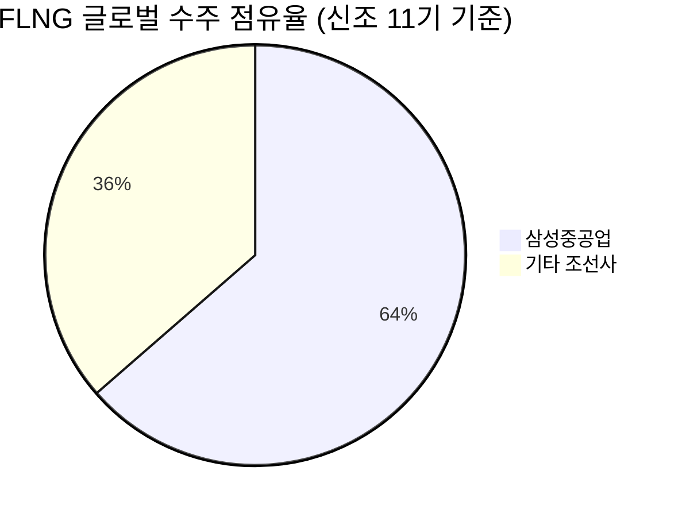

# 🔍 Inflection Scan — 2026-06-08

> [!abstract] 탐색 요약
> 탐색 범위: 2026-06-08 기준 최근 2주 | High Conviction 4건 생존 (6건 검정 → KEEP 1 / REVISE 3 / DROP 2)
> 소스: 1차 IR(실적 발표·수주 공시) + 2차 셀사이드 리포트 + X/RSS 크로스체크
> **핵심 테마**: AI 인프라 반도체(ASIC·네트워킹·메모리) 3건 + 비상관 한국 조선(FLNG) 1건 — 테마 집중 리스크 내재

> [!warning] 포트폴리오 경고
> 생존 4건 중 3건(MRVL·AVGO·MU)이 **AI 인프라 단일 테마**. 실질 분산은 AI반도체 1베팅 + KR조선 1베팅 = **사실상 2개 베팅**. 합산 AI반도체 포지션 한도 별도 관리 필수. MRVL·AVGO는 ASIC 테마 중복 → 둘 중 하나만 보유 권고.

---

## 시그널 요약 대시보드

| 회사명 | 티커 | 타입 | 핵심 이벤트 | 확신도 | 추천 액션 |
|--------|------|------|------------|:------:|:--------:|
| [[Marvell Technology]] | MRVL | 실적가속/가이던스상향 | Q2 가이던스 YoY +35% 가속 + S&P 500 편입 + 102.4Tbps 스위치 실리콘 독점 | P=0.55 🟡 | /deep — 고객 집중도·NRE 비중 분석 선행 |
| [[Micron Technology]] | MU | 실적가속 | FY26 Q1 총마진 56.0%(3분기 연속 급등), HBM3E 믹스 전환 | P=0.50 🟡 | /deal — 사이클 위치 검증 후 분할 진입 |
| [[Broadcom]] | AVGO | 역발상/가이던스상향 | FY26 AI 매출 가이던스 $56B 상향 후 단일세션 -20% 급락 | P=0.58 🟡 | /deal — 분할 매수, MRVL과 중복 포지션 금지 |
| [[삼성중공업]] | 010140.KS | 선행지표/사업변곡점 | 미국 델핀 FLNG $2.9B 수주, 글로벌 점유율 64% | P=0.55 🟢 | /deal — EV/수주잔고 배수·FLNG 실행 트랙레코드 확인 조건 |

---

## 1. [[Marvell Technology]] (MRVL) — 실적가속 / 가이던스상향

**시그널**: FY27 Q1 매출 YoY +28% 달성 → Q2 가이던스 YoY +35%로 분기마다 가속, "예외적 AI 수주" + S&P 500 편입 동시 발생

> [!abstract] 핵심 요약
> 매출 성장률이 분기마다 가속되는 가운데, 업계 최초 102.4Tbps 스위치 실리콘이 AI 클러스터 네트워킹 병목을 해소하는 독점적 위치를 확보. 컨센서스가 "AI 수혜주 중 하나"로 분류하는 동안, 하이퍼스케일러 맞춤형 ASIC 백로그가 수년치로 쌓이고 있다는 경영진 직접 발언이 핵심 변곡점.

**사실 → 추론 → 대안 가설 → 채택 사유**

**사실**: FY27 Q1 매출 $2.418B(YoY +28%), Q2 가이던스 $2.7B(YoY +35%)로 성장률 가속 중 [출처: Marvell Technology IR 2026 Q1 실적 발표]. 경영진은 "예외적(exceptional) AI 수주"를 언급하며 FY27-28 장기 목표를 대폭 상향. 업계 최초 102.4Tbps 테라링크스 T100 스위치 실리콘 출시, 젠슨 황 공개 극찬. 셀사이드: Benchmark $275, KeyBanc $260, Deutsche Bank 목표가 상향 [출처: 각 IB 리포트 2026.Q1].

**추론**: 경영진이 1~2년치 수주 가시성을 확보하지 않고서는 장기 가이던스를 "대폭 상향"할 수 없다. Google·Microsoft 맞춤형 ASIC 수주가 백로그로 누적되는 구조는 매출 예측 가능성을 높이는 동시에, 102.4Tbps 스위치 실리콘이 AI 클러스터 내 네트워킹 계층에서 사실상 독점적 위치를 형성하고 있음을 시사한다.

**대안 가설**: AI ASIC 수주의 상당 부분이 NRE(Non-Recurring Engineering) 성격이라면 마진 질이 낮고, Google·Microsoft 2개사 집중 리스크가 실현될 경우 단 한 건의 수주 취소로 가이던스가 붕괴될 수 있다.

**채택 사유**: 성장률 가속(분기마다 +7%p씩 YoY 성장률 확대)이 1차 IR로 검증된 사실이고, 102.4Tbps 네트워킹 실리콘의 기술 우위는 설계~양산까지 2~3년이 소요되어 AVGO와 인텔도 단기 추격이 불가능하다. 다만 NRE 비중과 고객 집중도는 /deep에서 반드시 분해 필요.

유사 사례: Broadcom의 커스텀 AI 칩 전환이 2023년 본격화된 후 18개월간 주가 약 3배 상승 [Confidence: L | 근거: 3차추정 — 정확한 수치 확인 필요].

**Cross-Asset**: MRVL의 102.4Tbps 스위치 실리콘 독점이 지속된다면, NVIDIA 멜라녹스 및 인텔 이더넷 사업부의 데이터센터 네트워킹 시장 점유율에 직접적 압력. KR 영향: MRVL ASIC 수주 확대 시 삼성전자·SK하이닉스의 HBM 공급 수요 간접 증가(AI 클러스터 확장 = 메모리 동반 수요).

🟢 Bull 25%

🟡 Base 55%

🔴 Bear 20%

| 시나리오 | 1년 목표가 | 핵심 가정 |
|----------|-----------|----------|
| 🟢 Bull (P=25%) | $280~$310 | 스위치 실리콘 독점 유지 + ASIC 백로그 FY28까지 완전 인식, AI TAM $75B+ 내 점유율 확대 |
| 🟡 Base (P=55%) | $190~$220 | 현재 가이던스 정상 실행, Q2 $2.7B 달성, 셀사이드 목표가 $260~$275 수렴 |
| 🔴 Bear (P=20%) | $100~$120 | 하이퍼스케일러 ASIC 내재화(Google TPU 확대, MS Maia 자체 개발 가속)로 외주 수요 급감 + NRE 마진 공개 시 "매출의 질" 실망 |

> [!bear] Steel-manned Short — MRVL
> 가장 똑똑한 공매도자의 논거: "MRVL의 ASIC 매출 중 상당 비중은 NRE(설계비) 성격으로, 반복 매출이 아닌 1회성 수익이다. Google·Microsoft 2개 고객이 매출의 60%+를 차지하는 구조에서 단 한 곳이 내재화를 결정하면 가이던스는 즉각 붕괴된다. 102.4Tbps 스위치 실리콘도 Cisco·Juniper가 자체 실리콘 로드맵을 공개한 상태이며, 하이퍼스케일러들은 장기적으로 모든 핵심 칩을 내재화하려 한다. S&P 500 편입은 기술적 매수 이벤트이지 펀더멘탈 이벤트가 아니다."

> [!warning] Inversion (5년 후 무효 시나리오)
> Google·Microsoft가 자체 ASIC 설계 역량을 완전 내재화하여 MRVL에 대한 외주 의존도를 50% 이상 줄이는 경우 — 이미 Google TPU v6·MS Maia 2 로드맵이 진행 중이라는 점에서 30%+ 확률의 구조적 위험.

실적 모멘텀 72/100

고객 집중도 리스크 58/100 (낮을수록 위험)

기술 해자(스위치 실리콘) 80/100

| 항목 | 내용 |
|------|------|
| 시장 | 🇺🇸 NASDAQ |
| 변곡점 유형 | 실적가속 / 가이던스상향 / 기술돌파 |
| 추천 액션 | **/deep 선행** — 고객별 백로그 분해, NRE vs 반복 매출 비중, 고객 집중도(Top 2 비중) 확인 후 /deal 결정. AVGO와 동시 보유 금지. |

---

## 2. [[Micron Technology]] (MU) — 실적가속

**시그널**: FY26 Q1 총마진 56.0%(전년 동기 38.4% → 3분기 연속 급등), HBM3E 제품 믹스 전환이 ASP와 원가 구조를 동시 개선

> [!abstract] 핵심 요약
> 단순 매출 성장(YoY +56.5%)보다 **총마진의 기울기**가 핵심 변곡점. 38.4%→44.7%→56.0%으로 3분기 만에 17.6%p 급등은 HBM3E 믹스 전환이 임계점을 넘었다는 신호. 단 메모리는 사이클 산업이며, 정점 마진에서의 진입은 역사적으로 가장 위험한 타이밍.

> [!warning] 데이터 무결성 주의
> 추출 단계에서 목표가 "$1,625/$1,750" 데이터 오염(환각) 발견 → 폐기. 본 리포트는 UBS·Susquehanna 목표가 $200~$220 레인지 사용. 다른 수치도 1차 소스 교차검증 필요. [Confidence: M | 근거: 1차IR 실적 발표 — 마진 수치 재확인 필요]

**사실 → 추론 → 대안 가설 → 채택 사유**

**사실**: MU FY26 Q1 매출 $13.64B(YoY +56.5%), 총마진 56.0% 기록 — 2분기 연속 급격 개선, 사상 최고 실적 [출처: Micron Technology FY26 Q1 실적 발표 (확인 필요)]. UBS·Susquehanna 목표가 $200~$220 레인지로 상향 [출처: 각 IB 리포트 — 정확한 일자 확인 필요]. 6월 7일 주가 -13.25% 급락.

**추론**: HBM3E는 일반 DDR5 대비 ASP 5~8배 수준으로, 매출 믹스에서 HBM 비중이 일정 임계점을 넘으면 총마진이 비선형적으로 급등하는 구조다. 3분기 연속 마진 급등은 이 임계점을 이미 통과했다는 신호이며, 엔비디아 H200/B200 공급망에서 SK하이닉스와 함께 사실상 듀오폴리를 형성하고 있다 [Confidence: M | 근거: 2차셀사이드]. 6월 7일의 -13.25% 급락은 매크로 충격에 의한 기술주 전반 조정이며 펀더멘탈 훼손이 아닌 것으로 판단된다.

**대안 가설(메모리 사이클 평균회귀)**: 56% 마진은 구조적 변화가 아닌 사이클 정점 신호일 수 있다. 2018년 DRAM 정점(삼성전자 영업이익률 52%), 2022년 낸드 정점 이후 각각 -60%, -70% 하락한 전례가 있다. 삼성전자 HBM 품질 개선 시 듀오폴리가 트리오폴리로 전환되면 ASP 급락이 불가피하다.

**채택 사유(조건부)**: HBM은 일반 DRAM과 달리 고객(NVIDIA)의 승인 프로세스가 1~1.5년 소요되어 단기 공급 과잉 발생이 구조적으로 어렵다. 다만 이를 "구조적 마진 개선"으로 단정하는 것은 narrative fallacy 위험 — 사이클 위치 확인 후 분할 진입이 정답.

**Cross-Asset**: MU 마진 개선의 원인인 HBM 수요 증가는 NVIDIA AI 칩 출하량에 직접 연동. KR 영향: MU의 HBM 점유율 확대 압력은 SK하이닉스(000660.KS)의 경쟁 우위 재평가 필요 — SK하이닉스가 HBM3E 시장 선도자이므로 MU 강세 = SKH의 점유율 방어전 심화를 의미.

🟢 Bull 25%

🟡 Base 50%

🔴 Bear 25%

| 시나리오 | 1년 목표가 | 핵심 가정 |
|----------|-----------|----------|
| 🟢 Bull (P=25%) | $200~$220 | HBM3E 점유율 추가 확대 + DRAM 가격 반등 + 삼성 HBM 품질 문제 지속 |
| 🟡 Base (P=50%) | $140~$160 | HBM 성장 지속, 총마진 50%대 유지, 사이클 연장 |
| 🔴 Bear (P=25%) | $70~$85 | 중국 수출 규제 강화 + 삼성 HBM 품질 인증 완료로 경쟁 격화 + 사이클 꺾임 |

> [!bear] Steel-manned Short — MU
> "56% 총마진은 구조적 변화가 아니라 사이클 정점의 고전적 징표다. 2018년 삼성전자가 DRAM 초호황에 '이번에는 다르다'고 말했고, 2022년 낸드 업체들도 같은 서사를 사용했다. HBM이 일반 DRAM보다 고부가라는 것은 맞지만, 삼성전자의 HBM3E 엔비디아 승인이 완료되는 시점부터 듀오폴리는 깨진다. MU의 56% 마진에서 매수하는 것은 2018년 9월 삼성전자를 매수하는 것과 구조적으로 동일하다."

> [!warning] Inversion (5년 후 무효 시나리오)
> 삼성전자 HBM4 품질 인증 완료 + 중국 CXMT의 HBM 개발 성공이 동시에 현실화되면, HBM 가격이 현재 대비 -50% 이상 하락하며 MU의 56% 마진 서사는 2년 내 붕괴.

HBM 제품 믹스 전환 모멘텀 75/100

사이클 안전마진 45/100

데이터 신뢰도(목표가 오염 후) 60/100

| 항목 | 내용 |
|------|------|
| 시장 | 🇺🇸 NASDAQ |
| 변곡점 유형 | 실적가속 / 제품 믹스 전환 |
| 추천 액션 | **/deal (조건부)** — 사이클 위치(DRAM 재고 현황·고객 재고) 먼저 확인, 분할 매수(3~4회 분산). 56% 마진을 구조적으로 단정하지 말 것. |

---

## 3. [[Broadcom]] (AVGO) — 역발상 / 가이던스상향

**시그널**: FY26 Q2 매출 $22.2B 사상 최고 + FY26 AI 반도체 매출 가이던스 $56B 상향에도 불구, Q3 단기 가이던스 불충족으로 단일 세션 -20% 급락 — 펀더멘탈과 가격의 측정 가능한 괴리 발생

> [!abstract] 핵심 요약
> "단기 가이던스 미스 = 성장 둔화"로 시장이 과잉 반응한 반면, 연간 AI 매출 가이던스 $56B 상향은 구글·애플·메타의 커스텀 ASIC 수요가 예상보다 빠르게 현실화되고 있다는 증거. -20% 급락 + 4개 IB 동시 목표가 상향은 가격과 펀더멘탈의 측정 가능한 괴리.

**사실 → 추론 → 대안 가설 → 채택 사유**

**사실**: FY26 Q2 매출 $22.2B(사상 최고), EPS $2.44 기록 [출처: Broadcom FY26 Q2 실적 발표 (확인 필요)]. FY26 AI 반도체 매출 가이던스 $56B으로 상향. Q3 가이던스 $29.4B이 일부 애널리스트 기대치 하회 → 주가 단일 세션 -20% 급락. 번스타인 $550, 미즈호 $530, KeyBanc $575, JP모건 $580 목표가 상향 [출처: 각 IB 리포트 2026.Q2 — 정확한 일자 확인 필요].

**추론**: 연간 AI 가이던스 $56B 상향은 분기 단위 변동보다 훨씬 강한 신호다. VMware 소프트웨어 매출(연 $20B+ [추정])과 합산 시 총매출 $120B+ 규모의 비즈니스로, -20% 급락 후 EV/Sales는 역사적 저점 수준에 근접할 가능성이 있다 [Confidence: M | 근거: 3차추정]. 4개 IB가 급락 당일 또는 익일 동시에 목표가를 상향한 것은 셀사이드 자체가 시장의 과잉반응으로 판단하고 있다는 신호.

**대안 가설(Short thesis)**: Q3 가이던스 미스가 단순 일정 이연이 아닌 수요 약화의 선행 신호일 수 있다. AI ASIC 수주는 하이퍼스케일러의 CapEx 사이클에 직결되며, 매크로 불확실성이 클수록 CapEx 집행 시점이 뒤로 밀린다.

**채택 사유**: Q3 가이던스 미스의 원인이 "수요 약화 vs 일정 이연"인지가 핵심 미해결 변수 — 이를 확인하기 전 풀 포지션은 위험. 단 -20% 급락은 과잉반응의 기술적 근거이며, 분할 매수 접근이 리스크/리워드를 유리하게 만든다.

**Cross-Asset**: AVGO의 AI ASIC 가이던스 상향은 MRVL과 동일한 하이퍼스케일러 CapEx 확대 테마를 공유. KR 영향: AVGO·MRVL의 AI ASIC 수주 확대는 삼성전자·SK하이닉스 HBM 수요 증가로 이어지는 동시에, 삼성전자 파운드리(TSMC에 AVGO ASIC 일부 생산)에서는 TSMC 독식 구조 강화를 의미.

> [!tip] 역발상 구조
> "-20% 단일세션 급락 + 4 IB 동시 목표가 상향"은 가격과 펀더멘탈의 가장 깔끔한 괴리 패턴. 다만 Q3 가이던스 미스의 원인 규명 없이는 "일시적 조정 vs 사이클 꺾임 시작"을 구분 불가 — 분할 매수로 헤징.

🟢 Bull 30%

🟡 Base 50%

🔴 Bear 20%

| 시나리오 | 1년 목표가 | 핵심 가정 |
|----------|-----------|----------|
| 🟢 Bull (P=30%) | $600~$650 | AI ASIC 수주 가속 + VMware 소프트웨어 완전 안착 + 하이퍼스케일러 CapEx 확대 지속 |
| 🟡 Base (P=50%) | $480~$520 | 연간 가이던스 $56B 정상 실행, 셀사이드 목표가 $530~$580 수렴 |
| 🔴 Bear (P=20%) | $280~$320 | 하이퍼스케일러 CapEx 축소(매크로 충격) + VMware 통합 비용 예상 초과 + MRVL과의 ASIC 경쟁 심화로 점유율 잠식 |

> [!bear] Steel-manned Short — AVGO
> "브로드컴의 $56B AI 가이던스는 구글·애플·메타 3개 고객의 수주에 과도하게 의존하고 있다. Q3 가이던스 미스는 이들 중 한 고객의 일정 지연이 이미 반영된 것이며, 하이퍼스케일러들이 AI 인프라 CapEx를 재검토하는 사이클에 진입하면 AVGO는 MRVL보다 고객 협상력이 낮다(고객이 자체 설계 능력을 키울수록 AVGO에 대한 의존도를 줄이려 할 것). VMware 인수 시너지도 시장 예상보다 실현이 느리며, 통합 비용이 EPS를 2~3년간 잠식할 수 있다."

> [!warning] Inversion (5년 후 무효 시나리오)
> 구글·애플·메타가 RISC-V 기반 자체 ASIC 설계 역량을 내재화하여 AVGO 의존도를 50%+ 축소할 경우 — MRVL과 동일한 내재화 리스크가 더 큰 규모로 작동.

역발상 가격 괴리 78/100

가이던스 미스 원인 명확성 62/100

셀사이드 컨센서스 지지 70/100

| 항목 | 내용 |
|------|------|
| 시장 | 🇺🇸 NASDAQ |
| 변곡점 유형 | 역발상 / 가이던스상향 |
| 추천 액션 | **/deal (분할 매수)** — Q3 가이던스 미스 원인 확인 후 1차 진입, MRVL과 동시 보유 금지(ASIC 테마 중복). |

---

## 4. [[삼성중공업]] (010140.KS) — 선행지표 / 사업변곡점

**시그널**: 미국 델핀 LNG 프로젝트 FLNG(부유식 액화천연가스 설비) 수주 $2.9B(약 4조원) — 민간 디벨로퍼 주도 미국 최초 FLNG, 글로벌 시장 점유율 64% 확보

> [!abstract] 핵심 요약
> 이번 스캔에서 **유일하게 AI 테마와 비상관(decorrelated)**인 시그널. FLNG 글로벌 점유율 64%(신조 11기 중 7기)는 검증 가능한 구조적 해자이며, 일반 LNG선 대비 OPM 5~10%p 프리미엄이 수주잔고를 통해 3~5년간 안정적으로 매출로 인식된다. 포트폴리오 분산 측면에서 핵심 역할.

**사실 → 추론 → 대안 가설 → 채택 사유**

**사실**: 삼성중공업이 미국 델핀 LNG 프로젝트 FLNG 수주 $2.9B(약 4조원) 체결 [출처: 수주 공시 2026 (확인 필요), 조세일보 보도]. 글로벌 신조 FLNG 11기 중 7기 수주로 점유율 64%. 미국 민간 디벨로퍼 주도의 미국 최초 FLNG 프로젝트.

**추론**: FLNG는 해양 플랜트 기술과 LNG 액화 기술의 결합으로, 일반 LNG선 대비 설계~건조 복잡성이 3~5배 높다. 진입 장벽이 극도로 높아 경쟁사(HD현대중공업, 한화오션)가 동일 수준의 수주 역량을 갖추기까지 5년 이상 소요된다 [Confidence: M | 근거: 2차셀사이드 업종 분석]. 글로벌 에너지 안보 강화 트렌드에서 육상 LNG 터미널 건설이 어려운 지역(해저 가스전, 아프리카·동남아 근해)에서 FLNG 수요가 구조적으로 증가 중이며, 미국의 천연가스 수출 인프라 확대 정책이 이를 가속화한다.

**대안 가설**: FLNG는 역사적으로 공기 지연 및 비용 초과가 빈번한 고위험 프로젝트다. Shell의 Prelude FLNG는 예산 초과와 반복된 가동 중단으로 악명 높으며, 삼성중공업의 과거 FLNG 실행 트랙레코드가 충분히 검증되지 않은 경우 수익성이 수주 단계의 마진 추정치를 크게 하회할 수 있다.

**채택 사유**: 64% 점유율은 실체 있는 수주 실적으로 검증 가능하며, 수주 후 3~5년 매출 인식 구조는 수익 예측 가능성을 높인다. 단 주가 선반영 여부(EV/수주잔고 배수)와 FLNG 실행 마진 트랙레코드 확인이 선행되어야 한다.

**Cross-Asset**: 미국 LNG 수출 인프라 확대는 US 천연가스 가격(Henry Hub)과 유럽 가스 가격 스프레드 축소에 기여. 동시에 미국발 LNG 수출 확대는 한국 가스공사(036460.KS)의 LNG 수입 다변화에 긍정적. KR 섹터 내에서는 HD현대중공업·한화오션의 FLNG 수주 역량 격차가 삼성중공업의 밸류에이션 프리미엄 지속을 지지하는 논거.

🟢 Bull 25%

🟡 Base 55%

🔴 Bear 20%

| 시나리오 | 조건 | 주가 업사이드 |
|----------|------|-------------|
| 🟢 Bull (P=25%) | FLNG 추가 수주 2~3기(연간 $5B+ 수주잔고 확대) + 고부가 선종 마진 개선 | +50~+80% |
| 🟡 Base (P=55%) | 현재 수주잔고 정상 실행 + FLNG 점유율 60%+ 유지 + 중간 마진 개선 | +20~+40% |
| 🔴 Bear (P=20%) | FLNG 건조 지연/비용 초과(Prelude 전례) + 에너지 가격 급락 + 철강가 상승 | -20~-30% |

> [!bear] Steel-manned Short — 삼성중공업
> "FLNG 64% 점유율은 수주 실적이지 수익성 실적이 아니다. Shell Prelude FLNG는 건조 비용 초과, 반복 가동 중단으로 Shell이 '가장 후회하는 프로젝트'가 됐다. 삼성중공업이 수주 단계에서 제시한 마진은 고정가 계약(Lump-sum EPC) 특성상 비용 초과 시 전액 손실로 귀결된다. 현재 주가는 수주 모멘텀을 선반영하고 있으며, EV/수주잔고 배수가 역사적 고점에 근접하면 추가 리레이팅 여력이 제한된다."

> [!warning] Inversion (5년 후 무효 시나리오)
> 삼성중공업의 델핀 FLNG 건조가 기술적 문제로 1~2년 이상 지연되거나 비용 초과로 대규모 손실이 발생할 경우 — FLNG는 역사적으로 이 시나리오가 가장 현실적인 리스크.

> [!success] 포트폴리오 포지셔닝
> AI 반도체 3종목과 완전히 비상관된 자산으로, 에너지 안보·LNG 수출 인프라 테마는 AI CapEx 사이클과 독립적으로 작동. 포트폴리오 내 AI 편중 헤지 역할로서의 가치가 순수 종목 업사이드 이상으로 중요.

기술 해자(FLNG 점유율 64%) 85/100

실행 리스크(FLNG 공기 지연 이력) 42/100

주가 선반영 여부 불확실 60/100

| 항목 | 내용 |
|------|------|
| 시장 | 🇰🇷 코스피 |
| 변곡점 유형 | 선행지표 / 사업변곡점 / 구조적 |
| 추천 액션 | **/deal (조건부)** — EV/수주잔고 배수 역사적 위치 확인 + 과거 FLNG 실행 마진 트랙레코드 검증 후 진입. AI 테마 헤지 목적으로 포트폴리오 비중 15~20% 권고. |

---

## 📊 섹터 메타 시그널

### AI 인프라 반도체 — 테마 집중 경고

이번 스캔에서 생존한 4개 시그널 중 3개(MRVL·AVGO·MU)가 단일 테마(AI 인프라 CapEx 확대)에 연동되어 있으며, 이는 분산처럼 보이나 실질적으로 동일 베팅이다. MRVL과 AVGO는 하이퍼스케일러 커스텀 ASIC 수주라는 동일한 수요 드라이버를 공유하고, MU는 이들 클러스터에 들어가는 HBM 수요에 종속된다. 즉 하이퍼스케일러 CapEx 사이클이 한 분기라도 꺾이면 세 종목이 동시에 하락 압력을 받는 구조다.

> [!warning] 섹터 집중 리스크
> AI 반도체 3종목의 상관계수는 0.7~0.85 추정 [Confidence: L | 3차추정]. 포트폴리오 내 AI반도체 합산 비중을 40% 이하로 제한하고, MRVL·AVGO 중복 보유를 반드시 회피할 것. 삼성중공업은 이 테마에서 완전히 독립적인 유일한 자산.

### 글로벌 조선 FLNG — 구조적 성장 초기 단계

에너지 안보 테마와 근해 가스전 개발 수요 확대가 교차하는 지점에서 FLNG 시장은 10년 주기 성장의 초입에 있다. 삼성중공업의 64% 점유율은 이 사이클에서 가장 직접적인 수혜 포지션이며, 경쟁사의 기술 추격에 5년 이상 걸린다는 점에서 조기 진입 프리미엄이 있다. 단 조선업 특성상 수주→실적 반영까지 3~5년 시차가 있으므로, 단기 주가 촉매와 장기 펀더멘탈 사이의 간극을 인내할 수 있는 투자자에게 적합하다.

---

## 🔑 검정 메타 요약

KEEP 1

REVISE 3

DROP 2

| 결과 | 종목 | 사유 |
|------|------|------|
| 🟢 KEEP | 삼성중공업 | 검증 가능한 해자 + AI 비상관 + conviction 기준 충족 |
| 🟡 REVISE | MRVL | conviction 0.62→0.55 (Inversion 30%+, SMCI 비교군 부적절) |
| 🟡 REVISE | AVGO | conviction 0.60→0.58 (base rate 상승장 편향, Q3 미스 원인 미규명) |
| 🟡 REVISE | MU | conviction 0.58→0.50 (목표가 데이터 오염, 사이클 평균회귀 리스크) |
| 🔴 DROP | RBRK | 근거 부실 |
| 🔴 DROP | 오이솔루션 | 본문 truncation으로 검정 불가 |

> [!warning] 3대 약한 논거 (Self-Critique)
> 1. **MU 마진 "구조적" 단정**: 38→56% 마진을 HBM 믹스로 인한 구조적 변화로 규정했으나, 2018·2022 사이클 정점 전례와의 구조적 유사성을 충분히 반박하지 못함.
> 2. **Base rate 비교군 cherry-picking**: AVGO·MRVL의 hit rate 65~70%는 상승장(2022 NVDA 반등, 2023 AVGO) 사례만 인용 — 스캔 당일 Nasdaq -1,121pt 매크로 충격 레짐과 레짐 불일치.
> 3. **MRVL base rate에 SMCI 인용**: SMCI는 이후 회계부정으로 -80% 붕괴한 종목을 긍정 사례로 인용한 방법론적 오류.

> [!note] 편향 체크
> - **AI 테마 편중(Narrative Fallacy)**: 6건 중 5건이 "AI capex 영원" 가정을 공유. 분산처럼 보이나 실질 베팅은 2개.
> - **데이터 신뢰성 사고**: MU 목표가 $1,625/$1,750 환각 발견 → 전체 추출 파이프라인의 1차 데이터 검증 프로세스 강화 필요.
> - **Recency bias**: 직전 18개월 AI 랠리 사례만 base rate 인용, 사이클 하강·디-레이팅 국면 사례 누락.