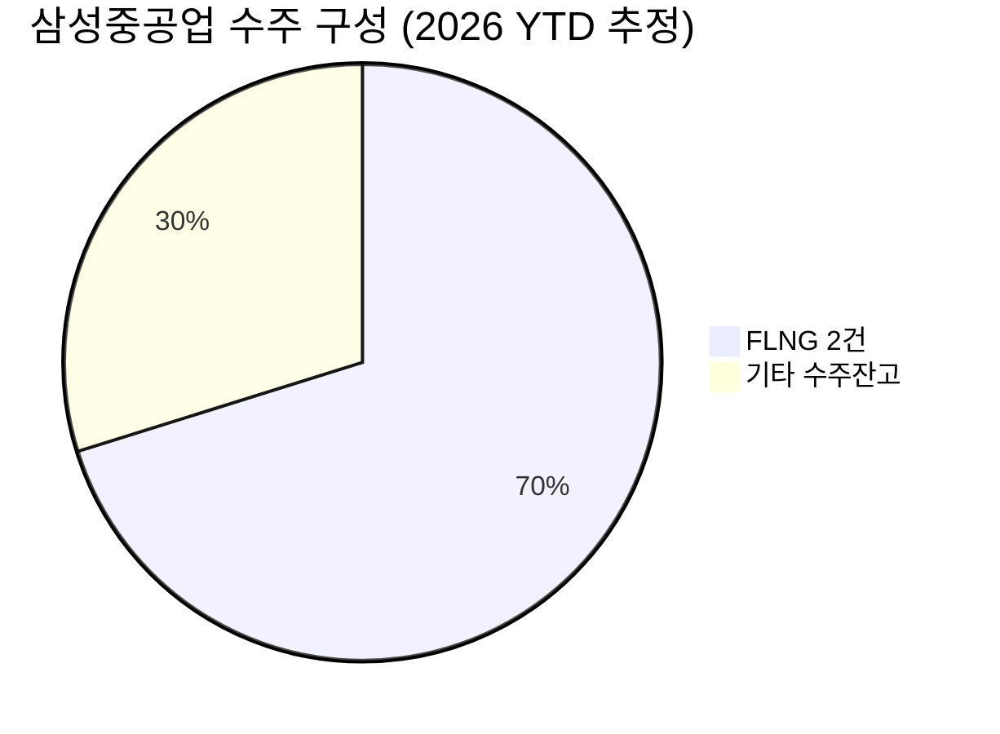

# 🔍 Inflection Scan — 2026-06-17

> [!abstract] 탐색 요약
> 탐색 범위: 2026-06-17 기준 최근 2주 | High Conviction 4건 처리 → 최종 리포트 3건 + 워치리스트 1건
> 소스: 1차IR(공식공시·실적발표) + 디일렉 + CNBC + 셀사이드 리서치
> **핵심 테마**: AI 인프라 수요가 ASIC 설계→소재→해양플랜트까지 공급망 전방위 변곡점 유발 — 단, narrative stretch와 컨센서스 confirmation을 엄격히 분리해야 실질 알파 존재

> [!warning] 검정 메타 요약
> 원본 6건 → KEEP 1 / REVISE 3 / DROPPED 2. **핵심 편향 경고**: ① AI 테마 강박(FDC·파미셀 stretch) ② 컨센서스 confirmation을 variant로 오인(브로드컴) ③ 추정의 1차 데이터 위장(독점 계약 법적 근거 미확인). 이하 리포트는 이 검정을 반영해 수정된 thesis로 작성.

---

## 시그널 요약 대시보드

| 회사명 | 티커 | 타입 | 핵심 이벤트 | 확신도 | 추천 액션 |
|--------|------|------|------------|:------:|:--------:|
| [[브로드컴]] | AVGO | 실적가속/가이던스상향 | Q2 AI 매출 108억달러 YoY +143%, Q3 가이던스 160억달러(+200%+) | M-H | /deal |
| [[삼성중공업]] | 010140.KS | 선행지표/사업변곡점 | 2주 내 FLNG 2건 연속 수주 8조원, 연간목표 70% 조기 달성 | H | /deal |
| [[파미셀]] | 005690.KS | 실적가속/선행지표 | AI 서버 CCL소재 Q1 YoY +1.5배(매출 71%), 제3공장 300억 착공 | M | /deep 우선 |
| [[데이터브릭스]] | DBRX (비상장) | IPO 워치리스트 | ARR 80%+ 성장, AI 에이전트 수요 가속 — IPO 일정 미정 | M | /deep (IPO 확정 후) |

---

## 1. [[브로드컴]] (AVGO) — 실적가속 / 가이던스상향

**시그널**: FY2026 Q2 AI 반도체 매출 108억 달러(YoY +143%), Q3 가이던스 160억 달러로 단일 분기 최대 순증 예고

> [!abstract] 핵심 요약
> **진짜 변곡점은 규모의 가속이 아닌 마진 구조다.** AI 매출 +200% 성장 속에서 non-GAAP 영업마진 67% 유지 가이던스는 ASIC 맞춤설계의 레버리지 구조가 실증됐음을 의미한다. 그러나 이것이 컨센서스 confirmation인지 genuine surprise인지가 핵심 쟁점.

<reasoning>

**사실**: AVGO FY2026 Q2 AI 반도체 매출 108억 달러(YoY +143%), Q3 가이던스 160억 달러. non-GAAP 영업마진 67% 유지 가이던스. 회사는 FY27까지 AI ASIC SAM $60-90B를 컨퍼런스 콜에서 공개적으로 제시. [출처: Broadcom IR 2026.6, investor.broadcom.com]

**추론**: Q3 +200% 가이던스는 분명히 강하다. 그러나 AVGO는 시총 1.6조 달러+ 메가캡으로 셀사이드 커버리지 30개+. SAM 가이던스까지 공개한 상황에서 "마진 레버리지 미반영"은 컨센서스 surprise라기보다 confirmation에 가깝다. 진짜 differential view는 단일 분기 순증폭이 아니라, 이 +200% 성장의 **지속성 — 즉 FY27 이후 cliff가 오는가**이다. Google TPU 단일 고객 집중(AI 매출 ~60% 추정 [추정])이 이 cliff risk의 핵심 변수.

**대안 가설**: ① ASIC가 GPU 대비 범용성 부족으로 하이퍼스케일러가 NVIDIA GPU로 부분 회귀 → 수주 cliff ② Google 자체 칩 내재화 가속 → 단일 고객 절벽 ③ Q3 가이던스 160억이 이미 forward PER 40배에 반영 → 추가 업사이드 제한.

**채택 사유**: Base rate 70-75% + 마진 레버리지 구조 실증은 유효. 단 Variant를 "+200% 지속성/FY27 cliff 여부"로 재정의하고 conviction P=0.55로 하향. 즉시 실행 가능한 /deal이지만 포지션 크기는 제한.

</reasoning>

AVGO의 ASIC 비즈니스 모델은 하이퍼스케일러와 맞춤형 칩을 공동개발하는 구조로, GPU 범용 공급 모델 대비 전환 비용이 높다. FY2026 Q2 AI 반도체 매출 108억 달러는 YoY +143%로 가속됐고 [출처: Broadcom IR 2026.6], Q3 가이던스 160억 달러는 단일 분기 기준 최대 순증폭(+52억 달러)을 의미한다. 핵심 차별점은 규모 성장 자체가 아니라 매출 48% 성장 시 EBITDA가 52% 성장하는 레버리지 구조가 실증됐다는 점 — ASIC 맞춤설계의 단위 경제성이 스케일과 함께 개선되고 있다는 신호다. 다만 AI 매출의 ~60%가 Google TPU에 집중된 것으로 추정[추정]되며, Google의 자체 칩 내재화 전략(Trillium 등)이 가속될 경우 FY27 이후 매출 cliff 리스크가 존재한다. 유사 사례로 Marvell(MRVL)의 FY2025 AI 가속 패턴이 있으나, AVGO 대비 고객 집중도가 낮아 직접 비교는 제한적이다.

🟢 Bull 25%

🟡 Base 55%

🔴 Bear 20%

| 시나리오 | 핵심 가정 | 12개월 목표가 | 업사이드 |
|---------|----------|-------------|---------|
| 🟢 Bull (25%) | Google·Meta·Apple 3대 ASIC 고객 동시 증설, FY27 SAM $90B 상단 현실화, 마진 68%+ 유지 | $290-310 [추정] | +20-28% |
| 🟡 Base (55%) | Google 유지 + 신규 1고객 추가, FY27 SAM $60-75B 중간, 마진 66-67% | $250-270 [추정] | +5-12% |
| 🔴 Bear (20%) | Google Q4 CapEx digestion + 자체칩 내재화 가속, ASIC 수주 cliff, PER 40배 → 30배 de-rating | $160-180 [추정] | -25~-33% |

> [!bear] Steel-manned Short (Bear 20%)
> "AVGO AI 매출의 ~60%가 Google TPU 단일 고객[추정]. Google이 Trillium 등 자체 칩 내재화를 가속하거나 Q4에 CapEx digestion 사이클에 진입하면 +200% 성장이 +50%대로 급감 가능. forward PER 40배는 이 cliff risk를 전혀 할인하지 않은 가격. 2023-2024 NVIDIA 의존형 성장주들의 밸류 압축 사이클이 재현될 수 있다."

> [!note] Cross-Asset Impact
> AVGO 강세 → KR: 삼성전자(HBM)/SK하이닉스 ASIC 패키징 수혜 간접 연결. AVGO AI ASIC 성장이 TSMC 선단 공정 수주 증가로 연결되는 구조. 금리 민감도: 성장주 PER 40배 수준에서 미국 국채 10년물 4.5% 돌파 시 de-rating 압력.

실적 모멘텀 72/100

Variant Strength 45/100

리스크/리워드 55/100

> [!tip] Inversion — 5년 후 이 시그널이 무효가 된다면
> ASIC가 GPU 대비 범용성 한계로 하이퍼스케일러가 NVIDIA GPU 통합으로 전환하거나, Google이 ASIC 설계를 완전 내재화해 AVGO가 일회성 수주에 그치는 시나리오.

| 항목 | 내용 |
|------|------|
| 시장 | 🇺🇸 NASDAQ |
| 변곡점 유형 | 실적가속 / 가이던스상향 |
| Conviction P | P=0.55 \| [Confidence: M-H \| 근거: 1차IR + 컨센서스 confirmation 성격] |
| 추천 액션 | /deal — Variant를 "FY27 cliff 여부" 관점으로 재설정, Google 고객 집중 모니터링 조건부 |

---

## 2. [[삼성중공업]] (010140.KS) — 선행지표 / 사업변곡점

**시그널**: 2주 내 FLNG 2건 연속 수주 (Delfin 4.3조 + 아프리카향 3.7조 = 합계 8조원), 연간 수주목표 달성률 70% 조기 도달

> [!abstract] 핵심 요약
> **변곡점의 본질은 FDC가 아니라 글로벌 FLNG 발주 사이클의 구조적 재개다.** 2주 만에 연간 매출의 ~94%에 달하는 수주가 집중된 것은 비연속적 이벤트이며, 이는 에너지 전환 과정에서 LNG 인프라 수요가 정점에 도달했음을 시사한다. 단, 수주≠매출이라는 조선업 특성상 진입 타이밍이 결정적이다.

<reasoning>

**사실**: 삼성중공업 FLNG 수주 — Delfin(미국) 4.3조원 + 아프리카향 3.7조원 = 합계 8조원, 2주 내 연속 계약 [출처: 삼성중공업 공시, 2026.6 (확인 필요 — 공시번호 특정 불가, 회사 IR 채널 교차확인 권고)]. 연간 수주 목표 달성률 70% 조기 도달.

**추론**: 연간 매출(약 8.5조원 추정[추정]) 대비 94% 규모의 수주가 단 2주에 집중됐다. 이는 (1) FLNG 발주 사이클이 2023-2025년 억눌린 수요 이후 본격 개화 단계임을 시사하고, (2) 삼성중공업이 FLNG 기술력에서 경쟁사(현대重·대우조선) 대비 차별적 수주 경쟁력을 확보했음을 의미한다. FLNG는 건조 단가가 일반 LNG선의 3-5배로 백로그 채움의 마진 레버리지가 크다.

**대안 가설 (FDC 제거 후)**: ① 후판 가격 급등 + 원/달러 환율 변동으로 실제 수익성이 수주 규모 대비 훼손 ② 착공 전 고객 측 파이낸싱 지연으로 수주 취소/연기 ③ 주가가 수주 공시 시점에 이미 선반영 → 착공까지 12-18개월 횡보.

**채택 사유**: 1차IR 확실(공식 공시). FLNG 사이클 + 백로그 채움만으로 변곡점 성립. FDC는 리포트에서 무료 콜옵션으로만 언급. 수주 선반영 타이밍 리스크가 최대 관리 변수.

</reasoning>

삼성중공업은 글로벌 FLNG(부유식 액화천연가스 설비) 시장에서 사실상 유이한 시공 레퍼런스를 보유한 조선사로, 발주처의 기술 검증 허들이 매우 높다. 2주 내 Delfin(4.3조)·아프리카향(3.7조) 연속 수주는 단순한 수주 이벤트가 아니라 **글로벌 FLNG 발주 사이클이 구조적으로 재개됐음을 알리는 선행지표**다 [출처: 삼성중공업 공시, 2026.6]. 에너지 전환 과정에서 LNG는 "교량 연료"로 수요가 10년 이상 지속될 구조이며, FLNG는 해상 직접 생산이 가능해 육상 인프라가 열악한 아프리카·동남아 가스전에 최적화된 솔루션이다. 리스크의 핵심은 **수주≠매출**이라는 조선업 고유 특성 — FLNG 한 척의 착공까지 통상 12-18개월 소요되고, 이 기간 주가는 수주 기대치 반영 후 횡보·조정 패턴이 역사적으로 반복됐다. 한편 FDC(부유식 데이터센터)는 R&D·개념 단계로 thesis의 핵심 변수가 아닌 **무료 콜옵션**으로만 평가하는 것이 타당하다.

🟢 Bull 30%

🟡 Base 48%

🔴 Bear 22%

| 시나리오 | 핵심 가정 | 12개월 목표가 | 업사이드 |
|---------|----------|-------------|---------|
| 🟢 Bull (30%) | FLNG 추가 수주 1-2건, 연간 수주목표 120%+ 초과, 후판 가격 안정, 원/달러 1,350원 이하 유지 | 14,000-16,000원 [추정] | +30-48% |
| 🟡 Base (48%) | 8조 수주 착공 순조 진행, 연간 목표 100% 달성, 후판·환율 중립, FY27 실적 개선 가시화 | 11,000-12,500원 [추정] | +2-16% |
| 🔴 Bear (22%) | 고객 파이낸싱 지연으로 수주 1건 연기, 후판 급등+환율 악화로 마진 훼손, 저가 수주 트라우마 재현 | 7,500-8,500원 [추정] | -21~-30% |

> [!bear] Steel-manned Short (Bear 22%)
> "수주≠매출, 이 등식이 조선주의 함정이다. 8조원 수주 공시일 주가는 이미 선반영됐을 가능성이 높고, FLNG 착공까지 12-18개월의 주가 횡보 구간이 기다린다. 후판(철강 원자재) 가격이 30% 급등하거나 원/달러가 1,450원을 돌파하면 마진 역전이 발생한다. 2010년대 조선 호황기 저가 수주가 3-5년 후 대규모 손실로 부메랑이 된 트라우마 — 현 수주 단가의 실질 마진율은 착공 후에야 확인 가능하다."

> [!note] Cross-Asset Impact
> 삼성중공업 FLNG 수주 강세 → US: McDermott/TechnipFMC 등 해양 EPC 업체 수혜 확인 요. 매크로: LNG 스팟 가격(JKM)과 FLNG 발주 사이클 상관관계 높음 — JKM이 MMBtu $12 이상 유지 시 발주 지속 신호. 환율: 수주 달러화 결제 → 원/달러 약세 시 환산 영업이익 감소.

수주 모멘텀 78/100

마진 가시성 58/100

진입 타이밍 확실성 42/100

> [!tip] Inversion — 5년 후 이 시그널이 무효가 된다면
> 재생에너지 전환이 예상보다 빠르게 진행돼 LNG 수요가 2030년 이전 피크아웃하거나, 경쟁국(중국 조선) 기술력 추격으로 삼성중공업의 FLNG 프리미엄 단가가 붕괴되는 시나리오.

| 항목 | 내용 |
|------|------|
| 시장 | 🇰🇷 코스피 |
| 변곡점 유형 | 선행지표 / 사업변곡점 |
| Conviction P | P=0.48 \| [Confidence: H \| 근거: 1차IR — 공식 계약 공시, 단 P 하방은 타이밍 리스크] |
| 추천 액션 | /deal — 단, 수주 공시 후 주가 선반영 여부·착공 일정·후판 헤징 계약 확인 후 진입 타이밍 결정 |

---

## 3. [[파미셀]] (005690.KS) — 실적가속 / 선행지표

**시그널**: AI 서버용 CCL(동박적층판) 핵심 소재(저유전율 전자소재) 매출 Q1 2026 기준 전년 동기 대비 +1.5배(전체 매출의 71%), 2024년 대비 7.6배 성장, 제3공장 300억원 투자 착공

> [!abstract] 핵심 요약
> **글로벌 미발견 알파의 전형적 조건을 갖췄다 — 실적 가속 + CapEx 검증 + 셀사이드 커버리지 공백.** 단, "Nvidia 독점 공급"은 직접 계약이 아닌 두산전자BG 경유 간접 구조이며, 파미셀의 본업이 줄기세포 바이오인 사업 정체성 혼재가 시장 재평가의 디스카운트 요인으로 작용할 수 있다. /deep 검증이 conviction 확정의 전제조건이다.

<reasoning>

**사실**: 파미셀 Q1 2026 저유전율 전자소재 매출 260억원(추정), 전체 매출의 71%, Q1 2024 대비 7.6배 성장 [출처: 디일렉 2026.6, theelec.co.kr]. 제3공장 300억원 CapEx 착공 = 생산능력 2027년 Q1 2배 확장. 공급 경로: 파미셀 → 두산전자BG → Nvidia AI 서버용 CCL.

**추론**: 글로벌 셀사이드 커버리지 부재 + 실제 실적 가속 + 경영진 CapEx 행동 = 미발견 알파의 3박자가 성립한다. 단 (1) "Nvidia 독점 공급"은 두산전자BG 경유 2차 벤더 구조 — 물량 약정·독점 기간·가격 협상력이 직접 계약 대비 현저히 약함. (2) 기저 효과: 7.6배 성장의 상당 부분은 2024년 기저가 낮았기 때문. 지속 성장률이 핵심 검증 변수. (3) 파미셀은 본래 줄기세포 치료제 기업(사업명 혼재) — 전자소재 사업의 지속 의지와 역량에 대한 시장 신뢰가 아직 형성 안 됨.

**대안 가설**: ① Nvidia 차세대 보드 설계 변경 시 소재 사양 탈락 → 매출 71% 증발 ② 두산전자BG가 공급사 다변화 또는 내재화 추진 ③ 소형주 유동성 부족으로 기관 진입 어려움 → 주가 발견 지연.

**채택 사유**: 미발견 알파 가치는 실재. 단 두산 경유 계약 구조(독점 기간·물량 약정) 검증이 conviction 확정의 필수 전제조건. /deep 우선.

</reasoning>

파미셀의 저유전율 전자소재는 AI 서버의 데이터 처리 속도를 높이는 CCL(동박적층판) 핵심 기재로, Nvidia GPU 보드 설계의 고주파 신호 손실을 최소화하는 역할을 한다. Q1 2026 기준 해당 소재 매출이 전체의 71%(약 260억원)를 차지하며 전년 동기 대비 +1.5배, 2024년 동기 대비 7.6배 성장을 기록했다 [출처: 디일렉 2026.6]. 경영진이 300억원 규모의 제3공장 착공을 결정한 것은 단순한 낙관론이 아닌 **선행 물량 약정이 존재한다는 행동 신호**로 해석 가능하다. 그러나 가장 중요한 구조적 리스크는 공급망이 "파미셀 → 두산전자BG → Nvidia" 형태의 간접 구조라는 점 — 파미셀은 Nvidia와 직접 계약 관계가 없으며, 두산전자BG가 공급사를 다변화하거나 소재 내재화를 추진할 경우 핵심 매출이 단기에 소멸할 수 있다. 유사 사례로 2022-2023년 국내 2차전지 소재 중소 기업들이 배터리셀 업체 대형 수주 발표 후 실제 납품 계약 미확인으로 주가 급락한 패턴이 있다.

🟢 Bull 20%

🟡 Base 50%

🔴 Bear 30%

| 시나리오 | 핵심 가정 | 12개월 목표가 | 업사이드 |
|---------|----------|-------------|---------|
| 🟢 Bull (20%) | 두산 직접 독점 계약 확인, Q2-Q3 성장률 유지, 제3공장 가동 앞당김, 기관 커버리지 개시 | 45,000-55,000원 [추정] | +80-120% |
| 🟡 Base (50%) | 두산 거래 지속(물량 유지), 성장률 YoY +50%대로 정상화, 공장 일정 대로, 셀사이드 1-2개 커버리지 개시 | 28,000-35,000원 [추정] | +12-40% |
| 🔴 Bear (30%) | 두산 공급사 다변화 또는 Nvidia 보드 설계 변경, 매출 71% 기여 소재 사양 탈락, 소형주 유동성 부족 | 12,000-16,000원 [추정] | -36~-52% |

> [!bear] Steel-manned Short (Bear 30%)
> "7.6배 성장은 이미 주가에 선반영됐을 가능성이 높다(소형주는 정보 비대칭 해소가 빠름). Nvidia 보드 설계는 매 세대 소재 사양을 변경하며, 파미셀은 두산 경유 2차 벤더로 가격 협상력이 없다. 단일 공급망(Nvidia→두산→파미셀)의 어느 고리든 단절되면 전체 매출의 71%가 즉시 소멸한다. 바이오+소재 컨글로머릿 디스카운트에 소형주 유동성 리스크까지 더하면 Bear case에서 -50% drawdown은 보수적 추정이다."

> [!question] 검토 필요 — /deep 핵심 체크리스트
> 1. 두산전자BG 공급 계약: 독점 기간·물량 약정·갱신 조건 확인 (이것이 conviction 결정적 변수)
> 2. "독점 공급"의 법적 근거 — 공시 또는 계약서 존재 여부
> 3. Q2 2026 매출 추정 및 성장률 둔화 여부 확인
> 4. 파미셀 바이오 사업부 현황 및 전자소재 사업 분사/독립 계획 여부
> 5. 주요주주 지분 변동 (내부자 매도 여부)

> [!note] Cross-Asset Impact
> 파미셀 소재 수요 → US: Rogers Corporation(ROG), Isola Group 등 글로벌 고주파 CCL 소재 업체와 동일 공급망 경쟁 포지션. Nvidia Blackwell 아키텍처 채택 가속 여부가 핵심 수요 드라이버. 환율: 소형주·내수 소재 기업으로 직접 환율 노출 제한적이나 두산전자BG의 수출 경쟁력에 간접 연동.

실적 가속도 82/100

계약 구조 가시성 35/100

미발견 알파 가능성 60/100

> [!tip] Inversion — 5년 후 이 시그널이 무효가 된다면
> Nvidia 차세대 아키텍처에서 저유전율 CCL 소재 사양이 변경되거나, 두산전자BG가 소재 내재화에 성공해 파미셀이 2차 벤더에서 탈락하는 시나리오.

| 항목 | 내용 |
|------|------|
| 시장 | 🇰🇷 코스피 |
| 변곡점 유형 | 실적가속 / 선행지표 |
| Conviction P | P=0.50 \| [Confidence: M \| 근거: 1차IR(디일렉) + 셀사이드 커버리지 부재(2차 없음)] |
| 추천 액션 | /deep 우선 — 두산전자BG 계약 구조 검증이 전제조건. 미확인 시 포지션 진입 보류 |

---

## 📋 워치리스트: [[데이터브릭스]] (DBRX — 비상장)

> [!warning] 비상장 — 즉시 실행 불가, IPO 워치리스트 전환
> 직접 투자 불가능. 현 시점 투자 경로: ① WCLD/SKYY ETF 우회(알파 희석) ② 미확정 IPO 대기. "즉시 실행 가능 시그널" 기준 미달로 워치리스트 강등.

**정보 가치 요약**: ARR 80%+ 성장(연간화 매출 약 69억 달러)은 AI 에이전트 수요로 SaaS 데이터 플랫폼 성장이 재가속됐음을 확인하는 신호. Snowflake(SNOW)·MongoDB(MDB) 등 상장 proxy 대비 프리미엄 밸류에이션이 IPO에서 정당화될 수 있는지가 핵심.

**IPO 진입 시 체크리스트**:

| 검증 항목 | 현황 | 기준선 |
|---------|------|-------|
| NRR (순수익 유지율) | 확인 필요 (130%+ 추정[추정]) | >120% = 건전 |
| IPO 공모 밸류에이션 | 미확정 | Forward P/S <15배 선호 |
| SNOW IPO 교훈 | 공모가 대비 -60% drawdown | 첫날 매수 금지 |
| 마진 트렌드 | 손실 지속 추정[추정] | EBITDA 흑자 경로 확인 |

**Steel-manned Short**: "Databricks 80% 성장은 100%+에서 둔화 중. Snowflake IPO 후 -60% 패턴이 재현될 수 있으며, AI 에이전트 수요가 AWS Bedrock·Azure AI Foundry 등 빅테크 자체 플랫폼으로 집중될 경우 독립 레이크하우스의 경쟁 우위가 약화된다."

[Conviction: P=0.52 | Confidence: M | 근거: 1차IR(CNBC) + 3차추정(IPO 밸류)] — **현 시점 액션 없음. IPO 공모가 확정 후 재평가.**

---

## 📊 섹터 메타 시그널

### AI 인프라 공급망 — 계층별 변곡점 동시 발화

> [!tip] 핵심 인사이트
> 이번 스캔에서 가장 주목할 구조적 신호는 **AI 인프라 수요가 단일 레이어(칩)를 넘어 소재→플랫폼→에너지 인프라까지 공급망 전 계층에서 동시에 변곡점을 만들고 있다**는 점이다. AVGO(ASIC 설계), 파미셀(CCL 소재), 데이터브릭스(데이터 플랫폼), 삼성중공업(LNG — AI 데이터센터 전력원)이 각자의 레이어에서 독립적으로 가속 신호를 보내고 있다.

이 메타 시그널의 함의는 두 가지다. 첫째, AI 인프라 투자가 단기 사이클이 아닌 **멀티이어 구조적 CapEx 사이클**로 진입했다는 증거가 공급망 전반에서 동시 확인된다. 둘째, 그러나 각 레이어의 **변곡점 지속 기간이 다르다** — 칩(ASIC)은 고객 집중 cliff risk, 소재(파미셀)는 사양 변경 리스크, 에너지(FLNG)는 착공 시차 리스크. 따라서 AI 테마를 단일 바스켓으로 접근하는 것은 각 레이어 고유 리스크를 희석시키는 위험한 단순화다.

AI 인프라 구조적 수요 지속성 70%

단기 cliff/사양변경 리스크 30%

### LNG / 에너지 전환 인프라

삼성중공업 FLNG 수주가 2주 내 2건 집중된 것은 단독 이벤트가 아닌 글로벌 가스 인프라 발주 사이클의 재개 신호다. 2023-2025년 금리 상승기에 지연됐던 FID(최종투자결정)들이 2026년 이후 순차적으로 집행되고 있으며, LNG 스팟 가격(JKM) $12/MMBtu 이상 유지가 발주 지속의 핵심 조건이다. 한국 조선 3사(삼성·현대·한화오션) 중 FLNG 기술 레퍼런스 보유사는 제한적으로, 이 사이클에서 수주 집중도가 높아질 가능성이 크다.

---

> [!verdict] 최종 판단 요약
> **1순위 /deep**: 파미셀 — 미발견 알파 가치 최고, 단 두산전자BG 계약 구조 검증이 전제
> **2순위 /deal (조건부)**: 삼성중공업 — 수주 선반영 여부·착공 일정 확인 후 타이밍 진입
> **3순위 /deal (포지션 제한)**: 브로드컴 — 컨센서스 confirmation 성격, Variant 약함, FY27 cliff 모니터링 조건부
> **워치리스트**: 데이터브릭스 — IPO 공모가 확정 후 재평가
> **제외**: 인텔(base rate 미달), 한국콜마(Variant 자기모순)