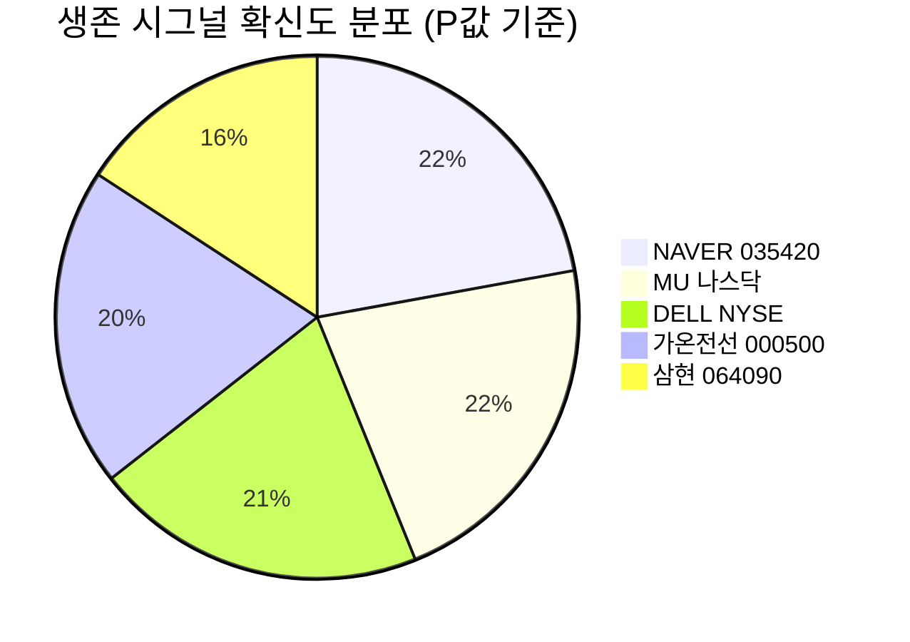

# 🔍 Inflection Scan — 2026-06-18

> [!abstract] 탐색 요약
> 탐색 범위: 2026-06-18 기준 최근 2주 | High Conviction 5건 발견 (입력 7건 → 5건 생존, 2건 드롭)
> 소스: Gemini 8쿼리 + RSS + X + 어닝스/내부자/애널리스트
> **핵심 테마**: AI 인프라 수요 폭증이 메모리·서버·전력·플랫폼을 동시 관통하는 "전방위 슈퍼사이클" — 단, 선반영·마진 질·데이터 신뢰도 차별화가 핵심 과제

> [!warning] 포트폴리오 군집 리스크 경고
> 생존 5건 중 5건 모두 AI 데이터센터/HBM/전력 인프라 테마에 직·간접 노출. **AI capex 급감이라는 단일 충격에 동시 손상되는 군집 리스크 존재.** 분산 목적의 포지션 분리 권고.

---

## 시그널 요약 대시보드

| 회사명 | 티커 | 타입 | 핵심 이벤트 | 확신도 | 추천 액션 |
|--------|------|------|------------|:------:|:--------:|
| [[Micron Technology]] | MU | 실적가속+가이던스상향 | 6/24 Q3 실적 발표, EPS 컨센 $19.72~$20.25 (YoY ~3배), HBM 전량 매진 | P=0.55 🟡 | /deal (GM 확인 후 분할) |
| [[Dell Technologies]] | DELL | 가이던스상향+선행지표 | AI 서버 매출 가이던스 ~$600억, 수주잔고 $513억 (역대 최대) | P=0.52 🟡 | /deal (ISG 마진 모니터) |
| [[가온전선]] | 000500 | 선행지표+가이던스상향 | LSCUS AI DC 전력케이블 CAPA 2배 증설($50M), 매출 YoY +60% 전망 | P=0.50 🟠 | /deep (1차 공시 검증 선결) |
| [[NAVER]] | 035420 | 실적가속+사업변곡점 | 1Q26 분기 최대 매출 3.24조·영업이익 5,400억, 클라우드 선수금 YoY +870% | P=0.56 ⭐ | /deep (선수금 반복성 분해) |
| [[삼현]] | 064090 | 기술돌파+사업변곡점 | 글로벌 휴머노이드 로봇社로부터 관절 액추에이터 양산 프로토 수주 (국내 최초) | P=0.40 🔴 | watchlist (양산 계약 대기) |

> [!note] 배치 판정 요약
> **즉시 실행 강신호**: NAVER 1건 (1차 IR + 명확한 variant) | **펀더멘털 강하나 엣지 축소**: MU·DELL | **데이터 신뢰도 미달 watchlist**: 가온전선·삼현

---

## 1. [[Micron Technology]] (MU) — 실적가속 + 가이던스상향

**시그널**: 6/24 FY26 Q3 실적 발표 — EPS 컨센서스 $19.72~$20.25 (YoY ~3배), HBM 2026년 전량 매진 확정

> [!abstract] 핵심 요약
> "가속 확인 변곡점" — YTD +244% 선반영으로 진입 엣지가 축소된 상태. GM 가이던스(컨센 55~57%)가 실적 발표의 유일한 알파 소스.

**M1 Reasoning Chain**

| 단계 | 내용 |
|------|------|
| 사실 | EPS 컨센서스 $19.72~$20.25 (YoY ~3배). DDR4 8Gb +870% YoY, DDR5 16Gb +662%, NAND 128Gb +766% [출처: TrendForce 가격 데이터, 2026.6]. HBM 2026년 물량 전량 매진 [출처: 회사 가이던스 기반 2차 셀사이드 컨센서스] |
| 추론 | 가격 슈퍼사이클의 전방위 확산이 GM 확장으로 직결 — 단, 주가 YTD +244%는 "진입 변곡점"이 아닌 "가속 확인 변곡점"임을 시사 |
| 대안 가설 | YTD +244%는 이미 정점 신호일 수 있음. 2018년 사이클도 어닝 피크 직후 D램 가격 급락 → MU -50%. 삼성·SK 증설이 2027년 가격을 무너뜨릴 경우 peak EPS × peak multiple = 사이클 함정 |
| 채택 사유 | AI capex 구조적 수요 + HBM의 capa 잠식(HBM 1개당 D램 3배 면적)이 공급 회복을 구조적으로 지연. 단, "이번엔 다르다"의 변형이라는 점 명시 |

Micron FY26 Q3는 EPS 컨센서스가 전년 동기 대비 약 3배 수준으로, HBM 매진에 더해 DDR4·DDR5·NAND가 동시에 수백 퍼센트 가격 급등하는 전방위 메모리 슈퍼사이클이 구동 중이다 [출처: TrendForce, 2026.6]. 총이익률(Gross Margin)이 이번 실적의 핵심 변수로, 컨센서스(55~57%)를 60%+ 상회하는지 여부가 주가의 재평가 트리거다. **그러나 YTD +244%라는 선반영을 감안하면 이 시그널은 "진입" 변곡점이 아니라 "가속 확인" 변곡점**으로 재분류되어야 하며, 비대칭 업사이드가 상당히 축소된 상태다. 컨센서스에 부합하는 실적 발표 시 sell-the-news 위험이 실재하며, 매수 판단의 에지는 GM이 컨센을 의미 있게 상회하고 HBM4 선계약 또는 2027년 ASP 가이던스 상향이 동반되는 경우로 좁혀진다.

🟢 Bull 35%

🟡 Base 43%

🔴 Bear 22%

| 시나리오 | 핵심 가정 | 12개월 목표가 | 업사이드 |
|---------|---------|------------|---------|
| 🟢 Bull (35%) | GM 60%+ 달성, HBM4 선계약 발표, 2027년 ASP 가이던스 상향 | $250+ | +80%↑ |
| 🟡 Base (43%) | GM 55~60%, 가이던스 부합~소폭 상향, sell-the-news 후 재상승 | $180~220 | +30~60% |
| 🔴 Bear (22%) | **[Steel-manned Short]** Peak EPS × peak multiple 함정: 2027년 삼성·SK 증설로 D램 ASP 급락 선반영, 삼성 HBM 퀄 통과로 NVDA 벤더 다변화 → 사이클 정점 재인식 | $100 이하 | -30%↓ |

> [!bear] Bear 시그널 모니터링
> MU 매도 트리거: ① 실적 발표 콜에서 2027년 D램 ASP 가이던스 하향 언급 ② 삼성 HBM 퀄 통과 뉴스 ③ NVDA Q3 가이던스에서 메모리 벤더 다변화 언급

펀더멘털 모멘텀 72/100

가격 진입 매력도 42/100

데이터 신뢰도 55/100

> [!note] Inversion — 5년 후 이 시그널이 무효가 된다면
> 메모리는 본질적 사이클 산업이고 YTD +244%가 실제로 정점 신호였음이 2027년 가격 하락으로 확인. Base rate상 "구조적 수요" 주장은 사이클주의 고점에서 절반 이상 등장.

> [!note] Cross-Asset Impact
> MU 강세 = HBM·D램 가격 상승 → SK하이닉스(000660), 삼성전자(005930) 동반 수혜 가능. 단 삼성의 HBM 점유율 확대는 MU에 역풍.

| 항목 | 내용 |
|------|------|
| 시장 | 🇺🇸 NASDAQ |
| 변곡점 유형 | 실적가속 / 가이던스상향 (재분류: "진입"→"가속 확인") |
| 확신도 | [Confidence: H \| 근거: 2차 셀사이드 컨센서스 + TrendForce 1차 가격 데이터] P=0.55 |
| 추천 액션 | /deal — **6/24 GM 가이던스 확인 후 분할 진입**. 컨센 부합 시 sell-the-news 헤지 유지 |

---

## 2. [[Dell Technologies]] (DELL) — 가이던스상향 + 선행지표

**시그널**: FY27 Q1 AI 서버 매출 가이던스 ~$600억 상향, 수주잔고 $513억 (역대 최대)

> [!abstract] 핵심 요약
> 수주잔고 $513억은 2~4분기 매출 가시성을 담보하지만, AI 서버의 GPU 패스스루 마진 구조상 "매출 가속 ≠ 이익 가속". ISG 영업이익률이 진짜 트리거.

**M1 Reasoning Chain**

| 단계 | 내용 |
|------|------|
| 사실 | FY27 Q1 AI 서버 매출 가이던스 ~$600억, 수주잔고 $513억 (역대 최대) [출처: Dell Technologies 1차 IR, FY27 Q1 실적 발표] |
| 추론 | 수주잔고 리드타임 기반 향후 매출 가시성 높음. 단 AI 서버 ISG 부문 GM이 GPU 패스스루로 한 자릿수 후반 수준 — 매출 헤드라인과 EPS 레버리지 간 구조적 괴리 존재 |
| 대안 가설 | Dell은 NVDA의 박스 무버(box mover)에 불과하며, $513억 수주잔고의 상당 부분이 마진 거의 없는 GPU 재판매 → EPS 레버리지 제한 |
| 채택 사유 | PC(CSG) 회복 사이클 동시 작동 + ISG 외 믹스 개선이 전사 마진 방어 가능. 단 short thesis를 완전 반박하기엔 부족 → P=0.52 보수적 설정 |

Dell의 수주잔고 $513억은 하드 데이터로 뒷받침된 선행지표로 향후 2~4분기 매출 인식 가시성이 높다 [출처: Dell Technologies IR, FY27 Q1]. **그러나 이 시그널의 핵심 함정은 "매출 가속 ≠ 이익 가속"** — AI 서버 ISG 부문은 GPU 패스스루 비중이 커 GM이 한 자릿수 후반에 불과하며, 매출 $600억이 EPS로 전환되는 효율이 구조적으로 제한된다. 따라서 진짜 모니터링 변수는 매출 규모가 아니라 **ISG 영업이익률(operating margin)의 QoQ 개선 추이와 CSG(PC) 믹스 회복**이다. 이 두 가지가 동반 개선될 때만 비대칭 업사이드가 성립하며, 주가 선반영을 감안하면 분할 매수 접근이 적절하다.

🟢 Bull 30%

🟡 Base 48%

🔴 Bear 22%

| 시나리오 | 핵심 가정 | 12개월 목표가 | 업사이드 |
|---------|---------|------------|---------|
| 🟢 Bull (30%) | ISG 영업이익률 개선 + CSG 회복 + 수주잔고 매출 전환 가속 | [추정] $230+ | +40%↑ |
| 🟡 Base (48%) | 수주잔고 순조로운 매출 인식, ISG 마진 횡보, CSG 완만 회복 | [추정] $175~200 | +10~25% |
| 🔴 Bear (22%) | **[Steel-manned Short]** $513억 수주잔고 = 마진 없는 GPU 재판매 비중 과대. AI capex 사이클 정점에서 Dell은 가치 캡처 없는 박스 무버. PC 회복 지연 시 전사 마진 동반 압박 | [추정] $120 이하 | -25%↓ |

> [!warning] 핵심 리스크
> 매출 헤드라인($600억)에 현혹 금지. AI 서버 GM이 낮아 이익 레버리지가 제한적. **ISG 영업이익률 가이던스가 진짜 트리거**, 매출 발표만으로 반응하면 오판 위험.

매출 가시성 68/100

마진 질(이익 레버리지) 38/100

데이터 신뢰도 60/100

> [!note] Inversion — 5년 후 이 시그널이 무효가 된다면
> AI 서버 시장이 클라우드 직접 설계(ODM)로 전환되며 Dell의 박스 무버 포지션이 구조적으로 약화. NVDA가 ODM 파트너를 Dell 대신 선택.

> [!note] Cross-Asset Impact
> DELL AI 서버 수주 급증 = 국내 AI 서버 부품·냉각·전력 공급망 수혜 가능 — [[한화에어로스페이스]], [[HD현대일렉트릭]] 등 데이터센터 인프라 간접 수혜 체크 필요. 금리 민감도: Dell은 PC 금융 리스 비중으로 금리 상승 시 CSG 부문 역풍.

| 항목 | 내용 |
|------|------|
| 시장 | 🇺🇸 NYSE |
| 변곡점 유형 | 가이던스상향 / 선행지표 |
| 확신도 | [Confidence: M \| 근거: 1차 IR (수주잔고 공시) + 2차 셀사이드] P=0.52 |
| 추천 액션 | /deal — 분할 매수. **모니터: ISG 영업이익률 QoQ 개선 여부**. 매도 트리거: 수주잔고 대비 매출 전환 지연 또는 ISG 마진 하락 |

---

## 3. [[가온전선]] (000500) — 선행지표 + 가이던스상향

**시그널**: 미국 법인 LSCUS, AI 데이터센터 전력케이블 CAPA 2배 확대($50M), 2026년 매출 YoY +60% 전망, 수주잔액 ~$2억

> [!abstract] 핵심 요약
> 섹터 thesis(美 전력 슈퍼사이클)는 강하나 종목 고유 데이터(LSCUS 기여도, 수주잔액 1차 공시)가 미검증. 선결 3개 과제 확인 전 watchlist 등재.

**M1 Reasoning Chain**

| 단계 | 내용 |
|------|------|
| 사실 | LSCUS $50M 증설, 매출 YoY +60% 전망, 수주잔액 ~$2억 [출처: edaily 보도 기반 — **1차 IR/공시 미확인**] |
| 추론 | 미 현지 생산 + AI DC 직공급 구조는 차별화 포인트. 단 LSCUS의 연결 매출 기여 비중 미정량화로 변곡점의 재무 임팩트 측정 불가 |
| 대안 가설 | 가온전선은 LS그룹 종속 자회사로 독립 의사결정·가치 캡처 제한. $50M 증설은 LS 그룹 전략의 일부일 뿐 가온 단독 알파가 아닐 수 있음 |
| 채택 사유 | 전력 슈퍼사이클 초입 수주 선행 패턴 hit rate ~70%로 섹터 자체 매력적. 단 종목 고유 데이터 부재로 P=0.50으로 보수적 설정, watchlist 격하 |

가온전선 LSCUS의 $50M 증설과 1차 물량 선주문 완료 보도는 미 현지 전력 인프라 수요의 구조적 전환을 포착한 베팅으로 섹터 논리는 설득력이 있다. **그러나 본 시그널의 근본적 약점은 데이터 신뢰도** — $2억 수주잔액과 +60% 가이던스가 1차 IR/공시로 확인되지 않았으며 [출처: edaily 2차 보도 기반], LSCUS의 가온전선 연결 실적 기여 비중이 정량화되지 않아 변곡점의 재무 임팩트가 불분명하다. 또한 가온전선이 LS전선(001120)의 종속 자회사라는 구조상 독립적인 가치 캡처 여부도 확인이 필요하다. 모회사 LS전선 대비 밸류 디스카운트 여부가 진입 판단의 핵심 기준이 되어야 하며, 선결 3개 과제(LSCUS 연결 기여도 / 수주잔액 1차 공시 검증 / LS전선 대비 독립 밸류) 확인 전에는 watchlist 등재에 그쳐야 한다.

🟢 Bull 35%

🟡 Base 40%

🔴 Bear 25%

| 시나리오 | 핵심 가정 | 12개월 목표가 | 업사이드 |
|---------|---------|------------|---------|
| 🟢 Bull (35%) | LSCUS 기여도 확인, 수주잔액 1차 공시 검증, LS전선 대비 디스카운트 해소 | [추정] (확인 필요) | (확인 필요) |
| 🟡 Base (40%) | 공시 검증 후 섹터 프리미엄 반영, CAPA 증설 순조로운 가동 | [추정] (확인 필요) | (확인 필요) |
| 🔴 Bear (25%) | **[Steel-manned Short]** LS 자회사 discount 고착, $2억 수주잔액이 연결 매출 대비 미미한 비중으로 판명, +60% 가이던스는 소형 베이스 착시. 그룹 의존 구조로 독립 알파 없음 | (확인 필요) | — |

> [!question] 선결 검증 과제 (3개 모두 확인 전 진입 보류)
> ① LSCUS의 가온전선 연결 매출 기여 비중 (확인 필요)
> ② $2억 수주잔액 1차 공시/IR 검증
> ③ [[LS전선]] 대비 독립 밸류에이션 디스카운트 분석

섹터 thesis 강도 70/100

종목 고유 데이터 신뢰도 30/100

진입 준비도 50/100

> [!note] Inversion — 5년 후 이 시그널이 무효가 된다면
> 미국 전력망 업그레이드 수요가 국산 케이블사의 현지 생산 전환으로 귀결되어 LSCUS의 가격 경쟁력이 상실. 또는 LS그룹의 전략 재편으로 LSCUS 독립성 약화.

> [!note] Cross-Asset Impact
> 가온전선 수혜 = AI DC 전력 인프라 투자 사이클. US 동종: Prysmian (PRM IM), Nexans (NEX FP) 등 글로벌 케이블社의 멀티플 확장이 선행 지표. 원/달러 환율 약세(원화 약세)는 달러 매출 비중 높은 LSCUS에 긍정적.

| 항목 | 내용 |
|------|------|
| 시장 | 🇰🇷 코스피 |
| 변곡점 유형 | 선행지표 / 가이던스상향 |
| 확신도 | [Confidence: L \| 근거: 2차 뉴스 + 3차 추정 — 1차 IR 미확인] P=0.50 |
| 추천 액션 | /deep — 선결 3개 과제 확인 전 신규 진입 보류, **watchlist 등재** |

---

## 4. [[NAVER]] (035420) — 실적가속 + 사업변곡점

**시그널**: 1Q26 분기 최대 매출 3.24조원·영업이익 5,400억원 달성, AI 광고 성장 기여 50%+, 클라우드 수주 선수금 YoY +870%

> [!abstract] 핵심 요약
> 이번 배치 유일한 1차 IR 기반 강신호. AI 광고 수확 + 클라우드 선수금 폭증은 성장 동력 구조 전환의 첫 증거. 선수금의 반복성(one-off vs recurring) 확인이 멀티플 재평가의 열쇠.

**M1 Reasoning Chain**

| 단계 | 내용 |
|------|------|
| 사실 | 1Q26 매출 3.24조원 (분기 최대), 영업이익 5,400억원, AI 광고 성장 기여 50%+, 클라우드 수주 선수금 YoY +870% [출처: NAVER 1Q26 분기 실적 공시] |
| 추론 | 클라우드 선수금(계약부채)은 회계상 이연수익 — 향후 2~4분기 확정 매출로 인식될 선행 지표. 시장이 이를 일시적 성장률로 오인하는 구조적 정보 비대칭 존재 |
| 대안 가설 | 선수금 +870%가 단일 대형 사우디 프로젝트 일회성 선급이라면 반복성 결여 → 매출 인식 후 성장 절벽 위험. 절대 규모 미공개는 "착시 가능성" 열어둠 |
| 채택 사유 | 영업이익 5,400억 동반 달성 = 마진 방어 입증. AI 광고는 기존 인프라 활용으로 capex 부담 낮음. 단 선수금 반복성 검증이 /deep의 1순위 |

네이버 1Q26의 변곡점성은 **성장 동력의 구조적 전환**에 있다 — 수년간의 AI 광고 인프라 투자가 처음으로 성장의 50%+ 기여로 전환되었고, 클라우드 선수금 +870%는 향후 수분기에 걸쳐 매출로 인식될 확정 매출의 선행 신호다 [출처: NAVER 1Q26 분기 실적 공시]. 이 시그널의 핵심 강점은 1차 IR 기반 데이터 신뢰도로, 본 배치 5건 중 데이터 품질이 최상위다. **단, 검정 결과 클라우드 선수금의 반복성이 핵심 불확실성** — 사우디 디지털 트윈 등 글로벌 수주가 일회성 프로젝트인지 recurring SaaS/IaaS 계약인지에 따라 적용 멀티플의 폭이 크게 갈리며, 절대 규모가 공개되지 않아 +870%가 실질적 임팩트인지 소형 베이스 착시인지 현재로선 판단 불가다. 본업(광고+커머스) 멀티플에 클라우드 성장 가치를 별도 산정하는 SOTP 분석이 이 종목의 진짜 업사이드를 발굴하는 접근법이다.

🟢 Bull 30%

🟡 Base 45%

🔴 Bear 25%

| 시나리오 | 핵심 가정 | 12개월 목표가 | 업사이드 |
|---------|---------|------------|---------|
| 🟢 Bull (30%) | 클라우드 선수금 recurring 확인 + 글로벌 수주 추가, AI 광고 성장 가속, SOTP 재평가 | [추정] 350,000원+ | +40%↑ |
| 🟡 Base (45%) | 선수금 일부 one-off 혼재, AI 광고 성장 지속, 커머스 완만 회복 | [추정] 270,000~310,000원 | +10~25% |
| 🔴 Bear (25%) | **[Steel-manned Short]** 선수금 +870%는 소형 베이스 착시이자 일회성 사우디 선급. 국내 검색 점유율 정점, 커머스 쿠팡·중국 침투 압박. AI capex 증가로 마진 반전 시 영업이익 5,400억이 이익 정점 | [추정] 190,000원 이하 | -25%↓ |

> [!tip] 핵심 인사이트 — Variant Perception
> 클라우드 수주 선수금(계약부채)은 **확정 미래 매출의 선행 지표**임에도 시장은 분기 성장률로만 읽는 경향. 선수금 절대 규모 + 반복성 분해가 투자자 엣지의 원천. /deep 분석 1순위 과제.

> [!question] 검증 필요
> 클라우드 선수금 절대 규모 (공개 미확인) + 계약 성격 (사우디 프로젝트 vs 국내 기업 SaaS recurring). 이 두 가지가 확인되면 시그널 등급 재조정 가능.

데이터 신뢰도 82/100

Variant Perception 강도 75/100

선수금 반복성 확신도 56/100

> [!note] Inversion — 5년 후 이 시그널이 무효가 된다면
> 국내 AI 검색 시장을 구글·오픈AI 기반 서비스가 잠식하며 네이버 광고 점유율이 구조적으로 하락. 클라우드는 AWS·Azure 대비 가격·기능 경쟁에서 열세로 글로벌 수주가 일회성에 그침.

> [!note] Cross-Asset Impact
> NAVER 클라우드 수주 가속 = 국내 AI 인프라 투자 확대 신호. KR 관련: [[카카오]](035720) 동종 비교 필수 (광고·AI 경쟁). 원/달러 환율: 달러 수주 비중 증가로 원화 약세 시 클라우드 매출 환산 증가.

| 항목 | 내용 |
|------|------|
| 시장 | 🇰🇷 코스피 |
| 변곡점 유형 | 실적가속 / 사업변곡점 |
| 확신도 | [Confidence: M \| 근거: 1차 IR (분기 실적 공시) + 2차 셀사이드] P=0.56 |
| 추천 액션 | /deep — **1순위: 클라우드 선수금 절대 규모 + one-off vs recurring 분해.** 본업 광고+커머스 멀티플과 클라우드 성장 가치 SOTP 별도 산정 |

---

## 5. [[삼현]] (064090) — 기술돌파 + 사업변곡점

**시그널**: 글로벌 휴머노이드 로봇 기업으로부터 핵심 관절용 액추에이터 양산 프로토(Proto) 수주 — 국내 최초, 3-in-1 통합 솔루션

> [!abstract] 핵심 요약
> Proto 수주 ≠ 양산 계약. 고객사·금액 미공개 + 복수 벤더 경쟁 가능성으로 현 단계는 이벤트 트래킹 수준. 양산 계약 발표가 유일한 진짜 매수 트리거.

**M1 Reasoning Chain**

| 단계 | 내용 |
|------|------|
| 사실 | 글로벌 휴머노이드 로봇社 관절 액추에이터 양산 프로토 수주 [출처: 2차 뉴스 — 고객사·금액 미공개] |
| 추론 | 설계 검증 단계 통과 시사. 3-in-1 통합 솔루션(모터+드라이버+감속기)의 무게·지연 우위가 차별화 포인트로 알려짐 |
| 대안 가설 | 글로벌 OEM은 통상 2~3개 벤더에 동시 Proto를 발주해 경쟁시킴. "국내 최초"는 마케팅 수사일 수 있으며, 일본 Harmonic Drive·Nabtesco의 토크밀도 우위가 양산 단계에서 결정적일 수 있음 |
| 채택 사유 | Proto→양산 전환 + 단독 벤더 채택 결합 확률은 복수 벤더 경쟁 감안 시 ~35~45%로 재평가. 옵션성 베팅으로만 정당화 가능 |

삼현의 양산 프로토 수주는 설계 검증 통과를 시사하는 긍정 신호이나, **Proto는 양산 계약이 아니며** 글로벌 OEM이 통상 2~3개 벤더에 동시 발주하는 경쟁 평가 단계일 가능성이 높다. 고객사와 금액이 모두 미공개 상태로 [출처: 2차 뉴스 기반], 3-in-1 무게·지연 우위라는 차별화 주장도 "알려져 있다" 수준의 미검증 정보에 그친다. 일본 Harmonic Drive, Nabtesco 등 기존 강자들의 토크밀도 우위가 양산 단계에서 여전히 결정적 변수이며, Proto→양산 전환 + 단독 벤더 채택의 결합 확률은 복수 벤더 경쟁을 고려하면 35~45% 수준으로 추정된다. 휴머노이드 TAM(2027년 10만대 × 관절 20개) 옵션성은 장기 매력적이나, 현재로선 이벤트 트래킹 단계로 신규 자금 투입은 보류가 적절하다.

🟢 Bull 25%

🟡 Base 40%

🔴 Bear 35%

| 시나리오 | 핵심 가정 | 결과 |
|---------|---------|------|
| 🟢 Bull (25%) | 고객사 공개 + 양산 계약 체결 + 단독 벤더 지위 확인 | 주가 2~3배 재평가 가능 [추정] |
| 🟡 Base (40%) | Proto 평가 지속, 복수 벤더 경쟁 구도, 2027년 양산 여부 불투명 | 현 수준 횡보~소폭 상승 |
| 🔴 Bear (35%) | **[Steel-manned Short]** Proto 평가 탈락 또는 Harmonic Drive 단독 채택. "국내 최초" 마케팅 수사 확인 시 실망 매물. 고객사 미공개 → 루머성 수주로 판명 시 급락 | 30~50% 조정 가능 [추정] |

> [!warning] 핵심 경고
> **Proto ≠ 양산 계약**. 고객사·금액 미공개 상태에서의 선취매는 검증 불가 정보에 베팅하는 것. **옵션성 베팅 한도 내에서만 정당화**되며, 포트폴리오 내 1% 미만 비중 권고.

> [!note] 매수 트리거 3단계 (셋 중 하나라도 확정 시 /deal 격상)
> ① 고객사 공개 ② 양산 계약 체결 공시 ③ 단독 벤더 vs 복수 벤더 구조 확인

TAM 매력도 60/100

현재 데이터 신뢰도 28/100

진입 준비도 40/100

> [!note] Inversion — 5년 후 이 시그널이 무효가 된다면
> 휴머노이드 로봇 시장이 예상보다 느린 확산(비용·신뢰성 문제)으로 TAM이 형성되지 않거나, 일본·중국 기술 기업이 시장을 선점하며 한국 중소 부품사의 진입 기회가 소멸.

> [!note] Cross-Asset Impact
> 삼현 수혜 = 글로벌 휴머노이드 로봇 부품 공급망. US 동종: Harmonic Drive Systems(6320 JP), Cognex(CGNX), Universal Robots(ABB 자회사). KR 내 유사 수혜 체크: [[에스피지]](058610), [[로보티즈]](108490).

| 항목 | 내용 |
|------|------|
| 시장 | 🇰🇷 코스닥 |
| 변곡점 유형 | 기술돌파 / 사업변곡점 |
| 확신도 | [Confidence: L \| 근거: 2차 뉴스 + 3차 추정 — 고객사·금액 미공개] P=0.40 |
| 추천 액션 | watchlist 관찰 — 신규 자금 투입 보류. **양산 계약/고객사 공개 시 /deal 격상** |

---

## 📊 섹터 메타 시그널

### AI 인프라 군집 리스크 (AI Infra Cluster Risk)

> [!warning] 포트폴리오 수준 경고
> 생존 5건 모두 AI 데이터센터·HBM·전력 인프라 공급망이라는 단일 매크로 테마에 직접 노출. **AI capex 사이클 정점 또는 규제 충격이라는 단일 사건이 5개 포지션을 동시에 손상시킬 수 있다.** 포지션 크기 합산 관리 필수.

이번 스캔의 관통 패턴은 **"강한 섹터 thesis, 약한 종목 고유 데이터"** — AI 인프라 투자 가속이라는 구조적 테마는 강력하나, 개별 종목 수준에서 1차 IR로 검증된 시그널은 NAVER 단 1건에 불과하다. 이는 현재 시장이 AI 테마에 대한 narrative fallacy 위험이 높은 구간임을 시사한다. 메모리(MU)·서버(DELL)·전력(가온전선)·플랫폼(NAVER)·로봇 부품(삼현)이 동일한 AI capex 사이클에 노출되어 있으므로, 개별 종목의 독립성을 과대평가하지 않도록 주의해야 한다.

### Recency Bias 경고

<strong>스캔 편향 자기 진단</strong>: 7건 중 5건이 AI/데이터센터/HBM/전력 테마 집중 — 2026년 6월 현재 가장 뜨거운 내러티브에 선택적 주의가 쏠린 recency bias 가능성. 반사이클 테마(에너지, 헬스케어, 소비재)는 스캔 초기 단계에서 과소 탐색되었을 가능성이 높음.

---

## 검정 메타 요약

| 항목 | 내용 |
|------|------|
| 입력 시그널 | 7건 |
| 최종 생존 | 5건 (KEEP 1 / REVISE 4) |
| 즉시 실행 강신호 | **NAVER 1건** (1차 IR + 명확한 variant) |
| 펀더멘털 강 / 엣지 축소 | MU, DELL (선반영 + 마진 질 리스크) |
| Watchlist 격하 | 가온전선 (1차 공시 미확인), 삼현 (Proto ≠ 양산) |
| 공통 약점 | 선행지표→실적 전환 효율 과대평가 bias |
| 군집 리스크 | AI 인프라 단일 테마 5건 동시 노출 |

> [!verdict] 최종 판단
> **즉시 행동 가능 순위**: ① NAVER /deep (선수금 반복성 분해) → ② MU 6/24 GM 가이던스 확인 후 /deal → ③ DELL ISG 마진 개선 확인 후 /deal → ④ 가온전선·삼현은 선결 과제 충족 전 watchlist.
> 포지션 합산 시 AI 인프라 테마 집중도를 점검하고, 단일 AI capex 충격에 대한 헤지 여부를 명시적으로 결정할 것.