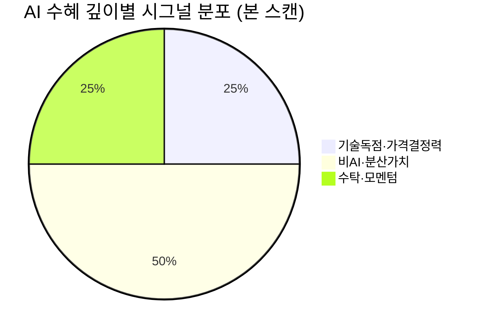

# 🔍 Inflection Scan — 2026-06-19

> [!abstract] 탐색 요약
> 탐색 범위: 2026-06-19 기준 최근 2주 | High Conviction **4건 채택 / 1건 DROP**
> 소스: IR 직접 + 셀사이드 리포트 + X 모멘텀 + 어닝스/가이던스
> **핵심 테마**: AI CapEx 수혜의 "깊이" 차별화 — 기술 독점(SK하이닉스) vs 수탁 조립(Jabil) vs 사이클 독립(STLD/CAI), 삼성전기 DROP(기대감 ≠ 변곡점)

---

## 시그널 요약 대시보드

| 회사명 | 티커 | 타입 | 핵심 이벤트 | 확신도 | 추천 액션 |
|--------|------|------|------------|:------:|:--------:|
| [[SK하이닉스]] | 000660.KS | 실적가속/구조적 | HBM4E 단독 샘플 공급 발표, OPM 71.53% | H · P=0.56 | /deal |
| [[Steel Dynamics]] | STLD | 가이던스상향/역발상 | 2Q26 EPS 가이던스 +75% YoY, 알루미늄 신공장 가동 | M · P=0.58 | /deal |
| [[Jabil Inc.]] | JBL | 실적가속/가이던스상향 | AI 인프라 +52% YoY, 연간 AI 가이던스 $131억 상향 | M · P=0.52 | /deep |
| [[Caris Life Sciences]] | CAI† | 실적가속/선행지표 | 1Q26 매출 +79%, ASP 최대 +70% — FDA 승인 가격결정력 | L · P=0.52 | /deep |
| [[삼성전기]] | 009150.KS | ~~사업변곡점~~ | ~~유리기판 기대감 주가 +8.27%~~ | DROP | — |

> [!note] †티커 정확성 검증 필요
> Caris Life Sciences의 실제 거래소 티커는 1차 소스 확인 필수. 2025년 IPO 직후 종목으로 티커 오기재 가능성 존재.

---

## AI 수혜 깊이 비교 (본 스캔 관통 프레임)

이번 스캔의 핵심 질문은 <strong>"AI CapEx에 올라타되, 수혜의 깊이(가격결정력·기술 독점·마진 구조)가 다른가?"</strong>이다. 4건의 시그널을 이 축으로 배열하면 투자 판단이 명확해진다.

| 시그널 | AI 연관성 | 가격결정력 | OPM 구조 | 독립 드라이버 |
|--------|-----------|-----------|----------|-------------|
| SK하이닉스 | 🟢 핵심 수혜 | 🟢 기술 독점 | 🟢 71.53% | HBM4E 단독 |
| STLD | 🟢 무상관(분산) | 🟡 사이클 의존 | 🟡 ~10% (확인 필요) | 알루미늄 신공장 |
| Jabil | 🟡 수탁 조립 | 🔴 고객사 의존 | 🔴 ~5% EMS 한계 | 없음 |
| Caris | 🟢 무상관(분산) | 🟢 ASP +14~70% | 🟡 수익성 미확인 | FDA 승인 가격결정력 |

---

## 1. [[SK하이닉스]] (000660.KS) — 구조적 변곡점 / AI 수혜 깊이 최고

> [!abstract]
> HBM4E 단독 샘플 공급이라는 **기술 독점 창(window)** 개시. OPM 71.53%가 가격결정력을 수치로 증명. 변곡점의 본질은 주가(+287% YTD)가 아니라 독점 창의 지속 기간.

**M1 Forced Reasoning Chain**

| 단계 | 내용 |
|------|------|
| 🔵 사실 | HBM4E 샘플 공급 공식 발표; 1Q26 OPM 71.53% 기록; YTD +287%; 코스피 9,000 돌파 견인 |
| 🟡 추론 | HBM4E는 현재 SK하이닉스만 샘플 공급 가능 단계 → 삼성·마이크론 양산 진입 전까지 ASP 프리미엄 구간 존재 |
| 🟠 대안 가설 | +287% YTD = 이미 슈퍼사이클 가격 반영 완료 → 신규 진입 시 사이클 정점 진입 리스크 |
| 🟢 채택 사유 | HBM의 AI CapEx 연동(2년+ 가시성)은 전통 DRAM 사이클과 질적으로 상이. OPM 71%는 단순 수량 성장이 아닌 믹스 고도화 증거. Kill criteria가 명확(삼성 HBM4E 양산 공식화)하다는 점이 conviction 지지 |

SK하이닉스는 본 스캔에서 **AI 수혜의 깊이가 가장 깊은 시그널**이다. Jabil(수탁 조립, OPM ~5%)·CoreWeave(자산 임대)와 달리, HBM4E 단독 공급이라는 **기술 독점에 기반한 가격결정력**을 보유하며, OPM 71.53%가 이를 직접 증명한다. 일반 DRAM OPM(30~40%)과의 갭은 HBM 믹스 고도화의 결과로, 구조적으로 유지될 가능성이 높다. 핵심 변곡점은 +287% YTD 가격 수준이 아니라 **HBM4E 기술 독점 창의 개시**다 — 삼성·마이크론 양산 진입 전까지의 ASP 프리미엄 구간이 얼마나 지속되느냐가 투자 판단의 핵심이다. Short thesis(사이클 정점·2017 선례)는 실재하나, HBM의 AI CapEx 연동(NVIDIA Rubin 로드맵·빅테크 2년+ CapEx 가이던스)은 전통 메모리 사이클과 질적으로 다르다. 유사 사례로 2019~20년 TSMC가 5nm 파운드리 독점 창(애플·AMD 선점) 시기에 12개월 +80% 기록한 구조와 유사하다.

> [!warning] Steel-manned Short — 가장 똑똑한 숏 셀러의 논리
> "+287% YTD는 이미 슈퍼사이클을 가격에 담았다. OPM 71%는 **사이클 정점의 신호**지 지속 가능성의 증거가 아니다 — 메모리는 항상 정점에서 가장 매력적으로 보인다(2017 선례). HBM4E 6~12개월 리드는 삼성이 따라잡으면 ASP 프리미엄 소멸. 빅테크 AI CapEx가 한 분기라도 둔화 시그널을 주면 메모리주는 가장 먼저 무너진다. '코스피 9,000 견인'은 과열 정점 신호다."

> [!tip] Kill Criteria — 명문화
> ① 삼성 HBM4E 양산 진입 공식 발표 → 즉시 포지션 축소 검토
> ② NVIDIA Rubin의 HBM4E 탑재 일정 6개월+ 지연 확인
> ③ 빅테크(MS·Google·Meta·AWS) 중 2곳 이상 분기 AI CapEx 가이던스 YoY 감소

🟢 Bull 30%

🟡 Base 45%

🔴 Bear 25%

| 시나리오 | 핵심 가정 | 목표가(12M) | 업사이드 |
|----------|-----------|------------|---------|
| 🟢 Bull 30% | HBM4E NVIDIA Rubin 독점 탑재 공식화 + 삼성 양산 지연 | [추정] +25% | 기술 독점 창 연장 |
| 🟡 Base 45% | HBM4E 리더십 유지, AI CapEx 현 수준 유지 | [추정] +10% | 컨센서스 상향 점진적 반영 |
| 🔴 Bear 25% | AI CapEx 분기 둔화 신호 + 삼성 빠른 추격 | [추정] -30% | 사이클 정점 + 멀티플 압축 |

AI 수혜 깊이(기술독점·가격결정력) 82/100

신규 진입 타이밍 55/100 (+287% YTD 반영)

Kill Criteria 명확도 78/100

| 항목 | 내용 |
|------|------|
| 시장 | 🇰🇷 코스피 |
| 변곡점 유형 | 실적가속 / 구조적 변곡점 |
| Cross-Asset | US: NVIDIA(NVDA) HBM4E 탑재 일정이 직접 연동. Micron(MU) ASP 동향이 선행지표. 원/달러 환율 1,400원+ 시 수출 환산 이익 추가 |
| 추천 액션 | /deal — 단, +287% YTD 감안 포지션 사이징 보수적. Kill criteria 모니터링 필수 |

**Inversion**: 5년 후 이 시그널이 무효가 된다면 — 삼성이 HBM4E 수율을 SK하이닉스 수준으로 따라잡아 ASP 프리미엄이 소멸되고, AI 추론 칩이 HBM 대신 PIM(Processing-in-Memory) 구조로 전환되었기 때문이다.

[Conviction: P=0.56 | Confidence: H | 근거: 1차IR(HBM4E 공식 발표) + 2차셀사이드(노무라·유진 목표가 상향)]

---

## 2. [[Steel Dynamics]] (STLD) — 가이던스 상향 / 역발상 기회

> [!abstract]
> 2Q26 EPS 가이던스 전년 대비 +75%. 본 스캔 유일의 **비-AI 시그널** — 알루미늄 신공장이라는 idiosyncratic 드라이버로 포트폴리오 분산 가치 제공.

**M1 Forced Reasoning Chain**

| 단계 | 내용 |
|------|------|
| 🔵 사실 | 2Q26 EPS 가이던스 $3.51~3.55, 전년 동기 대비 +75%; 텍사스 산디아 알루미늄 재활용 공장 2Q 가동 본격화; $1,600만 일회성 감액 노이즈 제거 시 실질 이익 가이던스 상회 |
| 🟡 추론 | 알루미늄 분기 수익이 철강과 독립적 성장 드라이버로 기능 → 순수 철강 사이클 베팅과 차별화 |
| 🟠 대안 가설 | EPS +75%가 작년 저베이스 기저효과 + 관세 수혜의 일시적 복합 → peak earnings × low multiple = value trap |
| 🟢 채택 사유 | STLD mini-mill 구조는 원가 유연성으로 사이클 저점 생존력 입증. 알루미늄 신공장이 idiosyncratic 드라이버로 사이클 리스크를 부분 상쇄. 6건 중 유일한 비-AI 시그널로 포트폴리오 분산 가치 결정적 |

STLD는 본 스캔에서 **유일하게 AI CapEx 테마와 무상관인 시그널**로, 포트폴리오 차원의 분산 가치가 핵심 buy case다. 2Q EPS +75%의 질을 판단하는 핵심은 알루미늄 신공장(산디아) 기여도 — 이것이 철강 사이클과 독립적인 idiosyncratic 성장 드라이버로 작동하면 "저PER 함정" 논리를 무력화한다. STLD의 전기로(mini-mill) 구조는 전통 blast furnace 대비 원가 변동 유연성이 높아 사이클 저점에서도 양수 마진을 유지해온 역사적 패턴이 있다. 수주잔고 +40% YoY는 철강 수요의 단기 가시성을 뒷받침한다. 다음 catalyst는 7월 20일 실적 발표로, 알루미늄 부문 분기 기여도가 최초로 명확히 공시되는 시점이다. 단, 연간 EPS 컨센서스 $15.80 및 현재 PER의 역사적 평균 대비 위치는 **(확인 필요)** — value trap 여부 판단의 선결조건이다.

> [!warning] Steel-manned Short — 가장 똑똑한 숏 셀러의 논리
> "철강은 관세 정책의 양날의 검이다 — 트럼프 관세가 국내 가격을 인위적으로 떠받치나, 동시에 자동차·건설 전방 수요를 위축시킨다. EPS +75%는 작년 저베이스 기저효과. 알루미늄 신공장은 램프업 초기로 수율·가동률 리스크 상존. **'저PER'은 사이클 정점에서의 함정(peak earnings × low multiple = value trap)**이다 — NUE·CLF 2022년 정점 후 -40% 패턴 반복."

🟢 Bull 30%

🟡 Base 50%

🔴 Bear 20%

| 시나리오 | 핵심 가정 | 목표가(12M) | 업사이드 |
|----------|-----------|------------|---------|
| 🟢 Bull 30% | 알루미늄 사업 분기 기여 본격화 + 인프라 수요 가속 | [추정] +35% | 멀티플 재평가(복합 소재 기업) |
| 🟡 Base 50% | 가이던스 달성 + 알루미늄 램프업 점진적 + 멀티플 유지 | [추정] +20% | 7월 실적 확인 후 컨센서스 상향 |
| 🔴 Bear 20% | 철강 사이클 반전 + 알루미늄 수율 미달 → value trap | [추정] -20% | 관세 수혜 소멸 + peak EPS |

포트폴리오 분산 가치(비-AI) 72/100

Idiosyncratic 드라이버 강도 58/100 (알루미늄 기여 미검증)

Value Trap 방어력 62/100 (PER 검증 전)

| 항목 | 내용 |
|------|------|
| 시장 | 🇺🇸 NASDAQ |
| 변곡점 유형 | 가이던스 상향 / 역발상 기회 |
| Cross-Asset | KR: POSCO홀딩스(005490.KS) 동종 섹터 — STLD 실적이 글로벌 철강 수요 선행지표 역할. 원자재(HRC 선물) 동향이 동행지표. 달러 강세 시 수입 철강 경쟁 완화로 수혜 |
| 추천 액션 | /deal — 7월 20일 실적 전 catalyst. 알루미늄 신공장 가동률·수율 + 실제 PER 1차 검증이 모니터링 핵심 |

**Inversion**: 5년 후 이 시그널이 무효가 된다면 — 전기차 전환으로 자동차용 철강 수요가 구조적으로 감소하고, 알루미늄 사업이 규모의 경제 달성 전에 시장가격 하락을 맞아 ROIC가 WACC를 하회했기 때문이다.

[Conviction: P=0.58 | Confidence: M | 근거: 1차IR(가이던스 직접) + 3차추정(연간 EPS $15.80) — PER 역사적 비교 1차 검증 필요]

---

## 3. [[Jabil Inc.]] (JBL) — 가이던스 상향 / AI EMS 수혜 (강등)

> [!abstract]
> AI 인프라 부문 +52% YoY, 연간 AI 매출 가이던스 $131억 상향은 사실. 그러나 EMS 구조적 마진 한계(OPM ~5%)가 Variant의 차별성을 약화시킨다. /deal→/deep 강등.

**M1 Forced Reasoning Chain**

| 단계 | 내용 |
|------|------|
| 🔵 사실 | AI 인프라 부문 +52% YoY; 연간 AI 매출 가이던스 $131억(기존 대비 $10억 상향); UBS 목표가 $380→$430 상향 [출처: UBS 리포트, 일자 확인 필요] |
| 🟡 추론 | AI 서버 물량 증가 → Jabil 매출 성장 반영. 단, EMS 구조상 마진은 고객사(Dell·슈퍼마이크로)와 NVIDIA가 보유 |
| 🟠 대안 가설 | "AI 인프라 믹스 확대 → OPM 개선" — 검증되지 않음. 세그먼트별 실제 OPM 추이를 IR에서 확인해야 함 |
| 🟢 채택(제한적) | 컨센서스 상향 사이클 초입 모멘텀은 유효. 단 AI 수혜의 깊이(기술 독점 無·가격결정력 無)가 SK하이닉스 대비 열위. 세그먼트 OPM 검증 선결 |

Jabil의 AI 인프라 +52%와 가이던스 상향은 매출 성장의 방향성을 확인한다. 그러나 **EMS(전자제조서비스)의 구조적 본질은 수탁 조립 = 가격결정력 부재**이며, 아무리 AI 서버 물량이 늘어도 이익의 대부분은 고객사와 NVIDIA가 가져간다는 short thesis는 단순히 반박하기 어렵다. "AI 믹스 개선 → OPM 구조적 향상" 논리가 Variant의 핵심인데, 이는 **실제 AI 인프라 세그먼트 OPM 추이**를 IR 수치로 확인하기 전까지는 추론에 불과하다. 애플 매출 의존도 20%+와 관세 노출은 기존 리스크로 그대로 존재한다. 유사 사례로 인용된 Foxconn(+140%)은 사후선택 편향(survivorship bias) 의심이 있어 base rate 근거로 채택 불가. 컨센서스 상향 사이클 초입이라는 모멘텀은 실재하나, 이는 AI 수혜의 "넓이"이지 "깊이"가 아니다.

> [!warning] Steel-manned Short — 가장 똑똑한 숏 셀러의 논리
> "Jabil의 AI 부문 성장은 사실이나, EMS의 본질은 **수탁제조 = 가격결정력 부재**다. AI 서버 물량이 늘어도 마진은 고객사(Dell·슈퍼마이크로)와 NVIDIA가 가져가고, Jabil은 한 자릿수 OPM의 조립업자에 머문다. '믹스 개선'이라지만 EMS 전체 OPM은 여전히 ~5% 수준. UBS 멀티플 확장 논리는 'AI 태그'에 대한 프리미엄일 뿐 구조적 ROIC 개선의 증거가 약하다. 애플 의존 20%+와 관세 노출은 그대로다."

> [!question] 검증 선결조건
> ① AI 인프라 세그먼트 실제 OPM 추이(IR 직접 확인)
> ② 전체 OPM vs AI 부문 OPM 비교 — "믹스 개선" 논리의 수치 근거
> ③ 애플 매출 의존도 최근 분기 트렌드
> 위 3항목 확인 후 /deal 재검토 가능

🟢 Bull 30%

🟡 Base 50%

🔴 Bear 20%

| 시나리오 | 핵심 가정 | 목표가(12M) | 업사이드 |
|----------|-----------|------------|---------|
| 🟢 Bull 30% | AI CapEx 가속 + AI 세그먼트 OPM 구조적 개선 검증 | [추정] +35% | 컨센서스 상향 + 멀티플 재평가 |
| 🟡 Base 50% | 가이던스 달성 + EMS 멀티플 유지 | [추정] +15% | 모멘텀 지속, OPM 현수준 |
| 🔴 Bear 20% | 관세 충격 + 마진 압박 + 애플 주문 감소 | [추정] -15% | EMS 구조한계 + AI 태그 프리미엄 소멸 |

매출 성장 모멘텀 65/100

AI 수혜 깊이(마진·독점) 32/100

Variant 차별성 52/100 (OPM 검증 전)

| 항목 | 내용 |
|------|------|
| 시장 | 🇺🇸 NYSE |
| 변곡점 유형 | 실적가속 / 가이던스 상향 |
| Cross-Asset | KR: [[한화시스템]]·[[LG이노텍]] 등 EMS 유사 구조 — Jabil OPM 개선 검증 시 동반 재평가 가능. 단, 매크로 관세 정책이 US·KR EMS 동시 압박 가능 |
| 추천 액션 | /deep — 세그먼트 OPM 3항목 검증 선결. 통과 시 /deal 재검토, P 0.52→0.60 상향 가능 |

**Inversion**: 5년 후 이 시그널이 무효가 된다면 — AI 서버 제조가 고도로 표준화되어 Dell·HPE가 직접 생산 내재화(in-house manufacturing)를 확대했고, EMS 업체 간 과잉경쟁으로 OPM이 3% 이하로 압축되었기 때문이다.

[Conviction: P=0.52 | Confidence: M | 근거: 2차셀사이드(UBS, 일자 확인 필요) + 1차IR(가이던스) — 세그먼트 OPM 검증 미완]

---

## 4. [[Caris Life Sciences]] (CAI†) — 실적가속 / 선행지표

> [!abstract]
> 1Q26 매출 +79%가 **ASP 주도**(물량이 아닌 가격)라는 점이 진단업 최강 시그널 패턴. 그러나 티커 정확성·수익성·락업 해제 3대 검증 공백 존재. /deep 유지.

**M1 Forced Reasoning Chain**

| 단계 | 내용 |
|------|------|
| 🔵 사실 | 1Q26 매출 YoY +79%; 조직검사 ASP +70%; 혈액검사 ASP +14%; MI Cancer Seek FDA 승인 기반 |
| 🟡 추론 | ASP의 동시 상승(두 제품 라인) = payer mix 개선 + FDA 승인 코딩 프리미엄 → 가격결정력 구조 변화 가능 |
| 🟠 대안 가설 | ASP +70%가 신규 payer 계약 발효 시점의 **일회성 계단**일 수 있음 — 이후 정체 패턴이 진단업에 반복적으로 관찰됨 |
| 🟢 채택(제한적) | Variant("물량 vs 가격" 구분)은 진정성 있으나, 3대 검증 공백(티커·수익성·락업)이 미해결. Guardant 2019-20 선례는 유효하나 그 선례도 수익성 경로가 명확했음 |

Caris의 1Q26 +79%는 **ASP 주도 성장**이라는 점에서 진단업 최강 시그널의 패턴을 보인다 — Guardant Health(2019~20년 ASP 구조적 상승 → 12개월 +120%)가 유사 선례다. 두 제품 라인에서 동시에 ASP가 +14~70% 상승한 것은 단순 물량 게임이 아닌 **가격결정력 구조 변화**의 징표다. 그러나 검정 결과 3대 핵심 검증 공백이 존재한다: ① ASP +70%가 지속적 가격결정력인지 payer 계약 발효 시점의 일회성 계단인지 미확인, ② 2025년 IPO 직후 종목으로 락업 해제(통상 IPO 후 180일) 매도 압력 타임라인 확인 필수, ③ +79% 매출 성장이 적자 폭 확대를 동반했는지 수익성 데이터 본문 누락. 또한 미국 진단업은 **CMS 리임버스먼트 정책**에 구조적으로 노출되어 있어 정부 가격결정 리스크가 항시 존재한다. Variant와 비즈니스 모델은 견고하나, 검증 공백이 너무 커 현 단계에서 /deep 이상 승격 불가.

> [!warning] Steel-manned Short — 가장 똑똑한 숏 셀러의 논리
> "조직검사 ASP +70%는 payer mix 변화의 **일회성 계단**이다. IPO 직후 종목은 락업 해제(통상 180일) 시 대규모 매도 압력이 예약되어 있다. 가장 큰 구조 리스크는 CMS 리임버스먼트 정책 — 미국 진단업은 정부 가격결정에 인질이다. +79% 성장이 적자 확대를 동반했다면 현금 소진 속도(burn rate)가 발목을 잡는다."

> [!question] 4대 선결조건 — 검증 없이 /deal 불가
> ① **티커 정확성**: 'CAI'가 실제 Caris Life Sciences 거래 티커인지 1차 확인 (2025년 IPO, 오기재 가능성)
> ② **ASP 지속성**: payer 계약 구조 — 1회성 계단 vs 재계약 단계 상승 여부
> ③ **락업 해제 일정**: IPO일 기준 180일 후 정확한 날짜 + 락업 물량 규모
> ④ **수익성·Burn Rate**: 적자 여부, 분기 현금 소진율, 런웨이(runway)

🟢 Bull 28%

🟡 Base 45%

🔴 Bear 27%

| 시나리오 | 핵심 가정 | 목표가(12M) | 업사이드 |
|----------|-----------|------------|---------|
| 🟢 Bull 28% | Payer 확장 지속 + ASP 구조적 유지 + 락업 흡수 | [추정] +55% | 진단업 멀티플 확장(Guardant 경로) |
| 🟡 Base 45% | ASP 추세 유지 + 락업 일부 흡수 + 적자 축소 경로 | [추정] +20% | 분기 성장세 확인 반복 |
| 🔴 Bear 27% | CMS 리임버스먼트 삭감 + 락업 매도 + burn rate 우려 | [추정] -35% | 복합 악재 → 성장주 멀티플 압축 |

Variant 차별성(ASP 주도 성장) 78/100

검증 완성도 35/100 (3대 공백)

포트폴리오 분산 가치(비-AI) 60/100

| 항목 | 내용 |
|------|------|
| 시장 | 🇺🇸 NYSE (티커 확인 필요) |
| 변곡점 유형 | 실적가속 / 선행지표(ASP 구조 변화) |
| Cross-Asset | US: [[Guardant Health]](GH), [[Foundation Medicine]] 동종 — CGP(Comprehensive Genomic Profiling) 섹터 전반 ASP 트렌드가 동행지표. CMS 정책 변화는 섹터 공통 리스크. 금리 인하 시 적자 성장주 멀티플 확장 수혜 가능 |
| 추천 액션 | /deep — 4대 선결조건 검증 완료 시 P 0.52→0.62 상향 및 /deal 재검토 |

**Inversion**: 5년 후 이 시그널이 무효가 된다면 — CMS가 CGP 검사의 리임버스먼트를 대폭 삭감하고, AI 기반 단백질 구조 예측(AlphaFold 류)이 포괄적 유전체 프로파일링을 대체하면서 ASP 프리미엄이 소멸되었기 때문이다.

[Conviction: P=0.52 | Confidence: L | 근거: 1차IR(분기실적) — 티커·수익성·락업 3대 공백, 셀사이드 확인 불가]

---

## ⛔ DROP 처리: [[삼성전기]] (009150.KS)

> [!failure] Gate 1 재검증 탈락 — 변곡점 시그널 기준 미달
> **EVENT = "기대감에 주가 +8.27%"** — 펀더멘털 변곡점이 아니라 주가 움직임 자체를 시그널로 제출한 동어반복(narrative fallacy). 양산까지 최소 2~3년 거리.

삼성전기 시그널의 근본 문제는 EVENT가 **"유리기판 기대감에 주가 +8.27%"** 라는 점이다. 펀더멘털 변곡점(실적·가이던스·기술 양산)이 아니라 주가 움직임 자체를 시그널로 순환논법적으로 제출한 구조다. 본문 스스로 ① "현재는 양산이 아닌 개발 단계", ② "기대감 선반영 리스크", ③ "매출 기여 2027년 이후"를 인정하며, 인텔조차 유리기판을 2026~2030 로드맵 단계로 설정했다. **매출/이익 구조 변화(=변곡점)까지 최소 2~3년 거리**이므로, 현재는 "변곡점 시그널"이 아닌 "테마 모멘텀"이다. SK하이닉스와 동일한 KR AI 테마 편중 가중도 포트폴리오 분산 관점에서 불필요하다. 기술 방향성은 유효하므로, **모니터링 목록에 보류** — 재진입 트리거: 삼성전기의 유리기판 고객사 공식 계약 또는 양산 시점 공시.

| 항목 | 내용 |
|------|------|
| DROP 사유 | EVENT = 주가 모멘텀 (펀더멘털 변곡점 부재) |
| 재진입 트리거 | 유리기판 고객사 공식 계약 공시 또는 양산 일정 확정 |
| 모니터링 | 인텔 IFS 유리기판 로드맵 업데이트 + 삼성전기 분기 IR |

---

## 📊 섹터 메타 시그널

### AI 인프라 CapEx — 수혜 깊이의 위계

이번 스캔의 관통 메시지는 **"AI 테마에 올라타는 방식이 모두 같지 않다"** 는 것이다. SK하이닉스(기술 독점·OPM 71%)와 Jabil(수탁 조립·OPM ~5%)은 동일한 AI CapEx 파이를 나눠 먹지만, 가격결정력 구조가 근본적으로 다르다. 이 위계를 인식하지 못하면 "AI 수혜주 바스켓"이라는 이름으로 질적으로 다른 자산을 혼합하는 오류를 범한다. Caris와 STLD가 제공하는 비-AI 분산 가치는, AI CapEx 테마가 한 분기라도 둔화 신호를 보낼 때 포트폴리오 방어선이 된다.

### 진단·정밀의료 — ASP 구조 변화 주시

Caris의 ASP +14~70%가 진단업 섹터 전반의 리프라이싱 신호인지, 아니면 Caris 개별 payer 계약의 일회성인지는 **향후 1~2분기 추이**가 판가름한다. Guardant Health(GH), Tempus AI(TEM) 등 동종 CGP 업체의 ASP 트렌드를 병행 모니터링하면 섹터 신호인지 기업 특이적 신호인지 구분할 수 있다. CMS 2026년 리임버스먼트 업데이트(통상 11월 발표)가 섹터 전체의 next catalyst다.

---

> [!note] 면책 고지
> 본 리포트는 투자 참고 목적이며 투자 권유가 아닙니다. 모든 [추정] 태그 수치와 (확인 필요) 항목은 1차 소스 검증 전 투자 판단 근거로 사용 불가. 티커 CAI는 실제 거래소 공식 티커 확인 필수.