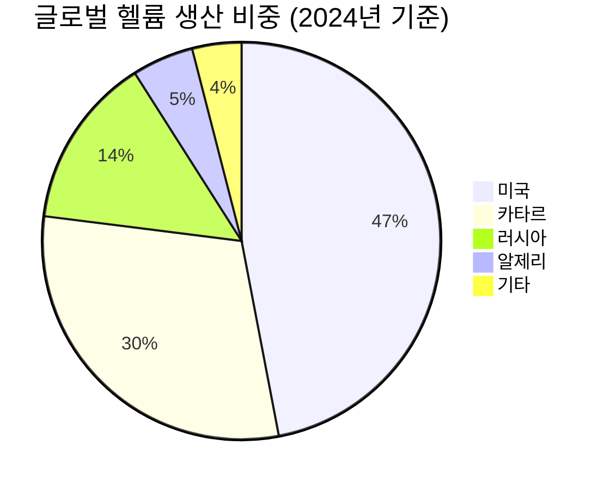
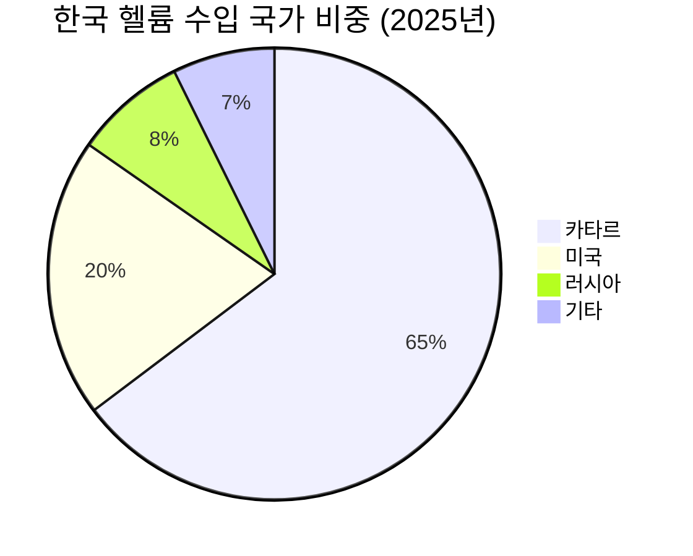

---

created: 2026-04-10 14:00
date: 2026-04-10 14:00
listing: public
tags:
- SK하이닉스
- 반도체
- 헬륨
- ask
- 공급망리스크
- HBM
title: SK하이닉스 헬륨 공급 차질 리스크 심층 분석 14:00
type: ask
publish: true
---

> **질문**: SK하이닉스 관련해서 헬륨 공급 차질 리스크에 대해서 최대한 분석해줘. 또한, 이를 어떻게 모니터링할 수 있을까?

# SK하이닉스 헬륨 공급 차질 리스크 분석

> [!abstract] 핵심 요약
> 이란-이스라엘 전쟁 여파로 카타르 라스라판 헬륨 생산단지가 타격을 받아 전 세계 헬륨 공급의 ~30%가 중단됐다. 한국은 수입의 64.7%를 카타르에 의존해 구조적 취약성이 높다. SK하이닉스는 현재 4~6개월치 재고를 보유하고 공급망 다변화를 추진 중이나, **분쟁 장기화 시 HBM 생산 비용 상승 및 가동률 조정 리스크**가 현실화될 수 있다.

---

## 1. 핵심 답변

**단기(0~6개월): 생산 차질 가능성 낮음.** SK하이닉스는 4~6개월치 헬륨 재고를 보유하고 있고, Linde·Air Products 등과 긴급 장기계약을 체결해 단기 충격은 흡수 가능하다.

**중기(6~12개월): 비용 압박 현실화.** 헬륨 현물가는 이미 40~100% 급등했고, Fitch는 최대 200% 상승 가능성을 경고했다. 장기 계약 재협상 시점이 도래하면 원가 부담이 가시화된다.

**장기(12개월+): 구조적 재편 필요.** 카타르 의존 64.7%라는 집중 리스크는 단순히 재고 비축으로 해결될 문제가 아니다. 헬륨 재활용 인프라 확충과 공급원 다변화의 속도가 경쟁력을 결정한다.

---

## 2. 헬륨이 반도체 공정에서 대체 불가능한 이유

> [!tip] 왜 헬륨인가 — 물리화학적 독점성
> 헬륨은 모든 원소 중 **가장 작은 원자 크기**, **가장 낮은 끓는점(-269°C)**, **가장 높은 열전도율**, **완전한 화학적 불활성**을 동시에 가진 유일한 원소다. 이 4가지 특성이 조합된 물질은 자연계에 존재하지 않는다.

### 반도체 공정별 헬륨 사용 현황

| 공정 단계 | 헬륨 역할 | 대체 가능성 | HBM 연관성 |
|-----------|-----------|-------------|------------|
| **EUV 리소그래피** | ASML 광학계 냉각, 챔버 퍼지 | 🔴 불가 | 🟢 직접 연관 |
| **플라즈마 식각(Etch)** | 웨이퍼 척 냉각, 온도 균일성 유지 | 🔴 불가 | 🟢 직접 연관 |
| **이온 주입(Ion Implant)** | 웨이퍼 냉각, 빔 순도 유지 | 🔴 불가 | 🟡 간접 |
| **CVD/ALD 증착** | 캐리어 가스, 챔버 퍼지 | 🟡 일부 N₂로 대체 가능 | 🟡 간접 |
| **누출 감지(Leak Detection)** | 작은 원자 크기로 미세 누출 탐지 | 🔴 불가 | 🟢 전 공정 |
| **HBM 본딩(TSV/TC Bonding)** | 정밀 온도 제어, 불활성 분위기 | 🔴 불가 | 🟢 핵심 |

> [!warning] HBM에서 헬륨 의존도가 더 높은 이유
> HBM은 일반 DRAM 대비 **TSV(Through Silicon Via) 공정**과 **열압착 본딩(TC Bonding)** 단계가 추가된다. 이 공정들은 정밀한 열 제어와 불활성 분위기가 필수적이어서, HBM 단위 생산당 헬륨 소비량은 일반 DRAM보다 높다. SK하이닉스가 HBM3E·HBM4 생산 비중을 늘릴수록 헬륨 수요도 구조적으로 증가한다.

---

## 3. 글로벌 헬륨 공급 구조 분석

### 한국의 헬륨 수입 구조 — 집중 리스크

> [!failure] 구조적 취약점: 단일 공급원 의존
> 미국의 헬륨 수입 비중이 64.7%인 데 비해 한국은 카타르에 64.7%를 의존한다. 같은 수치이지만 의미가 정반대다. 미국은 자국 생산이 47%이고 공급원이 다양하다. 한국은 카타르 한 곳이 막히면 즉시 공백이 생긴다.

### 대체 공급원별 한계 분석

| 공급원 | 공급 가능성 | 주요 제약 | 비고 |
|--------|------------|-----------|------|
| **미국** (Wyoming, Texas) | 🟢 즉시 가능 | 장거리 운송비, 컨테이너 부족 | Air Products, Linde 계약 체결 중 |
| **러시아** (Amur, Irkutsk) | 🟡 기술적 가능 | 제재로 ISO 컨테이너 수급 제한, 정치적 리스크 | 2024년 가동률 45% 미만 |
| **알제리** (Arzew) | 🔴 단기 불가 | 천연가스 수출 우선, Air Products 확장 프로젝트 지연 | 유럽 에너지 수요로 헬륨 생산 축소 |
| **에티오피아·탄자니아** | 🔴 중장기 | 개발 초기 단계, 2~3년 소요 | 아프리카 헬륨 매장량 확인됨 |

> [!note] 러시아 옵션의 아이러니
> 러시아는 2035년까지 헬륨 생산 용량을 8,700만 세제곱미터로 늘릴 계획이며, 중동 공백을 메울 이론적 능력은 있다. 그러나 제재로 인한 ISO 컨테이너(운송 용기) 부족과 한국의 대러 관계 제약이 실질적 활용을 막는다. SK하이닉스가 러시아산 헬륨을 공개적으로 확대하기는 어렵다.

---

## 4. SK하이닉스에 대한 임팩트 시나리오 분석

🟢 Bull 25%

🟡 Base 50%

🔴 Bear 25%

| 시나리오 | 전제 조건 | 헬륨 영향 | 주가 임팩트 |
|----------|----------|-----------|------------|
| **🟢 Bull: 조기 해소** | 중동 휴전, 카타르 3개월 내 재가동 | 재고 소진 전 공급 재개, 비용 영향 미미 | 헬륨 리스크 프리미엄 해소 +5~10% |
| **🟡 Base: 장기화** | 분쟁 6~12개월 지속, 카타르 부분 가동 | 헬륨 원가 30~50% 상승, 마진 100~200bp 압박 | 기존 추세 유지, 헬륨 요인 -3~5% |
| **🔴 Bear: 물류 차단** | 호르무즈 봉쇄 8주+, 대체 공급 미확보 | 가동률 조정 불가피, HBM 생산 우선배정 | 생산 차질 우려로 -10~20% |

### Bear 시나리오 상세 분석

> [!bear] Bear Case: 물류 완전 차단 8주 이상
> - 액체 헬륨의 저장 가능 기간: **35~45일** (증발 특성)
> - 현재 보유 재고: 4~6개월치 (고체 환산 기준으로 추정, 액체 환산 시 단축 가능)
> - 8주(56일) 이상 물류 마비 시 재고 고갈 시작
> - 이때 SK하이닉스가 취할 행동: **HBM 생산 우선, 범용 DRAM 가동률 조정**
> - HBM 우선 배정은 단기 수익성은 유지하나, DRAM 시장 공급 감소 → 메모리 가격 상승의 역설적 효과 가능

---

## 5. SK하이닉스의 대응 현황 평가

### 현재 대응 조치

재고 확보 충분도 75/100

공급원 다변화 진행도 55/100

재활용 기술 성숙도 60/100

구조적 의존도 해소 35/100

| 대응 항목 | 현황 | 효과 | 한계 |
|-----------|------|------|------|
| **재고 비축** | 4~6개월치 확보 | 단기 버퍼 충분 | 액체 헬륨 35~45일 증발 특성, 장기 비축 어려움 |
| **Linde·Air Products 긴급 계약** | 체결 진행 중 | 미국산 물량 확보 가능 | 운송 리드타임 2~4주, 컨테이너 부족 |
| **헬륨 재활용 시스템(HeRS)** | 고순도 공정 90% 회수율 | 신규 공급 필요량 대폭 감소 | 첨단 공정에만 적용, 전체 팹 적용 미완성 |
| **공급처 다변화(미국·아프리카)** | 추진 중 | 장기 안정성 향상 | 단기 계약 전환 어려움, 가격 프리미엄 |
| **HBM 우선 배정 정책** | 준비 중 | 고수익 제품 보호 | 범용 DRAM 가동률 하락 리스크 |

> [!success] SK하이닉스의 상대적 강점
> 삼성전자와 SK하이닉스는 업계 평균(2개월) 대비 3배 이상의 재고(6개월)를 보유하고 있어 완충재가 충분하다. 헬륨 재활용률 75~90%는 업계 최고 수준이다. 또한 HBM에 헬륨을 우선 배정하면 가장 수익성 높은 제품 라인을 보호할 수 있다 — 이는 아이러니하게도 AI 칩 공급 부족을 심화시켜 HBM 가격을 지지하는 효과를 낼 수 있다.

---

## 6. 9대 분석 원칙 적용

### Variant Perception — 시장이 과대 공포인가, 과소 평가인가?

> [!question] 시장 컨센서스 vs 나의 뷰
> **컨센서스**: "6개월 재고 있으니 단기는 괜찮다" → 낙관적
> **나의 뷰**: 시장이 간과하는 것은 **HBM 생산의 헬륨 집약도 증가**다. SK하이닉스의 HBM 매출 비중이 커질수록 헬륨 단위 소비량도 증가하는데, 이 구조적 변화를 현재 컨센서스는 충분히 반영하지 않고 있다.

### 1차/2차 효과 분석

**1차 효과**: 헬륨 원가 상승 → SK하이닉스 영업이익률 압박

**2차 효과 (시장이 덜 주목)**:
- HBM 우선 배정 → 범용 DRAM 공급 감소 → DRAM 가격 상승 → 역설적으로 매출 지지
- 헬륨 가격 급등 → 헬륨 재활용 기업(린데, 에어프로덕츠) 수혜
- 중국 반도체의 헬륨 접근 제한 → 한국 기업의 상대적 우위 (한국은 서방 공급망 접근 가능)
- **텅스텐(WF6) 리스크 부각**: The Elec 보도에 따르면 실제로 반도체 업계는 헬륨보다 중국산 텅스텐 의존도를 더 심각한 단기 리스크로 보고 있다

### Devils Advocate — 헬륨 리스크가 과장됐을 가능성

> [!question] 반론: 이 리스크가 과장된 것 아닌가?
> 1. **재활용률 90%**: 실질 순소비량은 생산량의 10%에 불과. 재고 6개월 = 실제 내구성 더 길 수 있음
> 2. **LNG 부산물 특성**: 카타르 외에도 미국, 러시아의 LNG 생산에서 헬륨 추출 가능
> 3. **휴전 가능성**: 이미 미국-이란 협상 진행 중 (Tom's Hardware 보도)
> 4. **과거 선례**: 2006년 이후 5차례 헬륨 위기가 있었으나 모두 극복됨
> 5. **헬륨보다 갈륨·텅스텐이 더 급박**: 중국이 통제하는 소재는 대체 자체가 불가능

### Incentive Analysis

| 이해관계자 | 인센티브 | 행동 예측 |
|-----------|---------|-----------|
| **카타르에너지** | 헬륨 수출 수익 최대화 | 조기 재가동 시도, 단 안전 문제로 지연 가능 |
| **Linde·Air Products** | 공급 독점력 강화 | 가격 프리미엄 유지하며 공급. SK하이닉스에 유리한 장기계약 제공할 유인 있음 |
| **SK하이닉스 경영진** | HBM 수익성 보호 | 헬륨 공급 시 HBM 우선 배정 발표 가능. 이는 투자자에게 긍정 시그널 |
| **한국 정부** | 산업 안정성 | 14개 핵심 소재 수급 점검, 비축 지원 가능성 |
| **중국 경쟁사** | 헬륨 위기로 한국 약화 기대 | 단, 중국도 카타르 헬륨 의존하므로 동일 타격 |

### Margin of Safety — 현재 주가에 얼마나 반영됐나?

헬륨 리스크 발생 시 주가는 이미 일시 급락했다가 반등하는 패턴을 보였다. 이는 시장이 단기 충격을 과장 반영한 후 재평가하는 전형적인 패턴이다. 현재 리스크 프리미엄이 적정 수준인지는 카타르 재가동 시점에 달려 있다.

---

## 7. 모니터링 프레임워크

> [!tip] 모니터링 핵심 원칙
> 헬륨 리스크는 "발생 여부"가 아니라 **"지속 기간"**이 핵심 변수다. 6개월 버퍼가 있으므로, 앞으로 4~5개월 내 카타르 재가동 신호가 있는지가 투자 판단의 핵심이다.

### 📡 1단계: 지정학적 트리거 모니터링 (주간)

| 모니터링 항목 | 소스 | 경보 기준 |
|--------------|------|----------|
| 카타르 라스라판 가동 재개 | Reuters, QatarEnergy 공식 발표 | 재가동 → 매수 시그널 |
| 호르무즈 해협 통항 상황 | Vessel Finder, USNI News | 봉쇄 심화 → 경계 수위 상향 |
| 미국-이란 협상 진행 | Reuters, Al Jazeera | 휴전 합의 → 즉시 리스크 해소 |
| 카타르에너지 Force Majeure 기간 | QatarEnergy IR | 갱신 여부로 복구 지연 판단 |

### 📊 2단계: 헬륨 시장 지표 모니터링 (주간)

| 지표 | 현황 | 경보 기준 |
|------|------|----------|
| 헬륨 현물가 ($/Mcf) | 기준 대비 +40~100% | +150% 이상 시 Bear 시나리오 진입 |
| 헬륨 현물가/장기계약가 스프레드 | 확대 중 | 스프레드 축소 → 리스크 완화 신호 |
| Linde (LIN) 헬륨 부문 수주잔고 | (실적 발표 시) | 급증 → SK하이닉스 수급 긴박 반영 |
| Air Products (APD) 아시아 매출 | (실적 발표 시) | 급증 → 한국 기업의 수요 확인 |

### 🏭 3단계: SK하이닉스 공시·공급망 모니터링 (월간)

| 모니터링 항목 | 소스 | 판단 기준 |
|--------------|------|----------|
| **헬륨 관련 공급 계약 공시** | KIND, SK하이닉스 IR | 신규 계약 → 긍정 |
| **HBM 가동률 / 생산 가이던스** | 컨퍼런스 콜 | 하향 조정 없음 → 헬륨 충분 |
| **원자재 비용 항목** | 사업보고서 | 산업용 가스 비용 급등 → 마진 압박 확인 |
| **삼성전자 대응 동향** | 전자신문, The Elec | 삼성 가동률 조정 → SK도 영향권 |
| **TSMC 코멘트** | 실적 발표 | "중대한 영향 없다" → 업계 전반 안정 |

### ⚠️ Kill Criteria (즉시 재평가 트리거)

> [!warning] 다음 중 하나라도 발생 시 투자 테시스 즉시 재검토
> 1. **카타르 Force Majeure가 6개월 이상 연장** 발표
> 2. SK하이닉스가 실적 발표에서 **HBM 생산 가이던스를 헬륨 이유로 하향**
> 3. **호르무즈 해협 완전 봉쇄** 8주 이상 지속
> 4. **미국의 대이란 추가 제재**로 카타르 복구 지연
> 5. 헬륨 현물가 **기준 대비 +200% 이상** 달성 (Fitch 경고 수준)

---

## 8. 포트폴리오 임팩트

현재 포트폴리오에 SK하이닉스 직접 보유는 없으나, 관련 기존 테시스([[260327_Thesis_SK하이닉스_v3_1917]])와 연결해 검토:

| 관련 자산 | 영향 방향 | 비고 |
|-----------|----------|------|
| **NVDA** | 🟢 간접 수혜 | 헬륨 위기 → HBM 공급 타이트 → HBM 가격 유지 → 엔비디아 AI 서버 수요 지속 |
| **GOOGL** | 🟡 중립 | 데이터센터 AI 칩 조달 비용 소폭 상승 가능, 영향 제한적 |
| **VOO** | 🟡 중립 | 반도체 섹터 비중에 따른 간접 영향 |

> [!note] 크로스 임팩트 — 헬륨 위기의 수혜자
> - **Linde (LIN)**, **Air Products (APD)**: 헬륨 가격 급등과 공급 독점력으로 직접 수혜
> - **UEC (우라늄)**: 중동 불안 → 에너지 안보 → 원자력 확대 내러티브 강화. 보유 중이므로 긍정

---

## 9. So What?

### ✅ 당장 할 것
- **카타르에너지의 Force Majeure 기간 추적**: 5년 선언이 실제로 유지되는지, 단축되는지가 핵심
- 다음 **SK하이닉스 실적 발표**(2026 Q2) 에서 헬륨 관련 언급 확인
- **The Elec** 구독 — 반도체 소재 공급망 가장 빠르게 보도

### 👀 지켜볼 것
- **헬륨 현물가 추이**: Helium One, Matheson 등 가격 공개 채널 모니터링
- **중동 휴전 협상**: 미국-이란 협상이 구체화되면 가장 빠른 리스크 해소 경로
- **텅스텐(WF6) 리스크**: The Elec 보도 기준, 반도체 업계는 헬륨보다 텅스텐을 더 급박한 위험으로 평가 중 → 별도 분석 가치 있음

### 🚫 무시해도 되는 것
- **"반도체 라인 즉시 멈춘다"** 식의 공포성 헤드라인: 재고 4~6개월 + 재활용률 90% 고려 시 단기 생산 중단은 현재 가능성 낮음
- **헬륨 완전 대체재 개발 뉴스**: 물리화학적 특성상 단기에 대체재 등장 불가

---

## 10. 기존 분석 연결

[[260327_Thesis_SK하이닉스_v3_1917]] — HBM 성장 테시스에서 공급망 리스크 섹션과 연계 검토 필요
[[260410_Buffett Standard - SK하이닉스_1012]] — 헬륨 리스크가 "10년 뒤에도 이 기업을 보유할 것인가?"에 영향을 주는 구조적 약점인지 재평가 필요
[[260410_Deal - SK하이닉스 (SK Hynix Inc.)_0749]] — 딜 노트에 헬륨 리스크 섹션 추가 권장

---

> [!verdict] 최종 판단
> **헬륨 리스크는 실재하나, 현재는 "관리 가능한 위험"이다. 진짜 리스크는 6개월 후다.**
>
> 지금 당장 SK하이닉스 투자 결정을 바꿀 이유는 없다. 그러나 이 리스크는 **단기 헤드라인 이벤트가 아니라 구조적 공급망 취약성**임을 인식해야 한다. 카타르 64.7% 의존도는 이번 위기 이후에도 쉽게 해소되지 않으며, 헬륨 수요는 HBM 확대와 함께 증가한다. 따라서 **SK하이닉스 보유자라면 6개월 버퍼를 믿되, 5개월 시점(카타르 재가동 없을 경우)에 포지션을 재검토하는 트리거를 미리 설정**해두는 것이 합리적이다.
>
> 논거 강도: 🟢 공급 구조 분석 | 🟢 SK하이닉스 대응 현황 | 🟡 가격 영향 규모 (추정치 범위 넓음) | 🔴 카타르 재가동 시점 (예측 불가)

---

**후속 분석이 필요하다면:**
- `/research 텅스텐(WF6) 리스크` — 헬륨보다 더 급박할 수 있는 소재 리스크
- `/deep SK하이닉스 HBM 원가 구조` — 헬륨 가격 상승이 실제 마진에 미치는 정량적 영향
- `/research Linde AIR Products 헬륨 수혜` — 공급자 관점 투자 기회