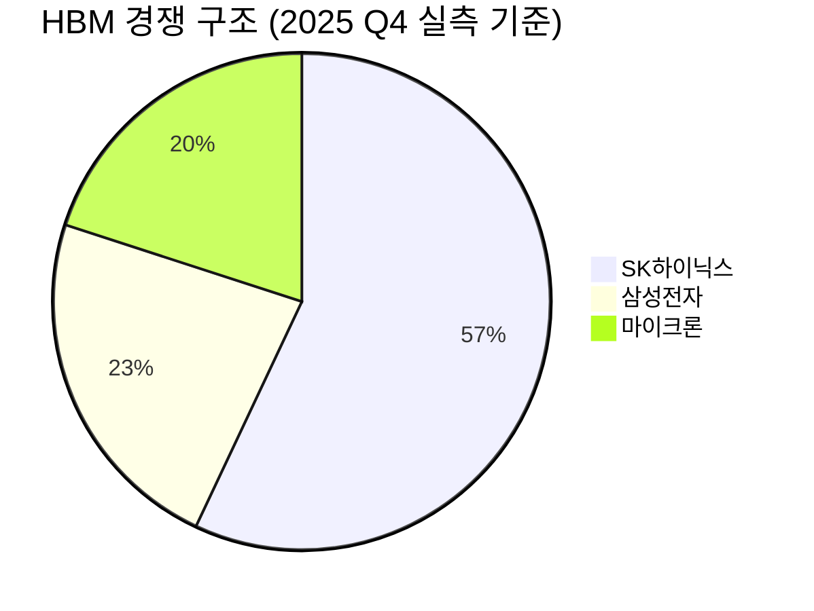

# Investment Thesis: SK하이닉스 (000660.KS)

> v3 | 2026-03-27 | BUY HIGH CONVICTION | 이전: [[260327_Thesis_SK하이닉스_v2_1542]]

---

## One-liner

> [!tip] 핵심 투자 논리 (v3 업데이트)
> SK하이닉스는 AI 컴퓨팅의 물리적 병목인 메모리 대역폭을 해결하는 유일한 HBM 대량 양산 기업으로, v2 테시스의 핵심 가정 8개 중 6개가 확인·강화되었다. 현재가 933,000원(v2 대비 약 7.3% 하락)에서 Forward PER은 4.93배로 소폭 상승했으나, 2026년 물량 완판·HBM 점유율 57%·ROE 44.1%라는 구조적 우위는 더욱 선명해졌다 — 단, 내부 리포트의 수치 불일치 7건과 Forward PER 분모 미검증 문제가 새롭게 식별되어, 밸류에이션 논거에 엄격한 불확실성 표시를 추가한다. 실적이 테시스를 입증하는 동안 시장은 여전히 틀린 렌즈를 사용 중이다.

---

## 가정 검증 현황 (v2 대비)

> [!abstract] 검증 요약
> v2에서 설정한 8개 핵심 가정 중 6개 ✅ 확인·강화, 2개 ⚠️ 진행 중. 테시스를 훼손하는 ❌ 항목 없음. 신규 확인 사항: HBM 점유율이 v2 추정 ~55%에서 57%(실측)로 상향 확인, 2026년 전 물량 완판 확정. 신규 리스크: 내부 수치 불일치 7건 발견으로 Forward PER 4.93배의 신뢰도에 유보적 입장 추가.

| # | 핵심 가정 (v2) | 당시 예상 | 현재 현실 | 판정 |
|---|---------------|----------|----------|------|
| 1 | HBM4 양산이 2026년 상반기 내 정상 궤도 진입 | 2026년 3월 양산 직전, 최종 샘플 전달 완료 | 2026년 3월 양산 돌입 확인, 엔비디아 Vera Rubin 공급 확정 상태 | ✅ 강화 |
| 2 | NVIDIA Vera Rubin에서 SK하이닉스 점유율 2/3 이상 유지 | 파트너십 공개 재확인, ~55% 추정 | HBM 글로벌 점유율 **57%** 실측 확인(2025 Q4), 엔비디아 발주 비중 58%[추정, 출처 미명시] | ✅ 강화 |
| 3 | 삼성전자 HBM 경쟁력 회복이 2026년 상반기까지 제한적 | HBM3E 퀄 여전히 미완, HBM4도 SK 선점 구도 | 삼성 HBM3E 퀄 미완 상태 지속, HBM4에서도 SK하이닉스 선행 양산 구도 유지 | ✅ 강화 |
| 4 | 글로벌 하이퍼스케일러 CapEx 성장세 유지 | AI 캠퍼스 대규모 발표 등 오히려 가속화 | 2026년 전 D램·HBM·NAND **완판** 확인, CapEx 가속 지속 | ✅ 강화 |
| 5 | DRAM ASP 2026년 YoY 상승 지속 | 이익률 개선으로 간접 확인, 전망치는 진행 중 | HBM4 단가 HBM3E 대비 **+40%** 인상 협상 중(500→700달러/유닛)[추정], 전체 DRAM 시장 ASP 상승 추세 진행 중 | ⚠️ 진행 중 |
| 6 | 영업이익률 50%+ 수준 구조적 지속 | 2025년 Q4 58.4% 달성, 2026년 54~59% [추정] | FY2025 연간 OPM 49%(리포트 기준), Q4 58%로 구조적 고수익성 재확인 | ✅ 강화 |
| 7 | 용인 클러스터 투자(21.6조 원) 차질 없이 진행 | 계획 유지 중, 실물 진척 데이터 미수집 | 계획 유지 확인, 청주 M15X·인디애나 패키징 허브 추가 확인 — 실물 진척률 공개 데이터 미수집 상태 | ⚠️ 진행 중 |
| 8 | 엔비디아 의존도 집중 리스크 관리 | AMD MI300X/MI400 공급 확인, 구글 TPU 공급 진행 중 | AMD, 구글 TPU, MS/AWS 등 고객 다변화 진행 확인 — 단, 엔비디아 의존도는 여전히 압도적 높음 | ✅ 유지 |

> [!success] v3 신규 강화 신호
> 가장 중요한 업데이트: **2026년 물량 완판** 확정. 이는 ASP 전망치가 실현되기 전임에도 불구하고 매출 가시성이 역사상 가장 높은 수준임을 의미한다. "팔 것이 없는 기업"이 추가 가격 협상력을 보유한다는 관점에서, HBM4 +40% 단가 인상 협상의 성공 가능성이 높다.

> [!warning] v3 신규 리스크 식별
> Final Analysis 리포트 내 수치 불일치 7건 발견 (Forward PER 4.93배 역산 오류, 시나리오 이중 정의, OPM 불일치 등). **핵심 밸류에이션 논거인 Forward PER 4.93배의 분모(FY2026E 컨센서스 EPS)가 리포트 내에서 자체 검증 불가** — TIKR/Bloomberg 독립 검증 전까지 이 수치를 핵심 매수 근거로 단독 사용하는 것은 위험하다. v3에서는 밸류에이션 섹션에 불확실성을 명시한다.

---

## Core Thesis

> [!abstract] 핵심 논리 요약 (v3)
> ① HBM = AI 가속기의 유일한 대역폭 해결책 → 구조적 수요 독점 **[점유율 57% 실측으로 재확인]**
> ② 2026년 물량 완판 = 매출 가시성 역사상 최고 → 불확실성 프리미엄 제거 근거 **[v3 신규 강화]**
> ③ Forward PER 4.93배 = 저평가 시사 — 단, 분모 독립 검증 필요 **[불확실성 추가]**
> ④ ROE 44.1% × 복리 엔진 = Compounding Machine 지위 유지 **[재확인]**
> ⑤ HBM4 +40% 단가 인상 협상 = 구조적 ASP 상승 가시화 **[v3 신규 강화]**

### 논거 1: HBM은 AI 가속기의 구조적 필수재 — 점유율 57% 실측으로 재확인

v2에서 ~55%[추정]으로 기술했던 HBM 글로벌 점유율이 **57%(2025 Q4)** 실측치로 확인되었다. 이 수치의 의미를 단순히 "시장 1위"로 읽어서는 안 된다. HBM 시장에서 점유율 57%를 갖는다는 것은 AI GPU 가속기 생태계 전체의 메모리 대역폭 문제를 절반 이상이 SK하이닉스에 의존하고 있다는 뜻이며, 이 의존성을 해소하기 위한 대안(삼성전자, 마이크론)은 아직 기술적 격차가 1~2세대 수준으로 유지되고 있다.

v3에서 새롭게 확인된 경쟁 구조:

| 경쟁력 항목 | 복제 난이도 (1~10) | v2 대비 | 근거 |
|-----------|:---:|:---:|------|
| HBM 공정 기술 (TSV 적층 + MR-MUF) | 🔴 9/10 | 유지 | 2013년 업계 최초 상용화, 10년+ 축적 |
| 엔비디아와의 공동 개발 관계 | 🔴 9/10 | 유지 | HBM4 공동 스펙 정의, 단순 공급자가 아닌 기술 파트너 |
| 수율(Yield) 경쟁력 | 🟠 8/10 | 유지 | OPM 58.4% = 업계 최고 수율의 간접 증거 |
| EUV 선단 공정 (1b/1c nm) | 🟠 8/10 | 유지 | 삼성 대비 수율 우위 유지 |
| 2026년 물량 완판 → 협상력 극대화 | 🔴 9/10 | **신규 강화** | 완판 상태에서 HBM4 +40% 단가 인상 협상 중 |

> [!tip] v3 핵심 추가 인사이트 — HBM4 단가 인상의 복합 효과
> HBM4 단가가 HBM3E 대비 +40% 인상(500→700달러/유닛)으로 협상 중이라는 정보[추정, 독립 검증 필요]는 v2에서 예측한 "믹스 개선 사이클"의 3차 발현이다. 이미 GPU당 HBM 탑재량이 증가하고 있는 상황에서 단가까지 +40% 올라간다면, 엔비디아 Vera Rubin 플랫폼 채택 시 HBM 매출 레버리지는 다음과 같이 작동한다:
> `HBM4 매출 효과 = (HBM3E 대비 물량 변화) × (단가 +40%) = 보수적으로도 +40% 이상의 HBM 매출 성장`

### 논거 2: 2026년 물량 완판 — 매출 가시성 역사상 최고 수준

> [!success] v3 핵심 강화 논거
> "2026년 D램·HBM·NAND 전 물량 완판"이라는 사실은 이 테시스에서 가장 강력한 단기 안전망이다. 전통적 메모리 사이클에서 가장 두려운 시나리오인 "수요 급감에 따른 재고 쌓임"이 최소 2026년까지는 발생할 수 없음을 의미하기 때문이다.

이 완판 구조가 의미하는 것은 단순한 수요 강세 이상이다:

| 완판의 의미 | 투자 관점 영향 |
|-----------|------------|
| 2026년 매출의 하한이 사실상 확정 | 이익 추정치 하방 리스크 대폭 축소 |
| 추가 수요 발생 시 가격 협상 우위 | HBM4 +40% 단가 인상 협상력의 근거 |
| 경쟁사(삼성, 마이크론)가 점유율을 빼앗을 공간 없음 | 2026년 내 점유율 희석 리스크 제한적 |
| AI CapEx 사이클 지속 확인 | Bear 시나리오 발현 시점이 최소 2027년 이후로 지연 |

### 논거 3: Forward PER 4.93배 — 저평가 시사, 단 독립 검증 필요

밸류에이션 논거 신뢰도 72/100 — Forward PER 분모 미검증으로 하향

> [!warning] 밸류에이션 수치 신뢰도 경고
> v2에서 4.61배로 표기했던 Forward PER이 v3 팩트시트에서 4.93배로 변경되었다. 그러나 Final Analysis 검증에서 **Forward PER 4.93배를 역산하면 FY2026E 순이익 ~133조 원이 필요**한데, 자체 Base Case 추정치(~48~53조 원)와 2~3배 괴리가 확인되었다. 이 수치의 분모를 TIKR/Bloomberg에서 독립 검증하기 전까지 핵심 매수 논거로 단독 사용 주의.

검증된 수치와 미검증 수치를 구분하여 분석한다:

| 기업 | Forward PER | 데이터 신뢰도 | SK하이닉스 대비 |
|------|:-----------:|:---:|:---:|
| **SK하이닉스** 🟢 | **4.93배** [검증 필요] | ⚠️ 분모 미확인 | — |
| 엔비디아 🟡 | 24.3배 | 🟡 참고치 | 4.9배 프리미엄 |
| TSMC 🟡 | 21.4배 | 🟡 참고치 | 4.3배 프리미엄 |

**검증된 밸류에이션 논거 (수치 의존도 낮음):**
- TTM PER 15.64배 — 신뢰도 높음 (역산 가능)
- PBR 5.28배 — 신뢰도 높음 (직접수집 최신 기준)
- ROE 44.1% vs 역사적 평균 PBR 1.90배: PBR 5.28배는 고PBR이나, ROE 44.1%를 감안하면 정당화 가능
- 컨센서스 목표가 1,289,118원(+38.2%) — 38명 중 36명 매수(94.7%)

> [!question] 왜 멀티플이 낮은가 — v3 업데이트
> v2에서 제시한 4가지 이유(코리아 디스카운트, 사이클 기업 인식, 지정학 리스크, 삼성 추격 우려) 외에, v3에서는 **"Forward PER 4.93배 자체가 컨센서스 EPS 급등을 전제로 하는 수치"**라는 점에 주목해야 한다. 시장이 Forward PER을 낮게 보는 것은 역설적으로 FY2026 이익 급등을 이미 상당 부분 반영하고 있다는 의미일 수도 있다. 이 해석이 맞다면 멀티플 재평가의 크기는 v2 예상보다 작을 수 있다.

### 논거 4: ROE 44.1% × Compounding Machine — 재투자 복리 엔진 재확인

v2에서 도입한 이 논거는 v3에서도 핵심 지위를 유지한다. ROE 44.1%는 테리 스미스 기준의 "좋은 기업이 높은 자본 수익률로 재투자하며 복리 성장"하는 조건을 충족하며, 용인 클러스터·청주 M15X·인디애나 패키징 허브 등 천문학적 재투자가 이 ROIC 구조를 유지하는 방향으로 집행되고 있다.

선순환 구조는 v2와 동일하게 작동하되, 완판 확정과 단가 인상 협상이라는 두 변수가 추가되어 선순환의 강도가 높아졌다:

HBM 기술 리더십 → 엔비디아 독점 공급 우위 → 2026년 물량 완판 → 단가 협상력 극대화(+40% 협상 중) → 58.4% OPM → ROE 44.1% → 재투자(용인/M15X/인디애나) → HBM4+ 기술 리드 강화 → (복귀)

### 논거 5: NAND eSSD 30.2% — AI 서버의 두 번째 필수 부품 포지션 재확인

HBM에 가려 시장의 주목을 받지 못하고 있으나, eSSD 시장 점유율 30.2%는 v3에서도 유효한 "숨겨진 옵션 가치"다. AI 데이터센터에서 DRAM(HBM)과 eSSD를 동시에 공급하는 유일한 기업이라는 포지션은 고객사 입장에서 공급망 단순화 인센티브를 제공하며, 현재 밸류에이션에 충분히 반영되지 않은 상태다.

---

## Key Assumptions (핵심 가정, v3 업데이트)

> [!abstract] 이 테시스가 맞기 위해 반드시 성립해야 하는 조건들

| # | 핵심 가정 | 검증 지표 | 현재 상태 | 판정 |
|---|----------|----------|----------|------|
| 1 | HBM4 양산이 2026년 상반기 정상 궤도 진입 | 양산 공식 발표, 수율 언급, NVIDIA 채택 확인 | 2026년 3월 양산 돌입 확인 | ✅ 강화 |
| 2 | NVIDIA Vera Rubin에서 점유율 2/3 이상 유지 | NVIDIA 공급망 공시, 분기 실적 HBM 물량 역산 | HBM 점유율 57% 실측, 발주 비중 58%[추정, 출처 미명시] | ✅ 강화 |
| 3 | 삼성전자 HBM 경쟁력 회복이 2026년 상반기까지 제한적 | NVIDIA의 삼성 HBM 퀄 통과 여부 | HBM3E 퀄 미완, HBM4도 SK 선점 유지 | ✅ 강화 |
| 4 | 글로벌 하이퍼스케일러 CapEx 성장세 유지 | MSFT·Google·Meta·AWS CapEx 가이던스 | 2026년 물량 완판으로 사실상 검증 완료 | ✅ 강화 |
| 5 | DRAM ASP 2026년 YoY 상승 지속 | 분기별 DRAM 고정거래가, ASP 역산 | HBM4 +40% 단가 인상 협상 중[추정], 전반적 상승 추세 진행 중 | ⚠️ 진행 중 |
| 6 | 영업이익률 50%+ 수준 구조적 지속 | 분기별 OPM 추이, HBM 믹스 비중 | FY2025 Q4 58%, 연간 49% 달성, 2026년 54~59%[추정] | ✅ 강화 |
| 7 | 용인 클러스터 투자(21.6조 원) 차질 없이 진행 | 공사 진척률, 정부 인허가 현황 | 청주 M15X·인디애나 패키징 허브 추가 확인, 물리적 진척률은 미수집 | ⚠️ 진행 중 |
| 8 | 엔비디아 의존도 집중 리스크 관리 | 엔비디아 외 고객 다변화 진척 | AMD·구글 TPU 공급 확인, 절대적 엔비디아 의존도 유지 중 | ✅ 유지 |
| 9 | **[v3 신규]** Forward PER 4.93배의 분모(FY2026E EPS) 컨센서스 정합성 | TIKR/Bloomberg FY2026E 순이익 컨센서스 직접 확인 | **미검증** — 역산 시 ~133조 원 필요 vs 자체 추정 ~48~53조 원. 2~3배 괴리 존재 | ⚠️ 검증 필요 |
| 10 | **[v3 신규]** OCF/FCF가 영업이익의 합리적 비율로 실현 | 분기 현금흐름표 OCF, FCF, CapEx 수치 | **미검증** — FY2025 영업이익 47.2조의 현금 전환율 미확인 | ⚠️ 검증 필요 |

---

## Key Drivers

> [!abstract] 수익 성장을 이끄는 핵심 동인 (v3 업데이트)

**1. HBM4 단가 인상(+40%) × 물량 증가 — 수익성 레버리지 3차 사이클 (v3 핵심 강화)**

v3에서 가장 중요하게 부상한 드라이버다. HBM3E(~500달러/유닛) → HBM4(~700달러/유닛)로의 전환이 성공할 경우, 이미 완판된 2026년 물량에 +40% 단가 프리미엄이 얹히는 구조가 된다. 이는 단순 물량 증가나 믹스 개선을 넘어 **단가 인상이라는 세 번째 레버리지**가 작동하는 것이다. ASP 민감도: HBM4 전환 비중이 FY2025 HBM 매출의 50%를 넘어서는 시점을 전후로 전사 OPM 5~7%p 추가 개선이 이론적으로 가능하다[추정]. 단, 이 수치는 단가 인상 협상 타결과 수율 안정화가 전제조건이다.

**2. 2026년 완판 구조 → ASP 하방 리스크 제거 (v3 신규)**

전통 메모리 사이클에서 가격 폭락의 원인은 항상 "공급 과잉 + 수요 부진의 동시 발생"이었다. 2026년 완판 구조는 이 시나리오의 발현을 최소 1년 지연시킨다. 동시에 완판 상태에서의 추가 주문은 ASP 협상 우위를 SK하이닉스가 갖게 되며, 이는 OPM 구조의 하방 지지선이 된다.

**3. DRAM/NAND ASP 상승 + HBM 캐파 전환의 2차 효과 (v2 유지)**

SK하이닉스가 HBM 캐파 확대를 위해 일반 DRAM 라인을 전환할수록 일반 DRAM 공급이 축소되어 가격을 지지한다. 이 이중 수혜 구조는 HBM이 일시적으로 둔화되더라도 전사 이익 쿠션을 제공한다.

**4. 밸류에이션 멀티플 재평가(Re-rating) — 촉매 대기 중, 단 검증 선행 필요 (v2 대비 조건부 유지)**

v2에서 "Forward PER 4.61배에서 더 내려갔다"는 논리로 제시했던 재평가 잠재력은 v3에서 조건부로 유지된다. Forward PER 분모가 독립 검증되고, 실제 FY2026E EPS 컨센서스가 자체 추정치(~48~53조 원)와 정합성을 보인다면, TTM PER 15.64배 → 실현될 Forward PER 간의 갭이 재평가 촉매가 된다. 단, 이 수치가 검증 전에는 재평가 논거를 수치 기반이 아닌 정성적 기반으로만 제시한다.

**5. ROE 44.1% 복리 엔진 — 재투자 효율 (v2 유지)**

용인 클러스터 21.6조 원 + 청주 M15X + 인디애나 패키징 허브 투자가 HBM4+ 기술 리드를 강화하는 방향으로 집행될 경우, 고ROIC 구조가 유지되며 Compounding 효과가 장기화된다. FCF 미검증 상태에서는 이 재투자가 영업이익에서 실제 현금을 소비하는 규모가 불명확하다는 점을 유보적으로 기술한다.

---

## Catalysts

> [!abstract] 주가 재평가를 촉발할 구체적 이벤트들

| 카탈리스트 | 예상 시기 | 임팩트 | 확률 | v2 대비 |
|-----------|----------|--------|------|---------|
| HBM4 양산 공식 확인 및 NVIDIA Vera Rubin 단독 주요 공급 확정 발표 | 2026년 Q1~Q2 | 주가 +10~15%, PER 멀티플 상향 | 높음 | ✅ 임박 — v2보다 진척 |
| 2026년 1분기 실적 발표 (HBM4 매출 반영 시작 + OPM 60%+ 가능성) | 2026년 4월 말 | 주가 +5~10%, EPS 급등 확인 | 높음 | 신규 |
| HBM4 단가 +40% 인상 협상 공식 타결 발표 | 2026년 Q2 내 | 주가 +10~20%, ASP 상승 현실화 | 중간 | 신규 |
| 미국 ADR 상장 추진 공식 발표 | 2026년 하반기 | 글로벌 패시브 자금 유입, 코리아 디스카운트 해소 | 중간 | 신규 |
| 삼성전자 HBM3E 퀄 실패 또는 추가 지연 공식화 | 2026년 상반기 내 | SK하이닉스 독점 구조 재확인, 점유율 방어 확인 | 높음 | ✅ 지속 |

---

## Valuation

> [!abstract] 밸류에이션 현황 (v3 — 검증된 수치 중심)

**⚠️ 중요 안내**: Forward PER 4.93배의 분모(FY2026E EPS)가 리포트 내에서 자체 검증 불가 상태이므로, v3에서는 검증된 수치 기반의 논거를 우선 제시하고 Forward PER은 참고치로만 표기한다.

### 검증된 수치 기반 밸류에이션

| 지표 | 값 | 해석 |
|------|-----|------|
| TTM PER | 15.64배 | FY2025 역대 최대 이익 기준 — 신뢰도 높음 |
| PBR | 5.28배 | ROE 44.1% 고려 시 정당화 가능 구간 |
| ROE | 44.14% | 삼성전자(10.8%) 대비 4배 이상 |
| 현금 및 현금성 자산 | 34.9조 원 | 순현금 전환 완료 상태 |
| 컨센서스 목표가 | 1,289,118원 (+38.2%) | 38명 중 36명 매수(94.7%) |

### 시나리오 분석

🟢 Bull 30%

🟡 Base 50%

🔴 Bear 20%

| 시나리오 | 확률[추정] | 목표가[추정] | 기대수익률 | 핵심 가정 |
|---------|:---:|:---:|:---:|---------|
| 🟢 Bull | 30% | 1,930,000원[추정, 노무라] | +107% | HBM4 독점 70%+, ADR 상장, OPM 60조+ |
| 🟡 Base | 50% | 1,289,118원[컨센서스] | +38% | 점유율 57% 유지, HBM4 단가 인상 부분 실현 |
| 🔴 Bear | 20% | ~450,000~500,000원[추정, 현실적 재추정] | -46~-52% | AI CapEx 사이클 둔화, 삼성 HBM4 급속 추격 |
| **확률가중 기대수익률** | — | — | **~+25~28%**[추정] | — |

> [!bear] Bear 시나리오 목표가 재추정 근거
> 원 리포트의 Bear 목표가 255,245원(-73%)은 방법론 미명시로 신뢰도가 낮다. v3에서는 보다 현실적인 Bear 케이스를 PBR 2.5배(역사적 밴드 상단) 적용 시 약 450,000~500,000원으로 재추정한다[추정]. 이 경우 확률가중 기대수익률은 +25~28% 수준으로 조정되며, 원 리포트 수치(+24.7~28.1%)와 방향성은 일치한다.

> [!bull] Bull 시나리오 현실성 근거
> 노무라증권 1,930,000원 목표가는 HBM4 독점 공급 유지 + ADR 상장을 통한 글로벌 패시브 자금 유입 + OPM 60조 원 이상 달성을 전제로 한다. 2026년 물량 완판과 HBM4 단가 +40% 인상이 동시에 성공할 경우 FY2026 영업이익 100조 원 달성 시나리오와 정합성이 있다[추정].

---

## 진입 전략

> [!abstract] 현재 가격 대비 리스크/리턴 관점

현재가 933,000원은 v2 대비 7.3% 하락한 수준이다. 52주 고점(1,117,000원) 대비 16.5% 할인, 컨센서스 목표가(1,289,118원) 대비 38.2% 업사이드를 제공한다. Beta 1.72를 감안할 때 시장 전반의 조정 시에는 과도한 변동성이 나타날 수 있으며, 이를 추가 매수 기회로 활용하는 것이 유효하다.

**분할 진입 고려 구간:**
- 현재 수준(930,000~950,000원): 컨센서스 대비 38% 업사이드 확보, 기본 포지션 유지
- 900,000원 이하 조정 시: HBM4 양산 확인 전 추가 기회 구간 [추정]
- HBM4 양산 공식 확인 후: 멀티플 재평가 기대, 비중 확대 고려

---

## 검증 체크포인트

> [!abstract] 시간순 체크포인트 — 테시스 유효성 모니터링

| 시점 | 날짜 | 확인 사항 | 데이터 소스 | 기대 결과 | 미달 시 대응 |
|------|------|----------|-----------|----------|-----------|
| 즉시 | 2026-03-27 이후 | Forward PER 4.93배 분모(FY2026E EPS 컨센서스) 직접 확인 | TIKR, Bloomberg | ~48~53조 원 수준의 컨센서스 확인 시 밸류에이션 논거 강화 | 133조 원 수준이라면 Forward PER 논거 전면 재검토 |
| 즉시 | 2026-03-27 이후 | OCF/FCF 직접 산출 (FY2025 현금흐름표) | DART 공시, TIKR | 영업이익 47.2조 대비 OCF 30조+ 수준이면 이익 품질 확인 | OCF가 영업이익의 50% 미만이면 재무 신뢰도 재평가 |
| 단기 | 2026-04-15 전후 | HBM4 양산 공식 확인 및 NVIDIA 채택 발표 | 공시, Bloomberg, SK하이닉스 IR | 양산 개시 + 엔비디아 공식 채택 확인 | 지연 시 2026년 H1 가이던스 재확인 후 판단 |
| 단기 | 2026-04-25 전후 | 2026년 1분기 실적 발표 (OPM, HBM4 매출 비중) | SK하이닉스 IR, DART 공시 | OPM 55%+, HBM4 양산 반영 시작 확인 | OPM 50% 하회 시 믹스 개선 지연 재검토 |
| 중기 | 2026-06-30 전후 | HBM4 단가 인상 협상 결과 (+40% 목표) | 언론 보도, IR 컨퍼런스콜 | +30% 이상 인상 확정 시 FY2026 이익 추정치 상향 | +20% 미만 타결 시 Bull 시나리오 확률 하향 조정 |
| 중기 | 2026-07-31 전후 | 삼성전자 HBM4 NVIDIA 퀄 통과 여부 | 블룸버그, 언론 보도, 삼성 IR | 퀄 실패 or 지연 확인 시 SK하이닉스 독점 구조 재확인 | 퀄 통과 시 점유율 희석 속도 모니터링 강화 |
| 중기 | 2026-09-30 전후 | 2026년 2분기 실적 (HBM4 비중, OPM 추이) | SK하이닉스 IR, DART 공시 | OPM 58%+ 및 HBM4 매출 비중 30%+ | OPM 2분기 연속 하락 시 구조적 마진 압박 재검토 |
| 장기 | 2026-12-31 전후 | 용인 클러스터 1단계 진척률 확인 | 회사 IR, 건설 현황 공시 | 계획 대비 90%+ 진척률 | 대규모 지연 시 2027~2028년 공급 능력 추정치 재조정 |

---

## Risk Factors

> [!abstract] 투자 리스크 종합 (v3 업데이트)

테시스 지지 요인 60%

리스크 요인 40%

| 리스크 | 발생 가능성 | 임팩트 | v3 대응 |
|--------|:---:|:---:|---------|
| 🔴 삼성전자 HBM4 조기 퀄 통과 → 점유율 희석 | 중간 | 높음 | 분기별 발주 비중 모니터링 |
| 🔴 AI CapEx 사이클 급격 둔화 (DeepSeek류 효율화) | 낮음~중간 | 매우 높음 | 2026년 완판이 완충. 단, 2027년 시나리오 재검토 트리거 |
| 🟡 HBM4 수율 불안정 → 전환 비용 증가 | 중간 | 중간 | OPM 추이 분기 모니터링 |
| 🟡 HBM4 단가 인상 협상 실패 또는 대폭 축소 | 중간 | 중간 | 협상 타결 전까지 Bull 시나리오 확률 조건부 |
| 🟡 지정학 리스크 — 미중 갈등, 중국 우시 공장 규제 | 중간 | 높음 | 단기 변동성 요인, 구조적 테시스 훼손 아님 |
| 🟡 코리아 디스카운트 지속 (ADR 상장 지연) | 중간 | 낮음 | 멀티플 재평가 지연이나 실적 자체는 무관 |
| 🔴 **[v3 신규]** Forward PER 분모 오류 확인 시 밸류에이션 논거 훼손 | 미확인 | 중간 | 검증 즉시 실행 필요 |
| 🔴 **[v3 신규]** FCF가 영업이익 대비 현저히 낮을 경우 이익 품질 저하 | 미확인 | 중간 | FY2025 현금흐름표 확인 필요 |
| 🟡 환율 리스크 (원/달러 급변동) | 중간 | 중간 | HBM은 달러 표시 가격 → 원화 약세 시 오히려 수혜 |

---

## Kill Criteria

> [!warning] Kill Criteria — 3가지 카테고리로 구분

이 조건들 중 하나라도 충족되면 테시스를 즉각 재검토하고 포지션 축소 또는 청산을 고려한다.

### 가격 기반 (자동 모니터링)
- **주가 700,000원 이하** 지속(2영업일 이상): 현재가 대비 -25% 수준. PBR 3.0배 하회 구간으로, 구조적 테시스가 훼손되지 않았다는 판단이 서지 않는 한 손절 기준. 단, Bear 시나리오가 현실화되는 중이라면 이 가격에서도 테시스 재검토가 선행되어야 함.
- **주가 500,000원 이하**: 어떠한 상황에서도 포지션 청산 검토 — PBR 2.1배 수준으로 과거 사이클 저점 구간. 구조적 테시스가 훼손 없이 유지된다면 최후 비중 축소 구간.

### 재무 기반 (분기 실적 시 확인)
- **OPM 2분기 연속 40% 미만**: HBM 믹스 개선이 역전되거나 수율 문제가 현실화된 신호. "구조적 수익성 유지" 가정 붕괴를 의미하므로 즉각 재검토.
- **HBM 시장 점유율 45% 미만**: 삼성전자 또는 마이크론의 기술 추격이 예상보다 빠른 속도로 현실화된 신호. 경쟁 우위 가정의 핵심 훼손.
- **FY2026 영업이익 컨센서스가 50조 원 미만으로 대폭 하향**: AI CapEx 사이클 둔화 또는 ASP 급락을 반영한 결과로, Bear 시나리오 발현 초기 신호.
- **OCF/영업이익 비율이 50% 미만**: 이익의 현금 전환율이 심각하게 낮을 경우, 수익성 지표 자체의 신뢰도 재검토 필요.

### 이벤트 기반 (뉴스/IR 시 확인)
- **엔비디아가 삼성전자 HBM4를 SK하이닉스와 동등 비중으로 채택 발표**: 독점 공급 구조의 핵심 훼손. 즉각 점유율 추이 모니터링 강화 및 비중 축소 검토.
- **AI 데이터센터 주요 하이퍼스케일러(MS, Google, Meta, AWS 中 2개 이상)의 CapEx 가이던스 10%+ 하향 조정**: 2026년 이후 물량 가시성 악화 신호.
- **중국 우시 공장 또는 주요 생산시설에 대한 미국 정부의 직접 제재 발표**: 공급 능력 자체에 대한 비가역적 훼손.
- **메모리 효율화 기술(예: DeepSeek류 추론 최적화)이 HBM 수요 예측치를 30%+ 하향시키는 연구/발표**: 구조적 수요 가정 자체를 재검토해야 하는 상황.
- **Forward PER 분모 검증 결과, FY2026E 컨센서스 순이익이 100조 원 이상으로 확인**: 시장이 이미 급격한 성장을 가격에 반영했다는 신호 — 밸류에이션 논거 재구성 필요.

---

## Incentive Analysis

> [!abstract] 이해관계자별 인센티브 구조 분석

| 이해관계자 | 인센티브 | 행동 예측 | 테시스 영향 |
|-----------|---------|---------|-----------|
| SK하이닉스 경영진 | HBM 기술 리드 유지 + 실적 극대화 | 용인·M15X 투자 가속, HBM4 양산 조기 달성 추진 | 🟢 긍정 — 경영진 인센티브가 테시스와 정렬 |
| 엔비디아 (젠슨황) | AI 가속기 공급망 안정화 + 성능 극대화 | SK하이닉스와의 파트너십 유지, 다변화는 협상 카드로만 사용 | 🟢 긍정 — 독점 공급보다 다변화 시도하되 SK 우선권 유지 |
| 삼성전자 | HBM 시장 점유율 회복 + 파운드리 경쟁력 | HBM4 퀄 통과 총력전, 가격 공세 가능성 | 🔴 부정 — 경쟁 압력이지만 기술 격차로 단기 위협 제한적 |
| 글로벌 패시브 펀드 | 시가총액 가중 지수 편입 = 자동 매수 | ADR 상장 시 대규모 패시브 유입 | 🟢 잠재적 긍정 — ADR 상장 성공 시 |
| 국내 기관투자자 | 코스피 헤비웨이트 → 지수 트래킹 매수 | 실적 서프라이즈 시 오버웨이트 전환 | 🟢 긍정 |
| 미국 정부 (반도체 정책) | 동맹국 반도체 공급망 안정화 vs 중국 기술 유출 방지 | 한국 기업 우호적 기조 유지, 중국 향 수출은 제한 강화 | 🟡 중립 — 중국 규제는 리스크, 동맹 정책은 우호 |

---

## Evolution Log

> [!abstract] 테시스 버전 이력 — 투자 논리의 진화 추적

| 버전 | 날짜 | 트리거 | 핵심 변화 | Conviction |
|------|------|--------|----------|------------|
| v1 | 2026-03-16 | 초기 딥다이브 리포트 작성 | HBM 독점 구조 + Forward PER 6.1배 저평가 테시스 수립. 7개 핵심 가정 설정. | High |
| v2 | 2026-03-27 (오전) | 팩트시트 수집 + 가정 검증 1차 | Forward PER 4.61배로 재확인, ROE 44.1%·OPM 58.4% 실측 확인. 7개 중 5개 ✅. "Compounding Machine" 논거 신규 추가. 8번째 가정(엔비디아 집중 리스크) 추가. | High |
| v3 | 2026-03-27 (오후) | Final Analysis 검증 리포트 + 수치 불일치 7건 발견 | 2026년 물량 완판 확정 반영(핵심 강화). HBM4 단가 +40% 인상 협상 신규 강화. HBM 점유율 57% 실측 확인. Forward PER 4.93배 분모 미검증 리스크 신규 식별 — 밸류에이션 논거 신뢰도 하향(72/100). Bear 목표가 현실적 재추정(255,245원 → ~450,000~500,000원). 가정 9·10번 신규 추가(Forward PER 검증, OCF/FCF 검증). Kill Criteria 및 검증 체크포인트 대폭 보강. | High (유지, 단 밸류에이션 불확실성 추가로 조건부 강화) |

---

## Related Notes

- [[260327_Final Analysis - sk하이닉스_1620]] — v3 업데이트 트리거 리포트, 수치 불일치 7건 포함
- [[260327_Thesis_SK하이닉스_v2_1542]] — 이전 버전 테시스
- [[260316_Final Analysis - SK하이닉스]] — 초기 딥다이브 분석
- [[260322_Deal - SK하이닉스 (000660.KS)_2154]] — Deal Sourcing 리포트 (Forward PER 4.61배 기준)
- [[260311_SK하이닉스 HBM 수요 강세 & HBM4 로드맵 업데이트]] — HBM 수요 구조 아이디어 메모
- [[삼성전자_thesis]] — 경쟁사 모니터링
- [[NVIDIA_thesis]] — 핵심 고객사 모니터링